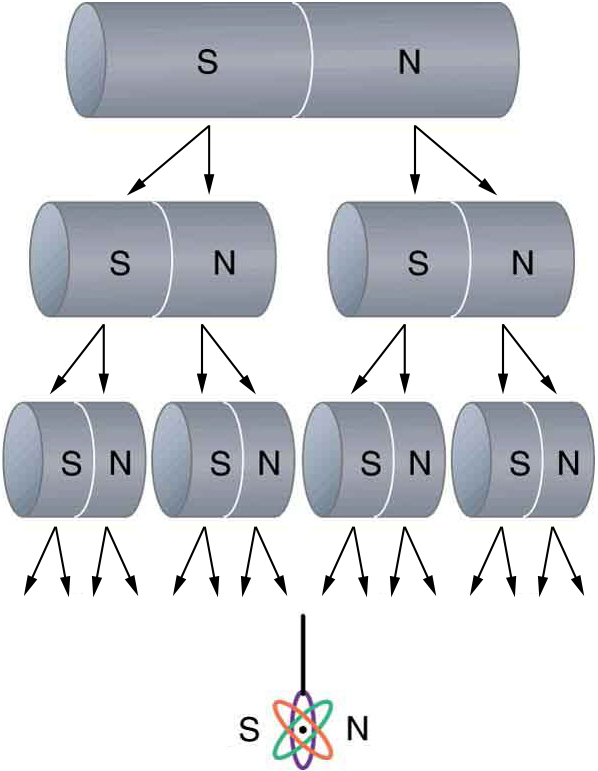

* Describe the difference between the north and south poles of a magnet.
* Describe how magnetic poles interact with each other.

 ."){: #import-auto-id1750359}

All magnets attract iron, such as that in a refrigerator door. However, magnets may attract or repel other magnets. Experimentation shows that all magnets have two poles. If freely suspended, one pole will point toward the north. The two poles are thus named the **north magnetic pole**{: data-type="term" #import-auto-id1655510} and the **south magnetic pole**{: data-type="term" #import-auto-id1413682} (or more properly, north-seeking and south-seeking poles, for the attractions in those directions).

Universal Characteristics of Magnets and Magnetic Poles

It is a universal characteristic of all magnets that *like poles repel and unlike poles attract*. (Note the similarity with electrostatics: unlike charges attract and like charges repel.)

Further experimentation shows that it is *impossible to separate north and south poles* in the manner that + and − charges can be separated.

 {: #import-auto-id945200}

Misconception Alert: Earth’s Geographic North Pole Hides an S

The Earth acts like a very large bar magnet with its south-seeking pole near the geographic North Pole. That is why the north pole of your compass is attracted toward the geographic north pole of the Earth—because the magnetic pole that is near the geographic North Pole is actually a south magnetic pole! Confusion arises because the geographic term “North Pole” has come to be used (incorrectly) for the magnetic pole that is near the North Pole. Thus, “North magnetic pole” is actually a misnomer—it should be called the South magnetic pole.

{: #import-auto-id2869574}

{: #import-auto-id1660354}

The fact that magnetic poles always occur in pairs of north and south is true from the very large scale—for example, sunspots always occur in pairs that are north and south magnetic poles—all the way down to the very small scale. Magnetic atoms have both a north pole and a south pole, as do many types of subatomic particles, such as electrons, protons, and neutrons.

Making Connections: Take-Home Experiment—Refrigerator Magnets

We know that like magnetic poles repel and unlike poles attract. See if you can show this for two refrigerator magnets. Will the magnets stick if you turn them over? Why do they stick to the door anyway? What can you say about the magnetic properties of the door next to the magnet? Do refrigerator magnets stick to metal or plastic spoons? Do they stick to all types of metal?

### Section Summary

* Magnetism is a subject that includes the properties of magnets, the effect of the magnetic force on moving charges and currents, and the creation of magnetic fields by currents.
* There are two types of magnetic poles, called the north magnetic pole and south magnetic pole.
* North magnetic poles are those that are attracted toward the Earth’s geographic north pole.
* Like poles repel and unlike poles attract.
* Magnetic poles always occur in pairs of north and south—it is not possible to isolate north and south poles.

### Conceptual Questions

Volcanic and other such activity at the mid-Atlantic ridge extrudes material to fill the gap between separating tectonic plates associated with continental drift. The magnetization of rocks is found to reverse in a coordinated manner with distance from the ridge. What does this imply about the Earth’s magnetic field and how could the knowledge of the spreading rate be used to give its historical record?

### Glossary
{: data-type="glossary-title"}

north magnetic pole
: the end or the side of a magnet that is attracted toward Earth’s geographic north pole
{: #import-auto-id1896961}

south magnetic pole
: the end or the side of a magnet that is attracted toward Earth’s geographic south pole
{: #import-auto-id2571598}

