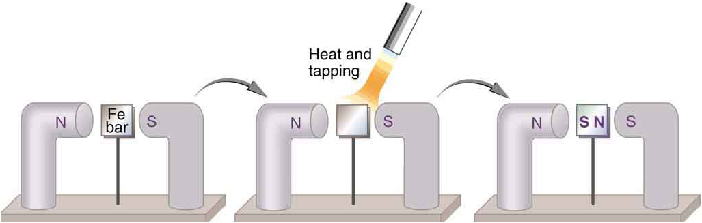
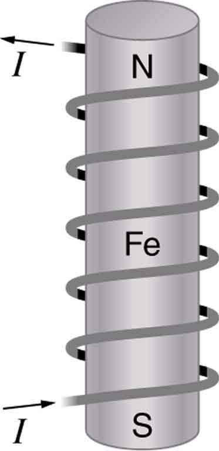

* Define ferromagnet.
* Describe the role of magnetic domains in magnetization.
* Explain the significance of the Curie temperature.
* Describe the relationship between electricity and magnetism.

### Ferromagnets

Only certain materials, such as iron, cobalt, nickel, and gadolinium, exhibit strong magnetic effects. Such materials are called **ferromagnetic**{: data-type="term" #import-auto-id1897071}, after the Latin word for iron, *ferrum*. A group of materials made from the alloys of the rare earth elements are also used as strong and permanent magnets; a popular one is neodymium. Other materials exhibit weak magnetic effects, which are detectable only with sensitive instruments. Not only do ferromagnetic materials respond strongly to magnets (the way iron is attracted to magnets), they can also be **magnetized**{: data-type="term" #import-auto-id1838766} themselves—that is, they can be induced to be magnetic or made into permanent magnets.

{: #import-auto-id2093834}

When a magnet is brought near a previously unmagnetized ferromagnetic material, it causes local magnetization of the material with unlike poles closest, as in [\[link\]](#import-auto-id2093834). (This results in the attraction of the previously unmagnetized material to the magnet.) What happens on a microscopic scale is illustrated in [\[link\]](#import-auto-id1455300). The regions within the material called **domains**{: data-type="term" #import-auto-id1726851} act like small bar magnets. Within domains, the poles of individual atoms are aligned. Each atom acts like a tiny bar magnet. Domains are small and randomly oriented in an unmagnetized ferromagnetic object. In response to an external magnetic field, the domains may grow to millimeter size, aligning themselves as shown in [\[link\]](#import-auto-id1455300)(b). This induced magnetization can be made permanent if the material is heated and then cooled, or simply tapped in the presence of other magnets.

  An unmagnetized piece of iron (or other ferromagnetic material) has randomly oriented domains. (b) When magnetized by an external field, the domains show greater alignment, and some grow at the expense of others. Individual atoms are aligned within domains; each atom acts like a tiny bar magnet."){: #import-auto-id1455300}

Conversely, a permanent magnet can be demagnetized by hard blows or by heating it in the absence of another magnet. Increased thermal motion at higher temperature can disrupt and randomize the orientation and the size of the domains. There is a well-defined temperature for ferromagnetic materials, which is called the **Curie temperature**{: data-type="term" #import-auto-id2259734}, above which they cannot be magnetized. The Curie temperature for iron is 1043 K <math xmlns="http://www.w3.org/1998/Math/MathML"><semantics><mrow><mrow><mrow><mo stretchy="false">(</mo><mtext>770ºC</mtext><mo stretchy="false">)</mo></mrow></mrow><mrow /></mrow><annotation encoding="StarMath 5.0"> size 12{ \( "770"°C \) } {}</annotation></semantics></math>

, which is well above room temperature. There are several elements and alloys that have Curie temperatures much lower than room temperature and are ferromagnetic only below those temperatures.

### Electromagnets

Early in the 19th century, it was discovered that electrical currents cause magnetic effects. The first significant observation was by the Danish scientist Hans Christian Oersted (1777–1851), who found that a compass needle was deflected by a current-carrying wire. This was the first significant evidence that the movement of charges had any connection with magnets. **Electromagnetism**{: data-type="term" #import-auto-id2206858} is the use of electric current to make magnets. These temporarily induced magnets are called **electromagnets**{: data-type="term" #import-auto-id1476064}. Electromagnets are employed for everything from a wrecking yard crane that lifts scrapped cars to controlling the beam of a 90-km-circumference particle accelerator to the magnets in medical imaging machines (See [\[link\]](#import-auto-id1455228)).

. The device uses a superconducting cylindrical coil for the main magnetic field. The patient goes into this &#x201C;tunnel&#x201D; on the gurney. (credit: Bill McChesney, Flickr)"){: #import-auto-id1455228}

[\[link\]](#import-auto-id2187290) shows that the response of iron filings to a current-carrying coil and to a permanent bar magnet. The patterns are similar. In fact, electromagnets and ferromagnets have the same basic characteristics—for example, they have north and south poles that cannot be separated and for which like poles repel and unlike poles attract.

 ![The arrangement of iron filings as they are affected by a metal coil that is carrying an electric current and a bar magnet. At the poles of the magnet, the filings are aligned radially to the poles. Between the poles, the filings are roughly parallel to the magnet. Thus, from one pole to the other, the filings have an arcuate arrangement. The density of filings is very high at the poles and relatively low on either side of the center of the magnet. The arrangement is similar around the current-carrying coil.](../resources/Figure_23_02_04a1.jpg "Iron filings near (a) a current-carrying coil and (b) a magnet act like tiny compass needles, showing the shape of their fields. Their response to a current-carrying coil and a permanent magnet is seen to be very similar, especially near the ends of the coil and the magnet."){: #import-auto-id2187290}

Combining a ferromagnet with an electromagnet can produce particularly strong magnetic effects. (See [\[link\]](#import-auto-id2579978).) Whenever strong magnetic effects are needed, such as lifting scrap metal, or in particle accelerators, electromagnets are enhanced by ferromagnetic materials. Limits to how strong the magnets can be made are imposed by coil resistance (it will overheat and melt at sufficiently high current), and so superconducting magnets may be employed. These are still limited, because superconducting properties are destroyed by too great a magnetic field.

 {: #import-auto-id2579978}

[\[link\]](#import-auto-id1208199) shows a few uses of combinations of electromagnets and ferromagnets. Ferromagnetic materials can act as memory devices, because the orientation of the magnetic fields of small domains can be reversed or erased. Magnetic information storage on videotapes and computer hard drives are among the most common applications. This property is vital in our digital world.

; in other applications, it can be analog (with a varying strength), such as on audiotapes."){: #import-auto-id1208199}

### Current: The Source of All Magnetism

An electromagnet creates magnetism with an electric current. In later sections we explore this more quantitatively, finding the strength and direction of magnetic fields created by various currents. But what about ferromagnets? [\[link\]](#import-auto-id2071727) shows models of how electric currents create magnetism at the submicroscopic level. (Note that we cannot directly observe the paths of individual electrons about atoms, and so a model or visual image, consistent with all direct observations, is made. We can directly observe the electron’s orbital angular momentum, its spin momentum, and subsequent magnetic moments, all of which are explained with electric-current-creating subatomic magnetism.) Currents, including those associated with other submicroscopic particles like protons, allow us to explain ferromagnetism and all other magnetic effects. Ferromagnetism, for example, results from an internal cooperative alignment of electron spins, possible in some materials but not in others.

Crucial to the statement that electric current is the source of all magnetism is the fact that it is impossible to separate north and south magnetic poles. (This is far different from the case of positive and negative charges, which are easily separated.) A current loop always produces a magnetic dipole—that is, a magnetic field that acts like a north pole and south pole pair. Since isolated north and south magnetic poles, called **magnetic monopoles**{: data-type="term" #import-auto-id1524979}, are not observed, currents are used to explain all magnetic effects. If magnetic monopoles did exist, then we would have to modify this underlying connection that all magnetism is due to electrical current. There is no known reason that magnetic monopoles should not exist—they are simply never observed—and so searches at the subnuclear level continue. If they do *not* exist, we would like to find out why not. If they *do* exist, we would like to see evidence of them.

Electric Currents and Magnetism

Electric current is the source of all magnetism.

  In the planetary model of the atom, an electron orbits a nucleus, forming a closed-current loop and producing a magnetic field with a north pole and a south pole. (b) Electrons have spin and can be crudely pictured as rotating charge, forming a current that produces a magnetic field with a north pole and a south pole. Neither the planetary model nor the image of a spinning electron is completely consistent with modern physics. However, they do provide a useful way of understanding phenomena. "){: #import-auto-id2071727}

PhET Explorations: Magnets and Electromagnets

Explore the interactions between a compass and bar magnet. Discover how you can use a battery and wire to make a magnet! Can you make it a stronger magnet? Can you make the magnetic field reverse?* * *
{: data-type="newline"}

<iframe width="660" height="371.4" src="https://archive.cnx.org/specials/92176000-ae74-11e5-baad-cfab91c15075/magnets-and-electromagnets/#sim-bar-magnet"></iframe>

### Section Summary

* Magnetic poles always occur in pairs of north and south—it is not possible to isolate north and south poles.
* All magnetism is created by electric current.
* Ferromagnetic materials, such as iron, are those that exhibit strong magnetic effects.
* The atoms in ferromagnetic materials act like small magnets (due to currents within the atoms) and can be aligned, usually in millimeter-sized regions called domains.
* Domains can grow and align on a larger scale, producing permanent magnets. Such a material is magnetized, or induced to be magnetic.
* Above a material’s Curie temperature, thermal agitation destroys the alignment of atoms, and ferromagnetism disappears.
* Electromagnets employ electric currents to make magnetic fields, often aided by induced fields in ferromagnetic materials.

### Glossary
{: data-type="glossary-title"}

ferromagnetic
: materials, such as iron, cobalt, nickel, and gadolinium, that exhibit strong magnetic effects
{: #import-auto-id1414415}

magnetized
: to be turned into a magnet; to be induced to be magnetic
{: #import-auto-id2660247}

domains
: regions within a material that behave like small bar magnets
{: #import-auto-id1889261}

Curie temperature
: the temperature above which a ferromagnetic material cannot be magnetized
{: #import-auto-id1891865}

electromagnetism
: the use of electrical currents to induce magnetism
{: #import-auto-id1115141}

electromagnet
: an object that is temporarily magnetic when an electrical current is passed through it
{: #import-auto-id1493258}

magnetic monopoles
: an isolated magnetic pole; a south pole without a north pole, or vice versa (no magnetic monopole has ever been observed)
{: #import-auto-id1508672}

