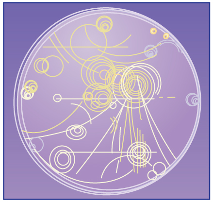

* Describe the effects of a magnetic field on a moving charge.
* Calculate the radius of curvature of the path of a charge that is moving in a magnetic field.

Magnetic force can cause a charged particle to move in a circular or spiral path. Cosmic rays are energetic charged particles in outer space, some of which approach the Earth. They can be forced into spiral paths by the Earth’s magnetic field. Protons in giant accelerators are kept in a circular path by magnetic force. The bubble chamber photograph in [\[link\]](#import-auto-id1499498) shows charged particles moving in such curved paths. The curved paths of charged particles in magnetic fields are the basis of a number of phenomena and can even be used analytically, such as in a mass spectrometer.

{: #import-auto-id1499498}

So does the magnetic force cause circular motion? Magnetic force is always perpendicular to velocity, so that it does no work on the charged particle. The particle’s kinetic energy and speed thus remain constant. The direction of motion is affected, but not the speed. This is typical of uniform circular motion. The simplest case occurs when a charged particle moves perpendicular to a uniform <math xmlns="http://www.w3.org/1998/Math/MathML"><semantics><mrow><mrow><mi>B</mi></mrow><mrow /></mrow><annotation encoding="StarMath 5.0"> size 12{B} {}</annotation></semantics></math>

-field, such as shown in [\[link\]](#import-auto-id1898240). (If this takes place in a vacuum, the magnetic field is the dominant factor determining the motion.) Here, the magnetic force supplies the centripetal force <math xmlns="http://www.w3.org/1998/Math/MathML"><semantics><mrow><mrow><mrow><msub><mi>F</mi><mrow><mn>c</mn></mrow></msub><mo stretchy="false">=</mo><mrow><mstyle><mrow><msup><mtext fontstyle="italic">mv</mtext><mrow><mn>2</mn></mrow></msup></mrow></mstyle><mo stretchy="false">/</mo><mi>r</mi></mrow></mrow></mrow><mrow /></mrow><annotation encoding="StarMath 5.0"> size 12{F rSub { size 8{c} } = ital "mv" rSup { size 8{2} } /r} {}</annotation></semantics></math>

. Noting that <math xmlns="http://www.w3.org/1998/Math/MathML"><semantics><mrow><mrow><mrow><mtext>sin</mtext><mspace width="0.25em" /><mrow><mi>θ</mi><mo stretchy="false">=</mo><mn>1</mn></mrow></mrow></mrow><mrow /></mrow><annotation encoding="StarMath 5.0"> size 12{"sin"θ=1} {}</annotation></semantics></math>

, we see that <math xmlns="http://www.w3.org/1998/Math/MathML"><semantics><mrow><mrow><mrow><mi>F</mi><mo stretchy="false">=</mo><mstyle fontstyle="italic"><mrow><mtext>qvB</mtext></mrow></mstyle></mrow></mrow><mrow /></mrow><annotation encoding="StarMath 5.0"> size 12{F= ital "qvB"} {}</annotation></semantics></math>

.

. The magnetic force is perpendicular to the velocity, and so velocity changes in direction but not magnitude. Uniform circular motion results."){: #import-auto-id1898240}

Because the magnetic force <math xmlns="http://www.w3.org/1998/Math/MathML"><semantics><mrow><mrow><mi>F</mi></mrow><mrow /></mrow><annotation encoding="StarMath 5.0"> size 12{F} {}</annotation></semantics></math>

** supplies the centripetal force <math xmlns="http://www.w3.org/1998/Math/MathML"><semantics><mrow><mrow><msub><mi>F</mi><mrow><mn>c</mn></mrow></msub></mrow><mrow /></mrow><annotation encoding="StarMath 5.0"> size 12{F rSub { size 8{c} } } {}</annotation></semantics></math>

, we have

<math xmlns="http://www.w3.org/1998/Math/MathML"> <semantics> <mrow> <mrow> <mrow> <mrow> <mstyle fontstyle="italic"> <mrow> <mtext>qvB</mtext> </mrow> </mstyle> <mo stretchy="false">=</mo> <mfrac> <mstyle> <mrow> <msup> <mtext fontstyle="italic">mv</mtext> <mrow> <mn>2</mn> </mrow> </msup> </mrow> </mstyle> <mi>r</mi> </mfrac> </mrow> <mtext>.</mtext> </mrow> </mrow> <mrow /> </mrow> <annotation encoding="StarMath 5.0"> size 12{ ital "qvB"= { { ital "mv" rSup { size 8{2} } } over {r} } "." } {}</annotation> </semantics> </math>

Solving for <math xmlns="http://www.w3.org/1998/Math/MathML"><semantics><mrow><mrow><mi>r</mi></mrow><mrow /></mrow><annotation encoding="StarMath 5.0"> size 12{r} {}</annotation></semantics></math>

 yields

<math xmlns="http://www.w3.org/1998/Math/MathML"> <semantics> <mrow> <mrow> <mrow> <mrow> <mi>r</mi> <mo stretchy="false">=</mo> <mfrac> <mstyle fontstyle="italic"> <mrow> <mtext>mv</mtext> </mrow> </mstyle> <mstyle fontstyle="italic"> <mrow> <mtext>qB</mtext> </mrow> </mstyle> </mfrac> </mrow> <mtext>.</mtext> </mrow> </mrow> <mrow /> </mrow> <annotation encoding="StarMath 5.0"> size 12{r= { { ital "mv"} over { ital "qB"} } "." } {}</annotation> </semantics> </math>

Here, <math xmlns="http://www.w3.org/1998/Math/MathML"><semantics><mrow><mrow><mi>r</mi></mrow><mrow /></mrow><annotation encoding="StarMath 5.0"> size 12{r} {}</annotation></semantics></math>

 is the radius of curvature of the path of a charged particle with mass <math xmlns="http://www.w3.org/1998/Math/MathML"><semantics><mrow><mrow><mi>m</mi></mrow><mrow /></mrow><annotation encoding="StarMath 5.0"> size 12{m} {}</annotation></semantics></math>

 and charge <math xmlns="http://www.w3.org/1998/Math/MathML"><semantics><mrow><mrow><mi>q</mi></mrow><mrow /></mrow><annotation encoding="StarMath 5.0"> size 12{q} {}</annotation></semantics></math>

, moving at a speed <math xmlns="http://www.w3.org/1998/Math/MathML"><semantics><mrow><mrow><mi>v</mi></mrow><mrow /></mrow><annotation encoding="StarMath 5.0"> size 12{v} {}</annotation></semantics></math>

 perpendicular to a magnetic field of strength <math xmlns="http://www.w3.org/1998/Math/MathML"><semantics><mrow><mrow><mi>B</mi></mrow><mrow /></mrow><annotation encoding="StarMath 5.0"> size 12{B} {}</annotation></semantics></math>

. If the velocity is not perpendicular to the magnetic field, then <math xmlns="http://www.w3.org/1998/Math/MathML"><semantics><mrow><mrow><mi>v</mi></mrow><mrow /></mrow><annotation encoding="StarMath 5.0"> size 12{v} {}</annotation></semantics></math>

 is the component of the velocity perpendicular to the field. The component of the velocity parallel to the field is unaffected, since the magnetic force is zero for motion parallel to the field. This produces a spiral motion rather than a circular one.

Calculating the Curvature of the Path of an Electron Moving in a Magnetic Field: A Magnet on a TV Screen

A magnet brought near an old-fashioned TV screen such as in [\[link\]](#import-auto-id1233890) (TV sets with cathode ray tubes instead of LCD screens) severely distorts its picture by altering the path of the electrons that make its phosphors glow. ***(Don’t try this at home, as it will permanently magnetize and ruin the TV.)*** To illustrate this, calculate the radius of curvature of the path of an electron having a velocity of <math xmlns="http://www.w3.org/1998/Math/MathML"><semantics><mrow><mrow><mrow><mn>6</mn><mtext>.</mtext><mrow><mtext>00</mtext><mo stretchy="false">×</mo><msup><mtext>10</mtext><mrow><mn>7</mn></mrow></msup></mrow><mspace width="0.25em" /><mtext>m/s</mtext></mrow></mrow><mrow /></mrow><annotation encoding="StarMath 5.0"> size 12{6 "." "00" times "10" rSup { size 8{7} } `"m/s"} {}</annotation></semantics></math>

 (corresponding to the accelerating voltage of about 10.0 kV used in some TVs) perpendicular to a magnetic field of strength <math xmlns="http://www.w3.org/1998/Math/MathML"><semantics><mrow><mrow><mrow><mrow><mi>B</mi><mo stretchy="false">=</mo><mn>0</mn></mrow><mtext>.500 T</mtext></mrow></mrow><mrow /></mrow><annotation encoding="StarMath 5.0"> size 12{B=0 "." "500" T} {}</annotation></semantics></math>

 (obtainable with permanent magnets).

{: #import-auto-id1233890}

**Strategy**

We can find the radius of curvature <math xmlns="http://www.w3.org/1998/Math/MathML"><semantics><mrow><mrow><mi>r</mi></mrow><mrow /></mrow></semantics></math>

 directly from the equation <math xmlns="http://www.w3.org/1998/Math/MathML"> <semantics> <mrow> <mrow> <mrow> <mi>r</mi> <mo stretchy="false">=</mo> <mfrac> <mrow> <mi>m</mi> <mi>v</mi> </mrow> <mrow> <mi>q</mi> <mi>B</mi> </mrow> </mfrac> </mrow> </mrow> </mrow> </semantics> </math>

, since all other quantities in it are given or known.

**Solution**

Using known values for the mass and charge of an electron, along with the given values of <math xmlns="http://www.w3.org/1998/Math/MathML"><semantics><mrow><mrow><mi>v</mi></mrow><mrow /></mrow><annotation encoding="StarMath 5.0"> size 12{v} {}</annotation></semantics></math>

 and <math xmlns="http://www.w3.org/1998/Math/MathML"><semantics><mrow><mrow><mi>B</mi></mrow><mrow /></mrow><annotation encoding="StarMath 5.0"> size 12{B} {}</annotation></semantics></math>

 gives us

<math xmlns="http://www.w3.org/1998/Math/MathML"> <semantics> <mrow> <mrow> <mtable columnalign="left"> <mtr> <mtd> <mi>r</mi> <mo stretchy="false">=</mo> <mfrac> <mstyle fontstyle="italic"> <mrow> <mtext>mv</mtext> </mrow> </mstyle> <mstyle fontstyle="italic"> <mrow> <mtext>qB</mtext> </mrow> </mstyle> </mfrac> </mtd> <mtd> <mo stretchy="false">=</mo> </mtd> <mtd> <mfrac> <mrow> <mfenced open="(" close=")"> <mrow> <mn>9</mn> <mtext>.</mtext> <mrow> <mtext>11</mtext> <mo stretchy="false">×</mo> <msup> <mtext>10</mtext> <mrow> <mrow> <mo stretchy="false">−</mo> <mtext>31</mtext> </mrow> </mrow> </msup> </mrow> <mspace width="0.25em" /> <mtext>kg</mtext> </mrow> </mfenced> <mfenced open="(" close=")"> <mrow> <mn>6</mn> <mtext>.</mtext> <mrow> <mtext>00</mtext> <mo stretchy="false">×</mo> <msup> <mtext>10</mtext> <mrow> <mn>7</mn> </mrow> </msup> </mrow> <mspace width="0.25em" /> <mtext>m/s</mtext> </mrow> </mfenced> </mrow> <mrow> <mfenced open="(" close=")"> <mrow> <mn>1</mn> <mtext>.</mtext> <mrow> <mtext>60</mtext> <mo stretchy="false">×</mo> <msup> <mtext>10</mtext> <mrow> <mrow> <mo stretchy="false">−</mo> <mtext>19</mtext> </mrow> </mrow> </msup> </mrow> <mspace width="0.25em" /> <mtext>C</mtext> </mrow> </mfenced> <mfenced open="(" close=")"> <mrow> <mn>0</mn> <mtext>.</mtext> <mtext>500</mtext> <mspace width="0.25em" /> <mtext>T</mtext> </mrow> </mfenced> </mrow> </mfrac> </mtd> </mtr> <mtr> <mtd /> <mtd><mo stretchy="false">=</mo></mtd> <mtd> <mrow> <mrow /> <mn>6</mn> <mtext>.</mtext> <mrow> <mtext>83</mtext> <mo stretchy="false">×</mo> <msup> <mtext>10</mtext> <mrow> <mrow> <mo stretchy="false">−</mo> <mn>4</mn> </mrow> </mrow> </msup> </mrow> <mspace width="0.25em" /> <mtext>m</mtext> <mrow /> </mrow> </mtd> </mtr> </mtable> <mrow /> </mrow> </mrow> <annotation encoding="StarMath 5.0">alignl { stack { size 12{r= { { ital "mv"} over { ital "qB"} } = { { left (9 "." "11" times "10" rSup { size 8{ - "31"} } `"kg" right ) left (6 "." "00" times "10" rSup { size 8{7} } `"m/s" right )} over { left (1 "." "60" times "10" rSup { size 8{ - "19"} } `C right ) left (0 "." "500"`T right )} } } {} # =6 "." "83" times "10" rSup { size 8{ - 4} } `m {} } } {}</annotation> </semantics> </math>

or

<math xmlns="http://www.w3.org/1998/Math/MathML"><semantics><mrow><mrow><mrow><mrow><mi>r</mi><mo stretchy="false">=</mo><mn>0</mn></mrow><mtext>.</mtext><mtext>683 mm</mtext></mrow><mo>.</mo></mrow><mrow /></mrow><annotation encoding="StarMath 5.0"> size 12{r=0 "." "683"" mm"} {}</annotation></semantics></math>

**Discussion**

The small radius indicates a large effect. The electrons in the TV picture tube are made to move in very tight circles, greatly altering their paths and distorting the image.

[\[link\]](#import-auto-id2565110) shows how electrons not moving perpendicular to magnetic field lines follow the field lines. The component of velocity parallel to the lines is unaffected, and so the charges spiral along the field lines. If field strength increases in the direction of motion, the field will exert a force to slow the charges, forming a kind of magnetic mirror, as shown below.

{: #import-auto-id2565110}

The properties of charged particles in magnetic fields are related to such different things as the Aurora Australis or Aurora Borealis and particle accelerators. *Charged particles approaching magnetic field lines may get trapped in spiral orbits about the lines rather than crossing them*, as seen above. Some cosmic rays, for example, follow the Earth’s magnetic field lines, entering the atmosphere near the magnetic poles and causing the southern or northern lights through their ionization of molecules in the atmosphere. This glow of energized atoms and molecules is seen in [\[link\]](/m42365#import-auto-id1909198). Those particles that approach middle latitudes must cross magnetic field lines, and many are prevented from penetrating the atmosphere. Cosmic rays are a component of background radiation; consequently, they give a higher radiation dose at the poles than at the equator.

"){: #import-auto-id1796004}

Some incoming charged particles become trapped in the Earth’s magnetic field, forming two belts above the atmosphere known as the Van Allen radiation belts after the discoverer James A. Van Allen, an American astrophysicist. (See [\[link\]](#import-auto-id1912925).) Particles trapped in these belts form radiation fields (similar to nuclear radiation) so intense that manned space flights avoid them and satellites with sensitive electronics are kept out of them. In the few minutes it took lunar missions to cross the Van Allen radiation belts, astronauts received radiation doses more than twice the allowed annual exposure for radiation workers. Other planets have similar belts, especially those having strong magnetic fields like Jupiter.

{: #import-auto-id1912925}

Back on Earth, we have devices that employ magnetic fields to contain charged particles. Among them are the giant particle accelerators that have been used to explore the substructure of matter. (See [\[link\]](#import-auto-id1516062).) Magnetic fields not only control the direction of the charged particles, they also are used to focus particles into beams and overcome the repulsion of like charges in these beams.

  that employs magnetic fields (magnets seen here in orange) to contain and direct its beam. This and other accelerators have been in use for several decades and have allowed us to discover some of the laws underlying all matter. (credit: ammcrim, Flickr)"){: #import-auto-id1516062}

Thermonuclear fusion (like that occurring in the Sun) is a hope for a future clean energy source. One of the most promising devices is the *tokamak*, which uses magnetic fields to contain (or trap) and direct the reactive charged particles. (See [\[link\]](#import-auto-id1697141).) Less exotic, but more immediately practical, amplifiers in microwave ovens use a magnetic field to contain oscillating electrons. These oscillating electrons generate the microwaves sent into the oven.

"){: #import-auto-id1697141}

Mass spectrometers have a variety of designs, and many use magnetic fields to measure mass. The curvature of a charged particle’s path in the field is related to its mass and is measured to obtain mass information. (See [More Applications of Magnetism](/m42388).) Historically, such techniques were employed in the first direct observations of electron charge and mass. Today, mass spectrometers (sometimes coupled with gas chromatographs) are used to determine the make-up and sequencing of large biological molecules.

# Section Summary

* Magnetic force can supply centripetal force and cause a charged particle to move in a circular path of radius
  

  <math xmlns="http://www.w3.org/1998/Math/MathML"> <semantics> <mrow> <mrow> <mrow> <mrow> <mi>r</mi> <mo stretchy="false">=</mo> <mfrac> <mstyle fontstyle="italic"> <mrow> <mtext>mv</mtext> </mrow> </mstyle> <mstyle fontstyle="italic"> <mrow> <mtext>qB</mtext> </mrow> </mstyle> </mfrac> </mrow> <mi>,</mi> </mrow> </mrow> <mrow /> </mrow> <annotation encoding="StarMath 5.0"> size 12{r= { { ital "mv"} over { ital "qB"} } ,} {}</annotation> </semantics> </math>
  

  
  where
  <math xmlns="http://www.w3.org/1998/Math/MathML"><semantics><mrow><mrow><mi>v</mi></mrow><mrow /></mrow><annotation encoding="StarMath 5.0"> size 12{v} {}</annotation></semantics></math>
  
  is the component of the velocity perpendicular to
  <math xmlns="http://www.w3.org/1998/Math/MathML"><semantics><mrow><mrow><mi>B</mi></mrow><mrow /></mrow><annotation encoding="StarMath 5.0"> size 12{B} {}</annotation></semantics></math>
  
  for a charged particle with mass *<math xmlns="http://www.w3.org/1998/Math/MathML"><semantics><mrow><mrow><mi>m</mi></mrow><mrow /></mrow><annotation encoding="StarMath 5.0"> size 12{m} {}</annotation></semantics></math>
  
  * and charge *<math xmlns="http://www.w3.org/1998/Math/MathML"><semantics><mrow><mrow><mi>q</mi></mrow><mrow /></mrow><annotation encoding="StarMath 5.0"> size 12{q} {}</annotation></semantics></math>
  
  *.

# Conceptual Questions

How can the motion of a charged particle be used to distinguish between a magnetic and an electric field?

High-velocity charged particles can damage biological cells and are a component of radiation exposure in a variety of locations ranging from research facilities to natural background. Describe how you could use a magnetic field to shield yourself.

If a cosmic ray proton approaches the Earth from outer space along a line toward the center of the Earth that lies in the plane of the equator, in what direction will it be deflected by the Earth’s magnetic field? What about an electron? A neutron?

What are the signs of the charges on the particles in [[link]](#import-auto-id2026635)?

{: #import-auto-id2026635}

Which of the particles in [[link]](#import-auto-id2208173) has the greatest velocity, assuming they have identical charges and masses?

{: #import-auto-id2208173}

Which of the particles in [[link]](#import-auto-id2208173) has the greatest mass, assuming all have identical charges and velocities?

While operating, a high-precision TV monitor is placed on its side during maintenance. The image on the monitor changes color and blurs slightly. Discuss the possible relation of these effects to the Earth’s magnetic field.

# Problems &amp; Exercises

If you need additional support for these problems, see [More Applications of Magnetism](/m42388).

A cosmic ray electron moves at <math xmlns="http://www.w3.org/1998/Math/MathML"><semantics><mrow><mrow><mrow><mn>7</mn><mtext>.</mtext><mrow><mtext>50</mtext><mo stretchy="false">×</mo><msup><mtext>10</mtext><mrow><mn>6</mn></mrow></msup></mrow><mspace width="0.25em" /><mtext>m/s</mtext></mrow></mrow><mrow /></mrow><annotation encoding="StarMath 5.0"> size 12{7 "." "50" times "10" rSup { size 8{6} } `"m/s"} {}</annotation></semantics></math>

 perpendicular to the Earth’s magnetic field at an altitude where field strength is <math xmlns="http://www.w3.org/1998/Math/MathML"><semantics><mrow><mrow><mrow><mn>1</mn><mtext>.</mtext><mrow><mtext>00</mtext><mo stretchy="false">×</mo><msup><mtext>10</mtext><mrow><mrow><mo stretchy="false">−</mo><mn>5</mn></mrow></mrow></msup><mspace width="0.25em" /></mrow><mspace width="0.25em" /><mn>T</mn></mrow></mrow><mrow /></mrow><annotation encoding="StarMath 5.0"> size 12{1 "." "00" times "10" rSup { size 8{ - 5} } `T} {}</annotation></semantics></math>

. What is the radius of the circular path the electron follows?

4\.27 m

A proton moves at <math xmlns="http://www.w3.org/1998/Math/MathML"><semantics><mrow><mrow><mrow><mn>7</mn><mtext>.</mtext><mrow><mtext>50</mtext><mo stretchy="false">×</mo><msup><mtext>10</mtext><mrow><mn>7</mn></mrow></msup></mrow><mspace width="0.25em" /><mtext>m/s</mtext></mrow></mrow><mrow /></mrow><annotation encoding="StarMath 5.0"> size 12{7 "." "50" times "10" rSup { size 8{7} } `"m/s"} {}</annotation></semantics></math>

 perpendicular to a magnetic field. The field causes the proton to travel in a circular path of radius 0.800 m. What is the field strength?

(a) Viewers of *Star Trek* hear of an antimatter drive on the Starship *Enterprise*. One possibility for such a futuristic energy source is to store antimatter charged particles in a vacuum chamber, circulating in a magnetic field, and then extract them as needed. Antimatter annihilates with normal matter, producing pure energy. What strength magnetic field is needed to hold antiprotons, moving at <math xmlns="http://www.w3.org/1998/Math/MathML"><semantics><mrow><mrow><mrow><mn>5</mn><mtext>.</mtext><mrow><mtext>00</mtext><mo stretchy="false">×</mo><msup><mtext>10</mtext><mrow><mn>7</mn></mrow></msup></mrow><mspace width="0.25em" /><mtext>m/s</mtext></mrow></mrow><mrow /></mrow><annotation encoding="StarMath 5.0"> size 12{5 "." "00" times "10" rSup { size 8{7} } `"m/s"} {}</annotation></semantics></math>

 in a circular path 2.00 m in radius? Antiprotons have the same mass as protons but the opposite (negative) charge. (b) Is this field strength obtainable with today’s technology or is it a futuristic possibility?

(a) 0.261 T

(b) This strength is definitely obtainable with today’s technology. Magnetic field strengths of 0.500 T are obtainable with permanent magnets.

(a) An oxygen-16 ion with a mass of <math xmlns="http://www.w3.org/1998/Math/MathML"><semantics><mrow><mrow><mrow><mn>2</mn><mtext>.</mtext><mrow><mtext>66</mtext><mo stretchy="false">×</mo><msup><mtext>10</mtext><mrow><mrow><mo stretchy="false">−</mo><mtext>26</mtext></mrow></mrow></msup></mrow><mspace width="0.25em" /><mtext>kg</mtext></mrow></mrow><mrow /></mrow><annotation encoding="StarMath 5.0"> size 12{2 "." "66" times "10" rSup { size 8{ - "26"} } `"kg"} {}</annotation></semantics></math>

 travels at <math xmlns="http://www.w3.org/1998/Math/MathML"><semantics><mrow><mrow><mrow><mn>5</mn><mtext>.</mtext><mrow><mtext>00</mtext><mo stretchy="false">×</mo><msup><mtext>10</mtext><mrow><mn>6</mn></mrow></msup></mrow><mspace width="0.25em" /><mtext>m/s</mtext></mrow></mrow><mrow /></mrow><annotation encoding="StarMath 5.0"> size 12{5 "." "00" times "10" rSup { size 8{6} } `"m/s"} {}</annotation></semantics></math>

 perpendicular to a 1.20-T magnetic field, which makes it move in a circular arc with a 0.231-m radius. What positive charge is on the ion? (b) What is the ratio of this charge to the charge of an electron? (c) Discuss why the ratio found in (b) should be an integer.

What radius circular path does an electron travel if it moves at the same speed and in the same magnetic field as the proton in [[link]](#fs-id1347796)?

<math xmlns="http://www.w3.org/1998/Math/MathML"> <semantics> <mrow> <mrow> <mrow> <mn>4</mn> <mtext>.</mtext> <mrow> <mtext>36</mtext> <mo stretchy="false">×</mo> <msup> <mtext>10</mtext> <mrow> <mrow> <mo stretchy="false">−</mo> <mn>4</mn> </mrow> </mrow> </msup> </mrow><mspace width="0.25em" /> <mtext> m</mtext> </mrow> </mrow> <mrow /> </mrow> <annotation encoding="StarMath 5.0"> size 12{4 "." "36" times "10" rSup { size 8{ - 4} } " m"} {}</annotation> </semantics> </math>

A velocity selector in a mass spectrometer uses a 0.100-T magnetic field. (a) What electric field strength is needed to select a speed of <math xmlns="http://www.w3.org/1998/Math/MathML"><semantics><mrow><mrow><mrow><mn>4</mn><mtext>.</mtext><mrow><mtext>00</mtext><mo stretchy="false">×</mo><msup><mtext>10</mtext><mrow><mn>6</mn></mrow></msup></mrow><mi /><mspace width="0.25em" /><mtext>m/s</mtext></mrow></mrow><mrow /></mrow><annotation encoding="StarMath 5.0"> size 12{4 "." "00" times "10" rSup { size 8{6} } `"m/s"} {}</annotation></semantics></math>

? (b) What is the voltage between the plates if they are separated by 1.00 cm?

An electron in a TV CRT moves with a speed of <math xmlns="http://www.w3.org/1998/Math/MathML"><semantics><mrow><mrow><mrow><mn>6</mn><mtext>.</mtext><mrow><mtext>00</mtext><mo stretchy="false">×</mo><msup><mtext>10</mtext><mrow><mn>7</mn></mrow></msup></mrow><mspace width="0.25em" /><mtext>m/s</mtext></mrow></mrow><mrow /></mrow><annotation encoding="StarMath 5.0"> size 12{6 "." "00" times "10" rSup { size 8{7} } `"m/s"} {}</annotation></semantics></math>

, in a direction perpendicular to the Earth’s field, which has a strength of <math xmlns="http://www.w3.org/1998/Math/MathML"><semantics><mrow><mrow><mrow><mn>5</mn><mtext>.</mtext><mrow><mtext>00</mtext><mo stretchy="false">×</mo><msup><mtext>10</mtext><mrow><mrow><mo stretchy="false">−</mo><mn>5</mn></mrow></mrow></msup></mrow><mspace width="0.25em" /><mn>T</mn></mrow></mrow><mrow /></mrow><annotation encoding="StarMath 5.0"> size 12{5 "." "00" times "10" rSup { size 8{ - 5} } `T} {}</annotation></semantics></math>

. (a) What strength electric field must be applied perpendicular to the Earth’s field to make the electron moves in a straight line? (b) If this is done between plates separated by 1.00 cm, what is the voltage applied? (Note that TVs are usually surrounded by a ferromagnetic material to shield against external magnetic fields and avoid the need for such a correction.)

(a) 3.00 kV/m

(b) 30.0 V

(a) At what speed will a proton move in a circular path of the same radius as the electron in [[link]](#fs-id1702844)? (b) What would the radius of the path be if the proton had the same speed as the electron? (c) What would the radius be if the proton had the same kinetic energy as the electron? (d) The same momentum?

A mass spectrometer is being used to separate common oxygen-16 from the much rarer oxygen-18, taken from a sample of old glacial ice. (The relative abundance of these oxygen isotopes is related to climatic temperature at the time the ice was deposited.) The ratio of the masses of these two ions is 16 to 18, the mass of oxygen-16 is <math xmlns="http://www.w3.org/1998/Math/MathML"><semantics><mrow><mrow><mrow><mn>2</mn><mtext>.</mtext><mrow><mtext>66</mtext><mo stretchy="false">×</mo><msup><mtext>10</mtext><mrow><mrow><mo stretchy="false">−</mo><mtext>26</mtext></mrow></mrow></msup></mrow><mspace width="0.25em" /><mtext>kg</mtext><mo>,</mo></mrow></mrow><mrow /></mrow><annotation encoding="StarMath 5.0"> size 12{2 "." "66" times "10" rSup { size 8{ - "26"} } `"kg"} {}</annotation></semantics></math>

 and they are singly charged and travel at <math xmlns="http://www.w3.org/1998/Math/MathML"><semantics><mrow><mrow><mrow><mn>5</mn><mtext>.</mtext><mrow><mtext>00</mtext><mo stretchy="false">×</mo><msup><mtext>10</mtext><mrow><mn>6</mn></mrow></msup></mrow><mspace width="0.25em" /><mtext>m/s</mtext></mrow></mrow><mrow /></mrow><annotation encoding="StarMath 5.0"> size 12{5 "." "00" times "10" rSup { size 8{6} } `"m/s"} {}</annotation></semantics></math>

 in a 1.20-T magnetic field. What is the separation between their paths when they hit a target after traversing a semicircle?

0\.173 m

(a) Triply charged uranium-235 and uranium-238 ions are being separated in a mass spectrometer. (The much rarer uranium-235 is used as reactor fuel.) The masses of the ions are <math xmlns="http://www.w3.org/1998/Math/MathML"><semantics><mrow><mrow><mrow><mn>3</mn><mtext>.</mtext><mrow><mtext>90</mtext><mo stretchy="false">×</mo><msup><mtext>10</mtext><mrow><mrow><mo stretchy="false">−</mo><mtext>25</mtext></mrow></mrow></msup></mrow><mspace width="0.25em" /><mtext>kg</mtext></mrow></mrow><mrow /></mrow><annotation encoding="StarMath 5.0"> size 12{3 "." "90" times "10" rSup { size 8{ - "25"} } `"kg"} {}</annotation></semantics></math>

 and <math xmlns="http://www.w3.org/1998/Math/MathML"><semantics><mrow><mrow><mrow><mn>3</mn><mtext>.</mtext><mrow><mtext>95</mtext><mo stretchy="false">×</mo><msup><mtext>10</mtext><mrow><mrow><mo stretchy="false">−</mo><mtext>25</mtext></mrow></mrow></msup></mrow><mspace width="0.25em" /><mtext>kg</mtext></mrow></mrow><mrow /></mrow><annotation encoding="StarMath 5.0"> size 12{3 "." "95" times "10" rSup { size 8{ - "25"} } `"kg"} {}</annotation></semantics></math>

, respectively, and they travel at <math xmlns="http://www.w3.org/1998/Math/MathML"><semantics><mrow><mrow><mrow><mn>3</mn><mtext>.</mtext><mrow><mtext>00</mtext><mo stretchy="false">×</mo><msup><mtext>10</mtext><mrow><mn>5</mn></mrow></msup></mrow><mspace width="0.25em" /><mtext>m/s</mtext></mrow></mrow><mrow /></mrow><annotation encoding="StarMath 5.0"> size 12{3 "." "00" times "10" rSup { size 8{5} } `"m/s"} {}</annotation></semantics></math>

 in a 0.250-T field. What is the separation between their paths when they hit a target after traversing a semicircle? (b) Discuss whether this distance between their paths seems to be big enough to be practical in the separation of uranium-235 from uranium-238.

