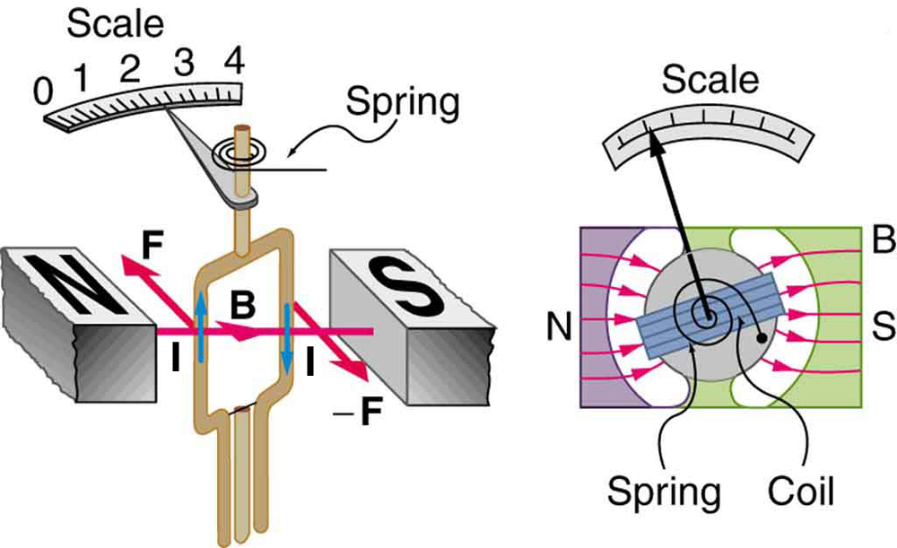

* Describe how motors and meters work in terms of torque on a current loop.
* Calculate the torque on a current-carrying loop in a magnetic field.

**Motors**{: data-type="term" #import-auto-id2189091} are the most common application of magnetic force on current-carrying wires. Motors have loops of wire in a magnetic field. When current is passed through the loops, the magnetic field exerts torque on the loops, which rotates a shaft. Electrical energy is converted to mechanical work in the process. (See [\[link\]](#import-auto-id1615457).)

 ![Diagram showing a current-carrying loop of width w and length l between the north and south poles of a magnet. The north pole is to the left and the south pole is to the right of the loop. The magnetic field B runs from the north pole across the loop to the south pole. The loop is shown at an instant, while rotating clockwise. The current runs up the left side of the loop, across the top, and down the right side. There is a force F oriented into the page on the left side of the loop and a force F oriented out of the page on the right side of the loop. The torque on the loop is clockwise as viewed from above.](../resources/Figure_23_08_01a.jpg "Torque on a current loop. A current-carrying loop of wire attached to a vertically rotating shaft feels magnetic forces that produce a clockwise torque as viewed from above."){: #import-auto-id1615457 data-media-type="image/jpg"}

Let us examine the force on each segment of the loop in [\[link\]](#import-auto-id1615457) to find the torques produced about the axis of the vertical shaft. (This will lead to a useful equation for the torque on the loop.) We take the magnetic field to be uniform over the rectangular loop, which has width <math xmlns="http://www.w3.org/1998/Math/MathML"><semantics><mrow><mrow><mi>w</mi></mrow><mrow /></mrow></semantics></math>

 and height <math xmlns="http://www.w3.org/1998/Math/MathML"><semantics><mrow><mrow><mi>l</mi></mrow></mrow></semantics></math>

. First, we note that the forces on the top and bottom segments are vertical and, therefore, parallel to the shaft, producing no torque. Those vertical forces are equal in magnitude and opposite in direction, so that they also produce no net force on the loop. [\[link\]](#import-auto-id2330568) shows views of the loop from above. Torque is defined as <math xmlns="http://www.w3.org/1998/Math/MathML"><semantics><mrow><mrow><mrow><mrow><mi>τ</mi><mo stretchy="false">=</mo><mstyle fontstyle="italic"><mrow><mtext>rF</mtext></mrow></mstyle></mrow><mspace width="0.25em" /><mtext>sin</mtext><mspace width="0.25em" /><mi>θ</mi></mrow></mrow><mrow /></mrow><annotation encoding="StarMath 5.0"> size 12{τ= ital "rF""sin"θ} {}</annotation></semantics></math>

, where <math xmlns="http://www.w3.org/1998/Math/MathML"><semantics><mrow><mrow><mi>F</mi></mrow><mrow /></mrow><annotation encoding="StarMath 5.0"> size 12{F} {}</annotation></semantics></math>

 is the force, <math xmlns="http://www.w3.org/1998/Math/MathML"><semantics><mrow><mrow><mi>r</mi></mrow><mrow /></mrow></semantics></math>

 is the distance from the pivot that the force is applied, and <math xmlns="http://www.w3.org/1998/Math/MathML"><semantics><mrow><mrow><mi>θ</mi></mrow><mrow /></mrow></semantics></math>

 is the angle between <math xmlns="http://www.w3.org/1998/Math/MathML"><semantics><mrow><mrow><mi>r</mi></mrow><mrow /></mrow></semantics></math>

 and <math xmlns="http://www.w3.org/1998/Math/MathML"><semantics><mrow><mrow><mi>F</mi></mrow><mrow /></mrow></semantics></math>

. As seen in [\[link\]](#import-auto-id2330568)(a), right hand rule 1 gives the forces on the sides to be equal in magnitude and opposite in direction, so that the net force is again zero. However, each force produces a clockwise torque. Since <math xmlns="http://www.w3.org/1998/Math/MathML"><semantics><mrow><mrow><mrow><mi>r</mi><mo stretchy="false">=</mo><mrow><mi>w</mi><mo stretchy="false">/</mo><mn>2</mn></mrow></mrow></mrow><mrow /></mrow></semantics></math>

, the torque on each vertical segment is <math xmlns="http://www.w3.org/1998/Math/MathML"><semantics><mrow><mrow><mrow><mo stretchy="false">(</mo><mrow><mi>w</mi><mo stretchy="false">/</mo><mn>2</mn></mrow><mo stretchy="false">)</mo><mi>F</mi><mspace width="0.25em" /><mtext>sin</mtext><mspace width="0.25em" /><mi>θ</mi></mrow></mrow><mrow /></mrow></semantics></math>

, and the two add to give a total torque.

<math xmlns="http://www.w3.org/1998/Math/MathML"> <semantics> <mrow> <mrow> <mrow> <mrow> <mi>τ</mi> <mo stretchy="false">=</mo> <mfrac> <mi>w</mi> <mn>2</mn> </mfrac> </mrow> <mi>F</mi><mspace width="0.25em" /> <mtext>sin</mtext><mspace width="0.25em" /> <mrow> <mi>θ</mi> <mo stretchy="false">+</mo> <mfrac> <mi>w</mi> <mn>2</mn> </mfrac> </mrow> <mi>F</mi><mspace width="0.25em" /> <mtext>sin</mtext><mspace width="0.25em" /> <mrow> <mi>θ</mi> <mo stretchy="false">=</mo> <mstyle fontstyle="italic"> <mrow> <mtext>wF</mtext> </mrow> </mstyle> </mrow><mspace width="0.25em" /> <mtext>sin</mtext><mspace width="0.25em" /> <mi>θ</mi> </mrow> </mrow> <mrow /> </mrow> <annotation encoding="StarMath 5.0"> size 12{τ= { {w} over {2} } F"sin"θ+ { {w} over {2} } F"sin"θ= ital "wF""sin"θ} {}</annotation> </semantics> </math>

![Diagram showing a current-carrying loop from the top, and four different times as it rotates in a magnetic field. The magnetic field oriented toward the right, perpendicular to the vertical dimension of the loop. In figure a, the top view of the loop is oriented at an angle to the magnetic field lines, which run left to right. The force on the loop is up on the lower left side where the current comes out of the page. The force is down on the upper right side where the loop goes into the page. The angle between the force and the loop is theta. Torque is clockwise and equals w over 2 times I l B sine theta. Figure b shows the top view of the loop parallel to the magnetic field lines. The force on the loop is up on the left side where I comes out of the page. The force on the loop is down on the right side where I goes into the page. The angle theta between the F and B is ninety degrees. Torque is clockwise and equals w over 2 I l B equals maximum torque. Figure c shows the top view of the loop oriented perpendicular to B. The force on the loop is up at the top, where I comes out of the page, and down at the bottom where I goes into the page. Theta equals 0 degrees. Torque equals zero since sine theta equals 0. In figure d the force is down on the lower left side of the loop where I goes in, and up on the upper right side of the loop where I comes out. The torque is counterclockwise. Torque is negative.](../resources/Figure_23_08_02a.jpg "Top views of a current-carrying loop in a magnetic field. (a) The equation for torque is derived using this view. Note that the perpendicular to the loop makes an angle &#x3B8; size 12{&#x3B8;} {} with the field that is the same as the angle between w/2 size 12{w/2} {} and F size 12{F} {}. (b) The maximum torque occurs when &#x3B8; size 12{&#x3B8;} {} is a right angle and sin&#x3B8;=1 size 12{&quot;sin&quot;&#x3B8;=1} {}. (c) Zero (minimum) torque occurs when &#x3B8; size 12{&#x3B8;} {} is zero and sin&#x3B8;=0. (d) The torque reverses once the loop rotates past &#x3B8;=0."){: #import-auto-id2330568 data-media-type="image/jpg"}

Now, each vertical segment has a length <math xmlns="http://www.w3.org/1998/Math/MathML"><semantics><mrow><mrow><mi>l</mi></mrow><mrow /></mrow><annotation encoding="StarMath 5.0"> size 12{l} {}</annotation></semantics></math>

 that is perpendicular to <math xmlns="http://www.w3.org/1998/Math/MathML"><semantics><mrow><mrow><mi>B</mi></mrow><mrow /></mrow><annotation encoding="StarMath 5.0"> size 12{B} {}</annotation></semantics></math>

, so that the force on each is <math xmlns="http://www.w3.org/1998/Math/MathML"><semantics><mrow><mrow><mrow><mi>F</mi><mo stretchy="false">=</mo><mstyle fontstyle="italic"><mrow><mtext>IlB</mtext></mrow></mstyle></mrow></mrow><mrow /></mrow><annotation encoding="StarMath 5.0"> size 12{F= ital "IlB"} {}</annotation></semantics></math>

. Entering <math xmlns="http://www.w3.org/1998/Math/MathML"><semantics><mrow><mrow><mi>F</mi></mrow><mrow /></mrow><annotation encoding="StarMath 5.0"> size 12{F} {}</annotation></semantics></math>

 into the expression for torque yields

<math xmlns="http://www.w3.org/1998/Math/MathML"><semantics><mrow><mrow><mrow><mrow><mi>τ</mi><mo stretchy="false">=</mo><mstyle fontstyle="italic"><mrow><mtext>wIlB</mtext></mrow></mstyle></mrow><mspace width="0.25em" /><mtext>sin</mtext><mspace width="0.25em" /><mi>θ</mi></mrow><mo>.</mo></mrow><mrow /></mrow><annotation encoding="StarMath 5.0"> size 12{τ= ital "wIlB""sin"θ} {}</annotation></semantics></math>

If we have a multiple loop of <math xmlns="http://www.w3.org/1998/Math/MathML"><semantics><mrow><mrow><mi>N</mi></mrow><mrow /></mrow><annotation encoding="StarMath 5.0"> size 12{N} {}</annotation></semantics></math>

 turns, we get <math xmlns="http://www.w3.org/1998/Math/MathML"><semantics><mrow><mrow><mi>N</mi></mrow><mrow /></mrow><annotation encoding="StarMath 5.0"> size 12{N} {}</annotation></semantics></math>

 times the torque of one loop. Finally, note that the area of the loop is <math xmlns="http://www.w3.org/1998/Math/MathML"><semantics><mrow><mrow><mrow><mi>A</mi><mo stretchy="false">=</mo><mstyle fontstyle="italic"><mrow><mtext>wl</mtext></mrow></mstyle></mrow></mrow><mrow /></mrow><annotation encoding="StarMath 5.0"> size 12{A= ital "wl"} {}</annotation></semantics></math>

; the expression for the torque becomes

<math xmlns="http://www.w3.org/1998/Math/MathML"><semantics><mrow><mrow><mrow><mrow><mi>τ</mi><mo stretchy="false">=</mo><mstyle fontstyle="italic"><mrow><mtext>NIAB</mtext></mrow></mstyle></mrow><mspace width="0.25em" /><mtext>sin</mtext><mspace width="0.25em" /><mi>θ</mi></mrow><mo>.</mo></mrow><mrow /></mrow><annotation encoding="StarMath 5.0"> size 12{τ= ital "NIAB""sin"θ} {}</annotation></semantics></math>

This is the torque on a current-carrying loop in a uniform magnetic field. This equation can be shown to be valid for a loop of any shape. The loop carries a current <math xmlns="http://www.w3.org/1998/Math/MathML"><semantics><mrow><mrow><mi>I</mi></mrow><mrow /></mrow><annotation encoding="StarMath 5.0"> size 12{I} {}</annotation></semantics></math>

, has <math xmlns="http://www.w3.org/1998/Math/MathML"><semantics><mrow><mrow><mi>N</mi></mrow><mrow /></mrow><annotation encoding="StarMath 5.0"> size 12{N} {}</annotation></semantics></math>

 turns, each of area <math xmlns="http://www.w3.org/1998/Math/MathML"><semantics><mrow><mrow><mi>A</mi></mrow><mrow /></mrow><annotation encoding="StarMath 5.0"> size 12{A} {}</annotation></semantics></math>

, and the perpendicular to the loop makes an angle <math xmlns="http://www.w3.org/1998/Math/MathML"><semantics><mrow><mrow><mi>θ</mi></mrow><mrow /></mrow><annotation encoding="StarMath 5.0"> size 12{θ} {}</annotation></semantics></math>

 with the field <math xmlns="http://www.w3.org/1998/Math/MathML"><semantics><mrow><mrow><mi>B</mi></mrow><mrow /></mrow><annotation encoding="StarMath 5.0"> size 12{B} {}</annotation></semantics></math>

. The net force on the loop is zero.

Calculating Torque on a Current-Carrying Loop in a Strong Magnetic Field

Find the maximum torque on a 100-turn square loop of a wire of 10.0 cm on a side that carries 15.0 A of current in a 2.00-T field.

**Strategy**

Torque on the loop can be found using <math xmlns="http://www.w3.org/1998/Math/MathML"><semantics><mrow><mrow><mrow><mrow><mi>τ</mi><mo stretchy="false">=</mo><mstyle fontstyle="italic"><mrow><mtext>NIAB</mtext></mrow></mstyle></mrow><mspace width="0.25em" /><mtext>sin</mtext><mspace width="0.25em" /><mi>θ</mi></mrow></mrow><mrow /></mrow><annotation encoding="StarMath 5.0"> size 12{τ= ital "NIAB""sin"θ} {}</annotation></semantics></math>

. Maximum torque occurs when <math xmlns="http://www.w3.org/1998/Math/MathML"><semantics><mrow><mrow><mrow><mrow><mi>θ</mi><mo stretchy="false">=</mo><mtext>90º</mtext></mrow></mrow></mrow><mrow /></mrow></semantics></math>

 and <math xmlns="http://www.w3.org/1998/Math/MathML"><semantics><mrow><mrow><mrow><mtext>sin</mtext><mrow><mspace width="0.25em" /><mi>θ</mi><mo stretchy="false">=</mo><mn>1</mn></mrow></mrow></mrow><mrow /></mrow><annotation encoding="StarMath 5.0"> size 12{"sin"θ=1} {}</annotation></semantics></math>

.

**Solution**

For <math xmlns="http://www.w3.org/1998/Math/MathML"><semantics><mrow><mrow><mrow><mtext>sin</mtext><mspace width="0.25em" /><mrow><mi>θ</mi><mo stretchy="false">=</mo><mn>1</mn></mrow></mrow></mrow><mrow /></mrow><annotation encoding="StarMath 5.0"> size 12{"sin"θ=1} {}</annotation></semantics></math>

, the maximum torque is

<math xmlns="http://www.w3.org/1998/Math/MathML"><semantics><mrow><mrow><mrow><msub><mi>τ</mi><mrow><mtext>max</mtext></mrow></msub><mo stretchy="false">=</mo><mstyle fontstyle="italic"><mrow><mtext>NIAB</mtext></mrow></mstyle></mrow><mo>.</mo></mrow><mrow /></mrow><annotation encoding="StarMath 5.0"> size 12{τ rSub { size 8{"max"} } = ital "NIAB"} {}</annotation></semantics></math>

Entering known values yields

<math xmlns="http://www.w3.org/1998/Math/MathML"> <semantics> <mrow> <mrow> <mtable columnalign="left"> <mtr><mtd> <msub> <mi>τ</mi> <mrow> <mtext>max</mtext> </mrow> </msub></mtd> <mtd> <mo stretchy="false">=</mo></mtd> <mtd> <mrow> <mrow> <mrow> <mrow> <mfenced open="(" close=")"> <mtext>100</mtext> </mfenced> </mrow> <mfenced open="(" close=")"> <mrow> <mtext>15.0 A</mtext> </mrow> </mfenced> <mfenced open="(" close=")"> <mrow> <mtext>0.100</mtext><mspace width="0.25em" /> <msup> <mtext> m</mtext> <mrow> <mn>2</mn> </mrow> </msup> </mrow> </mfenced> <mfenced open="(" close=")"> <mrow> <mn>2</mn> <mtext>.</mtext> <mtext>00 T</mtext> </mrow> </mfenced> </mrow> </mrow> </mrow></mtd> </mtr> <mtr><mtd /> <mtd> <mo stretchy="false">=</mo></mtd> <mtd> <mrow> <mtext>30.0 N</mtext> <mo stretchy="false">⋅</mo> <mn>m.</mn> </mrow></mtd> </mtr> </mtable> </mrow> </mrow> <annotation encoding="StarMath 5.0">alignl { stack { size 12{τ rSub { size 8{"max"} } = left ("100" right ) left ("15" "." 0" A" right ) left (0 "." "100"" m" rSup { size 8{2} } right ) left (2 "." "00"" T" right )} {} # " "="30" "." "0 N" cdot m "." {} } } {}</annotation> </semantics> </math>

**Discussion**

This torque is large enough to be useful in a motor.

The torque found in the preceding example is the maximum. As the coil rotates, the torque decreases to zero at <math xmlns="http://www.w3.org/1998/Math/MathML"><semantics><mrow><mrow><mrow><mi>θ</mi><mo stretchy="false">=</mo><mn>0</mn></mrow></mrow><mrow /></mrow><annotation encoding="StarMath 5.0"> size 12{θ=0} {}</annotation></semantics></math>

. The torque then *reverses* its direction once the coil rotates past <math xmlns="http://www.w3.org/1998/Math/MathML"><semantics><mrow><mrow><mrow><mi>θ</mi><mo stretchy="false">=</mo><mn>0</mn></mrow></mrow><mrow /></mrow><annotation encoding="StarMath 5.0"> size 12{θ=0} {}</annotation></semantics></math>

. (See [\[link\]](#import-auto-id2330568)(d).) This means that, unless we do something, the coil will oscillate back and forth about equilibrium at <math xmlns="http://www.w3.org/1998/Math/MathML"><semantics><mrow><mrow><mrow><mi>θ</mi><mo stretchy="false">=</mo><mn>0</mn></mrow></mrow><mrow /></mrow><annotation encoding="StarMath 5.0"> size 12{θ=0} {}</annotation></semantics></math>

. To get the coil to continue rotating in the same direction, we can reverse the current as it passes through <math xmlns="http://www.w3.org/1998/Math/MathML"><semantics><mrow><mrow><mrow><mi>θ</mi><mo stretchy="false">=</mo><mn>0</mn></mrow></mrow><mrow /></mrow><annotation encoding="StarMath 5.0"> size 12{θ=0} {}</annotation></semantics></math>

 with automatic switches called *brushes*. (See [\[link\]](#import-fig03).)

![The diagram shows a current-carrying loop between the north and south poles of a magnet at two different times. The north pole is to the left and the south pole is to the right. The magnetic field runs from the north pole to the right to the south pole. Figure a shows the current running through the loop. It runs up on the left side, and down on the right side. The force on the left side is into the page. The force on the right side is out of the page. The torque is clockwise when viewed from above. Figure b shows the loop when it is oriented perpendicular to the magnet. In both diagrams, the bottom of each side of the loop is connected to a half-cylinder that is next to a rectangular brush that is then connected to the rest of the circuit.](../resources/Figure_23_08_03a.jpg "(a) As the angular momentum of the coil carries it through &#x3B8;=0 size 12{&#x3B8;=0} {}, the brushes reverse the current to keep the torque clockwise. (b) The coil will rotate continuously in the clockwise direction, with the current reversing each half revolution to maintain the clockwise torque."){: #import-fig03 data-media-type="image/jpg"}

**Meters**{: data-type="term" #import-auto-id1574895}, such as those in analog fuel gauges on a car, are another common application of magnetic torque on a current-carrying loop. [\[link\]](#import-auto-id2028294) shows that a meter is very similar in construction to a motor. The meter in the figure has its magnets shaped to limit the effect of <math xmlns="http://www.w3.org/1998/Math/MathML"><semantics><mrow><mrow><mi>θ</mi></mrow><mrow /></mrow><annotation encoding="StarMath 5.0"> size 12{θ} {}</annotation></semantics></math>

 by making <math xmlns="http://www.w3.org/1998/Math/MathML"><semantics><mrow><mrow><mi>B</mi></mrow><mrow /></mrow><annotation encoding="StarMath 5.0"> size 12{B} {}</annotation></semantics></math>

 perpendicular to the loop over a large angular range. Thus the torque is proportional to <math xmlns="http://www.w3.org/1998/Math/MathML"><semantics><mrow><mrow><mi>I</mi></mrow><mrow /></mrow><annotation encoding="StarMath 5.0"> size 12{I} {}</annotation></semantics></math>

 and not <math xmlns="http://www.w3.org/1998/Math/MathML"><semantics><mrow><mrow><mi>θ</mi></mrow><mrow /></mrow><annotation encoding="StarMath 5.0"> size 12{θ} {}</annotation></semantics></math>

. A linear spring exerts a counter-torque that balances the current-produced torque. This makes the needle deflection proportional to <math xmlns="http://www.w3.org/1998/Math/MathML"><semantics><mrow><mrow><mi>I</mi></mrow><mrow /></mrow><annotation encoding="StarMath 5.0"> size 12{I} {}</annotation></semantics></math>

. If an exact proportionality cannot be achieved, the gauge reading can be calibrated. To produce a galvanometer for use in analog voltmeters and ammeters that have a low resistance and respond to small currents, we use a large loop area <math xmlns="http://www.w3.org/1998/Math/MathML"><semantics><mrow><mrow><mi>A</mi></mrow><mrow /></mrow><annotation encoding="StarMath 5.0"> size 12{A} {}</annotation></semantics></math>

, high magnetic field <math xmlns="http://www.w3.org/1998/Math/MathML"><semantics><mrow><mrow><mi>B</mi></mrow><mrow /></mrow><annotation encoding="StarMath 5.0"> size 12{B} {}</annotation></semantics></math>

, and low-resistance coils.

{: #import-auto-id2028294 data-media-type="image/jpg"}

# Section Summary   {#eip-956}

* The torque
  <math xmlns="http://www.w3.org/1998/Math/MathML"><semantics><mrow><mrow><mi>τ</mi></mrow><mrow /></mrow><annotation encoding="StarMath 5.0"> size 12{τ} {}</annotation></semantics></math>
  
  on a current-carrying loop of any shape in a uniform magnetic field. is
  

  <math xmlns="http://www.w3.org/1998/Math/MathML"><semantics><mrow><mrow><mrow><mrow><mi>τ</mi><mo stretchy="false">=</mo><mstyle fontstyle="italic"><mrow><mtext>NIAB</mtext></mrow></mstyle></mrow><mspace width="0.25em" /><mtext>sin</mtext><mspace width="0.25em" /><mi>θ</mi></mrow><mo>,</mo></mrow><mrow /></mrow><annotation encoding="StarMath 5.0"> size 12{τ= ital "NIAB""sin"θ} {}</annotation></semantics></math>
  

  
  where
  <math xmlns="http://www.w3.org/1998/Math/MathML"><semantics><mrow><mrow><mi>N</mi></mrow><mrow /></mrow><annotation encoding="StarMath 5.0"> size 12{N} {}</annotation></semantics></math>
  
  is the number of turns,
  <math xmlns="http://www.w3.org/1998/Math/MathML"><semantics><mrow><mrow><mi>I</mi></mrow><mrow /></mrow><annotation encoding="StarMath 5.0"> size 12{I} {}</annotation></semantics></math>
  
  is the current,
  <math xmlns="http://www.w3.org/1998/Math/MathML"><semantics><mrow><mrow><mi>A</mi></mrow><mrow /></mrow><annotation encoding="StarMath 5.0"> size 12{A} {}</annotation></semantics></math>
  
  is the area of the loop,
  <math xmlns="http://www.w3.org/1998/Math/MathML"><semantics><mrow><mrow><mi>B</mi></mrow><mrow /></mrow><annotation encoding="StarMath 5.0"> size 12{B} {}</annotation></semantics></math>
  
  is the magnetic field strength, and
  <math xmlns="http://www.w3.org/1998/Math/MathML"><semantics><mrow><mrow><mi>θ</mi></mrow><mrow /></mrow><annotation encoding="StarMath 5.0"> size 12{θ} {}</annotation></semantics></math>
  
  is the angle between the perpendicular to the loop and the magnetic field.

# Conceptual Questions

Draw a diagram and use RHR-1 to show that the forces on the top and bottom segments of the motor’s current loop in [[link]](#import-auto-id1615457) are vertical and produce no torque about the axis of rotation.

# Problems &amp; Exercises

(a) By how many percent is the torque of a motor decreased if its permanent magnets lose 5.0% of their strength? (b) How many percent would the current need to be increased to return the torque to original values?

(a) <math xmlns="http://www.w3.org/1998/Math/MathML"><semantics><mrow><mrow><mtext> τ</mtext></mrow><mrow /></mrow><annotation encoding="StarMath 5.0"> size 12{" τ"} {}</annotation></semantics></math>

 decreases by 5.00% if B decreases by 5.00%

(b) 5.26% increase

(a) What is the maximum torque on a 150-turn square loop of wire 18.0 cm on a side that carries a 50.0-A current in a 1.60-T field? (b) What is the torque when <math xmlns="http://www.w3.org/1998/Math/MathML"><semantics><mrow><mrow><mi>θ</mi></mrow><mrow /></mrow><annotation encoding="StarMath 5.0"> size 12{θ} {}</annotation></semantics></math>

 is <math xmlns="http://www.w3.org/1998/Math/MathML"><semantics><mrow><mrow><mrow><mtext>10</mtext><mtext>.</mtext><mn>9º?</mn></mrow></mrow><mrow /></mrow><annotation encoding="StarMath 5.0"> size 12{"10" "." 9°?} {}</annotation></semantics></math>

Find the current through a loop needed to create a maximum torque of <math xmlns="http://www.w3.org/1998/Math/MathML"><semantics><mrow><mrow><mrow><mn>9</mn><mtext>.</mtext><mtext>00 N</mtext><mo stretchy="false">⋅</mo><mtext>m.</mtext></mrow></mrow><mrow /></mrow><annotation encoding="StarMath 5.0"> size 12{9 "." "00"`N cdot m "." } {}</annotation></semantics></math>

 The loop has 50 square turns that are 15.0 cm on a side and is in a uniform 0.800-T magnetic field.

10\.0 A

Calculate the magnetic field strength needed on a 200-turn square loop 20.0 cm on a side to create a maximum torque of <math xmlns="http://www.w3.org/1998/Math/MathML"><semantics><mrow><mrow><mrow><mtext>300 N</mtext><mo stretchy="false">⋅</mo><mtext>m</mtext></mrow></mrow><mrow /></mrow><annotation encoding="StarMath 5.0"> size 12{3"00"`N cdot m} {}</annotation></semantics></math>

 if the loop is carrying 25.0 A.

Since the equation for torque on a current-carrying loop is <math xmlns="http://www.w3.org/1998/Math/MathML"><semantics><mrow><mrow><mrow><mrow><mi>τ</mi><mo stretchy="false">=</mo><mstyle fontstyle="italic"><mrow><mtext>NIAB</mtext></mrow></mstyle></mrow><mspace width="0.25em" /><mtext>sin</mtext><mspace width="0.25em" /><mi>θ</mi></mrow></mrow><mrow /></mrow><annotation encoding="StarMath 5.0"> size 12{τ= ital "NIAB""sin"θ} {}</annotation></semantics></math>

, the units of <math xmlns="http://www.w3.org/1998/Math/MathML"><semantics><mrow><mrow><mrow><mn>N</mn><mo stretchy="false">⋅</mo><mn>m</mn></mrow></mrow><mrow /></mrow><annotation encoding="StarMath 5.0"> size 12{N cdot m} {}</annotation></semantics></math>

 must equal units of <math xmlns="http://www.w3.org/1998/Math/MathML"><semantics><mrow><mrow><mrow><mrow><mn>A</mn><mo stretchy="false">⋅</mo><msup><mn>m</mn><mrow><mn>2</mn></mrow></msup></mrow><mspace width="0.25em" /><mn>T</mn></mrow></mrow><mrow /></mrow><annotation encoding="StarMath 5.0"> size 12{A cdot m rSup { size 8{2} } `T} {}</annotation></semantics></math>

. Verify this.

<math xmlns="http://www.w3.org/1998/Math/MathML"><semantics><mrow><mstyle fontstyle="normal"><mrow><mrow><mrow><mi>A</mi><mo stretchy="false">⋅</mo><msup><mi>m</mi><mrow><mn>2</mn></mrow></msup></mrow><mo stretchy="false">⋅</mo><mi>T</mi></mrow><mo stretchy="false">=</mo><mrow><mi>A</mi><mo stretchy="false">⋅</mo><msup><mi>m</mi><mrow><mn>2</mn></mrow></msup></mrow></mrow><mrow><mfenced open="(" close=")"><mfrac><mi>N</mi><mrow><mi>A</mi><mo stretchy="false">⋅</mo><mi>m</mi></mrow></mfrac></mfenced><mo stretchy="false">=</mo><mrow><mi>N</mi><mo stretchy="false">⋅</mo><mi>m</mi></mrow></mrow></mstyle></mrow><annotation encoding="StarMath 5.0"> size 12{A cdot m rSup { size 8{2} } cdot T=A cdot m rSup { size 8{2} } left ( { {N} over {A cdot m} } right )=N cdot m} {}</annotation></semantics></math>

.

(a) At what angle <math xmlns="http://www.w3.org/1998/Math/MathML"><semantics><mrow><mrow><mi>θ</mi></mrow><mrow /></mrow><annotation encoding="StarMath 5.0"> size 12{θ} {}</annotation></semantics></math>

 is the torque on a current loop 90.0% of maximum? (b) 50.0% of maximum? (c) 10.0% of maximum?

A proton has a magnetic field due to its spin on its axis. The field is similar to that created by a circular current loop <math xmlns="http://www.w3.org/1998/Math/MathML"><semantics><mrow><mrow><mrow><mn>0</mn><mtext>.</mtext><mrow><mtext>650</mtext><mo stretchy="false">×</mo><msup><mtext>10</mtext><mrow><mrow><mo stretchy="false">−</mo><mtext>15</mtext></mrow></mrow></msup></mrow><mspace width="0.25em" /><mn>m</mn></mrow></mrow><mrow /></mrow><annotation encoding="StarMath 5.0"> size 12{0 "." "650" times "10" rSup { size 8{ - "15"} } `m} {}</annotation></semantics></math>

 in radius with a current of <math xmlns="http://www.w3.org/1998/Math/MathML"><semantics><mrow><mrow><mrow><mn>1</mn><mtext>.</mtext><mrow><mtext>05</mtext><mo stretchy="false">×</mo><msup><mtext>10</mtext><mrow><mn>4</mn></mrow></msup></mrow><mspace width="0.25em" /><mn>A</mn></mrow></mrow><mrow /></mrow><annotation encoding="StarMath 5.0"> size 12{1 "." "05" times "10" rSup { size 8{4} } `A} {}</annotation></semantics></math>

 (no kidding). Find the maximum torque on a proton in a 2.50-T field. (This is a significant torque on a small particle.)

<math xmlns="http://www.w3.org/1998/Math/MathML"> <semantics> <mrow> <mrow> <mrow> <mn>3</mn> <mtext>.</mtext> <mrow> <mtext>48</mtext> <mo stretchy="false">×</mo> <msup> <mtext>10</mtext> <mrow> <mrow> <mo stretchy="false">−</mo> <mtext>26</mtext> </mrow> </mrow> </msup> </mrow> <mspace width="0.25em" /> <mrow> <mn>N</mn> <mo stretchy="false">⋅</mo> <mn>m</mn> </mrow> </mrow> </mrow> </mrow> <annotation encoding="StarMath 5.0"> size 12{3 "." "48" times "10" rSup { size 8{ - "26"} } `N cdot m} {}</annotation> </semantics> </math>

(a) A 200-turn circular loop of radius 50.0 cm is vertical, with its axis on an east-west line. A current of 100 A circulates clockwise in the loop when viewed from the east. The Earth’s field here is due north, parallel to the ground, with a strength of <math xmlns="http://www.w3.org/1998/Math/MathML"><semantics><mrow><mrow><mrow><mn>3</mn><mtext>.</mtext><mrow><mtext>00</mtext><mo stretchy="false">×</mo><msup><mtext>10</mtext><mrow><mrow><mo stretchy="false">−</mo><mn>5</mn></mrow></mrow></msup></mrow><mspace width="0.25em" /><mn>T</mn></mrow></mrow><mrow /></mrow><annotation encoding="StarMath 5.0"> size 12{3 "." "00" times "10" rSup { size 8{ - 5} } `T} {}</annotation></semantics></math>

. What are the direction and magnitude of the torque on the loop? (b) Does this device have any practical applications as a motor?

Repeat [[link]](#fs-id1615066), but with the loop lying flat on the ground with its current circulating counterclockwise (when viewed from above) in a location where the Earth’s field is north, but at an angle <math xmlns="http://www.w3.org/1998/Math/MathML"><semantics><mrow><mrow><mrow><mtext>45</mtext><mtext>.</mtext><mn>0º</mn></mrow></mrow><mrow /></mrow><annotation encoding="StarMath 5.0"> size 12{"45" "." 0°} {}</annotation></semantics></math>

 below the horizontal and with a strength of <math xmlns="http://www.w3.org/1998/Math/MathML"><semantics><mrow><mrow><mrow><mtext>6.</mtext><mrow><mtext>00</mtext><mo stretchy="false">×</mo><msup><mtext>10</mtext><mrow><mrow><mo stretchy="false">−</mo><mn>5</mn></mrow></mrow></msup></mrow><mspace width="0.25em" /><mn>T</mn></mrow></mrow><mrow /></mrow><annotation encoding="StarMath 5.0"> size 12{6 "." "00" times "10" rSup { size 8{ - 5} } `T} {}</annotation></semantics></math>

.

(a) <math xmlns="http://www.w3.org/1998/Math/MathML"><semantics><mrow><mrow><mrow><mtext>0.666 N</mtext><mrow><mo stretchy="false">⋅</mo><mn>m</mn></mrow></mrow></mrow><mrow /></mrow><annotation encoding="StarMath 5.0"> size 12{0 "." "666"`N cdot m} {}</annotation></semantics></math>

 west

(b) This is not a very significant torque, so practical use would be limited. Also, the current would need to be alternated to make the loop rotate (otherwise it would oscillate).

