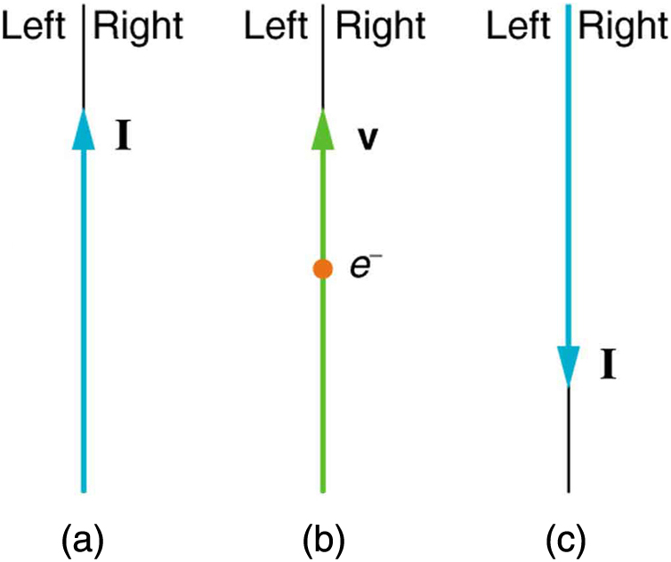
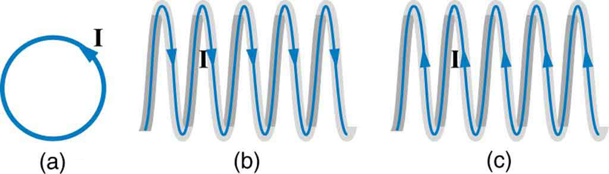
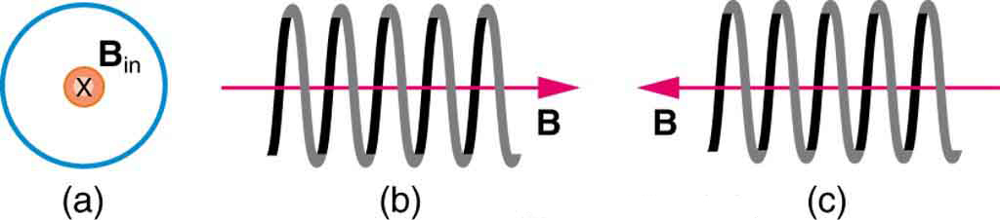
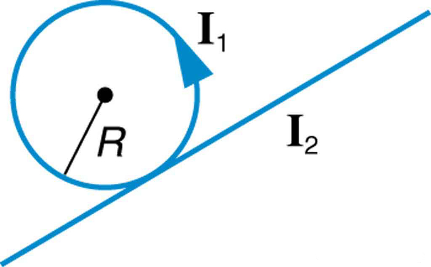
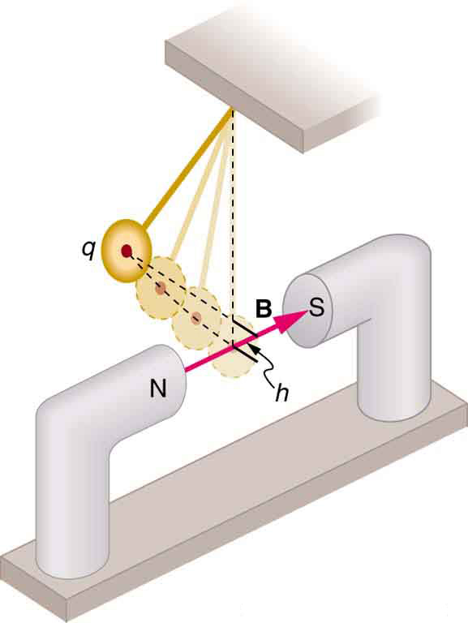
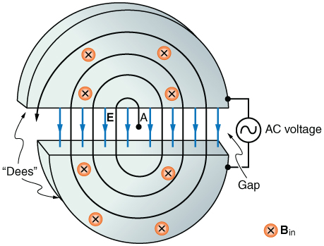

* Describe some applications of magnetism.

# Mass Spectrometry

The curved paths followed by charged particles in magnetic fields can be put to use. A charged particle moving perpendicular to a magnetic field travels in a circular path having a radius <math xmlns="http://www.w3.org/1998/Math/MathML"><semantics><mrow><mrow><mi>r</mi></mrow><mrow /></mrow><annotation encoding="StarMath 5.0"> size 12{r} {}</annotation></semantics></math>

.

<math xmlns="http://www.w3.org/1998/Math/MathML"> <semantics> <mrow> <mrow> <mrow> <mi>r</mi> <mo stretchy="false">=</mo> <mfrac> <mstyle fontstyle="italic"> <mrow> <mtext>mv</mtext> </mrow> </mstyle> <mstyle fontstyle="italic"> <mrow> <mtext>qB</mtext> </mrow> </mstyle> </mfrac> </mrow> </mrow> <mrow /> </mrow> <annotation encoding="StarMath 5.0"> size 12{r= { { ital "mv"} over { ital "qB"} } } {}</annotation> </semantics> </math>

It was noted that this relationship could be used to measure the mass of charged particles such as ions. A mass spectrometer is a device that measures such masses. Most mass spectrometers use magnetic fields for this purpose, although some of them have extremely sophisticated designs. Since there are five variables in the relationship, there are many possibilities. However, if <math xmlns="http://www.w3.org/1998/Math/MathML"><semantics><mrow><mrow><mi>v</mi></mrow><mrow /></mrow><annotation encoding="StarMath 5.0"> size 12{v} {}</annotation></semantics></math>

, <math xmlns="http://www.w3.org/1998/Math/MathML"><semantics><mrow><mrow><mi>q</mi></mrow><mrow /></mrow><annotation encoding="StarMath 5.0"> size 12{q} {}</annotation></semantics></math>

, and <math xmlns="http://www.w3.org/1998/Math/MathML"><semantics><mrow><mrow><mi>B</mi></mrow><mrow /></mrow><annotation encoding="StarMath 5.0"> size 12{B} {}</annotation></semantics></math>

 can be fixed, then the radius of the path <math xmlns="http://www.w3.org/1998/Math/MathML"><semantics><mrow><mrow><mi>r</mi></mrow><mrow /></mrow><annotation encoding="StarMath 5.0"> size 12{r} {}</annotation></semantics></math>

 is simply proportional to the mass <math xmlns="http://www.w3.org/1998/Math/MathML"><semantics><mrow><mrow><mi>m</mi></mrow><mrow /></mrow><annotation encoding="StarMath 5.0"> size 12{m} {}</annotation></semantics></math>

 of the charged particle. Let us examine one such mass spectrometer that has a relatively simple design. (See [\[link\]](#import-auto-id2492607).) The process begins with an ion source, a device like an electron gun. The ion source gives ions their charge, accelerates them to some velocity <math xmlns="http://www.w3.org/1998/Math/MathML"><semantics><mrow><mrow><mi>v</mi></mrow><mrow /></mrow><annotation encoding="StarMath 5.0"> size 12{v} {}</annotation></semantics></math>

, and directs a beam of them into the next stage of the spectrometer. This next region is a *velocity selector* that only allows particles with a particular value of <math xmlns="http://www.w3.org/1998/Math/MathML"><semantics><mrow><mrow><mi>v</mi></mrow><mrow /></mrow><annotation encoding="StarMath 5.0"> size 12{v} {}</annotation></semantics></math>

 to get through.

![Diagram of a mass spectrometer. Ions travel to the right with velocity v from the ion source. Magnetic field lines come out of the page between two charged plates on either side of the ion beam. The electric force F equals q E acts on the ions in an upward direction while the magnetic force F equals q v B acts in a downward direction. The forces have the same magnitude and thus the ions travel in a straight line between the two plates. The ions then enter another region where the magnetic field lines come out of the page. An ion of mass 1 curves around, traveling a net distance of 2 r 1. An ion of mass 2 curves around, traveling a net distance of 2 r 2.](../resources/Figure_23_11_01a.jpg "This mass spectrometer uses a velocity selector to fix v size 12{v} {} so that the radius of the path is proportional to mass."){: #import-auto-id2492607 data-media-type="image/jpg"}

The velocity selector has both an electric field and a magnetic field, perpendicular to one another, producing forces in opposite directions on the ions. Only those ions for which the forces balance travel in a straight line into the next region. If the forces balance, then the electric force <math xmlns="http://www.w3.org/1998/Math/MathML"><semantics><mrow><mrow><mrow><mi>F</mi><mo stretchy="false">=</mo><mstyle fontstyle="italic"><mrow><mtext>qE</mtext></mrow></mstyle></mrow></mrow><mrow /></mrow><annotation encoding="StarMath 5.0"> size 12{F= ital "qE"} {}</annotation></semantics></math>

 equals the magnetic force <math xmlns="http://www.w3.org/1998/Math/MathML"><semantics><mrow><mrow><mrow><mi>F</mi><mo stretchy="false">=</mo><mstyle fontstyle="italic"><mrow><mtext>qvB</mtext></mrow></mstyle></mrow></mrow><mrow /></mrow><annotation encoding="StarMath 5.0"> size 12{F= ital "qvB"} {}</annotation></semantics></math>

, so that <math xmlns="http://www.w3.org/1998/Math/MathML"><semantics><mrow><mrow><mrow><mstyle fontstyle="italic"><mrow><mtext>qE</mtext></mrow></mstyle><mo stretchy="false">=</mo><mstyle fontstyle="italic"><mrow><mtext>qvB</mtext></mrow></mstyle></mrow></mrow><mrow /></mrow><annotation encoding="StarMath 5.0"> size 12{ ital "qE"= ital "qvB"} {}</annotation></semantics></math>

. Noting that <math xmlns="http://www.w3.org/1998/Math/MathML"><semantics><mrow><mrow><mi>q</mi></mrow><mrow /></mrow><annotation encoding="StarMath 5.0"> size 12{q} {}</annotation></semantics></math>

 cancels, we see that

<math xmlns="http://www.w3.org/1998/Math/MathML"> <semantics> <mrow> <mrow> <mrow> <mi>v</mi> <mo stretchy="false">=</mo> <mfrac> <mi>E</mi> <mi>B</mi> </mfrac> </mrow> </mrow> <mrow /> </mrow> <annotation encoding="StarMath 5.0"> size 12{v= { {E} over {B} } } {}</annotation> </semantics> </math>

is the velocity particles must have to make it through the velocity selector, and further, that <math xmlns="http://www.w3.org/1998/Math/MathML"><semantics><mrow><mrow><mi>v</mi></mrow><mrow /></mrow><annotation encoding="StarMath 5.0"> size 12{v} {}</annotation></semantics></math>

 can be selected by varying <math xmlns="http://www.w3.org/1998/Math/MathML"><semantics><mrow><mrow><mi>E</mi></mrow><mrow /></mrow><annotation encoding="StarMath 5.0"> size 12{E} {}</annotation></semantics></math>

 and <math xmlns="http://www.w3.org/1998/Math/MathML"><semantics><mrow><mrow><mi>B</mi></mrow><mrow /></mrow><annotation encoding="StarMath 5.0"> size 12{B} {}</annotation></semantics></math>

. In the final region, there is only a uniform magnetic field, and so the charged particles move in circular arcs with radii proportional to particle mass. The paths also depend on charge <math xmlns="http://www.w3.org/1998/Math/MathML"><semantics><mrow><mrow><mi>q</mi></mrow><mrow /></mrow><annotation encoding="StarMath 5.0"> size 12{q} {}</annotation></semantics></math>

, but since <math xmlns="http://www.w3.org/1998/Math/MathML"><semantics><mrow><mrow><mi>q</mi></mrow><mrow /></mrow><annotation encoding="StarMath 5.0"> size 12{q} {}</annotation></semantics></math>

 is in multiples of electron charges, it is easy to determine and to discriminate between ions in different charge states.

Mass spectrometry today is used extensively in chemistry and biology laboratories to identify chemical and biological substances according to their mass-to-charge ratios. In medicine, mass spectrometers are used to measure the concentration of isotopes used as tracers. Usually, biological molecules such as proteins are very large, so they are broken down into smaller fragments before analyzing. Recently, large virus particles have been analyzed as a whole on mass spectrometers. Sometimes a gas chromatograph or high-performance liquid chromatograph provides an initial separation of the large molecules, which are then input into the mass spectrometer.

# Cathode Ray Tubes—CRTs—and the Like

What do non-flat-screen TVs, old computer monitors, x-ray machines, and the 2-mile-long Stanford Linear Accelerator have in common? All of them accelerate electrons, making them different versions of the electron gun. Many of these devices use magnetic fields to steer the accelerated electrons. [\[link\]](#import-auto-id1893405) shows the construction of the type of cathode ray tube (CRT) found in some TVs, oscilloscopes, and old computer monitors. Two pairs of coils are used to steer the electrons, one vertically and the other horizontally, to their desired destination.

 is so named because rays of electrons originate at the cathode in the electron gun. Magnetic coils are used to steer the beam in many CRTs. In this case, the beam is moved down. Another pair of horizontal coils would steer the beam horizontally."){: #import-auto-id1893405 data-media-type="image/jpg"}

# Magnetic Resonance Imaging

**Magnetic resonance imaging (MRI)**{: data-type="term" #import-auto-id1745197} is one of the most useful and rapidly growing medical imaging tools. It non-invasively produces two-dimensional and three-dimensional images of the body that provide important medical information with none of the hazards of x-rays. MRI is based on an effect called **nuclear magnetic resonance (NMR)**{: data-type="term" #import-auto-id1574398} in which an externally applied magnetic field interacts with the nuclei of certain atoms, particularly those of hydrogen (protons). These nuclei possess their own small magnetic fields, similar to those of electrons and the current loops discussed earlier in this chapter.

When placed in an external magnetic field, such nuclei experience a torque that pushes or aligns the nuclei into one of two new energy states—depending on the orientation of its spin (analogous to the N pole and S pole in a bar magnet). Transitions from the lower to higher energy state can be achieved by using an external radio frequency signal to “flip” the orientation of the small magnets. (This is actually a quantum mechanical process. The direction of the nuclear magnetic field is quantized as is energy in the radio waves. We will return to these topics in later chapters.) The specific frequency of the radio waves that are absorbed and reemitted depends sensitively on the type of nucleus, the chemical environment, and the external magnetic field strength. Therefore, this is a *resonance* phenomenon in which *nuclei* in a *magnetic* field act like resonators (analogous to those discussed in the treatment of sound in [Oscillatory Motion and Waves](/m42239)) that absorb and reemit only certain frequencies. Hence, the phenomenon is named *nuclear magnetic resonance (NMR).*

NMR has been used for more than 50 years as an analytical tool. It was formulated in 1946 by F. Bloch and E. Purcell, with the 1952 Nobel Prize in Physics going to them for their work. Over the past two decades, NMR has been developed to produce detailed images in a process now called magnetic resonance imaging (MRI), a name coined to avoid the use of the word “nuclear” and the concomitant implication that nuclear radiation is involved. (It is not.) The 2003 Nobel Prize in Medicine went to P. Lauterbur and P. Mansfield for their work with MRI applications.

The largest part of the MRI unit is a superconducting magnet that creates a magnetic field, typically between 1 and 2 T in strength, over a relatively large volume. MRI images can be both highly detailed and informative about structures and organ functions. It is helpful that normal and non-normal tissues respond differently for slight changes in the magnetic field. In most medical images, the protons that are hydrogen nuclei are imaged. (About 2/3 of the atoms in the body are hydrogen.) Their location and density give a variety of medically useful information, such as organ function, the condition of tissue (as in the brain), and the shape of structures, such as vertebral disks and knee-joint surfaces. MRI can also be used to follow the movement of certain ions across membranes, yielding information on active transport, osmosis, dialysis, and other phenomena. With excellent spatial resolution, MRI can provide information about tumors, strokes, shoulder injuries, infections, etc.

An image requires position information as well as the density of a nuclear type (usually protons). By varying the magnetic field slightly over the volume to be imaged, the resonant frequency of the protons is made to vary with position. Broadcast radio frequencies are swept over an appropriate range and nuclei absorb and reemit them only if the nuclei are in a magnetic field with the correct strength. The imaging receiver gathers information through the body almost point by point, building up a tissue map. The reception of reemitted radio waves as a function of frequency thus gives position information. These “slices” or cross sections through the body are only several mm thick. The intensity of the reemitted radio waves is proportional to the concentration of the nuclear type being flipped, as well as information on the chemical environment in that area of the body. Various techniques are available for enhancing contrast in images and for obtaining more information. Scans called T1, T2, or proton density scans rely on different relaxation mechanisms of nuclei. Relaxation refers to the time it takes for the protons to return to equilibrium after the external field is turned off. This time depends upon tissue type and status (such as inflammation).

While MRI images are superior to x rays for certain types of tissue and have none of the hazards of x rays, they do not completely supplant x-ray images. MRI is less effective than x rays for detecting breaks in bone, for example, and in imaging breast tissue, so the two diagnostic tools complement each other. MRI images are also expensive compared to simple x-ray images and tend to be used most often where they supply information not readily obtained from x rays. Another disadvantage of MRI is that the patient is totally enclosed with detectors close to the body for about 30 minutes or more, leading to claustrophobia. It is also difficult for the obese patient to be in the magnet tunnel. New “open-MRI” machines are now available in which the magnet does not completely surround the patient.

Over the last decade, the development of much faster scans, called “functional MRI” (fMRI), has allowed us to map the functioning of various regions in the brain responsible for thought and motor control. This technique measures the change in blood flow for activities (thought, experiences, action) in the brain. The nerve cells increase their consumption of oxygen when active. Blood hemoglobin releases oxygen to active nerve cells and has somewhat different magnetic properties when oxygenated than when deoxygenated. With MRI, we can measure this and detect a blood oxygen-dependent signal. Most of the brain scans today use fMRI.

# Other Medical Uses of Magnetic Fields

Currents in nerve cells and the heart create magnetic fields like any other currents. These can be measured but with some difficulty since their strengths are about <math xmlns="http://www.w3.org/1998/Math/MathML"><semantics><mrow><mrow><msup><mtext>10</mtext><mrow><mrow><mo stretchy="false">−</mo><mn>6</mn></mrow></mrow></msup></mrow><mrow /></mrow><annotation encoding="StarMath 5.0"> size 12{"10" rSup { size 8{ - 6} } } {}</annotation></semantics></math>

 to <math xmlns="http://www.w3.org/1998/Math/MathML"><semantics><mrow><mrow><msup><mtext>10</mtext><mrow><mrow><mo stretchy="false">−</mo><mn>8</mn></mrow></mrow></msup></mrow><mrow /></mrow><annotation encoding="StarMath 5.0"> size 12{"10" rSup { size 8{ - 8} } } {}</annotation></semantics></math>

 *less* than the Earth’s magnetic field. Recording of the heart’s magnetic field as it beats is called a **magnetocardiogram (MCG)**{: data-type="term" #import-auto-id2886555}, while measurements of the brain’s magnetic field is called a **magnetoencephalogram (MEG)**{: data-type="term" #import-auto-id1908841}. Both give information that differs from that obtained by measuring the electric fields of these organs (ECGs and EEGs), but they are not yet of sufficient importance to make these difficult measurements common.

In both of these techniques, the sensors do not touch the body. MCG can be used in fetal studies, and is probably more sensitive than echocardiography. MCG also looks at the heart’s electrical activity whose voltage output is too small to be recorded by surface electrodes as in EKG. It has the potential of being a rapid scan for early diagnosis of cardiac ischemia (obstruction of blood flow to the heart) or problems with the fetus.

MEG can be used to identify abnormal electrical discharges in the brain that produce weak magnetic signals. Therefore, it looks at brain activity, not just brain structure. It has been used for studies of Alzheimer’s disease and epilepsy. Advances in instrumentation to measure very small magnetic fields have allowed these two techniques to be used more in recent years. What is used is a sensor called a SQUID, for superconducting quantum interference device. This operates at liquid helium temperatures and can measure magnetic fields thousands of times smaller than the Earth’s.

Finally, there is a burgeoning market for magnetic cures in which magnets are applied in a variety of ways to the body, from magnetic bracelets to magnetic mattresses. The best that can be said for such practices is that they are apparently harmless, unless the magnets get close to the patient’s computer or magnetic storage disks. Claims are made for a broad spectrum of benefits from cleansing the blood to giving the patient more energy, but clinical studies have not verified these claims, nor is there an identifiable mechanism by which such benefits might occur.

PhET Explorations: Magnet and Compass

Ever wonder how a compass worked to point you to the Arctic? Explore the interactions between a compass and bar magnet, and then add the Earth and find the surprising answer! Vary the magnet\'s strength, and see how things change both inside and outside. Use the field meter to measure how the magnetic field changes.

<figure markdown="1">
<figcaption>
[Magnet and Compass](magnet-and-compass_en.jar)
</figcaption>
 {: data-type="image"}  
</figure>

# Section Summary

* Crossed (perpendicular) electric and magnetic fields act as a velocity filter, giving equal and opposite forces on any charge with velocity perpendicular to the fields and of magnitude
  

  <math xmlns="http://www.w3.org/1998/Math/MathML"> <semantics> <mrow> <mrow> <mrow> <mrow> <mi>v</mi> <mo stretchy="false">=</mo> <mfrac> <mi>E</mi> <mi>B</mi> </mfrac> </mrow> <mtext>.</mtext> </mrow> </mrow> <mrow /> </mrow> <annotation encoding="StarMath 5.0"> size 12{v= { {E} over {B} } "." } {}</annotation> </semantics> </math>
  

# Conceptual Questions

Measurements of the weak and fluctuating magnetic fields associated with brain activity are called magnetoencephalograms (MEGs). Do the brain’s magnetic fields imply coordinated or uncoordinated nerve impulses? Explain.

Discuss the possibility that a Hall voltage would be generated on the moving heart of a patient during MRI imaging. Also discuss the same effect on the wires of a pacemaker. (The fact that patients with pacemakers are not given MRIs is significant.)

A patient in an MRI unit turns his head quickly to one side and experiences momentary dizziness and a strange taste in his mouth. Discuss the possible causes.

You are told that in a certain region there is either a uniform electric or magnetic field. What measurement or observation could you make to determine the type? (Ignore the Earth’s magnetic field.)

An example of magnetohydrodynamics (MHD) comes from the flow of a river (salty water). This fluid interacts with the Earth’s magnetic field to produce a potential difference between the two river banks. How would you go about calculating the potential difference?

Draw gravitational field lines between 2 masses, electric field lines between a positive and a negative charge, electric field lines between 2 positive charges and magnetic field lines around a magnet. Qualitatively describe the differences between the fields and the entities responsible for the field lines.

# Problems &amp; Exercises

Indicate whether the magnetic field created in each of the three situations shown in [[link]](#import-auto-id1917466) is into or out of the page on the left and right of the current.

{: #import-auto-id1917466 data-media-type="image/jpg"}

(a) right-into page, left-out of page

(b) right-out of page, left-into page

(c) right-out of page, left-into page

What are the directions of the fields in the center of the loop and coils shown in [[link]](#import-auto-id1330089)?

{: #import-auto-id1330089 data-media-type="image/jpg"}

What are the directions of the currents in the loop and coils shown in [[link]](#import-auto-id2156525)?

{: #import-auto-id2156525 data-media-type="image/jpg"}

(a) clockwise

(b) clockwise as seen from the left

(c) clockwise as seen from the right

To see why an MRI utilizes iron to increase the magnetic field created by a coil, calculate the current needed in a 400-loop-per-meter circular coil 0.660 m in radius to create a 1.20-T field (typical of an MRI instrument) at its center with no iron present. The magnetic field of a proton is approximately like that of a circular current loop <math xmlns="http://www.w3.org/1998/Math/MathML"><semantics><mrow><mrow><mrow><mn>0</mn><mtext>.</mtext><mrow><mtext>650</mtext><mo stretchy="false">×</mo><msup><mtext>10</mtext><mrow><mrow><mo stretchy="false">−</mo><mtext>15</mtext></mrow></mrow></msup></mrow><mspace width="0.25em" /><mn>m</mn></mrow></mrow><mrow /></mrow></semantics></math>

 in radius carrying <math xmlns="http://www.w3.org/1998/Math/MathML"><semantics><mrow><mrow><mrow><mn>1</mn><mtext>.</mtext><mrow><mtext>05</mtext><mo stretchy="false">×</mo><msup><mtext>10</mtext><mrow><mn>4</mn></mrow></msup></mrow><mspace width="0.25em" /><mn>A</mn></mrow></mrow><mrow /></mrow><annotation encoding="StarMath 5.0"> size 12{1 "." "05" times "10" rSup { size 8{4} } `A} {}</annotation></semantics></math>

. What is the field at the center of such a loop?

<math xmlns="http://www.w3.org/1998/Math/MathML"> <semantics> <mrow> <mrow> <mrow> <mn>1</mn> <mtext>.</mtext> <mrow> <mtext>01</mtext> <mo stretchy="false">×</mo> <msup> <mtext>10</mtext> <mrow> <mtext>13</mtext> </mrow> </msup> </mrow><mspace width="0.25em" /> <mtext> T</mtext> </mrow> </mrow> <mrow /> </mrow> <annotation encoding="StarMath 5.0"> size 12{1 "." "01" times "10" rSup { size 8{"13"} } " T"} {}</annotation> </semantics> </math>

Inside a motor, 30.0 A passes through a 250-turn circular loop that is 10.0 cm in radius. What is the magnetic field strength created at its center?

Nonnuclear submarines use batteries for power when submerged. (a) Find the magnetic field 50.0 cm from a straight wire carrying 1200 A from the batteries to the drive mechanism of a submarine. (b) What is the field if the wires to and from the drive mechanism are side by side? (c) Discuss the effects this could have for a compass on the submarine that is not shielded.

(a) <math xmlns="http://www.w3.org/1998/Math/MathML"><semantics><mrow><mrow><mrow><mn>4</mn><mtext>.</mtext><mrow><mtext>80</mtext><mo stretchy="false">×</mo><msup><mtext>10</mtext><mrow><mrow><mo stretchy="false">−</mo><mn>4</mn></mrow></mrow></msup></mrow><mspace width="0.25em" /><mn>T</mn></mrow></mrow><mrow /></mrow><annotation encoding="StarMath 5.0"> size 12{4 "." "80" times "10" rSup { size 8{ - 4} } `T} {}</annotation></semantics></math>

(b) Zero

(c) If the wires are not paired, the field is about 10 times stronger than Earth’s magnetic field and so could severely disrupt the use of a compass.

How strong is the magnetic field inside a solenoid with 10,000 turns per meter that carries 20.0 A?

What current is needed in the solenoid described in [[link]](#fs-id2626487) to produce a magnetic field <math xmlns="http://www.w3.org/1998/Math/MathML"><semantics><mrow><mrow><msup><mtext>10</mtext><mrow><mn>4</mn></mrow></msup></mrow><mrow /></mrow><annotation encoding="StarMath 5.0"> size 12{"10" rSup { size 8{4} } } {}</annotation></semantics></math>

 times the Earth’s magnetic field of <math xmlns="http://www.w3.org/1998/Math/MathML"><semantics><mrow><mrow><mrow><mn>5</mn><mtext>.</mtext><mrow><mtext>00</mtext><mo stretchy="false">×</mo><msup><mtext>10</mtext><mrow><mrow><mo stretchy="false">−</mo><mn>5</mn></mrow></mrow></msup></mrow><mspace width="0.25em" /><mn>T</mn></mrow></mrow><mrow /></mrow><annotation encoding="StarMath 5.0"> size 12{5 "." "00" times "10" rSup { size 8{ - 5} } `T} {}</annotation></semantics></math>

?

39\.8 A

How far from the starter cable of a car, carrying 150 A, must you be to experience a field less than the Earth’s <math xmlns="http://www.w3.org/1998/Math/MathML"><semantics><mrow><mrow><mrow><mo stretchy="false">(</mo><mn>5</mn><mtext>.</mtext><mrow><mtext>00</mtext><mo stretchy="false">×</mo><msup><mtext>10</mtext><mrow><mrow><mo stretchy="false">−</mo><mn>5</mn></mrow></mrow></msup></mrow><mspace width="0.25em" /><mn>T</mn><mo stretchy="false">)</mo><mn>?</mn></mrow></mrow><mrow /></mrow><annotation encoding="StarMath 5.0"> size 12{ \( 5 "." "00" times "10" rSup { size 8{ - 5} } `T \) ?} {}</annotation></semantics></math>

 Assume a long straight wire carries the current. (In practice, the body of your car shields the dashboard compass.)

Measurements affect the system being measured, such as the current loop in [[link]](/m42398#import-auto-id1166991836771). (a) Estimate the field the loop creates by calculating the field at the center of a circular loop 20.0 cm in diameter carrying 5.00 A. (b) What is the smallest field strength this loop can be used to measure, if its field must alter the measured field by less than 0.0100%?

(a) <math xmlns="http://www.w3.org/1998/Math/MathML"><semantics><mrow><mrow><mrow><mn>3</mn><mtext>.</mtext><mrow><mtext>14</mtext><mo stretchy="false">×</mo><msup><mtext>10</mtext><mrow><mrow><mo stretchy="false">−</mo><mn>5</mn></mrow></mrow></msup></mrow><mspace width="0.25em" /><mn>T</mn></mrow></mrow><mrow /></mrow><annotation encoding="StarMath 5.0"> size 12{3 "." "14" times "10" rSup { size 8{ - 5} } `T} {}</annotation></semantics></math>

(b) 0.314 T

[[link]](#import-auto-id1504658) shows a long straight wire just touching a loop carrying a current <math xmlns="http://www.w3.org/1998/Math/MathML"><semantics><mrow><mrow><msub><mi>I</mi><mrow><mn>1</mn></mrow></msub></mrow><mrow /></mrow><annotation encoding="StarMath 5.0"> size 12{I rSub { size 8{1} } } {}</annotation></semantics></math>

. Both lie in the same plane. (a) What direction must the current <math xmlns="http://www.w3.org/1998/Math/MathML"><semantics><mrow><mrow><msub><mi>I</mi><mrow><mn>2</mn></mrow></msub></mrow><mrow /></mrow><annotation encoding="StarMath 5.0"> size 12{I rSub { size 8{2} } } {}</annotation></semantics></math>

 in the straight wire have to create a field at the center of the loop in the direction opposite to that created by the loop? (b) What is the ratio of <math xmlns="http://www.w3.org/1998/Math/MathML"><semantics><mrow><mrow><mrow><msub><mi>I</mi><mrow><mn>1</mn></mrow></msub><mo stretchy="false">/</mo><msub><mi>I</mi><mrow><mn>2</mn></mrow></msub></mrow></mrow><mrow /></mrow><annotation encoding="StarMath 5.0"> size 12{I rSub { size 8{1} } /I rSub { size 8{2} } } {}</annotation></semantics></math>

 that gives zero field strength at the center of the loop? (c) What is the direction of the field directly above the loop under this circumstance?

{: #import-auto-id1504658 data-media-type="image/jpg"}

Find the magnitude and direction of the magnetic field at the point equidistant from the wires in [[link]](/m42386#import-auto-id2069440)(a), using the rules of vector addition to sum the contributions from each wire.

<math xmlns="http://www.w3.org/1998/Math/MathML"><semantics><mrow><mrow><mrow><mn>7</mn><mtext>.</mtext><mrow><mtext>55</mtext><mo stretchy="false">×</mo><msup><mtext>10</mtext><mrow><mrow><mo stretchy="false">−</mo><mn>5</mn></mrow></mrow></msup></mrow><mspace width="0.25em" /><mn>T</mn></mrow></mrow></mrow></semantics></math>

, <math xmlns="http://www.w3.org/1998/Math/MathML"><semantics><mrow><mrow><mrow><mtext>23.4º</mtext></mrow></mrow></mrow></semantics></math>

Find the magnitude and direction of the magnetic field at the point equidistant from the wires in [[link]](/m42386#import-auto-id2069440)(b), using the rules of vector addition to sum the contributions from each wire.

What current is needed in the top wire in [[link]](/m42386#import-auto-id2069440)(a) to produce a field of zero at the point equidistant from the wires, if the currents in the bottom two wires are both 10.0 A into the page?

10\.0 A

Calculate the size of the magnetic field 20 m below a high voltage power line. The line carries 450 MW at a voltage of 300,000 V.

**Integrated Concepts**

(a) A pendulum is set up so that its bob (a thin copper disk) swings between the poles of a permanent magnet as shown in [[link]](#import-auto-id2732160). What is the magnitude and direction of the magnetic force on the bob at the lowest point in its path, if it has a positive <math xmlns="http://www.w3.org/1998/Math/MathML"><semantics><mrow><mrow><mrow><mn>0</mn><mtext>.</mtext><mtext>250 μC</mtext></mrow></mrow><mrow /></mrow><annotation encoding="StarMath 5.0"> size 12{0 "." "250"`"μC"} {}</annotation></semantics></math>

 charge and is released from a height of 30.0 cm above its lowest point? The magnetic field strength is 1.50 T. (b) What is the acceleration of the bob at the bottom of its swing if its mass is 30.0 grams and it is hung from a flexible string? Be certain to include a free-body diagram as part of your analysis.

{: #import-auto-id2732160 data-media-type="image/jpg"}

(a) <math xmlns="http://www.w3.org/1998/Math/MathML"><semantics><mrow><mrow><mrow><mn>9</mn><mtext>.</mtext><mrow><mtext>09</mtext><mo stretchy="false">×</mo><msup><mtext>10</mtext><mrow><mrow><mo stretchy="false">−</mo><mn>7</mn></mrow></mrow></msup></mrow><mspace width="0.25em" /><mn>N</mn></mrow></mrow><mrow /></mrow><annotation encoding="StarMath 5.0"> size 12{9 "." "09" times "10" rSup { size 8{ - 7} } `N} {}</annotation></semantics></math>

 upward

(b) <math xmlns="http://www.w3.org/1998/Math/MathML"><semantics><mrow><mrow><mrow><mn>3</mn><mtext>.</mtext><mrow><mtext>03</mtext><mo stretchy="false">×</mo><msup><mtext>10</mtext><mrow><mrow><mo stretchy="false">−</mo><mn>5</mn></mrow></mrow></msup></mrow><mspace width="0.25em" /><msup><mtext>m/s</mtext><mrow><mn>2</mn></mrow></msup></mrow></mrow><mrow /></mrow><annotation encoding="StarMath 5.0"> size 12{3 "." "03" times "10" rSup { size 8{ - 5} } `"m/s" rSup { size 8{2} } } {}</annotation></semantics></math>

**Integrated Concepts**

(a) What voltage will accelerate electrons to a speed of <math xmlns="http://www.w3.org/1998/Math/MathML"><semantics><mrow><mrow><mrow><mn>6</mn><mtext>.</mtext><mrow><mtext>00</mtext><mo stretchy="false">×</mo><msup><mtext>10</mtext><mrow><mrow><mo stretchy="false">−</mo><mn>7</mn></mrow></mrow></msup></mrow><mspace width="0.25em" /><mtext>m/s</mtext></mrow></mrow><mrow /></mrow><annotation encoding="StarMath 5.0"> size 12{6 "." "00" times "10" rSup { size 8{ - 7} } `"m/s"} {}</annotation></semantics></math>

? (b) Find the radius of curvature of the path of a *proton* accelerated through this potential in a 0.500-T field and compare this with the radius of curvature of an electron accelerated through the same potential.

**Integrated Concepts**

Find the radius of curvature of the path of a 25.0-MeV proton moving perpendicularly to the 1.20-T field of a cyclotron.

60\.2 cm

**Integrated Concepts**

To construct a nonmechanical water meter, a 0.500-T magnetic field is placed across the supply water pipe to a home and the Hall voltage is recorded. (a) Find the flow rate in liters per second through a 3.00-cm-diameter pipe if the Hall voltage is 60.0 mV. (b) What would the Hall voltage be for the same flow rate through a 10.0-cm-diameter pipe with the same field applied?

**Integrated Concepts**

(a) Using the values given for an MHD drive in [[link]](#fs-id1993346), and assuming the force is uniformly applied to the fluid, calculate the pressure created in <math xmlns="http://www.w3.org/1998/Math/MathML"><semantics><mrow><mrow><mrow><msup><mtext>N/m</mtext><mrow><mn>2</mn></mrow></msup><mtext>.</mtext></mrow></mrow><mrow /></mrow><annotation encoding="StarMath 5.0"> size 12{"N/m" rSup { size 8{2} } "." } {}</annotation></semantics></math>

 (b) Is this a significant fraction of an atmosphere?

(a) <math xmlns="http://www.w3.org/1998/Math/MathML"><semantics><mrow><mrow><mrow><mn>1</mn><mtext>.</mtext><mrow><mtext>02</mtext><mo stretchy="false">×</mo><msup><mtext>10</mtext><mrow><mn>3</mn></mrow></msup></mrow><mspace width="0.25em" /><msup><mtext>N/m</mtext><mrow><mn>2</mn></mrow></msup></mrow></mrow><mrow /></mrow><annotation encoding="StarMath 5.0"> size 12{1 "." "02" times "10" rSup { size 8{3} } `"N/m" rSup { size 8{2} } } {}</annotation></semantics></math>

(b) Not a significant fraction of an atmosphere

**Integrated Concepts**

(a) Calculate the maximum torque on a 50-turn, 1.50 cm radius circular current loop carrying <math xmlns="http://www.w3.org/1998/Math/MathML"><semantics><mrow><mrow><mrow><mtext>50 μA</mtext></mrow></mrow><mrow /></mrow><annotation encoding="StarMath 5.0"> size 12{"50"`"μA"} {}</annotation></semantics></math>

 in a 0.500-T field. (b) If this coil is to be used in a galvanometer that reads <math xmlns="http://www.w3.org/1998/Math/MathML"><semantics><mrow><mrow><mrow><mtext>50 μA</mtext></mrow></mrow><mrow /></mrow><annotation encoding="StarMath 5.0"> size 12{"50"`"μA"} {}</annotation></semantics></math>

 full scale, what force constant spring must be used, if it is attached 1.00 cm from the axis of rotation and is stretched by the <math xmlns="http://www.w3.org/1998/Math/MathML"><semantics><mrow><mrow><mrow><mtext>60º</mtext></mrow></mrow><mrow /></mrow><annotation encoding="StarMath 5.0"> size 12{"60"°} {}</annotation></semantics></math>

 arc moved?

**Integrated Concepts**

A current balance used to define the ampere is designed so that the current through it is constant, as is the distance between wires. Even so, if the wires change length with temperature, the force between them will change. What percent change in force per degree will occur if the wires are copper?

<math xmlns="http://www.w3.org/1998/Math/MathML"> <semantics> <mrow> <mrow> <mrow> <mtext>17</mtext> <mtext>.</mtext> <mrow> <mn>0</mn> <mo stretchy="false">×</mo> <msup> <mtext>10</mtext> <mrow> <mrow> <mo stretchy="false">−</mo> <mn>4</mn> </mrow> </mrow> </msup> </mrow> <mtext>%/ºC</mtext> </mrow> </mrow> <mrow /> </mrow> <annotation encoding="StarMath 5.0"> size 12{"17" "." 0 times "10" rSup { size 8{ - 4} } "%/"°C} {}</annotation> </semantics> </math>

**Integrated Concepts**

(a) Show that the period of the circular orbit of a charged particle moving perpendicularly to a uniform magnetic field is <math xmlns="http://www.w3.org/1998/Math/MathML"><semantics><mrow><mrow><mrow><mrow><mi>T</mi><mo stretchy="false">=</mo><mrow><mn>2</mn><mi fontstyle="italic">πm</mi><mo stretchy="false">/</mo><mo stretchy="false">(</mo></mrow></mrow><mstyle fontstyle="italic"><mrow><mtext>qB</mtext></mrow></mstyle><mo stretchy="false">)</mo></mrow></mrow><mrow /></mrow><annotation encoding="StarMath 5.0"> size 12{T=2πm/ \( ital "qB" \) } {}</annotation></semantics></math>

. (b) What is the frequency *<math xmlns="http://www.w3.org/1998/Math/MathML"><semantics><mrow><mrow><mi>f</mi></mrow><mrow /></mrow><annotation encoding="StarMath 5.0"> size 12{f} {}</annotation></semantics></math>

*? (c) What is the angular velocity *<math xmlns="http://www.w3.org/1998/Math/MathML"><semantics><mrow><mrow><mi>ω</mi></mrow><mrow /></mrow><annotation encoding="StarMath 5.0"> size 12{ω} {}</annotation></semantics></math>

*? Note that these results are independent of the velocity and radius of the orbit and, hence, of the energy of the particle. ([[link]](#import-auto-id2047195).)

{: #import-auto-id2047195 data-media-type="image/jpg"}

**Integrated Concepts**

A cyclotron accelerates charged particles as shown in [[link]](#import-auto-id2047195). Using the results of the previous problem, calculate the frequency of the accelerating voltage needed for a proton in a 1.20-T field.

18\.3 MHz

**Integrated Concepts**

(a) A 0.140-kg baseball, pitched at 40.0 m/s horizontally and perpendicular to the Earth’s horizontal <math xmlns="http://www.w3.org/1998/Math/MathML"><semantics><mrow><mrow><mrow><mn>5</mn><mtext>.</mtext><mrow><mtext>00</mtext><mo stretchy="false">×</mo><msup><mtext>10</mtext><mrow><mrow><mo stretchy="false">−</mo><mn>5</mn></mrow></mrow></msup></mrow><mspace width="0.25em" /><mn>T</mn></mrow></mrow><mrow /></mrow><annotation encoding="StarMath 5.0"> size 12{5 "." "00" times "10" rSup { size 8{ - 5} } `T} {}</annotation></semantics></math>

 field, has a 100-nC charge on it. What distance is it deflected from its path by the magnetic force, after traveling 30.0 m horizontally? (b) Would you suggest this as a secret technique for a pitcher to throw curve balls?

**Integrated Concepts**

(a) What is the direction of the force on a wire carrying a current due east in a location where the Earth’s field is due north? Both are parallel to the ground. (b) Calculate the force per meter if the wire carries 20.0 A and the field strength is <math xmlns="http://www.w3.org/1998/Math/MathML"><semantics><mrow><mrow><mrow><mn>3</mn><mtext>.</mtext><mrow><mtext>00</mtext><mo stretchy="false">×</mo><msup><mtext>10</mtext><mrow><mrow><mo stretchy="false">−</mo><mn>5</mn></mrow></mrow></msup></mrow><mspace width="0.25em" /><mn>T</mn></mrow></mrow><mrow /></mrow><annotation encoding="StarMath 5.0"> size 12{3 "." "00" times "10" rSup { size 8{ - 5} } `T} {}</annotation></semantics></math>

. (c) What diameter copper wire would have its weight supported by this force? (d) Calculate the resistance per meter and the voltage per meter needed.

(a) Straight up

(b) <math xmlns="http://www.w3.org/1998/Math/MathML"><semantics><mrow><mrow><mrow><mn>6</mn><mtext>.</mtext><mrow><mtext>00</mtext><mo stretchy="false">×</mo><msup><mtext>10</mtext><mrow><mrow><mo stretchy="false">−</mo><mn>4</mn></mrow></mrow></msup></mrow><mspace width="0.25em" /><mtext>N/m</mtext></mrow></mrow><mrow /></mrow><annotation encoding="StarMath 5.0"> size 12{6 "." "00" times "10" rSup { size 8{ - 4} } `"N/m"} {}</annotation></semantics></math>

(c) <math xmlns="http://www.w3.org/1998/Math/MathML"><semantics><mrow><mrow><mrow><mtext>94.1 μm</mtext></mrow></mrow><mrow /></mrow><annotation encoding="StarMath 5.0"> size 12{"94" "." 1`"μm"} {}</annotation></semantics></math>

(d)2.47 Ω/m, 49.4 V/m

**Integrated Concepts**

One long straight wire is to be held directly above another by repulsion between their currents. The lower wire carries 100 A and the wire 7.50 cm above it is 10-gauge (2.588 mm diameter) copper wire. (a) What current must flow in the upper wire, neglecting the Earth’s field? (b) What is the smallest current if the Earth’s <math xmlns="http://www.w3.org/1998/Math/MathML"><semantics><mrow><mrow><mrow><mn>3</mn><mtext>.</mtext><mrow><mtext>00</mtext><mo stretchy="false">×</mo><msup><mtext>10</mtext><mrow><mrow><mo stretchy="false">−</mo><mn>5</mn></mrow></mrow></msup></mrow><mspace width="0.25em" /><mn>T</mn></mrow></mrow><mrow /></mrow><annotation encoding="StarMath 5.0"> size 12{3 "." "00" times "10" rSup { size 8{ - 5} } `T} {}</annotation></semantics></math>

 field is parallel to the ground and is not neglected? (c) Is the supported wire in a stable or unstable equilibrium if displaced vertically? If displaced horizontally?

**Unreasonable Results**

(a) Find the charge on a baseball, thrown at 35.0 m/s perpendicular to the Earth’s <math xmlns="http://www.w3.org/1998/Math/MathML"><semantics><mrow><mrow><mrow><mn>5</mn><mtext>.</mtext><mrow><mtext>00</mtext><mo stretchy="false">×</mo><msup><mtext>10</mtext><mrow><mrow><mo stretchy="false">−</mo><mn>5</mn></mrow></mrow></msup></mrow><mspace width="0.25em" /><mn>T</mn></mrow></mrow><mrow /></mrow><annotation encoding="StarMath 5.0"> size 12{5 "." "00" times "10" rSup { size 8{ - 5} } `T} {}</annotation></semantics></math>

 field, that experiences a 1.00-N magnetic force. (b) What is unreasonable about this result? (c) Which assumption or premise is responsible?

(a) 571 C

(b) Impossible to have such a large separated charge on such a small object.

(c) The 1.00-N force is much too great to be realistic in the Earth’s field.

**Unreasonable Results**

A charged particle having mass <math xmlns="http://www.w3.org/1998/Math/MathML"><semantics><mrow><mrow><mrow><mn>6</mn><mtext>.</mtext><mrow><mtext>64</mtext><mo stretchy="false">×</mo><msup><mtext>10</mtext><mrow><mrow><mo stretchy="false">−</mo><mtext>27</mtext></mrow></mrow></msup></mrow><mspace width="0.25em" /><mtext>kg</mtext></mrow></mrow><mrow /></mrow><annotation encoding="StarMath 5.0"> size 12{6 "." "64" times "10" rSup { size 8{ - "27"} } `"kg"} {}</annotation></semantics></math>

 (that of a helium atom) moving at <math xmlns="http://www.w3.org/1998/Math/MathML"><semantics><mrow><mrow><mrow><mn>8</mn><mtext>.</mtext><mrow><mtext>70</mtext><mo stretchy="false">×</mo><msup><mtext>10</mtext><mrow><mn>5</mn></mrow></msup></mrow><mspace width="0.25em" /><mtext>m/s</mtext></mrow></mrow><mrow /></mrow><annotation encoding="StarMath 5.0"> size 12{8 "." "70" times "10" rSup { size 8{5} } `"m/s"} {}</annotation></semantics></math>

 perpendicular to a 1.50-T magnetic field travels in a circular path of radius 16.0 mm. (a) What is the charge of the particle? (b) What is unreasonable about this result? (c) Which assumptions are responsible?

**Unreasonable Results**

An inventor wants to generate 120-V power by moving a 1.00-m-long wire perpendicular to the Earth’s <math xmlns="http://www.w3.org/1998/Math/MathML"><semantics><mrow><mrow><mrow><mn>5</mn><mtext>.</mtext><mrow><mtext>00</mtext><mo stretchy="false">×</mo><msup><mtext>10</mtext><mrow><mrow><mo stretchy="false">−</mo><mn>5</mn></mrow></mrow></msup></mrow><mspace width="0.25em" /><mn>T</mn></mrow></mrow><mrow /></mrow><annotation encoding="StarMath 5.0"> size 12{5 "." "00" times "10" rSup { size 8{ - 5} } `T} {}</annotation></semantics></math>

 field. (a) Find the speed with which the wire must move. (b) What is unreasonable about this result? (c) Which assumption is responsible?

(a) <math xmlns="http://www.w3.org/1998/Math/MathML"> <semantics> <mrow> <mrow> <mrow> <mrow> <mtext>2.40</mtext> <mo stretchy="false">×</mo> <msup> <mtext>10</mtext> <mrow> <mn>6</mn> </mrow> </msup><mspace width="0.25em" /> </mrow> <mtext> m/s</mtext> </mrow> </mrow> <mrow /> </mrow> <annotation encoding="StarMath 5.0"> size 12{2 "." "40" times "10" rSup { size 8{6} } " m" rSup { size 8{3} } "/s"} {}</annotation> </semantics> </math>

(b) The speed is too high to be practical <math xmlns="http://www.w3.org/1998/Math/MathML"><mo>≤</mo></math>

 1% speed of light

(c) The assumption that you could reasonably generate such a voltage with a single wire in the Earth’s field is unreasonable

**Unreasonable Results**

Frustrated by the small Hall voltage obtained in blood flow measurements, a medical physicist decides to increase the applied magnetic field strength to get a 0.500-V output for blood moving at 30.0 cm/s in a 1.50-cm-diameter vessel. (a) What magnetic field strength is needed? (b) What is unreasonable about this result? (c) Which premise is responsible?

**Unreasonable Results**

A surveyor 100 m from a long straight 200-kV DC power line suspects that its magnetic field may equal that of the Earth and affect compass readings. (a) Calculate the current in the wire needed to create a <math xmlns="http://www.w3.org/1998/Math/MathML"><semantics><mrow><mrow><mrow><mn>5</mn><mtext>.</mtext><mrow><mtext>00</mtext><mo stretchy="false">×</mo><msup><mtext>10</mtext><mrow><mrow><mo stretchy="false">−</mo><mn>5</mn></mrow></mrow></msup></mrow><mspace width="0.25em" /><mn>T</mn></mrow></mrow><mrow /></mrow><annotation encoding="StarMath 5.0"> size 12{5 "." "00" times "10" rSup { size 8{ - 5} } `T} {}</annotation></semantics></math>

 field at this distance. (b) What is unreasonable about this result? (c) Which assumption or premise is responsible?

(a) 25.0 kA

(b) This current is unreasonably high. It implies a total power delivery in the line of 50.0x10^9 W, which is much too high for standard transmission lines.

(c)100 meters is a long distance to obtain the required field strength. Also coaxial cables are used for transmission lines so that there is virtually no field for DC power lines, because of cancellation from opposing currents. The surveyor’s concerns are not a problem for his magnetic field measurements.

**Construct Your Own Problem**

Consider a mass separator that applies a magnetic field perpendicular to the velocity of ions and separates the ions based on the radius of curvature of their paths in the field. Construct a problem in which you calculate the magnetic field strength needed to separate two ions that differ in mass, but not charge, and have the same initial velocity. Among the things to consider are the types of ions, the velocities they can be given before entering the magnetic field, and a reasonable value for the radius of curvature of the paths they follow. In addition, calculate the separation distance between the ions at the point where they are detected.

**Construct Your Own Problem**

Consider using the torque on a current-carrying coil in a magnetic field to detect relatively small magnetic fields (less than the field of the Earth, for example). Construct a problem in which you calculate the maximum torque on a current-carrying loop in a magnetic field. Among the things to be considered are the size of the coil, the number of loops it has, the current you pass through the coil, and the size of the field you wish to detect. Discuss whether the torque produced is large enough to be effectively measured. Your instructor may also wish for you to consider the effects, if any, of the field produced by the coil on the surroundings that could affect detection of the small field.

