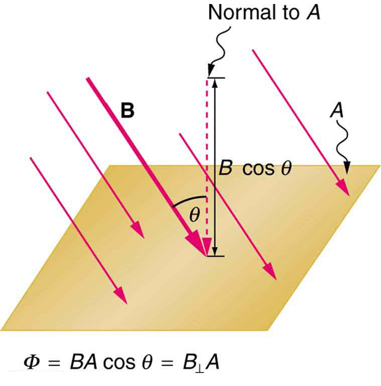

* Calculate the flux of a uniform magnetic field through a loop of arbitrary orientation.
* Describe methods to produce an electromotive force (emf) with a magnetic field or magnet and a loop of wire.

The apparatus used by Faraday to demonstrate that magnetic fields can create currents is illustrated in [\[link\]](#import-auto-id1169738208118). When the switch is closed, a magnetic field is produced in the coil on the top part of the iron ring and transmitted to the coil on the bottom part of the ring. The galvanometer is used to detect any current induced in the coil on the bottom. It was found that each time the switch is closed, the galvanometer detects a current in one direction in the coil on the bottom. (You can also observe this in a physics lab.) Each time the switch is opened, the galvanometer detects a current in the opposite direction. Interestingly, if the switch remains closed or open for any length of time, there is no current through the galvanometer. **Closing and opening the switch** induces the current. It is the **change** in magnetic field that creates the current. More basic than the current that flows is the emf**that causes it. The current is a result of an *emf induced by a changing magnetic field*, whether or not there is a path for current to flow.

![The picture shows Faraday&#x2019;s apparatus for demonstrating that a magnetic field can produce a current. It consists of a cylinder shaped battery. The positive end of the battery is connected to an open switch. There is a ring shaped iron core consisting of a set of coils one on the top and another at the bottom. The other end of the switch is connected to one end of the top coil. The other end of the top coil is connected back to the battery. Both the ends of the bottom coil are shown connected across a galvanometer box which shows a null deflection.](../resources/Figure_24_01_01.jpg "Faraday&#x2019;s apparatus for demonstrating that a magnetic field can produce a current. A change in the field produced by the top coil induces an emf and, hence, a current in the bottom coil. When the switch is opened and closed, the galvanometer registers currents in opposite directions. No current flows through the galvanometer when the switch remains closed or open. "){: #import-auto-id1169738208118 data-media-type="image/jpg"}

An experiment easily performed and often done in physics labs is illustrated in [\[link\]](#import-auto-id1169738076827). An emf is induced in the coil when a bar magnet is pushed in and out of it. Emfs of opposite signs are produced by motion in opposite directions, and the emfs are also reversed by reversing poles. The same results are produced if the coil is moved rather than the magnet—it is the relative motion that is important. The faster the motion, the greater the emf, and there is no emf when the magnet is stationary relative to the coil.

 ![The diagram shows five stages of an experiment done by moving a magnet relative to a coil and measuring the e m f produced. The first stage of the experiment shows a wire coil with two loops connected across a galvanometer. The loop is in horizontal plane. A cylindrical rod shaped magnet is moved upward through the loop with the north pole of the magnet facing the loop and the South Pole away from the loop. The magnetic lines of force of the magnet are shown to emerge out from the North Pole and intersect the coil. A current is shown to be induced in the coil in clockwise direction. The galvanometer needle is shown to deflect toward right. The second stage of the experiment shows the next state of the first stage of the experiment. The cylindrical rod shaped magnet is now moved downward away from the loop with the north pole of the magnet facing the loop and South Pole away from the loop. The magnetic lines of force of the magnet are shown to emerge out from the North Pole and intersect the coil. A current is shown to be induced in the coil in anti clockwise direction. The galvanometer needle is shown to deflect toward left. The third stage of the experiment shows a wire coil with two loops connected across a galvanometer. The loop is in horizontal plane. A cylindrical rod shaped magnet is moved upward through the loop with the south pole of the magnet facing the loop and the North Pole away from the loop. The magnetic lines of force of the magnet are shown to merge into the South Pole and intersect the coil. A current is shown to be induced in the coil in anti clockwise direction. The galvanometer needle is shown to deflect toward left. The fourth stage of the experiment shows the next state of the third stage of the experiment. The cylindrical rod shaped magnet is now moved downward away from the loop with the south pole of the magnet facing the loop and the North Pole away from the loop. The magnetic lines of force of the magnet are shown to merge into the South Pole and intersect the coil. A current is shown to be induced in the coil in clockwise direction. The galvanometer needle is shown to deflect toward right. The fifth stage of the experiment shows a wire coil with two loops connected across a galvanometer. The loop is in horizontal plane. A cylindrical rod shaped magnet is held stationary near the loop with the north pole of the magnet facing the loop and south away from the loop. The magnetic lines of force of the magnet are shown to emerge out from the North Pole and intersect the coil. No current is induced in the coil. The galvanometer needle does not deflect.](../resources/Figure_24_01_02.jpg "Movement of a magnet relative to a coil produces emfs as shown. The same emfs are produced if the coil is moved relative to the magnet. The greater the speed, the greater the magnitude of the emf, and the emf is zero when there is no motion."){: #import-auto-id1169738076827 data-media-type="image/png"}

The method of inducing an emf used in most electric generators is shown in [\[link\]](#import-auto-id1169737818705). A coil is rotated in a magnetic field, producing an alternating current emf, which depends on rotation rate and other factors that will be explored in later sections. Note that the generator is remarkably similar in construction to a motor (another symmetry).

![The figure shows a schematic diagram of an electric generator. It consists of a rotating rectangular coil placed between the two poles of a permanent magnet shown as two rectangular blocks curved on side facing the coil. The magnetic field B is shown pointing from the North to the South Pole. The two ends of this coil are connected to the two small rings. The two conducting carbon brushes are kept pressed separately on both the rings. The coil is attached to an axle with a handle at the other end. The axle may be mechanically rotated from outside to rotate the coil inside the magnetic field. Outer ends of the two brushes are connected to the galvanometer. A current is shown to flow in the coil in anti clockwise direction and the galvanometer shows a deflection.](../resources/Figure_24_01_03.jpg "Rotation of a coil in a magnetic field produces an emf. This is the basic construction of a generator, where work done to turn the coil is converted to electric energy. Note the generator is very similar in construction to a motor."){: #import-auto-id1169737818705 data-media-type="image/jpg"}

So we see that changing the magnitude or direction of a magnetic field produces an emf. Experiments revealed that there is a crucial quantity called the **magnetic flux**{: data-type="term" #import-auto-id1169738138367}, <math xmlns="http://www.w3.org/1998/Math/MathML"><semantics><mrow><mrow><mi>Φ</mi></mrow><mrow /></mrow><annotation encoding="StarMath 5.0"> size 12{Φ} {}</annotation></semantics></math>

 , given by

<math xmlns="http://www.w3.org/1998/Math/MathML"><semantics><mrow><mrow><mrow><mrow><mrow><mi>Φ</mi><mo stretchy="false">=</mo><mstyle fontstyle="italic"><mrow><mtext>BA</mtext><mspace width="0.25em" /></mrow></mstyle></mrow><mtext>cos</mtext><mspace width="0.25em" /><mi>θ</mi></mrow></mrow><mrow><mtext>,</mtext></mrow></mrow><mrow /></mrow><annotation encoding="StarMath 5.0"> size 12{Φ= ital "BA""cos"θ} {}</annotation></semantics></math>

where *<math xmlns="http://www.w3.org/1998/Math/MathML"><semantics><mrow><mrow><mi>B</mi></mrow><mrow /></mrow><annotation encoding="StarMath 5.0"> size 12{B} {}</annotation></semantics></math>

* is the magnetic field strength over an area *<math xmlns="http://www.w3.org/1998/Math/MathML"><semantics><mrow><mrow><mi>A</mi></mrow><mrow /></mrow><annotation encoding="StarMath 5.0"> size 12{A} {}</annotation></semantics></math>

*, at an angle <math xmlns="http://www.w3.org/1998/Math/MathML"> <semantics> <mi>θ</mi> </semantics> </math>

 with the perpendicular to the area as shown in [\[link\]](#import-auto-id1169737961842). **Any change in magnetic flux <math xmlns="http://www.w3.org/1998/Math/MathML"><semantics><mrow><mrow><mi>Φ</mi></mrow><mrow /></mrow><annotation encoding="StarMath 5.0"> size 12{Φ} {}</annotation></semantics></math>

 induces an emf.** This process is defined to be **electromagnetic induction**{: data-type="term" #import-auto-id1169737778764}. Units of magnetic flux *<math xmlns="http://www.w3.org/1998/Math/MathML"><semantics><mrow><mrow><mi>Φ</mi></mrow><mrow /></mrow><annotation encoding="StarMath 5.0"> size 12{Φ} {}</annotation></semantics></math>

* are <math xmlns="http://www.w3.org/1998/Math/MathML"><semantics><mrow><mrow><mrow><mtext>T</mtext><mo stretchy="false">⋅</mo><msup><mtext>m</mtext><mrow><mn>2</mn></mrow></msup></mrow></mrow><mrow /></mrow><annotation encoding="StarMath 5.0"> size 12{T cdot m rSup { size 8{2} } } {}</annotation></semantics></math>

. As seen in [\[link\]](#import-auto-id1169737961842), <math xmlns="http://www.w3.org/1998/Math/MathML"><semantics><mrow><mrow><mrow><mi>B</mi><mspace width="0.25em" /><mtext>cos</mtext><mspace width="0.25em" /><mrow><mi>θ</mi><mo stretchy="false">=</mo><msub><mi>B</mi><mrow><mrow /></mrow></msub></mrow></mrow></mrow><mrow /></mrow><annotation encoding="StarMath 5.0"> size 12{B"cos"θ=B rSub { size 8{ ortho } } } {}</annotation></semantics></math>

⊥, which is the component of *<math xmlns="http://www.w3.org/1998/Math/MathML"><semantics><mrow><mrow><mi>B</mi></mrow><mrow /></mrow><annotation encoding="StarMath 5.0"> size 12{B} {}</annotation></semantics></math>

* perpendicular to the area *<math xmlns="http://www.w3.org/1998/Math/MathML"><semantics><mrow><mrow><mi>A</mi></mrow><mrow /></mrow><annotation encoding="StarMath 5.0"> size 12{A} {}</annotation></semantics></math>

*. Thus magnetic flux is <math xmlns="http://www.w3.org/1998/Math/MathML"><semantics><mrow><mrow><mrow><mrow><mi>Φ</mi><mo stretchy="false">=</mo><msub><mi>B</mi><mrow><mtext>⊥</mtext></mrow></msub></mrow><mi>A</mi></mrow></mrow><mrow /></mrow><annotation encoding="StarMath 5.0"> size 12{Φ=B rSub { size 8{ ortho } } A} {}</annotation></semantics></math>

, the product of the area and the component of the magnetic field perpendicular to it.

{: #import-auto-id1169737961842 data-media-type="image/jpg"}

All induction, including the examples given so far, arises from some change in magnetic flux *<math xmlns="http://www.w3.org/1998/Math/MathML"><semantics><mrow><mrow><mi>Φ</mi></mrow><mrow /></mrow><annotation encoding="StarMath 5.0"> size 12{Φ} {}</annotation></semantics></math>

*. For example, Faraday changed *<math xmlns="http://www.w3.org/1998/Math/MathML"><semantics><mrow><mrow><mi>B</mi></mrow><mrow /></mrow><annotation encoding="StarMath 5.0"> size 12{B} {}</annotation></semantics></math>

* and hence *<math xmlns="http://www.w3.org/1998/Math/MathML"><semantics><mrow><mrow><mi>Φ</mi></mrow><mrow /></mrow><annotation encoding="StarMath 5.0"> size 12{Φ} {}</annotation></semantics></math>

* when opening and closing the switch in his apparatus (shown in [\[link\]](#import-auto-id1169738208118)). This is also true for the bar magnet and coil shown in [\[link\]](#import-auto-id1169738076827). When rotating the coil of a generator, the angle <math xmlns="http://www.w3.org/1998/Math/MathML"><semantics><mrow><mrow><mi>θ</mi></mrow><mrow /></mrow><annotation encoding="StarMath 5.0"> size 12{θ} {}</annotation></semantics></math>

 and, hence, *<math xmlns="http://www.w3.org/1998/Math/MathML"><semantics><mrow><mrow><mi>Φ</mi></mrow><mrow /></mrow><annotation encoding="StarMath 5.0"> size 12{Φ} {}</annotation></semantics></math>

* is changed. Just how great an emf and what direction it takes depend on the change in *<math xmlns="http://www.w3.org/1998/Math/MathML"><semantics><mrow><mrow><mi>Φ</mi></mrow><mrow /></mrow><annotation encoding="StarMath 5.0"> size 12{Φ} {}</annotation></semantics></math>

* and how rapidly the change is made, as examined in the next section.

# Section Summary

* {: #import-auto-id1169736614770} The crucial quantity in induction is magnetic flux *<math xmlns="http://www.w3.org/1998/Math/MathML"><semantics><mrow><mrow><mi>Φ</mi></mrow><mrow /></mrow><annotation encoding="StarMath 5.0"> size 12{Φ} {}</annotation></semantics></math>
  
  *, defined to be
  <math xmlns="http://www.w3.org/1998/Math/MathML"><semantics><mrow><mrow><mrow><mrow><mi>Φ</mi><mo stretchy="false">=</mo><mstyle fontstyle="italic"><mrow><mtext>BA</mtext><mspace width="0.25em" /></mrow></mstyle></mrow><mtext>cos</mtext><mspace width="0.25em" /><mi>θ</mi></mrow></mrow><mrow /></mrow><annotation encoding="StarMath 5.0"> size 12{Φ= ital "BA""cos"θ} {}</annotation></semantics></math>
  
  , where *<math xmlns="http://www.w3.org/1998/Math/MathML"><semantics><mrow><mrow><mi>B</mi></mrow><mrow /></mrow><annotation encoding="StarMath 5.0"> size 12{B} {}</annotation></semantics></math>
  
  * is the magnetic field strength over an area *<math xmlns="http://www.w3.org/1998/Math/MathML"><semantics><mrow><mrow><mi>A</mi></mrow><mrow /></mrow><annotation encoding="StarMath 5.0"> size 12{A} {}</annotation></semantics></math>
  
  * at an angle
  <math xmlns="http://www.w3.org/1998/Math/MathML"><semantics><mrow><mrow><mi>θ</mi></mrow><mrow /></mrow><annotation encoding="StarMath 5.0"> size 12{θ} {}</annotation></semantics></math>
  
  with the perpendicular to the area.
* {: #import-auto-id1169737777500} Units of magnetic flux *<math xmlns="http://www.w3.org/1998/Math/MathML"><semantics><mrow><mrow><mi>Φ</mi></mrow><mrow /></mrow><annotation encoding="StarMath 5.0"> size 12{Φ} {}</annotation></semantics></math>
  
  * are
  <math xmlns="http://www.w3.org/1998/Math/MathML"><semantics><mrow><mrow><mrow><mtext>T</mtext><mo stretchy="false">⋅</mo><msup><mtext>m</mtext><mrow><mn>2</mn></mrow></msup></mrow></mrow><mrow /></mrow><annotation encoding="StarMath 5.0"> size 12{T cdot m rSup { size 8{2} } } {}</annotation></semantics></math>
  
  .
* {: #import-auto-id1169738117029} Any change in magnetic flux *<math xmlns="http://www.w3.org/1998/Math/MathML"><semantics><mrow><mrow><mi>Φ</mi></mrow><mrow /></mrow><annotation encoding="StarMath 5.0"> size 12{Φ} {}</annotation></semantics></math>
  
  * induces an emf—the process is defined to be electromagnetic induction.

# Conceptual Questions

How do the multiple-loop coils and iron ring in the version of Faraday’s apparatus shown in [[link]](#import-auto-id1169738208118) enhance the observation of induced emf?

When a magnet is thrust into a coil as in [[link]](#import-auto-id1169738076827)(a), what is the direction of the force exerted by the coil on the magnet? Draw a diagram showing the direction of the current induced in the coil and the magnetic field it produces, to justify your response. How does the magnitude of the force depend on the resistance of the galvanometer?

Explain how magnetic flux can be zero when the magnetic field is not zero.

Is an emf induced in the coil in [[link]](#import-auto-id1169738014886) when it is stretched? If so, state why and give the direction of the induced current.

{: #import-auto-id1169738014886 data-media-type="image/jpg"}

# Problems &amp; Exercises

What is the value of the magnetic flux at coil 2 in [[link]](#import-auto-id1169737958541) due to coil 1?

 The planes of the two coils are perpendicular. (b) The wire is perpendicular to the plane of the coil."){: #import-auto-id1169737958541 data-media-type="image/jpg"}

Zero

What is the value of the magnetic flux through the coil in [[link]](#import-auto-id1169737958541)(b) due to the wire?

