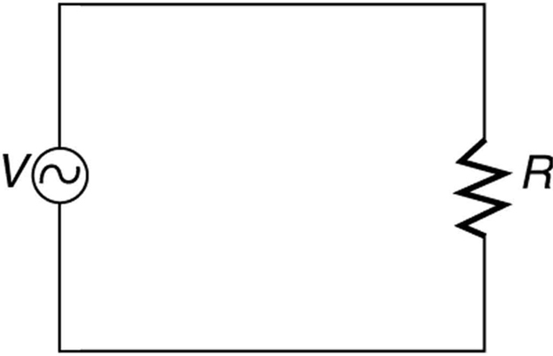

* Explain how various modern safety features in electric circuits work, with an emphasis on how induction is employed.

Electricity has two hazards. A **thermal hazard**{: data-type="term" #import-auto-id1169736588235} occurs when there is electrical overheating. A **shock hazard**{: data-type="term" #import-auto-id1169737712452} occurs when electric current passes through a person. Both hazards have already been discussed. Here we will concentrate on systems and devices that prevent electrical hazards.

[\[link\]](#import-auto-id1169738234833) shows the schematic for a simple AC circuit with no safety features. This is not how power is distributed in practice. Modern household and industrial wiring requires the **three-wire system**{: data-type="term" #import-auto-id1169737882981}, shown schematically in [\[link\]](#import-auto-id1169737831002), which has several safety features. First is the familiar *circuit breaker* (or *fuse*) to prevent thermal overload. Second, there is a protective *case* around the appliance, such as a toaster or refrigerator. The case’s safety feature is that it prevents a person from touching exposed wires and coming into electrical contact with the circuit, helping prevent shocks.

 {: #import-auto-id1169738234833 data-media-type="image/jpg"}

![The figure describes an appliance connected to an AC source. One end of the AC circuit is connected to a circuit breaker. The other end of the circuit breaker is connected to an appliance. The appliance is shown as a resistance enclosed in a rectangular case represented as the case of appliance. The other end of the resistance is connected back to the AC source through a connecting wire. The application case, the connecting wire and the A C source are grounded. The ground terminal marked at the appliance case is marked as Green or ground and the ground terminal of AC source and connecting wires are marked as alternate return path to earth.](../resources/Figure_24_08_02.jpg "The three-wire system connects the neutral wire to the earth at the voltage source and user location, forcing it to be at zero volts and supplying an alternative return path for the current through the earth. Also grounded to zero volts is the case of the appliance. A circuit breaker or fuse protects against thermal overload and is in series on the active (live/hot) wire. Note that wire insulation colors vary with region and it is essential to check locally to determine which color codes are in use (and even if they were followed in the particular installation)."){: #import-auto-id1169737831002 data-media-type="image/jpg"}

There are **three connections to earth or ground**{::}** (hereafter referred to as “earth/ground”) shown in [\[link\]](#import-auto-id1169737831002). Recall that an earth/ground connection is a low-resistance path directly to the earth. The two earth/ground connections on the *neutral wire* force it to be at zero volts relative to the earth, giving the wire its name. This wire is therefore safe to touch even if its insulation, usually white, is missing. The neutral wire is the return path for the current to follow to complete the circuit. Furthermore, the two earth/ground connections supply an alternative path through the earth, a good conductor, to complete the circuit. The earth/ground connection closest to the power source could be at the generating plant, while the other is at the user’s location. The third earth/ground is to the case of the appliance, through the green *earth/ground wire*, forcing the case, too, to be at zero volts. The **live** or **hot wire** (hereafter referred to as “live/hot”) supplies voltage and current to operate the appliance. [\[link\]](#import-auto-id1169738193913) shows a more pictorial version of how the three-wire system is connected through a three-prong plug to an appliance.

![The figure shows an appliance with a three prong plug connected to a three hole outlet. The circuit on the other side of the three hole outlet is also shown. The latter circuit consists of an alternating AC voltage source, V, with one end connected to a circuit breaker, which in turn is connected to a wire labeled black or hot. The other end of the A C voltage source is grounded with a wire labeled white or neutral. The black and white wires go from the A C source to two separate points on the three hole outlet. The third point of the three hole outlet is directly connected to the ground with a wire labeled green. The three wires end at the three hole outlet. The three prong plug is connected to this three hole outlet and the three wires black, white and green are shown to emerge out as the cord of the appliance and are shown connected to the appliance. The appliance is shown as a resistance enclosed in a rectangular case called the case of appliance. The black wire is connected to one end of the resistance. The white wire is connected to the other end of the resistance. The case of the appliance is connected to the green wire.](../resources/Figure_24_08_03.jpg "The standard three-prong plug can only be inserted in one way, to assure proper function of the three-wire system."){: #import-auto-id1169738193913 data-media-type="image/jpg"}

A note on insulation color-coding: Insulating plastic is color-coded to identify live/hot, neutral and ground wires but these codes vary around the world. Live/hot wires may be brown, red, black, blue or grey. Neutral wire may be blue, black or white. Since the same color may be used for live/hot or neutral in different parts of the world, it is essential to determine the color code in your region. The only exception is the earth/ground wire which is often green but may be yellow or just bare wire. Striped coatings are sometimes used for the benefit of those who are colorblind.

The three-wire system replaced the older two-wire system, which lacks an earth/ground wire. Under ordinary circumstances, insulation on the live/hot and neutral wires prevents the case from being directly in the circuit, so that the earth/ground wire may seem like double protection. Grounding the case solves more than one problem, however. The simplest problem is worn insulation on the live/hot wire that allows it to contact the case, as shown in [\[link\]](#import-auto-id1169737812648). Lacking an earth/ground connection (some people cut the third prong off the plug because they only have outdated two hole receptacles), a severe shock is possible. This is particularly dangerous in the kitchen, where a good connection to earth/ground is available through water on the floor or a water faucet. With the earth/ground connection intact, the circuit breaker will trip, forcing repair of the appliance. Why are some appliances still sold with two-prong plugs? These have nonconducting cases, such as power tools with impact resistant plastic cases, and are called **doubly insulated**. Modern two-prong plugs can be inserted into the asymmetric standard outlet in only one way, to ensure proper connection of live/hot and neutral wires.

 ![Part a of the figure describes an appliance connected to an AC source. One end of the AC circuit is connected to a circuit breaker. The other end of the circuit breaker is connected to the appliance. The appliance is shown as a resistance enclosed in a rectangular metal case. The case of application is shown to have a point where it is in contact with the hot wire from AC source due to lack of insulation. The other end of the resistance is connected back to the AC source through a connecting wire. The connecting wire and the A C source are grounded. The ground terminal at the appliance case is shown as broken. A person is shown to hold one hand on the appliance case and another hand on tap connection pipeline carrying water. The high voltage is shown to flow from the insulation damaged live wire to the metal case of the appliance to the person in contact with the appliance case, then through him and to the pipe line and then back to ground. The person is shown to receive a severe shock.](../resources/Figure_24_08_04a.jpg "Worn insulation allows the live/hot wire to come into direct contact with the metal case of this appliance. (a) The earth/ground connection being broken, the person is severely shocked. The appliance may operate normally in this situation. (b) With a proper earth/ground, the circuit breaker trips, forcing repair of the appliance."){: #import-auto-id1169737812648 data-media-type="image/jpg"}

Electromagnetic induction causes a more subtle problem that is solved by grounding the case. The AC current in appliances can induce an emf on the case. If grounded, the case voltage is kept near zero, but if the case is not grounded, a shock can occur as pictured in [\[link\]](#import-auto-id1169736615698). Current driven by the induced case emf is called a **leakage current**, although current does not necessarily pass from the resistor to the case.

 ![The figure describes an appliance connected to an AC source. One end of the AC circuit is connected to a circuit breaker. The other end of the circuit breaker is connected to an appliance. The appliance is shown as a resistance enclosed in a rectangular metal case known as the case of appliance. The other end of the resistance is connected back to the AC source through a connecting wire. The connecting wire and the A C source are grounded. The ground terminal at the appliance case is shown as broken. A person is shown holding one hand on the appliance case and the other hand free. Due to the current in the appliance I app, there is an induced e m f in the appliance case. This is shown as leakage current which is shown to flow through the person in contact with the appliance and back to the ground. This current is termed I leak.](../resources/Figure_24_08_05a.jpg "AC currents can induce an emf on the case of an appliance. The voltage can be large enough to cause a shock. If the case is grounded, the induced emf is kept near zero.  "){: #import-auto-id1169736615698 data-media-type="image/jpg"}

A **ground fault interrupter** (GFI) is a safety device found in updated kitchen and bathroom wiring that works based on electromagnetic induction. GFIs compare the currents in the live/hot and neutral wires. When live/hot and neutral currents are not equal, it is almost always because current in the neutral is less than in the live/hot wire. Then some of the current, again called a leakage current, is returning to the voltage source by a path other than through the neutral wire. It is assumed that this path presents a hazard, such as shown in [\[link\]](#import-auto-id1169738239640). GFIs are usually set to interrupt the circuit if the leakage current is greater than 5 mA, the accepted maximum harmless shock. Even if the leakage current goes safely to earth/ground through an intact earth/ground wire, the GFI will trip, forcing repair of the leakage.

 ![The figure describes a ground fault interrupter device connected across the hot or live and neural wires of an AC circuit. The ground fault interrupter device is shown as a rectangular block connected to a coil wound on a ring shaped iron core. The terminals of AC source are connected to an appliance shown as a resistance in a appliance case. The grounding of the appliance is shown broken. A person in contact with the appliance case is also shown. A leakage current I leak is shown to flow through him to the ground. The current I minus I leak flows back to the A C terminals. The leakage current here follows a hazardous path.](../resources/Figure_24_08_06.jpg "A ground fault interrupter (GFI) compares the currents in the live/hot and neutral wires and will trip if their difference exceeds a safe value. The leakage current here follows a hazardous path that could have been prevented by an intact earth/ground wire."){: #import-auto-id1169738239640 data-media-type="image/jpg"}

[\[link\]](#import-auto-id1169736812284) shows how a GFI works. If the currents in the live/hot and neutral wires are equal, then they induce equal and opposite emfs in the coil. If not, then the circuit breaker will trip.

 {: #import-auto-id1169736812284 data-media-type="image/jpg"}

Another induction-based safety device is the **isolation transformer**, shown in [\[link\]](#import-auto-id1169738014620). Most isolation transformers have equal input and output voltages. Their function is to put a large resistance between the original voltage source and the device being operated. This prevents a complete circuit between them, even in the circumstance shown. There is a complete circuit through the appliance. But there is not a complete circuit for current to flow through the person in the figure, who is touching only one of the transformer’s output wires, and neither output wire is grounded. The appliance is isolated from the original voltage source by the high resistance of the material between the transformer coils, hence the name isolation transformer. For current to flow through the person, it must pass through the high-resistance material between the coils, through the wire, the person, and back through the earth—a path with such a large resistance that the current is negligible.

 ![The figure shows an A C source, one end of which is connected to earth and the other end is connected to a circuit breaker. The other end of the circuit breaker is connected to the primary of an isolation transformer. The secondary of the transformer is connected to an appliance shown as a resistance enclosed in a case. The current is shown to flow through the appliance. A person is shown in contact with the appliance. He is safe as the transformer induces a high resistance between the original voltage source and the device.](../resources/Figure_24_08_08.jpg "An isolation transformer puts a large resistance between the original voltage source and the device, preventing a complete circuit between them."){: #import-auto-id1169738014620 data-media-type="image/jpg"}

The basics of electrical safety presented here help prevent many electrical hazards. Electrical safety can be pursued to greater depths. There are, for example, problems related to different earth/ground connections for appliances in close proximity. Many other examples are found in hospitals. Microshock-sensitive patients, for instance, require special protection. For these people, currents as low as 0.1 mA may cause ventricular fibrillation. The interested reader can use the material presented here as a basis for further study.

# Section Summary

* {: #import-auto-id1169736745007} Electrical safety systems and devices are employed to prevent thermal and shock hazards.
* {: #import-auto-id1169737757892} Circuit breakers and fuses interrupt excessive currents to prevent thermal hazards.
* {: #import-auto-id1169736621767} The three-wire system guards against thermal and shock hazards, utilizing live/hot, neutral, and earth/ground wires, and grounding the neutral wire and case of the appliance.
* {: #import-auto-id1169736902663} A ground fault interrupter (GFI) prevents shock by detecting the loss of current to unintentional paths.
* {: #import-auto-id1169738138784} An isolation transformer insulates the device being powered from the original source, also to prevent shock.
* {: #import-auto-id1169738247147} Many of these devices use induction to perform their basic function.

# Conceptual Questions

Does plastic insulation on live/hot wires prevent shock hazards, thermal hazards, or both?

Why are ordinary circuit breakers and fuses ineffective in preventing shocks?

A GFI may trip just because the live/hot and neutral wires connected to it are significantly different in length. Explain why.

# Problems &amp; Exercises

**Integrated Concepts**

A short circuit to the grounded metal case of an appliance occurs as shown in [[link]](#import-auto-id1169738007874). The person touching the case is wet and only has a <math xmlns="http://www.w3.org/1998/Math/MathML"> <semantics> <mtext>3.00 kΩ</mtext> </semantics> </math>

 resistance to earth/ground. (a) What is the voltage on the case if 5.00 mA flows through the person? (b) What is the current in the short circuit if the resistance of the earth/ground wire is <math xmlns="http://www.w3.org/1998/Math/MathML"> <semantics> <mtext>0.200 Ω</mtext> </semantics> </math>

? (c) Will this trigger the 20.0 A circuit breaker supplying the appliance?

![The figure describes an appliance connected to an AC source. One end of the AC circuit is connected to a circuit breaker. The other end of the circuit breaker is connected to an appliance. The appliance is shown as a resistance enclosed in a rectangular metal case known as the case of appliance. The other end of the resistance is connected back to the AC source through a connecting wire. The connecting wire and the A C source are grounded. The ground terminal at the appliance case is connected to a resistance R g equals zero point two ohms. A person is shown to hold one hand on the appliance case. Since the resistance of ground is not zero the voltage is shown to flow through the person to the ground.](../resources/Figure_24_08_09.jpg "A person can be shocked even when the case of an appliance is grounded. The large short circuit current produces a voltage on the case of the appliance, since the resistance of the earth/ground wire is not zero. "){: #import-auto-id1169738007874 data-media-type="image/jpg"}

(a) 15.0 V

(b) 75.0 A

(c) yes

