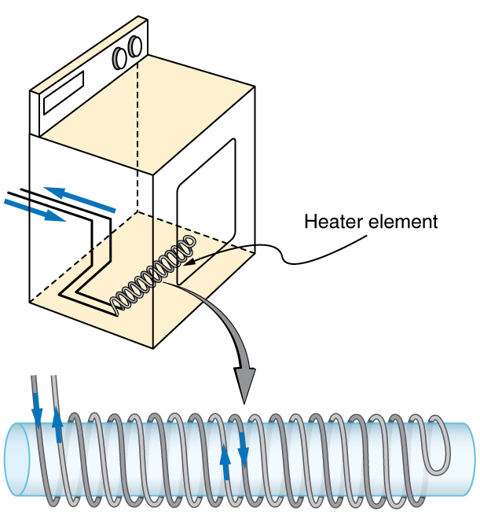
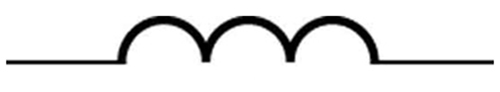

* Calculate the inductance of an inductor.
* Calculate the energy stored in an inductor.
* Calculate the emf generated in an inductor.

### Inductors

Induction is the process in which an emf is induced by changing magnetic flux. Many examples have been discussed so far, some more effective than others. Transformers, for example, are designed to be particularly effective at inducing a desired voltage and current with very little loss of energy to other forms. Is there a useful physical quantity related to how “effective” a given device is? The answer is yes, and that physical quantity is called **inductance**{: data-type="term" #import-auto-id1169738083105}.

**Mutual inductance**{: data-type="term" #import-auto-id1169737826139} is the effect of Faraday’s law of induction for one device upon another, such as the primary coil in transmitting energy to the secondary in a transformer. See [\[link\]](#import-auto-id1169738104251), where simple coils induce emfs in one another.

![The figure shows two coils coil one, of five turns and coil two, of four turns are kept adjacent to each other. The magnetic field lines of strength B are shown to pass through the two coils. Coil one is shown to be connected to an A C source. The changing current in the coil one is given as I one in clock wise direction. Coil two is connected to a galvanometer. A change in current in coil one is shown to induce an e m f in coil two.The induced e m f in coil two is measured as a deflection in galvanometer.](../resources/Figure_24_09_01.jpg "These coils can induce emfs in one another like an inefficient transformer. Their mutual inductance M indicates the effectiveness of the coupling between them. Here a change in current in coil 1 is seen to induce an emf in coil 2. (Note that &quot;&#10;        &#10;          &#10;            &#10;              &#10;                E&#10;                &#10;                  2&#10;                &#10;              &#10;            &#10;            &#10;          &#10;           size 12{E rSub { size 8{2} } } {}&#10;        &#10;      &#10;     induced&quot; represents the induced emf in coil 2.)"){: #import-auto-id1169738104251}

In the many cases where the geometry of the devices is fixed, flux is changed by varying current. We therefore concentrate on the rate of change of current, <math xmlns="http://www.w3.org/1998/Math/MathML"><semantics><mrow><mrow><mn>Δ</mn><mi>I</mi><mn>/Δ</mn><mi>t</mi></mrow><mrow /></mrow><annotation encoding="StarMath 5.0"> size 12{ΔI} {}</annotation></semantics></math>

, as the cause of induction. A change in the current <math xmlns="http://www.w3.org/1998/Math/MathML"><semantics><mrow><mrow><msub><mi>I</mi><mrow><mn>1</mn></mrow></msub></mrow><mrow /></mrow><annotation encoding="StarMath 5.0"> size 12{I rSub { size 8{1} } } {}</annotation></semantics></math>

 in one device, coil 1 in the figure, induces an <math xmlns="http://www.w3.org/1998/Math/MathML"><semantics><mrow><mrow><msub><mtext>emf</mtext><mrow><mn>2</mn></mrow></msub></mrow><mrow /></mrow><annotation encoding="StarMath 5.0"> size 12{"emf" rSub { size 8{2} } } {}</annotation></semantics></math>

 in the other. We express this in equation form as

<math xmlns="http://www.w3.org/1998/Math/MathML"><semantics><mrow><mrow><mrow><mrow><mrow><msub><mtext>emf</mtext><mrow><mn>2</mn></mrow></msub><mo stretchy="false">=</mo><mrow><mo stretchy="false">−</mo><mi>M</mi></mrow></mrow><mfrac><mrow><mn>Δ</mn><msub><mi>I</mi><mrow><mn>1</mn></mrow></msub></mrow><mrow><mn>Δ</mn><mi>t</mi></mrow></mfrac></mrow></mrow><mrow><mtext>,</mtext></mrow></mrow><mrow /></mrow><annotation encoding="StarMath 5.0"> size 12{"emf" rSub { size 8{2} } = - M { {ΔI rSub { size 8{1} } } over {Δt} } } {}</annotation></semantics></math>

where <math xmlns="http://www.w3.org/1998/Math/MathML"><semantics><mrow><mrow><mi>M</mi></mrow><mrow /></mrow><annotation encoding="StarMath 5.0"> size 12{M} {}</annotation></semantics></math>

 is defined to be the mutual inductance between the two devices. The minus sign is an expression of Lenz’s law. The larger the mutual inductance <math xmlns="http://www.w3.org/1998/Math/MathML"><semantics><mrow><mrow><mi>M</mi></mrow><mrow /></mrow><annotation encoding="StarMath 5.0"> size 12{M} {}</annotation></semantics></math>

, the more effective the coupling. For example, the coils in [\[link\]](#import-auto-id1169738104251) have a small <math xmlns="http://www.w3.org/1998/Math/MathML"><semantics><mrow><mrow><mi>M</mi></mrow><mrow /></mrow><annotation encoding="StarMath 5.0"> size 12{M} {}</annotation></semantics></math>

 compared with the transformer coils in [\[link\]](/m42414#import-auto-id1169738052317). Units for <math xmlns="http://www.w3.org/1998/Math/MathML"><semantics><mrow><mrow><mi>M</mi></mrow><mrow /></mrow><annotation encoding="StarMath 5.0"> size 12{M} {}</annotation></semantics></math>

 are <math xmlns="http://www.w3.org/1998/Math/MathML"><semantics><mrow><mrow><mrow><mo stretchy="false">(</mo><mrow><mtext>V</mtext><mo stretchy="false">⋅</mo><mtext>s</mtext></mrow><mo stretchy="false">)</mo><mrow><mtext>/A</mtext><mo stretchy="false">=</mo><mrow><mo stretchy="false">Ω</mo><mo stretchy="false">⋅</mo><mtext>s</mtext></mrow></mrow></mrow></mrow><mrow /></mrow><annotation encoding="StarMath 5.0"> size 12{ \( V cdot s \) "/A"= %OMEGA cdot s} {}</annotation></semantics></math>

, which is named a **henry**{: data-type="term" #import-auto-id1169738083318} (H), after Joseph Henry. That is, <math xmlns="http://www.w3.org/1998/Math/MathML"><semantics><mrow><mrow><mrow><mn>1 H</mn><mrow><mo stretchy="false">=</mo><mn>1</mn></mrow><mspace width="0.25em" /><mrow><mo stretchy="false">Ω</mo><mo stretchy="false">⋅</mo><mtext>s</mtext></mrow></mrow></mrow><mrow /></mrow><annotation encoding="StarMath 5.0"> size 12{1`H=1` %OMEGA cdot s} {}</annotation></semantics></math>

.

Nature is symmetric here. If we change the current <math xmlns="http://www.w3.org/1998/Math/MathML"><semantics><mrow><mrow><msub><mi>I</mi><mrow><mn>2</mn></mrow></msub></mrow><mrow /></mrow><annotation encoding="StarMath 5.0"> size 12{I rSub { size 8{2} } } {}</annotation></semantics></math>

 in coil 2, we induce an <math xmlns="http://www.w3.org/1998/Math/MathML"><semantics><mrow><mrow><msub><mtext>emf</mtext><mrow><mn>1</mn></mrow></msub></mrow><mrow /></mrow><annotation encoding="StarMath 5.0"> size 12{"emf" rSub { size 8{1} } } {}</annotation></semantics></math>

 in coil 1, which is given by

<math xmlns="http://www.w3.org/1998/Math/MathML"><semantics><mrow><mrow><mrow><mrow><mrow><msub><mtext>emf</mtext><mrow><mn>1</mn></mrow></msub><mo stretchy="false">=</mo><mrow><mo stretchy="false">−</mo><mi>M</mi></mrow></mrow><mfrac><mrow><mn>Δ</mn><msub><mi>I</mi><mrow><mn>2</mn></mrow></msub></mrow><mrow><mn>Δ</mn><mi>t</mi></mrow></mfrac></mrow></mrow><mrow><mtext>,</mtext></mrow></mrow><mrow /></mrow><annotation encoding="StarMath 5.0"> size 12{"emf" rSub { size 8{1} } = - M { {ΔI rSub { size 8{2} } } over {Δt} } } {}</annotation></semantics></math>

where <math xmlns="http://www.w3.org/1998/Math/MathML"><semantics><mrow><mrow><mi>M</mi></mrow><mrow /></mrow><annotation encoding="StarMath 5.0"> size 12{M} {}</annotation></semantics></math>

 is the same as for the reverse process. Transformers run backward with the same effectiveness, or mutual inductance <math xmlns="http://www.w3.org/1998/Math/MathML"><semantics><mrow><mrow><mi>M</mi></mrow><mrow /></mrow><annotation encoding="StarMath 5.0"> size 12{M} {}</annotation></semantics></math>

*.*

A large mutual inductance <math xmlns="http://www.w3.org/1998/Math/MathML"><semantics><mrow><mrow><mi>M</mi></mrow><mrow /></mrow><annotation encoding="StarMath 5.0"> size 12{M} {}</annotation></semantics></math>

 may or may not be desirable. We want a transformer to have a large mutual inductance. But an appliance, such as an electric clothes dryer, can induce a dangerous emf on its case if the mutual inductance between its coils and the case is large. One way to reduce mutual inductance <math xmlns="http://www.w3.org/1998/Math/MathML"><semantics><mrow><mrow><mi>M</mi></mrow><mrow /></mrow><annotation encoding="StarMath 5.0"> size 12{M} {}</annotation></semantics></math>

** is to counterwind coils to cancel the magnetic field produced. (See [\[link\]](#import-auto-id1169737730746).)

 {: #import-auto-id1169737730746}

**Self-inductance**{: data-type="term" #import-auto-id1169737911420}, the effect of Faraday’s law of induction of a device on itself, also exists. When, for example, current through a coil is increased, the magnetic field and flux also increase, inducing a counter emf, as required by Lenz’s law. Conversely, if the current is decreased, an emf is induced that opposes the decrease. Most devices have a fixed geometry, and so the change in flux is due entirely to the change in current <math xmlns="http://www.w3.org/1998/Math/MathML"><semantics><mrow><mrow><mn>Δ</mn><mi>I</mi></mrow><mrow /></mrow><annotation encoding="StarMath 5.0"> size 12{ΔI} {}</annotation></semantics></math>

 through the device. The induced emf is related to the physical geometry of the device and the rate of change of current. It is given by

<math xmlns="http://www.w3.org/1998/Math/MathML"><semantics><mrow><mrow><mrow><mrow><mrow><mtext>emf</mtext><mo stretchy="false">=</mo><mrow><mo stretchy="false">−</mo><mi>L</mi></mrow></mrow><mfrac><mrow><mn>Δ</mn><mi>I</mi></mrow><mrow><mn>Δ</mn><mi>t</mi></mrow></mfrac></mrow></mrow><mrow><mtext>,</mtext></mrow></mrow><mrow /></mrow><annotation encoding="StarMath 5.0"> size 12{"emf"= - L { {ΔI} over {Δt} } } {}</annotation></semantics></math>

where <math xmlns="http://www.w3.org/1998/Math/MathML"><semantics><mrow><mrow><mi>L</mi></mrow><mrow /></mrow><annotation encoding="StarMath 5.0"> size 12{L} {}</annotation></semantics></math>

** is the self-inductance of the device. A device that exhibits significant self-inductance is called an **inductor**{: data-type="term" #import-auto-id1169737772108}, and given the symbol in [\[link\]](#import-auto-id1169738117225).

{: #import-auto-id1169738117225}

The minus sign is an expression of Lenz’s law, indicating that emf opposes the change in current. Units of self-inductance are henries (H) just as for mutual inductance. The larger the self-inductance <math xmlns="http://www.w3.org/1998/Math/MathML"><semantics><mrow><mrow><mi>L</mi></mrow><mrow /></mrow><annotation encoding="StarMath 5.0"> size 12{L} {}</annotation></semantics></math>

 of a device, the greater its opposition to any change in current through it. For example, a large coil with many turns and an iron core has a large <math xmlns="http://www.w3.org/1998/Math/MathML"><semantics><mrow><mrow><mi>L</mi></mrow><mrow /></mrow><annotation encoding="StarMath 5.0"> size 12{L} {}</annotation></semantics></math>

 and will not allow current to change quickly. To avoid this effect, a small <math xmlns="http://www.w3.org/1998/Math/MathML"><semantics><mrow><mrow><mi>L</mi></mrow><mrow /></mrow><annotation encoding="StarMath 5.0"> size 12{L} {}</annotation></semantics></math>

 must be achieved, such as by counterwinding coils as in [\[link\]](#import-auto-id1169737730746).

A 1 H inductor is a large inductor. To illustrate this, consider a device with <math xmlns="http://www.w3.org/1998/Math/MathML"><semantics><mrow><mrow><mrow><mrow><mi>L</mi><mo stretchy="false">=</mo><mn>1</mn></mrow><mtext>.</mtext><mn>0 H</mn></mrow></mrow><mrow /></mrow><annotation encoding="StarMath 5.0"> size 12{L=1 "." 0`H} {}</annotation></semantics></math>

 that has a 10 A current flowing through it. What happens if we try to shut off the current rapidly, perhaps in only 1.0 ms? An emf, given by <math xmlns="http://www.w3.org/1998/Math/MathML"><semantics><mrow><mrow><mrow><mrow><mtext>emf</mtext><mo stretchy="false">=</mo><mrow><mo stretchy="false">−</mo><mi>L</mi></mrow></mrow><mo stretchy="false">(</mo><mrow><mrow><mn>Δ</mn><mi>I</mi></mrow><mo stretchy="false">/</mo><mrow><mn>Δ</mn><mi>t</mi></mrow></mrow><mo stretchy="false">)</mo></mrow></mrow><mrow /></mrow><annotation encoding="StarMath 5.0"> size 12{"emf"= - L \( ΔI/Δt \) } {}</annotation></semantics></math>

, will oppose the change. Thus an emf will be induced given by **<math xmlns="http://www.w3.org/1998/Math/MathML"><semantics><mrow><mrow><mrow><mrow><mtext>emf</mtext><mo stretchy="false">=</mo><mrow><mo stretchy="false">−</mo><mi>L</mi></mrow></mrow><mo stretchy="false">(</mo><mrow><mn>Δ</mn><mi>I</mi><mo stretchy="false">/</mo><mn>Δ</mn><mi>t</mi></mrow><mrow><mo stretchy="false">)</mo><mo stretchy="false">=</mo><mo stretchy="false">(</mo></mrow><mn>1</mn><mtext>.</mtext><mn>0 H</mn><mo stretchy="false">)</mo><mo stretchy="false">[</mo><mo stretchy="false">(</mo><mtext>10 A</mtext><mrow><mo stretchy="false">)</mo><mo stretchy="false">/</mo><mo stretchy="false">(</mo></mrow><mn>1</mn><mtext>.</mtext><mn>0 ms</mn><mo stretchy="false">)</mo><mrow><mo stretchy="false">]</mo><mo stretchy="false">=</mo><mtext>10,000 V</mtext></mrow></mrow></mrow><mrow /></mrow></semantics></math>

. The positive sign means this large voltage is in the same direction as the current, opposing its decrease. Such large emfs can cause arcs, damaging switching equipment, and so it may be necessary to change current more slowly.

There are uses for such a large induced voltage. Camera flashes use a battery, two inductors that function as a transformer, and a switching system or oscillator to induce large voltages. (Remember that we need a changing magnetic field, brought about by a changing current, to induce a voltage in another coil.) The oscillator system will do this many times as the battery voltage is boosted to over one thousand volts. (You may hear the high pitched whine from the transformer as the capacitor is being charged.) A capacitor stores the high voltage for later use in powering the flash. (See [\[link\]](#import-auto-id1169738245043).)

 {: #import-auto-id1169738245043}

It is possible to calculate <math xmlns="http://www.w3.org/1998/Math/MathML"><semantics><mrow><mrow><mi>L</mi></mrow><mrow /></mrow><annotation encoding="StarMath 5.0"> size 12{L} {}</annotation></semantics></math>

 for an inductor given its geometry (size and shape) and knowing the magnetic field that it produces. This is difficult in most cases, because of the complexity of the field created. So in this text the inductance <math xmlns="http://www.w3.org/1998/Math/MathML"><semantics><mrow><mrow><mi>L</mi></mrow><mrow /></mrow><annotation encoding="StarMath 5.0"> size 12{L} {}</annotation></semantics></math>

 is usually a given quantity. One exception is the solenoid, because it has a very uniform field inside, a nearly zero field outside, and a simple shape. It is instructive to derive an equation for its inductance. We start by noting that the induced emf is given by Faraday’s law of induction as **<math xmlns="http://www.w3.org/1998/Math/MathML"><semantics><mrow><mrow><mrow><mrow><mtext>emf</mtext><mo stretchy="false">=</mo><mrow><mo stretchy="false">−</mo><mi>N</mi></mrow></mrow><mo stretchy="false">(</mo><mrow><mn>Δ</mn><mi>Φ</mi><mo stretchy="false">/</mo><mn>Δ</mn><mi>t</mi></mrow><mo stretchy="false">)</mo></mrow></mrow><mrow /></mrow><annotation encoding="StarMath 5.0"> size 12{"emf"= - N \( ΔΦ/Δt \) } {}</annotation></semantics></math>

 and, by the definition of self-inductance, as **<math xmlns="http://www.w3.org/1998/Math/MathML"><semantics><mrow><mrow><mrow><mrow><mtext>emf</mtext><mo stretchy="false">=</mo><mrow><mo stretchy="false">−</mo><mi>L</mi></mrow></mrow><mo stretchy="false">(</mo><mrow><mn>Δ</mn><mi>I</mi><mo stretchy="false">/</mo><mn>Δ</mn><mi>t</mi></mrow><mo stretchy="false">)</mo></mrow></mrow><mrow /></mrow><annotation encoding="StarMath 5.0"> size 12{"emf"= - L \( ΔI/Δt \) } {}</annotation></semantics></math>

. Equating these yields

<math xmlns="http://www.w3.org/1998/Math/MathML"><semantics><mrow><mrow><mrow><mrow><mrow><mtext>emf</mtext><mo stretchy="false">=</mo><mrow><mo stretchy="false">−</mo><mi>N</mi></mrow></mrow><mrow><mfrac><mrow><mn>Δ</mn><mi>Φ</mi></mrow><mrow><mn>Δ</mn><mi>t</mi></mrow></mfrac><mo stretchy="false">=</mo><mrow><mo stretchy="false">−</mo><mi>L</mi></mrow></mrow><mfrac><mrow><mn>Δ</mn><mi>I</mi></mrow><mrow><mn>Δ</mn><mi>t</mi></mrow></mfrac></mrow></mrow><mrow><mtext>.</mtext></mrow></mrow><mrow /></mrow><annotation encoding="StarMath 5.0"> size 12{"emf"= - N { {ΔΦ} over {Δt} } = - L { {ΔI} over {Δt} } } {}</annotation></semantics></math>

Solving for <math xmlns="http://www.w3.org/1998/Math/MathML"><semantics><mrow><mrow><mi>L</mi></mrow><mrow /></mrow><annotation encoding="StarMath 5.0"> size 12{L} {}</annotation></semantics></math>

 gives

<math xmlns="http://www.w3.org/1998/Math/MathML"><semantics><mrow><mrow><mrow><mrow><mrow><mi>L</mi><mo stretchy="false">=</mo><mi>N</mi></mrow><mfrac><mrow><mn>Δ</mn><mi>Φ</mi></mrow><mrow><mn>Δ</mn><mi>I</mi></mrow></mfrac></mrow></mrow><mrow><mtext>.</mtext></mrow></mrow><mrow /></mrow><annotation encoding="StarMath 5.0"> size 12{L=N { {ΔΦ} over {ΔI} } } {}</annotation></semantics></math>

This equation for the self-inductance <math xmlns="http://www.w3.org/1998/Math/MathML"><semantics><mrow><mrow><mi>L</mi></mrow><mrow /></mrow><annotation encoding="StarMath 5.0"> size 12{L} {}</annotation></semantics></math>

 of a device is always valid. It means that self-inductance <math xmlns="http://www.w3.org/1998/Math/MathML"><semantics><mrow><mrow><mi>L</mi></mrow><mrow /></mrow><annotation encoding="StarMath 5.0"> size 12{L} {}</annotation></semantics></math>

 depends on how effective the current is in creating flux; the more effective, the greater <math xmlns="http://www.w3.org/1998/Math/MathML"><semantics><mrow><mrow><mn>Δ</mn><mi>Φ</mi></mrow><mrow /></mrow><annotation encoding="StarMath 5.0"> size 12{ΔΦ} {}</annotation></semantics></math>

/ <math xmlns="http://www.w3.org/1998/Math/MathML"><semantics><mrow><mrow><mn>Δ</mn><mi>I</mi></mrow><mrow /></mrow><annotation encoding="StarMath 5.0"> size 12{ΔI} {}</annotation></semantics></math>

 is.

Let us use this last equation to find an expression for the inductance of a solenoid. Since the area <math xmlns="http://www.w3.org/1998/Math/MathML"> <semantics> <mi>A</mi> </semantics> </math>

 of a solenoid is fixed, the change in flux is <math xmlns="http://www.w3.org/1998/Math/MathML"> <semantics> <mrow> <mtext>Δ</mtext> <mi>Φ</mi> <mo>=</mo> <mtext>Δ</mtext> <mo>(</mo> <mi>B</mi> <mi>A</mi> <mo>)</mo> <mo>=</mo> <mi>A</mi> <mtext>Δ</mtext> <mi>B</mi> </mrow> </semantics> </math>

. To find <math xmlns="http://www.w3.org/1998/Math/MathML"> <semantics> <mrow> <mtext>Δ</mtext> <mi>B</mi> </mrow> </semantics> </math>

, we note that the magnetic field of a solenoid is given by <math xmlns="http://www.w3.org/1998/Math/MathML"><semantics><mrow><mrow><mrow><mrow><mi>B</mi><mo stretchy="false">=</mo><msub><mi>μ</mi><mrow><mn>0</mn></mrow></msub></mrow><mrow><mstyle fontstyle="italic"><mrow><mtext>nI</mtext></mrow></mstyle><mo stretchy="false">=</mo><msub><mi>μ</mi><mrow><mn>0</mn></mrow></msub></mrow><mfrac><mstyle fontstyle="italic"><mrow><mtext>NI</mtext></mrow></mstyle><mi>ℓ</mi></mfrac></mrow></mrow><mrow /></mrow><annotation encoding="StarMath 5.0"> size 12{B=μ rSub { size 8{0} } ital "nI"=μ rSub { size 8{0} } { { ital "NI"} over {ℓ} } } {}</annotation></semantics></math>

. (Here <math xmlns="http://www.w3.org/1998/Math/MathML"><semantics><mrow><mrow><mrow><mi>n</mi><mo stretchy="false">=</mo><mrow><mi>N</mi><mo stretchy="false">/</mo><mi>ℓ</mi></mrow></mrow></mrow><mrow /></mrow><annotation encoding="StarMath 5.0"> size 12{n=N/ℓ} {}</annotation></semantics></math>

, where <math xmlns="http://www.w3.org/1998/Math/MathML"> <semantics> <mi>N</mi> </semantics> </math>

 is the number of coils and <math xmlns="http://www.w3.org/1998/Math/MathML"> <semantics> <mi>ℓ</mi> </semantics> </math>

 is the solenoid’s length.) Only the current changes, so that <math xmlns="http://www.w3.org/1998/Math/MathML"><semantics><mrow><mrow><mrow><mrow><mrow><mn>Δ</mn><mi>Φ</mi><mo stretchy="false">=</mo><mi fontstyle="italic">A</mi><mn>Δ</mn><mi>B</mi></mrow><mo stretchy="false">=</mo><msub><mi>μ</mi><mrow><mn>0</mn></mrow></msub></mrow><mstyle fontstyle="italic"><mrow><mtext>NA</mtext></mrow></mstyle><mfrac><mrow><mn>Δ</mn><mi>I</mi></mrow><mi>ℓ</mi></mfrac></mrow></mrow><mrow /></mrow><annotation encoding="StarMath 5.0"> size 12{ΔΦ=AΔB=μ rSub { size 8{0} } ital "NA" { {ΔI} over {ℓ} } } {}</annotation></semantics></math>

. Substituting <math xmlns="http://www.w3.org/1998/Math/MathML"> <semantics> <mrow> <mtext>Δ</mtext> <mi>Φ</mi> </mrow> </semantics> </math>

 into <math xmlns="http://www.w3.org/1998/Math/MathML"><semantics><mrow><mrow><mrow><mrow><mi>L</mi><mo stretchy="false">=</mo><mi>N</mi></mrow><mfrac><mrow><mn>Δ</mn><mi>Φ</mi></mrow><mrow><mn>Δ</mn><mi>I</mi></mrow></mfrac></mrow></mrow><mrow /></mrow><annotation encoding="StarMath 5.0"> size 12{L=N { {ΔΦ} over {ΔI} } } {}</annotation></semantics></math>

 gives

<math xmlns="http://www.w3.org/1998/Math/MathML"><semantics><mrow><mrow><mrow><mrow><mrow><mi>L</mi><mo stretchy="false">=</mo><mi>N</mi></mrow><mrow><mfrac><mrow><mn>Δ</mn><mi>Φ</mi></mrow><mrow><mn>Δ</mn><mi>I</mi></mrow></mfrac><mo stretchy="false">=</mo><mi>N</mi></mrow><mfrac><mrow><msub><mi>μ</mi><mrow><mn>0</mn></mrow></msub><mstyle fontstyle="italic"><mrow><mtext>NA</mtext></mrow></mstyle><mfrac><mrow><mn>Δ</mn><mi>I</mi></mrow><mi>ℓ</mi></mfrac></mrow><mrow><mn>Δ</mn><mi>I</mi></mrow></mfrac></mrow></mrow><mrow><mtext>.</mtext></mrow></mrow><mrow /></mrow><annotation encoding="StarMath 5.0"> size 12{L=N { {ΔΦ} over {ΔI} } =N { {μ rSub { size 8{0} } ital "NA" { {ΔI} over {ℓ} } } over {ΔI} } } {}</annotation></semantics></math>

This simplifies to

<math xmlns="http://www.w3.org/1998/Math/MathML"><semantics><mrow><mrow><mrow><mrow><mi>L</mi><mo stretchy="false">=</mo><mfrac><mrow><msub><mi>μ</mi><mrow><mn>0</mn></mrow></msub><msup><mi>N</mi><mrow><mn>2</mn></mrow></msup><mi>A</mi></mrow><mi>ℓ</mi></mfrac></mrow></mrow><mrow><mtext>(solenoid).</mtext></mrow></mrow><mrow /></mrow><annotation encoding="StarMath 5.0"> size 12{L= { {μ rSub { size 8{0} } N rSup { size 8{2} } A} over {ℓ} } } {}</annotation></semantics></math>

This is the self-inductance of a solenoid of cross-sectional area <math xmlns="http://www.w3.org/1998/Math/MathML"> <semantics> <mi>A</mi> </semantics> </math>

 and length <math xmlns="http://www.w3.org/1998/Math/MathML"> <semantics> <mi>ℓ</mi> </semantics> </math>

. Note that the inductance depends only on the physical characteristics of the solenoid, consistent with its definition.

Calculating the Self-inductance of a Moderate Size Solenoid

Calculate the self-inductance of a 10.0 cm long, 4.00 cm diameter solenoid that has 200 coils.

**Strategy**

This is a straightforward application of <math xmlns="http://www.w3.org/1998/Math/MathML"><semantics><mrow><mrow><mrow><mi>L</mi><mo stretchy="false">=</mo><mfrac><mrow><msub><mi>μ</mi><mrow><mn>0</mn></mrow></msub><msup><mi>N</mi><mrow><mn>2</mn></mrow></msup><mi>A</mi></mrow><mi>ℓ</mi></mfrac></mrow></mrow><mrow /></mrow><annotation encoding="StarMath 5.0"> size 12{L= { {μ rSub { size 8{0} } N rSup { size 8{2} } A} over {ℓ} } } {}</annotation></semantics></math>

, since all quantities in the equation except <math xmlns="http://www.w3.org/1998/Math/MathML"><semantics><mrow><mrow><mi>L</mi></mrow><mrow /></mrow><annotation encoding="StarMath 5.0"> size 12{L} {}</annotation></semantics></math>

 are known.

**Solution**

Use the following expression for the self-inductance of a solenoid:

<math xmlns="http://www.w3.org/1998/Math/MathML"><semantics><mrow><mrow><mrow><mrow><mi>L</mi><mo stretchy="false">=</mo><mfrac><mrow><msub><mi>μ</mi><mrow><mn>0</mn></mrow></msub><msup><mi>N</mi><mrow><mn>2</mn></mrow></msup><mi>A</mi></mrow><mi>ℓ</mi></mfrac></mrow></mrow><mrow><mtext>.</mtext></mrow></mrow><mrow /></mrow><annotation encoding="StarMath 5.0"> size 12{L= { {μ rSub { size 8{0} } N rSup { size 8{2} } A} over {ℓ} } } {}</annotation></semantics></math>

The cross-sectional area in this example is <math xmlns="http://www.w3.org/1998/Math/MathML"><semantics><mrow><mrow><mrow><mrow><mrow><mi>A</mi><mo stretchy="false">=</mo><msup><mi fontstyle="italic">πr</mi><mrow><mn>2</mn></mrow></msup></mrow><mo stretchy="false">=</mo><mo stretchy="false">(</mo></mrow><mn>3</mn><mtext>.</mtext><mtext>14</mtext><mtext>.</mtext><mtext>.</mtext><mtext>.</mtext><mo stretchy="false">)</mo><mo stretchy="false">(</mo><mn>0</mn><mtext>.0200 m</mtext><mrow><msup><mo stretchy="false">)</mo><mrow><mn>2</mn></mrow></msup><mo stretchy="false">=</mo><mn>1</mn></mrow><mtext>.</mtext><mrow><mtext>26</mtext><mo stretchy="false">×</mo><msup><mtext>10</mtext><mrow><mrow><mo stretchy="false">−</mo><mn>3</mn></mrow></mrow></msup></mrow><mspace width="0.25em" /><msup><mtext>m</mtext><mrow><mn>2</mn></mrow></msup></mrow></mrow><mrow /></mrow><annotation encoding="StarMath 5.0"> size 12{A=πr rSup { size 8{2} } = \( 3 "." "14" "." "." "." \) \( 0 "." "0200"`m \) rSup { size 8{2} } =1 "." "26" times "10" rSup { size 8{ - 3} } `m rSup { size 8{2} } } {}</annotation></semantics></math>

, <math xmlns="http://www.w3.org/1998/Math/MathML"> <semantics> <mi>N</mi> </semantics> </math>

 is given to be 200, and the length <math xmlns="http://www.w3.org/1998/Math/MathML"> <semantics> <mi>ℓ</mi> </semantics> </math>

 is 0.100 m. We know the permeability of free space is <math xmlns="http://www.w3.org/1998/Math/MathML"><semantics><mrow><mrow><mrow><mrow><msub><mi>μ</mi><mrow><mn>0</mn></mrow></msub><mo stretchy="false">=</mo><mrow><mn>4π</mn><mo stretchy="false">×</mo><msup><mtext>10</mtext><mrow><mtext>−7</mtext></mrow></msup></mrow></mrow><mspace width="0.25em" /><mrow><mtext>T</mtext><mo stretchy="false">⋅</mo><mtext>m/A</mtext></mrow></mrow></mrow><mrow /></mrow></semantics></math>

. Substituting these into the expression for <math xmlns="http://www.w3.org/1998/Math/MathML"> <semantics> <mi>L</mi> </semantics> </math>

 gives

<math xmlns="http://www.w3.org/1998/Math/MathML"><semantics><mrow><mrow><mtable columnalign="left"><mtr> <mtd><mi>L</mi></mtd> <mtd><mo stretchy="false">=</mo></mtd> <mtd> <mrow><mrow><mrow><mfrac><mrow><mo stretchy="false">(</mo><mrow><mn>4π</mn><mo stretchy="false">×</mo><msup><mtext>10</mtext><mrow><mrow><mo stretchy="false">−</mo><mn>7</mn></mrow></mrow></msup></mrow><mrow><mspace width="0.25em" /><mtext> T</mtext><mo stretchy="false">⋅</mo><mtext>m/A</mtext></mrow><mo stretchy="false">)</mo><mo stretchy="false">(</mo><mtext>200</mtext><msup><mo stretchy="false">)</mo><mrow><mn>2</mn></mrow></msup><mo stretchy="false">(</mo><mn>1.26</mn><mrow><mo stretchy="false">×</mo><msup><mtext>10</mtext><mrow><mrow><mo stretchy="false">−</mo><mn>3</mn></mrow></mrow></msup></mrow><mspace width="0.25em" /><msup><mtext> m</mtext><mrow><mn>2</mn></mrow></msup><mo stretchy="false">)</mo></mrow><mrow><mn>0.100 m</mn></mrow></mfrac></mrow></mrow><mrow /></mrow></mtd></mtr> <mtr><mtd /> <mtd><mo stretchy="false">=</mo></mtd> <mtd><mrow><mrow><mn>0</mn></mrow><mtext>.</mtext><mtext>632 mH</mtext><mtext>.</mtext></mrow></mtd></mtr></mtable><mrow /><mrow /></mrow></mrow></semantics></math>

**Discussion**

This solenoid is moderate in size. Its inductance of nearly a millihenry is also considered moderate.

One common application of inductance is used in traffic lights that can tell when vehicles are waiting at the intersection. An electrical circuit with an inductor is placed in the road under the place a waiting car will stop over. The body of the car increases the inductance and the circuit changes sending a signal to the traffic lights to change colors. Similarly, metal detectors used for airport security employ the same technique. A coil or inductor in the metal detector frame acts as both a transmitter and a receiver. The pulsed signal in the transmitter coil induces a signal in the receiver. The self-inductance of the circuit is affected by any metal object in the path. Such detectors can be adjusted for sensitivity and also can indicate the approximate location of metal found on a person. (But they will not be able to detect any plastic explosive such as that found on the “underwear bomber.”) See [\[link\]](#import-auto-id1169738066155).

"){: #import-auto-id1169738066155}

### Energy Stored in an Inductor

We know from Lenz’s law that inductances oppose changes in current. There is an alternative way to look at this opposition that is based on energy. Energy is stored in a magnetic field. It takes time to build up energy, and it also takes time to deplete energy; hence, there is an opposition to rapid change. In an inductor, the magnetic field is directly proportional to current and to the inductance of the device. It can be shown that the <strong data-type="term" id="import-auto-id1169738257075">energy stored in an inductor </strong><math xmlns="http://www.w3.org/1998/Math/MathML"><semantics><mrow><mrow><msub><mi>E</mi><mrow><mtext>ind</mtext></mrow></msub></mrow><mrow /></mrow><annotation encoding="StarMath 5.0"> size 12{E rSub { size 8{"ind"} } } {}</annotation></semantics></math>

 is given by

<math xmlns="http://www.w3.org/1998/Math/MathML"><semantics><mrow><mrow><mrow><mrow><mrow><msub><mi>E</mi><mrow><mtext>ind</mtext></mrow></msub><mo stretchy="false">=</mo><mfrac><mn>1</mn><mn>2</mn></mfrac></mrow><mstyle><mrow><msup><mtext fontstyle="italic">LI</mtext><mrow><mn>2</mn></mrow></msup></mrow></mstyle></mrow></mrow><mrow><mtext>.</mtext></mrow></mrow><mrow /></mrow><annotation encoding="StarMath 5.0"> size 12{E rSub { size 8{"ind"} } = { {1} over {2} } ital "LI" rSup { size 8{2} } } {}</annotation></semantics></math>

This expression is similar to that for the energy stored in a capacitor.

Calculating the Energy Stored in the Field of a Solenoid

How much energy is stored in the 0.632 mH inductor of the preceding example when a 30.0 A current flows through it?

**Strategy**

The energy is given by the equation <math xmlns="http://www.w3.org/1998/Math/MathML"><semantics><mrow><mrow><mrow><mrow><msub><mi>E</mi><mrow><mtext>ind</mtext></mrow></msub><mo stretchy="false">=</mo><mfrac><mn>1</mn><mn>2</mn></mfrac></mrow><mstyle><mrow><msup><mtext fontstyle="italic">LI</mtext><mrow><mn>2</mn></mrow></msup></mrow></mstyle></mrow></mrow><mrow /></mrow><annotation encoding="StarMath 5.0"> size 12{E rSub { size 8{"ind"} } = { {1} over {2} } ital "LI" rSup { size 8{2} } } {}</annotation></semantics></math>

, and all quantities except <math xmlns="http://www.w3.org/1998/Math/MathML"><semantics><mrow><mrow><msub><mi>E</mi><mrow><mtext>ind</mtext></mrow></msub></mrow><mrow /></mrow><annotation encoding="StarMath 5.0"> size 12{E rSub { size 8{"ind"} } } {}</annotation></semantics></math>

 are known.

**Solution**

Substituting the value for <math xmlns="http://www.w3.org/1998/Math/MathML"><semantics><mrow><mrow><mi>L</mi></mrow><mrow /></mrow><annotation encoding="StarMath 5.0"> size 12{L} {}</annotation></semantics></math>

 found in the previous example and the given current into <math xmlns="http://www.w3.org/1998/Math/MathML"><semantics><mrow><mrow><mrow><mrow><msub><mi>E</mi><mrow><mtext>ind</mtext></mrow></msub><mo stretchy="false">=</mo><mfrac><mn>1</mn><mn>2</mn></mfrac></mrow><mstyle><mrow><msup><mtext fontstyle="italic">LI</mtext><mrow><mn>2</mn></mrow></msup></mrow></mstyle></mrow></mrow><mrow /></mrow><annotation encoding="StarMath 5.0"> size 12{E rSub { size 8{"ind"} } = { {1} over {2} } ital "LI" rSup { size 8{2} } } {}</annotation></semantics></math>

 gives

<math xmlns="http://www.w3.org/1998/Math/MathML"><semantics><mrow><mrow><mtable columnalign="left"><mtr> <mtd><msub><mi>E</mi><mrow><mtext>ind</mtext></mrow></msub></mtd> <mtd><mo stretchy="false">=</mo></mtd> <mtd><mrow><mrow><mrow><mrow><mfrac><mn>1</mn><mn>2</mn></mfrac></mrow><mrow><msup><mtext fontstyle="italic">LI</mtext><mrow><mn>2</mn></mrow></msup></mrow></mrow></mrow><mrow /></mrow></mtd></mtr> <mtr><mtd /> <mtd><mo stretchy="false">=</mo></mtd> <mtd><mrow><mrow><mn>0.5</mn></mrow><mo stretchy="false">(</mo><mn>0.632</mn><mrow><mo stretchy="false">×</mo><msup><mtext>10</mtext><mrow><mrow><mo stretchy="false">−</mo><mn>3</mn></mrow></mrow></msup></mrow><mspace width="0.25em" /><mtext> H</mtext><mo stretchy="false">)</mo><mo stretchy="false">(</mo><mtext>30.0 A</mtext><mrow><msup><mo stretchy="false">)</mo><mrow><mn>2</mn></mrow></msup><mo stretchy="false">=</mo></mrow><mtext>0.284 J</mtext><mtext>.</mtext></mrow></mtd></mtr></mtable><mrow /><mrow /></mrow></mrow></semantics></math>

**Discussion**

This amount of energy is certainly enough to cause a spark if the current is suddenly switched off. It cannot be built up instantaneously unless the power input is infinite.

### Section Summary

* {: #import-auto-id1169737825294} Inductance is the property of a device that tells how effectively it induces an emf in another device.
* {: #import-auto-id1169738109560} Mutual inductance is the effect of two devices in inducing emfs in each other.
* {: #import-auto-id1169737764278} A change in current
  <math xmlns="http://www.w3.org/1998/Math/MathML"><semantics><mrow><mrow><mrow><mn>Δ</mn><msub><mi>I</mi><mrow><mn>1</mn></mrow></msub><mo stretchy="false">/</mo><mn>Δ</mn><mi>t</mi></mrow></mrow><mrow /></mrow><annotation encoding="StarMath 5.0"> size 12{ΔI rSub { size 8{1} } /Δt} {}</annotation></semantics></math>
  
  in one induces an emf
  <math xmlns="http://www.w3.org/1998/Math/MathML"><semantics><mrow><mrow><msub><mtext>emf</mtext><mrow><mn>2</mn></mrow></msub></mrow><mrow /></mrow><annotation encoding="StarMath 5.0"> size 12{"emf" rSub { size 8{2} } } {}</annotation></semantics></math>
  
  in the second:
  

  <math xmlns="http://www.w3.org/1998/Math/MathML"><semantics><mrow><mrow><mrow><mrow><mrow><msub><mtext>emf</mtext><mrow><mn>2</mn></mrow></msub><mo stretchy="false">=</mo><mrow><mo stretchy="false">−</mo><mi>M</mi></mrow></mrow><mfrac><mrow><mn>Δ</mn><msub><mi>I</mi><mrow><mn>1</mn></mrow></msub></mrow><mrow><mn>Δ</mn><mi>t</mi></mrow></mfrac></mrow></mrow><mrow><mtext>,</mtext></mrow></mrow><mrow /></mrow><annotation encoding="StarMath 5.0"> size 12{"emf" rSub { size 8{2} } = - M { {ΔI rSub { size 8{1} } } over {Δt} } } {}</annotation></semantics></math>
  

  
  where
  <math xmlns="http://www.w3.org/1998/Math/MathML"> <semantics> <mi>M</mi> </semantics> </math>
  
  is defined to be the mutual inductance between the two devices, and the minus sign is due to Lenz’s law.
* {: #import-auto-id1169738205795} Symmetrically, a change in current
  <math xmlns="http://www.w3.org/1998/Math/MathML"><semantics><mrow><mrow><mrow><mn>Δ</mn><msub><mi>I</mi><mrow><mn>2</mn></mrow></msub><mo stretchy="false">/</mo><mn>Δ</mn><mi>t</mi></mrow></mrow><mrow /></mrow><annotation encoding="StarMath 5.0"> size 12{ΔI rSub { size 8{2} } /Δt} {}</annotation></semantics></math>
  
  through the second device induces an emf
  <math xmlns="http://www.w3.org/1998/Math/MathML"><semantics><mrow><mrow><msub><mtext>emf</mtext><mrow><mn>1</mn></mrow></msub></mrow><mrow /></mrow><annotation encoding="StarMath 5.0"> size 12{"emf" rSub { size 8{1} } } {}</annotation></semantics></math>
  
  in the first:
  

  <math xmlns="http://www.w3.org/1998/Math/MathML"><semantics><mrow><mrow><mrow><mrow><mrow><msub><mtext>emf</mtext><mrow><mn>1</mn></mrow></msub><mo stretchy="false">=</mo><mrow><mo stretchy="false">−</mo><mi>M</mi></mrow></mrow><mfrac><mrow><mn>Δ</mn><msub><mi>I</mi><mrow><mn>2</mn></mrow></msub></mrow><mrow><mn>Δ</mn><mi>t</mi></mrow></mfrac></mrow></mrow><mrow><mtext>,</mtext></mrow></mrow><mrow /></mrow><annotation encoding="StarMath 5.0"> size 12{"emf" rSub { size 8{1} } = - M { {ΔI rSub { size 8{2} } } over {Δt} } } {}</annotation></semantics></math>
  

  
  where
  <math xmlns="http://www.w3.org/1998/Math/MathML"> <semantics> <mi>M</mi> </semantics> </math>
  
  is the same mutual inductance as in the reverse process.
* {: #import-auto-id1169738069392} Current changes in a device induce an emf in the device itself.
* {: #import-auto-id1169738076487} Self-inductance is the effect of the device inducing emf in itself.
* {: #import-auto-id1169737817123} The device is called an inductor, and the emf **induced in it by a change in current through it is
  

  <math xmlns="http://www.w3.org/1998/Math/MathML"><semantics><mrow><mrow><mrow><mrow><mrow><mtext>emf</mtext><mo stretchy="false">=</mo><mrow><mo stretchy="false">−</mo><mi>L</mi></mrow></mrow><mfrac><mrow><mn>Δ</mn><mi>I</mi></mrow><mrow><mn>Δ</mn><mi>t</mi></mrow></mfrac></mrow></mrow><mrow><mtext>,</mtext></mrow></mrow><mrow /></mrow><annotation encoding="StarMath 5.0"> size 12{"emf"= - L { {ΔI} over {Δt} } } {}</annotation></semantics></math>
  

  
  where
  <math xmlns="http://www.w3.org/1998/Math/MathML"><semantics><mrow><mrow><mi>L</mi></mrow><mrow /></mrow><annotation encoding="StarMath 5.0"> size 12{L} {}</annotation></semantics></math>
  
  is the self-inductance of the inductor, and
  <math xmlns="http://www.w3.org/1998/Math/MathML"><semantics><mrow><mrow><mrow><mn>Δ</mn><mi>I</mi><mo stretchy="false">/</mo><mn>Δ</mn><mi>t</mi></mrow></mrow><mrow /></mrow><annotation encoding="StarMath 5.0"> size 12{ΔI/Δt} {}</annotation></semantics></math>
  
  is the rate of change of current through it. The minus sign indicates that emf opposes the change in current, as required by Lenz’s law.
* {: #import-auto-id1169737854625} The unit of self- and mutual inductance is the henry (H), where
  <math xmlns="http://www.w3.org/1998/Math/MathML"><semantics><mrow><mrow><mrow><mn>1 H</mn><mrow><mo stretchy="false">=</mo><mo stretchy="false">1 Ω</mo><mo stretchy="false">⋅</mo><mtext>s</mtext></mrow></mrow></mrow><mrow /></mrow><annotation encoding="StarMath 5.0"> size 12{1`H=1` %OMEGA cdot s} {}</annotation></semantics></math>
  
  .
* {: #import-auto-id1169737785856} The self-inductance
  <math xmlns="http://www.w3.org/1998/Math/MathML"><semantics><mrow><mrow><mi>L</mi></mrow><mrow /></mrow><annotation encoding="StarMath 5.0"> size 12{L} {}</annotation></semantics></math>
  
  of an inductor is proportional to how much flux changes with current. For an
  <math xmlns="http://www.w3.org/1998/Math/MathML"><semantics><mrow><mrow><mi>N</mi></mrow><mrow /></mrow><annotation encoding="StarMath 5.0"> size 12{N} {}</annotation></semantics></math>
  
  -turn inductor,
  

  <math xmlns="http://www.w3.org/1998/Math/MathML"><semantics><mrow><mrow><mrow><mrow><mrow><mi>L</mi><mo stretchy="false">=</mo><mi>N</mi></mrow><mfrac><mrow><mn>Δ</mn><mi>Φ</mi></mrow><mrow><mn>Δ</mn><mi>I</mi></mrow></mfrac></mrow></mrow> <mrow><mtext>.</mtext></mrow></mrow><mrow /></mrow><annotation encoding="StarMath 5.0"> size 12{L=N { {ΔΦ} over {ΔI} } } {}</annotation></semantics></math>
  

* {: #import-auto-id1169738244239} The self-inductance of a solenoid is
  

  <math xmlns="http://www.w3.org/1998/Math/MathML"><semantics><mrow><mrow><mrow><mrow><mi>L</mi><mo stretchy="false">=</mo><mfrac><mrow><msub><mi>μ</mi><mrow><mn>0</mn></mrow></msub><msup><mi>N</mi><mrow><mn>2</mn></mrow></msup><mi>A</mi></mrow><mi>ℓ</mi></mfrac></mrow></mrow><mrow><mtext>(solenoid),</mtext></mrow></mrow><mrow /></mrow><annotation encoding="StarMath 5.0"> size 12{L= { {μ rSub { size 8{0} } N rSup { size 8{2} } A} over {ℓ} } } {}</annotation></semantics></math>
  

  
  where
  <math xmlns="http://www.w3.org/1998/Math/MathML"><semantics><mrow><mrow><mi>N</mi></mrow><mrow /></mrow><annotation encoding="StarMath 5.0"> size 12{N} {}</annotation></semantics></math>
  
  is its number of turns in the solenoid,
  <math xmlns="http://www.w3.org/1998/Math/MathML"><semantics><mrow><mrow><mi>A</mi></mrow><mrow /></mrow><annotation encoding="StarMath 5.0"> size 12{A} {}</annotation></semantics></math>
  
  is its cross-sectional area,
  <math xmlns="http://www.w3.org/1998/Math/MathML"><semantics><mrow><mrow><mi>ℓ</mi></mrow><mrow /></mrow><annotation encoding="StarMath 5.0"> size 12{ℓ} {}</annotation></semantics></math>
  
  is its length, and
  <math xmlns="http://www.w3.org/1998/Math/MathML"><semantics><mrow><mrow><mrow><mrow><msub><mtext>μ</mtext><mrow><mn>0</mn></mrow></msub><mo stretchy="false">=</mo><mrow><mn>4π</mn><mo stretchy="false">×</mo><msup><mtext>10</mtext><mrow><mtext>−7</mtext></mrow></msup></mrow></mrow><mspace width="0.25em" /><mrow><mtext>T</mtext><mo stretchy="false">⋅</mo><mtext>m/A</mtext></mrow><mspace width="0.10em" /></mrow></mrow><mrow /></mrow><annotation encoding="StarMath 5.0"> size 12{μ rSub { size 8{0} } =4π times "10" rSup { size 8{"-7"} } `T cdot "m/A"} {}</annotation></semantics></math>
  
  is the permeability of free space.
* {: #import-auto-id1169737056447} The energy stored in an inductor
  <math xmlns="http://www.w3.org/1998/Math/MathML"><semantics><mrow><mrow><msub><mi>E</mi><mrow><mtext>ind</mtext></mrow></msub></mrow><mrow /></mrow><annotation encoding="StarMath 5.0"> size 12{E rSub { size 8{"ind"} } } {}</annotation></semantics></math>
  
  is
  

  <math xmlns="http://www.w3.org/1998/Math/MathML"><semantics><mrow><mrow><mrow><mrow><mrow><msub><mi>E</mi><mrow><mtext>ind</mtext></mrow></msub><mo stretchy="false">=</mo><mfrac><mn>1</mn><mn>2</mn></mfrac></mrow><mstyle><mrow><msup><mtext fontstyle="italic">LI</mtext><mrow><mn>2</mn></mrow></msup></mrow></mstyle></mrow></mrow><mrow><mtext>.</mtext></mrow></mrow><mrow /></mrow><annotation encoding="StarMath 5.0"> size 12{E rSub { size 8{"ind"} } = { {1} over {2} } ital "LI" rSup { size 8{2} } } {}</annotation></semantics></math>
  

### Conceptual Questions

How would you place two identical flat coils in contact so that they had the greatest mutual inductance? The least?

How would you shape a given length of wire to give it the greatest self-inductance? The least?

Verify, as was concluded without proof in [[link]](#fs-id1169738144436), that units of <math xmlns="http://www.w3.org/1998/Math/MathML"><semantics><mrow><mrow><mrow><mrow><mrow><mrow><mtext>T</mtext><mo stretchy="false">⋅</mo><msup><mtext>m</mtext><mrow><mn>2</mn></mrow></msup></mrow><mo stretchy="false">/</mo><mi>A</mi></mrow><mo stretchy="false">=</mo><mrow><mo stretchy="false">Ω</mo><mo stretchy="false">⋅</mo><mtext>s</mtext></mrow></mrow><mo stretchy="false">=</mo><mtext>H</mtext></mrow></mrow><mrow /></mrow><annotation encoding="StarMath 5.0"> size 12{T cdot m rSup { size 8{2} } /A= %OMEGA cdot s=H} {}</annotation></semantics></math>

.

### Problems &amp; Exercises

Two coils are placed close together in a physics lab to demonstrate Faraday’s law of induction. A current of 5.00 A in one is switched off in 1.00 ms, inducing a 9.00 V emf in the other. What is their mutual inductance?

1\.80 mH

If two coils placed next to one another have a mutual inductance of 5.00 mH, what voltage is induced in one when the 2.00 A current in the other is switched off in 30.0 ms?

The 4.00 A current through a 7.50 mH inductor is switched off in 8.33 ms. What is the emf induced opposing this?

3\.60 V

A device is turned on and 3.00 A flows through it 0.100 ms later. What is the self-inductance of the device if an induced 150 V emf opposes this?

Starting with <math xmlns="http://www.w3.org/1998/Math/MathML"><semantics><mrow><mrow><mrow><mrow><msub><mtext>emf</mtext><mrow><mn>2</mn></mrow></msub><mo stretchy="false">=</mo><mrow><mo stretchy="false">−</mo><mi>M</mi></mrow></mrow><mfrac><mrow><mn>Δ</mn><msub><mi>I</mi><mrow><mn>1</mn></mrow></msub></mrow><mrow><mn>Δ</mn><mi>t</mi></mrow></mfrac></mrow></mrow><mrow /></mrow><annotation encoding="StarMath 5.0"> size 12{"emf" rSub { size 8{2} } = - M { {ΔI rSub { size 8{1} } } over {Δt} } } {}</annotation></semantics></math>

, show that the units of inductance are <math xmlns="http://www.w3.org/1998/Math/MathML"><semantics><mrow><mrow><mrow><mo stretchy="false">(</mo><mrow><mtext>V</mtext><mo stretchy="false">⋅</mo><mtext>s</mtext></mrow><mo stretchy="false">)</mo><mrow><mtext>/A</mtext><mo stretchy="false">=</mo><mrow><mo stretchy="false">Ω</mo><mo stretchy="false">⋅</mo><mtext>s</mtext></mrow></mrow></mrow></mrow><mrow /></mrow><annotation encoding="StarMath 5.0"> size 12{ \( V cdot s \) "/A"= %OMEGA cdot s} {}</annotation></semantics></math>

.

Camera flashes charge a capacitor to high voltage by switching the current through an inductor on and off rapidly. In what time must the 0.100 A current through a 2.00 mH inductor be switched on or off to induce a 500 V emf?

A large research solenoid has a self-inductance of 25.0 H. (a) What induced emf opposes shutting it off when 100 A of current through it is switched off in 80.0 ms? (b) How much energy is stored in the inductor at full current? (c) At what rate in watts must energy be dissipated to switch the current off in 80.0 ms? (d) In view of the answer to the last part, is it surprising that shutting it down this quickly is difficult?

(a) 31.3 kV

(b) 125 kJ

(c) 1.56 MW

(d) No, it is not surprising since this power is very high.

(a) Calculate the self-inductance of a 50.0 cm long, 10.0 cm diameter solenoid having 1000 loops. (b) How much energy is stored in this inductor when 20.0 A of current flows through it? (c) How fast can it be turned off if the induced emf cannot exceed 3.00 V?

A precision laboratory resistor is made of a coil of wire 1.50 cm in diameter and 4.00 cm long, and it has 500 turns. (a) What is its self-inductance? (b) What average emf is induced if the 12.0 A current through it is turned on in 5.00 ms (one-fourth of a cycle for 50 Hz AC)? (c) What is its inductance if it is shortened to half its length and counter-wound (two layers of 250 turns in opposite directions)?

(a) 1.39 mH

(b) 3.33 V

(c) Zero

The heating coils in a hair dryer are 0.800 cm in diameter, have a combined length of 1.00 m, and a total of 400 turns. (a) What is their total self-inductance assuming they act like a single solenoid? (b) How much energy is stored in them when 6.00 A flows? (c) What average emf opposes shutting them off if this is done in 5.00 ms (one-fourth of a cycle for 50 Hz AC)?

When the 20.0 A current through an inductor is turned off in 1.50 ms, an 800 V emf is induced, opposing the change. What is the value of the self-inductance?

60\.0 mH

How fast can the 150 A current through a 0.250 H inductor be shut off if the induced emf cannot exceed 75.0 V?

**Integrated Concepts**

A very large, superconducting solenoid such as one used in MRI scans, stores 1.00 MJ of energy in its magnetic field when 100 A flows. (a) Find its self-inductance. (b) If the coils “go normal,” they gain resistance and start to dissipate thermal energy. What temperature increase is produced if all the stored energy goes into heating the 1000 kg magnet, given its average specific heat is <math xmlns="http://www.w3.org/1998/Math/MathML"> <semantics> <mtext>200 J/kg·ºC</mtext> </semantics> </math>

?

(a) 200 H

(b) <math xmlns="http://www.w3.org/1998/Math/MathML"> <semantics> <mtext>5.00ºC</mtext> </semantics> </math>

**Unreasonable Results**

A 25.0 H inductor has 100 A of current turned off in 1.00 ms. (a) What voltage is induced to oppose this? (b) What is unreasonable about this result? (c) Which assumption or premise is responsible?

### Glossary
{: data-type="glossary-title"}

inductance
: a property of a device describing how efficient it is at inducing emf in another device
{: #import-auto-id1169737770960}

mutual inductance
: how effective a pair of devices are at inducing emfs in each other
{: #import-auto-id1169737041294}

henry
: the unit of inductance;
  <math xmlns="http://www.w3.org/1998/Math/MathML"><semantics><mrow><mrow><mrow><mn>1</mn><mspace width="0.25em" /><mrow><mtext>H</mtext><mo stretchy="false">=</mo><mn>1</mn></mrow><mspace width="0.25em" /><mrow><mo stretchy="false">Ω</mo><mo stretchy="false">⋅</mo><mtext>s</mtext></mrow></mrow></mrow><mrow /></mrow><annotation encoding="StarMath 5.0"> size 12{1`H=1` %OMEGA cdot s} {}</annotation></semantics></math>
{: #import-auto-id1169737812322}

self-inductance
: how effective a device is at inducing emf in itself
{: #import-auto-id1169738004999}

inductor
: a device that exhibits significant self-inductance
{: #import-auto-id1169737790022}

energy stored in an inductor
: self-explanatory; calculated by
  <math xmlns="http://www.w3.org/1998/Math/MathML"><semantics><mrow><mrow><mrow><mrow><msub><mi>E</mi><mrow><mtext>ind</mtext></mrow></msub><mo stretchy="false">=</mo><mfrac><mn>1</mn><mn>2</mn></mfrac></mrow><mstyle><mrow><msup><mtext fontstyle="italic">LI</mtext><mrow><mn>2</mn></mrow></msup></mrow></mstyle></mrow></mrow><mrow /></mrow><annotation encoding="StarMath 5.0"> size 12{E rSub { size 8{"ind"} } = { {1} over {2} } ital "LI" rSup { size 8{2} } } {}</annotation></semantics></math>
{: #import-auto-id1169737762185}

