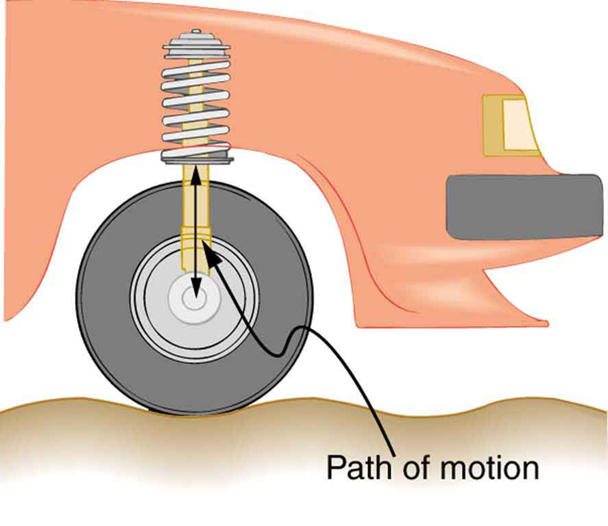

* Calculate the impedance, phase angle, resonant frequency, power, power factor, voltage, and/or current in a RLC series circuit.
* Draw the circuit diagram for an RLC series circuit.
* Explain the significance of the resonant frequency.

### Impedance

When alone in an AC circuit, inductors, capacitors, and resistors all impede current. How do they behave when all three occur together? Interestingly, their individual resistances in ohms do not simply add. Because inductors and capacitors behave in opposite ways, they partially to totally cancel each other’s effect. [\[link\]](#import-auto-id1169736621511) shows an <em>RLC </em>series circuit with an AC voltage source, the behavior of which is the subject of this section. The crux of the analysis of an *RLC* circuit is the frequency dependence of <math xmlns="http://www.w3.org/1998/Math/MathML"><semantics><mrow><mrow><msub><mi>X</mi><mrow><mi>L</mi></mrow></msub></mrow><mrow /></mrow><annotation encoding="StarMath 5.0"> size 12{X rSub { size 8{L} } } {}</annotation></semantics></math>

 and <math xmlns="http://www.w3.org/1998/Math/MathML"><semantics><mrow><mrow><msub><mi>X</mi><mrow><mi>C</mi></mrow></msub></mrow><mrow /></mrow><annotation encoding="StarMath 5.0"> size 12{X rSub { size 8{C} } } {}</annotation></semantics></math>

, and the effect they have on the phase of voltage versus current (established in the preceding section). These give rise to the frequency dependence of the circuit, with important “resonance” features that are the basis of many applications, such as radio tuners.

{: #import-auto-id1169736621511}

The combined effect of resistance <math xmlns="http://www.w3.org/1998/Math/MathML"><semantics><mrow><mrow><mi>R</mi></mrow><mrow /></mrow><annotation encoding="StarMath 5.0"> size 12{R} {}</annotation></semantics></math>

, inductive reactance <math xmlns="http://www.w3.org/1998/Math/MathML"><semantics><mrow><mrow><msub><mi>X</mi><mrow><mi>L</mi></mrow></msub></mrow><mrow /></mrow><annotation encoding="StarMath 5.0"> size 12{X rSub { size 8{L} } } {}</annotation></semantics></math>

, and capacitive reactance <math xmlns="http://www.w3.org/1998/Math/MathML"><semantics><mrow><mrow><msub><mi>X</mi><mrow><mi>C</mi></mrow></msub></mrow><mrow /></mrow><annotation encoding="StarMath 5.0"> size 12{X rSub { size 8{C} } } {}</annotation></semantics></math>

 is defined to be **impedance**{: data-type="term"}, an AC analogue to resistance in a DC circuit. Current, voltage, and impedance in an *RLC* circuit are related by an AC version of Ohm’s law:

<math xmlns="http://www.w3.org/1998/Math/MathML"> <semantics> <mrow> <mrow> <mrow> <mrow> <msub> <mi>I</mi> <mrow> <mn>0</mn> </mrow> </msub> <mo stretchy="false">=</mo> <mfrac> <msub> <mi>V</mi> <mrow> <mn>0</mn> </mrow> </msub> <mi>Z</mi> </mfrac> </mrow><mspace width="0.25em" /> <mtext> or </mtext><mspace width="0.25em" /> <mrow> <msub> <mi>I</mi> <mrow> <mrow> <mtext>rms</mtext> </mrow> </mrow> </msub> <mo stretchy="false">=</mo> <mfrac> <msub> <mi>V</mi> <mrow> <mrow> <mtext>rms</mtext> </mrow> </mrow> </msub> <mi>Z</mi> </mfrac> </mrow> <mtext>.</mtext> </mrow> </mrow> <mrow /> </mrow> <annotation encoding="StarMath 5.0"> size 12{I rSub { size 8{0} } = { {V rSub { size 8{0} } } over {Z} } " or "I rSub { size 8{ ital "rms"} } = { {V rSub { size 8{ ital "rms"} } } over {Z} } "." } {}</annotation> </semantics> </math>

Here <math xmlns="http://www.w3.org/1998/Math/MathML"><semantics><mrow><mrow><msub><mi>I</mi><mrow><mn>0</mn></mrow></msub></mrow><mrow /></mrow><annotation encoding="StarMath 5.0"> size 12{I rSub { size 8{0} } } {}</annotation></semantics></math>

 is the peak current, <math xmlns="http://www.w3.org/1998/Math/MathML"><semantics><mrow><mrow><msub><mi>V</mi><mrow><mn>0</mn></mrow></msub></mrow><mrow /></mrow><annotation encoding="StarMath 5.0"> size 12{V rSub { size 8{0} } } {}</annotation></semantics></math>

 the peak source voltage, and <math xmlns="http://www.w3.org/1998/Math/MathML"> <semantics> <mi>Z</mi> </semantics> </math>

 is the impedance of the circuit. The units of impedance are ohms, and its effect on the circuit is as you might expect: the greater the impedance, the smaller the current. To get an expression for <math xmlns="http://www.w3.org/1998/Math/MathML"><semantics><mrow><mrow><mi>Z</mi></mrow><mrow /></mrow><annotation encoding="StarMath 5.0"> size 12{Z} {}</annotation></semantics></math>

 in terms of <math xmlns="http://www.w3.org/1998/Math/MathML"> <semantics> <mi>R</mi> </semantics> </math>

, <math xmlns="http://www.w3.org/1998/Math/MathML"><semantics><mrow><mrow><msub><mi>X</mi><mrow><mi>L</mi></mrow></msub></mrow><mrow /></mrow><annotation encoding="StarMath 5.0"> size 12{X rSub { size 8{L} } } {}</annotation></semantics></math>

, and <math xmlns="http://www.w3.org/1998/Math/MathML"><semantics><mrow><mrow><msub><mi>X</mi><mrow><mi>C</mi></mrow></msub></mrow><mrow /></mrow><annotation encoding="StarMath 5.0"> size 12{X rSub { size 8{C} } } {}</annotation></semantics></math>

, we will now examine how the voltages across the various components are related to the source voltage. Those voltages are labeled <math xmlns="http://www.w3.org/1998/Math/MathML"><semantics><mrow><mrow><msub><mi>V</mi><mrow><mi>R</mi></mrow></msub></mrow><mrow /></mrow><annotation encoding="StarMath 5.0"> size 12{V rSub { size 8{R} } } {}</annotation></semantics></math>

, <math xmlns="http://www.w3.org/1998/Math/MathML"><semantics><mrow><mrow><msub><mi>V</mi><mrow><mi>L</mi></mrow></msub></mrow><mrow /></mrow><annotation encoding="StarMath 5.0"> size 12{V rSub { size 8{L} } } {}</annotation></semantics></math>

, and <math xmlns="http://www.w3.org/1998/Math/MathML"><semantics><mrow><mrow><msub><mi>V</mi><mrow><mi>C</mi></mrow></msub></mrow><mrow /></mrow><annotation encoding="StarMath 5.0"> size 12{V rSub { size 8{C} } } {}</annotation></semantics></math>

 in [\[link\]](#import-auto-id1169736621511).

Conservation of charge requires current to be the same in each part of the circuit at all times, so that we can say the currents in <math xmlns="http://www.w3.org/1998/Math/MathML"><semantics><mrow><mrow><mi>R</mi></mrow><mrow /></mrow><annotation encoding="StarMath 5.0"> size 12{R} {}</annotation></semantics></math>

, <math xmlns="http://www.w3.org/1998/Math/MathML"><semantics><mrow><mrow><mi>L</mi></mrow><mrow /></mrow><annotation encoding="StarMath 5.0"> size 12{L} {}</annotation></semantics></math>

, and <math xmlns="http://www.w3.org/1998/Math/MathML"><semantics><mrow><mrow><mi>C</mi></mrow><mrow /></mrow><annotation encoding="StarMath 5.0"> size 12{C} {}</annotation></semantics></math>

 are equal and in phase. But we know from the preceding section that the voltage across the inductor <math xmlns="http://www.w3.org/1998/Math/MathML"><semantics><mrow><mrow><msub><mi>V</mi><mrow><mi>L</mi></mrow></msub></mrow><mrow /></mrow><annotation encoding="StarMath 5.0"> size 12{V rSub { size 8{L} } } {}</annotation></semantics></math>

 leads the current by one-fourth of a cycle, the voltage across the capacitor <math xmlns="http://www.w3.org/1998/Math/MathML"><semantics><mrow><mrow><msub><mi>V</mi><mrow><mi>C</mi></mrow></msub></mrow><mrow /></mrow><annotation encoding="StarMath 5.0"> size 12{V rSub { size 8{C} } } {}</annotation></semantics></math>

 follows the current by one-fourth of a cycle, and the voltage across the resistor <math xmlns="http://www.w3.org/1998/Math/MathML"><semantics><mrow><mrow><msub><mi>V</mi><mrow><mi>R</mi></mrow></msub></mrow><mrow /></mrow><annotation encoding="StarMath 5.0"> size 12{V rSub { size 8{R} } } {}</annotation></semantics></math>

 is exactly in phase with the current. [\[link\]](#import-auto-id1169738164070) shows these relationships in one graph, as well as showing the total voltage around the circuit <math xmlns="http://www.w3.org/1998/Math/MathML"><semantics><mrow><mrow><mrow><mi>V</mi><mo stretchy="false">=</mo><mrow><mrow><msub><mi>V</mi><mrow><mi>R</mi></mrow></msub><mo stretchy="false">+</mo><msub><mi>V</mi><mrow><mi>L</mi></mrow></msub></mrow><mo stretchy="false">+</mo><msub><mi>V</mi><mrow><mi>C</mi></mrow></msub></mrow></mrow></mrow><mrow /></mrow><annotation encoding="StarMath 5.0"> size 12{V=V rSub { size 8{R} } +V rSub { size 8{L} } +V rSub { size 8{C} } } {}</annotation></semantics></math>

, where all four voltages are the instantaneous values. According to Kirchhoff’s loop rule, the total voltage around the circuit <math xmlns="http://www.w3.org/1998/Math/MathML"> <semantics> <mi>V</mi> </semantics> </math>

 is also the voltage of the source.

You can see from [\[link\]](#import-auto-id1169738164070) that while <math xmlns="http://www.w3.org/1998/Math/MathML"><semantics><mrow><mrow><msub><mi>V</mi><mrow><mi>R</mi></mrow></msub></mrow><mrow /></mrow><annotation encoding="StarMath 5.0"> size 12{V rSub { size 8{R} } } {}</annotation></semantics></math>

 is in phase with the current, <math xmlns="http://www.w3.org/1998/Math/MathML"><semantics><mrow><mrow><msub><mi>V</mi><mrow><mi>L</mi></mrow></msub></mrow><mrow /></mrow><annotation encoding="StarMath 5.0"> size 12{V rSub { size 8{L} } } {}</annotation></semantics></math>

 leads by <math xmlns="http://www.w3.org/1998/Math/MathML"> <semantics> <mtext>90º</mtext> </semantics> </math>

, and <math xmlns="http://www.w3.org/1998/Math/MathML"><semantics><mrow><mrow><msub><mi>V</mi><mrow><mi>C</mi></mrow></msub></mrow><mrow /></mrow><annotation encoding="StarMath 5.0"> size 12{V rSub { size 8{C} } } {}</annotation></semantics></math>

 follows by <math xmlns="http://www.w3.org/1998/Math/MathML"> <semantics> <mtext>90º</mtext> </semantics> </math>

. Thus <math xmlns="http://www.w3.org/1998/Math/MathML"><semantics><mrow><mrow><msub><mi>V</mi><mrow><mi>L</mi></mrow></msub></mrow><mrow /></mrow><annotation encoding="StarMath 5.0"> size 12{V rSub { size 8{L} } } {}</annotation></semantics></math>

 and <math xmlns="http://www.w3.org/1998/Math/MathML"><semantics><mrow><mrow><msub><mi>V</mi><mrow><mi>C</mi></mrow></msub></mrow><mrow /></mrow><annotation encoding="StarMath 5.0"> size 12{V rSub { size 8{C} } } {}</annotation></semantics></math>

 are <math xmlns="http://www.w3.org/1998/Math/MathML"> <semantics> <mtext>180º</mtext> </semantics> </math>

 out of phase (crest to trough) and tend to cancel, although not completely unless they have the same magnitude. Since the peak voltages are not aligned (not in phase), the peak voltage <math xmlns="http://www.w3.org/1998/Math/MathML"><semantics><mrow><mrow><msub><mi>V</mi><mrow><mn>0</mn></mrow></msub></mrow><mrow /></mrow><annotation encoding="StarMath 5.0"> size 12{V rSub { size 8{0} } } {}</annotation></semantics></math>

 of the source does *not* equal the sum of the peak voltages across <math xmlns="http://www.w3.org/1998/Math/MathML"><semantics><mrow><mrow><mi>R</mi></mrow><mrow /></mrow><annotation encoding="StarMath 5.0"> size 12{R} {}</annotation></semantics></math>

, <math xmlns="http://www.w3.org/1998/Math/MathML"><semantics><mrow><mrow><mi>L</mi></mrow><mrow /></mrow><annotation encoding="StarMath 5.0"> size 12{L} {}</annotation></semantics></math>

, and <math xmlns="http://www.w3.org/1998/Math/MathML"><semantics><mrow><mrow><mi>C</mi></mrow><mrow /></mrow><annotation encoding="StarMath 5.0"> size 12{C} {}</annotation></semantics></math>

. The actual relationship is

<math xmlns="http://www.w3.org/1998/Math/MathML"> <semantics> <mrow> <mrow> <mrow> <mrow> <msub> <mi>V</mi> <mrow> <mn>0</mn> </mrow> </msub> <mo stretchy="false">=</mo> <msqrt> <mrow> <msubsup> <mi>V</mi> <mrow> <mn>0</mn><mi>R</mi> </mrow> <mrow> <mspace width="1.25em" /> <mn>2</mn> </mrow> </msubsup> <mrow> <mo stretchy="false">+</mo> <mo stretchy="false">(</mo> </mrow> <mrow> <msub> <mi>V</mi> <mrow> <mn>0</mn><mi>L</mi> </mrow> </msub> <mo stretchy="false">−</mo> <msub> <mi>V</mi> <mrow> <mn>0</mn><mi>C</mi> </mrow> </msub> </mrow> <msup> <mo stretchy="false">)</mo> <mrow> <mn>2</mn> </mrow> </msup> </mrow> </msqrt> </mrow> <mi>,</mi> </mrow> </mrow> <mrow /> </mrow> <annotation encoding="StarMath 5.0"> size 12{V rSub { size 8{0} } = sqrt {V rSub { size 8{0R} } "" lSup { size 8{2} } + \( V rSub { size 8{0L} } - V rSub { size 8{0C} } \) rSup { size 8{2} } } ,} {}</annotation> </semantics> </math>

where <math xmlns="http://www.w3.org/1998/Math/MathML"><semantics><mrow><mrow><msub><mi>V</mi><mrow><mn>0</mn><mi>R</mi></mrow></msub></mrow><mrow /></mrow><annotation encoding="StarMath 5.0"> size 12{V rSub { size 8{0R} } } {}</annotation></semantics></math>

, <math xmlns="http://www.w3.org/1998/Math/MathML"><semantics><mrow><mrow><msub><mi>V</mi><mrow><mn>0</mn><mi>L</mi></mrow></msub></mrow><mrow /></mrow><annotation encoding="StarMath 5.0"> size 12{V rSub { size 8{0L} } } {}</annotation></semantics></math>

, and <math xmlns="http://www.w3.org/1998/Math/MathML"><semantics><mrow><mrow><msub><mi>V</mi><mrow><mn>0</mn><mi>C</mi></mrow></msub></mrow><mrow /></mrow><annotation encoding="StarMath 5.0"> size 12{V rSub { size 8{0C} } } {}</annotation></semantics></math>

 are the peak voltages across <math xmlns="http://www.w3.org/1998/Math/MathML"><semantics><mrow><mrow><mi>R</mi></mrow><mrow /></mrow><annotation encoding="StarMath 5.0"> size 12{R} {}</annotation></semantics></math>

, <math xmlns="http://www.w3.org/1998/Math/MathML"><semantics><mrow><mrow><mi>L</mi></mrow><mrow /></mrow><annotation encoding="StarMath 5.0"> size 12{L} {}</annotation></semantics></math>

, and <math xmlns="http://www.w3.org/1998/Math/MathML"><semantics><mrow><mrow><mi>C</mi></mrow><mrow /></mrow><annotation encoding="StarMath 5.0"> size 12{C} {}</annotation></semantics></math>

, respectively. Now, using Ohm’s law and definitions from [Reactance, Inductive and Capacitive](/m42427), we substitute <math xmlns="http://www.w3.org/1998/Math/MathML"><semantics><mrow><mrow><mrow><mrow><msub><mi>V</mi><mrow><mn>0</mn></mrow></msub><mo stretchy="false">=</mo><msub><mi>I</mi><mrow><mn>0</mn></mrow></msub></mrow><mi>Z</mi></mrow></mrow><mrow /></mrow><annotation encoding="StarMath 5.0"> size 12{V rSub { size 8{0} } =I rSub { size 8{0} } Z} {}</annotation></semantics></math>

 into the above, as well as <math xmlns="http://www.w3.org/1998/Math/MathML"><semantics><mrow><mrow><mrow><mrow><msub><mi>V</mi><mrow><mn>0</mn><mi>R</mi></mrow></msub><mo stretchy="false">=</mo><msub><mi>I</mi><mrow><mn>0</mn></mrow></msub></mrow><mi>R</mi></mrow></mrow><mrow /></mrow><annotation encoding="StarMath 5.0"> size 12{V rSub { size 8{0R} } =I rSub { size 8{0} } R} {}</annotation></semantics></math>

, <math xmlns="http://www.w3.org/1998/Math/MathML"><semantics><mrow><mrow><mrow><mrow><msub><mi>V</mi><mrow><mn>0</mn><mi>L</mi></mrow></msub><mo stretchy="false">=</mo><msub><mi>I</mi><mrow><mn>0</mn></mrow></msub></mrow><msub><mi>X</mi><mrow><mi>L</mi></mrow></msub></mrow></mrow><mrow /></mrow><annotation encoding="StarMath 5.0"> size 12{V rSub { size 8{0L} } =I rSub { size 8{0} } X rSub { size 8{L} } } {}</annotation></semantics></math>

, and <math xmlns="http://www.w3.org/1998/Math/MathML"><semantics><mrow><mrow><mrow><mrow><msub><mi>V</mi><mrow><mn>0</mn><mi>C</mi></mrow></msub><mo stretchy="false">=</mo><msub><mi>I</mi><mrow><mn>0</mn></mrow></msub></mrow><msub><mi>X</mi><mrow><mi>C</mi></mrow></msub></mrow></mrow><mrow /></mrow><annotation encoding="StarMath 5.0"> size 12{V rSub { size 8{0C} } =I rSub { size 8{0} } X rSub { size 8{C} } } {}</annotation></semantics></math>

, yielding

<math xmlns="http://www.w3.org/1998/Math/MathML"><semantics><mrow><mrow><mrow><mrow><msub><mi>I</mi><mrow><mn>0</mn></mrow></msub><mrow><mrow><mi>Z</mi><mo stretchy="false">=</mo><msqrt> <mrow> <msubsup> <mi>I</mi> <mrow> <mn>0</mn> </mrow> <mrow> <mspace width="0.50em" /> <mn>2</mn> </mrow> </msubsup> <mrow> <mrow><msup><mi>R</mi><mrow><mn>2</mn></mrow></msup></mrow> <mo stretchy="false">+</mo> <mo stretchy="false">(</mo> </mrow> <msub><mi>I</mi><mrow><mn>0</mn></mrow></msub><mrow><msub><mi>X</mi><mrow><mi>L</mi></mrow></msub><mo stretchy="false">−</mo><msub><mi>I</mi><mrow><mn>0</mn></mrow></msub></mrow><msub><mi>X</mi><mrow><mi>C</mi></mrow></msub><msup><mo stretchy="false">)</mo><mrow><mn>2</mn></mrow></msup></mrow></msqrt></mrow><mo stretchy="false">=</mo><msub><mi>I</mi><mrow><mn>0</mn></mrow></msub></mrow><msqrt><mrow><mrow><msup><mi>R</mi><mrow><mn>2</mn></mrow></msup><mo stretchy="false">+</mo><mo stretchy="false">(</mo></mrow><mrow><msub><mi>X</mi><mrow><mi>L</mi></mrow></msub><mo stretchy="false">−</mo><msub><mi>X</mi><mrow><mi>C</mi></mrow></msub></mrow><msup><mo stretchy="false">)</mo><mrow><mn>2</mn></mrow></msup></mrow></msqrt></mrow></mrow><mrow><mtext>.</mtext></mrow></mrow><mrow /></mrow><annotation encoding="StarMath 5.0"> size 12{I rSub { size 8{0} } Z= sqrt {I rSub { size 8{0} rSup { size 8{2} } } R rSup { size 8{2} } + \( I rSub { size 8{0} } X rSub { size 8{L} } - I rSub { size 8{0} } X rSub { size 8{C} } \) rSup { size 8{2} } } =I rSub { size 8{0} } sqrt {R rSup { size 8{2} } + \( X rSub { size 8{L} } - X rSub { size 8{C} } \) rSup { size 8{2} } } } {}</annotation></semantics></math>

<math xmlns="http://www.w3.org/1998/Math/MathML"><semantics><mrow><mrow><msub><mi>I</mi><mrow><mn>0</mn></mrow></msub></mrow><mrow /></mrow><annotation encoding="StarMath 5.0"> size 12{I rSub { size 8{0} } } {}</annotation></semantics></math>

 cancels to yield an expression for <math xmlns="http://www.w3.org/1998/Math/MathML"> <semantics> <mi>Z</mi> </semantics> </math>

\:

<math xmlns="http://www.w3.org/1998/Math/MathML"><semantics><mrow><mrow><mrow><mrow><mi>Z</mi><mo stretchy="false">=</mo><msqrt><mrow><mrow><msup><mi>R</mi><mrow><mn>2</mn></mrow></msup><mo stretchy="false">+</mo><mo stretchy="false">(</mo></mrow><mrow><msub><mi>X</mi><mrow><mi>L</mi></mrow></msub><mo stretchy="false">−</mo><msub><mi>X</mi><mrow><mi>C</mi></mrow></msub></mrow><msup><mo stretchy="false">)</mo><mrow><mn>2</mn></mrow></msup></mrow></msqrt></mrow></mrow><mrow><mtext>,</mtext></mrow></mrow><mrow /></mrow><annotation encoding="StarMath 5.0"> size 12{Z= sqrt {R rSup { size 8{2} } + \( X rSub { size 8{L} } - X rSub { size 8{C} } \) rSup { size 8{2} } } } {}</annotation></semantics></math>

which is the impedance of an *RLC* series AC circuit. For circuits without a resistor, take <math xmlns="http://www.w3.org/1998/Math/MathML"> <semantics> <mrow> <mi>R</mi> <mo>=</mo> <mtext>0</mtext> </mrow> </semantics> </math>

; for those without an inductor, take <math xmlns="http://www.w3.org/1998/Math/MathML"><semantics><mrow><mrow><mrow><msub><mi>X</mi><mrow><mi>L</mi></mrow></msub><mo stretchy="false">=</mo><mn>0</mn></mrow></mrow><mrow /></mrow><annotation encoding="StarMath 5.0"> size 12{X rSub { size 8{L} } =0} {}</annotation></semantics></math>

; and for those without a capacitor, take <math xmlns="http://www.w3.org/1998/Math/MathML"><semantics><mrow><mrow><mrow><msub><mi>X</mi><mrow><mi>C</mi></mrow></msub><mo stretchy="false">=</mo><mn>0</mn></mrow></mrow><mrow /></mrow><annotation encoding="StarMath 5.0"> size 12{X rSub { size 8{C} } =0} {}</annotation></semantics></math>

.

![The figure shows graphs showing the relationships of the voltages in an RLC circuit to the current. It has five graphs on the left and two graphs on the right. The first graph on the right is for current I versus time t. Current is plotted along Y axis and time is along X axis. The curve is a smooth progressive sine wave. The second graph is on the right is for voltage V R versus time t. Voltage V R is plotted along Y axis and time is along X axis. The curve is a smooth progressive sine wave. The third graph is on the right is for voltage V L versus time t. Voltage V L is plotted along Y axis and time is along X axis. The curve is a smooth progressive cosine wave. The fourth graph is on the right is for voltage V C versus time t. Voltage V C is plotted along Y axis and time t is along X axis. The curve is a smooth progressive cosine wave starting from negative Y axis. The fifth graph shows the voltage V verses time t for the R L C circuit. Voltage V is plotted along Y axis and time t is along X axis. The curve is a smooth progressive sine wave starting from a point near to origin on negative X axis. The first and the fifth graphs are again shown on the right and their amplitudes and phases compared. The current graph is shown to have a lesser amplitude.](../resources/Figure_24_12_02a.jpg "This graph shows the relationships of the voltages in an RLC circuit to the current. The voltages across the circuit elements add to equal the voltage of the source, which is seen to be out of phase with the current."){: #import-auto-id1169738164070}

Calculating Impedance and Current

An <em>RLC </em>series circuit has a <math xmlns="http://www.w3.org/1998/Math/MathML"> <semantics> <mtext>40.0 Ω</mtext> </semantics> </math>

 resistor, a 3.00 mH inductor, and a <math xmlns="http://www.w3.org/1998/Math/MathML"> <semantics> <mtext>5.00 μF</mtext> </semantics> </math>

 capacitor. (a) Find the circuit’s impedance at 60.0 Hz and 10.0 kHz, noting that these frequencies and the values for <math xmlns="http://www.w3.org/1998/Math/MathML"> <semantics> <mi>L</mi> </semantics> </math>

 and <math xmlns="http://www.w3.org/1998/Math/MathML"> <semantics> <mi>C</mi> </semantics> </math>

 are the same as in [\[link\]](/m42427#fs-id1169736972664) and [\[link\]](/m42427#fs-id1169736597928). (b) If the voltage source has <math xmlns="http://www.w3.org/1998/Math/MathML"><semantics><mrow><mrow><mrow><mrow><msub><mi>V</mi><mrow><mtext>rms</mtext></mrow></msub><mo stretchy="false">=</mo><mtext>120</mtext><mspace width="0.25em" /></mrow><mi /><mtext>V</mtext></mrow></mrow><mrow /></mrow><annotation encoding="StarMath 5.0"> size 12{V rSub { size 8{"rms"} } ="120"`V} {}</annotation></semantics></math>

, what is <math xmlns="http://www.w3.org/1998/Math/MathML"><semantics><mrow><mrow><msub><mi>I</mi><mrow><mtext>rms</mtext></mrow></msub></mrow><mrow /></mrow><annotation encoding="StarMath 5.0"> size 12{I rSub { size 8{"rms"} } } {}</annotation></semantics></math>

 at each frequency?

**Strategy**

For each frequency, we use <math xmlns="http://www.w3.org/1998/Math/MathML"><semantics><mrow><mrow><mrow><mi>Z</mi><mo stretchy="false">=</mo><msqrt><mrow><mrow><msup><mi>R</mi><mrow><mn>2</mn></mrow></msup><mo stretchy="false">+</mo><mo stretchy="false">(</mo></mrow><mrow><msub><mi>X</mi><mrow><mi>L</mi></mrow></msub><mo stretchy="false">−</mo><msub><mi>X</mi><mrow><mi>C</mi></mrow></msub></mrow><msup><mo stretchy="false">)</mo><mrow><mn>2</mn></mrow></msup></mrow></msqrt></mrow></mrow><mrow /></mrow><annotation encoding="StarMath 5.0"> size 12{Z= sqrt {R rSup { size 8{2} } + \( X rSub { size 8{L} } - X rSub { size 8{C} } \) rSup { size 8{2} } } } {}</annotation></semantics></math>

 to find the impedance and then Ohm’s law to find current. We can take advantage of the results of the previous two examples rather than calculate the reactances again.

**Solution for (a)**

At 60.0 Hz, the values of the reactances were found in [\[link\]](/m42427#fs-id1169736972664) to be <math xmlns="http://www.w3.org/1998/Math/MathML"><semantics><mrow><mrow><mrow><mrow><msub><mi>X</mi><mrow><mi>L</mi></mrow></msub><mo stretchy="false">=</mo><mn>1</mn></mrow><mtext>.</mtext><mtext>13</mtext><mspace width="0.25em" /><mo stretchy="false">Ω</mo></mrow></mrow><mrow /></mrow><annotation encoding="StarMath 5.0"> size 12{X rSub { size 8{L} } =1 "." "13" %OMEGA } {}</annotation></semantics></math>

 and in [\[link\]](/m42427#fs-id1169736597928) to be <math xmlns="http://www.w3.org/1998/Math/MathML"><semantics><mrow><mrow><mrow><mrow><msub><mi>X</mi><mrow><mi>C</mi></mrow></msub><mo stretchy="false">=</mo><mtext>531 </mtext></mrow><mspace width="0.25em" /><mo stretchy="false">Ω</mo></mrow></mrow> <mrow /></mrow><annotation encoding="StarMath 5.0"> size 12{X rSub { size 8{C} } ="531 " %OMEGA } {}</annotation></semantics></math>

. Entering these and the given <math xmlns="http://www.w3.org/1998/Math/MathML"> <semantics> <mtext>40.0 Ω</mtext> </semantics> </math>

 for resistance into <math xmlns="http://www.w3.org/1998/Math/MathML"><semantics><mrow><mrow><mrow><mi>Z</mi><mo stretchy="false">=</mo><msqrt><mrow><mrow><msup><mi>R</mi><mrow><mn>2</mn></mrow></msup><mo stretchy="false">+</mo><mo stretchy="false">(</mo></mrow><mrow><msub><mi>X</mi><mrow><mi>L</mi></mrow></msub><mo stretchy="false">−</mo><msub><mi>X</mi><mrow><mi>C</mi></mrow></msub></mrow><msup><mo stretchy="false">)</mo><mrow><mn>2</mn></mrow></msup></mrow></msqrt></mrow></mrow><mrow /></mrow><annotation encoding="StarMath 5.0"> size 12{Z= sqrt {R rSup { size 8{2} } + \( X rSub { size 8{L} } - X rSub { size 8{C} } \) rSup { size 8{2} } } } {}</annotation></semantics></math>

 yields

<math xmlns="http://www.w3.org/1998/Math/MathML"><semantics><mrow><mrow><mtable columnalign="left"><mtr><mtd><mi>Z</mi></mtd> <mtd><mo stretchy="false">=</mo></mtd> <mtd><mrow><mrow><mrow><msqrt><mrow><mrow><msup><mi>R</mi><mrow><mn>2</mn></mrow></msup><mo stretchy="false">+</mo><mo stretchy="false">(</mo></mrow><mrow><msub><mi>X</mi><mrow><mi>L</mi></mrow></msub><mo stretchy="false">−</mo><msub><mi>X</mi><mrow><mi>C</mi></mrow></msub></mrow><msup><mo stretchy="false">)</mo><mrow><mn>2</mn></mrow></msup></mrow></msqrt></mrow></mrow><mrow /></mrow></mtd></mtr> <mtr><mtd /> <mtd><mo stretchy="false">=</mo></mtd> <mtd><mrow><mrow><msqrt><mrow><mo stretchy="false">(</mo><mtext>40</mtext><mtext>.</mtext><mn>0</mn><mspace width="0.25em" /><mo stretchy="false">Ω</mo><mrow><msup><mo stretchy="false">)</mo><mrow><mn>2</mn></mrow></msup><mo stretchy="false">+</mo><mo stretchy="false">(</mo></mrow><mn>1</mn><mtext>.</mtext><mtext>13</mtext><mspace width="0.25em" /><mrow><mo stretchy="false">Ω</mo><mo stretchy="false">−</mo><mtext>531</mtext><mspace width="0.25em" /></mrow><mo stretchy="false">Ω</mo><msup><mo stretchy="false">)</mo><mrow><mn>2</mn></mrow></msup></mrow></msqrt></mrow><mrow /></mrow></mtd></mtr> <mtr><mtd /> <mtd><mo stretchy="false">=</mo></mtd> <mtd><mrow><mrow><mtext>531</mtext><mspace width="0.25em" /></mrow><mo stretchy="false">Ω</mo><mtext> at 60</mtext><mtext>.</mtext><mtext>0 Hz</mtext><mtext>.</mtext><mrow /></mrow></mtd></mtr></mtable><mrow /><mrow /></mrow></mrow><annotation encoding="StarMath 5.0">alignl { stack { size 12{Z= sqrt {R rSup { size 8{2} } + \( X rSub { size 8{L} } - X rSub { size 8{C} } \) rSup { size 8{2} } } } {} # " "= sqrt { \( "40" "." 0` %OMEGA \) rSup { size 8{2} } + \( 1 "." "13" %OMEGA - "531" %OMEGA \) rSup { size 8{2} } } {} # " "="531" %OMEGA " at 60" "." "0 Hz" {} } } {}</annotation></semantics></math>

Similarly, at 10.0 kHz, <math xmlns="http://www.w3.org/1998/Math/MathML"><semantics><mrow><mrow><mrow><mrow><msub><mi>X</mi><mrow><mi>L</mi></mrow></msub><mo stretchy="false">=</mo><mtext>188</mtext></mrow><mspace width="0.25em" /><mo stretchy="false">Ω</mo></mrow></mrow><mrow /></mrow><annotation encoding="StarMath 5.0"> size 12{X rSub { size 8{L} } ="188" %OMEGA } {}</annotation></semantics></math>

 and <math xmlns="http://www.w3.org/1998/Math/MathML"><semantics><mrow><mrow><mrow><mrow><msub><mi>X</mi><mrow><mi>C</mi></mrow></msub><mo stretchy="false">=</mo><mn>3</mn></mrow><mtext>.</mtext><mtext>18</mtext><mspace width="0.25em" /><mo stretchy="false">Ω</mo></mrow></mrow><mrow /></mrow><annotation encoding="StarMath 5.0"> size 12{X rSub { size 8{C} } =3 "." "18" %OMEGA } {}</annotation></semantics></math>

, so that

<math xmlns="http://www.w3.org/1998/Math/MathML"><semantics><mrow><mrow><mtable columnalign="left"><mtr> <mtd><mi>Z</mi></mtd> <mtd><mo stretchy="false">=</mo></mtd> <mtd><mrow><mrow><mrow><msqrt><mrow><mo stretchy="false">(</mo><mtext>40</mtext><mtext>.</mtext><mn>0</mn><mspace width="0.25em" /><mo stretchy="false">Ω</mo><mrow><msup><mo stretchy="false">)</mo><mrow><mn>2</mn></mrow></msup><mo stretchy="false">+</mo><mo stretchy="false">(</mo></mrow><mtext>188</mtext><mspace width="0.25em" /><mrow><mo stretchy="false">Ω</mo><mo stretchy="false">−</mo><mn>3</mn></mrow><mtext>.</mtext><mtext>18</mtext><mspace width="0.25em" /><mo stretchy="false">Ω</mo><msup><mo stretchy="false">)</mo><mrow><mn>2</mn></mrow></msup></mrow></msqrt></mrow></mrow><mrow /></mrow></mtd></mtr><mtr> <mtd /> <mtd><mo stretchy="false">=</mo></mtd> <mtd> <mrow><mrow><mtext>190</mtext></mrow><mspace width="0.25em" /><mo stretchy="false">Ω</mo><mtext> at 10</mtext><mtext>.</mtext><mtext>0 kHz.</mtext></mrow></mtd></mtr></mtable><mrow /><mrow /></mrow></mrow><annotation encoding="StarMath 5.0">alignl { stack { size 12{Z= sqrt { \( "40" "." 0` %OMEGA \) rSup { size 8{2} } + \( "188" %OMEGA - 3 "." "18" %OMEGA \) rSup { size 8{2} } } } {} # " "="190" %OMEGA " at 10" "." "0 kHz" {} } } {}</annotation></semantics></math>

**Discussion for (a)**

In both cases, the result is nearly the same as the largest value, and the impedance is definitely not the sum of the individual values. It is clear that <math xmlns="http://www.w3.org/1998/Math/MathML"><semantics><mrow><mrow><msub><mi>X</mi><mrow><mi>L</mi></mrow></msub></mrow><mrow /></mrow><annotation encoding="StarMath 5.0"> size 12{X rSub { size 8{L} } } {}</annotation></semantics></math>

 dominates at high frequency and <math xmlns="http://www.w3.org/1998/Math/MathML"><semantics><mrow><mrow><msub><mi>X</mi><mrow><mi>C</mi></mrow></msub></mrow><mrow /></mrow><annotation encoding="StarMath 5.0"> size 12{X rSub { size 8{C} } } {}</annotation></semantics></math>

 dominates at low frequency.

**Solution for (b)**

The current <math xmlns="http://www.w3.org/1998/Math/MathML"><semantics><mrow><mrow><msub><mi>I</mi><mrow><mtext>rms</mtext></mrow></msub></mrow><mrow /></mrow><annotation encoding="StarMath 5.0"> size 12{I rSub { size 8{"rms"} } } {}</annotation></semantics></math>

 can be found using the AC version of Ohm’s law in Equation <math xmlns="http://www.w3.org/1998/Math/MathML"><semantics><mrow><mrow><mrow><msub><mi>I</mi><mrow><mtext>rms</mtext></mrow></msub><mo stretchy="false">=</mo><mrow><msub><mi>V</mi><mrow><mtext>rms</mtext></mrow></msub><mo stretchy="false">/</mo><mi>Z</mi></mrow></mrow></mrow><mrow /></mrow><annotation encoding="StarMath 5.0"> size 12{I rSub { size 8{"rms"} } =V rSub { size 8{"rms"} } /Z} {}</annotation></semantics></math>

\:

<math xmlns="http://www.w3.org/1998/Math/MathML"><semantics><mrow><mrow><mrow><mrow><mrow><mrow><msub><mi>I</mi><mrow><mtext>rms</mtext></mrow></msub><mo stretchy="false">=</mo><mfrac><msub><mi>V</mi><mrow><mtext>rms</mtext></mrow></msub><mi>Z</mi></mfrac></mrow><mo stretchy="false">=</mo><mfrac><mrow><mtext>120</mtext><mspace width="0.25em" /><mtext> V</mtext></mrow><mrow><mtext>531 </mtext><mspace width="0.25em" /><mo stretchy="false">Ω</mo></mrow></mfrac></mrow><mo stretchy="false">=</mo><mn>0</mn></mrow><mtext>.</mtext><mtext>226</mtext><mspace width="0.25em" /><mtext> A</mtext></mrow></mrow><mrow /></mrow><annotation encoding="StarMath 5.0"> size 12{I rSub { size 8{"rms"} } = { {V rSub { size 8{"rms"} } } over {Z} } = { {"120"" V"} over {"531 " %OMEGA } } =0 "." "226"" A"} {}</annotation></semantics></math>

 at 60.0 Hz

Finally, at 10.0 kHz, we find

<math xmlns="http://www.w3.org/1998/Math/MathML"><semantics><mrow><mrow><mrow><mrow><mrow><mrow><msub><mi>I</mi><mrow><mtext>rms</mtext></mrow></msub><mo stretchy="false">=</mo><mfrac><msub><mi>V</mi><mrow><mtext>rms</mtext></mrow></msub><mi>Z</mi></mfrac></mrow><mo stretchy="false">=</mo><mfrac><mrow><mtext>120</mtext><mspace width="0.25em" /><mtext> V</mtext></mrow><mrow><mtext>190 </mtext><mspace width="0.25em" /><mo stretchy="false">Ω</mo></mrow></mfrac></mrow><mo stretchy="false">=</mo><mn>0</mn></mrow><mtext>.</mtext><mtext>633</mtext><mspace width="0.25em" /><mtext> A</mtext></mrow></mrow><mrow /></mrow><annotation encoding="StarMath 5.0"> size 12{I rSub { size 8{"rms"} } = { {V rSub { size 8{"rms"} } } over {Z} } = { {"120"" V"} over {"190 " %OMEGA } } =0 "." "633"" A"} {}</annotation></semantics></math>

 at 10.0 kHz

**Discussion for (a)**

The current at 60.0 Hz is the same (to three digits) as found for the capacitor alone in [\[link\]](/m42427#fs-id1169736597928). The capacitor dominates at low frequency. The current at 10.0 kHz is only slightly different from that found for the inductor alone in [\[link\]](/m42427#fs-id1169736972664). The inductor dominates at high frequency.

### Resonance in *RLC* Series AC Circuits

How does an *RLC* circuit behave as a function of the frequency of the driving voltage source? Combining Ohm’s law, <math xmlns="http://www.w3.org/1998/Math/MathML"><semantics><mrow><mrow><mrow><msub><mi>I</mi><mrow><mtext>rms</mtext></mrow></msub><mo stretchy="false">=</mo><mrow><msub><mi>V</mi><mrow><mtext>rms</mtext></mrow></msub><mo stretchy="false">/</mo><mi>Z</mi></mrow></mrow></mrow><mrow /></mrow><annotation encoding="StarMath 5.0"> size 12{I rSub { size 8{"rms"} } =V rSub { size 8{"rms"} } /Z} {}</annotation></semantics></math>

, and the expression for impedance <math xmlns="http://www.w3.org/1998/Math/MathML"> <semantics> <mi>Z</mi> </semantics> </math>

 from <math xmlns="http://www.w3.org/1998/Math/MathML"><semantics><mrow><mrow><mrow><mi>Z</mi><mo stretchy="false">=</mo><msqrt><mrow><mrow><msup><mi>R</mi><mrow><mn>2</mn></mrow></msup><mo stretchy="false">+</mo><mo stretchy="false">(</mo></mrow><mrow><msub><mi>X</mi><mrow><mi>L</mi></mrow></msub><mo stretchy="false">−</mo><msub><mi>X</mi><mrow><mi>C</mi></mrow></msub></mrow><msup><mo stretchy="false">)</mo><mrow><mn>2</mn></mrow></msup></mrow></msqrt></mrow></mrow><mrow /></mrow><annotation encoding="StarMath 5.0"> size 12{Z= sqrt {R rSup { size 8{2} } + \( X rSub { size 8{L} } - X rSub { size 8{C} } \) rSup { size 8{2} } } } {}</annotation></semantics></math>

 gives

<math xmlns="http://www.w3.org/1998/Math/MathML"><semantics><mrow><mrow><mrow><mrow><msub><mi>I</mi><mrow><mtext>rms</mtext></mrow></msub><mo stretchy="false">=</mo><mfrac><msub><mi>V</mi><mrow><mtext>rms</mtext></mrow></msub><msqrt><mrow><mrow><msup><mi>R</mi><mrow><mn>2</mn></mrow></msup><mo stretchy="false">+</mo><mo stretchy="false">(</mo></mrow><mrow><msub><mi>X</mi><mrow><mi>L</mi></mrow></msub><mo stretchy="false">−</mo><msub><mi>X</mi><mrow><mi>C</mi></mrow></msub></mrow><msup><mo stretchy="false">)</mo><mrow><mn>2</mn></mrow></msup></mrow></msqrt></mfrac></mrow></mrow><mrow><mtext>.</mtext></mrow></mrow><mrow /></mrow><annotation encoding="StarMath 5.0"> size 12{I rSub { size 8{"rms"} } = { {V rSub { size 8{"rms"} } } over { sqrt {R rSup { size 8{2} } + \( X rSub { size 8{L} } - X rSub { size 8{C} } \) rSup { size 8{2} } } } } } {}</annotation></semantics></math>

The reactances vary with frequency, with <math xmlns="http://www.w3.org/1998/Math/MathML"><semantics><mrow><mrow><msub><mi>X</mi><mrow><mi>L</mi></mrow></msub></mrow><mrow /></mrow><annotation encoding="StarMath 5.0"> size 12{X rSub { size 8{L} } } {}</annotation></semantics></math>

 large at high frequencies and <math xmlns="http://www.w3.org/1998/Math/MathML"><semantics><mrow><mrow><msub><mi>X</mi><mrow><mi>C</mi></mrow></msub></mrow><mrow /></mrow><annotation encoding="StarMath 5.0"> size 12{X rSub { size 8{C} } } {}</annotation></semantics></math>

 large at low frequencies, as we have seen in three previous examples. At some intermediate frequency <math xmlns="http://www.w3.org/1998/Math/MathML"><semantics><mrow><mrow><msub><mi>f</mi><mrow><mn>0</mn></mrow></msub></mrow><mrow /></mrow><annotation encoding="StarMath 5.0"> size 12{f rSub { size 8{0} } } {}</annotation></semantics></math>

, the reactances will be equal and cancel, giving *<math xmlns="http://www.w3.org/1998/Math/MathML"><semantics><mrow><mrow><mrow><mi>Z</mi><mo stretchy="false">=</mo><mi>R</mi></mrow></mrow><mrow /></mrow><annotation encoding="StarMath 5.0"> size 12{Z=R} {}</annotation></semantics></math>

* —this is a minimum value for impedance, and a maximum value for <math xmlns="http://www.w3.org/1998/Math/MathML"><semantics><mrow><mrow><msub><mi>I</mi><mrow><mtext>rms</mtext></mrow></msub></mrow><mrow /></mrow><annotation encoding="StarMath 5.0"> size 12{I rSub { size 8{"rms"} } } {}</annotation></semantics></math>

 results. We can get an expression for <math xmlns="http://www.w3.org/1998/Math/MathML"><semantics><mrow><mrow><msub><mi>f</mi><mrow><mn>0</mn></mrow></msub></mrow><mrow /></mrow><annotation encoding="StarMath 5.0"> size 12{f rSub { size 8{0} } } {}</annotation></semantics></math>

 by taking

<math xmlns="http://www.w3.org/1998/Math/MathML"><semantics><mrow><mrow><mrow><mrow><msub><mi>X</mi><mrow><mi>L</mi></mrow></msub><mo stretchy="false">=</mo><msub><mi>X</mi><mrow><mi>C</mi></mrow></msub></mrow></mrow><mrow><mtext>.</mtext></mrow></mrow><mrow /></mrow><annotation encoding="StarMath 5.0"> size 12{X rSub { size 8{L} } =X rSub { size 8{C} } } {}</annotation></semantics></math>

Substituting the definitions of <math xmlns="http://www.w3.org/1998/Math/MathML"><semantics><mrow><mrow><msub><mi>X</mi><mrow><mi>L</mi></mrow></msub></mrow><mrow /></mrow><annotation encoding="StarMath 5.0"> size 12{X rSub { size 8{L} } } {}</annotation></semantics></math>

 and <math xmlns="http://www.w3.org/1998/Math/MathML"><semantics><mrow><mrow><msub><mi>X</mi><mrow><mi>C</mi></mrow></msub></mrow><mrow /></mrow><annotation encoding="StarMath 5.0"> size 12{X rSub { size 8{C} } } {}</annotation></semantics></math>

,

<math xmlns="http://www.w3.org/1998/Math/MathML"><semantics><mrow><mrow><mrow><mrow><mn>2</mn><msub><mi fontstyle="italic">πf</mi><mrow><mn>0</mn></mrow></msub><mrow><mi>L</mi><mo stretchy="false">=</mo><mfrac><mn>1</mn><mrow><mn>2</mn><msub><mi fontstyle="italic">πf</mi><mrow><mn>0</mn></mrow></msub><mi>C</mi></mrow></mfrac></mrow></mrow></mrow><mrow><mtext>.</mtext></mrow></mrow><mrow /></mrow><annotation encoding="StarMath 5.0"> size 12{2πf rSub { size 8{0} } L= { {1} over {2πf rSub { size 8{0} } C} } } {}</annotation></semantics></math>

Solving this expression for <math xmlns="http://www.w3.org/1998/Math/MathML"><semantics><mrow><mrow><msub><mi>f</mi><mrow><mn>0</mn></mrow></msub></mrow><mrow /></mrow><annotation encoding="StarMath 5.0"> size 12{f rSub { size 8{0} } } {}</annotation></semantics></math>

 yields

<math xmlns="http://www.w3.org/1998/Math/MathML"><semantics><mrow><mrow><mrow><mrow><msub><mi>f</mi><mrow><mn>0</mn></mrow></msub><mo stretchy="false">=</mo><mfrac><mn>1</mn><mrow><mn>2π</mn><msqrt><mstyle fontstyle="italic"><mrow><mtext>LC</mtext></mrow></mstyle></msqrt></mrow></mfrac></mrow></mrow><mrow><mtext>,</mtext></mrow></mrow><mrow /></mrow><annotation encoding="StarMath 5.0"> size 12{f rSub { size 8{0} } = { {1} over {2π sqrt { ital "LC"} } } } {}</annotation></semantics></math>

where <math xmlns="http://www.w3.org/1998/Math/MathML"><semantics><mrow><mrow><msub><mi>f</mi><mrow><mn>0</mn></mrow></msub></mrow><mrow /></mrow><annotation encoding="StarMath 5.0"> size 12{f rSub { size 8{0} } } {}</annotation></semantics></math>

 is the **resonant frequency**{: data-type="term" #import-auto-id1169737994451} of an *RLC* series circuit. This is also the *natural frequency* at which the circuit would oscillate if not driven by the voltage source. At <math xmlns="http://www.w3.org/1998/Math/MathML"><semantics><mrow><mrow><msub><mi>f</mi><mrow><mn>0</mn></mrow></msub></mrow><mrow /></mrow><annotation encoding="StarMath 5.0"> size 12{f rSub { size 8{0} } } {}</annotation></semantics></math>

, the effects of the inductor and capacitor cancel, so that *<math xmlns="http://www.w3.org/1998/Math/MathML"><semantics><mrow><mrow><mrow><mi>Z</mi><mo stretchy="false">=</mo><mi>R</mi></mrow></mrow><mrow /></mrow><annotation encoding="StarMath 5.0"> size 12{Z=R} {}</annotation></semantics></math>

*, and <math xmlns="http://www.w3.org/1998/Math/MathML"><semantics><mrow><mrow><msub><mi>I</mi><mrow><mtext>rms</mtext></mrow></msub></mrow><mrow /></mrow><annotation encoding="StarMath 5.0"> size 12{I rSub { size 8{"rms"} } } {}</annotation></semantics></math>

 is a maximum.

Resonance in AC circuits is analogous to mechanical resonance, where resonance is defined to be a forced oscillation—in this case, forced by the voltage source—at the natural frequency of the system. The receiver in a radio is an *RLC* circuit that oscillates best at its <math xmlns="http://www.w3.org/1998/Math/MathML"><semantics><mrow><mrow><msub><mi>f</mi><mrow><mn>0</mn></mrow></msub></mrow><mrow /></mrow><annotation encoding="StarMath 5.0"> size 12{f rSub { size 8{0} } } {}</annotation></semantics></math>

. A variable capacitor is often used to adjust <math xmlns="http://www.w3.org/1998/Math/MathML"><semantics><mrow><mrow><msub><mi>f</mi><mrow><mn>0</mn></mrow></msub></mrow><mrow /></mrow><annotation encoding="StarMath 5.0"> size 12{f rSub { size 8{0} } } {}</annotation></semantics></math>

 to receive a desired frequency and to reject others. [\[link\]](#import-auto-id1169738205664) is a graph of current as a function of frequency, illustrating a resonant peak in <math xmlns="http://www.w3.org/1998/Math/MathML"><semantics><mrow><mrow><msub><mi>I</mi><mrow><mtext>rms</mtext></mrow></msub></mrow><mrow /></mrow><annotation encoding="StarMath 5.0"> size 12{I rSub { size 8{"rms"} } } {}</annotation></semantics></math>

 at <math xmlns="http://www.w3.org/1998/Math/MathML"><semantics><mrow><mrow><msub><mi>f</mi><mrow><mn>0</mn></mrow></msub></mrow><mrow /></mrow><annotation encoding="StarMath 5.0"> size 12{f rSub { size 8{0} } } {}</annotation></semantics></math>

. The two curves are for two different circuits, which differ only in the amount of resistance in them. The peak is lower and broader for the higher-resistance circuit. Thus the higher-resistance circuit does not resonate as strongly and would not be as selective in a radio receiver, for example.

 {: #import-auto-id1169738205664}

Calculating Resonant Frequency and Current

For the same *RLC* series circuit having a <math xmlns="http://www.w3.org/1998/Math/MathML"> <semantics> <mtext>40.0 Ω</mtext> </semantics> </math>

 resistor, a 3.00 mH inductor, and a <math xmlns="http://www.w3.org/1998/Math/MathML"> <semantics> <mtext>5.00 μF</mtext> </semantics> </math>

 capacitor: (a) Find the resonant frequency. (b) Calculate <math xmlns="http://www.w3.org/1998/Math/MathML"><semantics><mrow><mrow><msub><mi>I</mi><mrow><mtext>rms</mtext></mrow></msub></mrow><mrow /></mrow><annotation encoding="StarMath 5.0"> size 12{I rSub { size 8{"rms"} } } {}</annotation></semantics></math>

 at resonance if <math xmlns="http://www.w3.org/1998/Math/MathML"><semantics><mrow><mrow><msub><mi>V</mi><mrow><mtext>rms</mtext></mrow></msub></mrow><mrow /></mrow><annotation encoding="StarMath 5.0"> size 12{V rSub { size 8{"rms"} } } {}</annotation></semantics></math>

 is 120 V.

**Strategy**

The resonant frequency is found by using the expression in <math xmlns="http://www.w3.org/1998/Math/MathML"><semantics><mrow><mrow><mrow><msub><mi>f</mi><mrow><mn>0</mn></mrow></msub><mo stretchy="false">=</mo><mfrac><mn>1</mn><mrow><mn>2π</mn><msqrt><mstyle fontstyle="italic"><mrow><mtext>LC</mtext></mrow></mstyle></msqrt></mrow></mfrac></mrow></mrow><mrow /></mrow><annotation encoding="StarMath 5.0"> size 12{f rSub { size 8{0} } = { {1} over {2π sqrt { ital "LC"} } } } {}</annotation></semantics></math>

. The current at that frequency is the same as if the resistor alone were in the circuit.

**Solution for (a)**

Entering the given values for <math xmlns="http://www.w3.org/1998/Math/MathML"> <semantics> <mi>L</mi> </semantics> </math>

 and <math xmlns="http://www.w3.org/1998/Math/MathML"> <semantics> <mi>C</mi> </semantics> </math>

 into the expression given for <math xmlns="http://www.w3.org/1998/Math/MathML"><semantics><mrow><mrow><msub><mi>f</mi><mrow><mn>0</mn></mrow></msub></mrow><mrow /></mrow><annotation encoding="StarMath 5.0"> size 12{f rSub { size 8{0} } } {}</annotation></semantics></math>

 in <math xmlns="http://www.w3.org/1998/Math/MathML"><semantics><mrow><mrow><mrow><msub><mi>f</mi><mrow><mn>0</mn></mrow></msub><mo stretchy="false">=</mo><mfrac><mn>1</mn><mrow><mn>2π</mn><msqrt><mstyle fontstyle="italic"><mrow><mtext>LC</mtext></mrow></mstyle></msqrt></mrow></mfrac></mrow></mrow><mrow /></mrow><annotation encoding="StarMath 5.0"> size 12{f rSub { size 8{0} } = { {1} over {2π sqrt { ital "LC"} } } } {}</annotation></semantics></math>

 yields

<math xmlns="http://www.w3.org/1998/Math/MathML"><semantics><mrow><mrow><mtable columnalign="left"><mtr> <mtd><msub><mi>f</mi><mrow><mn>0</mn></mrow></msub></mtd> <mtd><mo stretchy="false">=</mo></mtd> <mtd> <mrow><mrow><mrow><mfrac><mn>1</mn><mrow><mn>2π</mn><msqrt><mstyle fontstyle="italic"><mrow><mtext>LC</mtext></mrow></mstyle></msqrt></mrow></mfrac></mrow></mrow><mrow /></mrow></mtd></mtr> <mtr><mtd /> <mtd><mo stretchy="false">=</mo></mtd> <mtd><mrow><mrow><mrow><mfrac><mn>1</mn><mrow><mn>2π</mn><msqrt><mrow><mo stretchy="false">(</mo><mn>3</mn><mtext>.</mtext><mrow><mtext>00</mtext><mo stretchy="false">×</mo><msup><mtext>10</mtext><mrow><mrow><mo stretchy="false">−</mo><mn>3</mn></mrow></mrow></msup></mrow><mspace width="0.25em" /><mtext> H</mtext><mo stretchy="false">)</mo><mo stretchy="false">(</mo><mn>5</mn><mtext>.</mtext><mrow><mtext>00</mtext><mo stretchy="false">×</mo><msup><mtext>10</mtext><mrow><mrow><mo stretchy="false">−</mo><mn>6</mn></mrow></mrow></msup></mrow><mspace width="0.25em" /><mtext> F</mtext><mo stretchy="false">)</mo></mrow></msqrt></mrow></mfrac></mrow><mo stretchy="false">=</mo><mn>1</mn></mrow><mtext>.</mtext><mtext>30</mtext><mspace width="0.25em" /><mtext> kHz</mtext><mtext>.</mtext><mrow /></mrow></mtd></mtr></mtable><mrow /><mrow /></mrow></mrow><annotation encoding="StarMath 5.0">alignl { stack { size 12{f rSub { size 8{0} } = { {1} over {2π sqrt { ital "LC"} } } } {} # " "= { {1} over {2π sqrt { \( 3 "." "00" times "10" rSup { size 8{ - 3} } " H" \) \( 5 "." "00" times "10" rSup { size 8{ - 6} } " F" \) } } } =1 "." "30"" kHz" {} } } {}</annotation></semantics></math>

**Discussion for (a)**

We see that the resonant frequency is between 60.0 Hz and 10.0 kHz, the two frequencies chosen in earlier examples. This was to be expected, since the capacitor dominated at the low frequency and the inductor dominated at the high frequency. Their effects are the same at this intermediate frequency.

**Solution for (b)**

The current is given by Ohm’s law. At resonance, the two reactances are equal and cancel, so that the impedance equals the resistance alone. Thus,

<math xmlns="http://www.w3.org/1998/Math/MathML"><semantics><mrow><mrow><mrow><mrow><mrow><mrow><msub><mi>I</mi><mrow><mtext>rms</mtext></mrow></msub><mo stretchy="false">=</mo><mfrac><msub><mi>V</mi><mrow><mtext>rms</mtext></mrow></msub><mi>Z</mi></mfrac></mrow><mo stretchy="false">=</mo><mfrac><mrow><mtext>120</mtext><mspace width="0.25em" /><mtext> V</mtext></mrow><mrow><mtext>40</mtext><mtext>.</mtext><mtext>0 </mtext><mspace width="0.25em" /><mo stretchy="false">Ω</mo></mrow></mfrac></mrow><mo stretchy="false">=</mo><mn>3</mn></mrow><mtext>.</mtext><mtext>00</mtext><mspace width="0.25em" /><mtext> A.</mtext></mrow></mrow><mrow /></mrow><annotation encoding="StarMath 5.0"> size 12{I rSub { size 8{"rms"} } = { {V rSub { size 8{"rms"} } } over {Z} } = { {"120"" V"} over {"40" "." "0 " %OMEGA } } =3 "." "00"" A"} {}</annotation></semantics></math>

**Discussion for (b)**

At resonance, the current is greater than at the higher and lower frequencies considered for the same circuit in the preceding example.

### Power in *RLC* Series AC Circuits

If current varies with frequency in an *RLC* circuit, then the power delivered to it also varies with frequency. But the average power is not simply current times voltage, as it is in purely resistive circuits. As was seen in [\[link\]](#import-auto-id1169738164070), voltage and current are out of phase in an *RLC* circuit. There is a **phase angle**{: data-type="term" #import-auto-id1169738085250} <math xmlns="http://www.w3.org/1998/Math/MathML"><semantics><mrow><mrow><mi>ϕ</mi></mrow><mrow /></mrow><annotation encoding="StarMath 5.0"> size 12{ϕ} {}</annotation></semantics></math>

 between the source voltage <math xmlns="http://www.w3.org/1998/Math/MathML"><semantics><mrow><mrow><mi>V</mi></mrow><mrow /></mrow><annotation encoding="StarMath 5.0"> size 12{V} {}</annotation></semantics></math>

 and the current <math xmlns="http://www.w3.org/1998/Math/MathML"><semantics><mrow><mrow><mi>I</mi></mrow><mrow /></mrow><annotation encoding="StarMath 5.0"> size 12{I} {}</annotation></semantics></math>

, which can be found from

<math xmlns="http://www.w3.org/1998/Math/MathML"><semantics><mrow><mrow><mrow><mrow><mtext>cos</mtext><mspace width="0.25em" /><mrow><mi>ϕ</mi><mo stretchy="false">=</mo><mfrac><mi>R</mi><mi>Z</mi></mfrac></mrow></mrow></mrow><mtext>.</mtext></mrow><mrow /></mrow><annotation encoding="StarMath 5.0"> size 12{"cos"ϕ= { {R} over {Z} } } {}</annotation></semantics></math>

For example, at the resonant frequency or in a purely resistive circuit *<math xmlns="http://www.w3.org/1998/Math/MathML"><semantics><mrow><mrow><mrow><mi>Z</mi><mo stretchy="false">=</mo><mi>R</mi></mrow></mrow><mrow /></mrow><annotation encoding="StarMath 5.0"> size 12{Z=R} {}</annotation></semantics></math>

*, so that <math xmlns="http://www.w3.org/1998/Math/MathML"><semantics><mrow><mrow><mrow><mtext>cos</mtext><mspace width="0.25em" /><mrow><mi>ϕ</mi><mo stretchy="false">=</mo><mn>1</mn></mrow></mrow></mrow><mrow /></mrow><annotation encoding="StarMath 5.0"> size 12{"cos"ϕ=1} {}</annotation></semantics></math>

. This implies that <math xmlns="http://www.w3.org/1998/Math/MathML"><semantics><mrow><mrow><mrow><mi>ϕ</mi><mo stretchy="false">=</mo><mn>0</mn><mrow><mo stretchy="false">º</mo></mrow></mrow></mrow><mrow /></mrow><annotation encoding="StarMath 5.0"> size 12{ϕ=0 rSup { size 8{ circ } } } {}</annotation></semantics></math>

 and that voltage and current are in phase, as expected for resistors. At other frequencies, average power is less than at resonance. This is both because voltage and current are out of phase and because <math xmlns="http://www.w3.org/1998/Math/MathML"><semantics><mrow><mrow><msub><mi>I</mi><mrow><mtext>rms</mtext></mrow></msub></mrow><mrow /></mrow><annotation encoding="StarMath 5.0"> size 12{I rSub { size 8{"rms"} } } {}</annotation></semantics></math>

 is lower. The fact that source voltage and current are out of phase affects the power delivered to the circuit. It can be shown that the **average power** is

<math xmlns="http://www.w3.org/1998/Math/MathML"> <semantics> <mrow> <mrow> <mrow> <mrow> <msub> <mi>P</mi> <mrow> <mtext>ave</mtext> </mrow> </msub> <mo stretchy="false">=</mo> <msub> <mi>I</mi> <mrow> <mtext>rms</mtext> </mrow> </msub> </mrow> <msub> <mi>V</mi> <mrow> <mtext>rms</mtext> </mrow> </msub> <mtext>cos</mtext><mspace width="0.25em" /> <mi>ϕ</mi> </mrow> <mo>,</mo> </mrow> <mrow /> </mrow> <annotation encoding="StarMath 5.0"> size 12{P rSub { size 8{"ave"} } =I rSub { size 8{"rms"} } V rSub { size 8{"rms"} } "cos"ϕ} {}</annotation> </semantics> </math>

Thus <math xmlns="http://www.w3.org/1998/Math/MathML"><semantics><mrow><mrow><mrow><mtext>cos</mtext><mspace width="0.25em" /><mi>ϕ</mi></mrow></mrow><mrow /></mrow><annotation encoding="StarMath 5.0"> size 12{"cos"ϕ} {}</annotation></semantics></math>

 is called the **power factor**{: data-type="term" #import-auto-id1169736719487}, which can range from 0 to 1. Power factors near 1 are desirable when designing an efficient motor, for example. At the resonant frequency, <math xmlns="http://www.w3.org/1998/Math/MathML"><semantics><mrow><mrow><mrow><mtext>cos</mtext><mspace width="0.25em" /><mrow><mi>ϕ</mi><mo stretchy="false">=</mo><mn>1</mn></mrow></mrow></mrow><mrow /></mrow><annotation encoding="StarMath 5.0"> size 12{"cos"ϕ=1} {}</annotation></semantics></math>

.

Calculating the Power Factor and Power

For the same *RLC* series circuit having a <math xmlns="http://www.w3.org/1998/Math/MathML"> <semantics> <mi>40.0 Ω</mi> </semantics> </math>

 resistor, a 3.00 mH inductor, a <math xmlns="http://www.w3.org/1998/Math/MathML"> <semantics> <mtext>5.00 μF</mtext> </semantics> </math>

 capacitor, and a voltage source with a <math xmlns="http://www.w3.org/1998/Math/MathML"> <semantics> <msub> <mi>V</mi> <mtext>rms</mtext> </msub> </semantics> </math>

 of 120 V: (a) Calculate the power factor and phase angle for <math xmlns="http://www.w3.org/1998/Math/MathML"><semantics><mrow><mrow><mrow><mrow><mi>f</mi><mo stretchy="false">=</mo><mtext>60</mtext></mrow><mtext>.</mtext><mn>0</mn><mi /><mtext>Hz</mtext></mrow></mrow><mrow /></mrow><annotation encoding="StarMath 5.0"> size 12{f="60" "." 0`"Hz"} {}</annotation></semantics></math>

. (b) What is the average power at 50.0 Hz? (c) Find the average power at the circuit’s resonant frequency.

**Strategy and Solution for (a)**

The power factor at 60.0 Hz is found from

<math xmlns="http://www.w3.org/1998/Math/MathML"><semantics><mrow><mrow><mrow><mrow><mtext>cos</mtext><mspace width="0.25em" /><mrow><mi>ϕ</mi><mo stretchy="false">=</mo><mfrac><mi>R</mi><mi>Z</mi></mfrac></mrow></mrow></mrow><mrow><mtext>.</mtext></mrow></mrow><mrow /></mrow><annotation encoding="StarMath 5.0"> size 12{"cos"ϕ= { {R} over {Z} } } {}</annotation></semantics></math>

We know <math xmlns="http://www.w3.org/1998/Math/MathML"> <semantics> <mrow> <mi>Z</mi> <mtext>= 531 Ω</mtext> </mrow> </semantics> </math>

 from [\[link\]](#fs-id1169737723572), so that

<math xmlns="http://www.w3.org/1998/Math/MathML"><semantics><mrow><mrow><mrow><mtext>cos</mtext><mspace width="0.25em" /><mrow><mrow><mi>ϕ</mi><mo stretchy="false">=</mo><mfrac><mrow><mtext>40</mtext><mtext>.</mtext><mn>0</mn><mspace width="0.25em" /><mo stretchy="false">Ω</mo></mrow><mrow><mn>5</mn><mtext>31 </mtext><mspace width="0.25em" /><mo stretchy="false">Ω</mo></mrow></mfrac></mrow><mo stretchy="false">=</mo><mn>0</mn></mrow><mtext>.</mtext><mtext>0753 at 60.0 Hz.</mtext></mrow></mrow><mrow /></mrow><annotation encoding="StarMath 5.0"> size 12{"cos"Ø= { {"40" "." 0 %OMEGA } over {5"31 " %OMEGA } } =0 "." "0753"} {}</annotation></semantics></math>

This small value indicates the voltage and current are significantly out of phase. In fact, the phase angle is

<math xmlns="http://www.w3.org/1998/Math/MathML"><semantics><mrow><mrow><mrow><mrow><mi>ϕ</mi><mo stretchy="false">=</mo><msup><mtext>cos</mtext><mrow><mrow><mo stretchy="false">−</mo><mn>1</mn></mrow></mrow></msup></mrow><mspace width="0.25em" /><mn>0</mn><mtext>.</mtext><mrow><mtext>0753</mtext><mo stretchy="false">=</mo><mtext>85.7º at 60.0 Hz.</mtext></mrow><mrow /></mrow></mrow><mrow /></mrow><annotation encoding="StarMath 5.0"> size 12{ϕ="cos" rSup { size 8{ - 1} } 0 "." "0753"="85" "." 7 rSup { size 8{ circ } } } {}</annotation></semantics></math>

**Discussion for (a)**

The phase angle is close to <math xmlns="http://www.w3.org/1998/Math/MathML"> <semantics> <mtext>90º</mtext> </semantics> </math>

, consistent with the fact that the capacitor dominates the circuit at this low frequency (a pure *RC* circuit has its voltage and current <math xmlns="http://www.w3.org/1998/Math/MathML"> <semantics> <mtext>90º</mtext> </semantics> </math>

 out of phase).

**Strategy and Solution for (b)**

The average power at 60.0 Hz is

<math xmlns="http://www.w3.org/1998/Math/MathML"><semantics><mrow><mrow><mrow><mrow><msub><mi>P</mi><mrow><mtext>ave</mtext></mrow></msub><mo stretchy="false">=</mo><msub><mi>I</mi><mrow><mtext>rms</mtext></mrow></msub></mrow><msub><mi>V</mi><mrow><mtext>rms</mtext></mrow></msub><mtext>cos</mtext><mspace width="0.25em" /><mi>ϕ.</mi></mrow></mrow><mrow /></mrow><annotation encoding="StarMath 5.0"> size 12{P rSub { size 8{"ave"} } =I rSub { size 8{"rms"} } V rSub { size 8{"rms"} } "cos"ϕ} {}</annotation></semantics></math>

<math xmlns="http://www.w3.org/1998/Math/MathML"><semantics><mrow><mrow><msub><mi>I</mi><mrow><mtext>rms</mtext></mrow></msub></mrow><mrow /></mrow><annotation encoding="StarMath 5.0"> size 12{I rSub { size 8{"rms"} } } {}</annotation></semantics></math>

 was found to be 0.226 A in [\[link\]](#fs-id1169737723572). Entering the known values gives

<math xmlns="http://www.w3.org/1998/Math/MathML"><semantics><mrow><mrow><mrow><mrow><msub><mi>P</mi><mrow><mtext>ave</mtext></mrow></msub><mo stretchy="false">=</mo><mo stretchy="false">(</mo></mrow><mn>0</mn><mtext>.</mtext><mtext>226</mtext><mspace width="0.25em" /><mtext> A</mtext><mo stretchy="false">)</mo><mo stretchy="false">(</mo><mtext>120</mtext><mspace width="0.25em" /><mtext> V</mtext><mo stretchy="false">)</mo><mo stretchy="false">(</mo><mn>0</mn><mtext>.</mtext><mtext>0753</mtext><mrow><mo stretchy="false">)</mo><mo stretchy="false">=</mo><mn>2</mn></mrow><mtext>.</mtext><mtext>04</mtext><mspace width="0.25em" /><mtext> W at 60.0 Hz.</mtext></mrow></mrow><mrow /></mrow><annotation encoding="StarMath 5.0"> size 12{P rSub { size 8{"ave"} } = \( 0 "." "226"" A" \) \( "120"" V" \) \( 0 "." "0753" \) =2 "." "04"" W"} {}</annotation></semantics></math>

**Strategy and Solution for (c)**

At the resonant frequency, we know <math xmlns="http://www.w3.org/1998/Math/MathML"><semantics><mrow><mrow><mrow><mtext>cos</mtext><mspace width="0.25em" /><mrow><mi>ϕ</mi><mo stretchy="false">=</mo><mn>1</mn></mrow></mrow></mrow><mrow /></mrow><annotation encoding="StarMath 5.0"> size 12{"cos"ϕ=1} {}</annotation></semantics></math>

, and <math xmlns="http://www.w3.org/1998/Math/MathML"><semantics><mrow><mrow><msub><mi>I</mi><mrow><mtext>rms</mtext></mrow></msub></mrow><mrow /></mrow><annotation encoding="StarMath 5.0"> size 12{I rSub { size 8{"rms"} } } {}</annotation></semantics></math>

 was found to be 6.00 A in [\[link\]](#fs-id1169738045330). Thus,

<math xmlns="http://www.w3.org/1998/Math/MathML"><semantics><mrow><mrow><mrow><mrow><msub><mi>P</mi><mrow><mtext>ave</mtext></mrow></msub><mo stretchy="false">=</mo><mo stretchy="false">(</mo></mrow><mn>3</mn><mtext>.</mtext><mtext>00</mtext><mspace width="0.25em" /><mtext> A</mtext><mo stretchy="false">)</mo><mo stretchy="false">(</mo><mtext>120</mtext><mspace width="0.25em" /><mtext> V</mtext><mo stretchy="false">)</mo><mo stretchy="false">(</mo><mn>1</mn><mrow><mo stretchy="false">)</mo><mo stretchy="false">=</mo><mtext>360</mtext></mrow><mspace width="0.25em" /><mtext> W</mtext></mrow></mrow><mrow /></mrow><annotation encoding="StarMath 5.0"> size 12{P rSub { size 8{"ave"} } = \( 3 "." "00"" A" \) \( "120"" V" \) \( 1 \) ="350"" W"} {}</annotation></semantics></math>

 at resonance (1.30 kHz)

**Discussion**

Both the current and the power factor are greater at resonance, producing significantly greater power than at higher and lower frequencies.

Power delivered to an *RLC* series AC circuit is dissipated by the resistance alone. The inductor and capacitor have energy input and output but do not dissipate it out of the circuit. Rather they transfer energy back and forth to one another, with the resistor dissipating exactly what the voltage source puts into the circuit. This assumes no significant electromagnetic radiation from the inductor and capacitor, such as radio waves. Such radiation can happen and may even be desired, as we will see in the next chapter on electromagnetic radiation, but it can also be suppressed as is the case in this chapter. The circuit is analogous to the wheel of a car driven over a corrugated road as shown in [\[link\]](#import-auto-id1169736885804). The regularly spaced bumps in the road are analogous to the voltage source, driving the wheel up and down. The shock absorber is analogous to the resistance damping and limiting the amplitude of the oscillation. Energy within the system goes back and forth between kinetic (analogous to maximum current, and energy stored in an inductor) and potential energy stored in the car spring (analogous to no current, and energy stored in the electric field of a capacitor). The amplitude of the wheels’ motion is a maximum if the bumps in the road are hit at the resonant frequency.

 {: #import-auto-id1169736885804}

A pure *LC* circuit with negligible resistance oscillates at <math xmlns="http://www.w3.org/1998/Math/MathML"><semantics><mrow><mrow><msub><mi>f</mi><mrow><mn>0</mn></mrow></msub></mrow><mrow /></mrow><annotation encoding="StarMath 5.0"> size 12{f rSub { size 8{0} } } {}</annotation></semantics></math>

, the same resonant frequency as an *RLC* circuit. It can serve as a frequency standard or clock circuit—for example, in a digital wristwatch. With a very small resistance, only a very small energy input is necessary to maintain the oscillations. The circuit is analogous to a car with no shock absorbers. Once it starts oscillating, it continues at its natural frequency for some time. [\[link\]](#import-auto-id1169738257733) shows the analogy between an *LC* circuit and a mass on a spring.

 ![The figure describes four stages of an L C oscillation circuit compared to a mass oscillating on a spring. Part a of the figure shows a mass attached to a horizontal spring. The spring is attached to a fixed support on the left. The mass is at rest as shown by velocity v equals zero. The energy of the spring is shown as potential energy. This is compared with a circuit containing a capacitor C and inductor L connected together. The energy is shown as stored in the electric field E of the capacitor between the plates. One plate is shown to have a negative polarity and other plate is shown to have a positive polarity. Part b of the figure shows a mass attached to a horizontal spring which is attached to a fixed support on the left. The mass is shown to move horizontal toward the fixed support with velocity v. The energy here is stored as the kinetic energy of the spring. This is compared with a circuit containing a capacitor C and inductor L connected together. A current is shown in the circuit and energy is stored as magnetic field B in the inductor. Part c of the figure shows a mass attached to a horizontal spring which is attached to a fixed support on the left. The spring is shown as not stretched and the energy is shown as potential energy of the spring. The mass is show to have displaced toward left. This is compared with a circuit containing a capacitor C and inductor L connected together. The energy is shown as stored in the electric field E of the capacitor between the plates. One plate is shown to have a negative polarity and other plate is shown to have a positive polarity. But the polarities are reverse of the first case in part a. Part d of the figure shows a mass attached to a horizontal spring which is attached to a fixed support on the left. The mass is shown to move toward right with velocity v. the energy of the spring is kinetic energy. This is compared with a circuit containing a capacitor C and inductor L connected together. A current is shown in the circuit opposite to that in part b and energy is stored as magnetic field B in the inductor.](../resources/Figure_24_12_05a.jpg "An LC circuit is analogous to a mass oscillating on a spring with no friction and no driving force. Energy moves back and forth between the inductor and capacitor, just as it moves from kinetic to potential in the mass-spring system."){: #import-auto-id1169738257733}

PhET Explorations: Circuit Construction Kit (AC+DC), Virtual Lab

Build circuits with capacitors, inductors, resistors and AC or DC voltage sources, and inspect them using lab instruments such as voltmeters and ammeters.

<iframe width="660" height="371.4" src="https://phet.colorado.edu/sims/html/circuit-construction-kit-dc/latest/circuit-construction-kit-dc_en.html"></iframe>

### Section Summary

* {: #import-auto-id1169737979451} The AC analogy to resistance is impedance
  <math xmlns="http://www.w3.org/1998/Math/MathML"> <semantics> <mi>Z</mi> </semantics> </math>
  
  , the combined effect of resistors, inductors, and capacitors, defined by the AC version of Ohm’s law:
  

  <math xmlns="http://www.w3.org/1998/Math/MathML"> <semantics> <mrow> <mrow> <mrow> <mrow> <msub> <mi>I</mi> <mrow> <mn>0</mn> </mrow> </msub> <mo stretchy="false">=</mo> <mfrac> <msub> <mi>V</mi> <mrow> <mn>0</mn> </mrow> </msub> <mi>Z</mi> </mfrac> </mrow><mspace width="0.25em" /> <mtext> or </mtext><mspace width="0.25em" /> <mrow> <msub> <mi>I</mi> <mrow> <mrow> <mtext>rms</mtext> </mrow> </mrow> </msub> <mo stretchy="false">=</mo> <mfrac> <msub> <mi>V</mi> <mrow> <mstyle> <mrow> <mtext>rms</mtext> </mrow> </mstyle> </mrow> </msub> <mi>Z</mi> </mfrac> </mrow> <mi>,</mi> </mrow> </mrow> <mrow /> </mrow> <annotation encoding="StarMath 5.0"> size 12{I rSub { size 8{0} } = { {V rSub { size 8{0} } } over {Z} } " or "I rSub { size 8{ ital "rms"} } = { {V rSub { size 8{ ital "rms"} } } over {Z} } ,} {}</annotation> </semantics> </math>
  

  
  where
  <math xmlns="http://www.w3.org/1998/Math/MathML"><semantics><mrow><mrow><msub><mi>I</mi><mrow><mn>0</mn></mrow></msub></mrow><mrow /></mrow><annotation encoding="StarMath 5.0"> size 12{I rSub { size 8{0} } } {}</annotation></semantics></math>
  
  is the peak current and
  <math xmlns="http://www.w3.org/1998/Math/MathML"><semantics><mrow><mrow><msub><mi>V</mi><mrow><mn>0</mn></mrow></msub></mrow><mrow /></mrow><annotation encoding="StarMath 5.0"> size 12{V rSub { size 8{0} } } {}</annotation></semantics></math>
  
  is the peak source voltage.
* {: #import-auto-id1169737742046} Impedance has units of ohms and is given by
  <math xmlns="http://www.w3.org/1998/Math/MathML"><semantics><mrow><mrow><mrow><mi>Z</mi><mo stretchy="false">=</mo><msqrt><mrow><mrow><msup><mi>R</mi><mrow><mn>2</mn></mrow></msup><mo stretchy="false">+</mo><mo stretchy="false">(</mo></mrow><mrow><msub><mi>X</mi><mrow><mi>L</mi></mrow></msub><mo stretchy="false">−</mo><msub><mi>X</mi><mrow><mi>C</mi></mrow></msub></mrow><msup><mo stretchy="false">)</mo><mrow><mn>2</mn></mrow></msup></mrow></msqrt></mrow></mrow><mrow /></mrow><annotation encoding="StarMath 5.0"> size 12{Z= sqrt {R rSup { size 8{2} } + \( X rSub { size 8{L} } - X rSub { size 8{C} } \) rSup { size 8{2} } } } {}</annotation></semantics></math>
  
  .
* {: #import-auto-id1169737961915} The resonant frequency
  <math xmlns="http://www.w3.org/1998/Math/MathML"><semantics><mrow><mrow><msub><mi>f</mi><mrow><mn>0</mn></mrow></msub></mrow><mrow /></mrow><annotation encoding="StarMath 5.0"> size 12{f rSub { size 8{0} } } {}</annotation></semantics></math>
  
  , at which
  <math xmlns="http://www.w3.org/1998/Math/MathML"><semantics><mrow><mrow><mrow><msub><mi>X</mi><mrow><mi>L</mi></mrow></msub><mo stretchy="false">=</mo><msub><mi>X</mi><mrow><mi>C</mi></mrow></msub></mrow></mrow><mrow /></mrow><annotation encoding="StarMath 5.0"> size 12{X rSub { size 8{L} } =X rSub { size 8{C} } } {}</annotation></semantics></math>
  
  , is
  

  <math xmlns="http://www.w3.org/1998/Math/MathML"><semantics><mrow><mrow><mrow><mrow><msub><mi>f</mi><mrow><mn>0</mn></mrow></msub><mo stretchy="false">=</mo><mfrac><mn>1</mn><mrow><mn>2π</mn><msqrt><mstyle fontstyle="italic"><mrow><mtext>LC</mtext></mrow></mstyle></msqrt></mrow></mfrac></mrow></mrow><mrow><mtext>.</mtext></mrow></mrow><mrow /></mrow><annotation encoding="StarMath 5.0"> size 12{f rSub { size 8{0} } = { {1} over {2π sqrt { ital "LC"} } } } {}</annotation></semantics></math>
  

* {: #import-auto-id1169736843344} In an AC circuit, there is a phase angle *<math xmlns="http://www.w3.org/1998/Math/MathML"><semantics><mrow><mrow><mi>ϕ</mi></mrow><mrow /></mrow><annotation encoding="StarMath 5.0"> size 12{ϕ} {}</annotation></semantics></math>
  
  * between source voltage
  <math xmlns="http://www.w3.org/1998/Math/MathML"><semantics><mrow><mrow><mi>V</mi></mrow><mrow /></mrow><annotation encoding="StarMath 5.0"> size 12{V} {}</annotation></semantics></math>
  
  and the current
  <math xmlns="http://www.w3.org/1998/Math/MathML"><semantics><mrow><mrow><mi>I</mi></mrow><mrow /></mrow><annotation encoding="StarMath 5.0"> size 12{I} {}</annotation></semantics></math>
  
  , which can be found from
  

  <math xmlns="http://www.w3.org/1998/Math/MathML"><semantics><mrow><mrow><mrow><mrow><mtext>cos</mtext><mspace width="0.25em" /><mrow><mi>ϕ</mi><mo stretchy="false">=</mo><mfrac><mi>R</mi><mi>Z</mi></mfrac></mrow></mrow></mrow><mrow><mtext>,</mtext></mrow></mrow><mrow /></mrow><annotation encoding="StarMath 5.0"> size 12{"cos"ϕ= { {R} over {Z} } } {}</annotation></semantics></math>
  

* {: #import-auto-id1169736615857} <math xmlns="http://www.w3.org/1998/Math/MathML"><semantics><mrow><mrow><mrow><mi>ϕ</mi><mo stretchy="false">=</mo><mn>0º</mn></mrow></mrow><mrow /></mrow><annotation encoding="StarMath 5.0"> size 12{ϕ=0 rSup { size 8{ circ } } } {}</annotation></semantics></math>
  
  for a purely resistive circuit or an *RLC* circuit at resonance.
* {: #import-auto-id1169736821483} The average power delivered to an *RLC* circuit is affected by the phase angle and is given by
  

  <math xmlns="http://www.w3.org/1998/Math/MathML"><semantics><mrow><mrow><mrow><mrow><mrow><msub><mi>P</mi><mrow><mtext>ave</mtext></mrow></msub><mo stretchy="false">=</mo><msub><mi>I</mi><mrow><mtext>rms</mtext></mrow></msub></mrow><msub><mi>V</mi><mrow><mtext>rms</mtext></mrow></msub><mspace width="0.25em" /><mtext>cos</mtext><mspace width="0.25em" /><mi>ϕ</mi></mrow></mrow><mrow><mtext>,</mtext></mrow></mrow><mrow /></mrow><annotation encoding="StarMath 5.0"> size 12{P rSub { size 8{"ave"} } =I rSub { size 8{"rms"} } V rSub { size 8{"rms"} } "cos"ϕ} {}</annotation></semantics></math>
  

  
  <math xmlns="http://www.w3.org/1998/Math/MathML"><semantics><mrow><mrow><mrow><mtext>cos</mtext><mspace width="0.25em" /><mi>ϕ</mi></mrow></mrow><mrow /></mrow><annotation encoding="StarMath 5.0"> size 12{"cos"ϕ} {}</annotation></semantics></math>
  
  is called the power factor, which ranges from 0 to 1.

### Conceptual Questions

Does the resonant frequency of an AC circuit depend on the peak voltage of the AC source? Explain why or why not.

Suppose you have a motor with a power factor significantly less than 1. Explain why it would be better to improve the power factor as a method of improving the motor’s output, rather than to increase the voltage input.

### Problems &amp; Exercises

An *RL* circuit consists of a <math xmlns="http://www.w3.org/1998/Math/MathML"> <semantics> <mi>40.0 Ω</mi> </semantics> </math>

 resistor and a 3.00 mH inductor. (a) Find its impedance <math xmlns="http://www.w3.org/1998/Math/MathML"> <semantics> <mi>Z</mi> </semantics> </math>

 at 60.0 Hz and 10.0 kHz. (b) Compare these values of <math xmlns="http://www.w3.org/1998/Math/MathML"> <semantics> <mi>Z</mi> </semantics> </math>

 with those found in [[link]](#fs-id1169737723572) in which there was also a capacitor.

(a) <math xmlns="http://www.w3.org/1998/Math/MathML"> <semantics> <mi>40.02 Ω</mi> </semantics> </math>

 at 60.0 Hz, <math xmlns="http://www.w3.org/1998/Math/MathML"> <semantics> <mi>193 Ω</mi> </semantics> </math>

 at 10.0 kHz

(b) At 60 Hz, with a capacitor, <math xmlns="http://www.w3.org/1998/Math/MathML"> <semantics> <mi>Z=531 Ω</mi> </semantics> </math>

, over 13 times as high as without the capacitor. The capacitor makes a large difference at low frequencies. At 10 kHz, with a capacitor <math xmlns="http://www.w3.org/1998/Math/MathML"> <semantics> <mi>Z=190 Ω</mi> </semantics> </math>

, about the same as without the capacitor. The capacitor has a smaller effect at high frequencies.

An *RC* circuit consists of a <math xmlns="http://www.w3.org/1998/Math/MathML"> <semantics> <mi>40.0 Ω</mi> </semantics> </math>

 resistor and a <math xmlns="http://www.w3.org/1998/Math/MathML"> <semantics> <mtext>5.00 μF</mtext> </semantics> </math>

 capacitor. (a) Find its impedance at 60.0 Hz and 10.0 kHz. (b) Compare these values of <math xmlns="http://www.w3.org/1998/Math/MathML"> <semantics> <mi>Z</mi> </semantics> </math>

 with those found in [[link]](#fs-id1169737723572), in which there was also an inductor.

An *LC* circuit consists of a <math xmlns="http://www.w3.org/1998/Math/MathML"><semantics><mrow><mrow><mrow><mn>3</mn><mtext>.</mtext><mtext>00</mtext><mspace width="0.25em" /><mtext>mH</mtext></mrow></mrow><mrow /></mrow><annotation encoding="StarMath 5.0"> size 12{3 "." "00" μH} {}</annotation></semantics></math>

 inductor and a <math xmlns="http://www.w3.org/1998/Math/MathML"><semantics><mrow><mrow><mrow><mn>5</mn><mtext>.</mtext><mtext>00</mtext><mspace width="0.25em" /><mi fontstyle="italic">μF</mi></mrow></mrow><mrow /></mrow><annotation encoding="StarMath 5.0"> size 12{5 "." "00" μF} {}</annotation></semantics></math>

 capacitor. (a) Find its impedance at 60.0 Hz and 10.0 kHz. (b) Compare these values of <math xmlns="http://www.w3.org/1998/Math/MathML"><semantics><mrow><mrow><mi>Z</mi></mrow><mrow /></mrow><annotation encoding="StarMath 5.0"> size 12{Z} {}</annotation></semantics></math>

 with those found in [[link]](#fs-id1169737723572) in which there was also a resistor.

(a) <math xmlns="http://www.w3.org/1998/Math/MathML"> <semantics> <mi>529 Ω</mi> </semantics> </math>

 at 60.0 Hz, <math xmlns="http://www.w3.org/1998/Math/MathML"> <semantics> <mi>185 Ω</mi> </semantics> </math>

 at 10.0 kHz

(b) These values are close to those obtained in [[link]](#fs-id1169737723572) because at low frequency the capacitor dominates and at high frequency the inductor dominates. So in both cases the resistor makes little contribution to the total impedance.

What is the resonant frequency of a 0.500 mH inductor connected to a <math xmlns="http://www.w3.org/1998/Math/MathML"> <semantics> <mtext>40.0 μF</mtext> </semantics> </math>

 capacitor?

To receive AM radio, you want an *RLC* circuit that can be made to resonate at any frequency between 500 and 1650 kHz. This is accomplished with a fixed <math xmlns="http://www.w3.org/1998/Math/MathML"> <semantics> <mtext>1.00 μH</mtext> </semantics> </math>

 inductor connected to a variable capacitor. What range of capacitance is needed?

9\.30 nF to 101 nF

Suppose you have a supply of inductors ranging from 1.00 nH to 10.0 H, and capacitors ranging from 1.00 pF to 0.100 F. What is the range of resonant frequencies that can be achieved from combinations of a single inductor and a single capacitor?

What capacitance do you need to produce a resonant frequency of 1.00 GHz, when using an 8.00 nH inductor?

3\.17 pF

What inductance do you need to produce a resonant frequency of 60.0 Hz, when using a <math xmlns="http://www.w3.org/1998/Math/MathML"> <semantics> <mi>2.00 μF</mi> </semantics> </math>

 capacitor?

The lowest frequency in the FM radio band is 88.0 MHz. (a) What inductance is needed to produce this resonant frequency if it is connected to a 2.50 pF capacitor? (b) The capacitor is variable, to allow the resonant frequency to be adjusted to as high as 108 MHz. What must the capacitance be at this frequency?

(a) <math xmlns="http://www.w3.org/1998/Math/MathML"> <semantics> <mi>1.31 μH</mi> </semantics> </math>

(b) 1.66 pF

An *RLC* series circuit has a <math xmlns="http://www.w3.org/1998/Math/MathML"> <semantics> <mi>2.50 Ω</mi> </semantics> </math>

 resistor, a <math xmlns="http://www.w3.org/1998/Math/MathML"> <semantics> <mi>100 μH</mi> </semantics> </math>

 inductor, and an <math xmlns="http://www.w3.org/1998/Math/MathML"> <semantics> <mi>80.0 μF</mi> </semantics> </math>

 capacitor.(a) Find the circuit’s impedance at 120 Hz. (b) Find the circuit’s impedance at 5.00 kHz. (c) If the voltage source has <math xmlns="http://www.w3.org/1998/Math/MathML"><semantics><mrow><mrow><mrow><mrow><msub><mi>V</mi><mrow><mtext>rms</mtext></mrow></msub><mo stretchy="false">=</mo><mn>5</mn></mrow><mtext>.</mtext><mtext>60</mtext><mspace width="0.25em" /><mtext>V</mtext></mrow></mrow><mrow /></mrow><annotation encoding="StarMath 5.0"> size 12{V rSub { size 8{"rms"} } =5 "." "60"`V} {}</annotation></semantics></math>

, what is <math xmlns="http://www.w3.org/1998/Math/MathML"><semantics><mrow><mrow><msub><mi>I</mi><mrow><mtext>rms</mtext></mrow></msub></mrow><mrow /></mrow><annotation encoding="StarMath 5.0"> size 12{I rSub { size 8{"rms"} } } {}</annotation></semantics></math>

 at each frequency? (d) What is the resonant frequency of the circuit? (e) What is <math xmlns="http://www.w3.org/1998/Math/MathML"><semantics><mrow><mrow><msub><mi>I</mi><mrow><mtext>rms</mtext></mrow></msub></mrow><mrow /></mrow><annotation encoding="StarMath 5.0"> size 12{I rSub { size 8{"rms"} } } {}</annotation></semantics></math>

 at resonance?

An *RLC* series circuit has a <math xmlns="http://www.w3.org/1998/Math/MathML"> <semantics> <mi>1.00 kΩ</mi> </semantics> </math>

 resistor, a <math xmlns="http://www.w3.org/1998/Math/MathML"> <semantics> <mi>150 μH</mi> </semantics> </math>

 inductor, and a 25.0 nF capacitor. (a) Find the circuit’s impedance at 500 Hz. (b) Find the circuit’s impedance at 7.50 kHz. (c) If the voltage source has <math xmlns="http://www.w3.org/1998/Math/MathML"><semantics><mrow><mrow><mrow><mrow><msub><mi>V</mi><mrow><mtext>rms</mtext></mrow></msub><mo stretchy="false">=</mo><mtext>408</mtext></mrow><mspace width="0.25em" /><mtext>V</mtext></mrow></mrow><mrow /></mrow><annotation encoding="StarMath 5.0"> size 12{V rSub { size 8{"rms"} } ="408"`V} {}</annotation></semantics></math>

, what is <math xmlns="http://www.w3.org/1998/Math/MathML"><semantics><mrow><mrow><msub><mi>I</mi><mrow><mtext>rms</mtext></mrow></msub></mrow><mrow /></mrow><annotation encoding="StarMath 5.0"> size 12{I rSub { size 8{"rms"} } } {}</annotation></semantics></math>

 at each frequency? (d) What is the resonant frequency of the circuit? (e) What is <math xmlns="http://www.w3.org/1998/Math/MathML"><semantics><mrow><mrow><msub><mi>I</mi><mrow><mtext>rms</mtext></mrow></msub></mrow><mrow /></mrow><annotation encoding="StarMath 5.0"> size 12{I rSub { size 8{"rms"} } } {}</annotation></semantics></math>

 at resonance?

(a) <math xmlns="http://www.w3.org/1998/Math/MathML"> <semantics> <mi>12.8 kΩ</mi> </semantics> </math>

(b) <math xmlns="http://www.w3.org/1998/Math/MathML"> <semantics> <mi>1.31 kΩ</mi> </semantics> </math>

(c) 31.9 mA at 500 Hz, 312 mA at 7.50 kHz

(d) 82.2 kHz

(e) 0.408 A

An *RLC* series circuit has a <math xmlns="http://www.w3.org/1998/Math/MathML"> <semantics> <mi>2.50 Ω</mi> </semantics> </math>

 resistor, a <math xmlns="http://www.w3.org/1998/Math/MathML"> <semantics> <mi>100 μH</mi> </semantics> </math>

 inductor, and an <math xmlns="http://www.w3.org/1998/Math/MathML"> <semantics> <mi>80.0 μF</mi> </semantics> </math>

 capacitor. (a) Find the power factor at <math xmlns="http://www.w3.org/1998/Math/MathML"> <semantics> <mrow> <mi>f</mi> <mo>=</mo> <mi>120 Hz</mi> </mrow> </semantics> </math>

. (b) What is the phase angle at 120 Hz? (c) What is the average power at 120 Hz? (d) Find the average power at the circuit’s resonant frequency.

An *RLC* series circuit has a <math xmlns="http://www.w3.org/1998/Math/MathML"> <semantics> <mi>1.00 kΩ</mi> </semantics> </math>

 resistor, a <math xmlns="http://www.w3.org/1998/Math/MathML"> <semantics> <mi>150 μH</mi> </semantics> </math>

 inductor, and a 25.0 nF capacitor. (a) Find the power factor at <math xmlns="http://www.w3.org/1998/Math/MathML"><semantics> <mrow> <mi>f</mi> <mo>=</mo> <mi>7.50 Hz</mi> </mrow> </semantics> </math>

. (b) What is the phase angle at this frequency? (c) What is the average power at this frequency? (d) Find the average power at the circuit’s resonant frequency.

(a) 0.159

(b) <math xmlns="http://www.w3.org/1998/Math/MathML"> <semantics> <mi>80.9º</mi> </semantics> </math>

(c) 26.4 W

(d) 166 W

An *RLC* series circuit has a <math xmlns="http://www.w3.org/1998/Math/MathML"> <semantics> <mi>200 Ω</mi> </semantics> </math>

 resistor and a 25.0 mH inductor. At 8000 Hz, the phase angle is <math xmlns="http://www.w3.org/1998/Math/MathML"> <semantics> <mi>45.0º</mi> </semantics> </math>

. (a) What is the impedance? (b) Find the circuit’s capacitance. (c) If <math xmlns="http://www.w3.org/1998/Math/MathML"><semantics><mrow><mrow><mrow><mrow><msub><mi>V</mi><mrow><mtext>rms</mtext></mrow></msub><mo stretchy="false">=</mo><mtext>408</mtext></mrow><mspace width="0.25em" /><mtext>V</mtext></mrow></mrow><mrow /></mrow><annotation encoding="StarMath 5.0"> size 12{V rSub { size 8{"rms"} } ="408"`V} {}</annotation></semantics></math>

 is applied, what is the average power supplied?

Referring to [[link]](#fs-id1169737987472), find the average power at 10.0 kHz.

16\.0 W

### Glossary
{: data-type="glossary-title"}

impedance
: the AC analogue to resistance in a DC circuit; it is the combined effect of resistance, inductive reactance, and capacitive reactance in the form
  <math xmlns="http://www.w3.org/1998/Math/MathML"><semantics><mrow><mrow><mrow><mi>Z</mi><mo stretchy="false">=</mo><msqrt><mrow><mrow><msup><mi>R</mi><mrow><mn>2</mn></mrow></msup><mo stretchy="false">+</mo><mo stretchy="false">(</mo></mrow><mrow><msub><mi>X</mi><mrow><mi>L</mi></mrow></msub><mo stretchy="false">−</mo><msub><mi>X</mi><mrow><mi>C</mi></mrow></msub></mrow><msup><mo stretchy="false">)</mo><mrow><mn>2</mn></mrow></msup></mrow></msqrt></mrow></mrow><mrow /></mrow><annotation encoding="StarMath 5.0"> size 12{Z= sqrt {R rSup { size 8{2} } + \( X rSub { size 8{L} } - X rSub { size 8{C} } \) rSup { size 8{2} } } } {}</annotation></semantics></math>
{: #import-auto-id1169737780982}

resonant frequency
: the frequency at which the impedance in a circuit is at a minimum, and also the frequency at which the circuit would oscillate if not driven by a voltage source; calculated by
  <math xmlns="http://www.w3.org/1998/Math/MathML"><semantics><mrow><mrow><mrow><msub><mi>f</mi><mrow><mn>0</mn></mrow></msub><mo stretchy="false">=</mo><mfrac><mn>1</mn><mrow><mn>2π</mn><msqrt><mstyle fontstyle="italic"><mrow><mtext>LC</mtext></mrow></mstyle></msqrt></mrow></mfrac></mrow></mrow><mrow /></mrow><annotation encoding="StarMath 5.0"> size 12{f rSub { size 8{0} } = { {1} over {2π sqrt { ital "LC"} } } } {}</annotation></semantics></math>
{: #import-auto-id1169737780990}

phase angle
: denoted by *<math xmlns="http://www.w3.org/1998/Math/MathML"><semantics><mrow><mrow><mi>ϕ</mi></mrow><mrow /></mrow><annotation encoding="StarMath 5.0"> size 12{ϕ} {}</annotation></semantics></math>
  
  *, the amount by which the voltage and current are out of phase with each other in a circuit
{: #import-auto-id1169738055916}

power factor
: the amount by which the power delivered in the circuit is less than the theoretical maximum of the circuit due to voltage and current being out of phase; calculated by
  <math xmlns="http://www.w3.org/1998/Math/MathML"><semantics><mrow><mrow><mrow><mtext>cos</mtext><mspace width="0.25em" /><mi>ϕ</mi></mrow></mrow><mrow /></mrow><annotation encoding="StarMath 5.0"> size 12{"cos"ϕ} {}</annotation></semantics></math>
{: #import-auto-id1169738202247}

