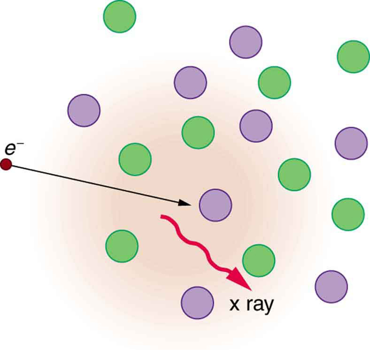

* List three “rules of thumb” that apply to the different frequencies along the electromagnetic spectrum.
* Explain why the higher the frequency, the shorter the wavelength of an electromagnetic wave.
* Draw a simplified electromagnetic spectrum, indicating the relative positions, frequencies, and spacing of the different types of radiation bands.
* List and explain the different methods by which electromagnetic waves are produced across the spectrum.

In this module we examine how electromagnetic waves are classified into categories such as radio, infrared, ultraviolet, and so on, so that we can understand some of their similarities as well as some of their differences. We will also find that there are many connections with previously discussed topics, such as wavelength and resonance. A brief overview of the production and utilization of electromagnetic waves is found in [\[link\]](#import-auto-id1169737771189).

<table id="import-auto-id1169737771189" summary="A table is shown for overview of the production and utilization of electromagnetic waves. The table has five columns. The first column represents type of EM wave, the second column the way of producing it, the third column shows the application of that type of wave, the fourth column shows the life science aspect of the wave, and the fifth column shows the issues or hazards involved with the type of wave."><caption>Electromagnetic Waves</caption><thead>
          <tr>
            <th>Type of EM wave</th>
            <th>Production</th>
            <th>Applications </th>
            <th>Life sciences aspect</th>
            <th>Issues</th>
          </tr>
        </thead><tbody> 
          <tr>
            <td>Radio &amp; TV</td>
            <td>Accelerating charges</td>
            <td>Communications Remote controls</td>
            <td>MRI</td>
            <td>Requires controls for band use</td>
          </tr>
          <tr>
            <td>Microwaves</td>
            <td>Accelerating charges &amp; thermal agitation</td>
            <td>Communications Ovens Radar</td>
            <td>Deep heating</td>
            <td>Cell phone use</td>
          </tr>
          <tr>
            <td>Infrared</td>
            <td>Thermal agitations &amp; electronic transitions</td>
            <td>Thermal imaging Heating</td>
            <td>Absorbed by atmosphere</td>
            <td>Greenhouse effect</td>
          </tr>
          <tr>
            <td>Visible light</td>
            <td>Thermal agitations &amp; electronic transitions</td>
            <td>All pervasive</td>
            <td>Photosynthesis Human vision</td>
            <td />
          </tr>
          <tr>
            <td>Ultraviolet</td>
            <td>Thermal agitations &amp; electronic transitions</td>
            <td>Sterilization Cancer control</td>
            <td>Vitamin D production</td>
            <td>Ozone depletion Cancer causing</td>
          </tr>
          <tr>
            <td>X-rays</td>
            <td>Inner electronic transitions and fast collisions</td>
            <td>Medical Security</td>
            <td>Medical diagnosis Cancer therapy</td>
            <td>Cancer causing</td>
          </tr>
          <tr>
            <td>Gamma rays</td>
            <td>Nuclear decay</td>
            <td>Nuclear medicineSecurity</td>
            <td>Medical diagnosis Cancer therapy</td>
            <td>Cancer causing Radiation damage</td>
          </tr>
        </tbody></table>

Connections: Waves

There are many types of waves, such as water waves and even earthquakes. Among the many shared attributes of waves are propagation speed, frequency, and wavelength. These are always related by the expression <math xmlns="http://www.w3.org/1998/Math/MathML"><semantics><mrow><mrow><mrow><msub><mi>v</mi><mrow><mtext>W</mtext></mrow></msub><mo stretchy="false">=</mo><mi fontstyle="italic">fλ</mi></mrow></mrow><mrow /></mrow><annotation encoding="StarMath 5.0"> size 12{v rSub { size 8{W} } =fλ} {}</annotation></semantics></math>

. This module concentrates on EM waves, but other modules contain examples of all of these characteristics for sound waves and submicroscopic particles.

As noted before, an electromagnetic wave has a frequency and a wavelength associated with it and travels at the speed of light, or <math xmlns="http://www.w3.org/1998/Math/MathML"><semantics><mrow><mrow><mi>c</mi></mrow><mrow /></mrow><annotation encoding="StarMath 5.0"> size 12{c} {}</annotation></semantics></math>

. The relationship among these wave characteristics can be described by <math xmlns="http://www.w3.org/1998/Math/MathML"><semantics><mrow><mrow><mrow><msub><mi>v</mi><mrow><mtext>W</mtext></mrow></msub><mo stretchy="false">=</mo><mi fontstyle="italic">fλ</mi></mrow></mrow><mrow /></mrow><annotation encoding="StarMath 5.0"> size 12{v rSub { size 8{W} } =fλ} {}</annotation></semantics></math>

, where <math xmlns="http://www.w3.org/1998/Math/MathML"><semantics><mrow><mrow><msub><mi>v</mi><mrow><mtext>W</mtext></mrow></msub></mrow><mrow /></mrow><annotation encoding="StarMath 5.0"> size 12{v rSub { size 8{W} } } {}</annotation></semantics></math>

 is the propagation speed of the wave, <math xmlns="http://www.w3.org/1998/Math/MathML"><semantics><mrow><mrow><mi>f</mi></mrow><mrow /></mrow><annotation encoding="StarMath 5.0"> size 12{f} {}</annotation></semantics></math>

 is the frequency, and <math xmlns="http://www.w3.org/1998/Math/MathML"><semantics><mrow><mrow><mi>λ</mi></mrow><mrow /></mrow><annotation encoding="StarMath 5.0"> size 12{λ} {}</annotation></semantics></math>

 is the wavelength. Here <math xmlns="http://www.w3.org/1998/Math/MathML"><semantics><mrow><mrow><mrow><msub><mi>v</mi><mrow><mtext>W</mtext></mrow></msub><mo stretchy="false">=</mo><mi>c</mi></mrow></mrow><mrow /></mrow><annotation encoding="StarMath 5.0"> size 12{v rSub { size 8{W} } =c} {}</annotation></semantics></math>

, so that for all electromagnetic waves,

<math xmlns="http://www.w3.org/1998/Math/MathML"><semantics><mrow><mrow><mrow><mi>c</mi><mo stretchy="false">=</mo><mi fontstyle="italic">fλ</mi></mrow></mrow><mrow /><mo>.</mo></mrow><annotation encoding="StarMath 5.0"> size 12{c = fλ} {}</annotation></semantics></math>

Thus, for all electromagnetic waves, the greater the frequency, the smaller the wavelength.

[\[link\]](#import-auto-id1169738249160) shows how the various types of electromagnetic waves are categorized according to their wavelengths and frequencies—that is, it shows the electromagnetic spectrum. Many of the characteristics of the various types of electromagnetic waves are related to their frequencies and wavelengths, as we shall see.

 {: #import-auto-id1169738249160 data-media-type="image/jpg"}

Electromagnetic Spectrum: Rules of Thumb

Three rules that apply to electromagnetic waves in general are as follows:

* {: #import-auto-id1169738011754} High-frequency electromagnetic waves are more energetic and are more able to penetrate than low-frequency waves.
* {: #import-auto-id1169737855696} High-frequency electromagnetic waves can carry more information per unit time than low-frequency waves.
* {: #import-auto-id1169738145674} The shorter the wavelength of any electromagnetic wave probing a material, the smaller the detail it is possible to resolve.

Note that there are exceptions to these rules of thumb.

# Transmission, Reflection, and Absorption

What happens when an electromagnetic wave impinges on a material? If the material is transparent to the particular frequency, then the wave can largely be transmitted. If the material is opaque to the frequency, then the wave can be totally reflected. The wave can also be absorbed by the material, indicating that there is some interaction between the wave and the material, such as the thermal agitation of molecules.

Of course it is possible to have partial transmission, reflection, and absorption. We normally associate these properties with visible light, but they do apply to all electromagnetic waves. What is not obvious is that something that is transparent to light may be opaque at other frequencies. For example, ordinary glass is transparent to visible light but largely opaque to ultraviolet radiation. Human skin is opaque to visible light—we cannot see through people—but transparent to X-rays.

# Radio and TV Waves

The broad category of **radio waves**{: data-type="term" #import-auto-id1169737930640} is defined to contain any electromagnetic wave produced by currents in wires and circuits. Its name derives from their most common use as a carrier of audio information (i.e., radio). The name is applied to electromagnetic waves of similar frequencies regardless of source. Radio waves from outer space, for example, do not come from alien radio stations. They are created by many astronomical phenomena, and their study has revealed much about nature on the largest scales.

There are many uses for radio waves, and so the category is divided into many subcategories, including microwaves and those electromagnetic waves used for AM and FM radio, cellular telephones, and TV.

The lowest commonly encountered radio frequencies are produced by high-voltage AC power transmission lines at frequencies of 50 or 60 Hz. (See [\[link\]](#import-auto-id1169736624226).) These extremely long wavelength electromagnetic waves (about 6000 km!) are one means of energy loss in long-distance power transmission.

"){: #import-auto-id1169736624226 data-media-type="image/png"}

There is an ongoing controversy regarding potential health hazards associated with exposure to these electromagnetic fields (<math xmlns="http://www.w3.org/1998/Math/MathML"><semantics><mrow><mrow><mi>E</mi></mrow><mrow /></mrow><annotation encoding="StarMath 5.0"> size 12{E} {}</annotation></semantics></math>

-fields). Some people suspect that living near such transmission lines may cause a variety of illnesses, including cancer. But demographic data are either inconclusive or simply do not support the hazard theory. Recent reports that have looked at many European and American epidemiological studies have found no increase in risk for cancer due to exposure to <math xmlns="http://www.w3.org/1998/Math/MathML"><semantics><mrow><mrow><mi>E</mi></mrow><mrow /></mrow><annotation encoding="StarMath 5.0"> size 12{E} {}</annotation></semantics></math>

-fields.

**Extremely low frequency (ELF)**{: data-type="term" #import-auto-id1169738114411} radio waves of about 1 kHz are used to communicate with submerged submarines. The ability of radio waves to penetrate salt water is related to their wavelength (much like ultrasound penetrating tissue)—the longer the wavelength, the farther they penetrate. Since salt water is a good conductor, radio waves are strongly absorbed by it, and very long wavelengths are needed to reach a submarine under the surface. (See [\[link\]](#import-auto-id1169737819824).)

. Shorter wavelengths do not penetrate to any significant depth."){: #import-auto-id1169737819824 data-media-type="image/jpg"}

AM radio waves are used to carry commercial radio signals in the frequency range from 540 to 1600 kHz. The abbreviation AM stands for **amplitude modulation**{: data-type="term" #import-auto-id1169737795301}, which is the method for placing information on these waves. (See [\[link\]](#import-auto-id1169738036075).) A **carrier wave**{: data-type="term" #import-auto-id1169738028369} having the basic frequency of the radio station, say 1530 kHz, is varied or modulated in amplitude by an audio signal. The resulting wave has a constant frequency, but a varying amplitude.

A radio receiver tuned to have the same resonant frequency as the carrier wave can pick up the signal, while rejecting the many other frequencies impinging on its antenna. The receiver’s circuitry is designed to respond to variations in amplitude of the carrier wave to replicate the original audio signal. That audio signal is amplified to drive a speaker or perhaps to be recorded.

 ![Part a of the diagram shows a carrier wave along the horizontal axis. The wave is shown to have a high frequency as the vibrations are closely spaced. The wave has constant amplitude represented by uniform height of crest and trough. Part b of the diagram shows an audio wave with a lower frequency. The wave is on the upper side of horizontal axis. The amplitude of the wave is not uniform. It has an initial small rise and fall followed by a steep rise and a gradual fall in the wave. Part c of the diagram shows the amplitude modulated wave. It is the resultant wave obtained by mixing of the waves in part a and part b. The amplitude of the resultant wave is non uniform, similar to the audio wave. The frequency of the amplitude modulated wave is equal to the frequency of the carrier wave. The wave spreads on both sides of the horizontal axis.](../resources/Figure 25_03_05a.jpg "Amplitude modulation for AM radio. (a) A carrier wave at the station&#x2019;s basic frequency. (b) An audio signal at much lower audible frequencies. (c) The amplitude of the carrier is modulated by the audio signal without changing its basic frequency."){: #import-auto-id1169738036075 data-media-type="image/jpg"}

# FM Radio Waves

FM radio waves are also used for commercial radio transmission, but in the frequency range of 88 to 108 MHz. FM stands for **frequency modulation**{: data-type="term" #import-auto-id1169738145569}, another method of carrying information. (See [\[link\]](#import-auto-id1169737758036).) Here a carrier wave having the basic frequency of the radio station, perhaps 105.1 MHz, is modulated in frequency by the audio signal, producing a wave of constant amplitude but varying frequency.

![Part a of the diagram shows a carrier wave along the horizontal axis. The wave is shown to have a high frequency as the vibrations are closely spaced. The wave has constant amplitude represented by uniform height of crest and trough. Part b of the diagram shows an audio wave with a lower frequency as shown by widely spaced vibrations. The wave has constant amplitude, represented by uniform length of crest and trough. Part c shows the frequency modulated wave obtained from waves in part a and part b. The amplitude of the resultant wave is similar to the source waves but the frequency varies. Frequency maxima are shown as closely spaced vibrations and frequency minima are shown as widely spaced vibrations. These maxima and minima are shown to alternate.](../resources/Figure 25_03_06a.jpg "Frequency modulation for FM radio. (a) A carrier wave at the station&#x2019;s basic frequency. (b) An audio signal at much lower audible frequencies. (c) The frequency of the carrier is modulated by the audio signal without changing its amplitude."){: #import-auto-id1169737758036 data-media-type="image/jpg"}

Since audible frequencies range up to 20 kHz (or 0.020 MHz) at most, the frequency of the FM radio wave can vary from the carrier by as much as 0.020 MHz. Thus the carrier frequencies of two different radio stations cannot be closer than 0.020 MHz. An FM receiver is tuned to resonate at the carrier frequency and has circuitry that responds to variations in frequency, reproducing the audio information.

FM radio is inherently less subject to noise from stray radio sources than AM radio. The reason is that amplitudes of waves add. So an AM receiver would interpret noise added onto the amplitude of its carrier wave as part of the information. An FM receiver can be made to reject amplitudes other than that of the basic carrier wave and only look for variations in frequency. It is thus easier to reject noise from FM, since noise produces a variation in amplitude.

**Television**{: data-type="term" #import-auto-id1169737826018} is also broadcast on electromagnetic waves. Since the waves must carry a great deal of visual as well as audio information, each channel requires a larger range of frequencies than simple radio transmission. TV channels utilize frequencies in the range of 54 to 88 MHz and 174 to 222 MHz. (The entire FM radio band lies between channels 88 MHz and 174 MHz.) These TV channels are called VHF (for **very high frequency**{: data-type="term" #import-auto-id1169737922358}). Other channels called UHF (for **ultra high frequency**{: data-type="term" #import-auto-id1169737787786}) utilize an even higher frequency range of 470 to 1000 MHz.

The TV video signal is AM, while the TV audio is FM. Note that these frequencies are those of free transmission with the user utilizing an old-fashioned roof antenna. Satellite dishes and cable transmission of TV occurs at significantly higher frequencies and is rapidly evolving with the use of the high-definition or HD format.

Calculating Wavelengths of Radio Waves

Calculate the wavelengths of a 1530-kHz AM radio signal, a 105.1-MHz FM radio signal, and a 1.90-GHz cell phone signal.

**Strategy**

The relationship between wavelength and frequency is <math xmlns="http://www.w3.org/1998/Math/MathML"><semantics><mrow><mrow><mrow><mi>c</mi><mo stretchy="false">=</mo><mi fontstyle="italic">fλ</mi></mrow></mrow><mrow /></mrow><annotation encoding="StarMath 5.0"> size 12{c = fλ} {}</annotation></semantics></math>

, where <math xmlns="http://www.w3.org/1998/Math/MathML"><semantics><mrow><mrow><mrow><mrow><mi>c</mi><mo stretchy="false">=</mo><mn>3</mn></mrow><mtext>.</mtext><mrow><mtext>00</mtext><mo stretchy="false">×</mo><msup><mtext>10</mtext><mrow><mn>8</mn></mrow></msup></mrow><mrow><mspace width="0.25em" /><mtext>m</mtext><mo stretchy="false">/</mo><mtext>s</mtext></mrow></mrow></mrow><mrow /></mrow><annotation encoding="StarMath 5.0"> size 12{c=3 "." "00" times "10" rSup { size 8{8} } {m} slash {s} } {}</annotation></semantics></math>

 is the speed of light (the speed of light is only very slightly smaller in air than it is in a vacuum). We can rearrange this equation to find the wavelength for all three frequencies.

**Solution**

Rearranging gives

<math xmlns="http://www.w3.org/1998/Math/MathML"><semantics><mrow><mrow><mrow><mi>λ</mi><mo stretchy="false">=</mo><mfrac><mi>c</mi><mi>f</mi></mfrac></mrow></mrow><mrow /><mo>.</mo></mrow><annotation encoding="StarMath 5.0"> size 12{λ= { {c} over {f} } } {}</annotation></semantics></math>

(a) For the <math xmlns="http://www.w3.org/1998/Math/MathML"><semantics><mrow><mrow><mrow><mrow><mi>f</mi><mo stretchy="false">=</mo><mtext>1530</mtext></mrow><mspace width="0.25em" /><mtext> kHz</mtext></mrow></mrow><mrow /></mrow><annotation encoding="StarMath 5.0"> size 12{f="1530"" kHz"} {}</annotation></semantics></math>

 AM radio signal, then,

<math xmlns="http://www.w3.org/1998/Math/MathML"> <semantics> <mrow> <mrow> <mtable columnalign="left"> <mtr> <mtd> <mrow> <mi>λ</mi> </mrow> </mtd> <mtd> <mo>=</mo></mtd> <mtd> <mrow> <mfrac> <mrow> <mrow> <mtext>3.00</mtext> <mo stretchy="false">×</mo> <msup> <mtext>10</mtext> <mrow> <mn>8</mn> </mrow> </msup> </mrow><mspace width="0.25em" /> <mtext> m/s</mtext> </mrow> <mrow> <mrow> <mtext>1530</mtext> <mo stretchy="false">×</mo> <msup> <mtext>10</mtext> <mrow> <mn>3</mn> </mrow> </msup> </mrow><mspace width="0.25em" /> <mtext> cycles/s</mtext> </mrow> </mfrac> </mrow> </mtd> </mtr> <mtr> <mtd /> <mtd> <mo>=</mo> </mtd> <mtd> <mrow> <mtext>196 m.</mtext> </mrow> </mtd> </mtr> </mtable> </mrow> <mrow /> </mrow> <annotation encoding="StarMath 5.0"> size 12{ matrix { λ {} # = { {3 "." "00" times "10" rSup { size 8{8} } " m/s"} over {"1530" times "10" rSup { size 8{3} } " cycles/s"} } {} ## {} # ="196 m" "." {} } } {}</annotation> </semantics> </math>

(b) For the <math xmlns="http://www.w3.org/1998/Math/MathML"><semantics><mrow><mrow><mrow><mi>f</mi><mo stretchy="false">=</mo><mtext>105.1 MHz</mtext></mrow></mrow><mrow /></mrow><annotation encoding="StarMath 5.0"> size 12{f="105" "." 1`"MHz"} {}</annotation></semantics></math>

 FM radio signal,

<math xmlns="http://www.w3.org/1998/Math/MathML"> <semantics> <mrow> <mrow> <mtable columnalign="left"> <mtr> <mtd> <mi>λ</mi> </mtd> <mtd> <mo>=</mo></mtd> <mtd> <mrow> <mfrac> <mrow> <mrow> <mtext>3.00</mtext> <mo stretchy="false">×</mo> <msup> <mtext>10</mtext> <mrow> <mn>8</mn> </mrow> </msup> </mrow><mspace width="0.25em" /> <mtext> m/s</mtext> </mrow> <mrow> <mrow> <mtext>105.1</mtext> <mo stretchy="false">×</mo> <msup> <mtext>10</mtext> <mrow> <mn>6</mn> </mrow> </msup> </mrow><mspace width="0.25em" /> <mtext> cycles/s</mtext> </mrow> </mfrac> </mrow> </mtd> </mtr> <mtr> <mtd /> <mtd> <mo>=</mo> </mtd> <mtd> <mrow> <mtext>2.85 m.</mtext> </mrow> </mtd> </mtr> </mtable> </mrow> </mrow> <annotation encoding="StarMath 5.0"> size 12{ matrix { λ {} # = { {3 "." "00" times "10" rSup { size 8{8} } " m/s"} over {"1530" times "10" rSup { size 8{3} } " cycles/s"} } {} ## {} # ="196 m" "." {} } } {}</annotation> </semantics> </math>

(c) And for the <math xmlns="http://www.w3.org/1998/Math/MathML"><semantics><mrow><mrow><mrow><mi>f</mi><mo stretchy="false">=</mo><mtext>1.90 GHz</mtext></mrow></mrow><mrow /></mrow><annotation encoding="StarMath 5.0"> size 12{f=1 "." "90"`"GHz"} {}</annotation></semantics></math>

 cell phone,

<math xmlns="http://www.w3.org/1998/Math/MathML"> <semantics> <mrow> <mrow> <mtable columnalign="left"> <mtr> <mtd> <mrow> <mi>λ</mi> <mrow /> </mrow> </mtd> <mtd> <mo>=</mo></mtd> <mtd> <mrow> <mfrac> <mrow> <mn>3</mn> <mtext>.</mtext> <mrow> <mtext>00</mtext> <mo stretchy="false">×</mo> <msup> <mtext>10</mtext> <mrow> <mn>8</mn> </mrow> </msup> </mrow><mspace width="0.25em" /> <mtext> m/s</mtext> </mrow> <mrow> <mrow> <mtext>1.90</mtext> <mo stretchy="false">×</mo> <msup> <mtext>10</mtext> <mrow> <mn>9</mn> </mrow> </msup> </mrow><mspace width="0.25em" /> <mtext> cycles/s</mtext> </mrow> </mfrac> </mrow> </mtd> </mtr> <mtr> <mtd /> <mtd> <mo>=</mo></mtd> <mtd> <mrow> <mtext>0.158 m.</mtext> </mrow> </mtd> </mtr> </mtable> </mrow> <mrow /> </mrow> <annotation encoding="StarMath 5.0"> size 12{ matrix { λ {} # = { {3 "." "00" times "10" rSup { size 8{8} } " m/s"} over {"1530" times "10" rSup { size 8{3} } " cycles/s"} } {} ## {} # ="196 m" "." {} } } {}</annotation> </semantics> </math>

**Discussion**

These wavelengths are consistent with the spectrum in [\[link\]](#import-auto-id1169738249160). The wavelengths are also related to other properties of these electromagnetic waves, as we shall see.

The wavelengths found in the preceding example are representative of AM, FM, and cell phones, and account for some of the differences in how they are broadcast and how well they travel. The most efficient length for a linear antenna, such as discussed in [Production of Electromagnetic Waves](/m42440), is <math xmlns="http://www.w3.org/1998/Math/MathML"><semantics><mrow><mrow><mrow><mi>λ</mi><mo stretchy="false">/</mo><mn>2</mn></mrow></mrow><mrow /></mrow><annotation encoding="StarMath 5.0"> size 12{ {λ} slash {2} } {}</annotation></semantics></math>

, half the wavelength of the electromagnetic wave. Thus a very large antenna is needed to efficiently broadcast typical AM radio with its carrier wavelengths on the order of hundreds of meters.

One benefit to these long AM wavelengths is that they can go over and around rather large obstacles (like buildings and hills), just as ocean waves can go around large rocks. FM and TV are best received when there is a line of sight between the broadcast antenna and receiver, and they are often sent from very tall structures. FM, TV, and mobile phone antennas themselves are much smaller than those used for AM, but they are elevated to achieve an unobstructed line of sight. (See [\[link\]](#import-auto-id1169738012607).)

  A large tower is used to broadcast TV signals. The actual antennas are small structures on top of the tower&#x2014;they are placed at great heights to have a clear line of sight over a large broadcast area. (credit: Ozizo, Wikimedia Commons) (b) The NTT Dokomo mobile phone tower at Tokorozawa City, Japan. (credit: tokoroten, Wikimedia Commons)"){: #import-auto-id1169738012607 data-media-type="image/png"}

# Radio Wave Interference

Astronomers and astrophysicists collect signals from outer space using electromagnetic waves. A common problem for astrophysicists is the “pollution” from electromagnetic radiation pervading our surroundings from communication systems in general. Even everyday gadgets like our car keys having the facility to lock car doors remotely and being able to turn TVs on and off using remotes involve radio-wave frequencies. In order to prevent interference between all these electromagnetic signals, strict regulations are drawn up for different organizations to utilize different radio frequency bands.

One reason why we are sometimes asked to switch off our mobile phones (operating in the range of 1.9 GHz) on airplanes and in hospitals is that important communications or medical equipment often uses similar radio frequencies and their operation can be affected by frequencies used in the communication devices.

For example, radio waves used in magnetic resonance imaging (MRI) have frequencies on the order of 100 MHz, although this varies significantly depending on the strength of the magnetic field used and the nuclear type being scanned. MRI is an important medical imaging and research tool, producing highly detailed two- and three-dimensional images. Radio waves are broadcast, absorbed, and reemitted in a resonance process that is sensitive to the density of nuclei (usually protons or hydrogen nuclei).

The wavelength of 100-MHz radio waves is 3 m, yet using the sensitivity of the resonant frequency to the magnetic field strength, details smaller than a millimeter can be imaged. This is a good example of an exception to a rule of thumb (in this case, the rubric that details much smaller than the probe’s wavelength cannot be detected). The intensity of the radio waves used in MRI presents little or no hazard to human health.

# Microwaves

**Microwaves**{: data-type="term" #import-auto-id1169738045940} are the highest-frequency electromagnetic waves that can be produced by currents in macroscopic circuits and devices. Microwave frequencies range from about <math xmlns="http://www.w3.org/1998/Math/MathML"><semantics><mrow><mrow><mrow><msup><mtext>10</mtext><mrow><mn>9</mn></mrow></msup><mspace width="0.25em" /><mtext>Hz</mtext></mrow></mrow><mrow /></mrow><annotation encoding="StarMath 5.0"> size 12{"10" rSup { size 8{9} } `"Hz"} {}</annotation></semantics></math>

 to the highest practical <math xmlns="http://www.w3.org/1998/Math/MathML"><semantics><mrow><mrow><mstyle fontstyle="italic"><mrow><mtext>LC</mtext></mrow></mstyle></mrow><mrow /></mrow><annotation encoding="StarMath 5.0"> size 12{ ital "LC"} {}</annotation></semantics></math>

 resonance at nearly <math xmlns="http://www.w3.org/1998/Math/MathML"><semantics><mrow><mrow><mrow><msup><mtext>10</mtext><mrow><mtext>12</mtext></mrow></msup><mspace width="0.25em" /><mtext>Hz</mtext></mrow></mrow><mrow /></mrow><annotation encoding="StarMath 5.0"> size 12{"10" rSup { size 8{"12"} } `"Hz"} {}</annotation></semantics></math>

. Since they have high frequencies, their wavelengths are short compared with those of other radio waves—hence the name “microwave.”

Microwaves can also be produced by atoms and molecules. They are, for example, a component of electromagnetic radiation generated by **thermal agitation**{: data-type="term" #import-auto-id1169737778944}. The thermal motion of atoms and molecules in any object at a temperature above absolute zero causes them to emit and absorb radiation.

Since it is possible to carry more information per unit time on high frequencies, microwaves are quite suitable for communications. Most satellite-transmitted information is carried on microwaves, as are land-based long-distance transmissions. A clear line of sight between transmitter and receiver is needed because of the short wavelengths involved.

**Radar**{: data-type="term" #import-auto-id1169737818718} is a common application of microwaves that was first developed in World War II. By detecting and timing microwave echoes, radar systems can determine the distance to objects as diverse as clouds and aircraft. A Doppler shift in the radar echo can be used to determine the speed of a car or the intensity of a rainstorm. Sophisticated radar systems are used to map the Earth and other planets, with a resolution limited by wavelength. (See [\[link\]](#import-auto-id1169737911449).) The shorter the wavelength of any probe, the smaller the detail it is possible to observe.

"){: #import-auto-id1169737911449 data-media-type="image/png"}

# Heating with Microwaves

How does the ubiquitous microwave oven produce microwaves electronically, and why does food absorb them preferentially? Microwaves at a frequency of 2.45 GHz are produced by accelerating electrons. The microwaves are then used to induce an alternating electric field in the oven.

Water and some other constituents of food have a slightly negative charge at one end and a slightly positive charge at one end (called polar molecules). The range of microwave frequencies is specially selected so that the polar molecules, in trying to keep orienting themselves with the electric field, absorb these energies and increase their temperatures—called dielectric heating.

The energy thereby absorbed results in thermal agitation heating food and not the plate, which does not contain water. Hot spots in the food are related to constructive and destructive interference patterns. Rotating antennas and food turntables help spread out the hot spots.

Another use of microwaves for heating is within the human body. Microwaves will penetrate more than shorter wavelengths into tissue and so can accomplish “deep heating” (called microwave diathermy). This is used for treating muscular pains, spasms, tendonitis, and rheumatoid arthritis.

Making Connections: Take-Home Experiment—Microwave Ovens

1.  {: #import-auto-id1169737726594} Look at the door of a microwave oven. Describe the structure of the door. Why is there a metal grid on the door? How does the size of the holes in the grid compare with the wavelengths of microwaves used in microwave ovens? What is this wavelength?
2.  {: #import-auto-id1169738088294} Place a glass of water (about 250 ml) in the microwave and heat it for 30 seconds. Measure the temperature gain (the
    <math xmlns="http://www.w3.org/1998/Math/MathML"><semantics><mrow><mrow><mn>Δ</mn><mtext>T</mtext></mrow><mrow /></mrow><annotation encoding="StarMath 5.0"> size 12{DT} {}</annotation></semantics></math>
    
    ). Assuming that the power output of the oven is 1000 W, calculate the efficiency of the heat-transfer process.
3.  {: #import-auto-id1169738036387} Remove the rotating turntable or moving plate and place a cup of water in several places along a line parallel with the opening. Heat for 30 seconds and measure the
    <math xmlns="http://www.w3.org/1998/Math/MathML"><semantics><mrow><mrow><mn>Δ</mn><mtext>T</mtext></mrow><mrow /></mrow><annotation encoding="StarMath 5.0"> size 12{DT} {}</annotation></semantics></math>
    
    for each position. Do you see cases of destructive interference?
{: data-number-style="arabic"}

Microwaves generated by atoms and molecules far away in time and space can be received and detected by electronic circuits. Deep space acts like a blackbody with a 2.7 K temperature, radiating most of its energy in the microwave frequency range. In 1964, Penzias and Wilson detected this radiation and eventually recognized that it was the radiation of the Big Bang’s cooled remnants.

# Infrared Radiation

The microwave and infrared regions of the electromagnetic spectrum overlap (see [\[link\]](#import-auto-id1169738249160)). **Infrared radiation**{: data-type="term" #import-auto-id1169737769042} is generally produced by thermal motion and the vibration and rotation of atoms and molecules. Electronic transitions in atoms and molecules can also produce infrared radiation.

The range of infrared frequencies extends up to the lower limit of visible light, just below red. In fact, infrared means “below red.” Frequencies at its upper limit are too high to be produced by accelerating electrons in circuits, but small systems, such as atoms and molecules, can vibrate fast enough to produce these waves.

Water molecules rotate and vibrate particularly well at infrared frequencies, emitting and absorbing them so efficiently that the emissivity for skin is <math xmlns="http://www.w3.org/1998/Math/MathML"><semantics><mrow><mrow><mrow><mrow><mi>e</mi><mo stretchy="false">=</mo><mn>0</mn></mrow><mtext>.</mtext><mtext>97</mtext></mrow></mrow><mrow /></mrow><annotation encoding="StarMath 5.0"> size 12{e=0 "." "97"} {}</annotation></semantics></math>

 in the infrared. Night-vision scopes can detect the infrared emitted by various warm objects, including humans, and convert it to visible light.

We can examine radiant heat transfer from a house by using a camera capable of detecting infrared radiation. Reconnaissance satellites can detect buildings, vehicles, and even individual humans by their infrared emissions, whose power radiation is proportional to the fourth power of the absolute temperature. More mundanely, we use infrared lamps, some of which are called quartz heaters, to preferentially warm us because we absorb infrared better than our surroundings.

The Sun radiates like a nearly perfect blackbody (that is, it has <math xmlns="http://www.w3.org/1998/Math/MathML"><semantics><mrow><mrow><mrow><mi>e</mi><mo stretchy="false">=</mo><mn>1</mn></mrow></mrow><mrow /></mrow><annotation encoding="StarMath 5.0"> size 12{e=1} {}</annotation></semantics></math>

), with a 6000 K surface temperature. About half of the solar energy arriving at the Earth is in the infrared region, with most of the rest in the visible part of the spectrum, and a relatively small amount in the ultraviolet. On average, 50 percent of the incident solar energy is absorbed by the Earth.

The relatively constant temperature of the Earth is a result of the energy balance between the incoming solar radiation and the energy radiated from the Earth. Most of the infrared radiation emitted from the Earth is absorbed by <math xmlns="http://www.w3.org/1998/Math/MathML"><semantics><mrow><mrow><msub><mtext>CO</mtext><mrow><mn>2</mn></mrow></msub></mrow><mrow /></mrow><annotation encoding="StarMath 5.0"> size 12{"CO" rSub { size 8{2} } } {}</annotation></semantics></math>

 and <math xmlns="http://www.w3.org/1998/Math/MathML"><semantics><mrow><mrow><mrow><msub><mtext>H</mtext><mrow><mn>2</mn></mrow></msub><mtext>O</mtext></mrow></mrow><mrow /></mrow><annotation encoding="StarMath 5.0"> size 12{H rSub { size 8{2} } O} {}</annotation></semantics></math>

 in the atmosphere and then radiated back to Earth or into outer space. This radiation back to Earth is known as the greenhouse effect, and it maintains the surface temperature of the Earth about <math xmlns="http://www.w3.org/1998/Math/MathML"><semantics><mrow><mrow><mrow><mtext>40º</mtext><mtext>C</mtext></mrow></mrow><mrow /></mrow><annotation encoding="StarMath 5.0"> size 12{"40"°C} {}</annotation></semantics></math>

 higher than it would be if there is no absorption. Some scientists think that the increased concentration of <math xmlns="http://www.w3.org/1998/Math/MathML"><semantics><mrow><mrow><msub><mtext>CO</mtext><mrow><mn>2</mn></mrow></msub></mrow><mrow /></mrow><annotation encoding="StarMath 5.0"> size 12{"CO" rSub { size 8{2} } } {}</annotation></semantics></math>

 and other greenhouse gases in the atmosphere, resulting from increases in fossil fuel burning, has increased global average temperatures.

# Visible Light

**Visible light**{: data-type="term" #import-auto-id1169737924174} is the narrow segment of the electromagnetic spectrum to which the normal human eye responds. Visible light is produced by vibrations and rotations of atoms and molecules, as well as by electronic transitions within atoms and molecules. The receivers or detectors of light largely utilize electronic transitions. We say the atoms and molecules are excited when they absorb and relax when they emit through electronic transitions.

[\[link\]](#import-auto-id1169737930094) shows this part of the spectrum, together with the colors associated with particular pure wavelengths. We usually refer to visible light as having wavelengths of between 400 nm and 750 nm. (The retina of the eye actually responds to the lowest ultraviolet frequencies, but these do not normally reach the retina because they are absorbed by the cornea and lens of the eye.)

Red light has the lowest frequencies and longest wavelengths, while violet has the highest frequencies and shortest wavelengths. Blackbody radiation from the Sun peaks in the visible part of the spectrum but is more intense in the red than in the violet, making the Sun yellowish in appearance.

 {: #import-auto-id1169737930094 data-media-type="image/jpg"}

Living things—plants and animals—have evolved to utilize and respond to parts of the electromagnetic spectrum they are embedded in. Visible light is the most predominant and we enjoy the beauty of nature through visible light. Plants are more selective. Photosynthesis makes use of parts of the visible spectrum to make sugars.

Integrated Concept Problem: Correcting Vision with Lasers

During laser vision correction, a brief burst of 193-nm ultraviolet light is projected onto the cornea of a patient. It makes a spot 0.80 mm in diameter and evaporates a layer of cornea <math xmlns="http://www.w3.org/1998/Math/MathML"><semantics><mrow><mrow><mrow><mn>0</mn><mtext>.</mtext><mtext>30</mtext><mspace width="0.25em" /><mi fontstyle="italic">μ</mi><mtext>m</mtext></mrow></mrow><mrow /></mrow><annotation encoding="StarMath 5.0"> size 12{0 "." "30" mm} {}</annotation></semantics></math>

 thick. Calculate the energy absorbed, assuming the corneal tissue has the same properties as water; it is initially at <math xmlns="http://www.w3.org/1998/Math/MathML"><semantics><mrow><mrow><mrow><mtext>34º</mtext><mtext>C</mtext></mrow></mrow><mrow /></mrow><annotation encoding="StarMath 5.0"> size 12{"34"°C} {}</annotation></semantics></math>

. Assume the evaporated tissue leaves at a temperature of <math xmlns="http://www.w3.org/1998/Math/MathML"><semantics><mrow><mrow><mrow><mtext>100º</mtext><mtext>C</mtext></mrow></mrow><mrow /></mrow><annotation encoding="StarMath 5.0"> size 12{"100"°C} {}</annotation></semantics></math>

.

**Strategy**

The energy from the laser light goes toward raising the temperature of the tissue and also toward evaporating it. Thus we have two amounts of heat to add together. Also, we need to find the mass of corneal tissue involved.

**Solution**

To figure out the heat required to raise the temperature of the tissue to <math xmlns="http://www.w3.org/1998/Math/MathML"><semantics><mrow><mrow><mrow><mtext>100º</mtext><mtext>C</mtext></mrow></mrow><mrow /></mrow><annotation encoding="StarMath 5.0"> size 12{"100"°C} {}</annotation></semantics></math>

, we can apply concepts of thermal energy. We know that

<math xmlns="http://www.w3.org/1998/Math/MathML"><semantics><mrow><mrow><mrow><mrow><mstyle fontstyle="italic"><mrow><mtext>Q </mtext></mrow></mstyle><mo stretchy="false">=</mo><mstyle fontstyle="italic"><mrow><mtext> mc</mtext></mrow></mstyle></mrow><mn>Δ</mn><mi fontstyle="italic">T</mi></mrow></mrow><mrow /><mo>,</mo></mrow><annotation encoding="StarMath 5.0"> size 12{ ital "Q "= ital " mc"ΔT} {}</annotation></semantics></math>

where Q is the heat required to raise the temperature, <math xmlns="http://www.w3.org/1998/Math/MathML"><semantics><mrow><mrow><mn>Δ</mn><mi fontstyle="italic">T</mi></mrow><mrow /></mrow><annotation encoding="StarMath 5.0"> size 12{DT} {}</annotation></semantics></math>

 is the desired change in temperature, <math xmlns="http://www.w3.org/1998/Math/MathML"><semantics><mrow><mrow><mi>m</mi></mrow><mrow /></mrow><annotation encoding="StarMath 5.0"> size 12{m} {}</annotation></semantics></math>

 is the mass of tissue to be heated, and <math xmlns="http://www.w3.org/1998/Math/MathML"><semantics><mrow><mrow><mi>c</mi></mrow><mrow /></mrow><annotation encoding="StarMath 5.0"> size 12{c} {}</annotation></semantics></math>

 is the specific heat of water equal to 4186 J/kg/K.

Without knowing the mass <math xmlns="http://www.w3.org/1998/Math/MathML"> <semantics> <mi>m</mi> </semantics> </math>

 at this point, we have

<math xmlns="http://www.w3.org/1998/Math/MathML"><semantics><mrow><mrow><mrow><mrow><mi>Q</mi><mo stretchy="false">=</mo><mi>m</mi></mrow><mo stretchy="false">(</mo><mtext>4186 J/kg/K</mtext><mo stretchy="false">)</mo><mo stretchy="false">(</mo><mtext>100º</mtext><mrow><mtext>C</mtext><mo stretchy="false">–</mo><mtext>34º</mtext></mrow><mtext>C</mtext><mrow><mo stretchy="false">)</mo><mo stretchy="false">=</mo><mi>m</mi></mrow><mo stretchy="false">(</mo><mtext>276,276 J/kg</mtext><mrow><mo stretchy="false">)</mo><mo stretchy="false">=</mo><mi>m</mi></mrow><mo stretchy="false">(</mo><mtext>276 kJ/kg</mtext><mo stretchy="false">).</mo></mrow></mrow><mrow /></mrow><annotation encoding="StarMath 5.0"> size 12{Q=m \( "4186 J/kg/K" \) \( "100"°C - "34"°C \) =m \( "276,276 J/kg" \) =m \( "276 kJ" \) } {}</annotation></semantics></math>

The latent heat of vaporization of water is 2256 kJ/kg, so that the energy needed to evaporate mass <math xmlns="http://www.w3.org/1998/Math/MathML"><semantics><mrow><mrow><mi>m</mi></mrow><mrow /></mrow><annotation encoding="StarMath 5.0"> size 12{m} {}</annotation></semantics></math>

 is

<math xmlns="http://www.w3.org/1998/Math/MathML"><semantics><mrow><mrow><mrow><mrow><mrow><msub><mi>Q</mi><mrow><mtext>v</mtext></mrow></msub><mo stretchy="false">=</mo><msub><mi fontstyle="italic">mL</mi><mrow><mtext>v</mtext></mrow></msub></mrow><mo stretchy="false">=</mo><mi>m</mi></mrow><mo stretchy="false">(</mo><mtext>2256 kJ/kg</mtext><mo stretchy="false">)</mo></mrow></mrow><mrow /><mo>.</mo></mrow><annotation encoding="StarMath 5.0"> size 12{Q rSub { size 8{v} } = mL rSub { size 8{v} } = m \( "2256" \) " kJ"} {}</annotation></semantics></math>

To find the mass <math xmlns="http://www.w3.org/1998/Math/MathML"><semantics><mrow><mrow><mi>m</mi></mrow><mrow /></mrow><annotation encoding="StarMath 5.0"> size 12{m} {}</annotation></semantics></math>

, we use the equation <math xmlns="http://www.w3.org/1998/Math/MathML"><semantics><mrow><mrow><mrow><mi>ρ</mi><mo stretchy="false">=</mo><mrow><mi>m</mi><mo stretchy="false">/</mo><mtext>V</mtext></mrow></mrow></mrow><mrow /></mrow><annotation encoding="StarMath 5.0"> size 12{ρ= {m} slash {V} } {}</annotation></semantics></math>

, where <math xmlns="http://www.w3.org/1998/Math/MathML"><semantics><mrow><mrow><mi>ρ</mi></mrow><mrow /></mrow><annotation encoding="StarMath 5.0"> size 12{ρ} {}</annotation></semantics></math>

 is the density of the tissue and <math xmlns="http://www.w3.org/1998/Math/MathML"><semantics><mrow><mrow><mtext>V</mtext></mrow><mrow /></mrow><annotation encoding="StarMath 5.0"> size 12{V} {}</annotation></semantics></math>

 is its volume. For this case,

<math xmlns="http://www.w3.org/1998/Math/MathML"> <semantics> <mrow> <mrow> <mtable columnalign="left"> <mtr><mtd> <mi>m</mi></mtd> <mtd> <mo stretchy="false">=</mo> </mtd> <mtd> <mi>ρ</mi> <mtext>V </mtext> </mtd> </mtr> <mtr><mtd /> <mtd> <mo stretchy="false">=</mo> </mtd> <mtd> <msup> <mtext> (1000 kg/m</mtext> <mn>3</mn> </msup> <mo stretchy="false">)</mo> <mo stretchy="false">(</mo> <mtext>area</mtext> <mi>×</mi> <mtext>thickness</mtext> <mo stretchy="false" /><msup><mtext>(m</mtext><mn>3</mn></msup><mtext>))</mtext> </mtd> </mtr> <mtr><mtd /> <mtd><mo>=</mo></mtd> <mtd> <mrow> <mtext>(1000 kg/</mtext> <msup><mtext>m</mtext><mn>3</mn></msup> <mo stretchy="false">)</mo> <mo stretchy="false">(</mo> <mi>π</mi> <mo stretchy="false">(</mo> <mn>0.80</mn> <mi>×</mi> <msup> <mtext>10</mtext> <mrow> <mrow> <mo stretchy="false">–</mo> <mn>3</mn> </mrow> </mrow> </msup><mspace width="0.25em" /> <mtext> m</mtext> <mrow> <msup> <mo stretchy="false">)</mo> <mrow> <mn>2</mn> </mrow> </msup> <mo stretchy="false">/</mo> <mn>4</mn> </mrow> <mo stretchy="false">)</mo> <mo stretchy="false">(</mo> <mn>0</mn> <mtext>.</mtext> <mtext>30</mtext> <mi>×</mi> <msup> <mtext>10</mtext> <mrow> <mrow> <mo stretchy="false">–</mo> <mn>6</mn> </mrow> </mrow> </msup><mspace width="0.25em" /> <mtext> m</mtext> <mo stretchy="false">)</mo> <mrow /> </mrow> </mtd> </mtr> <mtr><mtd /> <mtd><mo>=</mo></mtd> <mtd> <mrow> <mn>0.151</mn> <mi>×</mi> <msup> <mtext>10</mtext> <mrow> <mrow> <mo stretchy="false">–</mo> <mn>9</mn> </mrow> </mrow> </msup><mspace width="0.25em" /> <mtext> kg.</mtext> </mrow> </mtd> </mtr> </mtable> </mrow> </mrow> <annotation encoding="StarMath 5.0">alignl { stack { size 12{m = ρ"V "=" 1000 kg/m" rSup { size 8{3} } \( "area"´"thickness" \) } {} # ="1000" \( p \( 0 "." "80"´"10" rSup { size 8{ +- 3} } " m" \) rSup { size 8{2} } /4 \) \( 0 "." "30"´"10" rSup { size 8{-6} } " m" \) {} # =0 "." "151"´"10" rSup { size 8{ +- 9} } " kg" "." {} } } {}</annotation> </semantics> </math>

Therefore, the total energy absorbed by the tissue in the eye is the sum of <math xmlns="http://www.w3.org/1998/Math/MathML"><semantics><mrow><mrow><mtext>Q</mtext></mrow><mrow /></mrow><annotation encoding="StarMath 5.0"> size 12{Q} {}</annotation></semantics></math>

 and <math xmlns="http://www.w3.org/1998/Math/MathML"><semantics><mrow><mrow><msub><mtext>Q</mtext><mrow><mtext>v</mtext></mrow></msub></mrow><mrow /></mrow><annotation encoding="StarMath 5.0"> size 12{Q rSub { size 8{v} } } {}</annotation></semantics></math>

\:

<math xmlns="http://www.w3.org/1998/Math/MathML"><semantics><mrow><mrow><mrow><mrow><msub><mtext>Q</mtext><mrow><mtext>tot</mtext></mrow></msub><mo stretchy="false">=</mo><mi>m</mi></mrow><mo stretchy="false">(</mo><mi fontstyle="italic">c</mi><mn>Δ</mn><mrow><mtext>T </mtext><mo stretchy="false">+</mo><msub><mtext> L</mtext><mrow><mtext>v</mtext></mrow></msub></mrow><mrow><mo stretchy="false">)</mo><mo stretchy="false">=</mo> <mo stretchy="false">(</mo><mn>0.151</mn></mrow><mi>×</mi><msup><mtext>10</mtext><mrow><mrow><mo stretchy="false">−</mo><mn>9</mn></mrow></mrow></msup><mspace width="0.25em" /><mtext>kg</mtext><mo stretchy="false">)</mo> <mo stretchy="false">(</mo><mrow><mtext>276 kJ/kg</mtext><mo stretchy="false">+</mo><mtext>2256 kJ/kg</mtext></mrow><mrow><mo stretchy="false">)</mo><mo stretchy="false">=</mo><mtext>382</mtext></mrow><mi>×</mi><msup><mtext>10</mtext><mrow><mrow><mo stretchy="false">−</mo><mn>9</mn></mrow></mrow></msup><mspace width="0.25em" /><mtext> kJ</mtext></mrow></mrow><mrow /><mo>.</mo></mrow><annotation encoding="StarMath 5.0"> size 12{Q rSub { size 8{"tot"} } = m \( cD"T "+" L" rSub { size 8{v} } \) =0 "." "151"´"10" rSup { size 8{-9} } \( "276"+"2256" \) ="382"´"10" rSup { size 8{-9} } " kJ"} {}</annotation></semantics></math>

**Discussion**

The lasers used for this eye surgery are excimer lasers, whose light is well absorbed by biological tissue. They evaporate rather than burn the tissue, and can be used for precision work. Most lasers used for this type of eye surgery have an average power rating of about one watt. For our example, if we assume that each laser burst from this pulsed laser lasts for 10 ns, and there are 400 bursts per second, then the average power is <math xmlns="http://www.w3.org/1998/Math/MathML"><semantics><mrow><mrow><mrow><msub><mtext>Q</mtext><mrow><mtext>tot</mtext></mrow></msub><mi>×</mi><mrow><mtext>400</mtext><mo stretchy="false">=</mo><mtext>150 mW</mtext></mrow></mrow></mrow><mrow /></mrow><annotation encoding="StarMath 5.0"> size 12{Q rSub { size 8{"tot"} } ´"400"="150"" mW"} {}</annotation></semantics></math>

.

Optics is the study of the behavior of visible light and other forms of electromagnetic waves. Optics falls into two distinct categories. When electromagnetic radiation, such as visible light, interacts with objects that are large compared with its wavelength, its motion can be represented by straight lines like rays. Ray optics is the study of such situations and includes lenses and mirrors.

When electromagnetic radiation interacts with objects about the same size as the wavelength or smaller, its wave nature becomes apparent. For example, observable detail is limited by the wavelength, and so visible light can never detect individual atoms, because they are so much smaller than its wavelength. Physical or wave optics is the study of such situations and includes all wave characteristics.

Take-Home Experiment: Colors That Match

When you light a match you see largely orange light; when you light a gas stove you see blue light. Why are the colors different? What other colors are present in these?

# Ultraviolet Radiation

Ultraviolet means “above violet.” The electromagnetic frequencies of **ultraviolet radiation (UV)**{: data-type="term" #import-auto-id1169737730469} extend upward from violet, the highest-frequency visible light. Ultraviolet is also produced by atomic and molecular motions and electronic transitions. The wavelengths of ultraviolet extend from 400 nm down to about 10 nm at its highest frequencies, which overlap with the lowest X-ray frequencies. It was recognized as early as 1801 by Johann Ritter that the solar spectrum had an invisible component beyond the violet range.

Solar UV radiation is broadly subdivided into three regions: UV-A (320–400 nm), UV-B (290–320 nm), and UV-C (220–290 nm), ranked from long to shorter wavelengths (from smaller to larger energies). Most UV-B and all UV-C is absorbed by ozone (<math xmlns="http://www.w3.org/1998/Math/MathML"><semantics><mrow><mrow><msub><mtext>O</mtext><mrow><mn>3</mn></mrow></msub></mrow><mrow /></mrow><annotation encoding="StarMath 5.0"> size 12{O rSub { size 8{3} } } {}</annotation></semantics></math>

) molecules in the upper atmosphere. Consequently, 99% of the solar UV radiation reaching the Earth’s surface is UV-A.

# Human Exposure to UV Radiation

It is largely exposure to UV-B that causes skin cancer. It is estimated that as many as 20% of adults will develop skin cancer over the course of their lifetime. Again, treatment is often successful if caught early. Despite very little UV-B reaching the Earth’s surface, there are substantial increases in skin-cancer rates in countries such as Australia, indicating how important it is that UV-B and UV-C continue to be absorbed by the upper atmosphere.

All UV radiation can damage collagen fibers, resulting in an acceleration of the aging process of skin and the formation of wrinkles. Because there is so little UV-B and UV-C reaching the Earth’s surface, sunburn is caused by large exposures, and skin cancer from repeated exposure. Some studies indicate a link between overexposure to the Sun when young and melanoma later in life.

The tanning response is a defense mechanism in which the body produces pigments to absorb future exposures in inert skin layers above living cells. Basically UV-B radiation excites DNA molecules, distorting the DNA helix, leading to mutations and the possible formation of cancerous cells.

Repeated exposure to UV-B may also lead to the formation of cataracts in the eyes—a cause of blindness among people living in the equatorial belt where medical treatment is limited. Cataracts, clouding in the eye’s lens and a loss of vision, are age related; 60% of those between the ages of 65 and 74 will develop cataracts. However, treatment is easy and successful, as one replaces the lens of the eye with a plastic lens. Prevention is important. Eye protection from UV is more effective with plastic sunglasses than those made of glass.

A major acute effect of extreme UV exposure is the suppression of the immune system, both locally and throughout the body.

Low-intensity ultraviolet is used to sterilize haircutting implements, implying that the energy associated with ultraviolet is deposited in a manner different from lower-frequency electromagnetic waves. (Actually this is true for all electromagnetic waves with frequencies greater than visible light.)

Flash photography is generally not allowed of precious artworks and colored prints because the UV radiation from the flash can cause photo-degradation in the artworks. Often artworks will have an extra-thick layer of glass in front of them, which is especially designed to absorb UV radiation.

# UV Light and the Ozone Layer

If all of the Sun’s ultraviolet radiation reached the Earth’s surface, there would be extremely grave effects on the biosphere from the severe cell damage it causes. However, the layer of ozone (<math xmlns="http://www.w3.org/1998/Math/MathML"><semantics><mrow><mrow><msub><mtext>O</mtext><mrow><mn>3</mn></mrow></msub></mrow><mrow /></mrow><annotation encoding="StarMath 5.0"> size 12{O rSub { size 8{3} } } {}</annotation></semantics></math>

) in our upper atmosphere (10 to 50 km above the Earth) protects life by absorbing most of the dangerous UV radiation.

Unfortunately, today we are observing a depletion in ozone concentrations in the upper atmosphere. This depletion has led to the formation of an “ozone hole” in the upper atmosphere. The hole is more centered over the southern hemisphere, and changes with the seasons, being largest in the spring. This depletion is attributed to the breakdown of ozone molecules by refrigerant gases called chlorofluorocarbons (CFCs).

The UV radiation helps dissociate the CFC’s, releasing highly reactive chlorine (Cl) atoms, which catalyze the destruction of the ozone layer. For example, the reaction of <math xmlns="http://www.w3.org/1998/Math/MathML"><semantics><mrow><mrow><msub><mtext>CFCl</mtext><mrow><mn>3</mn></mrow></msub></mrow><mrow /></mrow><annotation encoding="StarMath 5.0"> size 12{"CFCl" rSub { size 8{3} } } {}</annotation></semantics></math>

 with a photon of light <math xmlns="http://www.w3.org/1998/Math/MathML"><semantics><mrow><mrow><mfenced open="(" close=")"><mstyle fontstyle="italic"><mrow><mtext>hv</mtext></mrow></mstyle></mfenced></mrow><mrow /></mrow><annotation encoding="StarMath 5.0"> size 12{ left ( ital "hv" right )} {}</annotation></semantics></math>

 can be written as:

<math xmlns="http://www.w3.org/1998/Math/MathML"><semantics><mrow><mrow><mrow><mrow><msub><mtext>CFCl</mtext><mrow><mn>3</mn></mrow></msub><mo stretchy="false">+</mo><mtext> h</mtext></mrow><mi>v</mi><mtext /><mo stretchy="false">→</mo><mrow><msub><mtext> CFCl</mtext><mrow><mn>2</mn></mrow></msub><mo stretchy="false">+</mo><mtext> Cl.</mtext></mrow></mrow></mrow><mrow /></mrow><annotation encoding="StarMath 5.0"> size 12{"CFCl" rSub { size 8{3} } +" h"v" " rightarrow " CFCl" rSub { size 8{2} } +" Cl"} {}</annotation></semantics></math>

The Cl atom then catalyzes the breakdown of ozone as follows:

<math xmlns="http://www.w3.org/1998/Math/MathML"><semantics><mrow><mrow><mrow><mrow><mtext>Cl </mtext><mo stretchy="false">+</mo><msub><mtext> O</mtext><mrow><mn>3</mn></mrow></msub></mrow><mtext /><mo stretchy="false">→</mo><mrow><mtext> ClO </mtext><mo stretchy="false">+</mo><msub><mtext> O</mtext><mrow><mn>2</mn></mrow></msub></mrow><mspace width="0.25em" /><mrow><mtext> and ClO </mtext><mo stretchy="false">+</mo><msub><mtext> O</mtext><mrow><mn>3</mn></mrow></msub></mrow><mtext /><mo stretchy="false">→</mo><mrow><mtext> Cl </mtext><mo stretchy="false">+</mo><msub><mtext> 2O</mtext><mrow><mn>2</mn></mrow></msub></mrow></mrow></mrow><mrow /><mo>.</mo></mrow><annotation encoding="StarMath 5.0"> size 12{"Cl "+" O" rSub { size 8{3} } " " rightarrow " ClO "+" O" rSub { size 8{2} } " and ClO "+" O" rSub { size 8{3} } " " rightarrow " Cl "+" 2O" rSub { size 8{2} } } {}</annotation></semantics></math>

A single chlorine atom could destroy ozone molecules for up to two years before being transported down to the surface. The CFCs are relatively stable and will contribute to ozone depletion for years to come. CFCs are found in refrigerants, air conditioning systems, foams, and aerosols.

International concern over this problem led to the establishment of the “Montreal Protocol” agreement (1987) to phase out CFC production in most countries. However, developing-country participation is needed if worldwide production and elimination of CFCs is to be achieved. Probably the largest contributor to CFC emissions today is India. But the protocol seems to be working, as there are signs of an ozone recovery. (See [\[link\]](#import-auto-id1169737813036).)

 "){: #import-auto-id1169737813036 data-media-type="image/png"}

# Benefits of UV Light

Besides the adverse effects of ultraviolet radiation, there are also benefits of exposure in nature and uses in technology. Vitamin D production in the skin (epidermis) results from exposure to UVB radiation, generally from sunlight. A number of studies indicate lack of vitamin D can result in the development of a range of cancers (prostate, breast, colon), so a certain amount of UV exposure is helpful. Lack of vitamin D is also linked to osteoporosis. Exposures (with no sunscreen) of 10 minutes a day to arms, face, and legs might be sufficient to provide the accepted dietary level. However, in the winter time north of about <math xmlns="http://www.w3.org/1998/Math/MathML"><semantics><mrow><mrow><mrow><mtext>37º</mtext></mrow></mrow><mrow /></mrow><annotation encoding="StarMath 5.0"> size 12{"37"°} {}</annotation></semantics></math>

 latitude, most UVB gets blocked by the atmosphere.

UV radiation is used in the treatment of infantile jaundice and in some skin conditions. It is also used in sterilizing workspaces and tools, and killing germs in a wide range of applications. It is also used as an analytical tool to identify substances.

When exposed to ultraviolet, some substances, such as minerals, glow in characteristic visible wavelengths, a process called fluorescence. So-called black lights emit ultraviolet to cause posters and clothing to fluoresce in the visible. Ultraviolet is also used in special microscopes to detect details smaller than those observable with longer-wavelength visible-light microscopes.

Things Great and Small: A Submicroscopic View of X-Ray Production

X-rays can be created in a high-voltage discharge. They are emitted in the material struck by electrons in the discharge current. There are two mechanisms by which the electrons create X-rays.

The first method is illustrated in [\[link\]](#import-auto-id1169738193776). An electron is accelerated in an evacuated tube by a high positive voltage. The electron strikes a metal plate (e.g., copper) and produces X-rays. Since this is a high-voltage discharge, the electron gains sufficient energy to ionize the atom.

![An atom is shown. The nucleus is in the center as a cluster of small spheres packed together. Four electron orbits are shown around the nucleus. The one close to the nucleus is circular. All the other orbits are elliptical in nature and inclined at various angles. An electron, represented as a tiny sphere, is shown to strike the atom. An electron is shown knocked out from the closest orbit. A second image of the same atom illustrates another electron striking innermost orbit; a wavy red arrow representing an x ray is shooting away from the innermost orbit.](../resources/Figure 25_03_13a.jpg "Artist&#x2019;s conception of an electron ionizing an atom followed by the recapture of an electron and emission of an X-ray. An energetic electron strikes an atom and knocks an electron out of one of the orbits closest to the nucleus. Later, the atom captures another electron, and the energy released by its fall into a low orbit generates a high-energy EM wave called an X-ray."){: #import-auto-id1169738193776 data-media-type="image/jpg"}

In the case shown, an inner-shell electron (one in an orbit relatively close to and tightly bound to the nucleus) is ejected. A short time later, another electron is captured and falls into the orbit in a single great plunge. The energy released by this fall is given to an EM wave known as an X-ray. Since the orbits of the atom are unique to the type of atom, the energy of the X-ray is characteristic of the atom, hence the name characteristic X-ray.

The second method by which an energetic electron creates an X-ray when it strikes a material is illustrated in [\[link\]](#import-auto-id1169737755554). The electron interacts with charges in the material as it penetrates. These collisions transfer kinetic energy from the electron to the electrons and atoms in the material.

{: #import-auto-id1169737755554 data-media-type="image/jpg"}

A loss of kinetic energy implies an acceleration, in this case decreasing the electron’s velocity. Whenever a charge is accelerated, it radiates EM waves. Given the high energy of the electron, these EM waves can have high energy. We call them X-rays. Since the process is random, a broad spectrum of X-ray energy is emitted that is more characteristic of the electron energy than the type of material the electron encounters. Such EM radiation is called “bremsstrahlung” (German for “braking radiation”).

# X-Rays

In the 1850s, scientists (such as Faraday) began experimenting with high-voltage electrical discharges in tubes filled with rarefied gases. It was later found that these discharges created an invisible, penetrating form of very high frequency electromagnetic radiation. This radiation was called an **X-ray**{: data-type="term" #import-auto-id1169738134377}, because its identity and nature were unknown.

As described in [Things Great and Small](#fs-id1169737992225), there are two methods by which X-rays are created—both are submicroscopic processes and can be caused by high-voltage discharges. While the low-frequency end of the X-ray range overlaps with the ultraviolet, X-rays extend to much higher frequencies (and energies).

X-rays have adverse effects on living cells similar to those of ultraviolet radiation, and they have the additional liability of being more penetrating, affecting more than the surface layers of cells. Cancer and genetic defects can be induced by exposure to X-rays. Because of their effect on rapidly dividing cells, X-rays can also be used to treat and even cure cancer.

The widest use of X-rays is for imaging objects that are opaque to visible light, such as the human body or aircraft parts. In humans, the risk of cell damage is weighed carefully against the benefit of the diagnostic information obtained. However, questions have risen in recent years as to accidental overexposure of some people during CT scans—a mistake at least in part due to poor monitoring of radiation dose.

The ability of X-rays to penetrate matter depends on density, and so an X-ray image can reveal very detailed density information. [\[link\]](#import-auto-id1169738043547) shows an example of the simplest type of X-ray image, an X-ray shadow on film. The amount of information in a simple X-ray image is impressive, but more sophisticated techniques, such as CT scans, can reveal three-dimensional information with details smaller than a millimeter.

 "){: #import-auto-id1169738043547 data-media-type="image/jpg"}

The use of X-ray technology in medicine is called radiology—an established and relatively cheap tool in comparison to more sophisticated technologies. Consequently, X-rays are widely available and used extensively in medical diagnostics. During World War I, mobile X-ray units, advocated by Madame Marie Curie, were used to diagnose soldiers.

Because they can have wavelengths less than 0.01 nm, X-rays can be scattered (a process called X-ray diffraction) to detect the shape of molecules and the structure of crystals. X-ray diffraction was crucial to Crick, Watson, and Wilkins in the determination of the shape of the double-helix DNA molecule.

X-rays are also used as a precise tool for trace-metal analysis in X-ray induced fluorescence, in which the energy of the X-ray emissions are related to the specific types of elements and amounts of materials present.

# Gamma Rays

Soon after nuclear radioactivity was first detected in 1896, it was found that at least three distinct types of radiation were being emitted. The most penetrating nuclear radiation was called a **gamma ray**{: data-type="term" #import-auto-id1169738080183} **(<math xmlns="http://www.w3.org/1998/Math/MathML"><semantics><mrow><mrow><mi>γ</mi></mrow><mrow /></mrow><annotation encoding="StarMath 5.0"> size 12{g} {}</annotation></semantics></math>

 ray)** (again a name given because its identity and character were unknown), and it was later found to be an extremely high frequency electromagnetic wave.

In fact, <math xmlns="http://www.w3.org/1998/Math/MathML"><semantics><mrow><mrow><mi>γ</mi></mrow><mrow /></mrow><annotation encoding="StarMath 5.0"> size 12{g} {}</annotation></semantics></math>

 rays are any electromagnetic radiation emitted by a nucleus. This can be from natural nuclear decay or induced nuclear processes in nuclear reactors and weapons. The lower end of the <math xmlns="http://www.w3.org/1998/Math/MathML"><semantics><mrow><mrow><mrow><mi>γ</mi><mtext>-ray</mtext></mrow></mrow><mrow /></mrow><annotation encoding="StarMath 5.0"> size 12{γ"-ray"} {}</annotation></semantics></math>

 frequency range overlaps the upper end of the X-ray range, but <math xmlns="http://www.w3.org/1998/Math/MathML"><semantics><mrow><mrow><mi>γ</mi></mrow><mrow /></mrow><annotation encoding="StarMath 5.0"> size 12{g} {}</annotation></semantics></math>

 rays can have the highest frequency of any electromagnetic radiation.

Gamma rays have characteristics identical to X-rays of the same frequency—they differ only in source. At higher frequencies, <math xmlns="http://www.w3.org/1998/Math/MathML"><semantics><mrow><mrow><mi>γ</mi></mrow><mrow /></mrow><annotation encoding="StarMath 5.0"> size 12{g} {}</annotation></semantics></math>

 rays are more penetrating and more damaging to living tissue. They have many of the same uses as X-rays, including cancer therapy. Gamma radiation from radioactive materials is used in nuclear medicine.

[\[link\]](#import-auto-id1169736610636) shows a medical image based on <math xmlns="http://www.w3.org/1998/Math/MathML"><semantics><mrow><mrow><mi>γ</mi></mrow><mrow /></mrow><annotation encoding="StarMath 5.0"> size 12{g} {}</annotation></semantics></math>

 rays. Food spoilage can be greatly inhibited by exposing it to large doses of <math xmlns="http://www.w3.org/1998/Math/MathML"><semantics><mrow><mrow><mi>γ</mi></mrow><mrow /></mrow><annotation encoding="StarMath 5.0"> size 12{γ} {}</annotation></semantics></math>

 radiation, thereby obliterating responsible microorganisms. Damage to food cells through irradiation occurs as well, and the long-term hazards of consuming radiation-preserved food are unknown and controversial for some groups. Both X-ray and <math xmlns="http://www.w3.org/1998/Math/MathML"><semantics><mrow><mrow><mrow><mi>γ</mi><mtext>-ray</mtext></mrow></mrow><mrow /></mrow><annotation encoding="StarMath 5.0"> size 12{g"-ray"} {}</annotation></semantics></math>

 technologies are also used in scanning luggage at airports.

 "){: #import-auto-id1169736610636 data-media-type="image/jpg"}

# Detecting Electromagnetic Waves from Space

A final note on star gazing. The entire electromagnetic spectrum is used by researchers for investigating stars, space, and time. As noted earlier, Penzias and Wilson detected microwaves to identify the background radiation originating from the Big Bang. Radio telescopes such as the Arecibo Radio Telescope in Puerto Rico and Parkes Observatory in Australia were designed to detect radio waves.

Infrared telescopes need to have their detectors cooled by liquid nitrogen to be able to gather useful signals. Since infrared radiation is predominantly from thermal agitation, if the detectors were not cooled, the vibrations of the molecules in the antenna would be stronger than the signal being collected.

The most famous of these infrared sensitive telescopes is the James Clerk Maxwell Telescope in Hawaii. The earliest telescopes, developed in the seventeenth century, were optical telescopes, collecting visible light. Telescopes in the ultraviolet, X-ray, and <math xmlns="http://www.w3.org/1998/Math/MathML"><semantics><mrow><mrow><mi>γ</mi></mrow><mrow /></mrow><annotation encoding="StarMath 5.0"> size 12{g} {}</annotation></semantics></math>

-ray regions are placed outside the atmosphere on satellites orbiting the Earth.

The Hubble Space Telescope (launched in 1990) gathers ultraviolet radiation as well as visible light. In the X-ray region, there is the Chandra X-ray Observatory (launched in 1999), and in the <math xmlns="http://www.w3.org/1998/Math/MathML"><semantics><mrow><mrow><mi>γ</mi></mrow><mrow /></mrow><annotation encoding="StarMath 5.0"> size 12{g} {}</annotation></semantics></math>

-ray region, there is the new Fermi Gamma-ray Space Telescope (launched in 2008—taking the place of the Compton Gamma Ray Observatory, 1991–2000.).

PhET Explorations: Color Vision

Make a whole rainbow by mixing red, green, and blue light. Change the wavelength of a monochromatic beam or filter white light. View the light as a solid beam, or see the individual photons.

<figure markdown="1" id="eip-id3493739">
<figcaption>
[Color Vision](color-vision_en.jar)
</figcaption>
 {: data-type="image"}  
</figure>

# Section Summary

* {: #import-auto-id1169738164493} The relationship among the speed of propagation, wavelength, and frequency for any wave is given by
  <math xmlns="http://www.w3.org/1998/Math/MathML"><semantics><mrow><mrow><mrow><msub><mi>v</mi><mrow><mtext>W</mtext></mrow></msub><mo stretchy="false">=</mo><mi fontstyle="italic">fλ</mi></mrow></mrow><mrow /></mrow><annotation encoding="StarMath 5.0"> size 12{v rSub { size 8{W} } =fλ} {}</annotation></semantics></math>
  
  , so that for electromagnetic waves,
  

  <math xmlns="http://www.w3.org/1998/Math/MathML"><semantics><mrow><mrow><mrow><mi>c</mi><mo stretchy="false">=</mo><mi fontstyle="italic">fλ</mi></mrow></mrow><mrow /><mo>,</mo></mrow><annotation encoding="StarMath 5.0"> size 12{c = fλ} {}</annotation></semantics></math>
  

  
  where
  <math xmlns="http://www.w3.org/1998/Math/MathML"><semantics><mrow><mrow><mi>f</mi></mrow><mrow /></mrow><annotation encoding="StarMath 5.0"> size 12{f} {}</annotation></semantics></math>
  
  is the frequency,
  <math xmlns="http://www.w3.org/1998/Math/MathML"><semantics><mrow><mrow><mi>λ</mi></mrow><mrow /></mrow><annotation encoding="StarMath 5.0"> size 12{λ} {}</annotation></semantics></math>
  
  is the wavelength, and
  <math xmlns="http://www.w3.org/1998/Math/MathML"><semantics><mrow><mrow><mi>c</mi></mrow><mrow /></mrow><annotation encoding="StarMath 5.0"> size 12{c} {}</annotation></semantics></math>
  
  is the speed of light.
* {: #import-auto-id1169738082244} The electromagnetic spectrum is separated into many categories and subcategories, based on the frequency and wavelength, source, and uses of the electromagnetic waves.
* {: #import-auto-id1169738110508} Any electromagnetic wave produced by currents in wires is classified as a radio wave, the lowest frequency electromagnetic waves. Radio waves are divided into many types, depending on their applications, ranging up to microwaves at their highest frequencies.
* {: #import-auto-id1169738114269} Infrared radiation lies below visible light in frequency and is produced by thermal motion and the vibration and rotation of atoms and molecules. Infrared’s lower frequencies overlap with the highest-frequency microwaves.
* {: #import-auto-id1169738110512} Visible light is largely produced by electronic transitions in atoms and molecules, and is defined as being detectable by the human eye. Its colors vary with frequency, from red at the lowest to violet at the highest.
* {: #import-auto-id1169737993616} Ultraviolet radiation starts with frequencies just above violet in the visible range and is produced primarily by electronic transitions in atoms and molecules.
* {: #import-auto-id1169737805011} X-rays are created in high-voltage discharges and by electron bombardment of metal targets. Their lowest frequencies overlap the ultraviolet range but extend to much higher values, overlapping at the high end with gamma rays.
* {: #import-auto-id1169737814627} Gamma rays are nuclear in origin and are defined to include the highest-frequency electromagnetic radiation of any type.

# Conceptual Questions

If you live in a region that has a particular TV station, you can sometimes pick up some of its audio portion on your FM radio receiver. Explain how this is possible. Does it imply that TV audio is broadcast as FM?

Explain why people who have the lens of their eye removed because of cataracts are able to see low-frequency ultraviolet.

How do fluorescent soap residues make clothing look “brighter and whiter” in outdoor light? Would this be effective in candlelight?

Give an example of resonance in the reception of electromagnetic waves.

Illustrate that the size of details of an object that can be detected with electromagnetic waves is related to their wavelength, by comparing details observable with two different types (for example, radar and visible light or infrared and X-rays).

Why don’t buildings block radio waves as completely as they do visible light?

Make a list of some everyday objects and decide whether they are transparent or opaque to each of the types of electromagnetic waves.

Your friend says that more patterns and colors can be seen on the wings of birds if viewed in ultraviolet light. Would you agree with your friend? Explain your answer.

The rate at which information can be transmitted on an electromagnetic wave is proportional to the frequency of the wave. Is this consistent with the fact that laser telephone transmission at visible frequencies carries far more conversations per optical fiber than conventional electronic transmission in a wire? What is the implication for ELF radio communication with submarines?

Give an example of energy carried by an electromagnetic wave.

In an MRI scan, a higher magnetic field requires higher frequency radio waves to resonate with the nuclear type whose density and location is being imaged. What effect does going to a larger magnetic field have on the most efficient antenna to broadcast those radio waves? Does it favor a smaller or larger antenna?

Laser vision correction often uses an excimer laser that produces 193-nm electromagnetic radiation. This wavelength is extremely strongly absorbed by the cornea and ablates it in a manner that reshapes the cornea to correct vision defects. Explain how the strong absorption helps concentrate the energy in a thin layer and thus give greater accuracy in shaping the cornea. Also explain how this strong absorption limits damage to the lens and retina of the eye.

# Problems &amp; Exercises

(a) Two microwave frequencies are authorized for use in microwave ovens: 900 and 2560 MHz. Calculate the wavelength of each. (b) Which frequency would produce smaller hot spots in foods due to interference effects?

(a) 33.3 cm (900 MHz) 11.7 cm (2560 MHz)

(b) The microwave oven with the smaller wavelength would produce smaller hot spots in foods, corresponding to the one with the frequency 2560 MHz.

(a) Calculate the range of wavelengths for AM radio given its frequency range is 540 to 1600 kHz. (b) Do the same for the FM frequency range of 88.0 to 108 MHz.

A radio station utilizes frequencies between commercial AM and FM. What is the frequency of a 11.12-m-wavelength channel?

26\.96 MHz

Find the frequency range of visible light, given that it encompasses wavelengths from 380 to 760 nm.

Combing your hair leads to excess electrons on the comb. How fast would you have to move the comb up and down to produce red light?

<math xmlns="http://www.w3.org/1998/Math/MathML"><mrow><mn>5.0</mn><mo>×</mo><msup><mn>10</mn><mn>14</mn></msup></mrow></math>

 Hz

Electromagnetic radiation having a <math xmlns="http://www.w3.org/1998/Math/MathML"><semantics><mrow><mrow><mrow><mtext>15</mtext><mtext>.</mtext><mrow><mn>0</mn><mo stretchy="false">−</mo><mi fontstyle="italic">μ</mi><mtext>m</mtext></mrow></mrow></mrow><mrow /></mrow><annotation encoding="StarMath 5.0"> size 12{"15" "." 0-mm} {}</annotation></semantics></math>

 wavelength is classified as infrared radiation. What is its frequency?

Approximately what is the smallest detail observable with a microscope that uses ultraviolet light of frequency <math xmlns="http://www.w3.org/1998/Math/MathML"><semantics><mrow><mrow><mrow><mn>1</mn><mtext>.</mtext><mtext>20</mtext><mo>×</mo><msup><mtext>10</mtext><mrow><mtext>15</mtext></mrow></msup><mspace width="0.25em" /><mtext> Hz</mtext></mrow></mrow><mrow /></mrow><annotation encoding="StarMath 5.0"> size 12{1 "." "20"´"10" rSup { size 8{"15"} } " Hz"} {}</annotation></semantics></math>

?

<math xmlns="http://www.w3.org/1998/Math/MathML"> <semantics> <mrow> <mrow> <mrow> <mrow> <mrow> <mi>λ</mi> <mo stretchy="false">=</mo> <mfrac> <mi>c</mi> <mi>f</mi> </mfrac> </mrow> <mo stretchy="false">=</mo> <mfrac> <mrow> <mn>3</mn> <mtext>.</mtext> <mtext>00</mtext> <mi>×</mi> <msup> <mtext>10</mtext> <mrow> <mn>8</mn> </mrow> </msup><mspace width="0.25em" /> <mtext> m/s</mtext> </mrow> <mrow> <mn>1</mn> <mtext>.</mtext> <mtext>20</mtext> <mi>×</mi> <msup> <mtext>10</mtext> <mrow> <mtext>15</mtext> </mrow> </msup><mspace width="0.25em" /> <mtext> Hz</mtext> </mrow> </mfrac> </mrow> <mo stretchy="false">=</mo> <mrow> <mn>2</mn> <mtext>.</mtext> <mtext>50</mtext> <mi>×</mi> <msup> <mtext>10</mtext> <mrow> <mrow> <mo stretchy="false">–</mo> <mn>7</mn> </mrow> </mrow> </msup><mspace width="0.25em" /> <mtext> m</mtext> </mrow> </mrow> </mrow> <mrow /> </mrow> <annotation encoding="StarMath 5.0"> size 12{λ= { {c} over {f} } = { {3 "." "00"´"10" rSup { size 8{8} } " m/s"} over {1 "." "20"´"10" rSup { size 8{"15"} } " Hz"} } = {underline {2 "." "50"´"10" rSup { size 8{ +- 7} } " m"}} } {}</annotation> </semantics> </math>

A radar used to detect the presence of aircraft receives a pulse that has reflected off an object <math xmlns="http://www.w3.org/1998/Math/MathML"><semantics><mrow><mrow><mrow><mn>6</mn><mi>×</mi><msup><mtext>10</mtext><mrow><mrow><mo stretchy="false">−</mo><mn>5</mn></mrow></mrow></msup><mspace width="0.25em" /><mtext> s</mtext></mrow></mrow><mrow /></mrow><annotation encoding="StarMath 5.0"> size 12{6´"10" rSup { size 8{-5} } " s"} {}</annotation></semantics></math>

 after it was transmitted. What is the distance from the radar station to the reflecting object?

Some radar systems detect the size and shape of objects such as aircraft and geological terrain. Approximately what is the smallest observable detail utilizing 500-MHz radar?

0\.600 m

Determine the amount of time it takes for X-rays of frequency <math xmlns="http://www.w3.org/1998/Math/MathML"><semantics><mrow><mrow><mrow><mn>3</mn><mi>×</mi><msup><mtext>10</mtext><mrow><mtext>18</mtext></mrow></msup><mspace width="0.25em" /><mtext> Hz</mtext></mrow></mrow><mrow /></mrow><annotation encoding="StarMath 5.0"> size 12{3´"10" rSup { size 8{"18"} } " Hz"} {}</annotation></semantics></math>

 to travel (a) 1 mm and (b) 1 cm.

If you wish to detect details of the size of atoms (about <math xmlns="http://www.w3.org/1998/Math/MathML"><semantics><mrow><mrow><mrow><mn>1</mn><mi>×</mi><msup><mtext>10</mtext><mrow><mrow><mo stretchy="false">−</mo><mtext>10</mtext></mrow></mrow></msup><mspace width="0.25em" /><mtext> m</mtext></mrow></mrow><mrow /></mrow><annotation encoding="StarMath 5.0"> size 12{1´"10" rSup { size 8{-"10"} } " m"} {}</annotation></semantics></math>

) with electromagnetic radiation, it must have a wavelength of about this size. (a) What is its frequency? (b) What type of electromagnetic radiation might this be?

(a) <math xmlns="http://www.w3.org/1998/Math/MathML"><semantics><mrow><mrow><mrow><mrow><mrow><mi>f</mi><mo stretchy="false">=</mo><mfrac><mi>c</mi><mi>λ</mi></mfrac></mrow><mo stretchy="false">=</mo><mfrac><mrow><mn>3</mn><mtext>.</mtext><mtext>00</mtext><mi>×</mi><msup><mtext>10</mtext><mrow><mn>8</mn></mrow></msup><mspace width="0.25em" /><mtext> m/s</mtext></mrow><mrow><mn>1</mn><mi>×</mi><msup><mtext>10</mtext><mrow><mrow><mo stretchy="false">-</mo><mtext>10</mtext></mrow></mrow></msup><mspace width="0.25em" /><mtext> m</mtext></mrow></mfrac></mrow><mo stretchy="false">=</mo><mrow><mn>3</mn><mi>×</mi><msup><mtext>10</mtext><mrow><mtext>18</mtext></mrow></msup><mspace width="0.25em" /><mtext> Hz</mtext></mrow></mrow></mrow><mrow /></mrow><annotation encoding="StarMath 5.0"> size 12{f= { {c} over {λ} } = { {3 "." "00"´"10" rSup { size 8{8} } " m/s"} over {1´"10" rSup { size 8{ +- "10"} } " m"} } = {underline {3´"10" rSup { size 8{"18"} } " Hz"}} } {}</annotation></semantics></math>

(b) X-rays

If the Sun suddenly turned off, we would not know it until its light stopped coming. How long would that be, given that the Sun is <math xmlns="http://www.w3.org/1998/Math/MathML"><semantics><mrow><mrow><mrow><mn>1</mn><mtext>.</mtext><mtext>50</mtext><mi>×</mi><msup><mtext>10</mtext><mrow><mtext>11</mtext></mrow></msup><mspace width="0.25em" /><mtext> m</mtext></mrow></mrow><mrow /></mrow><annotation encoding="StarMath 5.0"> size 12{1 "." "50"´"10" rSup { size 8{"11"} } " m"} {}</annotation></semantics></math>

 away?

Distances in space are often quoted in units of light years, the distance light travels in one year. (a) How many meters is a light year? (b) How many meters is it to Andromeda, the nearest large galaxy, given that it is <math xmlns="http://www.w3.org/1998/Math/MathML"><semantics><mrow><mrow><mrow><mn>2</mn><mtext>.</mtext><mtext>00</mtext><mi>×</mi><msup><mtext>10</mtext><mrow><mn>6</mn></mrow></msup></mrow></mrow><mrow /></mrow><annotation encoding="StarMath 5.0"> size 12{2 "." "00"´"10" rSup { size 8{6} } } {}</annotation></semantics></math>

 light years away? (c) The most distant galaxy yet discovered is <math xmlns="http://www.w3.org/1998/Math/MathML"><semantics><mrow><mrow><mrow><mtext>12</mtext><mtext>.</mtext><mn>0</mn><mi>×</mi><msup><mtext>10</mtext><mrow><mn>9</mn></mrow></msup></mrow></mrow><mrow /></mrow><annotation encoding="StarMath 5.0"> size 12{"12" "." 0´"10" rSup { size 8{9} } } {}</annotation></semantics></math>

 light years away. How far is this in meters?

A certain 50.0-Hz AC power line radiates an electromagnetic wave having a maximum electric field strength of 13.0 kV/m. (a) What is the wavelength of this very low frequency electromagnetic wave? (b) What is its maximum magnetic field strength?

(a) <math xmlns="http://www.w3.org/1998/Math/MathML"><semantics><mrow><mrow><mrow><mn>6.00</mn><mrow><mo stretchy="false">×</mo><msup><mtext>10</mtext><mrow><mn>6</mn></mrow></msup></mrow><mspace width="0.25em" /><mtext> m</mtext></mrow></mrow><mrow /></mrow><annotation encoding="StarMath 5.0"> size 12{5 "." "00" times "10" rSup { size 8{6} } " m"} {}</annotation></semantics></math>

(b) <math xmlns="http://www.w3.org/1998/Math/MathML"><semantics><mrow><mrow><mrow><mn>4</mn><mtext>.</mtext><mrow><mtext>33</mtext><mo stretchy="false">×</mo><msup><mtext>10</mtext><mrow><mrow><mo stretchy="false">−</mo><mn>5</mn></mrow></mrow></msup></mrow><mspace width="0.25em" /><mtext> T</mtext></mrow></mrow><mrow /></mrow><annotation encoding="StarMath 5.0"> size 12{4 "." "33" times "10" rSup { size 8{ - 5} } " T"} {}</annotation></semantics></math>

During normal beating, the heart creates a maximum 4.00-mV potential across 0.300 m of a person’s chest, creating a 1.00-Hz electromagnetic wave. (a) What is the maximum electric field strength created? (b) What is the corresponding maximum magnetic field strength in the electromagnetic wave? (c) What is the wavelength of the electromagnetic wave?

(a) The ideal size (most efficient) for a broadcast antenna with one end on the ground is one-fourth the wavelength (<math xmlns="http://www.w3.org/1998/Math/MathML"><semantics><mrow><mrow><mrow><mi>λ</mi><mo stretchy="false">/</mo><mn>4</mn></mrow></mrow><mrow /></mrow><annotation encoding="StarMath 5.0"> size 12{λ/4} {}</annotation></semantics></math>

) of the electromagnetic radiation being sent out. If a new radio station has such an antenna that is 50.0 m high, what frequency does it broadcast most efficiently? Is this in the AM or FM band? (b) Discuss the analogy of the fundamental resonant mode of an air column closed at one end to the resonance of currents on an antenna that is one-fourth their wavelength.

(a) 1.50 × 10 6 Hz, AM band * * *
{: data-type="newline"}

(b) The resonance of currents on an antenna that is 1/4 their wavelength is analogous to the fundamental resonant mode of an air column closed at one end, since the tube also has a length equal to 1/4 the wavelength of the fundamental oscillation.

(a) What is the wavelength of 100-MHz radio waves used in an MRI unit? (b) If the frequencies are swept over a <math xmlns="http://www.w3.org/1998/Math/MathML"><semantics><mrow><mrow><mrow><mrow><mo stretchy="false">±</mo><mn>1</mn></mrow><mtext>.</mtext><mtext>00</mtext><mtext /></mrow></mrow><mrow /></mrow><annotation encoding="StarMath 5.0"> size 12{ +- 1 "." "00"%} {}</annotation></semantics></math>

 range centered on 100 MHz, what is the range of wavelengths broadcast?

(a) What is the frequency of the 193-nm ultraviolet radiation used in laser eye surgery? (b) Assuming the accuracy with which this EM radiation can ablate the cornea is directly proportional to wavelength, how much more accurate can this UV be than the shortest visible wavelength of light?

(a) <math xmlns="http://www.w3.org/1998/Math/MathML"><semantics><mrow><mrow><mrow><mn>1</mn><mtext>.</mtext><mrow><mtext>55</mtext><mo stretchy="false">×</mo><msup><mtext>10</mtext><mrow><mtext>15</mtext></mrow></msup></mrow><mspace width="0.25em" /><mtext> Hz</mtext></mrow></mrow><mrow /></mrow><annotation encoding="StarMath 5.0"> size 12{1 "." "55" times "10" rSup { size 8{"15"} } " Hz"} {}</annotation></semantics></math>

(b) The shortest wavelength of visible light is 380 nm, so that

<math xmlns="http://www.w3.org/1998/Math/MathML"> <semantics> <mrow> <mrow> <mtable columnalign="left"> <mtr> <mrow> <mrow> <mfrac> <msub> <mi>λ</mi> <mrow> <mtext>visible</mtext> </mrow> </msub> <msub> <mi>λ</mi> <mrow> <mtext>UV</mtext> </mrow> </msub> </mfrac> </mrow> <mrow /> </mrow> </mtr> <mtr> <mrow> <mo>=</mo> <mrow /> <mfrac> <mtext>380 nm</mtext> <mtext>193 nm</mtext> </mfrac> <mrow /> </mrow> </mtr> <mtr> <mrow> <mo>=</mo> <mrow /> <mn>1</mn> <mtext>.</mtext> <mtext>97</mtext> <mtext>.</mtext> <mrow /> </mrow> </mtr> </mtable> <mrow /> </mrow> </mrow> <annotation encoding="StarMath 5.0">alignl { stack { size 12{ { {λ rSub { size 8{"visible"} } } over {λ rSub { size 8{"UV"} } } } } {} # = { {"380 nm"} over {"193 nm"} } {} # =1 "." "97" "." {} } } {}</annotation> </semantics> </math>

In other words, the UV radiation is 97% more accurate than the shortest wavelength of visible light, or almost twice as accurate!

TV-reception antennas for VHF are constructed with cross wires supported at their centers, as shown in [[link]](#import-auto-id1169738006969). The ideal length for the cross wires is one-half the wavelength to be received, with the more expensive antennas having one for each channel. Suppose you measure the lengths of the wires for particular channels and find them to be 1.94 and 0.753 m long, respectively. What are the frequencies for these channels?

{: #import-auto-id1169738006969 data-media-type="image/jpg"}

Conversations with astronauts on lunar walks had an echo that was used to estimate the distance to the Moon. The sound spoken by the person on Earth was transformed into a radio signal sent to the Moon, and transformed back into sound on a speaker inside the astronaut’s space suit. This sound was picked up by the microphone in the space suit (intended for the astronaut’s voice) and sent back to Earth as a radio echo of sorts. If the round-trip time was 2.60 s, what was the approximate distance to the Moon, neglecting any delays in the electronics?

<math xmlns="http://www.w3.org/1998/Math/MathML"> <semantics> <mrow> <mrow> <mrow> <mn>3</mn> <mtext>.</mtext> <mrow> <mtext>90</mtext> <mo stretchy="false">×</mo> <msup> <mtext>10</mtext> <mrow> <mn>8</mn> </mrow> </msup> </mrow><mspace width="0.25em" /> <mtext> m</mtext> </mrow> </mrow> <mrow /> </mrow> <annotation encoding="StarMath 5.0"> size 12{3 "." "90" times "10" rSup { size 8{8} } " m"} {}</annotation> </semantics> </math>

Lunar astronauts placed a reflector on the Moon’s surface, off which a laser beam is periodically reflected. The distance to the Moon is calculated from the round-trip time. (a) To what accuracy in meters can the distance to the Moon be determined, if this time can be measured to 0.100 ns? (b) What percent accuracy is this, given the average distance to the Moon is <math xmlns="http://www.w3.org/1998/Math/MathML"><semantics><mrow><mrow><mrow><mn>3</mn><mtext>.</mtext><mtext>84</mtext><mi>×</mi><msup><mtext>10</mtext><mrow><mn>8</mn></mrow></msup><mspace width="0.25em" /><mtext> m</mtext></mrow></mrow><mrow /></mrow><annotation encoding="StarMath 5.0"> size 12{3 "." "84"´"10" rSup { size 8{8} } " m"} {}</annotation></semantics></math>

?

Radar is used to determine distances to various objects by measuring the round-trip time for an echo from the object. (a) How far away is the planet Venus if the echo time is 1000 s? (b) What is the echo time for a car 75.0 m from a Highway Police radar unit? (c) How accurately (in nanoseconds) must you be able to measure the echo time to an airplane 12.0 km away to determine its distance within 10.0 m?

(a) <math xmlns="http://www.w3.org/1998/Math/MathML"><semantics><mrow><mrow><mrow><mn>1</mn><mtext>.</mtext><mrow><mtext>50</mtext><mo stretchy="false">×</mo><msup><mtext>10</mtext><mrow><mtext>11</mtext></mrow></msup></mrow><mspace width="0.25em" /><mtext> m</mtext></mrow></mrow><mrow /></mrow><annotation encoding="StarMath 5.0"> size 12{1 "." "50" times "10" rSup { size 8{"11"} } " m"} {}</annotation></semantics></math>

(b) <math xmlns="http://www.w3.org/1998/Math/MathML"><semantics><mrow><mrow><mrow><mn>0</mn><mtext>.</mtext><mtext>500 </mtext><mspace width="0.25em" /><mi fontstyle="italic">μ</mi><mn>s</mn></mrow></mrow><mrow /></mrow><annotation encoding="StarMath 5.0"> size 12{0 "." "500 "ms} {}</annotation></semantics></math>

(c) 66.7 ns

**Integrated Concepts**

(a) Calculate the ratio of the highest to lowest frequencies of electromagnetic waves the eye can see, given the wavelength range of visible light is from 380 to 760 nm. (b) Compare this with the ratio of highest to lowest frequencies the ear can hear.

**Integrated Concepts**

(a) Calculate the rate in watts at which heat transfer through radiation occurs (almost entirely in the infrared) from <math xmlns="http://www.w3.org/1998/Math/MathML"><semantics><mrow><mrow><mrow><mn>1</mn><mtext>.</mtext><mn>0</mn><mspace width="0.25em" /><msup><mtext> m</mtext><mrow><mn>2</mn></mrow></msup></mrow></mrow><mrow /></mrow><annotation encoding="StarMath 5.0"> size 12{1 "." 0" m" rSup { size 8{2} } } {}</annotation></semantics></math>

 of the Earth’s surface at night. Assume the emissivity is 0.90, the temperature of the Earth is <math xmlns="http://www.w3.org/1998/Math/MathML"><semantics><mrow><mrow><mrow><mtext>15º</mtext><mtext>C</mtext></mrow></mrow><mrow /></mrow><annotation encoding="StarMath 5.0"> size 12{"15"°C} {}</annotation></semantics></math>

, and that of outer space is 2.7 K. (b) Compare the intensity of this radiation with that coming to the Earth from the Sun during the day, which averages about <math xmlns="http://www.w3.org/1998/Math/MathML"><semantics><mrow><mrow><mrow><mtext>800</mtext><mspace width="0.25em" /><msup><mtext> W/m</mtext><mrow><mn>2</mn></mrow></msup></mrow></mrow><mrow /></mrow><annotation encoding="StarMath 5.0"> size 12{"800"" W/m" rSup { size 8{2} } } {}</annotation></semantics></math>

, only half of which is absorbed. (c) What is the maximum magnetic field strength in the outgoing radiation, assuming it is a continuous wave?

(a) <math xmlns="http://www.w3.org/1998/Math/MathML"><semantics><mrow><mrow><mrow><mrow><mo stretchy="false">−</mo><mn>3</mn></mrow><mtext>.</mtext><mn>5</mn><mi>×</mi><msup><mtext>10</mtext><mrow><mn>2</mn></mrow></msup><mspace width="0.25em" /><msup><mtext> W/m</mtext><mrow><mn>2</mn></mrow></msup></mrow></mrow><mrow /></mrow><annotation encoding="StarMath 5.0"> size 12{-3 "." 5´"10" rSup { size 8{2} } " W/m" rSup { size 8{2} } } {}</annotation></semantics></math>

(b) 88%

(c) <math xmlns="http://www.w3.org/1998/Math/MathML"><semantics><mrow><mrow><mrow><mn>1</mn><mtext>.</mtext><mn>7</mn><mspace width="0.25em" /><mi fontstyle="italic">μ</mi><mn>T</mn></mrow></mrow><mrow /></mrow><annotation encoding="StarMath 5.0"> size 12{1 "." 7 mT} {}</annotation></semantics></math>

