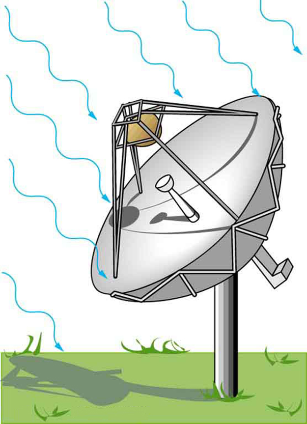

* Explain how the energy and amplitude of an electromagnetic wave are related.
* Given its power output and the heating area, calculate the intensity of a microwave oven’s electromagnetic field, as well as its peak electric and magnetic field strengths

Anyone who has used a microwave oven knows there is energy in **electromagnetic waves**{: data-type="term" #import-auto-id1169737981077}. Sometimes this energy is obvious, such as in the warmth of the summer sun. Other times it is subtle, such as the unfelt energy of gamma rays, which can destroy living cells.

Electromagnetic waves can bring energy into a system by virtue of their **electric and magnetic fields**{: data-type="term" #import-auto-id1169737796632}. These fields can exert forces and move charges in the system and, thus, do work on them. If the frequency of the electromagnetic wave is the same as the natural frequencies of the system (such as microwaves at the resonant frequency of water molecules), the transfer of energy is much more efficient.

Connections: Waves and Particles

The behavior of electromagnetic radiation clearly exhibits wave characteristics. But we shall find in later modules that at high frequencies, electromagnetic radiation also exhibits particle characteristics. These particle characteristics will be used to explain more of the properties of the electromagnetic spectrum and to introduce the formal study of modern physics.

Another startling discovery of modern physics is that particles, such as electrons and protons, exhibit wave characteristics. This simultaneous sharing of wave and particle properties for all submicroscopic entities is one of the great symmetries in nature.

 ![The propagation of two electromagnetic waves is shown in three dimensional planes. The first wave shows with the variation of two components E and B. E is a sine wave in one plane with small arrows showing the vibrations of particles in the plane. B is a sine wave in a plane perpendicular to the E wave. The B wave has arrows to show the vibrations of particles in the plane. The waves are shown intersecting each other at the junction of the planes because E and B are perpendicular to each other. The direction of propagation of wave is shown perpendicular to E and B waves. The energy carried is given as E sub u. The second wave shows with the variation of the components two E and two B, that is, E and B waves with double the amplitude of the first case. Two E is a sine wave in one plane with small arrows showing the vibrations of particles in the plane. Two B is a sine wave in a plane perpendicular to the two E wave. The two B wave has arrows to show the vibrations of particles in the plane. The waves are shown intersecting each other at the junction of the planes because two E and two B waves are perpendicular to each other. The direction of propagation of wave is shown perpendicular to two E and two B waves. The energy carried is given as four E sub u.](../resources/Figure 25_04_01a.jpg "Energy carried by a wave is proportional to its amplitude squared. With electromagnetic waves, larger E size 12{E} {}-fields and B size 12{B} {}-fields exert larger forces and can do more work."){: #import-auto-id1169737999600 data-media-type="image/jpg"}

But there is energy in an electromagnetic wave, whether it is absorbed or not. Once created, the fields carry energy away from a source. If absorbed, the field strengths are diminished and anything left travels on. Clearly, the larger the strength of the electric and magnetic fields, the more work they can do and the greater the energy the electromagnetic wave carries.

A wave’s energy is proportional to its **amplitude**{: data-type="term" #import-auto-id1169738257229} squared (<math xmlns="http://www.w3.org/1998/Math/MathML"><semantics><mrow><mrow><msup><mi>E</mi><mrow><mn>2</mn></mrow></msup></mrow><mrow /></mrow><annotation encoding="StarMath 5.0"> size 12{E rSup { size 8{2} } } {}</annotation></semantics></math>

 or <math xmlns="http://www.w3.org/1998/Math/MathML"><semantics><mrow><mrow><msup><mi>B</mi><mrow><mn>2</mn></mrow></msup></mrow><mrow /></mrow><annotation encoding="StarMath 5.0"> size 12{B rSup { size 8{2} } } {}</annotation></semantics></math>

). This is true for waves on guitar strings, for water waves, and for sound waves, where amplitude is proportional to pressure. In electromagnetic waves, the amplitude is the **maximum field strength**{: data-type="term" #import-auto-id1169738045300} of the electric and magnetic fields. (See [\[link\]](#import-auto-id1169737999600).)

Thus the energy carried and the **intensity**{: data-type="term" #import-auto-id1169738037095} <math xmlns="http://www.w3.org/1998/Math/MathML"><semantics><mrow><mrow><mi>I</mi></mrow><mrow /></mrow><annotation encoding="StarMath 5.0"> size 12{I} {}</annotation></semantics></math>

 of an electromagnetic wave is proportional to <math xmlns="http://www.w3.org/1998/Math/MathML"><semantics><mrow><mrow><msup><mi>E</mi><mrow><mn>2</mn></mrow></msup></mrow><mrow /></mrow><annotation encoding="StarMath 5.0"> size 12{E rSup { size 8{2} } } {}</annotation></semantics></math>

 and <math xmlns="http://www.w3.org/1998/Math/MathML"><semantics><mrow><mrow><msup><mi>B</mi><mrow><mn>2</mn></mrow></msup></mrow><mrow /></mrow><annotation encoding="StarMath 5.0"> size 12{B rSup { size 8{2} } } {}</annotation></semantics></math>

. In fact, for a continuous sinusoidal electromagnetic wave, the average intensity <math xmlns="http://www.w3.org/1998/Math/MathML"><semantics><mrow><mrow><msub><mi>I</mi><mrow><mtext>ave</mtext></mrow></msub></mrow><mrow /></mrow><annotation encoding="StarMath 5.0"> size 12{I rSub { size 8{"ave"} } } {}</annotation></semantics></math>

 is given by

<math xmlns="http://www.w3.org/1998/Math/MathML"><semantics><mrow><mrow><mrow><msub><mi>I</mi><mrow><mtext>ave</mtext></mrow></msub><mo stretchy="false">=</mo><mfrac><mrow><msub><mi fontstyle="italic">cε</mi><mrow><mn>0</mn></mrow></msub><msubsup><mi>E</mi><mrow><mn>0</mn></mrow><mrow><mn>2</mn></mrow></msubsup></mrow><mn>2</mn></mfrac><mo>,</mo></mrow></mrow><mrow /></mrow><annotation encoding="StarMath 5.0"> size 12{I rSub { size 8{"ave"} } = { {ce rSub { size 8{0} } E rSub { size 8{0} } rSup { size 8{2} } } over {2} } } {}</annotation></semantics></math>

where <math xmlns="http://www.w3.org/1998/Math/MathML"><semantics><mrow><mrow><mi>c</mi></mrow><mrow /></mrow><annotation encoding="StarMath 5.0"> size 12{c} {}</annotation></semantics></math>

 is the speed of light, <math xmlns="http://www.w3.org/1998/Math/MathML"><semantics><mrow><mrow><msub><mi>ε</mi><mrow><mn>0</mn></mrow></msub></mrow><mrow /></mrow><annotation encoding="StarMath 5.0"> size 12{ε rSub { size 8{0} } } {}</annotation></semantics></math>

 is the permittivity of free space, and <math xmlns="http://www.w3.org/1998/Math/MathML"><semantics><mrow><mrow><msub><mi>E</mi><mrow><mn>0</mn></mrow></msub></mrow><mrow /></mrow><annotation encoding="StarMath 5.0"> size 12{E rSub { size 8{0} } } {}</annotation></semantics></math>

 is the maximum electric field strength; intensity, as always, is power per unit area (here in <math xmlns="http://www.w3.org/1998/Math/MathML"><semantics><mrow><mrow><msup><mtext>W/m</mtext><mrow><mn>2</mn></mrow></msup></mrow><mrow /></mrow><annotation encoding="StarMath 5.0"> size 12{"W/m" rSup { size 8{2} } } {}</annotation></semantics></math>

).

The average intensity of an electromagnetic wave <math xmlns="http://www.w3.org/1998/Math/MathML"><semantics><mrow><mrow><msub><mi>I</mi><mrow><mtext>ave</mtext></mrow></msub></mrow><mrow /></mrow><annotation encoding="StarMath 5.0"> size 12{I rSub { size 8{"ave"} } } {}</annotation></semantics></math>

 can also be expressed in terms of the magnetic field strength by using the relationship <math xmlns="http://www.w3.org/1998/Math/MathML"><semantics><mrow><mrow><mrow><mi>B</mi><mo stretchy="false">=</mo><mrow><mi>E</mi><mo stretchy="false">/</mo><mi>c</mi></mrow></mrow></mrow><mrow /></mrow><annotation encoding="StarMath 5.0"> size 12{B= {E} slash {c} } {}</annotation></semantics></math>

, and the fact that <math xmlns="http://www.w3.org/1998/Math/MathML"><semantics><mrow><mrow><mrow><mrow><msub><mi>ε</mi><mrow><mn>0</mn></mrow></msub><mo stretchy="false">=</mo><mrow><mn>1</mn><mo stretchy="false">/</mo><msub><mi>μ</mi><mrow><mn>0</mn></mrow></msub></mrow></mrow><msup><mi>c</mi><mrow><mn>2</mn></mrow></msup></mrow></mrow><mrow /></mrow><annotation encoding="StarMath 5.0"> size 12{ε rSub { size 8{0} } = {1} slash {μ rSub { size 8{0} } } c rSup { size 8{2} } } {}</annotation></semantics></math>

, where <math xmlns="http://www.w3.org/1998/Math/MathML"><semantics><mrow><mrow><msub><mi>μ</mi><mrow><mn>0</mn></mrow></msub></mrow><mrow /></mrow><annotation encoding="StarMath 5.0"> size 12{μ rSub { size 8{0} } } {}</annotation></semantics></math>

 is the permeability of free space. Algebraic manipulation produces the relationship

<math xmlns="http://www.w3.org/1998/Math/MathML"><semantics><mrow><mrow><mrow><msub><mi>I</mi><mrow><mtext>ave</mtext></mrow></msub><mo stretchy="false">=</mo><mfrac><mrow><msubsup><mstyle fontstyle="italic"><mtext>cB</mtext></mstyle><mrow><mn>0</mn></mrow><mrow><mn>2</mn></mrow></msubsup></mrow><msub><mn>2μ</mn><mrow><mn>0</mn></mrow></msub></mfrac><mo>,</mo></mrow></mrow><mrow /></mrow><annotation encoding="StarMath 5.0"> size 12{I rSub { size 8{"ave"} } = { { ital "cB" rSub { size 8{0} } rSup { size 8{2} } } over {2μ rSub { size 8{0} } } } } {}</annotation></semantics></math>

where <math xmlns="http://www.w3.org/1998/Math/MathML"><semantics><mrow><mrow><msub><mi>B</mi><mrow><mn>0</mn></mrow></msub></mrow><mrow /></mrow><annotation encoding="StarMath 5.0"> size 12{B rSub { size 8{0} } } {}</annotation></semantics></math>

 is the maximum magnetic field strength.

One more expression for <math xmlns="http://www.w3.org/1998/Math/MathML"><semantics><mrow><mrow><msub><mi>I</mi><mrow><mtext>ave</mtext></mrow></msub></mrow><mrow /></mrow><annotation encoding="StarMath 5.0"> size 12{I rSub { size 8{"ave"} } } {}</annotation></semantics></math>

 in terms of both electric and magnetic field strengths is useful. Substituting the fact that <math xmlns="http://www.w3.org/1998/Math/MathML"><semantics><mrow><mrow><mrow><mrow><mi>c</mi><mo stretchy="false">⋅</mo><msub><mi>B</mi><mrow><mn>0</mn></mrow></msub></mrow><mo stretchy="false">=</mo><msub><mi>E</mi><mrow><mn>0</mn></mrow></msub></mrow></mrow><mrow /></mrow><annotation encoding="StarMath 5.0"> size 12{c cdot B rSub { size 8{0} } =E rSub { size 8{0} } } {}</annotation></semantics></math>

, the previous expression becomes

<math xmlns="http://www.w3.org/1998/Math/MathML"><semantics><mrow><mrow><mrow><msub><mi>I</mi><mrow><mtext>ave</mtext></mrow></msub><mo stretchy="false">=</mo><mfrac><mrow><msub><mi>E</mi><mrow><mn>0</mn></mrow></msub><msub><mi>B</mi><mrow><mn>0</mn></mrow></msub></mrow><msub><mn>2μ</mn><mrow><mn>0</mn></mrow></msub></mfrac><mo>.</mo></mrow></mrow><mrow /></mrow><annotation encoding="StarMath 5.0"> size 12{I rSub { size 8{"ave"} } = { {E rSub { size 8{0} } B rSub { size 8{0} } } over {2μ rSub { size 8{0} } } } } {}</annotation></semantics></math>

Whichever of the three preceding equations is most convenient can be used, since they are really just different versions of the same principle: Energy in a wave is related to amplitude squared. Furthermore, since these equations are based on the assumption that the electromagnetic waves are sinusoidal, peak intensity is twice the average; that is, <math xmlns="http://www.w3.org/1998/Math/MathML"><semantics><mrow><mrow><mrow><msub><mi>I</mi><mrow><mn>0</mn></mrow></msub><mo stretchy="false">=</mo><mn>2</mn><msub><mi>I</mi><mrow><mtext>ave</mtext></mrow></msub></mrow></mrow><mrow /></mrow><annotation encoding="StarMath 5.0"> size 12{I rSub { size 8{0} } =2I rSub { size 8{"ave"} } } {}</annotation></semantics></math>

.

Calculate Microwave Intensities and Fields

On its highest power setting, a certain microwave oven projects 1.00 kW of microwaves onto a 30.0 by 40.0 cm area. (a) What is the intensity in <math xmlns="http://www.w3.org/1998/Math/MathML"><semantics><mrow><mrow><msup><mtext>W/m</mtext><mrow><mn>2</mn></mrow></msup></mrow><mrow /></mrow><annotation encoding="StarMath 5.0"> size 12{"W/m" rSup { size 8{2} } } {}</annotation></semantics></math>

? (b) Calculate the peak electric field strength <math xmlns="http://www.w3.org/1998/Math/MathML"><semantics><mrow><mrow><msub><mi>E</mi><mrow><mn>0</mn></mrow></msub></mrow><mrow /></mrow><annotation encoding="StarMath 5.0"> size 12{E rSub { size 8{0} } } {}</annotation></semantics></math>

 in these waves. (c) What is the peak magnetic field strength <math xmlns="http://www.w3.org/1998/Math/MathML"><semantics><mrow><mrow><msub><mi>B</mi><mrow><mn>0</mn></mrow></msub></mrow><mrow /></mrow><annotation encoding="StarMath 5.0"> size 12{B rSub { size 8{0} } } {}</annotation></semantics></math>

?

**Strategy**

In part (a), we can find intensity from its definition as power per unit area. Once the intensity is known, we can use the equations below to find the field strengths asked for in parts (b) and (c).

**Solution for (a)**

Entering the given power into the definition of intensity, and noting the area is 0.300 by 0.400 m, yields

<math xmlns="http://www.w3.org/1998/Math/MathML"><semantics><mrow><mrow><mrow><mrow><mi>I</mi><mo stretchy="false">=</mo><mfrac><mi>P</mi><mi>A</mi></mfrac></mrow><mo stretchy="false">=</mo><mfrac><mrow><mn>1</mn><mtext>.</mtext><mtext>00 kW</mtext></mrow><mrow><mn>0</mn><mtext>.</mtext><mtext>300 m</mtext><mspace width="0.25em" /><mo>×</mo><mspace width="0.25em" /><mn>0</mn><mtext>.</mtext><mtext>400 m</mtext></mrow></mfrac><mo>.</mo></mrow></mrow><mrow /></mrow><annotation encoding="StarMath 5.0"> size 12{I= { {P} over {A} } = { {1 "." "00"" kW"} over {0 "." "300 m"×0 "." "400 m"} } } {}</annotation></semantics></math>

Here <math xmlns="http://www.w3.org/1998/Math/MathML"><semantics><mrow><mrow><mrow><mi>I</mi><mo stretchy="false">=</mo><msub><mi>I</mi><mrow><mtext>ave</mtext></mrow></msub></mrow></mrow><mrow /></mrow><annotation encoding="StarMath 5.0"> size 12{I=I rSub { size 8{"ave"} } } {}</annotation></semantics></math>

, so that

<math xmlns="http://www.w3.org/1998/Math/MathML"><semantics><mrow><mrow><mrow><mrow><mrow><msub><mi>I</mi><mrow><mtext>ave</mtext></mrow></msub><mo stretchy="false">=</mo><mfrac><mrow><mtext>1000 W</mtext></mrow><mrow><mn>0</mn><mtext>.</mtext><mtext>120</mtext><mspace width="0.25em" /><msup><mtext> m</mtext><mrow><mn>2</mn></mrow></msup></mrow></mfrac></mrow><mo stretchy="false">=</mo><mn>8</mn></mrow><mtext>.</mtext><mtext>33</mtext><mo>×</mo><msup><mtext>10</mtext><mrow><mn>3</mn></mrow></msup><mspace width="0.25em" /><msup><mtext> W/m</mtext><mrow><mn>2</mn></mrow></msup></mrow></mrow><mrow /><mo>.</mo></mrow><annotation encoding="StarMath 5.0"> size 12{I rSub { size 8{"ave"} } = { {"1000"" W"} over {0 "." "120"" m" rSup { size 8{2} } } } =8 "." "33"×"10" rSup { size 8{3} } " W/m" rSup { size 8{2} } } {}</annotation></semantics></math>

Note that the peak intensity is twice the average:

<math xmlns="http://www.w3.org/1998/Math/MathML"><semantics><mrow><mrow><mrow><mrow><mrow><msub><mi>I</mi><mrow><mn>0</mn></mrow></msub><mo stretchy="false">=</mo><mn>2</mn><msub><mi>I</mi><mrow><mtext>ave</mtext></mrow></msub></mrow><mo stretchy="false">=</mo><mn>1</mn></mrow><mtext>.</mtext><mrow><mtext>67</mtext><mo stretchy="false">×</mo><msup><mtext>10</mtext><mrow><mn>4</mn></mrow></msup></mrow><mspace width="0.25em" /><mrow><mtext>W</mtext><mo stretchy="false">/</mo><msup><mtext>m</mtext><mrow><mn>2</mn></mrow></msup></mrow></mrow></mrow><mrow /><mo>.</mo></mrow><annotation encoding="StarMath 5.0"> size 12{I rSub { size 8{0} } =2I rSub { size 8{"ave"} } =1 "." "67" times "10" rSup { size 8{4} } {W} slash {m rSup { size 8{2} } } } {}</annotation></semantics></math>

**Solution for (b)**

To find <math xmlns="http://www.w3.org/1998/Math/MathML"><semantics><mrow><mrow><msub><mi>E</mi><mrow><mn>0</mn></mrow></msub></mrow><mrow /></mrow><annotation encoding="StarMath 5.0"> size 12{E rSub { size 8{0} } } {}</annotation></semantics></math>

, we can rearrange the first equation given above for <math xmlns="http://www.w3.org/1998/Math/MathML"><semantics><mrow><mrow><msub><mi>I</mi><mrow><mtext>ave</mtext></mrow></msub></mrow><mrow /></mrow><annotation encoding="StarMath 5.0"> size 12{I rSub { size 8{"ave"} } } {}</annotation></semantics></math>

 to give

<math xmlns="http://www.w3.org/1998/Math/MathML"><semantics><mrow><mrow><mrow><msub><mi>E</mi><mrow><mn>0</mn></mrow></msub><mo stretchy="false">=</mo><msup><mfenced open="(" close=")"><mfrac><mrow><mn>2</mn><msub><mi>I</mi><mrow><mtext>ave</mtext></mrow></msub></mrow><msub><mi fontstyle="italic">cε</mi><mrow><mn>0</mn></mrow></msub></mfrac></mfenced><mrow><mrow /><mn>1/2</mn></mrow></msup></mrow></mrow><mrow /><mo>.</mo></mrow><annotation encoding="StarMath 5.0"> size 12{E rSub { size 8{0} } = left ( { {2I rSub { size 8{"ave"} } } over {ce rSub { size 8{0} } } } right ) rSup { size 8{ {1}wideslash {2} } } } {}</annotation></semantics></math>

Entering known values gives

<math xmlns="http://www.w3.org/1998/Math/MathML"> <semantics> <mrow> <mrow> <mtable columnalign="left"> <mtr><mtd> <msub> <mi>E</mi> <mrow> <mn>0</mn> </mrow> </msub></mtd> <mtd> <mo stretchy="false">=</mo></mtd> <mtd> <mrow> <mrow> <mrow> <msqrt> <mfrac> <mrow> <mn>2</mn> <mo stretchy="false">(</mo> <mn>8</mn> <mtext>.</mtext> <mtext>33</mtext> <mo>×</mo> <msup> <mtext>10</mtext> <mrow> <mn>3</mn> </mrow> </msup> <mspace width="0.25em" /> <msup> <mtext> W/m</mtext> <mrow> <mn>2</mn> </mrow> </msup> <mo stretchy="false">)</mo> </mrow> <mrow> <mo stretchy="false">(</mo> <mn>3</mn> <mtext>.</mtext> <mtext>00</mtext> <mo>×</mo> <msup> <mtext>10</mtext> <mrow> <mn>8</mn> </mrow> </msup> <mspace width="0.25em" /> <mtext> m/s</mtext> <mo stretchy="false">)</mo> <mo stretchy="false">(</mo> <mn>8.85</mn> <mo>×</mo> <msup> <mtext>10</mtext> <mrow> <mrow> <mo stretchy="false">–</mo> <mn>12</mn> </mrow> </mrow> </msup> <mrow><mspace width="0.25em" /> <mrow> <msup> <mtext>C</mtext> <mrow> <mn>2</mn> </mrow> </msup> <mo stretchy="false">/</mo> <mtext>N</mtext> </mrow> <mo stretchy="false">⋅</mo> <msup> <mtext>m</mtext> <mrow> <mn>2</mn> </mrow> </msup> </mrow> <mo stretchy="false">)</mo> </mrow> </mfrac> </msqrt> </mrow> </mrow> </mrow></mtd> </mtr> <mtr><mtd /> <mtd><mo>=</mo></mtd> <mtd> <mrow> <mn>2.51</mn> <mo>×</mo> <msup> <mtext>10</mtext> <mrow> <mn>3</mn> </mrow> </msup> <mspace width="0.25em" /> <mtext> V/m</mtext> <mtext>.</mtext> <mrow /> </mrow></mtd> </mtr> </mtable> <mrow /> </mrow> </mrow> <annotation encoding="StarMath 5.0">alignl { stack { size 12{E rSub { size 8{0} } = sqrt { { {2 \( 8 "." "33"´"10" rSup { size 8{3} } " W/m" rSup { size 8{2} } \) } over { \( 3 "." "00"´"10" rSup { size 8{8} } " m/s" \) \( 8 "." "85"´"10" rSup { size 8{ +- 2} } C rSup { size 8{2} } /N cdot m rSup { size 8{2} } \) } } } } {} # =2 "." "51"´"10" rSup { size 8{3} } " V/m" "." {} } } {}</annotation> </semantics> </math>

**Solution for (c)**

Perhaps the easiest way to find magnetic field strength, now that the electric field strength is known, is to use the relationship given by

<math xmlns="http://www.w3.org/1998/Math/MathML"><semantics><mrow><mrow><mrow><msub><mi>B</mi><mrow><mn>0</mn></mrow></msub><mo stretchy="false">=</mo><mfrac><msub><mi>E</mi><mrow><mn>0</mn></mrow></msub><mi>c</mi></mfrac><mo>.</mo></mrow></mrow><mrow /></mrow><annotation encoding="StarMath 5.0"> size 12{B rSub { size 8{0} } = { {E rSub { size 8{0} } } over {c} } } {}</annotation></semantics></math>

Entering known values gives

<math xmlns="http://www.w3.org/1998/Math/MathML"> <semantics> <mrow> <mrow> <mtable columnalign="left"> <mtr><mtd> <msub> <mi>B</mi> <mrow> <mn>0</mn> </mrow> </msub></mtd> <mtd> <mo stretchy="false">=</mo></mtd> <mtd> <mrow> <mrow> <mrow> <mfrac> <mrow> <mn>2.51</mn> <mo>×</mo> <msup> <mtext>10</mtext> <mrow> <mn>3</mn> </mrow> </msup><mspace width="0.25em" /> <mtext> V/m</mtext> </mrow> <mrow> <mn>3.0</mn> <mo>×</mo> <msup> <mtext>10</mtext> <mrow> <mn>8</mn> </mrow> </msup><mspace width="0.25em" /> <mtext> m/s</mtext> </mrow> </mfrac> </mrow> </mrow> </mrow></mtd> </mtr> <mtr><mtd /> <mtd><mo>=</mo></mtd> <mtd> <mrow> <mrow /> <mn>8.35</mn> <mo>×</mo> <msup> <mtext>10</mtext> <mrow> <mrow> <mo stretchy="false">−</mo> <mn>6</mn> </mrow> </mrow> </msup><mspace width="0.25em" /> <mtext> T</mtext> <mtext>.</mtext> <mrow /> </mrow></mtd> </mtr> </mtable> <mrow /> </mrow> </mrow> <annotation encoding="StarMath 5.0">alignl { stack { size 12{B rSub { size 8{0} } = { {2 "." "51"´"10" rSup { size 8{3} } " V/m"} over {3 "." 0´"10" rSup { size 8{8} } " m/s"} } } {} # =8 "." "35"´"10" rSup { size 8{-6} } " T" "." {} } } {}</annotation> </semantics> </math>

**Discussion**

As before, a relatively strong electric field is accompanied by a relatively weak magnetic field in an electromagnetic wave, since <math xmlns="http://www.w3.org/1998/Math/MathML"><semantics><mrow><mrow><mrow><mi>B</mi><mo stretchy="false">=</mo><mrow><mi>E</mi><mo stretchy="false">/</mo><mi>c</mi></mrow></mrow></mrow><mrow /></mrow><annotation encoding="StarMath 5.0"> size 12{B= {E} slash {c} } {}</annotation></semantics></math>

, and <math xmlns="http://www.w3.org/1998/Math/MathML"><semantics><mrow><mrow><mi>c</mi></mrow><mrow /></mrow><annotation encoding="StarMath 5.0"> size 12{c} {}</annotation></semantics></math>

 is a large number.

# Section Summary

* {: #import-auto-id1169737923902} The energy carried by any wave is proportional to its amplitude squared. For electromagnetic waves, this means intensity can be expressed as
  

  <math xmlns="http://www.w3.org/1998/Math/MathML"><semantics><mrow><mrow><mrow><msub><mi>I</mi><mrow><mtext>ave</mtext></mrow></msub><mo stretchy="false">=</mo><mfrac><mrow><msub><mi fontstyle="italic">cε</mi><mrow><mn>0</mn></mrow></msub><msubsup><mi>E</mi><mrow><mn>0</mn></mrow><mrow><mn>2</mn></mrow></msubsup></mrow><mn>2</mn></mfrac></mrow></mrow><mrow /><mo>,</mo></mrow><annotation encoding="StarMath 5.0"> size 12{I rSub { size 8{"ave"} } = { {ce rSub { size 8{0} } E rSub { size 8{0} } rSup { size 8{2} } } over {2} } } {}</annotation></semantics></math>
  

  
  where <math xmlns="http://www.w3.org/1998/Math/MathML"><semantics><mrow><mrow><msub><mi>I</mi><mrow><mtext>ave</mtext></mrow></msub></mrow><mrow /></mrow><annotation encoding="StarMath 5.0"> size 12{I rSub { size 8{"ave"} } } {}</annotation></semantics></math>
  
   is the average intensity in <math xmlns="http://www.w3.org/1998/Math/MathML"><semantics><mrow><mrow><msup><mtext>W/m</mtext><mrow><mn>2</mn></mrow></msup></mrow><mrow /></mrow><annotation encoding="StarMath 5.0"> size 12{"W/m" rSup { size 8{2} } } {}</annotation></semantics></math>
  
  , and <math xmlns="http://www.w3.org/1998/Math/MathML"><semantics><mrow><mrow><msub><mi>E</mi><mrow><mn>0</mn></mrow></msub></mrow><mrow /></mrow><annotation encoding="StarMath 5.0"> size 12{E rSub { size 8{0} } } {}</annotation></semantics></math>
  
   is the maximum electric field strength of a continuous sinusoidal wave.

* {: #import-auto-id1169737909839} This can also be expressed in terms of the maximum magnetic field strength
  <math xmlns="http://www.w3.org/1998/Math/MathML"><semantics><mrow><mrow><msub><mi>B</mi><mrow><mn>0</mn></mrow></msub></mrow><mrow /></mrow><annotation encoding="StarMath 5.0"> size 12{B rSub { size 8{0} } } {}</annotation></semantics></math>
  
  as
  

  <math xmlns="http://www.w3.org/1998/Math/MathML"> <semantics> <mrow> <mrow> <mrow> <msub> <mi>I</mi> <mrow> <mtext>ave</mtext> </mrow> </msub> <mo stretchy="false">=</mo> <mfrac> <mrow> <msubsup> <mstyle fontstyle="italic"> <mtext>cB</mtext> </mstyle> <mrow> <mn>0</mn> </mrow> <mrow> <mn>2</mn> </mrow> </msubsup> </mrow> <msub> <mn>2μ</mn> <mrow> <mn>0</mn> </mrow> </msub> </mfrac> </mrow> </mrow> <mrow /> </mrow> <annotation encoding="StarMath 5.0"> size 12{I rSub { size 8{"ave"} } = { { ital "cB" rSub { size 8{0} } rSup { size 8{2} } } over {2m rSub { size 8{0} } } } } {}</annotation> </semantics> </math>
  

  
  and in terms of both electric and magnetic fields as
  
  

  <math xmlns="http://www.w3.org/1998/Math/MathML"><semantics><mrow><mrow><mrow><msub><mi>I</mi><mrow><mtext>ave</mtext></mrow></msub><mo stretchy="false">=</mo><mfrac><mrow><msub><mi>E</mi><mrow><mn>0</mn></mrow></msub><msub><mi>B</mi><mrow><mn>0</mn></mrow></msub></mrow><msub><mn>2μ</mn><mrow><mn>0</mn></mrow></msub></mfrac></mrow></mrow><mrow /><mo>.</mo></mrow><annotation encoding="StarMath 5.0"> size 12{I rSub { size 8{"ave"} } = { {E rSub { size 8{0} } B rSub { size 8{0} } } over {2m rSub { size 8{0} } } } } {}</annotation></semantics></math>
  

* {: #import-auto-id1169737794478} The three expressions for
  <math xmlns="http://www.w3.org/1998/Math/MathML"><semantics><mrow><mrow><msub><mi>I</mi><mrow><mtext>ave</mtext></mrow></msub></mrow><mrow /></mrow><annotation encoding="StarMath 5.0"> size 12{I rSub { size 8{"ave"} } } {}</annotation></semantics></math>
  
  are all equivalent.

# Problems &amp; Exercises

What is the intensity of an electromagnetic wave with a peak electric field strength of 125 V/m?

<math xmlns="http://www.w3.org/1998/Math/MathML"> <semantics> <mrow> <mrow> <mtable columnalign="left"> <mtr><mtd> <mi>I</mi></mtd> <mtd> <mo stretchy="false">=</mo></mtd> <mtd> <mrow> <mrow> <mrow> <mfrac> <mrow> <msub> <mi fontstyle="italic">cε</mi> <mrow> <mn>0</mn> </mrow> </msub> <msubsup> <mi>E</mi> <mrow> <mn>0</mn> </mrow> <mrow> <mn>2</mn> </mrow> </msubsup> </mrow> <mn>2</mn> </mfrac> </mrow> </mrow> <mrow /> </mrow></mtd> </mtr> <mtr> <mtd /> <mtd><mo>=</mo></mtd> <mtd> <mrow> <mfrac> <mrow> <mfenced open="(" close=")"> <mrow> <mn>3.00</mn> <mi>×</mi> <msup> <mtext>10</mtext> <mrow> <mn>8</mn> </mrow> </msup><mspace width="0.25em" /> <mtext> m/s</mtext> </mrow> </mfenced> <mfenced open="(" close=")"> <mrow> <mn>8.85</mn> <mi>×</mi> <msup> <mtext>10</mtext> <mtext>–12</mtext> </msup> <msup> <mtext> C</mtext> <mrow> <mn>2</mn> </mrow> </msup> <mtext>/N</mtext> <mo stretchy="false">⋅</mo> <msup> <mtext>m</mtext> <mn>2</mn> </msup> </mrow> </mfenced> <msup> <mfenced open="(" close=")"> <mrow> <mn>1</mn> <mtext>25 V/m</mtext> </mrow> </mfenced> <mn>2</mn> </msup> </mrow> <mn>2</mn> </mfrac> </mrow></mtd> </mtr> <mtr><mtd /> <mtd><mo>=</mo></mtd> <mtd> <mrow> <mrow> <mn>20.</mn> <msup> <mtext>7 W/m</mtext> <mn>2</mn> </msup> </mrow> </mrow> </mtd> </mtr> </mtable> </mrow> </mrow> </semantics> </math>

Find the intensity of an electromagnetic wave having a peak magnetic field strength of <math xmlns="http://www.w3.org/1998/Math/MathML"><semantics><mrow><mrow><mrow><mn>4</mn><mtext>.</mtext><mtext>00</mtext><mi>×</mi><msup><mtext>10</mtext><mrow><mrow><mo stretchy="false">−</mo><mn>9</mn></mrow></mrow></msup><mspace width="0.25em" /><mtext> T</mtext></mrow></mrow><mrow /></mrow><annotation encoding="StarMath 5.0"> size 12{4 "." "00"´"10" rSup { size 8{-9} } " T"} {}</annotation></semantics></math>

.

Assume the helium-neon lasers commonly used in student physics laboratories have power outputs of 0.250 mW. (a) If such a laser beam is projected onto a circular spot 1.00 mm in diameter, what is its intensity? (b) Find the peak magnetic field strength. (c) Find the peak electric field strength.

(a) <math xmlns="http://www.w3.org/1998/Math/MathML"><semantics><mrow><mrow><mrow><mrow><mrow><mrow><mi>I</mi><mo stretchy="false">=</mo><mfrac><mi>P</mi><mi>A</mi></mfrac></mrow><mo stretchy="false">=</mo><mfrac><mi>P</mi><mrow><mi>π</mi><msup><mi>r</mi><mrow><mn>2</mn></mrow></msup></mrow></mfrac></mrow><mo stretchy="false">=</mo><mfrac><mrow><mn>0</mn><mtext>.</mtext><mtext>250</mtext><mi>×</mi><msup><mtext>10</mtext><mrow><mrow><mo stretchy="false">−</mo><mn>3</mn></mrow></mrow></msup><mspace width="0.25em" /><mtext> W</mtext></mrow><mrow><mi>π</mi><msup><mfenced open="(" close=")"><mrow><mn>0</mn><mtext>.</mtext><mtext>500</mtext><mi>×</mi><msup><mtext>10</mtext><mrow><mrow><mo stretchy="false">−</mo><mn>3</mn></mrow></mrow></msup><mspace width="0.25em" /><mtext> m</mtext></mrow></mfenced><mrow><mn>2</mn></mrow></msup></mrow></mfrac></mrow><mo stretchy="false">=</mo><msup><mtext>318 W/m</mtext><mrow><mn>2</mn></mrow></msup></mrow></mrow><mrow /></mrow><annotation encoding="StarMath 5.0"> size 12{I= { {P} over {A} } = { {P} over {p r rSup { size 8{2} } } } = { {0 "." "250"´"10" rSup { size 8{-3} } " W"} over {∂ left (0 "." "500"´"10" rSup { size 8{-3} } " m" right ) rSup { size 8{2} } } } ="318 W/m" rSup { size 8{2} } } {}</annotation></semantics></math>

(b) <math xmlns="http://www.w3.org/1998/Math/MathML"><semantics><mrow><mrow><mtable columnalign="left"> <mtr><mtd><msub><mi>I</mi><mrow><mtext>ave</mtext></mrow></msub></mtd> <mtd><mo stretchy="false">=</mo></mtd> <mtd><mrow><mrow><mrow><mrow><mfrac><mrow> <msubsup><mstyle fontstyle="italic"><mtext>cB</mtext></mstyle><mn>0</mn><mn>2</mn></msubsup></mrow><msub><mn>2μ</mn><mrow><mn>0</mn></mrow></msub></mfrac></mrow><mo stretchy="false">⇒</mo><mrow><msub><mi>B</mi><mrow><mn>0</mn></mrow></msub><mo stretchy="false">=</mo><msup><mfenced open="(" close=")"><mfrac><mrow><msub><mn>2μ</mn><mrow><mn>0</mn></mrow></msub><mi>I</mi></mrow><mi>c</mi></mfrac></mfenced><mrow><mrow><mn>1</mn><mo stretchy="false">/</mo><mn>2</mn></mrow></mrow></msup></mrow></mrow></mrow><mrow /></mrow></mtd></mtr> <mtr><mtd /> <mtd><mo>=</mo></mtd> <mtd> <mrow><mrow /><msup><mfenced open="(" close=")"><mfrac><mrow><mn>2</mn><mfenced open="(" close=")"><mrow><mn>4</mn><mi>π</mi><mi>×</mi><msup><mtext>10</mtext><mrow><mrow><mo stretchy="false">−</mo><mn>7</mn></mrow></mrow></msup><mrow><mspace width="0.25em" /><mtext> T</mtext><mo stretchy="false">⋅</mo><mtext>m/A</mtext></mrow></mrow></mfenced><mfenced open="(" close=")"><mrow><mtext>318</mtext><mtext>.</mtext><msup><mtext>3 W/m</mtext><mrow><mn>2</mn></mrow></msup></mrow></mfenced></mrow><mrow><mtext>3.00</mtext><mi>×</mi><msup><mtext>10</mtext><mrow><mn>8</mn></mrow></msup><mspace width="0.25em" /><mtext> m/s</mtext></mrow></mfrac></mfenced><mrow><mrow><mn>1</mn><mo stretchy="false">/</mo><mn>2</mn></mrow></mrow></msup></mrow></mtd></mtr> <mtr><mtd /> <mtd><mo>=</mo></mtd> <mtd><mrow><mrow /><mrow><mn>1</mn><mtext>.</mtext><mtext>63</mtext><mi>×</mi><msup><mtext>10</mtext><mrow><mrow><mo stretchy="false">−</mo><mn>6</mn></mrow></mrow></msup><mspace width="0.25em" /><mtext> T</mtext></mrow><mrow /></mrow></mtd></mtr></mtable><mrow /></mrow></mrow><annotation encoding="StarMath 5.0">alignl { stack { size 12{I rSub { size 8{"ave"} } = { { ital "cB" rSub { size 8{0} rSup { size 8{2} } } } over {2m rSub { size 8{0} } } } drarrow B rSub { size 8{0} } = left ( { {2m rSub { size 8{0} } I} over {c} } right ) rSup { size 8{1/2} } } {} # = left [ { {2 left (4¶´"10" rSup { size 8{-7} } " T" cdot "m/A" right ) left ("318" "." "3 W/m" rSup { size 8{2} } right )} over {3 "." "00"´"10" rSup { size 8{8} } " m/s"} } right ] rSup { size 8{ {1} slash {2} } } {} # = {underline {1 "." "63"´"10" rSup { size 8{-6} } " T"}} {} } } {}</annotation></semantics></math>

(c) <math xmlns="http://www.w3.org/1998/Math/MathML"><semantics><mrow><mrow><mtable columnalign="left"><mtr><mtd><msub><mi>E</mi><mrow><mn>0</mn></mrow></msub></mtd> <mtd><mo stretchy="false">=</mo></mtd> <mtd><mrow><mrow><mrow><mrow><mrow> <mrow><msub><mstyle fontstyle="italic"><mtext>cB</mtext></mstyle><mrow><mn>0</mn></mrow></msub></mrow></mrow><mo stretchy="false">=</mo><mfenced open="(" close=")"><mrow><mn>3</mn><mtext>.00</mtext><mi>×</mi><msup><mtext>10</mtext><mrow><mn>8</mn></mrow></msup><mspace width="0.25em" /><mtext> m/s</mtext></mrow></mfenced></mrow><mfenced open="(" close=")"><mrow><mtext>1.633</mtext><mi>×</mi><msup><mtext>10</mtext><mrow><mrow><mo stretchy="false">−</mo><mn>6</mn></mrow></mrow></msup><mspace width="0.25em" /><mtext> T</mtext></mrow></mfenced></mrow></mrow><mrow /></mrow> </mtd></mtr> <mtr><mtd /> <mtd><mo>=</mo></mtd> <mtd> <mrow><mrow /><mrow><mn>4</mn><mtext>.</mtext><mtext>90</mtext><mi>×</mi><msup><mtext>10</mtext><mrow><mn>2</mn></mrow></msup><mspace width="0.25em" /><mtext> V/m</mtext></mrow><mrow /></mrow></mtd> </mtr></mtable><mrow /></mrow></mrow><annotation encoding="StarMath 5.0">alignl { stack { size 12{E rSub { size 8{0} } = ital "cB" rSub { size 8{0} } = left (3 "." "00"´"10" rSup { size 8{8} } " m/s" right ) left (1 "." "633"´"10" rSup { size 8{-6} } " T" right )} {} # = {underline {4 "." "90"´"10" rSup { size 8{2} } " V/m"}} {} } } {}</annotation></semantics></math>

An AM radio transmitter broadcasts 50.0 kW of power uniformly in all directions. (a) Assuming all of the radio waves that strike the ground are completely absorbed, and that there is no absorption by the atmosphere or other objects, what is the intensity 30.0 km away? (Hint: Half the power will be spread over the area of a hemisphere.) (b) What is the maximum electric field strength at this distance?

Suppose the maximum safe intensity of microwaves for human exposure is taken to be <math xmlns="http://www.w3.org/1998/Math/MathML"><semantics><mrow><mrow><mrow><mn>1</mn><mtext>.</mtext><mtext>00 W</mtext><msup><mtext>/m</mtext><mrow><mn>2</mn></mrow></msup></mrow></mrow><mrow /></mrow><annotation encoding="StarMath 5.0"> size 12{1 "." "00""W/m" rSup { size 8{2} } } {}</annotation></semantics></math>

. (a) If a radar unit leaks 10.0 W of microwaves (other than those sent by its antenna) uniformly in all directions, how far away must you be to be exposed to an intensity considered to be safe? Assume that the power spreads uniformly over the area of a sphere with no complications from absorption or reflection. (b) What is the maximum electric field strength at the safe intensity? (Note that early radar units leaked more than modern ones do. This caused identifiable health problems, such as cataracts, for people who worked near them.)

(a) 89.2 cm

(b) 27.4 V/m

A 2.50-m-diameter university communications satellite dish receives TV signals that have a maximum electric field strength (for one channel) of <math xmlns="http://www.w3.org/1998/Math/MathML"><semantics><mrow><mrow><mrow><mn>7</mn><mtext>.</mtext><mtext>50</mtext><mspace width="0.25em" /><mrow><mi fontstyle="italic">μ</mi><mn>V/m</mn></mrow></mrow></mrow><mrow /></mrow><annotation encoding="StarMath 5.0"> size 12{7 "." "50" mV/m} {}</annotation></semantics></math>

. (See [[link]](#import-auto-id1169738077918).) (a) What is the intensity of this wave? (b) What is the power received by the antenna? (c) If the orbiting satellite broadcasts uniformly over an area of <math xmlns="http://www.w3.org/1998/Math/MathML"><semantics><mrow><mrow><mrow><mn>1</mn><mtext>.</mtext><mtext>50</mtext><mi>×</mi><msup><mtext>10</mtext><mrow><mtext>13</mtext></mrow></msup><mspace width="0.25em" /><msup><mtext> m</mtext><mrow><mn>2</mn></mrow></msup></mrow></mrow><mrow /></mrow><annotation encoding="StarMath 5.0"> size 12{1 "." "50"´"10" rSup { size 8{"13"} } " m" rSup { size 8{2} } } {}</annotation></semantics></math>

 (a large fraction of North America), how much power does it radiate?

{: #import-auto-id1169738077918 data-media-type="image/jpg"}

Lasers can be constructed that produce an extremely high intensity electromagnetic wave for a brief time—called pulsed lasers. They are used to ignite nuclear fusion, for example. Such a laser may produce an electromagnetic wave with a maximum electric field strength of <math xmlns="http://www.w3.org/1998/Math/MathML"><semantics><mrow><mrow><mrow><mn>1</mn><mtext>.</mtext><mtext>00</mtext><mi>×</mi><msup><mtext>10</mtext><mrow><mtext>11</mtext></mrow></msup><mspace width="0.25em" /><mrow><mtext> V</mtext><mo stretchy="false">/</mo><mtext>m</mtext></mrow></mrow></mrow><mrow /></mrow><annotation encoding="StarMath 5.0"> size 12{1 "." "00"´"10" rSup { size 8{"11"} } " V"/m} {}</annotation></semantics></math>

 for a time of 1.00 ns. (a) What is the maximum magnetic field strength in the wave? (b) What is the intensity of the beam? (c) What energy does it deliver on a <math xmlns="http://www.w3.org/1998/Math/MathML"><semantics><mrow><mrow><mrow><mn>1</mn><mtext>.</mtext><mtext>00</mtext><msup><mtext>-mm</mtext><mrow><mn>2</mn></mrow></msup></mrow></mrow><mrow /></mrow><annotation encoding="StarMath 5.0"> size 12{1 "." "00""-mm" rSup { size 8{2} } } {}</annotation></semantics></math>

 area?

(a) 333 T

(b) <math xmlns="http://www.w3.org/1998/Math/MathML"><semantics><mrow><mrow><mrow><mn>1</mn><mtext>.</mtext><mtext>33</mtext><mi>×</mi><msup><mtext>10</mtext><mrow><mtext>19</mtext></mrow></msup><mspace width="0.25em" /><msup><mtext>W/m</mtext><mrow><mn>2</mn></mrow></msup></mrow></mrow><mrow /></mrow><annotation encoding="StarMath 5.0"> size 12{1 "." "33"´"10" rSup { size 8{"19"} } "W/m" rSup { size 8{2} } } {}</annotation></semantics></math>

(c) 13.3 kJ

Show that for a continuous sinusoidal electromagnetic wave, the peak intensity is twice the average intensity (<math xmlns="http://www.w3.org/1998/Math/MathML"><semantics><mrow><mrow><mrow><msub><mi>I</mi><mrow><mn>0</mn></mrow></msub><mo stretchy="false">=</mo><msub><mrow><mn>2</mn><mi>I</mi></mrow><mrow><mtext>ave</mtext></mrow></msub></mrow></mrow><mrow /></mrow><annotation encoding="StarMath 5.0"> size 12{I rSub { size 8{0} } =2I rSub { size 8{"ave"} } } {}</annotation></semantics></math>

), using either the fact that <math xmlns="http://www.w3.org/1998/Math/MathML"><semantics><mrow><mrow><mrow><mrow><msub><mi>E</mi><mrow><mn>0</mn></mrow></msub><mo stretchy="false">=</mo><msqrt><mn>2</mn></msqrt></mrow><msub><mi>E</mi><mrow><mtext>rms</mtext></mrow></msub></mrow></mrow><mrow /></mrow><annotation encoding="StarMath 5.0"> size 12{E rSub { size 8{0} } = sqrt {2} E rSub { size 8{"rms"} } } {}</annotation></semantics></math>

, or <math xmlns="http://www.w3.org/1998/Math/MathML"><semantics><mrow><mrow><mrow><mrow><msub><mi>B</mi><mrow><mn>0</mn></mrow></msub><mo stretchy="false">=</mo><msqrt><mn>2</mn></msqrt></mrow><msub><mi>B</mi><mrow><mtext>rms</mtext></mrow></msub></mrow></mrow><mrow /></mrow><annotation encoding="StarMath 5.0"> size 12{B rSub { size 8{0} } = sqrt {2} B rSub { size 8{"rms"} } } {}</annotation></semantics></math>

, where rms means average (actually root mean square, a type of average).

Suppose a source of electromagnetic waves radiates uniformly in all directions in empty space where there are no absorption or interference effects. (a) Show that the intensity is inversely proportional to <math xmlns="http://www.w3.org/1998/Math/MathML"><semantics><mrow><mrow><msup><mi>r</mi><mrow><mn>2</mn></mrow></msup></mrow><mrow /></mrow><annotation encoding="StarMath 5.0"> size 12{r rSup { size 8{2} } } {}</annotation></semantics></math>

, the distance from the source squared. (b) Show that the magnitudes of the electric and magnetic fields are inversely proportional to <math xmlns="http://www.w3.org/1998/Math/MathML"><semantics><mrow><mrow><mi>r</mi></mrow><mrow /></mrow><annotation encoding="StarMath 5.0"> size 12{r} {}</annotation></semantics></math>

.

(a) <math xmlns="http://www.w3.org/1998/Math/MathML"><semantics><mrow><mrow><mrow><mrow><mrow><mi>I</mi><mo stretchy="false">=</mo><mfrac><mi>P</mi><mi>A</mi></mfrac></mrow><mo stretchy="false">=</mo><mfrac><mi>P</mi><mrow><mn>4π</mn><msup><mi>r</mi><mrow><mn>2</mn></mrow></msup></mrow></mfrac></mrow><mo stretchy="false">∝</mo><mfrac><mn>1</mn><msup><mi>r</mi><mrow><mn>2</mn></mrow></msup></mfrac></mrow></mrow><mrow /></mrow><annotation encoding="StarMath 5.0"> size 12{I= { {P} over {A} } = { {P} over {4π r rSup { size 8{2} } } } prop { {1} over {r rSup { size 8{2} } } } } {}</annotation></semantics></math>

(b) <math xmlns="http://www.w3.org/1998/Math/MathML"><semantics><mrow><mrow><mrow><msubsup><mi fontstyle="italic">I∝E</mi><mrow><mn>0</mn></mrow><mrow><mn>2</mn></mrow></msubsup><mtext>, </mtext><mspace width="0.25em" /><msubsup><mi>B</mi><mrow><mn>0</mn></mrow><mrow><mn>2</mn></mrow></msubsup><mo stretchy="false">⇒</mo><msubsup><mi>E</mi><mrow><mn>0</mn></mrow><mrow><mn>2</mn></mrow></msubsup><mtext>, </mtext><mspace width="0.25em" /><msubsup><mi>B</mi><mrow><mn>0</mn></mrow><mrow><mn>2</mn></mrow></msubsup><mi>∝</mi><mfrac><mn>1</mn><msup><mi>r</mi><mrow><mn>2</mn></mrow></msup></mfrac><mo stretchy="false">⇒</mo><msub><mi>E</mi><mrow><mn>0</mn></mrow></msub><mi>,</mi><mspace width="0.25em" /><msub><mi>B</mi><mrow><mn>0</mn></mrow></msub><mi>∝</mi><mfrac><mn>1</mn><mi>r</mi></mfrac></mrow></mrow><mrow /></mrow></semantics></math>

**Integrated Concepts**

An <math xmlns="http://www.w3.org/1998/Math/MathML"><semantics><mrow><mrow><mstyle fontstyle="italic"><mrow><mtext>LC</mtext></mrow></mstyle></mrow><mrow /></mrow><annotation encoding="StarMath 5.0"> size 12{ ital "LC"} {}</annotation></semantics></math>

 circuit with a 5.00-pF capacitor oscillates in such a manner as to radiate at a wavelength of 3.30 m. (a) What is the resonant frequency? (b) What inductance is in series with the capacitor?

**Integrated Concepts**

What capacitance is needed in series with an <math xmlns="http://www.w3.org/1998/Math/MathML"><semantics><mrow><mrow><mrow><mtext>800</mtext><mo stretchy="false">−</mo><mi fontstyle="italic">μ</mi><mtext>H</mtext></mrow></mrow><mrow /></mrow><annotation encoding="StarMath 5.0"> size 12{"800"-mH} {}</annotation></semantics></math>

 inductor to form a circuit that radiates a wavelength of 196 m?

13\.5 pF

**Integrated Concepts**

Police radar determines the speed of motor vehicles using the same Doppler-shift technique employed for ultrasound in medical diagnostics. Beats are produced by mixing the double Doppler-shifted echo with the original frequency. If <math xmlns="http://www.w3.org/1998/Math/MathML"><semantics><mrow><mrow><mrow><mn>1</mn><mtext>.</mtext><mtext>50</mtext><mi>×</mi><msup><mtext>10</mtext><mrow><mn>9</mn></mrow></msup><mtext>-Hz</mtext></mrow></mrow><mrow /></mrow><annotation encoding="StarMath 5.0"> size 12{1 "." "50"´"10" rSup { size 8{9} } "-Hz"} {}</annotation></semantics></math>

 microwaves are used and a beat frequency of 150 Hz is produced, what is the speed of the vehicle? (Assume the same Doppler-shift formulas are valid with the speed of sound replaced by the speed of light.)

**Integrated Concepts**

Assume the mostly infrared radiation from a heat lamp acts like a continuous wave with wavelength <math xmlns="http://www.w3.org/1998/Math/MathML"><semantics><mrow><mrow><mrow><mn>1.50</mn><mspace width="0.25em" /><mi fontstyle="italic">μ</mi><mtext>m</mtext></mrow></mrow><mrow /></mrow></semantics></math>

. (a) If the lamp’s 200-W output is focused on a person’s shoulder, over a circular area 25.0 cm in diameter, what is the intensity in <math xmlns="http://www.w3.org/1998/Math/MathML"><semantics><mrow><mrow><msup><mtext>W/m</mtext><mrow><mn>2</mn></mrow></msup></mrow><mrow /></mrow><annotation encoding="StarMath 5.0"> size 12{"W/m" rSup { size 8{2} } } {}</annotation></semantics></math>

? (b) What is the peak electric field strength? (c) Find the peak magnetic field strength. (d) How long will it take to increase the temperature of the 4.00-kg shoulder by <math xmlns="http://www.w3.org/1998/Math/MathML"><semantics><mrow><mrow><mrow><mn>2.00º C</mn></mrow></mrow><mrow /></mrow></semantics></math>

, assuming no other heat transfer and given that its specific heat is <math xmlns="http://www.w3.org/1998/Math/MathML"><semantics><mrow><mrow><mrow><mn>3</mn><mtext>.</mtext><mtext>47</mtext><mi>×</mi><msup><mtext>10</mtext><mrow><mn>3</mn></mrow></msup><mrow><mspace width="0.25em" /><mtext> J/kg</mtext><mo stretchy="false">⋅</mo></mrow><mtext>ºC</mtext></mrow></mrow><mrow /></mrow></semantics></math>

?

(a) <math xmlns="http://www.w3.org/1998/Math/MathML"><semantics><mrow><mrow><mrow><mn>4</mn><mtext>.</mtext><mtext>07 k</mtext><msup><mtext>W/m</mtext><mrow><mn>2</mn></mrow></msup></mrow></mrow><mrow /></mrow><annotation encoding="StarMath 5.0"> size 12{4 "." "07""kW/m" rSup { size 8{2} } } {}</annotation></semantics></math>

(b) 1.75 kV/m

(c) <math xmlns="http://www.w3.org/1998/Math/MathML"><semantics><mrow><mrow><mrow><mn>5</mn><mtext>.</mtext><mtext>84</mtext><mspace width="0.25em" /><mi fontstyle="italic">μ</mi><mtext>T</mtext></mrow></mrow><mrow /></mrow><annotation encoding="StarMath 5.0"> size 12{5 "." "84" mT} {}</annotation></semantics></math>

(d) 2 min 19 s

**Integrated Concepts**

On its highest power setting, a microwave oven increases the temperature of 0.400 kg of spaghetti by <math xmlns="http://www.w3.org/1998/Math/MathML"><semantics><mrow><mrow><mrow><mtext>45</mtext><mtext>.</mtext><mn>0º</mn><mtext>C</mtext></mrow></mrow><mrow /></mrow><annotation encoding="StarMath 5.0"> size 12{"45" "." 0°C} {}</annotation></semantics></math>

 in 120 s. (a) What was the rate of power absorption by the spaghetti, given that its specific heat is <math xmlns="http://www.w3.org/1998/Math/MathML"><semantics><mrow><mrow><mrow><mn>3</mn><mtext>.</mtext><mtext>76</mtext><mi>×</mi><msup><mtext>10</mtext><mrow><mn>3</mn></mrow></msup><mrow><mspace width="0.25em" /><mtext> J/kg</mtext><mo stretchy="false">⋅</mo></mrow><mtext>ºC</mtext></mrow></mrow><mrow /></mrow></semantics></math>

? (b) Find the average intensity of the microwaves, given that they are absorbed over a circular area 20.0 cm in diameter. (c) What is the peak electric field strength of the microwave? (d) What is its peak magnetic field strength?

**Integrated Concepts**

Electromagnetic radiation from a 5.00-mW laser is concentrated on a <math xmlns="http://www.w3.org/1998/Math/MathML"><semantics><mrow><mrow><mrow><mn>1</mn><mtext>.</mtext><mtext>00</mtext><msup><mtext>-mm</mtext><mrow><mn>2</mn></mrow></msup></mrow></mrow><mrow /></mrow><annotation encoding="StarMath 5.0"> size 12{1 "." "00""-mm" rSup { size 8{2} } } {}</annotation></semantics></math>

 area. (a) What is the intensity in <math xmlns="http://www.w3.org/1998/Math/MathML"><semantics><mrow><mrow><msup><mtext>W/m</mtext><mrow><mn>2</mn></mrow></msup></mrow><mrow /></mrow><annotation encoding="StarMath 5.0"> size 12{"W/m" rSup { size 8{2} } } {}</annotation></semantics></math>

? (b) Suppose a 2.00-nC static charge is in the beam. What is the maximum electric force it experiences? (c) If the static charge moves at 400 m/s, what maximum magnetic force can it feel?

(a) <math xmlns="http://www.w3.org/1998/Math/MathML"><semantics><mrow><mrow><mrow><mn>5</mn><mtext>.</mtext><mtext>00</mtext><mi>×</mi><msup><mtext>10</mtext><mrow><mn>3</mn></mrow></msup><mspace width="0.25em" /><msup><mtext> W/m</mtext><mrow><mn>2</mn></mrow></msup></mrow></mrow><mrow /></mrow><annotation encoding="StarMath 5.0"> size 12{5 "." "00"´"10" rSup { size 8{3} } " W/m" rSup { size 8{2} } } {}</annotation></semantics></math>

(b) <math xmlns="http://www.w3.org/1998/Math/MathML"><semantics><mrow><mrow><mrow><mn>3</mn><mtext>.</mtext><mrow><mtext>88</mtext><mo stretchy="false">×</mo><msup><mtext>10</mtext><mrow><mrow><mo stretchy="false">−</mo><mn>6</mn></mrow></mrow></msup><mspace width="0.25em" /></mrow><mtext> N</mtext></mrow></mrow><mrow /></mrow><annotation encoding="StarMath 5.0"> size 12{3 "." "88" times "10" rSup { size 8{ - 6} } " N"} {}</annotation></semantics></math>

(c) <math xmlns="http://www.w3.org/1998/Math/MathML"><semantics><mrow><mrow><mrow><mn>5</mn><mtext>.</mtext><mrow><mtext>18</mtext><mo stretchy="false">×</mo><msup><mtext>10</mtext><mrow><mrow><mo stretchy="false">−</mo><mtext>12</mtext></mrow></mrow></msup><mspace width="0.25em" /></mrow><mtext> N</mtext></mrow></mrow><mrow /></mrow><annotation encoding="StarMath 5.0"> size 12{ {underline {5 "." "18" times "10" rSup { size 8{ - "12"} } " N"}} } {}</annotation></semantics></math>

**Integrated Concepts**

A 200-turn flat coil of wire 30.0 cm in diameter acts as an antenna for FM radio at a frequency of 100 MHz. The magnetic field of the incoming electromagnetic wave is perpendicular to the coil and has a maximum strength of <math xmlns="http://www.w3.org/1998/Math/MathML"><semantics><mrow><mrow><mrow><mn>1</mn><mtext>.</mtext><mtext>00</mtext><mi>×</mi><msup><mtext>10</mtext><mrow><mrow><mo stretchy="false">−</mo><mtext>12</mtext></mrow></mrow></msup><mspace width="0.25em" /><mtext> T</mtext></mrow></mrow><mrow /></mrow><annotation encoding="StarMath 5.0"> size 12{1 "." "00"×"10" rSup { size 8{-"12"} } " T"} {}</annotation></semantics></math>

. (a) What power is incident on the coil? (b) What average emf is induced in the coil over one-fourth of a cycle? (c) If the radio receiver has an inductance of <math xmlns="http://www.w3.org/1998/Math/MathML"><semantics><mrow><mrow><mrow><mn>2</mn><mtext>.</mtext><mtext>50</mtext><mspace width="0.25em" /><mi fontstyle="italic">μ</mi><mn>H</mn></mrow></mrow><mrow /></mrow><annotation encoding="StarMath 5.0"> size 12{2 "." "50" mH} {}</annotation></semantics></math>

, what capacitance must it have to resonate at 100 MHz?

**Integrated Concepts**

If electric and magnetic field strengths vary sinusoidally in time, being zero at <math xmlns="http://www.w3.org/1998/Math/MathML"><semantics><mrow><mrow><mrow><mi>t</mi><mo stretchy="false">=</mo><mn>0</mn></mrow></mrow><mrow /></mrow><annotation encoding="StarMath 5.0"> size 12{t=0} {}</annotation></semantics></math>

, then <math xmlns="http://www.w3.org/1998/Math/MathML"><semantics><mrow><mrow><mrow><mrow><mi>E</mi><mo stretchy="false">=</mo><msub><mi>E</mi><mrow><mn>0</mn></mrow></msub></mrow><mspace width="0.25em" /><mtext>sin</mtext><mspace width="0.25em" /><mn>2π</mn><mstyle fontstyle="italic"><mrow><mtext>ft</mtext></mrow></mstyle></mrow></mrow><mrow /></mrow><annotation encoding="StarMath 5.0"> size 12{E=E rSub { size 8{0} } "sin"2π ital "ft"} {}</annotation></semantics></math>

 and <math xmlns="http://www.w3.org/1998/Math/MathML"><semantics><mrow><mrow><mrow><mrow><mi>B</mi><mo stretchy="false">=</mo><msub><mi>B</mi><mrow><mn>0</mn></mrow></msub></mrow><mspace width="0.25em" /><mtext>sin</mtext><mspace width="0.25em" /><mn>2π</mn><mstyle fontstyle="italic"><mrow><mtext>ft</mtext></mrow></mstyle></mrow></mrow><mrow /></mrow><annotation encoding="StarMath 5.0"> size 12{B=B rSub { size 8{0} } "sin"2p ital "ft"} {}</annotation></semantics></math>

. Let <math xmlns="http://www.w3.org/1998/Math/MathML"><semantics><mrow><mrow><mrow><mrow><mi>f</mi><mo stretchy="false">=</mo><mn>1</mn></mrow><mtext>.</mtext><mtext>00 GHz</mtext></mrow></mrow><mrow /></mrow><annotation encoding="StarMath 5.0"> size 12{f=1 "." "00"" GHz"} {}</annotation></semantics></math>

 here. (a) When are the field strengths first zero? (b) When do they reach their most negative value? (c) How much time is needed for them to complete one cycle?

(a) <math xmlns="http://www.w3.org/1998/Math/MathML"><semantics><mrow><mrow><mrow><mi>t</mi><mo stretchy="false">=</mo><mn>0</mn></mrow></mrow><mrow /></mrow><annotation encoding="StarMath 5.0"> size 12{t=0} {}</annotation></semantics></math>

(b) <math xmlns="http://www.w3.org/1998/Math/MathML"><semantics><mrow><mrow><mrow><mn>7</mn><mtext>.</mtext><mrow><mtext>50</mtext><mo stretchy="false">×</mo><msup><mtext>10</mtext><mrow><mrow><mo stretchy="false">−</mo><mtext>10</mtext></mrow></mrow></msup></mrow><mspace width="0.25em" /><mtext> s</mtext></mrow></mrow><mrow /></mrow><annotation encoding="StarMath 5.0"> size 12{7 "." "50" times "10" rSup { size 8{ - "10"} } " s"} {}</annotation></semantics></math>

(c) <math xmlns="http://www.w3.org/1998/Math/MathML"><semantics><mrow><mrow><mrow><mn>1</mn><mtext>.</mtext><mrow><mtext>00</mtext><mo stretchy="false">×</mo><msup><mtext>10</mtext><mrow><mrow><mo stretchy="false">−</mo><mn>9</mn></mrow></mrow></msup></mrow><mspace width="0.25em" /><mtext> s</mtext></mrow></mrow><mrow /></mrow><annotation encoding="StarMath 5.0"> size 12{1 "." "00" times "10" rSup { size 8{ - 9} } " s"} {}</annotation></semantics></math>

**Unreasonable Results**

A researcher measures the wavelength of a 1.20-GHz electromagnetic wave to be 0.500 m. (a) Calculate the speed at which this wave propagates. (b) What is unreasonable about this result? (c) Which assumptions are unreasonable or inconsistent?

**Unreasonable Results**

The peak magnetic field strength in a residential microwave oven is <math xmlns="http://www.w3.org/1998/Math/MathML"><semantics><mrow><mrow><mrow><mn>9</mn><mtext>.</mtext><mtext>20</mtext><mi>×</mi><msup><mtext>10</mtext><mrow><mrow><mo stretchy="false">−</mo><mn>5</mn></mrow></mrow></msup><mspace width="0.25em" /><mtext> T</mtext></mrow></mrow><mrow /></mrow><annotation encoding="StarMath 5.0"> size 12{9 "." "20"´"10" rSup { size 8{-5} } " T"} {}</annotation></semantics></math>

. (a) What is the intensity of the microwave? (b) What is unreasonable about this result? (c) What is wrong about the premise?

(a) <math xmlns="http://www.w3.org/1998/Math/MathML"><semantics><mrow><mrow><mrow><mn>1</mn><mtext>.</mtext><mrow><mtext>01</mtext><mo stretchy="false">×</mo><msup><mtext>10</mtext><mrow><mn>6</mn></mrow></msup></mrow><mspace width="0.25em" /><msup><mtext> W/m</mtext><mrow><mn>2</mn></mrow></msup></mrow></mrow><mrow /></mrow><annotation encoding="StarMath 5.0"> size 12{1 "." "01" times "10" rSup { size 8{6} } " W/m" rSup { size 8{2} } } {}</annotation></semantics></math>

(b) Much too great for an oven.

(c) The assumed magnetic field is unreasonably large.

**Unreasonable Results**

An <math xmlns="http://www.w3.org/1998/Math/MathML"><semantics><mrow><mrow><mstyle fontstyle="italic"><mrow><mtext>LC</mtext></mrow></mstyle></mrow><mrow /></mrow><annotation encoding="StarMath 5.0"> size 12{ ital "LC"} {}</annotation></semantics></math>

 circuit containing a 2.00-H inductor oscillates at such a frequency that it radiates at a 1.00-m wavelength. (a) What is the capacitance of the circuit? (b) What is unreasonable about this result? (c) Which assumptions are unreasonable or inconsistent?

**Unreasonable Results**

An <math xmlns="http://www.w3.org/1998/Math/MathML"><semantics><mrow><mrow><mstyle fontstyle="italic"><mrow><mtext>LC</mtext></mrow></mstyle></mrow><mrow /></mrow><annotation encoding="StarMath 5.0"> size 12{ ital "LC"} {}</annotation></semantics></math>

 circuit containing a 1.00-pF capacitor oscillates at such a frequency that it radiates at a 300-nm wavelength. (a) What is the inductance of the circuit? (b) What is unreasonable about this result? (c) Which assumptions are unreasonable or inconsistent?

(a) <math xmlns="http://www.w3.org/1998/Math/MathML"><semantics><mrow><mrow><mrow><mn>2</mn><mtext>.</mtext><mrow><mtext>53</mtext><mo stretchy="false">×</mo><msup><mtext>10</mtext><mrow><mrow><mo stretchy="false">−</mo><mtext>20</mtext></mrow></mrow></msup></mrow><mspace width="0.25em" /><mn>H</mn></mrow></mrow><mrow /></mrow><annotation encoding="StarMath 5.0"> size 12{2 "." "53" times "10" rSup { size 8{ - "20"} } H} {}</annotation></semantics></math>

(b) L is much too small.

(c) The wavelength is unreasonably small.

**Create Your Own Problem**

Consider electromagnetic fields produced by high voltage power lines. Construct a problem in which you calculate the intensity of this electromagnetic radiation in <math xmlns="http://www.w3.org/1998/Math/MathML"><semantics><mrow><mrow><msup><mtext>W/m</mtext><mrow><mn>2</mn></mrow></msup></mrow><mrow /></mrow><annotation encoding="StarMath 5.0"> size 12{"W/m" rSup { size 8{2} } } {}</annotation></semantics></math>

 based on the measured magnetic field strength of the radiation in a home near the power lines. Assume these magnetic field strengths are known to average less than a <math xmlns="http://www.w3.org/1998/Math/MathML"><semantics><mrow><mrow><mi fontstyle="italic">μ</mi><mn>T</mn></mrow><mrow /></mrow><annotation encoding="StarMath 5.0"> size 12{μT} {}</annotation></semantics></math>

. The intensity is small enough that it is difficult to imagine mechanisms for biological damage due to it. Discuss how much energy may be radiating from a section of power line several hundred meters long and compare this to the power likely to be carried by the lines. An idea of how much power this is can be obtained by calculating the approximate current responsible for <math xmlns="http://www.w3.org/1998/Math/MathML"><semantics><mrow><mrow><mi fontstyle="italic">μ</mi><mn>T</mn></mrow><mrow /></mrow><annotation encoding="StarMath 5.0"> size 12{μT} {}</annotation></semantics></math>

 fields at distances of tens of meters.

**Create Your Own Problem**

Consider the most recent generation of residential satellite dishes that are a little less than half a meter in diameter. Construct a problem in which you calculate the power received by the dish and the maximum electric field strength of the microwave signals for a single channel received by the dish. Among the things to be considered are the power broadcast by the satellite and the area over which the power is spread, as well as the area of the receiving dish.

