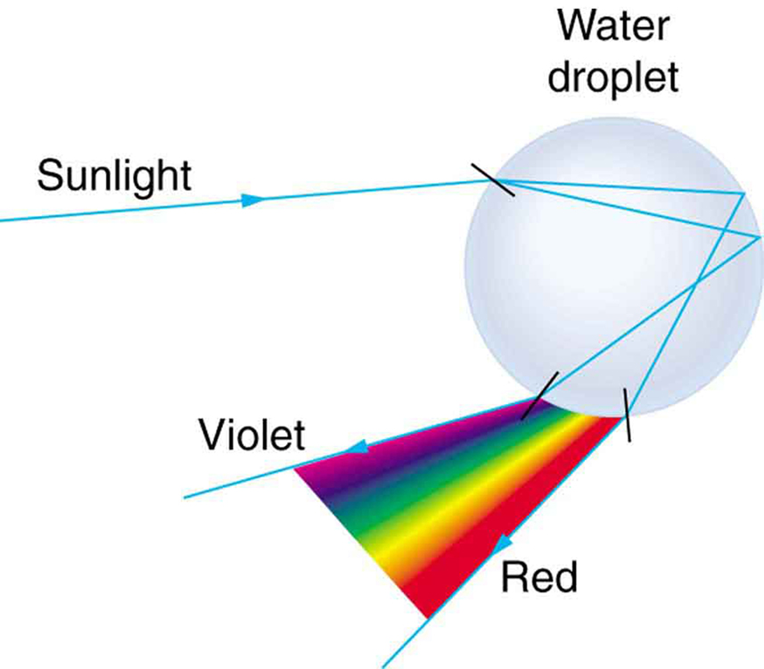

* Explain the phenomenon of dispersion and discuss its advantages and disadvantages.

Everyone enjoys the spectacle of a rainbow glimmering against a dark stormy sky. How does sunlight falling on clear drops of rain get broken into the rainbow of colors we see? The same process causes white light to be broken into colors by a clear glass prism or a diamond. (See [\[link\]](#import-auto-id3204328).)

  and those produced by a prism (b) are identical. (credit: Alfredo55, Wikimedia Commons; NASA)"){: #import-auto-id3204328}

We see about six colors in a rainbow—red, orange, yellow, green, blue, and violet; sometimes indigo is listed, too. Those colors are associated with different wavelengths of light, as shown in [\[link\]](#import-auto-id2723044). When our eye receives pure-wavelength light, we tend to see only one of the six colors, depending on wavelength. The thousands of other hues we can sense in other situations are our eye’s response to various mixtures of wavelengths. White light, in particular, is a fairly uniform mixture of all visible wavelengths. Sunlight, considered to be white, actually appears to be a bit yellow because of its mixture of wavelengths, but it does contain all visible wavelengths. The sequence of colors in rainbows is the same sequence as the colors plotted versus wavelength in [\[link\]](#import-auto-id2723044). What this implies is that white light is spread out according to wavelength in a rainbow. **Dispersion**{: data-type="term" #import-auto-id2632931} is defined as the spreading of white light into its full spectrum of wavelengths. More technically, dispersion occurs whenever there is a process that changes the direction of light in a manner that depends on wavelength. Dispersion, as a general phenomenon, can occur for any type of wave and always involves wavelength-dependent processes.

Dispersion

Dispersion is defined to be the spreading of white light into its full spectrum of wavelengths.

 {: #import-auto-id2723044}

Refraction is responsible for dispersion in rainbows and many other situations. The angle of refraction depends on the index of refraction, as we saw in [The Law of Refraction](/m42459). We know that the index of refraction <math xmlns="http://www.w3.org/1998/Math/MathML"><semantics><mrow><mrow><mi>n</mi></mrow><mrow /></mrow><annotation encoding="StarMath 5.0"> size 12{n} {}</annotation></semantics></math>

 depends on the medium. But for a given medium, <math xmlns="http://www.w3.org/1998/Math/MathML"><semantics><mrow><mrow><mi>n</mi></mrow><mrow /></mrow><annotation encoding="StarMath 5.0"> size 12{n} {}</annotation></semantics></math>

 also depends on wavelength. (See [\[link\]](#import-auto-id2720898). Note that, for a given medium, <math xmlns="http://www.w3.org/1998/Math/MathML"><semantics><mrow><mrow><mi>n</mi></mrow><mrow /></mrow><annotation encoding="StarMath 5.0"> size 12{n} {}</annotation></semantics></math>

 increases as wavelength decreases and is greatest for violet light. Thus violet light is bent more than red light, as shown for a prism in [\[link\]](#import-auto-id2600469)(b), and the light is dispersed into the same sequence of wavelengths as seen in [\[link\]](#import-auto-id3204328) and [\[link\]](#import-auto-id2723044).

Making Connections: Dispersion

Any type of wave can exhibit dispersion. Sound waves, all types of electromagnetic waves, and water waves can be dispersed according to wavelength. Dispersion occurs whenever the speed of propagation depends on wavelength, thus separating and spreading out various wavelengths. Dispersion may require special circumstances and can result in spectacular displays such as in the production of a rainbow. This is also true for sound, since all frequencies ordinarily travel at the same speed. If you listen to sound through a long tube, such as a vacuum cleaner hose, you can easily hear it is dispersed by interaction with the tube. Dispersion, in fact, can reveal a great deal about what the wave has encountered that disperses its wavelengths. The dispersion of electromagnetic radiation from outer space, for example, has revealed much about what exists between the stars—the so-called empty space.

<table id="import-auto-id2720898" summary="Table shows index of refraction for media listed in the far left column at wavelengths associated with colors listed across the top row."><caption>Index of Refraction <em>n</em> in Selected Media at Various Wavelengths</caption><thead><tr>
            <th>Medium</th>
            <th>Red (660 nm)</th>
            <th>Orange (610 nm)</th>
            <th>Yellow (580 nm)</th>
            <th>Green (550 nm)</th>
            <th>Blue (470 nm)</th>
            <th>Violet (410 nm)</th>
          </tr></thead><tbody><tr>
            <td>Water</td>
            <td>1.331</td>
            <td>1.332</td>
            <td>1.333</td>
            <td>1.335</td>
            <td>1.338</td>
            <td>1.342</td>
          </tr><tr>
            <td>Diamond</td>
            <td>2.410</td>
            <td>2.415</td>
            <td>2.417</td>
            <td>2.426</td>
            <td>2.444</td>
            <td>2.458</td>
          </tr><tr>
            <td>Glass, crown</td>
            <td>1.512</td>
            <td>1.514</td>
            <td>1.518</td>
            <td>1.519</td>
            <td>1.524</td>
            <td>1.530</td>
          </tr><tr>
            <td>Glass, flint</td>
            <td>1.662</td>
            <td>1.665</td>
            <td>1.667</td>
            <td>1.674</td>
            <td>1.684</td>
            <td>1.698</td>
          </tr><tr>
            <td>Polystyrene</td>
            <td>1.488</td>
            <td>1.490</td>
            <td>1.492</td>
            <td>1.493</td>
            <td>1.499</td>
            <td>1.506</td>
          </tr><tr>
            <td>Quartz, fused</td>
            <td>1.455</td>
            <td>1.456</td>
            <td>1.458</td>
            <td>1.459</td>
            <td>1.462</td>
            <td>1.468</td>
          </tr></tbody></table>

![Figure (a) shows a triangle representing a prism and a pure wavelength of incident light falling onto it and getting refracted at both sides of the prism. The refracted ray runs parallel to the base of the prism and then emerges after getting refracted from the other surface. Figure (b) shows a triangle representing a prism and an incident white light falling onto it and getting refracted at the first surface with two refracted rays with slightly different angles of separation. The refracted rays, on falling on the second surface, refract with various angles of refraction. A sequence of red to violet is produced when light emerges out of the prism. Red at 760 nanometers and violet at 380 nanometers.](../resources/Figure 26_05_03.jpg "(a) A pure wavelength of light falls onto a prism and is refracted at both surfaces. (b) White light is dispersed by the prism (shown exaggerated). Since the index of refraction varies with wavelength, the angles of refraction vary with wavelength. A sequence of red to violet is produced, because the index of refraction increases steadily with decreasing wavelength."){: #import-auto-id2600469}

Rainbows are produced by a combination of refraction and reflection. You may have noticed that you see a rainbow only when you look away from the sun. Light enters a drop of water and is reflected from the back of the drop, as shown in [\[link\]](#import-auto-id2511898). The light is refracted both as it enters and as it leaves the drop. Since the index of refraction of water varies with wavelength, the light is dispersed, and a rainbow is observed, as shown in [\[link\]](#import-auto-id2003083) (a). (There is no dispersion caused by reflection at the back surface, since the law of reflection does not depend on wavelength.) The actual rainbow of colors seen by an observer depends on the myriad of rays being refracted and reflected toward the observer’s eyes from numerous drops of water. The effect is most spectacular when the background is dark, as in stormy weather, but can also be observed in waterfalls and lawn sprinklers. The arc of a rainbow comes from the need to be looking at a specific angle relative to the direction of the sun, as illustrated in [\[link\]](#import-auto-id2003083) (b). (If there are two reflections of light within the water drop, another “secondary” rainbow is produced. This rare event produces an arc that lies above the primary rainbow arc—see [\[link\]](#import-auto-id2003083) (c).)

Rainbows

Rainbows are produced by a combination of refraction and reflection.

 {: #import-auto-id2511898}

![In figure (a) sunlight is incident on two water droplets close to one another. The incident rays undergo refraction and total internal reflection. From the first droplet, violet color emerges and from the second, red emerges. A woman observes from a distance, the band of seven colors with red on top and violet at the bottom. Two rays each from red and violet reach the observer&#x2019;s eyes. The angle of separation between the incident light and the emerging red light is theta. In figure (b), a man looks at the rainbow, which is in the shape of an arc. A parallel beam of blue colored rays fall on the rainbow at different positions and then reaches the observer, each ray making the same angle theta with the incident ray. The rays reaching the observer are red in color. Figure (c) shows a spectacular double rainbow in the sky with white clouds as a backdrop.](../resources/Figure 26_05_05.jpg "(a) Different colors emerge in different directions, and so you must look at different locations to see the various colors of a rainbow. (b) The arc of a rainbow results from the fact that a line between the observer and any point on the arc must make the correct angle with the parallel rays of sunlight to receive the refracted rays.  (c) Double rainbow. (credit: Nicholas, Wikimedia Commons)"){: #import-auto-id2003083}

Dispersion may produce beautiful rainbows, but it can cause problems in optical systems. White light used to transmit messages in a fiber is dispersed, spreading out in time and eventually overlapping with other messages. Since a laser produces a nearly pure wavelength, its light experiences little dispersion, an advantage over white light for transmission of information. In contrast, dispersion of electromagnetic waves coming to us from outer space can be used to determine the amount of matter they pass through. As with many phenomena, dispersion can be useful or a nuisance, depending on the situation and our human goals.

PhET Explorations: Geometric Optics

How does a lens form an image? See how light rays are refracted by a lens. Watch how the image changes when you adjust the focal length of the lens, move the object, move the lens, or move the screen.

<figure markdown="1" id="eip-id1501562">
<figcaption>
[Geometric Optics](geometric-optics_en.jar)
</figcaption>
 [{: data-print="false"}](geometric-optics_en.jar){: data-type="image"}  
</figure>

# Section Summary

* {: #import-auto-id3137375} The spreading of white light into its full spectrum of wavelengths is called dispersion.
* {: #import-auto-id2994679} Rainbows are produced by a combination of refraction and reflection and involve the dispersion of sunlight into a continuous distribution of colors.
* {: #import-auto-id1536161} Dispersion produces beautiful rainbows but also causes problems in certain optical systems.

# Problems &amp; Exercises

(a) What is the ratio of the speed of red light to violet light in diamond, based on [[link]](#import-auto-id2720898)? (b) What is this ratio in polystyrene? (c) Which is more dispersive?

A beam of white light goes from air into water at an incident angle of <math xmlns="http://www.w3.org/1998/Math/MathML"><semantics><mrow><mrow><mrow><mtext>75</mtext><mtext>.</mtext><mn>0º</mn></mrow></mrow><mrow /></mrow><annotation encoding="StarMath 5.0"> size 12{"75" "." 0°} {}</annotation></semantics></math>

. At what angles are the red (660 nm) and violet (410 nm) parts of the light refracted?

<math xmlns="http://www.w3.org/1998/Math/MathML"> <semantics> <mrow> <mrow> <mrow> <mtext>46</mtext> <mtext>.</mtext> <mn>5º</mn> <mi /> <mtext>, red; 46</mtext> <mtext>.</mtext> <mn>0º</mn> <mtext>, violet</mtext> </mrow> </mrow> </mrow> </semantics> </math>
{: xmlns:fo="urn:oasis:names:tc:opendocument:xmlns:xsl-fo-compatible:1.0" fo:font-weight="normal"}

By how much do the critical angles for red (660 nm) and violet (410 nm) light differ in a diamond surrounded by air?
{: xmlns:fo="urn:oasis:names:tc:opendocument:xmlns:xsl-fo-compatible:1.0" fo:font-weight="normal"}

(a) A narrow beam of light containing yellow (580 nm) and green (550 nm) wavelengths goes from polystyrene to air, striking the surface at a <math xmlns="http://www.w3.org/1998/Math/MathML"><semantics><mrow><mrow><mrow><mtext>30</mtext><mtext>.</mtext><mn>0º</mn></mrow></mrow><mrow /></mrow><annotation encoding="StarMath 5.0"> size 12{"30" "." 0°} {}</annotation></semantics></math>

 incident angle. What is the angle between the colors when they emerge? (b) How far would they have to travel to be separated by 1.00 mm?

(a) <math xmlns="http://www.w3.org/1998/Math/MathML"><semantics><mrow><mrow><mrow><mn>0</mn><mtext>.</mtext><mtext>043º</mtext></mrow></mrow><mrow /></mrow><annotation encoding="StarMath 5.0"> size 12{0 "." "043"°} {}</annotation></semantics></math>

(b) <math xmlns="http://www.w3.org/1998/Math/MathML"><semantics><mrow><mrow><mrow><mn>1</mn><mtext>.</mtext><mtext>33 m</mtext></mrow></mrow><mrow /></mrow><annotation encoding="StarMath 5.0"> size 12{1 "." "33"" m"} {}</annotation></semantics></math>

A parallel beam of light containing orange (610 nm) and violet (410 nm) wavelengths goes from fused quartz to water, striking the surface between them at a <math xmlns="http://www.w3.org/1998/Math/MathML"><semantics><mrow><mrow><mrow><mtext>60</mtext><mtext>.</mtext><mn>0º</mn></mrow></mrow><mrow /></mrow><annotation encoding="StarMath 5.0"> size 12{"60" "." 0°} {}</annotation></semantics></math>

 incident angle. What is the angle between the two colors in water?

A ray of 610 nm light goes from air into fused quartz at an incident angle of <math xmlns="http://www.w3.org/1998/Math/MathML"><semantics><mrow><mrow><mrow><mtext>55</mtext><mtext>.</mtext><mn>0º</mn></mrow></mrow><mrow /></mrow><annotation encoding="StarMath 5.0"> size 12{"55" "." 0°} {}</annotation></semantics></math>

. At what incident angle must 470 nm light enter flint glass to have the same angle of refraction?

<math xmlns="http://www.w3.org/1998/Math/MathML"> <semantics> <mrow> <mrow> <mrow> <mtext>71.3º</mtext> </mrow> </mrow> <mrow /> </mrow> <annotation encoding="StarMath 5.0"> size 12{"71" "." 3°} {}</annotation> </semantics> </math>

A narrow beam of light containing red (660 nm) and blue (470 nm) wavelengths travels from air through a 1.00 cm thick flat piece of crown glass and back to air again. The beam strikes at a <math xmlns="http://www.w3.org/1998/Math/MathML"><semantics><mrow><mrow><mrow><mtext>30</mtext><mtext>.</mtext><mn>0º</mn></mrow></mrow><mrow /></mrow><annotation encoding="StarMath 5.0"> size 12{"30" "." 0°} {}</annotation></semantics></math>

 incident angle. (a) At what angles do the two colors emerge? (b) By what distance are the red and blue separated when they emerge?

A narrow beam of white light enters a prism made of crown glass at a <math xmlns="http://www.w3.org/1998/Math/MathML"><semantics><mrow><mrow><mrow><mtext>45</mtext><mtext>.</mtext><mn>0º</mn></mrow></mrow><mrow /></mrow><annotation encoding="StarMath 5.0"> size 12{"45" "." 0°} {}</annotation></semantics></math>

 incident angle, as shown in [[link]](#import-auto-id2822361). At what angles, <math xmlns="http://www.w3.org/1998/Math/MathML"><semantics><mrow><mrow><msub><mi>θ</mi><mrow><mtext>R</mtext></mrow></msub></mrow><mrow /></mrow></semantics></math>

 and <math xmlns="http://www.w3.org/1998/Math/MathML"><semantics><mrow><mrow><msub><mi>θ</mi><mrow><mtext>V</mtext></mrow></msub></mrow><mrow /></mrow></semantics></math>

, do the red (660 nm) and violet (410 nm) components of the light emerge from the prism?

{: #import-auto-id2822361}

<math xmlns="http://www.w3.org/1998/Math/MathML"> <semantics> <mrow> <mrow> <mrow> <mtext>53.5º</mtext> <mtext>, red;</mtext> </mrow> </mrow> <mrow /> </mrow> <annotation encoding="StarMath 5.0"> size 12{"53" "." 5°," red;"} {}</annotation> </semantics> </math>

 <math xmlns="http://www.w3.org/1998/Math/MathML"> <semantics> <mrow> <mrow> <mrow> <mtext>55.2º</mtext> <mtext>, violet</mtext> </mrow> </mrow> <mrow /> </mrow> <annotation encoding="StarMath 5.0"> size 12{"55" "." 2°," violet"} {}</annotation> </semantics> </math>

## Glossary
{: data-type="glossary-title"}

dispersion
: spreading of white light into its full spectrum of wavelengths
{: .definition #import-auto-id2946100}

rainbow
: dispersion of sunlight into a continuous distribution of colors according to wavelength, produced by the refraction and reflection of sunlight by water droplets in the sky
{: .definition #import-auto-id2727866}

