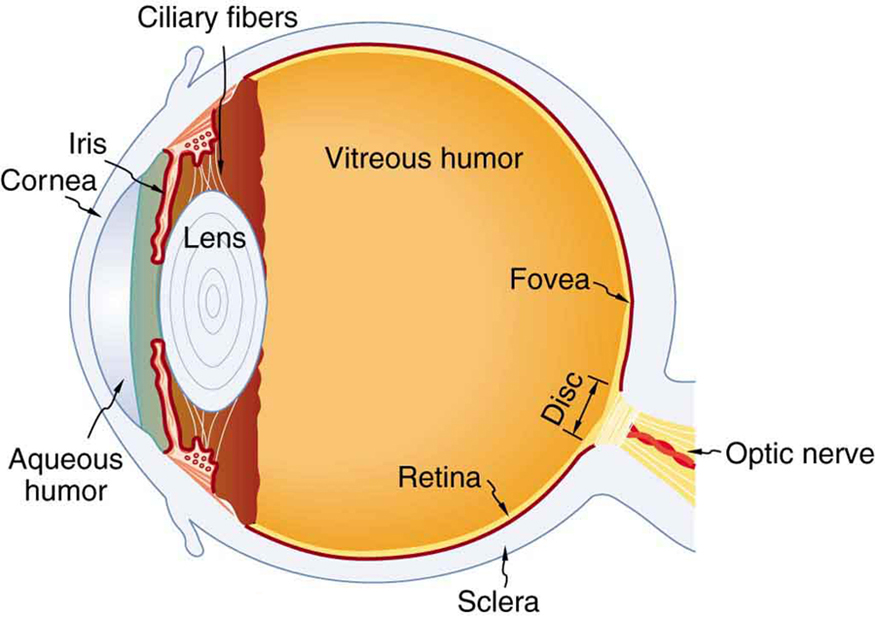

* Explain the image formation by the eye.
* Explain why peripheral images lack detail and color.
* Define refractive indices.
* Analyze the accommodation of the eye for distant and near vision.

The eye is perhaps the most interesting of all optical instruments. The eye is remarkable in how it forms images and in the richness of detail and color it can detect. However, our eyes commonly need some correction, to reach what is called “normal” vision, but should be called ideal rather than normal. Image formation by our eyes and common vision correction are easy to analyze with the optics discussed in [Geometric Optics](/m42449).

[\[link\]](#import-auto-id3121990) shows the basic anatomy of the eye. The cornea and lens form a system that, to a good approximation, acts as a single thin lens. For clear vision, a real image must be projected onto the light-sensitive retina, which lies at a fixed distance from the lens. The lens of the eye adjusts its power to produce an image on the retina for objects at different distances. The center of the image falls on the fovea, which has the greatest density of light receptors and the greatest acuity (sharpness) in the visual field. The variable opening (or pupil) of the eye along with chemical adaptation allows the eye to detect light intensities from the lowest observable to <math xmlns="http://www.w3.org/1998/Math/MathML"><semantics><mrow><mrow><msup><mtext>10</mtext><mrow><mtext>10</mtext></mrow></msup></mrow><mrow /></mrow><annotation encoding="StarMath 5.0"> size 12{"10" rSup { size 8{"10"} } } {}</annotation></semantics></math>

 times greater (without damage). This is an incredible range of detection. Our eyes perform a vast number of functions, such as sense direction, movement, sophisticated colors, and distance. Processing of visual nerve impulses begins with interconnections in the retina and continues in the brain. The optic nerve conveys signals received by the eye to the brain.

 {: #import-auto-id3121990}

Refractive indices are crucial to image formation using lenses. [\[link\]](#fs-id2667397) shows refractive indices relevant to the eye. The biggest change in the refractive index, and bending of rays, occurs at the cornea rather than the lens. The ray diagram in [\[link\]](#import-auto-id2399984) shows image formation by the cornea and lens of the eye. The rays bend according to the refractive indices provided in [\[link\]](#fs-id2667397). The cornea provides about two-thirds of the power of the eye, owing to the fact that speed of light changes considerably while traveling from air into cornea. The lens provides the remaining power needed to produce an image on the retina. The cornea and lens can be treated as a single thin lens, even though the light rays pass through several layers of material (such as cornea, aqueous humor, several layers in the lens, and vitreous humor), changing direction at each interface. The image formed is much like the one produced by a single convex lens. This is a case 1 image. Images formed in the eye are inverted but the brain inverts them once more to make them seem upright.

<table summary="Various materials relevant to the eye are listed in the first column. Their indices of refraction are listed in the second column."><caption>Refractive Indices Relevant to the Eye</caption><thead><tr><th>Material</th>
                <th>Index of Refraction</th>
            </tr></thead><tbody><tr><td>
    Water</td><td>1.33</td></tr><tr><td>Air </td><td>1.0</td></tr><tr><td>Cornea</td> <td>1.38</td></tr><tr><td>Aqueous humor</td> <td>1.34</td></tr><tr><td>Lens</td> <td>1.41 average (varies throughout the lens, greatest in center)</td></tr><tr><td>Vitreous humor</td>  <td>1.34</td></tr></tbody></table>

{: #import-auto-id2399984}

As noted, the image must fall precisely on the retina to produce clear vision — that is, the image distance <math xmlns="http://www.w3.org/1998/Math/MathML"><semantics><mrow><mrow><msub><mi>d</mi><mrow><mtext>i</mtext></mrow></msub></mrow><mrow /></mrow><annotation encoding="StarMath 5.0"> size 12{d rSub { size 8{i} } } {}</annotation></semantics></math>

 must equal the lens-to-retina distance. Because the lens-to-retina distance does not change, the image distance <math xmlns="http://www.w3.org/1998/Math/MathML"><semantics><mrow><mrow><msub><mi>d</mi><mrow><mtext>i</mtext></mrow></msub></mrow><mrow /></mrow><annotation encoding="StarMath 5.0"> size 12{d rSub { size 8{i} } } {}</annotation></semantics></math>

 must be the same for objects at all distances. The eye manages this by varying the power (and focal length) of the lens to accommodate for objects at various distances. The process of adjusting the eye’s focal length is called **accommodation**{: data-type="term" #import-auto-id1461483}. A person with normal (ideal) vision can see objects clearly at distances ranging from 25 cm to essentially infinity. However, although the near point (the shortest distance at which a sharp focus can be obtained) increases with age (becoming meters for some older people), we will consider it to be 25 cm in our treatment here.

[\[link\]](#import-auto-id2956405) shows the accommodation of the eye for distant and near vision. Since light rays from a nearby object can diverge and still enter the eye, the lens must be more converging (more powerful) for close vision than for distant vision. To be more converging, the lens is made thicker by the action of the ciliary muscle surrounding it. The eye is most relaxed when viewing distant objects, one reason that microscopes and telescopes are designed to produce distant images. Vision of very distant objects is called *totally relaxed*, while close vision is termed *accommodated*, with the closest vision being *fully accommodated*.

 ![Two cross-sectional views of eye anatomy are shown. In part a of the figure, parallel rays from distant object are entering the eye and are converging on the retina to produce an inverted image of the tree shown above the principle axis. The interior lens of the eye is relaxed and least rounded, given as P small. Distance of image d i is equal to two centimeters, which is the measure of the distance from lens to retina. Distance of object d o is given as very large. In part b of the figure, rays from a button, which is a nearby object, are shown to diverge as they enter the eye. The interior lens of the eye, P large, converges the rays to form an image at retina, below the principle axis. Distance of image d i is equal to two centimeters, which is the measure of distance from lens to retina. Distance of object d o is given as very small.](../resources/Figure_27_01_03.jpg "Relaxed and accommodated vision for distant and close objects. (a) Light rays from the same point on a distant object must be nearly parallel while entering the eye and more easily converge to produce an image on the retina. (b) Light rays from a nearby object can diverge more and still enter the eye. A more powerful lens is needed to converge them on the retina than if they were parallel."){: #import-auto-id2956405}

We will use the thin lens equations to examine image formation by the eye quantitatively. First, note the power of a lens is given as <math xmlns="http://www.w3.org/1998/Math/MathML"><semantics><mrow><mrow><mrow><mi>p</mi><mo stretchy="false">=</mo><mrow><mn>1</mn><mo stretchy="false">/</mo><mi>f</mi></mrow></mrow></mrow><mrow /></mrow><annotation encoding="StarMath 5.0"> size 12{p= {1} slash {f} } {}</annotation></semantics></math>

, so we rewrite the thin lens equations as

<math xmlns="http://www.w3.org/1998/Math/MathML"> <semantics> <mrow> <mrow> <mrow> <mi>P</mi> <mo stretchy="false">=</mo> <mrow> <mfrac> <mn>1</mn> <msub> <mi>d</mi> <mrow> <mtext>o</mtext> </mrow> </msub> </mfrac> <mo stretchy="false">+</mo> <mfrac> <mn>1</mn> <msub> <mi>d</mi> <mrow> <mtext>i</mtext> </mrow> </msub> </mfrac> </mrow> </mrow> </mrow> </mrow> </semantics> </math>

and

<math xmlns="http://www.w3.org/1998/Math/MathML"> <semantics> <mrow> <mrow> <mrow> <mrow> <mfrac> <msub> <mi>h</mi> <mrow> <mtext>i</mtext> </mrow> </msub> <msub> <mi>h</mi> <mrow> <mtext>o</mtext> </mrow> </msub> </mfrac> <mo stretchy="false">=</mo> <mrow> <mo stretchy="false">−</mo> <mfrac> <msub> <mi>d</mi> <mrow> <mtext>i</mtext> </mrow> </msub> <msub> <mi>d</mi> <mrow> <mtext>o</mtext> </mrow> </msub> </mfrac> </mrow> </mrow> <mo stretchy="false">=</mo> <mi fontstyle="italic">m.</mi> </mrow> </mrow> </mrow> </semantics> </math>

We understand that <math xmlns="http://www.w3.org/1998/Math/MathML"><semantics><mrow><mrow><msub><mi>d</mi><mrow><mtext>i</mtext></mrow></msub></mrow><mrow /></mrow><annotation encoding="StarMath 5.0"> size 12{d rSub { size 8{i} } } {}</annotation></semantics></math>

 must equal the lens-to-retina distance to obtain clear vision, and that normal vision is possible for objects at distances <math xmlns="http://www.w3.org/1998/Math/MathML"><semantics><mrow><mrow><mrow><mrow><msub><mi>d</mi><mrow><mn>o</mn></mrow></msub></mrow><mo stretchy="false">=</mo><mtext>25 cm</mtext></mrow></mrow><mrow /></mrow></semantics></math>

 to infinity.

Take-Home Experiment: The Pupil

Look at the central transparent area of someone’s eye, the pupil, in normal room light. Estimate the diameter of the pupil. Now turn off the lights and darken the room. After a few minutes turn on the lights and promptly estimate the diameter of the pupil. What happens to the pupil as the eye adjusts to the room light? Explain your observations.

The eye can detect an impressive amount of detail, considering how small the image is on the retina. To get some idea of how small the image can be, consider the following example.

Size of Image on Retina

What is the size of the image on the retina of a <math xmlns="http://www.w3.org/1998/Math/MathML"><semantics><mrow><mrow><mrow><mn>1</mn><mtext>.</mtext><mrow><mtext>20</mtext><mo stretchy="false">×</mo><msup><mtext>10</mtext><mrow><mrow><mo stretchy="false">−</mo><mn>2</mn></mrow></mrow></msup></mrow></mrow></mrow><mrow /></mrow><annotation encoding="StarMath 5.0"> size 12{1 "." "20" times "10" rSup { size 8{ - 2} } } {}</annotation></semantics></math>

 cm diameter human hair, held at arm’s length (60.0 cm) away? Take the lens-to-retina distance to be 2.00 cm.

**Strategy**

We want to find the height of the image <math xmlns="http://www.w3.org/1998/Math/MathML"><semantics><mrow><msub><mi>h</mi><mrow><mn>i</mn></mrow></msub></mrow></semantics></math>

, given the height of the object is <math xmlns="http://www.w3.org/1998/Math/MathML"><semantics><mrow><mrow><mrow><mrow><msub><mi>h</mi><mrow><mn>o</mn></mrow></msub><mo stretchy="false">=</mo><mn>1</mn></mrow><mtext>.</mtext><mrow><mtext>20</mtext><mo stretchy="false">×</mo><msup><mtext>10</mtext><mrow><mrow><mo stretchy="false">−</mo><mn>2</mn></mrow></mrow></msup></mrow></mrow></mrow><mrow /></mrow><annotation encoding="StarMath 5.0"> size 12{h rSub { size 8{0} } =1 "." "20" times "10" rSup { size 8{ - 2} } } {}</annotation></semantics></math>

 cm. We also know that the object is 60.0 cm away, so that <math xmlns="http://www.w3.org/1998/Math/MathML"><semantics><mrow><mrow><msub><mi>d</mi><mrow><mn>o</mn></mrow></msub><mo>=</mo><mn>60.0 cm</mn></mrow></mrow><annotation encoding="StarMath 5.0"> size 12{d rSub { size 8{0} } } {}</annotation></semantics></math>

. For clear vision, the image distance must equal the lens-to-retina distance, and so <math xmlns="http://www.w3.org/1998/Math/MathML"><semantics><mrow><mrow><msub><mi>d</mi><mrow><mtext>i</mtext></mrow></msub><mo>=</mo><mn>2.00 cm</mn></mrow><mrow /></mrow><annotation encoding="StarMath 5.0"> size 12{d rSub { size 8{i} } } {}</annotation></semantics></math>

 . The equation <math xmlns="http://www.w3.org/1998/Math/MathML"><semantics><mrow><mrow><mrow><mrow><mfrac><msub><mi>h</mi><mrow><mtext>i</mtext></mrow></msub><msub><mi>h</mi><mrow><mtext>o</mtext></mrow></msub></mfrac><mo stretchy="false">=</mo><mrow><mo stretchy="false">−</mo><mfrac><msub><mi>d</mi><mrow><mtext>i</mtext></mrow></msub><msub><mi>d</mi><mrow><mtext>o</mtext></mrow></msub></mfrac></mrow></mrow><mo stretchy="false">=</mo><mi>m</mi></mrow></mrow></mrow><annotation encoding="StarMath 5.0"> size 12{ { {h rSub { size 8{i} } } over {h rSub { size 8{o} } } } = - { {d rSub { size 8{i} } } over {d rSub { size 8{o} } } } =m} {}</annotation></semantics></math>

 can be used to find <math xmlns="http://www.w3.org/1998/Math/MathML"><semantics><mrow><msub><mi>h</mi><mrow><mn>i</mn></mrow></msub></mrow></semantics></math>

 with the known information.

**Solution**

The only unknown variable in the equation <math xmlns="http://www.w3.org/1998/Math/MathML"><semantics><mrow><mrow><mrow><mrow><mfrac><msub><mi>h</mi><mrow><mtext>i</mtext></mrow></msub><msub><mi>h</mi><mrow><mtext>o</mtext></mrow></msub></mfrac><mo stretchy="false">=</mo><mrow><mo stretchy="false">−</mo><mfrac><msub><mi>d</mi><mrow><mtext>i</mtext></mrow></msub><msub><mi>d</mi><mrow><mtext>o</mtext></mrow></msub></mfrac></mrow></mrow><mo stretchy="false">=</mo><mi>m</mi></mrow></mrow><mrow /></mrow><annotation encoding="StarMath 5.0"> size 12{ { {h rSub { size 8{i} } } over {h rSub { size 8{o} } } } = - { {d rSub { size 8{i} } } over {d rSub { size 8{o} } } } =m} {}</annotation></semantics></math>

 is <math xmlns="http://www.w3.org/1998/Math/MathML"><semantics><mrow><mrow><msub><mi>h</mi><mrow><mtext>i</mtext></mrow></msub></mrow><mrow /></mrow><annotation encoding="StarMath 5.0"> size 12{h rSub { size 8{i} } } {}</annotation></semantics></math>

\:

<math xmlns="http://www.w3.org/1998/Math/MathML"> <semantics> <mrow> <mrow> <mrow> <mfrac> <msub> <mi>h</mi> <mrow> <mtext>i</mtext> </mrow> </msub> <msub> <mi>h</mi> <mrow> <mtext>o</mtext> </mrow> </msub> </mfrac> <mo stretchy="false">=</mo> <mrow> <mo stretchy="false">−</mo> <mfrac> <msub> <mi>d</mi> <mrow> <mtext>i</mtext> </mrow> </msub> <msub> <mi>d</mi> <mrow> <mtext>o</mtext> </mrow> </msub> </mfrac> </mrow> </mrow> </mrow><mo>.</mo> </mrow> </semantics> </math>

Rearranging to isolate <math xmlns="http://www.w3.org/1998/Math/MathML"><semantics><mrow><mrow><msub><mi>h</mi><mrow><mtext>i</mtext></mrow></msub></mrow><mrow /></mrow><annotation encoding="StarMath 5.0"> size 12{h rSub { size 8{i} } } {}</annotation></semantics></math>

 yields

<math xmlns="http://www.w3.org/1998/Math/MathML"> <semantics> <mrow> <mrow> <mrow> <msub> <mi>h</mi> <mrow> <mtext>i</mtext> </mrow> </msub> <mo stretchy="false">=</mo> <mrow> <mrow> <mo stretchy="false">−</mo> <msub> <mi>h</mi> <mrow> <mtext>o</mtext> </mrow> </msub> </mrow> <mo stretchy="false">⋅</mo> <mfrac> <msub> <mi>d</mi> <mrow> <mtext>i</mtext> </mrow> </msub> <msub> <mi>d</mi> <mrow> <mtext>o</mtext> </mrow> </msub> </mfrac> </mrow> </mrow> </mrow><mo>.</mo> </mrow> </semantics> </math>

Substituting the known values gives

<math xmlns="http://www.w3.org/1998/Math/MathML"> <semantics> <mrow> <mrow> <mtable columnalign="left"> <mtr><mtd> <msub> <mi>h</mi> <mrow> <mtext>i</mtext> </mrow> </msub></mtd> <mtd> <mo stretchy="false">=</mo></mtd> <mtd> <mrow> <mrow> <mrow> <mrow> <mrow> <mo stretchy="false">−</mo> <mo stretchy="false">(</mo> </mrow> </mrow> <mn>1.20</mn> <mrow> <mo stretchy="false">×</mo> <msup> <mtext>10</mtext> <mrow> <mo stretchy="false">−</mo> <mn>2</mn> </mrow> </msup> </mrow><mspace width="0.25em" /> <mtext>cm</mtext> <mo stretchy="false">)</mo> <mfrac> <mrow> <mn>2.00 cm</mn> </mrow> <mrow> <mtext>60.0 cm</mtext> </mrow> </mfrac> </mrow> </mrow> </mrow></mtd> </mtr> <mtr><mtd /><mtd> <mo stretchy="false">=</mo></mtd> <mtd> <mrow> <mrow> <mo stretchy="false">−</mo> <mn>4.00</mn> <mo stretchy="false">×</mo> <msup> <mtext>10</mtext> <mrow> <mo stretchy="false">−</mo> <mn>4</mn> </mrow> </msup> </mrow><mspace width="0.25em" /> <mtext>cm</mtext> <mo>.</mo> </mrow></mtd> </mtr> </mtable> </mrow> </mrow> </semantics> </math>

**Discussion**

This truly small image is not the smallest discernible—that is, the limit to visual acuity is even smaller than this. Limitations on visual acuity have to do with the wave properties of light and will be discussed in the next chapter. Some limitation is also due to the inherent anatomy of the eye and processing that occurs in our brain.

Power Range of the Eye

Calculate the power of the eye when viewing objects at the greatest and smallest distances possible with normal vision, assuming a lens-to-retina distance of 2.00 cm (a typical value).

**Strategy**

For clear vision, the image must be on the retina, and so <math xmlns="http://www.w3.org/1998/Math/MathML"><semantics><mrow><mrow><msub><mi>d</mi><mrow><mtext>i</mtext></mrow></msub><mo>=</mo><mn>2.00 cm</mn></mrow><mrow /></mrow></semantics></math>

 here. For distant vision, <math xmlns="http://www.w3.org/1998/Math/MathML"><semantics><mrow><mrow><msub><mi>d</mi><mrow><mn>o</mn></mrow></msub><mo>≈</mo><mn>∞</mn></mrow><mrow /></mrow></semantics></math>

, and for close vision, <math xmlns="http://www.w3.org/1998/Math/MathML"><semantics><mrow><mrow><msub><mi>d</mi><mrow><mn>o</mn></mrow></msub><mo>=</mo><mn>25.0 cm</mn></mrow></mrow></semantics></math>

, as discussed earlier. The equation <math xmlns="http://www.w3.org/1998/Math/MathML"><semantics><mrow><mrow><mrow><mi>P</mi><mo stretchy="false">=</mo><mrow><mfrac><mn>1</mn><msub><mi>d</mi><mrow><mtext>o</mtext></mrow></msub></mfrac><mo stretchy="false">+</mo><mfrac><mn>1</mn><msub><mi>d</mi><mrow><mtext>i</mtext></mrow></msub></mfrac></mrow></mrow></mrow><mrow /></mrow></semantics></math>

 as written just above, can be used directly to solve for <math xmlns="http://www.w3.org/1998/Math/MathML"><semantics><mrow><mrow><mi>P</mi></mrow></mrow></semantics></math>

 in both cases, since we know <math xmlns="http://www.w3.org/1998/Math/MathML"><semantics><mrow><mrow><msub><mi>d</mi><mrow><mtext>i</mtext></mrow></msub></mrow><mrow /></mrow></semantics></math>

 and <math xmlns="http://www.w3.org/1998/Math/MathML"><semantics><mrow><mrow><msub><mi>d</mi><mrow><mn>o</mn></mrow></msub></mrow><mrow /></mrow><annotation encoding="StarMath 5.0"> size 12{d rSub { size 8{0} } } {}</annotation></semantics></math>

. Power has units of diopters, where <math xmlns="http://www.w3.org/1998/Math/MathML"><semantics><mrow><mrow><mrow><mtext>1 D</mtext><mo stretchy="false">=</mo><mtext>1/m</mtext></mrow></mrow><mrow /></mrow><annotation encoding="StarMath 5.0"> size 12{"1D"="1/m"} {}</annotation></semantics></math>

, and so we should express all distances in meters.

**Solution**

For distant vision,

<math xmlns="http://www.w3.org/1998/Math/MathML"> <semantics> <mrow> <mrow> <mrow> <mrow> <mi>P</mi> <mo stretchy="false">=</mo> <mrow> <mfrac> <mn>1</mn> <msub> <mi>d</mi> <mrow> <mtext>o</mtext> </mrow> </msub> </mfrac> <mo stretchy="false">+</mo> <mfrac> <mn>1</mn> <msub> <mi>d</mi> <mrow> <mtext>i</mtext> </mrow> </msub> </mfrac> </mrow> </mrow> <mo stretchy="false">=</mo> <mrow> <mfrac> <mn>1</mn> <mo stretchy="false">∞</mo> </mfrac> <mo stretchy="false">+</mo> <mfrac> <mn>1</mn> <mrow> <mtext>0.0200 m</mtext> </mrow> </mfrac> <mtext>.</mtext> </mrow> </mrow> </mrow> </mrow> </semantics> </math>

Since <math xmlns="http://www.w3.org/1998/Math/MathML"><semantics><mrow><mrow><mrow><mrow><mn>1</mn><mo stretchy="false">/</mo><mo stretchy="false">∞</mo></mrow><mo stretchy="false">=</mo><mn>0</mn></mrow></mrow><mrow /></mrow><annotation encoding="StarMath 5.0"> size 12{1/ infinity =0} {}</annotation></semantics></math>

, this gives

<math xmlns="http://www.w3.org/1998/Math/MathML"><semantics><mrow><mrow><mrow><mrow><mi>P</mi><mo stretchy="false">=</mo><mrow><mn>0</mn><mo stretchy="false">+</mo><mtext>50</mtext></mrow></mrow><mtext>.</mtext><mrow><mrow><mn>0</mn><mo stretchy="false">/</mo><mtext>m</mtext></mrow><mo stretchy="false">=</mo></mrow><mtext>50.0 D (distant vision).</mtext></mrow></mrow><mrow /></mrow></semantics></math>

Now, for close vision,

<math xmlns="http://www.w3.org/1998/Math/MathML"> <semantics> <mrow> <mrow> <mtable columnalign="left"> <mtr><mtd> <mi>P</mi></mtd> <mtd> <mo stretchy="false">=</mo></mtd> <mtd> <mrow> <mrow> <mrow> <mrow> <mrow> <mfrac> <mn>1</mn> <msub> <mi>d</mi> <mrow> <mtext>o</mtext> </mrow> </msub> </mfrac> <mo stretchy="false">+</mo> <mfrac> <mn>1</mn> <msub> <mi>d</mi> <mrow> <mtext>i</mtext> </mrow> </msub> </mfrac> </mrow> </mrow> <mo stretchy="false">=</mo> <mrow> <mfrac> <mn>1</mn> <mrow> <mtext>0.250 m</mtext> </mrow> </mfrac> <mo stretchy="false">+</mo> <mfrac> <mn>1</mn> <mrow> <mtext>0.0200 m</mtext> </mrow> </mfrac> </mrow> </mrow> </mrow> </mrow></mtd> </mtr> <mtr><mtd /><mtd><mo>=</mo></mtd><mtd> <mrow> <mrow> <mfrac> <mrow> <mtext>4.00</mtext> </mrow> <mtext>m</mtext> </mfrac> <mo stretchy="false">+</mo> <mfrac> <mrow> <mn>50.0</mn> </mrow> <mtext>m</mtext> </mfrac> <mo stretchy="false">=</mo> </mrow> <mtext>4.00 D</mtext> <mo stretchy="false">+</mo> <mtext>50.0 D</mtext> </mrow></mtd> </mtr> <mtr><mtd /><mtd><mo>=</mo></mtd> <mtd> <mrow> <mtext>54.0 D (close vision).</mtext> </mrow></mtd> </mtr> </mtable> </mrow> </mrow> <annotation encoding="StarMath 5.0">alignl { stack { size 12{P= { {1} over {d rSub { size 8{o} } } } + { {1} over {d rSub { size 8{i} } } } = { {1} over {0 "." "250 m"} } + { {1} over {0 "." "0200 m"} } } {} # = { {4 "." "00"} over {m} } + { {"50" "." 0} over {m} } =4 "." "00"D+"50" "." 0D {} # ="54" "." 0D {} } } {}</annotation> </semantics> </math>

**Discussion**

For an eye with this typical 2.00 cm lens-to-retina distance, the power of the eye ranges from 50.0 D (for distant totally relaxed vision) to 54.0 D (for close fully accommodated vision), which is an 8% increase. This increase in power for close vision is consistent with the preceding discussion and the ray tracing in [\[link\]](#import-auto-id2956405). An 8% ability to accommodate is considered normal but is typical for people who are about 40 years old. Younger people have greater accommodation ability, whereas older people gradually lose the ability to accommodate. When an optometrist identifies accommodation as a problem in elder people, it is most likely due to stiffening of the lens. The lens of the eye changes with age in ways that tend to preserve the ability to see distant objects clearly but do not allow the eye to accommodate for close vision, a condition called **presbyopia**{: data-type="term" #import-auto-id3013109} (literally, elder eye). To correct this vision defect, we place a converging, positive power lens in front of the eye, such as found in reading glasses. Commonly available reading glasses are rated by their power in diopters, typically ranging from 1.0 to 3.5 D.

# Section Summary

* {: #import-auto-id1897200} Image formation by the eye is adequately described by the thin lens equations:
  

  <math xmlns="http://www.w3.org/1998/Math/MathML"><semantics><mrow><mrow><mrow><mi>P</mi><mo stretchy="false">=</mo><mrow><mfrac><mn>1</mn><msub><mi>d</mi><mrow><mtext>o</mtext></mrow></msub></mfrac><mo stretchy="false">+</mo><mfrac><mn>1</mn><msub><mi>d</mi><mrow><mtext>i</mtext></mrow></msub></mfrac></mrow></mrow></mrow><mrow /></mrow></semantics> <mspace width="0.25em" /> <mtext> and</mtext> <mspace width="0.25em" /> <semantics><mrow><mrow><mrow><mrow><mfrac><msub><mi>h</mi><mrow><mtext>i</mtext></mrow></msub><msub><mi>h</mi><mrow><mtext>o</mtext></mrow></msub></mfrac><mo stretchy="false">=</mo><mrow><mo stretchy="false">−</mo><mfrac><msub><mi>d</mi><mrow><mtext>i</mtext></mrow></msub><msub><mi>d</mi><mrow><mtext>o</mtext></mrow></msub></mfrac></mrow></mrow><mo stretchy="false">=</mo><mi>m</mi><mo>.</mo></mrow></mrow><mrow /></mrow><annotation encoding="StarMath 5.0"> size 12{ { {h rSub { size 8{i} } } over {h rSub { size 8{o} } } } = - { {d rSub { size 8{i} } } over {d rSub { size 8{o} } } } =m} {}</annotation></semantics></math>
  

* {: #import-auto-id2668191} The eye produces a real image on the retina by adjusting its focal length and power in a process called accommodation.
* {: #import-auto-id2953395} For close vision, the eye is fully accommodated and has its greatest power, whereas for distant vision, it is totally relaxed and has its smallest power.
* {: #import-auto-id3043995} The loss of the ability to accommodate with age is called presbyopia, which is corrected by the use of a converging lens to add power for close vision.

# Conceptual Questions

If the lens of a person’s eye is removed because of cataracts (as has been done since ancient times), why would you expect a spectacle lens of about 16 D to be prescribed?

A cataract is cloudiness in the lens of the eye. Is light dispersed or diffused by it?

When laser light is shone into a relaxed normal-vision eye to repair a tear by spot-welding the retina to the back of the eye, the rays entering the eye must be parallel. Why?

How does the power of a dry contact lens compare with its power when resting on the tear layer of the eye? Explain.

Why is your vision so blurry when you open your eyes while swimming under water? How does a face mask enable clear vision?

# Problem Exercises

**Unless otherwise stated, the lens-to-retina distance is 2.00 cm.**

What is the power of the eye when viewing an object 50.0 cm away?

<math xmlns="http://www.w3.org/1998/Math/MathML"> <semantics> <mrow> <mrow> <mrow> <mtext>52.0 D</mtext> </mrow> </mrow> </mrow> </semantics> </math>

Calculate the power of the eye when viewing an object 3.00 m away.

(a) The print in many books averages 3.50 mm in height. How high is the image of the print on the retina when the book is held 30.0 cm from the eye?

(b) Compare the size of the print to the sizes of rods and cones in the fovea and discuss the possible details observable in the letters. (The eye-brain system can perform better because of interconnections and higher order image processing.)

(a) <math xmlns="http://www.w3.org/1998/Math/MathML"> <semantics> <mrow> <mrow> <mrow> <mrow> <mo stretchy="false">−</mo> <mn>0</mn> </mrow> <mtext>.</mtext> <mtext>233 mm</mtext> </mrow> </mrow> <mrow /> </mrow> <annotation encoding="StarMath 5.0"> size 12{ - 0 "." "233"" mm"} {}</annotation> </semantics> </math>

(b) The size of the rods and the cones is smaller than the image height, so we can distinguish letters on a page.

Suppose a certain person’s visual acuity is such that he can see objects clearly that form an image <math xmlns="http://www.w3.org/1998/Math/MathML"><semantics><mrow><mn>4.00 μm</mn></mrow></semantics></math>

 high on his retina. What is the maximum distance at which he can read the 75.0 cm high letters on the side of an airplane?

People who do very detailed work close up, such as jewellers, often can see objects clearly at much closer distance than the normal 25 cm.

(a) What is the power of the eyes of a woman who can see an object clearly at a distance of only 8.00 cm?

(b) What is the size of an image of a 1.00 mm object, such as lettering inside a ring, held at this distance?

(c) What would the size of the image be if the object were held at the normal 25.0 cm distance?

(a) <math xmlns="http://www.w3.org/1998/Math/MathML"><semantics><mrow><mn>+62.5 D</mn></mrow></semantics></math>

(b) <math xmlns="http://www.w3.org/1998/Math/MathML"><semantics><mrow><mn>–0.250 mm</mn></mrow></semantics></math>

(c) <math xmlns="http://www.w3.org/1998/Math/MathML"><semantics><mrow><mn>–0.0800 mm</mn></mrow></semantics></math>

## Glossary
{: data-type="glossary-title"}

accommodation
: the ability of the eye to adjust its focal length is known as accommodation
{: .definition #import-auto-id2929815}

presbyopia
: a condition in which the lens of the eye becomes progressively unable to focus on objects close to the viewer
{: .definition #import-auto-id1435993}

