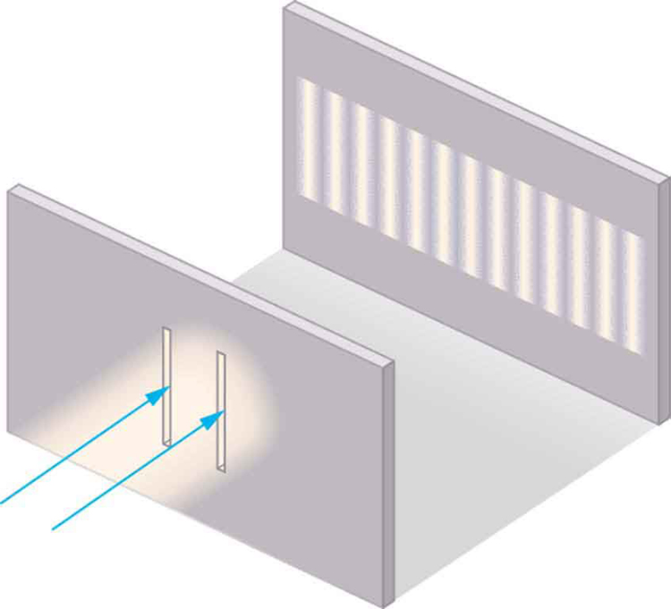

* Explain the phenomena of interference.
* Define constructive interference for a double slit and destructive interference for a double slit.

Although Christiaan Huygens thought that light was a wave, Isaac Newton did not. Newton felt that there were other explanations for color, and for the interference and diffraction effects that were observable at the time. Owing to Newton’s tremendous stature, his view generally prevailed. The fact that Huygens’s principle worked was not considered evidence that was direct enough to prove that light is a wave. The acceptance of the wave character of light came many years later when, in 1801, the English physicist and physician Thomas Young (1773–1829) did his now-classic double slit experiment (see [\[link\]](#import-auto-id1169738007820)).

{: #import-auto-id1169738007820}

Why do we not ordinarily observe wave behavior for light, such as observed in Young’s double slit experiment? First, light must interact with something small, such as the closely spaced slits used by Young, to show pronounced wave effects. Furthermore, Young first passed light from a single source (the Sun) through a single slit to make the light somewhat coherent. By **coherent**{: data-type="term" #import-auto-id1169737787734}, we mean waves are in phase or have a definite phase relationship. **Incoherent**{: data-type="term" #import-auto-id1169737930241} means the waves have random phase relationships. Why did Young then pass the light through a double slit? The answer to this question is that two slits provide two coherent light sources that then interfere constructively or destructively. Young used sunlight, where each wavelength forms its own pattern, making the effect more difficult to see. We illustrate the double slit experiment with monochromatic (single <math xmlns="http://www.w3.org/1998/Math/MathML"><semantics><mrow><mrow><mi>λ</mi></mrow><mrow /></mrow><annotation encoding="StarMath 5.0"> size 12{λ} {}</annotation></semantics></math>

) light to clarify the effect. [\[link\]](#import-auto-id1169737993478) shows the pure constructive and destructive interference of two waves having the same wavelength and amplitude.

![Figure a shows three sine waves with the same wavelength arranged one above the other. The peaks and troughs of each wave are aligned with those of the other waves. The top two waves are labeled wave one and wave two and the bottom wave is labeled resultant. The amplitude of waves one and two are labeled x and the amplitude of the resultant wave is labeled two x. Figure b shows a similar situation, except that the peaks of wave two now align with the troughs of wave one. The resultant wave is now a straight horizontal line on the x axis; that is, the line y equals zero.](../resources/Figure_28_03_02a.jpg "The amplitudes of waves add. (a) Pure constructive interference is obtained when identical waves are in phase. (b) Pure destructive interference occurs when identical waves are exactly out of phase, or shifted by half a wavelength."){: #import-auto-id1169737993478}

When light passes through narrow slits, it is diffracted into semicircular waves, as shown in [\[link\]](#import-auto-id1169738209519)(a). Pure constructive interference occurs where the waves are crest to crest or trough to trough. Pure destructive interference occurs where they are crest to trough. The light must fall on a screen and be scattered into our eyes for us to see the pattern. An analogous pattern for water waves is shown in [\[link\]](#import-auto-id1169738209519)(b). Note that regions of constructive and destructive interference move out from the slits at well-defined angles to the original beam. These angles depend on wavelength and the distance between the slits, as we shall see below.

![The figure contains three parts. The first part is a drawing that shows parallel wavefronts approaching a wall from the left. Crests are shown as continuous lines, and troughs are shown as dotted lines. Two light rays pass through small slits in the wall and emerge in a fan-like pattern from two slits. These lines fan out to the right until they hit the right-hand wall. The points where these fan lines hit the right-hand wall are alternately labeled min and max. The min points correspond to lines that connect the overlapping crests and troughs, and the max points correspond to the lines that connect the overlapping crests. The second drawing is a view from above of a pool of water with semicircular wavefronts emanating from two points on the left side of the pool that are arranged one above the other. These semicircular waves overlap with each other and form a pattern much like the pattern formed by the arcs in the first image.  The third drawing shows a vertical dotted line, with some dots appearing brighter than other dots. The brightness pattern is symmetric about the midpoint of this line. The dots near the midpoint are the brightest. As you move from the midpoint up, or down, the dots become progressively dimmer until there seems to be a dot missing. If you progress still farther from the midpoint, the dots appear again and get brighter, but are much less bright than the central dots. If you progress still farther from the midpoint, the dots get dimmer again and then disappear again, which is where the dotted line stops.](../resources/Figure_28_03_03a.jpg "Double slits produce two coherent sources of waves that interfere. (a) Light spreads out (diffracts) from each slit, because the slits are narrow. These waves overlap and interfere constructively (bright lines) and destructively (dark regions). We can only see this if the light falls onto a screen and is scattered into our eyes. (b) Double slit interference pattern for water waves are nearly identical to that for light. Wave action is greatest in regions of constructive interference and least in regions of destructive interference. (c) When light that has passed through double slits falls on a screen, we see a pattern such as this. (credit: PASCO)"){: #import-auto-id1169738209519}

To understand the double slit interference pattern, we consider how two waves travel from the slits to the screen, as illustrated in [\[link\]](#import-auto-id1169737909724). Each slit is a different distance from a given point on the screen. Thus different numbers of wavelengths fit into each path. Waves start out from the slits in phase (crest to crest), but they may end up out of phase (crest to trough) at the screen if the paths differ in length by half a wavelength, interfering destructively as shown in [\[link\]](#import-auto-id1169737909724)(a). If the paths differ by a whole wavelength, then the waves arrive in phase (crest to crest) at the screen, interfering constructively as shown in [\[link\]](#import-auto-id1169737909724)(b). More generally, if the paths taken by the two waves differ by any half-integral number of wavelengths \[<math xmlns="http://www.w3.org/1998/Math/MathML"><semantics><mrow><mrow><mrow><mo stretchy="false">(</mo><mrow><mn>1</mn><mo stretchy="false">/</mo><mn>2</mn></mrow><mo stretchy="false">)</mo><mi>λ</mi></mrow></mrow><mrow /></mrow><annotation encoding="StarMath 5.0"> size 12{ \( 1/2 \) λ} {}</annotation></semantics></math>

, <math xmlns="http://www.w3.org/1998/Math/MathML"><semantics><mrow><mrow><mrow><mo stretchy="false">(</mo><mrow><mn>3</mn><mo stretchy="false">/</mo><mn>2</mn></mrow><mo stretchy="false">)</mo><mi>λ</mi></mrow></mrow><mrow /></mrow><annotation encoding="StarMath 5.0"> size 12{ \( 3/2 \) λ} {}</annotation></semantics></math>

, <math xmlns="http://www.w3.org/1998/Math/MathML"><semantics><mrow><mrow><mrow><mo stretchy="false">(</mo><mrow><mn>5</mn><mo stretchy="false">/</mo><mn>2</mn></mrow><mo stretchy="false">)</mo><mi>λ</mi></mrow></mrow><mrow /></mrow><annotation encoding="StarMath 5.0"> size 12{ \( 5/2 \) λ} {}</annotation></semantics></math>

, etc.\], then destructive interference occurs. Similarly, if the paths taken by the two waves differ by any integral number of wavelengths (<math xmlns="http://www.w3.org/1998/Math/MathML"><semantics><mrow><mrow><mi>λ</mi></mrow><mrow /></mrow><annotation encoding="StarMath 5.0"> size 12{λ} {}</annotation></semantics></math>

, <math xmlns="http://www.w3.org/1998/Math/MathML"><semantics><mrow><mrow><mn>2</mn><mi>λ</mi></mrow><mrow /></mrow><annotation encoding="StarMath 5.0"> size 12{2λ} {}</annotation></semantics></math>

, <math xmlns="http://www.w3.org/1998/Math/MathML"><semantics><mrow><mrow><mn>3</mn><mi>λ</mi></mrow><mrow /></mrow><annotation encoding="StarMath 5.0"> size 12{3λ} {}</annotation></semantics></math>

, etc.), then constructive interference occurs.

Take-Home Experiment: Using Fingers as Slits

Look at a light, such as a street lamp or incandescent bulb, through the narrow gap between two fingers held close together. What type of pattern do you see? How does it change when you allow the fingers to move a little farther apart? Is it more distinct for a monochromatic source, such as the yellow light from a sodium vapor lamp, than for an incandescent bulb?

![Both parts of the figure show a schematic of a double slit experiment. Two waves, each of which is emitted from a different slit, propagate from the slits to the screen. In the first schematic, when the waves meet on the screen, one of the waves is at a maximum whereas the other is at a minimum. This schematic is labeled dark (destructive interference). In the second schematic, when the waves meet on the screen, both waves are at a minimum.. This schematic is labeled bright (constructive interference).](../resources/Figure_28_03_04a.jpg "Waves follow different paths from the slits to a common point on a screen. (a) Destructive interference occurs here, because one path is a half wavelength longer than the other. The waves start in phase but arrive out of phase. (b) Constructive interference occurs here because one path is a whole wavelength longer than the other. The waves start out and arrive in phase."){: #import-auto-id1169737909724}

[\[link\]](#import-auto-id1169736768706) shows how to determine the path length difference for waves traveling from two slits to a common point on a screen. If the screen is a large distance away compared with the distance between the slits, then the angle <math xmlns="http://www.w3.org/1998/Math/MathML"><semantics><mrow><mrow><mi>θ</mi></mrow><mrow /></mrow><annotation encoding="StarMath 5.0"> size 12{θ} {}</annotation></semantics></math>

 between the path and a line from the slits to the screen (see the figure) is nearly the same for each path. The difference between the paths is shown in the figure; simple trigonometry shows it to be <math xmlns="http://www.w3.org/1998/Math/MathML"><semantics><mrow><mrow><mrow><mi>d</mi><mspace width="0.25em" /><mtext>sin</mtext><mspace width="0.25em" /><mi>θ</mi></mrow></mrow><mrow /></mrow><annotation encoding="StarMath 5.0"> size 12{d`"sin"θ} {}</annotation></semantics></math>

, where <math xmlns="http://www.w3.org/1998/Math/MathML"><semantics><mrow><mrow><mi>d</mi></mrow><mrow /></mrow><annotation encoding="StarMath 5.0"> size 12{d} {}</annotation></semantics></math>

 is the distance between the slits. To obtain **constructive interference for a double slit**{: data-type="term" #import-auto-id1169737994967}, the path length difference must be an integral multiple of the wavelength, or

<math xmlns="http://www.w3.org/1998/Math/MathML"><semantics><mrow><mrow><mrow><mo fontstyle="italic">d</mo><mspace width="0.25em" /><mtext>sin</mtext><mrow><mspace width="0.25em" /><mi>θ</mi><mo stretchy="false">=</mo><mi fontstyle="italic">mλ</mi></mrow><mo>,</mo><mspace width="0.25em" /><mtext>for</mtext><mspace width="0.25em" /><mrow><mi>m</mi><mo stretchy="false">=</mo> <mn>0,</mn></mrow> <mspace width="0.25em" /> <mn>1,</mn> <mrow> <mspace width="0.25em" /> <mo stretchy="false">−</mo> <mn>1,</mn> </mrow> <mspace width="0.25em" /> <mn>2,</mn> <mrow> <mspace width="0.25em" /> <mo stretchy="false">−</mo> <mn>2,</mn></mrow><mspace width="0.25em" /><mo stretchy="false">…</mo></mrow><mspace width="0.25em" /><mspace width="0.25em" /><mtext>(constructive).</mtext></mrow><mrow /></mrow><annotation encoding="StarMath 5.0"> size 12{d`"sin"θ=mλ,`m=0,`1,`-1,`2,`-2,` dotslow } {}</annotation></semantics></math>

Similarly, to obtain **destructive interference for a double slit**{: data-type="term" #import-auto-id1169738138390}, the path length difference must be a half-integral multiple of the wavelength, or

<math xmlns="http://www.w3.org/1998/Math/MathML"><semantics><mrow><mrow><mrow><mo fontstyle="italic">d</mo><mspace width="0.25em" /><mtext>sin</mtext><mrow><mspace width="0.25em" /><mi>θ</mi><mo stretchy="false">=</mo><mfenced open="(" close=")"><mrow><mi>m</mi><mo stretchy="false">+</mo><mfrac><mn>1</mn><mn>2</mn></mfrac></mrow></mfenced></mrow><mi>λ</mi><mo>,</mo><mspace width="0.25em" /><mtext>for</mtext><mspace width="0.25em" /><mrow><mi>m</mi><mo stretchy="false">=</mo><mn>0,</mn></mrow><mspace width="0.25em" /><mn>1,</mn><mrow><mspace width="0.25em" /><mo stretchy="false">−</mo><mn>1,</mn></mrow><mspace width="0.25em" /><mn>2,</mn><mspace width="0.25em" /><mrow><mo stretchy="false">−</mo><mn>2,</mn></mrow><mspace width="0.25em" /><mo stretchy="false">…</mo><mspace width="0.25em" /><mspace width="0.25em" /><mtext>(destructive),</mtext></mrow></mrow><mrow /></mrow><annotation encoding="StarMath 5.0"> size 12{d`"sin"θ= left (m+ { {1} over {2} } right )λ,`m=0,`1,` - 1,`2,` - 2,` dotslow } {}</annotation></semantics></math>

where <math xmlns="http://www.w3.org/1998/Math/MathML"><semantics><mrow><mrow><mi>λ</mi></mrow><mrow /></mrow><annotation encoding="StarMath 5.0"> size 12{λ} {}</annotation></semantics></math>

 is the wavelength of the light, <math xmlns="http://www.w3.org/1998/Math/MathML"><semantics><mrow><mrow><mi>d</mi></mrow><mrow /></mrow><annotation encoding="StarMath 5.0"> size 12{d} {}</annotation></semantics></math>

 is the distance between slits, and <math xmlns="http://www.w3.org/1998/Math/MathML"><semantics><mrow><mrow><mi>θ</mi></mrow><mrow /></mrow><annotation encoding="StarMath 5.0"> size 12{θ} {}</annotation></semantics></math>

 is the angle from the original direction of the beam as discussed above. We call <math xmlns="http://www.w3.org/1998/Math/MathML"><semantics><mrow><mrow><mi>m</mi></mrow><mrow /></mrow><annotation encoding="StarMath 5.0"> size 12{m} {}</annotation></semantics></math>

 the **order**{: data-type="term" #import-auto-id1169738250926} of the interference. For example, <math xmlns="http://www.w3.org/1998/Math/MathML"><semantics><mrow><mrow><mrow><mi>m</mi><mo stretchy="false">=</mo><mn>4</mn></mrow></mrow><mrow /></mrow><annotation encoding="StarMath 5.0"> size 12{m=4} {}</annotation></semantics></math>

 is fourth-order interference.

 ![The figure is a schematic of a double slit experiment, with the scale of the slits enlarged to show the detail. The two slits are on the left, and the screen is on the right. The slits are represented by a thick vertical line with two gaps cut through it a distance d apart. Two rays, one from each slit, angle up and to the right at an angle theta above the horizontal. At the screen, these rays are shown to converge at a common point. The ray from the upper slit is labeled l sub one, and the ray from the lower slit is labeled l sub two. At the slits, a right triangle is drawn, with the thick line between the slits forming the hypotenuse. The hypotenuse is labeled d, which is the distance between the slits. A short piece of the ray from the lower slit is labeled delta l and forms the short side of the right triangle. The long side of the right triangle is formed by a line segment that goes downward and to the right from the upper slit to the lower ray. This line segment is perpendicular to the lower ray, and the angle it makes with the hypotenuse is labeled theta. Beneath this triangle is the formula delta l equals d sine theta.](../resources/Figure_28_03_05a.jpg "The paths from each slit to a common point on the screen differ by an amount dsin&#x3B8; size 12{d`&quot;sin&quot;&#x3B8;} {}, assuming the distance to the screen is much greater than the distance between slits (not to scale here)."){: #import-auto-id1169736768706}

The equations for double slit interference imply that a series of bright and dark lines are formed. For vertical slits, the light spreads out horizontally on either side of the incident beam into a pattern called interference fringes, illustrated in [\[link\]](#import-auto-id1169737936168). The intensity of the bright fringes falls off on either side, being brightest at the center. The closer the slits are, the more is the spreading of the bright fringes. We can see this by examining the equation

<math xmlns="http://www.w3.org/1998/Math/MathML"><semantics><mrow><mrow><mrow><mo fontstyle="italic">d</mo><mspace width="0.25em" /><mtext>sin</mtext><mspace width="0.25em" /><mrow><mi>θ</mi><mo stretchy="false">=</mo><mi fontstyle="italic">mλ</mi></mrow><mtext>,</mtext><mspace width="0.25em" /><mtext>for</mtext><mspace width="0.25em" /><mrow><mi>m</mi><mo stretchy="false">=</mo><mn>0,</mn></mrow><mspace width="0.25em" /><mn>1,</mn><mrow><mspace width="0.25em" /><mo stretchy="false">−</mo><mn>1,</mn></mrow><mspace width="0.25em" /><mn>2,</mn><mrow><mspace width="0.25em" /><mo stretchy="false">−</mo><mn>2,</mn></mrow><mspace width="0.25em" /><mo stretchy="false">…</mo><mo>.</mo></mrow></mrow><mrow /></mrow><annotation encoding="StarMath 5.0"> size 12{d`"sin"θ=mλ,`m=0,`1,` - 1,`2,` - 2,` dotslow } {}</annotation></semantics></math>

For fixed <math xmlns="http://www.w3.org/1998/Math/MathML"><semantics><mrow><mrow><mi>λ</mi></mrow><mrow /></mrow><annotation encoding="StarMath 5.0"> size 12{λ} {}</annotation></semantics></math>

 and <math xmlns="http://www.w3.org/1998/Math/MathML"><semantics><mrow><mrow><mi>m</mi></mrow><mrow /></mrow><annotation encoding="StarMath 5.0"> size 12{m} {}</annotation></semantics></math>

, the smaller <math xmlns="http://www.w3.org/1998/Math/MathML"><semantics><mrow><mrow><mo fontstyle="italic">d</mo></mrow><mrow /></mrow><annotation encoding="StarMath 5.0"> size 12{d} {}</annotation></semantics></math>

 is, the larger <math xmlns="http://www.w3.org/1998/Math/MathML"><semantics><mrow><mrow><mi>θ</mi></mrow><mrow /></mrow><annotation encoding="StarMath 5.0"> size 12{θ} {}</annotation></semantics></math>

 must be, since <math xmlns="http://www.w3.org/1998/Math/MathML"><semantics><mrow><mrow><mrow><mtext>sin</mtext><mspace width="0.25em" /><mrow><mi>θ</mi><mo stretchy="false">=</mo><mrow><mi fontstyle="italic">mλ</mi><mo stretchy="false">/</mo><mo fontstyle="italic">d</mo></mrow></mrow></mrow></mrow><mrow /></mrow><annotation encoding="StarMath 5.0"> size 12{"sin"θ=mλ/d} {}</annotation></semantics></math>

. This is consistent with our contention that wave effects are most noticeable when the object the wave encounters (here, slits a distance <math xmlns="http://www.w3.org/1998/Math/MathML"><semantics><mrow><mrow><mo fontstyle="italic">d</mo></mrow><mrow /></mrow><annotation encoding="StarMath 5.0"> size 12{d} {}</annotation></semantics></math>

 apart) is small. Small <math xmlns="http://www.w3.org/1998/Math/MathML"><semantics><mrow><mrow><mo fontstyle="italic">d</mo></mrow><mrow /></mrow><annotation encoding="StarMath 5.0"> size 12{d} {}</annotation></semantics></math>

 gives large <math xmlns="http://www.w3.org/1998/Math/MathML"><semantics><mrow><mrow><mi>θ</mi></mrow><mrow /></mrow><annotation encoding="StarMath 5.0"> size 12{θ} {}</annotation></semantics></math>

, hence a large effect.

![The figure consists of two parts arranged side-by-side. The diagram on the left side shows a double slit arrangement along with a graph of the resultant intensity pattern on a distant screen. The graph is oriented vertically, so that the intensity peaks grow out and to the left from the screen. The maximum intensity peak is at the center of the screen, and some less intense peaks appear on both sides of the center. These peaks become progressively dimmer upon moving away from the center, and are symmetric with respect to the central peak. The distance from the central maximum to the first dimmer peak is labeled y sub one, and the distance from the central maximum to the second dimmer peak is labeled y sub two. The illustration on the right side shows thick bright horizontal bars on a dark background. Each horizontal bar is aligned with one of the intensity peaks from the first figure.](../resources/Figure_28_03_06a.jpg "The interference pattern for a double slit has an intensity that falls off with angle. The photograph shows multiple bright and dark lines, or fringes, formed by light passing through a double slit."){: #import-auto-id1169737936168}

Finding a Wavelength from an Interference Pattern

Suppose you pass light from a He-Ne laser through two slits separated by 0.0100 mm and find that the third bright line on a screen is formed at an angle of <math xmlns="http://www.w3.org/1998/Math/MathML"><semantics><mrow><mrow><mrow><mtext>10</mtext><mtext>.</mtext><mtext>95º</mtext></mrow></mrow><mrow /></mrow><annotation encoding="StarMath 5.0"> size 12{"10" "." "95"°} {}</annotation></semantics></math>

 relative to the incident beam. What is the wavelength of the light?

**Strategy**

The third bright line is due to third-order constructive interference, which means that <math xmlns="http://www.w3.org/1998/Math/MathML"><semantics><mrow><mrow><mrow><mi>m</mi><mo stretchy="false">=</mo><mn>3</mn></mrow></mrow><mrow /></mrow><annotation encoding="StarMath 5.0"> size 12{m=3} {}</annotation></semantics></math>

. We are given <math xmlns="http://www.w3.org/1998/Math/MathML"><semantics><mrow><mrow><mrow><mrow><mi>d</mi><mo stretchy="false">=</mo><mn>0</mn></mrow><mtext>.</mtext><mtext>0100</mtext><mspace width="0.25em" /><mtext>mm</mtext></mrow></mrow><mrow /></mrow><annotation encoding="StarMath 5.0"> size 12{d=0 "." "0100"`"mm"} {}</annotation></semantics></math>

 and <math xmlns="http://www.w3.org/1998/Math/MathML"><semantics><mrow><mrow><mrow><mrow><mi>θ</mi><mo stretchy="false">=</mo><mtext>10</mtext></mrow><mtext>.</mtext><mtext>95º</mtext></mrow></mrow><mrow /></mrow><annotation encoding="StarMath 5.0"> size 12{θ="10" "." "95"°} {}</annotation></semantics></math>

. The wavelength can thus be found using the equation <math xmlns="http://www.w3.org/1998/Math/MathML"><semantics><mrow><mrow><mrow><mo fontstyle="italic">d</mo><mspace width="0.25em" /><mtext>sin</mtext><mspace width="0.25em" /><mrow><mi>θ</mi><mo stretchy="false">=</mo><mi fontstyle="italic">mλ</mi></mrow></mrow></mrow><mrow /></mrow><annotation encoding="StarMath 5.0"> size 12{d`"sin"θ=mλ} {}</annotation></semantics></math>

 for constructive interference.

**Solution**

The equation is <math xmlns="http://www.w3.org/1998/Math/MathML"><semantics><mrow><mrow><mrow><mo fontstyle="italic">d</mo><mspace width="0.25em" /><mtext>sin</mtext><mspace width="0.25em" /><mrow><mi>θ</mi><mo stretchy="false">=</mo><mi fontstyle="italic">mλ</mi></mrow></mrow></mrow><mrow /></mrow><annotation encoding="StarMath 5.0"> size 12{d`"sin"θ=mλ} {}</annotation></semantics></math>

. Solving for the wavelength <math xmlns="http://www.w3.org/1998/Math/MathML"><semantics><mrow><mrow><mi>λ</mi></mrow><mrow /></mrow><annotation encoding="StarMath 5.0"> size 12{λ} {}</annotation></semantics></math>

 gives

<math xmlns="http://www.w3.org/1998/Math/MathML"><semantics><mrow><mrow><mrow><mi>λ</mi><mo stretchy="false">=</mo><mfrac><mrow><mo fontstyle="italic">d</mo><mspace width="0.25em" /><mtext>sin</mtext><mspace width="0.25em" /><mi>θ</mi></mrow><mi>m</mi></mfrac><mo>.</mo></mrow></mrow><mrow /></mrow><annotation encoding="StarMath 5.0"> size 12{λ= { {d`"sin"θ} over {m} } } {}</annotation></semantics></math>

Substituting known values yields

<math xmlns="http://www.w3.org/1998/Math/MathML"><semantics><mrow><mrow><mtable columnalign="left"><mtr> <mtd><mi>λ</mi></mtd> <mtd><mo stretchy="false">=</mo></mtd> <mtd><mfrac><mrow><mo stretchy="false">(</mo><mn>0</mn><mtext>.</mtext><mtext>0100 mm</mtext><mo stretchy="false">)</mo><mo stretchy="false">(</mo><mtext>sin 10.95º</mtext><mo stretchy="false">)</mo></mrow><mn>3</mn></mfrac></mtd> </mtr><mtr> <mtd /> <mtd><mo stretchy="false">=</mo></mtd> <mtd><mn>6</mn><mtext>.</mtext><mrow><mtext>33</mtext><mo stretchy="false">×</mo><msup><mtext>10</mtext><mrow><mrow><mo stretchy="false">−</mo><mn>4</mn></mrow></mrow></msup></mrow><mspace width="0.25em" /><mrow><mtext>mm</mtext><mo stretchy="false">=</mo><mtext>633 nm.</mtext></mrow></mtd> </mtr></mtable><mrow /></mrow></mrow><annotation encoding="StarMath 5.0">alignl { stack { size 12{λ= { { \( 0 "." "0100"`"mm" \) \( "sin""10" "." "95" rSup { size 8{ circ } } \) } over {3} } } {} # =6 "." "33" times "10" rSup { size 8{ - 4} } `"mm"="633"`"nm" {} } } {}</annotation></semantics></math>

**Discussion**

To three digits, this is the wavelength of light emitted by the common He-Ne laser. Not by coincidence, this red color is similar to that emitted by neon lights. More important, however, is the fact that interference patterns can be used to measure wavelength. Young did this for visible wavelengths. This analytical technique is still widely used to measure electromagnetic spectra. For a given order, the angle for constructive interference increases with <math xmlns="http://www.w3.org/1998/Math/MathML"><semantics><mrow><mrow><mi>λ</mi></mrow><mrow /></mrow><annotation encoding="StarMath 5.0"> size 12{λ} {}</annotation></semantics></math>

, so that spectra (measurements of intensity versus wavelength) can be obtained.

Calculating Highest Order Possible

Interference patterns do not have an infinite number of lines, since there is a limit to how big <math xmlns="http://www.w3.org/1998/Math/MathML"><semantics><mrow><mrow><mi>m</mi></mrow><mrow /></mrow><annotation encoding="StarMath 5.0"> size 12{m} {}</annotation></semantics></math>

 can be. What is the highest-order constructive interference possible with the system described in the preceding example?

**Strategy and Concept**

The equation <math xmlns="http://www.w3.org/1998/Math/MathML"><semantics><mrow><mrow><mrow><mo fontstyle="italic">d</mo><mspace width="0.25em" /><mtext>sin</mtext><mspace width="0.25em" /><mrow><mi>θ</mi><mo stretchy="false">=</mo><mi fontstyle="italic">mλ</mi></mrow><mspace width="0.25em" /><mtext>(for</mtext><mrow><mspace width="0.25em" /><mi>m</mi><mo stretchy="false">=</mo><mn>0,</mn></mrow><mspace width="0.25em" /><mn>1,</mn><mrow><mspace width="0.25em" /><mo stretchy="false">−</mo><mn>1,</mn></mrow><mspace width="0.25em" /><mn>2,</mn><mrow><mspace width="0.25em" /><mo stretchy="false">−</mo><mn>2,</mn></mrow><mspace width="0.25em" /><mo stretchy="false">…</mo><mo>)</mo></mrow></mrow><mrow /></mrow></semantics></math>

 describes constructive interference. For fixed values of <math xmlns="http://www.w3.org/1998/Math/MathML"><semantics><mrow><mrow><mo fontstyle="italic">d</mo></mrow><mrow /></mrow><annotation encoding="StarMath 5.0"> size 12{d} {}</annotation></semantics></math>

 and <math xmlns="http://www.w3.org/1998/Math/MathML"><semantics><mrow><mrow><mi>λ</mi></mrow><mrow /></mrow><annotation encoding="StarMath 5.0"> size 12{λ} {}</annotation></semantics></math>

, the larger <math xmlns="http://www.w3.org/1998/Math/MathML"><semantics><mrow><mrow><mi>m</mi></mrow><mrow /></mrow><annotation encoding="StarMath 5.0"> size 12{m} {}</annotation></semantics></math>

 is, the larger <math xmlns="http://www.w3.org/1998/Math/MathML"><semantics><mrow><mrow><mrow><mtext>sin</mtext><mspace width="0.25em" /><mi>θ</mi></mrow></mrow><mrow /></mrow><annotation encoding="StarMath 5.0"> size 12{"sin"`θ} {}</annotation></semantics></math>

 is. However, the maximum value that <math xmlns="http://www.w3.org/1998/Math/MathML"><semantics><mrow><mrow><mrow><mtext>sin</mtext><mspace width="0.25em" /><mi>θ</mi></mrow></mrow><mrow /></mrow><annotation encoding="StarMath 5.0"> size 12{"sin"θ} {}</annotation></semantics></math>

 can have is 1, for an angle of <math xmlns="http://www.w3.org/1998/Math/MathML"><semantics><mrow><mrow><mrow><mtext>90º</mtext></mrow></mrow><mrow /></mrow><annotation encoding="StarMath 5.0"> size 12{"90"°} {}</annotation></semantics></math>

. (Larger angles imply that light goes backward and does not reach the screen at all.) Let us find which <math xmlns="http://www.w3.org/1998/Math/MathML"><semantics><mrow><mrow><mi>m</mi></mrow><mrow /></mrow><annotation encoding="StarMath 5.0"> size 12{m} {}</annotation></semantics></math>

 corresponds to this maximum diffraction angle.

**Solution**

Solving the equation <math xmlns="http://www.w3.org/1998/Math/MathML"><semantics><mrow><mrow><mrow><mo fontstyle="italic">d</mo><mi /><mtext>sin</mtext><mrow><mspace width="0.25em" /><mi>θ</mi><mo stretchy="false">=</mo><mi fontstyle="italic">mλ</mi></mrow></mrow></mrow><mrow /></mrow><annotation encoding="StarMath 5.0"> size 12{d`"sin"θ=mλ} {}</annotation></semantics></math>

 for <math xmlns="http://www.w3.org/1998/Math/MathML"><semantics><mrow><mrow><mi>m</mi></mrow><mrow /></mrow><annotation encoding="StarMath 5.0"> size 12{m} {}</annotation></semantics></math>

 gives

<math xmlns="http://www.w3.org/1998/Math/MathML"><semantics><mrow><mrow><mrow><mi>m</mi><mo stretchy="false">=</mo><mfrac><mrow><mi>d</mi><mspace width="0.25em" /><mtext>sin</mtext><mspace width="0.25em" /><mi>θ</mi></mrow><mi>λ</mi></mfrac></mrow></mrow><mrow /><mo>.</mo></mrow><annotation encoding="StarMath 5.0"> size 12{m= { {d`"sin"θ} over {λ} } } {}</annotation></semantics></math>

Taking <math xmlns="http://www.w3.org/1998/Math/MathML"><semantics><mrow><mrow><mrow><mtext>sin</mtext><mspace width="0.25em" /><mrow><mi>θ</mi><mo stretchy="false">=</mo><mn>1</mn></mrow></mrow></mrow><mrow /></mrow><annotation encoding="StarMath 5.0"> size 12{"sin"θ=1} {}</annotation></semantics></math>

 and substituting the values of <math xmlns="http://www.w3.org/1998/Math/MathML"><semantics><mrow><mrow><mi>d</mi></mrow><mrow /></mrow><annotation encoding="StarMath 5.0"> size 12{d} {}</annotation></semantics></math>

 and <math xmlns="http://www.w3.org/1998/Math/MathML"><semantics><mrow><mrow><mi>λ</mi></mrow><mrow /></mrow><annotation encoding="StarMath 5.0"> size 12{m} {}</annotation></semantics></math>

 from the preceding example gives

<math xmlns="http://www.w3.org/1998/Math/MathML"><semantics><mrow><mrow><mrow><mi>m</mi><mo stretchy="false">=</mo><mfrac><mrow><mo stretchy="false">(</mo><mn>0</mn><mtext>.</mtext><mtext>0100 mm</mtext><mo stretchy="false">)</mo><mo stretchy="false">(</mo><mn>1</mn><mo stretchy="false">)</mo></mrow><mrow><mtext>633 nm</mtext></mrow></mfrac></mrow></mrow><mo>≈</mo><mtext>15.8.</mtext></mrow><annotation encoding="StarMath 5.0"> size 12{m= { { \( 0 "." "0100"`"mm" \) \( 1 \) } over {"633"`"nm"} } } {}</annotation></semantics></math>

Therefore, the largest integer <math xmlns="http://www.w3.org/1998/Math/MathML"><semantics><mrow><mrow><mi>m</mi></mrow><mrow /></mrow><annotation encoding="StarMath 5.0"> size 12{m} {}</annotation></semantics></math>

 can be is 15, or

<math xmlns="http://www.w3.org/1998/Math/MathML"><semantics><mrow><mrow><mrow><mi>m</mi><mo stretchy="false">=</mo><mtext>15</mtext></mrow></mrow><mrow /><mo>.</mo></mrow><annotation encoding="StarMath 5.0"> size 12{m="15"} {}</annotation></semantics></math>

**Discussion**

The number of fringes depends on the wavelength and slit separation. The number of fringes will be very large for large slit separations. However, if the slit separation becomes much greater than the wavelength, the intensity of the interference pattern changes so that the screen has two bright lines cast by the slits, as expected when light behaves like a ray. We also note that the fringes get fainter further away from the center. Consequently, not all 15 fringes may be observable.

### Section Summary

* {: #import-auto-id1169738214644} Young’s double slit experiment gave definitive proof of the wave character of light.
* {: #import-auto-id1169738249730} An interference pattern is obtained by the superposition of light from two slits.
* {: #import-auto-id1169738043537} There is constructive interference when
  <math xmlns="http://www.w3.org/1998/Math/MathML"><semantics><mrow><mrow><mrow><mo fontstyle="italic">d</mo><mi /><mtext>sin</mtext><mspace width="0.25em" /><mrow><mi>θ</mi><mo stretchy="false">=</mo><mi fontstyle="italic">mλ</mi></mrow><mspace width="0.25em" /><mtext>(for</mtext><mspace width="0.25em" /><mrow><mi>m</mi><mo stretchy="false">=</mo><mn>0,</mn></mrow><mspace width="0.25em" /><mn>1,</mn><mrow><mspace width="0.25em" /><mo stretchy="false">−</mo><mn>1,</mn></mrow><mspace width="0.25em" /><mn>2,</mn><mrow><mspace width="0.25em" /><mo stretchy="false">−</mo><mn>2,</mn></mrow><mspace width="0.25em" /><mo stretchy="false">…)</mo></mrow></mrow><mrow /></mrow><annotation encoding="StarMath 5.0"> size 12{d`"sin"θ=mλ,`m=0,`1,` - 1,`2,` - 2,` dotslow } {}</annotation></semantics></math>
  
  , where
  <math xmlns="http://www.w3.org/1998/Math/MathML"><semantics><mrow><mrow><mi>d</mi></mrow><mrow /></mrow><annotation encoding="StarMath 5.0"> size 12{d} {}</annotation></semantics></math>
  
  is the distance between the slits,
  <math xmlns="http://www.w3.org/1998/Math/MathML"><semantics><mrow><mrow><mi>θ</mi></mrow><mrow /></mrow><annotation encoding="StarMath 5.0"> size 12{θ} {}</annotation></semantics></math>
  
  is the angle relative to the incident direction, and
  <math xmlns="http://www.w3.org/1998/Math/MathML"><semantics><mrow><mrow><mi>m</mi></mrow><mrow /></mrow><annotation encoding="StarMath 5.0"> size 12{m} {}</annotation></semantics></math>
  
  is the order of the interference.
* {: #import-auto-id1169737945882} There is destructive interference when
  <math xmlns="http://www.w3.org/1998/Math/MathML"><semantics><mrow><mrow><mrow><mo fontstyle="italic">d</mo><mi /><mspace width="0.25em" /><mtext>sin</mtext><mspace width="0.25em" /><mrow><mi>θ</mi><mo stretchy="false">=</mo><mfenced open="(" close=")"><mrow><mi>m</mi><mo stretchy="false">+</mo><mfrac><mn>1</mn><mn>2</mn></mfrac></mrow></mfenced></mrow><mi>λ</mi><mspace width="0.25em" /><mrow><mtext>(for</mtext><mspace width="0.5em" /><mi>m</mi><mo stretchy="false">=</mo><mn>0,</mn></mrow><mspace width="0.25em" /><mn>1,</mn><mrow><mspace width="0.25em" /><mo stretchy="false">−</mo><mn>1,</mn></mrow><mspace width="0.25em" /><mn>2,</mn><mrow><mspace width="0.25em" /><mo stretchy="false">−</mo><mn>2,</mn></mrow><mspace width="0.25em" /><mo stretchy="false">…)</mo></mrow></mrow><mrow /></mrow><annotation encoding="StarMath 5.0"> size 12{d`"sin"θ= left (m+ { {1} over {2} } right )λ,`m=0,`1,` - 1,`2,` - 2,` dotslow } {}</annotation></semantics></math>
  
  .

### Conceptual Questions

Young’s double slit experiment breaks a single light beam into two sources. Would the same pattern be obtained for two independent sources of light, such as the headlights of a distant car? Explain.

Suppose you use the same double slit to perform Young’s double slit experiment in air and then repeat the experiment in water. Do the angles to the same parts of the interference pattern get larger or smaller? Does the color of the light change? Explain.

Is it possible to create a situation in which there is only destructive interference? Explain.

[[link]](#import-auto-id1169737705847) shows the central part of the interference pattern for a pure wavelength of red light projected onto a double slit. The pattern is actually a combination of single slit and double slit interference. Note that the bright spots are evenly spaced. Is this a double slit or single slit characteristic? Note that some of the bright spots are dim on either side of the center. Is this a single slit or double slit characteristic? Which is smaller, the slit width or the separation between slits? Explain your responses.

![The figure shows a photo of a horizontal line of equally spaced red dots of light on a black background. The central dot is the brightest and the dots on either side of center are dimmer. The dot intensity decreases to almost zero after moving six dots to the left or right of center. If you continue to move away from the center, the dot brightness increases slightly, although it does not reach the brightness of the central dot. After moving another six dots, or twelve dots in all, to the left or right of center, there is another nearly invisible dot. If you move even farther from the center, the dot intensity again increases, but it does not reach the level of the previous local maximum. At eighteen dots from the center, there is another nearly invisible dot.](../resources/Figure_28_03_07a.jpg "This double slit interference pattern also shows signs of single slit interference. (credit: PASCO)"){: #import-auto-id1169737705847}

### Problems &amp; Exercises

At what angle is the first-order maximum for 450-nm wavelength blue light falling on double slits separated by 0.0500 mm?

<math xmlns="http://www.w3.org/1998/Math/MathML"> <semantics> <mrow> <mrow> <mrow> <mn>0</mn> <mtext>.</mtext> <mtext>516º</mtext> </mrow> </mrow> <mrow /> </mrow> <annotation encoding="StarMath 5.0"> size 12{0 "." "516"°} {}</annotation> </semantics> </math>

Calculate the angle for the third-order maximum of 580-nm wavelength yellow light falling on double slits separated by 0.100 mm.

What is the separation between two slits for which 610-nm orange light has its first maximum at an angle of <math xmlns="http://www.w3.org/1998/Math/MathML"><semantics><mrow><mrow><mrow><mtext>30</mtext><mtext>.</mtext><mn>0º</mn></mrow></mrow><mrow /></mrow><annotation encoding="StarMath 5.0"> size 12{"30" "." 0°} {}</annotation></semantics></math>

?

<math xmlns="http://www.w3.org/1998/Math/MathML"> <semantics> <mrow> <mrow> <mrow> <mn>1</mn> <mtext>.</mtext> <mrow> <mtext>22</mtext> <mo stretchy="false">×</mo> <msup> <mtext>10</mtext> <mrow> <mrow> <mo stretchy="false">−</mo> <mn>6</mn> </mrow> </mrow> </msup> </mrow> <mspace width="0.25em" /> <mtext>m</mtext> </mrow> </mrow> <mrow /> </mrow> <annotation encoding="StarMath 5.0"> size 12{1 "." "22" times "10" rSup { size 8{ - 6} } `m} {}</annotation> </semantics> </math>

Find the distance between two slits that produces the first minimum for 410-nm violet light at an angle of <math xmlns="http://www.w3.org/1998/Math/MathML"><semantics><mrow><mrow><mrow><mtext>45</mtext><mtext>.</mtext><mn>0º</mn></mrow></mrow><mrow /></mrow><annotation encoding="StarMath 5.0"> size 12{"45" "." 0°} {}</annotation></semantics></math>

.

Calculate the wavelength of light that has its third minimum at an angle of <math xmlns="http://www.w3.org/1998/Math/MathML"><semantics><mrow><mrow><mrow><mtext>30</mtext><mtext>.</mtext><mn>0º</mn></mrow></mrow><mrow /></mrow><annotation encoding="StarMath 5.0"> size 12{"30" "." 0°} {}</annotation></semantics></math>

 when falling on double slits separated by <math xmlns="http://www.w3.org/1998/Math/MathML"><semantics><mrow><mrow><mrow><mn>3</mn><mtext>.</mtext><mtext>00</mtext><mspace width="0.25em" /><mtext>μm</mtext></mrow></mrow><mrow /></mrow><annotation encoding="StarMath 5.0"> size 12{3 "." "00"`"μm"} {}</annotation></semantics></math>

. Explicitly, show how you follow the steps in [Problem-Solving Strategies for Wave Optics](/m42519#fs-id1169737988256).

600 nm

What is the wavelength of light falling on double slits separated by <math xmlns="http://www.w3.org/1998/Math/MathML"><semantics><mrow><mrow><mrow><mn>2</mn><mtext>.</mtext><mtext>00</mtext><mspace width="0.25em" /><mtext>μm</mtext></mrow></mrow><mrow /></mrow><annotation encoding="StarMath 5.0"> size 12{2 "." "00"`"μm"} {}</annotation></semantics></math>

 if the third-order maximum is at an angle of <math xmlns="http://www.w3.org/1998/Math/MathML"><semantics><mrow><mrow><mrow><mtext>60</mtext><mtext>.</mtext><mn>0º</mn></mrow></mrow><mrow /></mrow><annotation encoding="StarMath 5.0"> size 12{"60" "." 0°} {}</annotation></semantics></math>

?

At what angle is the fourth-order maximum for the situation in [[link]](#fs-id1169737757694)?

<math xmlns="http://www.w3.org/1998/Math/MathML"> <semantics> <mrow> <mrow> <mrow> <mn>2</mn> <mtext>.</mtext> <mtext>06º</mtext> </mrow> </mrow> <mrow /> </mrow> <annotation encoding="StarMath 5.0"> size 12{2 "." "06"°} {}</annotation> </semantics> </math>

What is the highest-order maximum for 400-nm light falling on double slits separated by <math xmlns="http://www.w3.org/1998/Math/MathML"><semantics><mrow><mrow><mrow><mtext>25</mtext><mtext>.</mtext><mn>0</mn><mspace width="0.25em" /><mtext>μm</mtext></mrow></mrow><mrow /></mrow><annotation encoding="StarMath 5.0"> size 12{"25" "." 0`"μm"} {}</annotation></semantics></math>

?

Find the largest wavelength of light falling on double slits separated by <math xmlns="http://www.w3.org/1998/Math/MathML"><semantics><mrow><mrow><mrow><mn>1</mn><mtext>.</mtext><mtext>20</mtext><mspace width="0.25em" /><mtext>μm</mtext></mrow></mrow><mrow /></mrow><annotation encoding="StarMath 5.0"> size 12{1 "." "20"`"μm"} {}</annotation></semantics></math>

 for which there is a first-order maximum. Is this in the visible part of the spectrum?

1200 nm (not visible)

What is the smallest separation between two slits that will produce a second-order maximum for 720-nm red light?

(a) What is the smallest separation between two slits that will produce a second-order maximum for any visible light? (b) For all visible light?

(a) 760 nm

(b) 1520 nm

(a) If the first-order maximum for pure-wavelength light falling on a double slit is at an angle of <math xmlns="http://www.w3.org/1998/Math/MathML"><semantics><mrow><mrow><mrow><mtext>10</mtext><mtext>.</mtext><mn>0º</mn></mrow></mrow><mrow /></mrow><annotation encoding="StarMath 5.0"> size 12{"10" "." 0°} {}</annotation></semantics></math>

, at what angle is the second-order maximum? (b) What is the angle of the first minimum? (c) What is the highest-order maximum possible here?

[[link]](#import-auto-id1169737812263) shows a double slit located a distance <math xmlns="http://www.w3.org/1998/Math/MathML"><semantics><mrow><mrow><mi>x</mi></mrow><mrow /></mrow><annotation encoding="StarMath 5.0"> size 12{x} {}</annotation></semantics></math>

 from a screen, with the distance from the center of the screen given by <math xmlns="http://www.w3.org/1998/Math/MathML"><semantics><mrow><mrow><mi>y</mi></mrow><mrow /></mrow><annotation encoding="StarMath 5.0"> size 12{y} {}</annotation></semantics></math>

. When the distance <math xmlns="http://www.w3.org/1998/Math/MathML"><semantics><mrow><mrow><mi>d</mi></mrow><mrow /></mrow><annotation encoding="StarMath 5.0"> size 12{d} {}</annotation></semantics></math>

 between the slits is relatively large, there will be numerous bright spots, called fringes. Show that, for small angles (where <math xmlns="http://www.w3.org/1998/Math/MathML"><semantics><mrow><mrow><mrow><mtext>sin</mtext><mrow><mspace width="0.25em" /><mi>θ</mi><mo stretchy="false">≈</mo><mi>θ</mi></mrow></mrow></mrow><mrow /></mrow><annotation encoding="StarMath 5.0"> size 12{"sin"θ approx θ} {}</annotation></semantics></math>

, with <math xmlns="http://www.w3.org/1998/Math/MathML"><semantics><mrow><mrow><mi>θ</mi></mrow><mrow /></mrow><annotation encoding="StarMath 5.0"> size 12{θ} {}</annotation></semantics></math>

 in radians), the distance between fringes is given by <math xmlns="http://www.w3.org/1998/Math/MathML"><semantics><mrow><mrow><mrow><mtext>Δ</mtext><mi fontstyle="italic">y</mi><mo stretchy="false">=</mo><mrow><mi fontstyle="italic">xλ</mi><mo stretchy="false">/</mo><mi>d</mi></mrow></mrow></mrow><mrow /></mrow><annotation encoding="StarMath 5.0"> size 12{Δy=xλ/d} {}</annotation></semantics></math>

.

![The figure shows a schematic of a double slit experiment. A double slit is at the left and a screen is at the right. The slits are separated by a distance d. From the midpoint between the slits, a horizontal line labeled x extends to the screen. From the same point, a line angled upward at an angle theta above the horizontal also extends to the screen. The distance between where the horizontal line hits the screen and where the angled line hits the screen is marked y, and the distance between adjacent fringes is given by delta y, which equals x times lambda over d.](../resources/Figure_28_03_08a.jpg "The distance between adjacent fringes is &#x394;y=x&#x3BB;/d size 12{&#x394;y=x&#x3BB;/d} {}, assuming the slit separation d size 12{d} {} is large compared with &#x3BB; size 12{&#x3BB;} {}."){: #import-auto-id1169737812263}

For small angles <math xmlns="http://www.w3.org/1998/Math/MathML"><semantics><mrow><mrow><mrow><mtext>sin</mtext><mspace width="0.25em" /><mrow><mi>θ</mi><mo stretchy="false">−</mo><mtext>tan</mtext><mspace width="0.25em" /></mrow><mrow><mi>θ</mi><mo stretchy="false">≈</mo><mi>θ</mi></mrow><mspace width="0.25em" /><mo stretchy="false">(</mo><mtext>in radians</mtext><mo stretchy="false">)</mo></mrow></mrow><mrow /></mrow><annotation encoding="StarMath 5.0"> size 12{"sin"θ - "tan"θ approx θ` \( "in"`"radians" \) } {}</annotation></semantics></math>

.

For two adjacent fringes we have,

<math xmlns="http://www.w3.org/1998/Math/MathML"><semantics><mrow><mrow><mrow><mo fontstyle="italic">d</mo><mspace width="0.25em" /><mtext>sin</mtext><mrow><mspace width="0.25em" /><msub><mi>θ</mi><mrow><mtext>m</mtext></mrow></msub><mo stretchy="false">=</mo><mi fontstyle="italic">mλ</mi></mrow></mrow></mrow><mrow /></mrow><annotation encoding="StarMath 5.0"> size 12{d`"sin"θ rSub { size 8{m} } =mλ} {}</annotation></semantics></math>

and

<math xmlns="http://www.w3.org/1998/Math/MathML"><semantics><mrow><mrow><mrow><mo fontstyle="italic">d</mo><mspace width="0.25em" /><mtext>sin </mtext><mrow><mspace width="0.25em" /><msub><mi>θ</mi><mrow><mrow><mtext>m</mtext><mo stretchy="false">+</mo><mn>1</mn></mrow></mrow></msub><mo stretchy="false">=</mo><mfenced open="(" close=")"><mrow><mi>m</mi><mo stretchy="false">+</mo><mn>1</mn></mrow></mfenced></mrow><mi>λ</mi></mrow></mrow><mrow /></mrow><annotation encoding="StarMath 5.0"> size 12{d`"sin "θ rSub { size 8{m+1} } = left (m+1 right )λ} {}</annotation></semantics></math>

Subtracting these equations gives

<math xmlns="http://www.w3.org/1998/Math/MathML"> <semantics> <mrow> <mrow> <mtable> <mtr> <mrow> <mrow> <mrow> <mi>d</mi> <mrow> <mfenced open="(" close=")"> <mrow> <mtext>sin</mtext> <mrow><mspace width="0.25em" /> <msub> <mi>θ</mi> <mrow> <mrow> <mtext>m</mtext> <mo stretchy="false">+</mo> <mn>1</mn> </mrow> </mrow> </msub> <mo stretchy="false">−</mo> <mtext> sin</mtext> </mrow><mspace width="0.25em" /> <msub> <mi>θ</mi> <mrow> <mtext>m</mtext> </mrow> </msub> </mrow> </mfenced> <mo stretchy="false">=</mo> <mfenced open="[" close="]"> <mrow> <mfenced open="(" close=")"> <mrow> <mi>m</mi> <mo stretchy="false">+</mo> <mn>1</mn> </mrow> </mfenced> <mo stretchy="false">−</mo> <mi>m</mi> </mrow> </mfenced> </mrow> <mi>λ</mi> </mrow> </mrow> </mrow> </mtr> <mtr> <mrow> <mi>d</mi> <mrow> <mfenced open="(" close=")"> <mrow> <mrow> <msub> <mi>θ</mi> <mrow> <mrow> <mtext>m</mtext> <mo stretchy="false">+</mo> <mn>1</mn> </mrow> </mrow> </msub> <mo stretchy="false">−</mo> </mrow> <msub> <mi>θ</mi> <mrow> <mtext>m</mtext> </mrow> </msub> </mrow> </mfenced> <mo stretchy="false">=</mo> <mi>λ</mi> </mrow> </mrow> </mtr> <mtr> <mrow> <mtext>tan</mtext> <mrow> <mrow><mspace width="0.25em" /> <msub> <mi>θ</mi> <mrow> <mtext>m</mtext> </mrow> </msub> <mo stretchy="false">=</mo> <mfrac> <msub> <mi>y</mi> <mrow> <mtext>m</mtext> </mrow> </msub> <mi>x</mi> </mfrac> </mrow> <mo stretchy="false">≈</mo> </mrow> <msub> <mi>θ</mi> <mrow> <mtext>m</mtext> </mrow> </msub> <mo stretchy="false">⇒</mo> <mi>d</mi> <mrow> <mfenced open="(" close=")"> <mrow> <mfrac> <msub> <mi>y</mi> <mrow> <mrow> <mtext>m</mtext> <mo stretchy="false">+</mo> <mn>1</mn> </mrow> </mrow> </msub> <mi>x</mi> </mfrac> <mo stretchy="false">−</mo> <mfrac> <msub> <mi>y</mi> <mrow> <mtext>m</mtext> </mrow> </msub> <mi>x</mi> </mfrac> </mrow> </mfenced> <mo stretchy="false">=</mo> <mi>λ</mi> </mrow> </mrow> </mtr> <mtr> <mrow> <mi>d</mi> <mrow> <mfrac><mrow><mn>Δ</mn> <mi fontstyle="italic">y</mi></mrow> <mi>x</mi> </mfrac> <mo stretchy="false">=</mo> <mi>λ</mi> </mrow> <mo stretchy="false">⇒</mo> <mrow><mrow><mn>Δ</mn> <mi fontstyle="italic">y</mi></mrow> <mo stretchy="false">=</mo> <mfrac> <mi fontstyle="italic">xλ</mi> <mi>d</mi> </mfrac> </mrow> <mrow /> </mrow> </mtr> </mtable> <mrow /> </mrow> </mrow> <annotation encoding="StarMath 5.0">alignl { stack { size 12{d left ("sin"θ rSub { size 8{m+1} } - " sin"θ rSub { size 8{m} } right )= left [ left (m+1 right ) - m right ]λ} {} # d left (θ rSub { size 8{m+1} } - θ"" lSub { size 8{m} } right )=λ {} # "tan"θ rSub { size 8{m} } = { {y rSub { size 8{m} } } over {x} } approx θ"" lSub { size 8{m} } drarrow d left ( { {y rSub { size 8{m+1} } } over {x} } - { {y rSub { size 8{m} } } over {x} } right )=λ {} # d { {Δy} over {x} } =λ drarrow {underline {Δy= { {xλ} over {d} } }} {} } } {}</annotation> </semantics> </math>

Using the result of the problem above, calculate the distance between fringes for 633-nm light falling on double slits separated by 0.0800 mm, located 3.00 m from a screen as in [[link]](#import-auto-id1169737812263).

Using the result of the problem two problems prior, find the wavelength of light that produces fringes 7.50 mm apart on a screen 2.00 m from double slits separated by 0.120 mm (see [[link]](#import-auto-id1169737812263)).

450 nm

### Glossary
{: data-type="glossary-title"}

coherent
: waves are in phase or have a definite phase relationship
{: #import-auto-id1169737739352}

constructive interference for a double slit
: the path length difference must be an integral multiple of the wavelength
{: #import-auto-id1169736633824}

destructive interference for a double slit
: the path length difference must be a half-integral multiple of the wavelength
{: #import-auto-id1169737817437}

incoherent
: waves have random phase relationships
{: #import-auto-id1169738232750}

order
: the integer
  <math xmlns="http://www.w3.org/1998/Math/MathML"><semantics><mrow><mrow><mi>m</mi></mrow><mrow /></mrow><annotation encoding="StarMath 5.0"> size 12{m} {}</annotation></semantics></math>
  
  used in the equations for constructive and destructive interference for a double slit
{: #import-auto-id1169738250359}

