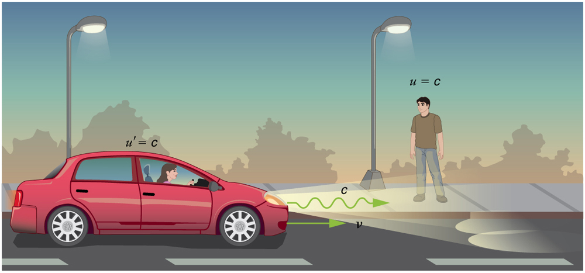

* Calculate relativistic velocity addition.
* Explain when relativistic velocity addition should be used instead of classical addition of velocities.
* Calculate relativistic Doppler shift.

 "){:}

If you’ve ever seen a kayak move down a fast-moving river, you know that remaining in the same place would be hard. The river current pulls the kayak along. Pushing the oars back against the water can move the kayak forward in the water, but that only accounts for part of the velocity. The kayak’s motion is an example of classical addition of velocities. In classical physics, velocities add as vectors. The kayak’s velocity is the vector sum of its velocity relative to the water and the water’s velocity relative to the riverbank.

# Classical Velocity Addition

For simplicity, we restrict our consideration of velocity addition to one-dimensional motion. Classically, velocities add like regular numbers in one-dimensional motion. (See [\[link\]](#fs-id1664936).) Suppose, for example, a girl is riding in a sled at a speed 1.0 m/s relative to an observer. She throws a snowball first forward, then backward at a speed of 1.5 m/s relative to the sled. We denote direction with plus and minus signs in one dimension; in this example, forward is positive. Let <math xmlns="http://www.w3.org/1998/Math/MathML"><semantics><mrow><mrow><mi>v</mi></mrow><mrow /></mrow><annotation encoding="StarMath 5.0"> size 12{v} {}</annotation></semantics></math>

 be the velocity of the sled relative to the Earth, <math xmlns="http://www.w3.org/1998/Math/MathML"><semantics><mrow><mrow><mi>u</mi></mrow><mrow /></mrow><annotation encoding="StarMath 5.0"> size 12{u} {}</annotation></semantics></math>

 the velocity of the snowball relative to the Earth-bound observer, and <math xmlns="http://www.w3.org/1998/Math/MathML"><semantics><mrow><mrow><mi>u</mi><mrow><mo>′</mo></mrow></mrow><mrow /></mrow><annotation encoding="StarMath 5.0"> size 12{u rSup { size 8{'} } } {}</annotation></semantics></math>

 the velocity of the snowball relative to the sled.

![In part a, a man is pulling a sled towards the right with a velocity v equals one point zero meters per second. A girl sitting on the sled facing forward throws a snowball toward a boy on the far right of the picture. The snowball is labeled u primed equals one point five meters per second in the direction the sled is being pulled. The boy is labelled two point five meters per second. In figure b, a similar figure is shown, but the man&#x2019;s velocity is one point zero meters per second, the girl is facing backward and throwing the snowball behind the sled. The snowball is labelled u primed equals negative one point five meters per second, and the boy is labelled u equals negative zero point five meters per second.](../resources/Figure_29_04_02a.jpg "Classically, velocities add like ordinary numbers in one-dimensional motion. Here the girl throws a snowball forward and then backward from a sled. The velocity of the sled relative to the Earth is v=1.0m/s size 12{ ital &quot;v=&quot;1 &quot;.&quot; 0`&quot;m/s&quot;} {}. The velocity of the snowball relative to the truck is u&#x2032; size 12{u rSup { size 8{'} } } {}, while its velocity relative to the Earth is u size 12{u} {}. Classically, u=v+u&#x2032;."){:}

Classical Velocity Addition

<math xmlns="http://www.w3.org/1998/Math/MathML"> <semantics> <mrow> <mrow> <mrow> <mstyle fontstyle="italic"> <mtext>u=v+u</mtext> </mstyle> <mrow> <mo>′</mo> </mrow> </mrow> </mrow> </mrow> </semantics> </math>

Thus, when the girl throws the snowball forward, <math xmlns="http://www.w3.org/1998/Math/MathML"><semantics><mrow><mrow><mrow><mrow><mi fontstyle="italic">u</mi><mo>=</mo><mn>1.0 m/s</mn><mo stretchy="false">+</mo><mn>1.5 m/s</mn><mo stretchy="false">=</mo><mn>2.5 m/s</mn></mrow></mrow></mrow></mrow></semantics></math>

. It makes good intuitive sense that the snowball will head towards the Earth-bound observer faster, because it is thrown forward from a moving vehicle. When the girl throws the snowball backward, <math xmlns="http://www.w3.org/1998/Math/MathML"><semantics><mrow><mrow><mrow><mi>u</mi><mo>=</mo><mn>1.0 m/s</mn><mrow><mrow><mo stretchy="false">+</mo><mo stretchy="false">(</mo></mrow><mo stretchy="false">−</mo><mn>1.5 m/s</mn></mrow><mrow><mo stretchy="false">)</mo><mo stretchy="false">=</mo><mrow><mo stretchy="false">−</mo><mn>0.5 m/s</mn></mrow></mrow></mrow></mrow></mrow></semantics></math>

. The minus sign means the snowball moves away from the Earth-bound observer.

# Relativistic Velocity Addition

The second postulate of relativity (verified by extensive experimental observation) says that classical velocity addition does not apply to light. Imagine a car traveling at night along a straight road, as in [\[link\]](#fs-id2834724). If classical velocity addition applied to light, then the light from the car’s headlights would approach the observer on the sidewalk at a speed <math xmlns="http://www.w3.org/1998/Math/MathML"><semantics><mrow><mrow><mstyle fontstyle="italic"><mrow><mtext>u=v+c</mtext></mrow></mstyle></mrow><mrow /></mrow><annotation encoding="StarMath 5.0"> size 12{ ital "u=v+c"} {}</annotation></semantics></math>

. But we know that light will move away from the car at speed <math xmlns="http://www.w3.org/1998/Math/MathML"><semantics><mrow><mrow><mi>c</mi></mrow><mrow /></mrow><annotation encoding="StarMath 5.0"> size 12{c} {}</annotation></semantics></math>

 relative to the driver of the car, and light will move towards the observer on the sidewalk at speed <math xmlns="http://www.w3.org/1998/Math/MathML"><semantics><mrow><mrow><mi>c</mi></mrow><mrow /></mrow><annotation encoding="StarMath 5.0"> size 12{c} {}</annotation></semantics></math>

, too.

 {:}

Relativistic Velocity Addition

Either light is an exception, or the classical velocity addition formula only works at low velocities. The latter is the case. The correct formula for one-dimensional **relativistic velocity addition**{: data-type="term" #import-auto-id1247638} is

<math xmlns="http://www.w3.org/1998/Math/MathML"><semantics><mrow><mrow><mrow><mrow><mi>u</mi><mo>=</mo></mrow><mfrac><mrow><mi fontstyle="italic">v+u</mi><mo>′</mo></mrow><mrow><mn>1</mn><mo stretchy="false">+</mo><mfrac><mrow><mi>v</mi><mi /><mrow><mstyle fontstyle="italic"><mtext>u</mtext></mstyle><mo>′</mo></mrow></mrow><msup><mi>c</mi><mrow><mn>2</mn></mrow></msup></mfrac></mrow></mfrac><mo>,</mo></mrow></mrow><mrow /></mrow><annotation encoding="StarMath 5.0"> size 12{ ital "u=" { { ital "v+u'"} over {1+ { {v` ital "u'"} over {c rSup { size 8{2} } } } } } } {}</annotation></semantics></math>

where <math xmlns="http://www.w3.org/1998/Math/MathML"><semantics><mrow><mrow><mi>v</mi></mrow><mrow /></mrow></semantics></math>

 is the relative velocity between two observers, <math xmlns="http://www.w3.org/1998/Math/MathML"><semantics><mrow><mrow><mi>u</mi></mrow><mrow /></mrow></semantics></math>

 is the velocity of an object relative to one observer, and <math xmlns="http://www.w3.org/1998/Math/MathML"><semantics><mrow><mrow><mi>u</mi><mrow><mo>′</mo></mrow></mrow><mrow /></mrow></semantics></math>

 is the velocity relative to the other observer. (For ease of visualization, we often choose to measure <math xmlns="http://www.w3.org/1998/Math/MathML"><semantics><mrow><mrow><mi>u</mi></mrow><mrow /></mrow></semantics></math>

 in our reference frame, while someone moving at <math xmlns="http://www.w3.org/1998/Math/MathML"><semantics><mrow><mrow><mi>v</mi></mrow><mrow /></mrow></semantics></math>

 relative to us measures <math xmlns="http://www.w3.org/1998/Math/MathML"><semantics><mrow><mrow><mi>u</mi><mo>′</mo></mrow><mrow /></mrow></semantics></math>

.) Note that the term <math xmlns="http://www.w3.org/1998/Math/MathML"><semantics><mrow><mfrac><mrow><mi>v</mi><mi fontstyle="italic">u</mi><mo>′</mo></mrow><msup><mi>c</mi><mn>2</mn></msup></mfrac></mrow></semantics></math>

 becomes very small at low velocities, and <math xmlns="http://www.w3.org/1998/Math/MathML"><semantics><mrow><mrow><mrow><mrow><mi>u</mi><mo>=</mo></mrow><mfrac><mrow><mi fontstyle="italic">v+u</mi><mo>′</mo></mrow><mrow><mn>1</mn><mo stretchy="false">+</mo><mfrac><mrow><mi>v</mi><mi /><mrow><mi>u</mi><mo>′</mo></mrow></mrow><msup><mi>c</mi><mrow><mn>2</mn></mrow></msup></mfrac></mrow></mfrac></mrow></mrow><mrow /></mrow></semantics></math>

 gives a result very close to classical velocity addition. As before, we see that classical velocity addition is an excellent approximation to the correct relativistic formula for small velocities. No wonder that it seems correct in our experience.

Showing that the Speed of Light towards an Observer is Constant (in a Vacuum): The Speed of Light is the Speed of Light

Suppose a spaceship heading directly towards the Earth at half the speed of light sends a signal to us on a laser-produced beam of light. Given that the light leaves the ship at speed <math xmlns="http://www.w3.org/1998/Math/MathML"><semantics><mrow><mrow><mi>c</mi></mrow><mrow /></mrow><annotation encoding="StarMath 5.0"> size 12{c} {}</annotation></semantics></math>

 as observed from the ship, calculate the speed at which it approaches the Earth.

{:}

**Strategy**

Because the light and the spaceship are moving at relativistic speeds, we cannot use simple velocity addition. Instead, we can determine the speed at which the light approaches the Earth using relativistic velocity addition.

**Solution**

1.  {: #import-auto-id2648482} Identify the knowns.
    <math xmlns="http://www.w3.org/1998/Math/MathML"><semantics><mrow><mrow><mrow><mstyle fontstyle="italic"><mrow><mtext>v=</mtext></mrow></mstyle><mn>0</mn><mtext>.</mtext><mtext>500</mtext><mi>c</mi></mrow></mrow><mrow /></mrow></semantics></math>
    
    ;
    <math xmlns="http://www.w3.org/1998/Math/MathML"><semantics><mrow><mrow><mrow><mi>u</mi><mo>′</mo><mrow><mo>=</mo><mi>c</mi></mrow></mrow></mrow><mrow /></mrow></semantics></math>

2.  {: #import-auto-id2656565} Identify the unknown.
    <math xmlns="http://www.w3.org/1998/Math/MathML"><semantics><mrow><mrow><mi>u</mi></mrow><mrow /></mrow><annotation encoding="StarMath 5.0"> size 12{u} {}</annotation></semantics></math>

3.  {: #import-auto-id1536985} Choose the appropriate equation.
    <math xmlns="http://www.w3.org/1998/Math/MathML"><semantics><mrow><mrow><mrow><mstyle fontstyle="italic"><mrow><mi>u</mi><mo>=</mo></mrow></mstyle><mfrac><mrow><mi fontstyle="italic">v+u</mi><mo>′</mo></mrow><mrow><mn>1</mn><mo stretchy="false">+</mo><mfrac><mrow><mi>v</mi><mi /><mrow><mi>u</mi><mo>′</mo></mrow></mrow><msup><mi>c</mi><mrow><mn>2</mn></mrow></msup></mfrac></mrow></mfrac></mrow></mrow><mrow /></mrow><annotation encoding="StarMath 5.0"> size 12{ ital "u=" { { ital "v+u'"} over {1+ { {v` ital "u'"} over {c rSup { size 8{2} } } } } } } {}</annotation></semantics></math>

4.  {: #import-auto-id1988559} Plug the knowns into the equation.
    

    <math xmlns="http://www.w3.org/1998/Math/MathML"><semantics><mrow><mrow><mrow><mtable columnalign="left"><mtr><mtd><mi>u</mi></mtd><mtd><mo>=</mo></mtd><mtd><mfrac><mrow><mi fontstyle="italic">v+u</mi><mo>′</mo></mrow><mrow><mn>1</mn><mo stretchy="false">+</mo><mfrac><mrow><mi>v</mi><mi /><mrow><mi fontstyle="italic">u</mi><mo>′</mo></mrow></mrow><msup><mi>c</mi><mn>2</mn></msup></mfrac></mrow></mfrac></mtd></mtr> <mtr><mtd /><mtd><mo>=</mo></mtd><mtd><mrow><mfrac><mrow><mtext>0.500</mtext><mi /><mrow><mi>c</mi><mo>+</mo><mi>c</mi></mrow></mrow><mrow><mn>1</mn><mo stretchy="false">+</mo><mfrac><mrow><mo stretchy="false">(</mo><mtext>0.500</mtext><mi>c</mi><mo stretchy="false">)</mo><mo stretchy="false">(</mo><mi>c</mi><mo stretchy="false">)</mo></mrow><msup><mi>c</mi><mrow><mn>2</mn></mrow></msup></mfrac></mrow></mfrac><mrow /></mrow></mtd></mtr> <mtr><mtd /><mtd><mo>=</mo></mtd><mtd><mrow><mfrac><mrow><mo stretchy="false">(</mo><mrow><mtext>0.500</mtext><mo stretchy="false">+</mo><mn>1</mn></mrow><mo stretchy="false">)</mo><mi /><mi>c</mi></mrow><mrow><mn>1</mn><mo stretchy="false">+</mo><mfrac><mrow><mtext>0.500</mtext><msup><mi>c</mi><mrow><mn>2</mn></mrow></msup></mrow><msup><mi>c</mi><mrow><mn>2</mn></mrow></msup></mfrac></mrow></mfrac><mrow /></mrow></mtd></mtr> <mtr><mtd /><mtd><mo>=</mo></mtd><mtd><mrow><mfrac><mrow><mtext>1.500</mtext><mi /><mi>c</mi></mrow><mrow><mrow><mn>1</mn><mo stretchy="false">+</mo></mrow><mtext>0.500</mtext></mrow></mfrac><mrow /></mrow></mtd></mtr> <mtr><mtd /><mtd><mo>=</mo></mtd><mtd><mrow><mfrac><mrow><mtext>1.500</mtext><mi /><mi>c</mi></mrow><mrow><mtext>1.500</mtext></mrow></mfrac><mrow /></mrow></mtd></mtr> <mtr><mtd /><mtd><mo>=</mo></mtd><mtd><mrow><mi>c</mi><mrow /></mrow></mtd></mtr></mtable></mrow></mrow><mrow /></mrow></semantics></math>
    

{: data-number-style="arabic"}

**Discussion**

Relativistic velocity addition gives the correct result. Light leaves the ship at speed <math xmlns="http://www.w3.org/1998/Math/MathML"><semantics><mrow><mrow><mi>c</mi></mrow><mrow /></mrow><annotation encoding="StarMath 5.0"> size 12{c} {}</annotation></semantics></math>

 and approaches the Earth at speed <math xmlns="http://www.w3.org/1998/Math/MathML"><semantics><mrow><mrow><mi>c</mi></mrow><mrow /></mrow><annotation encoding="StarMath 5.0"> size 12{c} {}</annotation></semantics></math>

. The speed of light is independent of the relative motion of source and observer, whether the observer is on the ship or Earth-bound.

Velocities cannot add to greater than the speed of light, provided that <math xmlns="http://www.w3.org/1998/Math/MathML"><semantics><mrow><mrow><mi>v</mi></mrow><mrow /></mrow><annotation encoding="StarMath 5.0"> size 12{v} {}</annotation></semantics></math>

 is less than <math xmlns="http://www.w3.org/1998/Math/MathML"><semantics><mrow><mrow><mi>c</mi></mrow><mrow /></mrow><annotation encoding="StarMath 5.0"> size 12{c} {}</annotation></semantics></math>

 and <math xmlns="http://www.w3.org/1998/Math/MathML"><semantics><mrow><mrow><mrow><mi>u</mi><mo>′</mo></mrow></mrow><mrow /></mrow></semantics></math>

 does not exceed <math xmlns="http://www.w3.org/1998/Math/MathML"><semantics><mrow><mrow><mi>c</mi></mrow><mrow /></mrow></semantics></math>

. The following example illustrates that relativistic velocity addition is not as symmetric as classical velocity addition.

Comparing the Speed of Light towards and away from an Observer: Relativistic Package Delivery

Suppose the spaceship in the previous example is approaching the Earth at half the speed of light and shoots a canister at a speed of <math xmlns="http://www.w3.org/1998/Math/MathML"><semantics><mrow><mrow><mn>0.750</mn><mi>c</mi></mrow><mrow /></mrow></semantics></math>

. (a) At what velocity will an Earth-bound observer see the canister if it is shot directly towards the Earth? (b) If it is shot directly away from the Earth? (See [\[link\]](#fs-id893371).)

{:}

**Strategy**

Because the canister and the spaceship are moving at relativistic speeds, we must determine the speed of the canister by an Earth-bound observer using relativistic velocity addition instead of simple velocity addition.

**Solution for (a)**

1.  {: #import-auto-id3108502} Identify the knowns.
    <math xmlns="http://www.w3.org/1998/Math/MathML"><semantics><mrow><mrow><mrow><mstyle fontstyle="italic"><mrow><mtext>v=</mtext></mrow></mstyle><mn>0.500</mn><mi>c</mi></mrow></mrow><mrow /></mrow></semantics></math>
    
    ;
    <math xmlns="http://www.w3.org/1998/Math/MathML"><semantics><mrow><mrow><mrow><mrow><mi>u</mi><mo>′</mo><mo stretchy="false">=</mo><mrow><mn>0</mn></mrow></mrow><mtext>.</mtext><mtext>750</mtext><mi>c</mi></mrow></mrow><mrow /></mrow><annotation encoding="StarMath 5.0"> size 12{u rSup { size 8{'} } = - 0 "." "750"c} {}</annotation></semantics></math>

2.  {: #import-auto-id1673308} Identify the unknown.
    <math xmlns="http://www.w3.org/1998/Math/MathML"><semantics><mrow><mrow><mi>u</mi></mrow><mrow /></mrow><annotation encoding="StarMath 5.0"> size 12{u} {}</annotation></semantics></math>

3.  {: #import-auto-id2595191} Choose the appropriate equation.
    <math xmlns="http://www.w3.org/1998/Math/MathML"><semantics><mrow><mrow><mrow><mstyle fontstyle="italic"><mrow><mtext>u=</mtext></mrow></mstyle><mfrac><mrow><mi fontstyle="italic">v+u</mi><mo>′</mo></mrow><mrow><mn>1</mn><mo stretchy="false">+</mo><mfrac><mrow><mi>v</mi><mi /><mrow><mi>u</mi><mo>′</mo></mrow></mrow><msup><mi>c</mi><mrow><mn>2</mn></mrow></msup></mfrac></mrow></mfrac></mrow></mrow><mrow /></mrow></semantics></math>

4.  {: #import-auto-id3179032} Plug the knowns into the equation.
    

    <math xmlns="http://www.w3.org/1998/Math/MathML"> <semantics> <mrow> <mrow> <mrow> <mtable columnalign="left"> <mtr><mtd> <mi fontstyle="italic">u</mi></mtd> <mtd><mo stretchy="false">=</mo></mtd> <mrow> <mfrac> <mrow> <mi fontstyle="italic">v+u</mi><mo>′</mo> </mrow> <mrow> <mn>1</mn> <mo stretchy="false">+</mo> <mfrac> <mrow> <mi>v</mi> <mrow> <mi>u</mi> <mo>′</mo> </mrow> </mrow> <msup> <mi>c</mi> <mrow> <mn>2</mn> </mrow> </msup> </mfrac> </mrow> </mfrac> </mrow> </mtr> <mtr><mtd /> <mtd><mo stretchy="false">=</mo></mtd> <mrow> <mfrac> <mrow> <mn>0.500</mn> <mstyle fontstyle="italic"> <mrow> <mtext>c +</mtext> </mrow> </mstyle> <mn>0.750</mn> <mi>c</mi> </mrow> <mrow> <mn>1</mn> <mo stretchy="false">+</mo> <mfrac> <mrow> <mo stretchy="false">(</mo> <mn>0.500</mn> <mi>c</mi> <mo stretchy="false">)</mo> <mo stretchy="false">(</mo> <mn>0.750</mn> <mi>c</mi> <mo stretchy="false">)</mo> </mrow> <msup> <mi>c</mi> <mrow> <mn>2</mn> </mrow> </msup> </mfrac> </mrow> </mfrac> </mrow> </mtr> <mtr><mtd /><mtd><mo stretchy="false">=</mo></mtd> <mrow> <mfrac> <mrow> <mn>1.250</mn> <mi>c</mi> </mrow> <mrow> <mrow> <mn>1</mn> <mo stretchy="false">+</mo> <mn>0.375</mn> </mrow> </mrow> </mfrac> </mrow> </mtr> <mtr><mtd /><mtd><mo stretchy="false">=</mo></mtd> <mrow> <mn>0.909</mn> <mi>c</mi> </mrow> </mtr> </mtable> </mrow> </mrow> </mrow> </semantics> </math>
    

{: data-number-style="arabic"}

**Solution for (b)**

1.  {: #import-auto-id2693456} Identify the knowns.
    <math xmlns="http://www.w3.org/1998/Math/MathML"><semantics><mrow><mrow><mrow><mrow><mtext fontstyle="italic">v</mtext><mo>=</mo></mrow><mn>0.500</mn><mi>c</mi></mrow></mrow></mrow></semantics></math>
    
    ;
    <math xmlns="http://www.w3.org/1998/Math/MathML"><semantics><mrow><mrow><mrow><mrow><mi>u</mi><mo>′</mo><mo stretchy="false">=</mo><mrow><mo stretchy="false">−</mo><mn>0.750</mn></mrow></mrow><mi>c</mi></mrow></mrow><mrow /></mrow></semantics></math>

2.  {: #import-auto-id2689780} Identify the unknown.
    <math xmlns="http://www.w3.org/1998/Math/MathML"><semantics><mrow><mrow><mi>u</mi></mrow><mrow /></mrow></semantics></math>

3.  {: #import-auto-id1745740} Choose the appropriate equation.
    <math xmlns="http://www.w3.org/1998/Math/MathML"><semantics><mrow><mrow><mrow><mrow><mtext fontstyle="italic">u</mtext><mo>=</mo></mrow><mfrac><mrow><mi fontstyle="italic">v+u</mi><mo>′</mo></mrow><mrow><mn>1</mn><mo stretchy="false">+</mo><mfrac><mrow><mi>v</mi><mrow><mtext fontstyle="italic">u</mtext><mo>′</mo></mrow></mrow><msup><mi>c</mi><mrow><mn>2</mn></mrow></msup></mfrac></mrow></mfrac></mrow></mrow><mrow /></mrow></semantics></math>

4.  {: #import-auto-id2677611} Plug the knowns into the equation.
    

    <math xmlns="http://www.w3.org/1998/Math/MathML"> <semantics> <mrow> <mrow> <mrow> <mtable columnalign="left"> <mtr> <mtd> <mi fontstyle="italic">u</mi></mtd><mtd><mo>=</mo></mtd> <mrow> <mfrac> <mrow> <mi fontstyle="italic">v+u</mi><mo>′</mo></mrow> <mrow> <mn>1</mn> <mo stretchy="false">+</mo> <mfrac> <mrow> <mi>v</mi> <mi /> <mrow> <mi fontstyle="italic">u</mi><mo>′</mo> </mrow> </mrow> <msup> <mi>c</mi> <mrow> <mn>2</mn> </mrow> </msup> </mfrac> </mrow> </mfrac> <mrow /> </mrow> </mtr> <mtr><mtd /> <mtd> <mo>=</mo></mtd> <mrow> <mfrac> <mrow> <mn>0.500</mn> <mrow> <mi fontstyle="italic">c +</mi> </mrow> <mrow> <mo stretchy="false">(</mo> <mo stretchy="false">−</mo> <mn>0.750</mn> <mi>c</mi> </mrow> <mo stretchy="false">)</mo> </mrow> <mrow> <mn>1</mn> <mo stretchy="false">+</mo> <mfrac> <mrow> <mo stretchy="false">(</mo> <mn>0.500</mn> <mi>c</mi> <mo stretchy="false">)</mo> <mrow> <mo stretchy="false">(</mo> <mo stretchy="false">−</mo> <mn>0.750</mn> </mrow> <mi>c</mi> <mo stretchy="false">)</mo> </mrow> <msup> <mi>c</mi> <mrow> <mn>2</mn> </mrow> </msup> </mfrac> </mrow> </mfrac> </mrow> </mtr> <mtr><mtd /> <mtd> <mo>=</mo></mtd> <mrow> <mfrac> <mrow> <mrow> <mo stretchy="false">−</mo> <mn>0.250</mn> </mrow> <mi>c</mi> </mrow> <mrow> <mrow> <mn>1</mn> <mo stretchy="false">−</mo> <mn>0.375</mn> </mrow> </mrow> </mfrac> </mrow> </mtr> <mtr><mtd /> <mtd> <mo>=</mo></mtd> <mrow><mo stretchy="false">−</mo> <mn>0.400</mn> <mi>c</mi> </mrow> </mtr> </mtable> </mrow> </mrow> </mrow> </semantics> </math>
    

{: data-number-style="arabic"}

**Discussion**

The minus sign indicates velocity away from the Earth (in the opposite direction from <math xmlns="http://www.w3.org/1998/Math/MathML"><semantics><mrow><mrow><mi>v</mi></mrow><mrow /></mrow></semantics></math>

), which means the canister is heading towards the Earth in part (a) and away in part (b), as expected. But relativistic velocities do not add as simply as they do classically. In part (a), the canister does approach the Earth faster, but not at the simple sum of <math xmlns="http://www.w3.org/1998/Math/MathML"><semantics><mrow><mrow><mn>1.250</mn><mi>c</mi></mrow><mrow /></mrow></semantics></math>

. The total velocity is less than you would get classically. And in part (b), the canister moves away from the Earth at a velocity of <math xmlns="http://www.w3.org/1998/Math/MathML"><semantics><mrow><mrow><mo stretchy="false">−</mo><mn>0.400</mn><mi>c</mi></mrow><mrow /></mrow></semantics></math>

, which is **faster** than the <math xmlns="http://www.w3.org/1998/Math/MathML"><semantics><mrow><mrow><mn>−0.250</mn><mi>c</mi></mrow></mrow><annotation encoding="StarMath 5.0"> size 12{c} {}</annotation></semantics></math>

 you would expect classically. The velocities are not even symmetric. In part (a) the canister moves <math xmlns="http://www.w3.org/1998/Math/MathML"><semantics><mrow><mrow><mn>0.409</mn><mi>c</mi></mrow><mrow /></mrow><annotation encoding="StarMath 5.0"> size 12{c} {}</annotation></semantics></math>

 faster than the ship relative to the Earth, whereas in part (b) it moves <math xmlns="http://www.w3.org/1998/Math/MathML"><semantics><mrow><mrow><mn>0.900</mn><mi>c</mi></mrow><mrow /></mrow><annotation encoding="StarMath 5.0"> size 12{c} {}</annotation></semantics></math>

 slower than the ship.

# Doppler Shift

Although the speed of light does not change with relative velocity, the frequencies and wavelengths of light do. First discussed for sound waves, a Doppler shift occurs in any wave when there is relative motion between source and observer.

Relativistic Doppler Effects

The observed wavelength of electromagnetic radiation is longer (called a red shift) than that emitted by the source when the source moves away from the observer and shorter (called a blue shift) when the source moves towards the observer.

<math xmlns="http://www.w3.org/1998/Math/MathML"><semantics><mrow><mrow><mrow><msub><mtext>=λ</mtext><mrow><mtext>obs</mtext></mrow></msub><mstyle fontstyle="italic"><mrow><msub><mtext>=λ</mtext><mrow><mi>s</mi></mrow></msub></mrow></mstyle><msqrt><mfrac><mrow><mn>1</mn><mo stretchy="false">+</mo><mfrac><mi>u</mi><mi>c</mi></mfrac></mrow><mrow><mn>1</mn><mo stretchy="false">−</mo><mfrac><mi>u</mi><mi>c</mi></mfrac></mrow></mfrac></msqrt><mo>.</mo></mrow></mrow><mrow /></mrow><annotation encoding="StarMath 5.0"> size 12{λ rSub { size 8{"obs"} } ital "=λ" rSub { size 8{s} } sqrt { { {1+ { {u} over {c} } } over {1 - { {u} over {c} } } } } } {}</annotation></semantics></math>

In the Doppler equation, <math xmlns="http://www.w3.org/1998/Math/MathML"><semantics><mrow><mrow><msub><mi>λ</mi><mrow><mtext>obs</mtext></mrow></msub></mrow><mrow /></mrow><annotation encoding="StarMath 5.0"> size 12{λ rSub { size 8{"obs"} } } {}</annotation></semantics></math>

 is the observed wavelength, <math xmlns="http://www.w3.org/1998/Math/MathML"><semantics><mrow><mrow><msub><mi>λ</mi><mrow><mi>s</mi></mrow></msub></mrow><mrow /></mrow><annotation encoding="StarMath 5.0"> size 12{λ rSub { size 8{s} } } {}</annotation></semantics></math>

 is the source wavelength, and <math xmlns="http://www.w3.org/1998/Math/MathML"><semantics><mrow><mrow><mi>u</mi></mrow><mrow /></mrow><annotation encoding="StarMath 5.0"> size 12{u} {}</annotation></semantics></math>

 is the relative velocity of the source to the observer. The velocity <math xmlns="http://www.w3.org/1998/Math/MathML"><semantics><mrow><mrow><mi>u</mi></mrow><mrow /></mrow><annotation encoding="StarMath 5.0"> size 12{u} {}</annotation></semantics></math>

 is positive for motion away from an observer and negative for motion toward an observer. In terms of source frequency and observed frequency, this equation can be written

<math xmlns="http://www.w3.org/1998/Math/MathML"><semantics><mrow><mrow><mrow><msub><mi>f</mi><mrow><mtext>obs</mtext></mrow></msub><mstyle fontstyle="italic"><mrow><msub><mtext>=f</mtext><mrow><mi>s</mi></mrow></msub></mrow></mstyle><msqrt><mfrac><mrow><mn>1</mn><mo stretchy="false">−</mo><mfrac><mi>u</mi><mi>c</mi></mfrac></mrow><mrow><mn>1</mn><mo stretchy="false">+</mo><mfrac><mi>u</mi><mi>c</mi></mfrac></mrow></mfrac></msqrt><mo>.</mo></mrow></mrow><mrow /></mrow><annotation encoding="StarMath 5.0"> size 12{f rSub { size 8{"obs"} } ital "=f" rSub { size 8{s} } sqrt { { {1 - { {u} over {c} } } over {1+ { {u} over {c} } } } } } {}</annotation></semantics></math>

Notice that the – and + signs are different than in the wavelength equation.

Career Connection: Astronomer

If you are interested in a career that requires a knowledge of special relativity, there’s probably no better connection than astronomy. Astronomers must take into account relativistic effects when they calculate distances, times, and speeds of black holes, galaxies, quasars, and all other astronomical objects. To have a career in astronomy, you need at least an undergraduate degree in either physics or astronomy, but a Master’s or doctoral degree is often required. You also need a good background in high-level mathematics.

Calculating a Doppler Shift: Radio Waves from a Receding Galaxy

Suppose a galaxy is moving away from the Earth at a speed <math xmlns="http://www.w3.org/1998/Math/MathML"> <semantics> <mrow> <mrow> <mrow> <mtext>0.825</mtext> <mi>c</mi> </mrow> </mrow> </mrow> </semantics> </math>

 . It emits radio waves with a wavelength of <math xmlns="http://www.w3.org/1998/Math/MathML"><semantics><mrow><mrow><mrow><mn>0</mn><mtext>.</mtext><mtext>525</mtext><mspace width="0.25em" /><mtext>m</mtext></mrow></mrow><mrow /></mrow><annotation encoding="StarMath 5.0"> size 12{0 "." "525"" m"} {}</annotation></semantics></math>

. What wavelength would we detect on the Earth?

**Strategy**

Because the galaxy is moving at a relativistic speed, we must determine the Doppler shift of the radio waves using the relativistic Doppler shift instead of the classical Doppler shift.

**Solution**

1.  {: #import-auto-id2647788} Identify the knowns.
    <math xmlns="http://www.w3.org/1998/Math/MathML"> <semantics> <mrow> <mrow> <mrow> <mstyle fontstyle="italic"> <mrow> <mtext>u=</mtext> </mrow> </mstyle> <mn>0</mn> <mtext>.</mtext> <mtext>825</mtext> <mi>c</mi> </mrow> </mrow> <mrow /> </mrow> <annotation encoding="StarMath 5.0"> size 12{ ital "u="0 "." "825"c} {}</annotation> </semantics> </math>
    
    ;
    <math xmlns="http://www.w3.org/1998/Math/MathML"><semantics><mrow><mrow><mrow><mrow><msub><mi>λ</mi><mrow><mi>s</mi></mrow></msub><mo stretchy="false">=</mo><mn>0</mn></mrow><mtext>.</mtext><mtext>525</mtext><mspace width="0.25em" /><mi>m</mi></mrow></mrow><mrow /></mrow><annotation encoding="StarMath 5.0"> size 12{λ rSub { size 8{s} } =0 "." "525"`m} {}</annotation></semantics></math>

2.  {: #import-auto-id2512439} Identify the unknown.
    <math xmlns="http://www.w3.org/1998/Math/MathML"><semantics><mrow><mrow><msub><mi>λ</mi><mrow><mtext>obs</mtext></mrow></msub></mrow><mrow /></mrow><annotation encoding="StarMath 5.0"> size 12{λ rSub { size 8{"obs"} } } {}</annotation></semantics></math>

3.  {: #import-auto-id1290179} Choose the appropriate equation.
    <math xmlns="http://www.w3.org/1998/Math/MathML"><semantics><mrow><mrow><mrow><msub><mi>λ</mi><mrow><mtext>obs</mtext></mrow></msub><mstyle fontstyle="italic"><mrow><msub><mtext>=λ</mtext><mrow><mi>s</mi></mrow></msub></mrow></mstyle><msqrt><mfrac><mrow><mn>1</mn><mo stretchy="false">+</mo><mfrac><mi>u</mi><mi>c</mi></mfrac></mrow><mrow><mn>1</mn><mo stretchy="false">−</mo><mfrac><mi>u</mi><mi>c</mi></mfrac></mrow></mfrac></msqrt></mrow></mrow><mrow /></mrow><annotation encoding="StarMath 5.0"> size 12{λ rSub { size 8{"obs"} } ital "=λ" rSub { size 8{s} } sqrt { { {1+ { {u} over {c} } } over {1 - { {u} over {c} } } } } } {}</annotation></semantics></math>

4.  {: #import-auto-id1951392} Plug the knowns into the equation.
    

    <math xmlns="http://www.w3.org/1998/Math/MathML"><semantics><mrow><mrow><mtable columnalign="left"> <mtr><mtd> <msub><mi>λ</mi><mtext>obs</mtext></msub></mtd> <mtd><mo stretchy="false">=</mo> </mtd> <mtd> <mrow><mrow><mrow><mstyle fontstyle="italic"><mrow><msub><mtext>λ</mtext><mrow><mi>s</mi></mrow></msub></mrow></mstyle><msqrt><mfrac><mrow><mn>1</mn><mo stretchy="false">+</mo><mfrac><mi>u</mi><mi>c</mi></mfrac></mrow><mrow><mn>1</mn><mo stretchy="false">−</mo><mfrac><mi>u</mi><mi>c</mi></mfrac></mrow></mfrac></msqrt></mrow></mrow><mrow /></mrow></mtd></mtr> <mtr><mtd /><mtd><mo stretchy="false">=</mo></mtd> <mtd> <mrow><mo stretchy="false">(</mo><mn>0.525 m</mn><mo stretchy="false">)</mo><msqrt><mfrac><mrow><mn>1</mn><mo stretchy="false">+</mo><mfrac><mrow><mn>0</mn><mtext>.</mtext><mtext>825</mtext><mstyle fontstyle="italic"><mrow><mtext> c</mtext></mrow></mstyle></mrow><mi>c</mi></mfrac></mrow><mrow><mn>1</mn><mo stretchy="false">−</mo><mfrac><mrow><mn>0</mn><mtext>.</mtext><mtext>825</mtext><mstyle fontstyle="italic"><mrow><mtext> c</mtext></mrow></mstyle></mrow><mi>c</mi></mfrac></mrow></mfrac></msqrt><mrow /></mrow></mtd></mtr> <mtr><mtd /><mtd><mo stretchy="false">=</mo></mtd> <mtd><mrow><mtext>1.70 m.</mtext></mrow></mtd></mtr></mtable><mrow /></mrow></mrow></semantics></math>
    

{: data-number-style="arabic"}

**Discussion**

Because the galaxy is moving away from the Earth, we expect the wavelengths of radiation it emits to be redshifted. The wavelength we calculated is 1.70 m, which is redshifted from the original wavelength of 0.525 m.

The relativistic Doppler shift is easy to observe. This equation has everyday applications ranging from Doppler-shifted radar velocity measurements of transportation to Doppler-radar storm monitoring. In astronomical observations, the relativistic Doppler shift provides velocity information such as the motion and distance of stars.

Check Your Understanding

Suppose a space probe moves away from the Earth at a speed <math xmlns="http://www.w3.org/1998/Math/MathML"> <semantics> <mrow> <mrow> <mrow> <mn>0</mn> <mtext>.</mtext> <mtext>350</mtext> <mi>c</mi> </mrow> </mrow> <mrow /> </mrow> <annotation encoding="StarMath 5.0"> size 12{0 "." "350"c} {}</annotation> </semantics> </math>

. It sends a radio wave message back to the Earth at a frequency of 1.50 GHz. At what frequency is the message received on the Earth?

Answer

<math xmlns="http://www.w3.org/1998/Math/MathML"> <semantics> <mrow> <mrow> <mrow> <msub> <mi>f</mi> <mrow> <mtext>obs</mtext> </mrow> </msub> <mstyle fontstyle="italic"> <mrow> <msub> <mtext>=f</mtext> <mrow> <mi>s</mi> </mrow> </msub> </mrow> </mstyle> <mrow> <msqrt> <mfrac> <mrow> <mn>1</mn> <mo stretchy="false">−</mo> <mfrac> <mi>u</mi> <mi>c</mi> </mfrac> </mrow> <mrow> <mn>1</mn> <mo stretchy="false">+</mo> <mfrac> <mi>u</mi> <mi>c</mi> </mfrac> </mrow> </mfrac> </msqrt> <mo stretchy="false">=</mo> <mo stretchy="false">(</mo> </mrow> <mn>1</mn> <mtext>.</mtext> <mtext>50 GHz</mtext> <mo stretchy="false">)</mo> <mrow> <msqrt> <mfrac> <mrow> <mn>1</mn> <mo stretchy="false">−</mo> <mfrac> <mrow> <mn>0</mn> <mtext>.</mtext> <mtext>350</mtext> <mstyle fontstyle="italic"> <mrow> <mtext> c</mtext> </mrow> </mstyle> </mrow> <mi>c</mi> </mfrac> </mrow> <mrow> <mn>1</mn> <mo stretchy="false">+</mo> <mfrac> <mrow> <mn>0</mn> <mtext>.</mtext> <mtext>350</mtext> <mstyle fontstyle="italic"> <mrow> <mtext> c</mtext> </mrow> </mstyle> </mrow> <mi>c</mi> </mfrac> </mrow> </mfrac> </msqrt> <mo stretchy="false">=</mo> <mn>1</mn> </mrow> <mtext>.</mtext> <mtext>04 GHz</mtext> </mrow> </mrow> <mrow /> </mrow> <annotation encoding="StarMath 5.0"> size 12{f rSub { size 8{"obs"} } ital "=f" rSub { size 8{s} } sqrt { { {1 - { {u} over {c} } } over {1+ { {u} over {c} } } } } = \( 1 "." "50 GHz" \) sqrt { { {1 - { {0 "." "350" ital " c"} over {c} } } over {1+ { {0 "." "350" ital " c"} over {c} } } } } =1 "." "04 GHz"} {}</annotation> </semantics> </math>

# Section Summary

* {: #import-auto-id1562297} With classical velocity addition, velocities add like regular numbers in one-dimensional motion:
  <math xmlns="http://www.w3.org/1998/Math/MathML"><semantics><mrow><mrow><mrow><mtext fontstyle="italic">u=v+u</mtext><mrow><mo>′</mo></mrow></mrow></mrow><mrow /></mrow><annotation encoding="StarMath 5.0"> size 12{ ital "u=v+u" rSup { size 8{'} } } {}</annotation></semantics></math>
  
  , where
  <math xmlns="http://www.w3.org/1998/Math/MathML"><semantics><mrow><mrow><mi>v</mi></mrow><mrow /></mrow><annotation encoding="StarMath 5.0"> size 12{v} {}</annotation></semantics></math>
  
  is the velocity between two observers,
  <math xmlns="http://www.w3.org/1998/Math/MathML"><semantics><mrow><mrow><mi>u</mi></mrow><mrow /></mrow><annotation encoding="StarMath 5.0"> size 12{u} {}</annotation></semantics></math>
  
  is the velocity of an object relative to one observer, and
  <math xmlns="http://www.w3.org/1998/Math/MathML"><semantics><mrow><mrow><mi>u</mi><mo>′</mo></mrow><mrow /></mrow><annotation encoding="StarMath 5.0"> size 12{u rSup { size 8{'} } } {}</annotation></semantics></math>
  
  is the velocity relative to the other observer.
* {: #import-auto-id1618594} Velocities cannot add to be greater than the speed of light. Relativistic velocity addition describes the velocities of an object moving at a relativistic speed:
  

  <math xmlns="http://www.w3.org/1998/Math/MathML"> <semantics> <mrow> <mrow> <mrow> <mstyle fontstyle="italic"> <mrow> <mtext>u=</mtext> </mrow> </mstyle> <mfrac> <mrow> <mtext fontstyle="italic">v+u</mtext><mo>′</mo> </mrow> <mrow> <mn>1</mn> <mo stretchy="false">+</mo> <mfrac> <mrow> <mi>v</mi> <mrow> <mtext fontstyle="italic">u</mtext><mo>′</mo> </mrow> </mrow> <msup> <mi>c</mi> <mrow> <mn>2</mn> </mrow> </msup> </mfrac> </mrow> </mfrac> </mrow> </mrow> </mrow> </semantics> </math>
  

* An observer of electromagnetic radiation sees **relativistic Doppler effects**{: data-type="term"} if the source of the radiation is moving relative to the observer. The wavelength of the radiation is longer (called a red shift) than that emitted by the source when the source moves away from the observer and shorter (called a blue shift) when the source moves toward the observer. The shifted wavelength is described by the equation
  

  <math xmlns="http://www.w3.org/1998/Math/MathML"> <semantics> <mrow> <mrow> <mrow> <msub> <mi>λ</mi> <mrow> <mtext>obs</mtext> </mrow> </msub> <mstyle fontstyle="italic"> <mrow> <msub> <mtext>=λ</mtext> <mrow> <mi>s</mi> </mrow> </msub> </mrow> </mstyle> <msqrt> <mfrac> <mrow> <mn>1</mn> <mo stretchy="false">+</mo> <mfrac> <mi>u</mi> <mi>c</mi> </mfrac> </mrow> <mrow> <mn>1</mn> <mo stretchy="false">−</mo> <mfrac> <mi>u</mi> <mi>c</mi> </mfrac> </mrow> </mfrac> </msqrt> </mrow> </mrow> <mrow /> </mrow> <annotation encoding="StarMath 5.0"> size 12{λ rSub { size 8{"obs"} } ital "=λ" rSub { size 8{s} } sqrt { { {1+ { {u} over {c} } } over {1 - { {u} over {c} } } } } } {}</annotation> </semantics> </math>
  

  
  <math xmlns="http://www.w3.org/1998/Math/MathML"><semantics><mrow><mrow><msub><mi>λ</mi><mrow><mtext>obs</mtext></mrow></msub></mrow><mrow /></mrow><annotation encoding="StarMath 5.0"> size 12{λ rSub { size 8{"obs"} } } {}</annotation></semantics></math>
  
  is the observed wavelength,
  <math xmlns="http://www.w3.org/1998/Math/MathML"><semantics><mrow><mrow><msub><mi>λ</mi><mrow><mi>s</mi></mrow></msub></mrow><mrow /></mrow><annotation encoding="StarMath 5.0"> size 12{λ rSub { size 8{s} } } {}</annotation></semantics></math>
  
  is the source wavelength, and
  <math xmlns="http://www.w3.org/1998/Math/MathML"><semantics><mrow><mrow><mi>u</mi></mrow><mrow /></mrow><annotation encoding="StarMath 5.0"> size 12{u} {}</annotation></semantics></math>
  
  is the relative velocity of the source to the observer.

# Conceptual Questions

Explain the meaning of the terms “red shift” and “blue shift” as they relate to the relativistic Doppler effect.

What happens to the relativistic Doppler effect when relative velocity is zero? Is this the expected result?

Is the relativistic Doppler effect consistent with the classical Doppler effect in the respect that <math xmlns="http://www.w3.org/1998/Math/MathML"><semantics><mrow><mrow><msub><mi>λ</mi><mrow><mtext>obs</mtext></mrow></msub></mrow><mrow /></mrow><annotation encoding="StarMath 5.0"> size 12{λ rSub { size 8{"obs"} } } {}</annotation></semantics></math>

 is larger for motion away?

All galaxies farther away than about <math xmlns="http://www.w3.org/1998/Math/MathML"><semantics><mrow><mrow><mrow><mrow><mtext>50</mtext><mo stretchy="false">×</mo><msup><mtext>10</mtext><mrow><mn>6 </mn></mrow></msup></mrow><mspace width="0.25em" /><mtext>ly</mtext></mrow></mrow><mrow /></mrow><annotation encoding="StarMath 5.0"> size 12{"50" times "10" rSup { size 8{6} } `"ly"} {}</annotation></semantics></math>

 exhibit a red shift in their emitted light that is proportional to distance, with those farther and farther away having progressively greater red shifts. What does this imply, assuming that the only source of red shift is relative motion? (Hint: At these large distances, it is space itself that is expanding, but the effect on light is the same.)

# Problems &amp; Exercises

Suppose a spaceship heading straight towards the Earth at <math xmlns="http://www.w3.org/1998/Math/MathML"><semantics><mrow><mrow><mrow><mn>0</mn><mtext>.</mtext><mtext>750</mtext><mi>c</mi></mrow></mrow><mrow /></mrow><annotation encoding="StarMath 5.0"> size 12{0 "." "750"c} {}</annotation></semantics></math>

 can shoot a canister at <math xmlns="http://www.w3.org/1998/Math/MathML"><semantics><mrow><mrow><mrow><mn>0</mn><mtext>.</mtext><mtext>500</mtext><mi>c</mi></mrow></mrow><mrow /></mrow><annotation encoding="StarMath 5.0"> size 12{0 "." "750"c} {}</annotation></semantics></math>

 relative to the ship. (a) What is the velocity of the canister relative to the Earth, if it is shot directly at the Earth? (b) If it is shot directly away from the Earth?

(a) <math xmlns="http://www.w3.org/1998/Math/MathML"><semantics><mrow><mrow><mrow><mn>0</mn><mtext>.</mtext><mtext>909</mtext><mi>c</mi></mrow></mrow><mrow /></mrow><annotation encoding="StarMath 5.0"> size 12{0 "." "909"c} {}</annotation></semantics></math>

(b) <math xmlns="http://www.w3.org/1998/Math/MathML"><semantics><mrow><mrow><mrow><mn>0</mn><mtext>.</mtext><mtext>400</mtext><mi>c</mi></mrow></mrow><mrow /></mrow><annotation encoding="StarMath 5.0"> size 12{0 "." "400"c} {}</annotation></semantics></math>

Repeat the previous problem with the ship heading directly away from the Earth.

If a spaceship is approaching the Earth at <math xmlns="http://www.w3.org/1998/Math/MathML"><semantics><mrow><mrow><mrow><mn>0.100</mn><mi>c</mi></mrow></mrow></mrow></semantics></math>

 and a message capsule is sent toward it at <math xmlns="http://www.w3.org/1998/Math/MathML"><semantics><mrow><mrow><mrow><mn>0.100</mn><mi>c</mi></mrow></mrow></mrow></semantics></math>

 relative to the Earth, what is the speed of the capsule relative to the ship?

<math xmlns="http://www.w3.org/1998/Math/MathML"> <semantics> <mrow> <mrow> <mrow> <mn>0</mn> <mtext>.</mtext> <mtext>198</mtext> <mi>c</mi> </mrow> </mrow> <mrow /> </mrow> <annotation encoding="StarMath 5.0"> size 12{0 "." "198"c} {}</annotation> </semantics> </math>

(a) Suppose the speed of light were only <math xmlns="http://www.w3.org/1998/Math/MathML"><semantics><mrow><mrow><mrow><mtext>3000 m/s</mtext></mrow></mrow><mrow /></mrow></semantics></math>

. A jet fighter moving toward a target on the ground at <math xmlns="http://www.w3.org/1998/Math/MathML"><semantics><mrow><mrow><mrow><mtext>800 m/s</mtext></mrow></mrow><mrow /></mrow></semantics></math>

 shoots bullets, each having a muzzle velocity of <math xmlns="http://www.w3.org/1998/Math/MathML"><semantics><mrow><mrow><mrow><mtext>1000 m/s</mtext></mrow></mrow><mrow /></mrow></semantics></math>

. What are the bullets’ velocity relative to the target? (b) If the speed of light was this small, would you observe relativistic effects in everyday life? Discuss.

If a galaxy moving away from the Earth has a speed of <math xmlns="http://www.w3.org/1998/Math/MathML"><semantics><mrow><mrow><mrow><mn>1000 km/s</mn></mrow></mrow><mrow /></mrow><annotation encoding="StarMath 5.0"> size 12{1,"000"" m/s"} {}</annotation></semantics></math>

 and emits <math xmlns="http://www.w3.org/1998/Math/MathML"><semantics><mrow><mrow><mrow><mtext>656 nm</mtext></mrow></mrow><mrow /></mrow><annotation encoding="StarMath 5.0"> size 12{"656"" nm"} {}</annotation></semantics></math>

 light characteristic of hydrogen (the most common element in the universe). (a) What wavelength would we observe on the Earth? (b) What type of electromagnetic radiation is this? (c) Why is the speed of the Earth in its orbit negligible here?

a) <math xmlns="http://www.w3.org/1998/Math/MathML"><semantics><mrow><mrow><mrow><mtext>658 nm</mtext></mrow></mrow><mrow /></mrow><annotation encoding="StarMath 5.0"> size 12{"658""nm"} {}</annotation></semantics></math>

b) red

c) <math xmlns="http://www.w3.org/1998/Math/MathML"><semantics><mrow><mrow><mrow><mrow><mi>v</mi><mo stretchy="false">/</mo><mstyle fontstyle="italic"><mrow><mtext>c</mtext><mo>=</mo></mrow></mstyle></mrow><mn>9</mn><mtext>.</mtext><mrow><mtext>92</mtext><mo stretchy="false">×</mo><msup><mtext>10</mtext><mrow><mrow><mo stretchy="false">−</mo><mn>5</mn></mrow></mrow></msup></mrow></mrow></mrow><mrow /></mrow><annotation encoding="StarMath 5.0"> size 12{v/ ital "c="9 "." "92" times "10" rSup { size 8{ - 5} } } {}</annotation></semantics></math>

 (negligible)

A space probe speeding towards the nearest star moves at <math xmlns="http://www.w3.org/1998/Math/MathML"><semantics><mrow><mrow><mrow><mn>0</mn><mtext>.</mtext><mtext>250</mtext><mi>c</mi></mrow></mrow><mrow /></mrow><annotation encoding="StarMath 5.0"> size 12{0 "." "250"c} {}</annotation></semantics></math>

 and sends radio information at a broadcast frequency of 1.00 GHz. What frequency is received on the Earth?

If two spaceships are heading directly towards each other at <math xmlns="http://www.w3.org/1998/Math/MathML"><semantics><mrow><mrow><mrow><mn>0</mn><mtext>.</mtext><mtext>800</mtext><mi>c</mi></mrow></mrow><mrow /></mrow><annotation encoding="StarMath 5.0"> size 12{0 "." "800"c} {}</annotation></semantics></math>

, at what speed must a canister be shot from the first ship to approach the other at <math xmlns="http://www.w3.org/1998/Math/MathML"><semantics><mrow><mrow><mrow><mn>0</mn><mtext>.</mtext><mtext>999</mtext><mi>c</mi></mrow></mrow><mrow /></mrow><annotation encoding="StarMath 5.0"> size 12{0 "." "999"c} {}</annotation></semantics></math>

 as seen by the second ship?

<math xmlns="http://www.w3.org/1998/Math/MathML"> <semantics> <mrow> <mrow> <mrow> <mn>0</mn> <mtext>.</mtext> <mtext>991</mtext> <mi>c</mi> </mrow> </mrow> <mrow /> </mrow> <annotation encoding="StarMath 5.0"> size 12{0 "." "991"c} {}</annotation> </semantics> </math>

Two planets are on a collision course, heading directly towards each other at <math xmlns="http://www.w3.org/1998/Math/MathML"><semantics><mrow><mrow><mrow><mn>0</mn><mtext>.</mtext><mtext>250</mtext><mi>c</mi></mrow></mrow><mrow /></mrow><annotation encoding="StarMath 5.0"> size 12{0 "." "250"c} {}</annotation></semantics></math>

. A spaceship sent from one planet approaches the second at <math xmlns="http://www.w3.org/1998/Math/MathML"><semantics><mrow><mrow><mrow><mn>0</mn><mtext>.</mtext><mtext>750</mtext><mi>c</mi></mrow></mrow><mrow /></mrow><annotation encoding="StarMath 5.0"> size 12{0 "." "750"c} {}</annotation></semantics></math>

 as seen by the second planet. What is the velocity of the ship relative to the first planet?

When a missile is shot from one spaceship towards another, it leaves the first at <math xmlns="http://www.w3.org/1998/Math/MathML"><semantics><mrow><mrow><mrow><mn>0</mn><mtext>.</mtext><mtext>950</mtext><mi>c</mi></mrow></mrow><mrow /></mrow><annotation encoding="StarMath 5.0"> size 12{0 "." "950"c} {}</annotation></semantics></math>

 and approaches the other at <math xmlns="http://www.w3.org/1998/Math/MathML"><semantics><mrow><mrow><mrow><mn>0</mn><mtext>.</mtext><mtext>750</mtext><mi>c</mi></mrow></mrow><mrow /></mrow><annotation encoding="StarMath 5.0"> size 12{0 "." "750"c} {}</annotation></semantics></math>

. What is the relative velocity of the two ships?

<math xmlns="http://www.w3.org/1998/Math/MathML"><semantics><mrow><mrow><mrow><mo>−</mo><mn>0</mn><mtext>.</mtext><mtext>696</mtext><mi>c</mi></mrow></mrow><mrow /></mrow><annotation encoding="StarMath 5.0"> size 12{0 "." "696"c} {}</annotation></semantics></math>

What is the relative velocity of two spaceships if one fires a missile at the other at <math xmlns="http://www.w3.org/1998/Math/MathML"><semantics><mrow><mrow><mrow><mn>0.750</mn><mi>c</mi></mrow></mrow></mrow></semantics></math>

 and the other observes it to approach at <math xmlns="http://www.w3.org/1998/Math/MathML"><semantics><mrow><mrow><mrow><mn>0.950</mn><mi>c</mi></mrow></mrow></mrow></semantics></math>

?

Near the center of our galaxy, hydrogen gas is moving directly away from us in its orbit about a black hole. We receive 1900 nm electromagnetic radiation and know that it was 1875 nm when emitted by the hydrogen gas. What is the speed of the gas?

<math xmlns="http://www.w3.org/1998/Math/MathML"> <semantics> <mrow> <mrow> <mrow> <mn>0</mn> <mtext>.</mtext> <mtext>01324</mtext> <mi>c</mi> </mrow> </mrow> <mrow /> </mrow> <annotation encoding="StarMath 5.0"> size 12{0 "." "01324" c} {}</annotation> </semantics> </math>

A highway patrol officer uses a device that measures the speed of vehicles by bouncing radar off them and measuring the Doppler shift. The outgoing radar has a frequency of 100 GHz and the returning echo has a frequency 15.0 kHz higher. What is the velocity of the vehicle? Note that there are two Doppler shifts in echoes. Be certain not to round off until the end of the problem, because the effect is small.

Prove that for any relative velocity <math xmlns="http://www.w3.org/1998/Math/MathML"><semantics><mrow><mrow><mi>v</mi></mrow><mrow /></mrow><annotation encoding="StarMath 5.0"> size 12{v} {}</annotation></semantics></math>

 between two observers, a beam of light sent from one to the other will approach at speed <math xmlns="http://www.w3.org/1998/Math/MathML"><semantics><mrow><mrow><mi>c</mi></mrow><mrow /></mrow><annotation encoding="StarMath 5.0"> size 12{c} {}</annotation></semantics></math>

 (provided that <math xmlns="http://www.w3.org/1998/Math/MathML"><semantics><mrow><mrow><mi>v</mi></mrow><mrow /></mrow><annotation encoding="StarMath 5.0"> size 12{v} {}</annotation></semantics></math>

 is less than <math xmlns="http://www.w3.org/1998/Math/MathML"><semantics><mrow><mrow><mi>c</mi></mrow><mrow /></mrow><annotation encoding="StarMath 5.0"> size 12{c} {}</annotation></semantics></math>

, of course).

<math xmlns="http://www.w3.org/1998/Math/MathML"><semantics><mrow><mrow><mrow><mrow><mi>u</mi><mo>′</mo><mspace width="0.25em" /></mrow><mo stretchy="false">=</mo><mi>c</mi></mrow></mrow><mrow /></mrow></semantics></math>

, so

<math xmlns="http://www.w3.org/1998/Math/MathML"> <semantics> <mrow> <mrow> <mrow> <mtable columnalign="left"> <mtr><mtd> <mi>u</mi></mtd><mtd><mo>=</mo> </mtd> <mrow> <mrow> <mrow> <mfrac> <mstyle fontstyle="italic"> <mrow> <mtext>v+u</mtext><mo>′</mo> </mrow> </mstyle> <mrow> <mrow> <mn>1</mn> <mo stretchy="false">+</mo> <mo stretchy="false">(</mo> </mrow> <mstyle fontstyle="italic"> <mrow> <mtext>vu</mtext><mo>′/</mo> </mrow> </mstyle> <msup> <mi>c</mi> <mrow> <mn>2</mn> </mrow> </msup> <mo stretchy="false">)</mo> </mrow> </mfrac> <mo stretchy="false">=</mo> <mfrac> <mstyle fontstyle="italic"> <mrow> <mtext>v+c</mtext> </mrow> </mstyle> <mrow> <mrow> <mn>1</mn> <mo stretchy="false">+</mo> <mo stretchy="false">(</mo> </mrow> <mrow> <mstyle fontstyle="italic"> <mrow> <mtext>vc</mtext> </mrow> </mstyle> <mo stretchy="false">/</mo> <msup> <mi>c</mi> <mrow> <mn>2</mn> </mrow> </msup> </mrow> <mo stretchy="false">)</mo> </mrow> </mfrac> </mrow> <mo stretchy="false">=</mo> <mfrac> <mstyle fontstyle="italic"> <mrow> <mtext>v+c</mtext> </mrow> </mstyle> <mrow> <mrow> <mn>1</mn> <mo stretchy="false">+</mo> <mo stretchy="false">(</mo> </mrow> <mrow> <mi>v</mi> <mo stretchy="false">/</mo> <mi>c</mi> </mrow> <mo stretchy="false">)</mo> </mrow> </mfrac> </mrow> <mrow /> </mrow> </mtr> <mtr><mtd /><mtd><mo>=</mo></mtd> <mrow> <mrow> <mfrac> <mrow> <mi>c</mi> <mo stretchy="false">(</mo> <mstyle fontstyle="italic"> <mrow> <mtext>v+c</mtext> </mrow> </mstyle> <mo stretchy="false">)</mo> </mrow> <mstyle fontstyle="italic"> <mrow> <mtext>c+v</mtext> </mrow> </mstyle> </mfrac> <mo stretchy="false">=</mo> <mi>c</mi> </mrow> <mrow /> </mrow> </mtr> </mtable> </mrow> </mrow> <mrow /> </mrow> <annotation encoding="StarMath 5.0"> size 12{alignl { stack { ital "u=" { { ital "v+u'"} over {1+ \( ital "vu""'/"c rSup { size 8{2} } \) } } = { { ital "v+c"} over {1+ \( ital "vc"/c rSup { size 8{2} } \) } } = { { ital "v+c"} over {1+ \( v/c \) } } {} # { {c \( ital "v+c" \) } over { ital "c+v"} } = {underline {c}} {} } } } {}</annotation> </semantics> </math>

Show that for any relative velocity <math xmlns="http://www.w3.org/1998/Math/MathML"><semantics><mrow><mrow><mi>v</mi></mrow><mrow /></mrow><annotation encoding="StarMath 5.0"> size 12{v} {}</annotation></semantics></math>

 between two observers, a beam of light projected by one directly away from the other will move away at the speed of light (provided that <math xmlns="http://www.w3.org/1998/Math/MathML"><semantics><mrow><mrow><mi>v</mi></mrow><mrow /></mrow><annotation encoding="StarMath 5.0"> size 12{v} {}</annotation></semantics></math>

 is less than <math xmlns="http://www.w3.org/1998/Math/MathML"><semantics><mrow><mrow><mi>c</mi></mrow><mrow /></mrow><annotation encoding="StarMath 5.0"> size 12{c} {}</annotation></semantics></math>

, of course).

(a) All but the closest galaxies are receding from our own Milky Way Galaxy. If a galaxy <math xmlns="http://www.w3.org/1998/Math/MathML"><semantics><mrow><mrow><mrow><mtext>12</mtext><mtext>.</mtext><mrow><mn>0</mn><mo stretchy="false">×</mo><msup><mtext>10</mtext><mrow><mn>9</mn></mrow></msup></mrow><mspace width="0.25em" /><mtext> ly</mtext></mrow></mrow><mrow /></mrow><annotation encoding="StarMath 5.0"> size 12{"12" "." 0 times "10" rSup { size 8{9} } " ly"} {}</annotation></semantics></math>

 ly away is receding from us at 0.<math xmlns="http://www.w3.org/1998/Math/MathML"><semantics><mrow><mrow><mrow><mn>0.900</mn><mi>c</mi></mrow></mrow></mrow></semantics></math>

, at what velocity relative to us must we send an exploratory probe to approach the other galaxy at <math xmlns="http://www.w3.org/1998/Math/MathML"><semantics><mrow><mrow><mrow><mn>0.990</mn><mi>c</mi></mrow></mrow></mrow></semantics></math>

, as measured from that galaxy? (b) How long will it take the probe to reach the other galaxy as measured from the Earth? You may assume that the velocity of the other galaxy remains constant. (c) How long will it then take for a radio signal to be beamed back? (All of this is possible in principle, but not practical.)

a) <math xmlns="http://www.w3.org/1998/Math/MathML"><semantics><mrow><mrow><mrow><mn>0</mn><mtext>.</mtext><mtext>99947</mtext><mi>c</mi></mrow></mrow><mrow /></mrow></semantics></math>

b) <math xmlns="http://www.w3.org/1998/Math/MathML"><semantics><mrow><mrow><mrow><mn>1</mn><mtext>.</mtext><mrow><mtext>2064</mtext><mo stretchy="false">×</mo><msup><mtext>10</mtext><mrow><mtext>11</mtext></mrow></msup></mrow><mspace width="0.25em" /><mtext> y</mtext></mrow></mrow><mrow /></mrow><annotation encoding="StarMath 5.0"> size 12{1 "." "2064" times "10" rSup { size 8{"11"} } " y"} {}</annotation></semantics></math>

c) <math xmlns="http://www.w3.org/1998/Math/MathML"><semantics><mrow><mrow><mrow><mn>1</mn><mtext>.</mtext><mrow><mtext>2058</mtext><mo stretchy="false">×</mo><msup><mtext>10</mtext><mrow><mtext>11</mtext></mrow></msup></mrow><mspace width="0.25em" /><mtext> y</mtext></mrow></mrow><mrow /></mrow><annotation encoding="StarMath 5.0"> size 12{1 "." "2058" times "10" rSup { size 8{"11"} } " y"} {}</annotation></semantics></math>

 (all to sufficient digits to show effects)

## Glossary
{: data-type="glossary-title"}

classical velocity addition
: the method of adding velocities when
  <math xmlns="http://www.w3.org/1998/Math/MathML"><semantics><mrow><mrow><mrow><mi>v</mi><mtext>&lt;&lt;</mtext><mi>c</mi></mrow></mrow><mrow /></mrow><annotation encoding="StarMath 5.0"> size 12{v"&lt;&lt;"c} {}</annotation></semantics></math>
  
  ; velocities add like regular numbers in one-dimensional motion:
  <math xmlns="http://www.w3.org/1998/Math/MathML"><semantics><mrow><mrow><mrow><mi>u</mi><mo>=</mo><mi fontstyle="italic">v+u</mi><mrow><mo>′</mo></mrow></mrow></mrow></mrow></semantics></math>
  
  , where
  <math xmlns="http://www.w3.org/1998/Math/MathML"><semantics><mrow><mrow><mi>v</mi></mrow><mrow /></mrow></semantics></math>
  
  is the velocity between two observers,
  <math xmlns="http://www.w3.org/1998/Math/MathML"><semantics><mrow><mrow><mi>u</mi></mrow><mrow /></mrow></semantics></math>
  
  is the velocity of an object relative to one observer, and
  <math xmlns="http://www.w3.org/1998/Math/MathML"><semantics><mrow><mrow><mi>u</mi><mo>′</mo></mrow><mrow /></mrow></semantics></math>
  
  is the velocity relative to the other observer
{: .definition #import-auto-id1780164}

relativistic velocity addition
: the method of adding velocities of an object moving at a relativistic speed:
  <math xmlns="http://www.w3.org/1998/Math/MathML"><semantics><mrow><mrow><mrow><mstyle fontstyle="italic"><mrow><mtext>u=</mtext></mrow></mstyle><mfrac><mrow><mtext fontstyle="italic">v+u</mtext><mo>′</mo></mrow><mrow><mn>1</mn><mo stretchy="false">+</mo><mfrac><mrow><mi>v</mi><mi /><mrow><mtext fontstyle="italic">u</mtext><mo>′</mo></mrow></mrow><msup><mi>c</mi><mrow><mn>2</mn></mrow></msup></mfrac></mrow></mfrac></mrow></mrow><mrow /></mrow></semantics></math>
  
  , where
  <math xmlns="http://www.w3.org/1998/Math/MathML"><semantics><mrow><mrow><mi>v</mi></mrow><mrow /></mrow><annotation encoding="StarMath 5.0"> size 12{v} {}</annotation></semantics></math>
  
  is the relative velocity between two observers,
  <math xmlns="http://www.w3.org/1998/Math/MathML"><semantics><mrow><mrow><mi>u</mi></mrow><mrow /></mrow><annotation encoding="StarMath 5.0"> size 12{u} {}</annotation></semantics></math>
  
  is the velocity of an object relative to one observer, and
  <math xmlns="http://www.w3.org/1998/Math/MathML"><semantics><mrow><mrow><mi>u</mi><mo>′</mo></mrow><mrow /></mrow><annotation encoding="StarMath 5.0"> size 12{u rSup { size 8{'} } } {}</annotation></semantics></math>
  
  is the velocity relative to the other observer
{: .definition #import-auto-id2608941}

relativistic Doppler effects
: a change in wavelength of radiation that is moving relative to the observer; the wavelength of the radiation is longer (called a red shift) than that emitted by the source when the source moves away from the observer and shorter (called a blue shift) when the source moves toward the observer; the shifted wavelength is described by the equation
  

  <math xmlns="http://www.w3.org/1998/Math/MathML"> <semantics> <mrow> <mrow> <mrow> <msub> <mi>λ</mi> <mrow> <mtext>obs</mtext> </mrow> </msub> <mstyle fontstyle="italic"> <mrow> <msub> <mtext>=λ</mtext> <mrow> <mi>s</mi> </mrow> </msub> </mrow> </mstyle> <msqrt> <mfrac> <mrow> <mn>1</mn> <mo stretchy="false">+</mo> <mfrac> <mi>u</mi> <mi>c</mi> </mfrac> </mrow> <mrow> <mn>1</mn> <mo stretchy="false">−</mo> <mfrac> <mi>u</mi> <mi>c</mi> </mfrac> </mrow> </mfrac> </msqrt> </mrow> </mrow> </mrow> </semantics> </math>
  

  
  where
  <math xmlns="http://www.w3.org/1998/Math/MathML"><semantics><mrow><mrow><msub><mi>λ</mi><mrow><mtext>obs</mtext></mrow></msub></mrow><mrow /></mrow></semantics></math>
  
  is the observed wavelength,
  <math xmlns="http://www.w3.org/1998/Math/MathML"><semantics><mrow><mrow><msub><mi>λ</mi><mrow><mi>s</mi></mrow></msub></mrow><mrow /></mrow></semantics></math>
  
  is the source wavelength, and
  <math xmlns="http://www.w3.org/1998/Math/MathML"><semantics><mrow><mrow><mi>u</mi></mrow><mrow /></mrow></semantics></math>
  
  is the velocity of the source to the observer
{: .definition #import-auto-id1502920}

