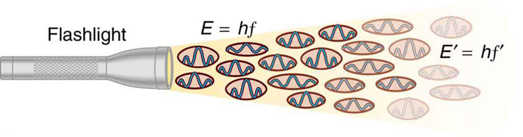

* Describe a typical photoelectric-effect experiment.
* Determine the maximum kinetic energy of photoelectrons ejected by photons of one energy or wavelength, when given the maximum kinetic energy of photoelectrons for a different photon energy or wavelength.

When light strikes materials, it can eject electrons from them. This is called the **photoelectric effect**{: data-type="term" #import-auto-id1473737}, meaning that light (*photo*) produces electricity. One common use of the photoelectric effect is in light meters, such as those that adjust the automatic iris on various types of cameras. In a similar way, another use is in solar cells, as you probably have in your calculator or have seen on a roof top or a roadside sign. These make use of the photoelectric effect to convert light into electricity for running different devices.

 "){: #import-auto-id1362766}

This effect has been known for more than a century and can be studied using a device such as that shown in [\[link\]](#import-auto-id1362766). This figure shows an evacuated tube with a metal plate and a collector wire that are connected by a variable voltage source, with the collector more negative than the plate. When light (or other EM radiation) strikes the plate in the evacuated tube, it may eject electrons. If the electrons have energy in electron volts (eV) greater than the potential difference between the plate and the wire in volts, some electrons will be collected on the wire. Since the electron energy in eV is <math xmlns="http://www.w3.org/1998/Math/MathML"><semantics><mrow><mrow><mstyle fontstyle="italic"><mrow><mtext>qV</mtext></mrow></mstyle></mrow><mrow /></mrow><annotation encoding="StarMath 5.0"> size 12{ ital "qV"} {}</annotation></semantics></math>

, where <math xmlns="http://www.w3.org/1998/Math/MathML"><semantics><mrow><mrow><mi>q</mi></mrow><mrow /></mrow><annotation encoding="StarMath 5.0"> size 12{q} {}</annotation></semantics></math>

 is the electron charge and <math xmlns="http://www.w3.org/1998/Math/MathML"><semantics><mrow><mrow><mi>V</mi></mrow><mrow /></mrow><annotation encoding="StarMath 5.0"> size 12{V} {}</annotation></semantics></math>

 is the potential difference, the electron energy can be measured by adjusting the retarding voltage between the wire and the plate. The voltage that stops the electrons from reaching the wire equals the energy in eV. For example, if <math xmlns="http://www.w3.org/1998/Math/MathML"><semantics><mrow><mn>–3.00 V</mn></mrow></semantics></math>

 barely stops the electrons, their energy is 3.00 eV. The number of electrons ejected can be determined by measuring the current between the wire and plate. The more light, the more electrons; a little circuitry allows this device to be used as a light meter.

What is really important about the photoelectric effect is what Albert Einstein deduced from it. Einstein realized that there were several characteristics of the photoelectric effect that could be explained only if *EM radiation is itself quantized*\: the apparently continuous stream of energy in an EM wave is actually composed of energy quanta called photons. In his explanation of the photoelectric effect, Einstein defined a quantized unit or quantum of EM energy, which we now call a **photon**{: data-type="term" #import-auto-id1575989}, with an energy proportional to the frequency of EM radiation. In equation form, the **photon energy**{: data-type="term" #import-auto-id1477392} is

<math xmlns="http://www.w3.org/1998/Math/MathML"><semantics><mrow><mrow><mrow><mi>E</mi><mo stretchy="false">=</mo><mstyle fontstyle="italic"><mrow><mtext>hf</mtext></mrow></mstyle></mrow><mo>,</mo></mrow><mrow /></mrow><annotation encoding="StarMath 5.0"> size 12{E = ital "hf"} {}</annotation></semantics></math>

where <math xmlns="http://www.w3.org/1998/Math/MathML"><semantics><mrow><mrow><mi>E</mi></mrow><mrow /></mrow><annotation encoding="StarMath 5.0"> size 12{E} {}</annotation></semantics></math>

 is the energy of a photon of frequency <math xmlns="http://www.w3.org/1998/Math/MathML"><semantics><mrow><mrow><mi>f</mi></mrow><mrow /></mrow><annotation encoding="StarMath 5.0"> size 12{f} {}</annotation></semantics></math>

 and <math xmlns="http://www.w3.org/1998/Math/MathML"><semantics><mrow><mrow><mi>h</mi></mrow><mrow /></mrow><annotation encoding="StarMath 5.0"> size 12{h} {}</annotation></semantics></math>

 is Planck’s constant. This revolutionary idea looks similar to Planck’s quantization of energy states in blackbody oscillators, but it is quite different. It is the quantization of EM radiation itself. EM waves are composed of photons and are not continuous smooth waves as described in previous chapters on optics. Their energy is absorbed and emitted in lumps, not continuously. This is exactly consistent with Planck’s quantization of energy levels in blackbody oscillators, since these oscillators increase and decrease their energy in steps of <math xmlns="http://www.w3.org/1998/Math/MathML"><semantics><mrow><mrow><mstyle fontstyle="italic"><mrow><mtext>hf</mtext></mrow></mstyle></mrow><mrow /></mrow><annotation encoding="StarMath 5.0"> size 12{ ital "hf"} {}</annotation></semantics></math>

 by absorbing and emitting photons having <math xmlns="http://www.w3.org/1998/Math/MathML"><semantics><mrow><mrow><mrow><mi>E</mi><mo stretchy="false">=</mo><mstyle fontstyle="italic"><mrow><mtext>hf</mtext></mrow></mstyle></mrow></mrow><mrow /></mrow><annotation encoding="StarMath 5.0"> size 12{E = ital "hf"} {}</annotation></semantics></math>

. We do not observe this with our eyes, because there are so many photons in common light sources that individual photons go unnoticed. (See [\[link\]](#import-auto-id1104097).) The next section of the text ([Photon Energies and the Electromagnetic Spectrum](/m42563)) is devoted to a discussion of photons and some of their characteristics and implications. For now, we will use the photon concept to explain the photoelectric effect, much as Einstein did.

{: #import-auto-id1104097}

The photoelectric effect has the properties discussed below. All these properties are consistent with the idea that individual photons of EM radiation are absorbed by individual electrons in a material, with the electron gaining the photon’s energy. Some of these properties are inconsistent with the idea that EM radiation is a simple wave. For simplicity, let us consider what happens with monochromatic EM radiation in which all photons have the same energy <math xmlns="http://www.w3.org/1998/Math/MathML"><semantics><mrow><mrow><mstyle fontstyle="italic"><mrow><mtext>hf</mtext></mrow></mstyle></mrow><mrow /></mrow><annotation encoding="StarMath 5.0"> size 12{ ital "hf"} {}</annotation></semantics></math>

.

1.  {: #import-auto-id1595707} If we vary the frequency of the EM radiation falling on a material, we find the following: For a given material, there is a threshold frequency
    <math xmlns="http://www.w3.org/1998/Math/MathML"><semantics><mrow><mrow><msub><mi>f</mi><mrow><mn>0</mn></mrow></msub></mrow><mrow /></mrow><annotation encoding="StarMath 5.0"> size 12{f rSub { size 8{0} } } {}</annotation></semantics></math>
    
    for the EM radiation below which no electrons are ejected, regardless of intensity. Individual photons interact with individual electrons. Thus if the photon energy is too small to break an electron away, no electrons will be ejected. If EM radiation was a simple wave, sufficient energy could be obtained by increasing the intensity.
2.  {: #import-auto-id1262677} *Once EM radiation falls on a material, electrons are ejected without delay*. As soon as an individual photon of a sufficiently high frequency is absorbed by an individual electron, the electron is ejected. If the EM radiation were a simple wave, several minutes would be required for sufficient energy to be deposited to the metal surface to eject an electron.
3.  {: #import-auto-id1263145} The number of electrons ejected per unit time is proportional to the intensity of the EM radiation and to no other characteristic. High-intensity EM radiation consists of large numbers of photons per unit area, with all photons having the same characteristic energy
    <math xmlns="http://www.w3.org/1998/Math/MathML"><semantics><mrow><mrow><mstyle fontstyle="italic"><mrow><mtext>hf</mtext></mrow></mstyle></mrow><mrow /></mrow><annotation encoding="StarMath 5.0"> size 12{ ital "hf"} {}</annotation></semantics></math>
    
    .
4.  {: #import-auto-id1295728} If we vary the intensity of the EM radiation and measure the energy of ejected electrons, we find the following: *The maximum kinetic energy of ejected electrons is independent of the intensity of the EM radiation*. Since there are so many electrons in a material, it is extremely unlikely that two photons will interact with the same electron at the same time, thereby increasing the energy given it. Instead (as noted in 3 above), increased intensity results in more electrons of the same energy being ejected. If EM radiation were a simple wave, a higher intensity could give more energy, and higher-energy electrons would be ejected.
5.  {: #import-auto-id1643323} The kinetic energy of an ejected electron equals the photon energy minus the binding energy of the electron in the specific material. An individual photon can give all of its energy to an electron. The photon’s energy is partly used to break the electron away from the material. The remainder goes into the ejected electron’s kinetic energy. In equation form, this is given by
    

    <math xmlns="http://www.w3.org/1998/Math/MathML"><semantics><mrow><mrow><mrow><msub><mtext>KE</mtext><mi>e</mi></msub><mo stretchy="false">=</mo><mrow><mstyle fontstyle="italic"><mrow><mtext>hf</mtext></mrow></mstyle><mo stretchy="false">−</mo><mtext>BE</mtext></mrow><mo>,</mo></mrow></mrow><mrow /></mrow><annotation encoding="StarMath 5.0"> size 12{"KE"= ital "hf" - "BE"} {}</annotation></semantics></math>
    

    
    where
    <math xmlns="http://www.w3.org/1998/Math/MathML"><semantics><mrow><mrow><msub><mtext>KE</mtext><mrow><mi>e</mi></mrow></msub></mrow><mrow /></mrow><annotation encoding="StarMath 5.0"> size 12{"KE" rSub { size 8{e} } } {}</annotation></semantics></math>
    
    is the maximum kinetic energy of the ejected electron,
    <math xmlns="http://www.w3.org/1998/Math/MathML"><semantics><mrow><mrow><mstyle fontstyle="italic"><mrow><mtext>hf</mtext></mrow></mstyle></mrow><mrow /></mrow><annotation encoding="StarMath 5.0"> size 12{ ital "hf"} {}</annotation></semantics></math>
    
    is the photon’s energy, and BE is the **binding energy**{: data-type="term" #import-auto-id1024509} of the electron to the particular material. (BE is sometimes called the *work function* of the material.) This equation, due to Einstein in 1905, explains the properties of the photoelectric effect quantitatively. An individual photon of EM radiation (it does not come any other way) interacts with an individual electron, supplying enough energy, BE, to break it away, with the remainder going to kinetic energy. The binding energy is
    <math xmlns="http://www.w3.org/1998/Math/MathML"><semantics><mrow><mrow><mrow><mtext>BE </mtext><mo stretchy="false">=</mo><mrow><msub><mi fontstyle="italic">hf</mi><mrow><mn>0</mn></mrow></msub></mrow></mrow></mrow><mrow /></mrow><annotation encoding="StarMath 5.0"> size 12{"BE "= ital "hf" rSub { size 8{0} } } {}</annotation></semantics></math>
    
    , where
    <math xmlns="http://www.w3.org/1998/Math/MathML"><semantics><mrow><mrow><msub><mi>f</mi><mrow><mn>0</mn></mrow></msub></mrow><mrow /></mrow><annotation encoding="StarMath 5.0"> size 12{f rSub { size 8{0} } } {}</annotation></semantics></math>
    
    is the threshold frequency for the particular material. [\[link\]](#import-auto-id1573454) shows a graph of maximum
    <math xmlns="http://www.w3.org/1998/Math/MathML"><semantics><mrow><mrow><msub><mtext>KE</mtext><mrow><mi>e</mi></mrow></msub></mrow><mrow /></mrow><annotation encoding="StarMath 5.0"> size 12{"KE" rSub { size 8{e} } } {}</annotation></semantics></math>
    
    versus the frequency of incident EM radiation falling on a particular material.
{: type="1"}

{: #import-auto-id1573454}

Einstein’s idea that EM radiation is quantized was crucial to the beginnings of quantum mechanics. It is a far more general concept than its explanation of the photoelectric effect might imply. All EM radiation can also be modeled in the form of photons, and the characteristics of EM radiation are entirely consistent with this fact. (As we will see in the next section, many aspects of EM radiation, such as the hazards of ultraviolet (UV) radiation, can be explained *only* by photon properties.) More famous for modern relativity, Einstein planted an important seed for quantum mechanics in 1905, the same year he published his first paper on special relativity. His explanation of the photoelectric effect was the basis for the Nobel Prize awarded to him in 1921. Although his other contributions to theoretical physics were also noted in that award, special and general relativity were not fully recognized in spite of having been partially verified by experiment by 1921. Although hero-worshipped, this great man never received Nobel recognition for his most famous work—relativity.

Calculating Photon Energy and the Photoelectric Effect: A Violet Light

(a) What is the energy in joules and electron volts of a photon of 420-nm violet light? (b) What is the maximum kinetic energy of electrons ejected from calcium by 420-nm violet light, given that the binding energy (or work function) of electrons for calcium metal is 2.71 eV?

**Strategy**

To solve part (a), note that the energy of a photon is given by <math xmlns="http://www.w3.org/1998/Math/MathML"><semantics><mrow><mrow><mrow><mi>E</mi><mo stretchy="false">=</mo><mstyle fontstyle="italic"><mrow><mtext>hf</mtext></mrow></mstyle></mrow></mrow><mrow /></mrow><annotation encoding="StarMath 5.0"> size 12{E = ital "hf"} {}</annotation></semantics></math>

. For part (b), once the energy of the photon is calculated, it is a straightforward application of <math xmlns="http://www.w3.org/1998/Math/MathML"><semantics><mrow><mrow><mrow><mrow><msub><mtext>KE</mtext><mrow><mi>e</mi></mrow></msub><mo stretchy="false">=</mo><mstyle fontstyle="italic"><mrow><mtext>hf</mtext></mrow></mstyle></mrow><mtext>–BE</mtext></mrow></mrow><mrow /></mrow><annotation encoding="StarMath 5.0"> size 12{"KE" rSub { size 8{e} } = ital "hf""–BE"} {}</annotation></semantics></math>

 to find the ejected electron’s maximum kinetic energy, since BE is given.

**Solution for (a)**

Photon energy is given by

<math xmlns="http://www.w3.org/1998/Math/MathML"> <semantics> <mrow> <mrow> <mrow> <mi>E</mi> <mo stretchy="false">=</mo> <mstyle fontstyle="italic"> <mrow> <mtext>hf</mtext> </mrow> </mstyle> </mrow> </mrow> <mrow /> </mrow> <annotation encoding="StarMath 5.0"> size 12{E = ital "hf"} {}</annotation> </semantics> </math>

Since we are given the wavelength rather than the frequency, we solve the familiar relationship *<math xmlns="http://www.w3.org/1998/Math/MathML"><semantics><mrow><mrow><mrow><mi>c</mi><mo stretchy="false">=</mo><mi fontstyle="italic">fλ</mi></mrow></mrow><mrow /></mrow><annotation encoding="StarMath 5.0"> size 12{c=fλ} {}</annotation></semantics></math>

* for the frequency, yielding

<math xmlns="http://www.w3.org/1998/Math/MathML"><semantics><mrow><mrow><mrow><mi>f</mi><mo stretchy="false">=</mo><mfrac><mi>c</mi><mi>λ</mi></mfrac></mrow><mo>.</mo></mrow><mrow /></mrow><annotation encoding="StarMath 5.0"> size 12{f= { {c} over {λ} } } {}</annotation></semantics></math>

Combining these two equations gives the useful relationship

<math xmlns="http://www.w3.org/1998/Math/MathML"><semantics><mrow><mrow><mrow><mi>E</mi><mo stretchy="false">=</mo><mfrac><mstyle fontstyle="italic"><mrow><mtext>hc</mtext></mrow></mstyle><mi>λ</mi></mfrac></mrow><mo>.</mo></mrow><mrow /></mrow><annotation encoding="StarMath 5.0"> size 12{E = { { ital "hc"} over {λ} } } {}</annotation></semantics></math>

Now substituting known values yields

<math xmlns="http://www.w3.org/1998/Math/MathML"><semantics><mrow><mrow><mrow><mrow><mrow><mi>E</mi><mo stretchy="false">=</mo><mfrac><mrow><mfenced open="(" close=")"><mrow><mn>6</mn><mtext>.</mtext><mrow><mtext>63</mtext><mo stretchy="false">×</mo><msup><mtext> 10</mtext><mrow><mtext>–34</mtext></mrow></msup><mspace width="0.25em" /></mrow><mrow><mtext> J </mtext><mo stretchy="false">⋅</mo><mtext> s </mtext></mrow></mrow></mfenced> <mfenced open="(" close=")"><mrow><mn>3.00</mn><mrow><mo stretchy="false">×</mo><msup><mtext> 10</mtext><mrow><mn>8</mn></mrow></msup></mrow><mspace width="0.25em" /><mtext> m/s</mtext></mrow></mfenced> </mrow><mrow><mrow><mtext>420 </mtext><mo stretchy="false">×</mo><msup><mtext> 10</mtext><mrow><mtext>–9</mtext></mrow></msup></mrow><mspace width="0.25em" /><mtext> m</mtext></mrow></mfrac> </mrow><mo stretchy="false">=</mo><mtext> 4.74</mtext><mo stretchy="false">×</mo><msup><mtext> 10</mtext><mrow><mtext>–19</mtext></mrow></msup></mrow><mspace width="0.25em" /><mtext> J</mtext></mrow><mo>.</mo></mrow><mrow /></mrow><annotation encoding="StarMath 5.0"> size 12{E = { { left (6 "." "63" times " 10" rSup { size 8{"–34"} } " J " cdot " s " right )` left (3 "." "00" times " 10" rSup { size 8{8} } " m/s" right )} over {"420 " times " 10" rSup { size 8{"–9"} } " m"} } =" 4" "." "74 " times " 10" rSup { size 8{"–19"} } " J"} {}</annotation></semantics></math>

Converting to eV, the energy of the photon is

<math xmlns="http://www.w3.org/1998/Math/MathML"><semantics><mrow><mrow><mrow><mrow><mi>E</mi><mo stretchy="false">=</mo><mfenced open="(" close=")"><mrow><mn>4</mn><mtext>.</mtext><mrow><mtext>74 </mtext><mo stretchy="false">×</mo><msup><mtext> 10</mtext><mrow><mtext>–19</mtext></mrow></msup></mrow><mspace width="0.25em" /><mtext> J </mtext></mrow></mfenced></mrow><mrow><mfrac><mrow><mn>1 eV</mn></mrow><mrow><mn>1.6</mn><mo stretchy="false">×</mo><msup><mtext> 10</mtext><mrow><mtext>–19</mtext></mrow></msup><mspace width="0.25em" /><mn>J</mn></mrow></mfrac><mo stretchy="false">=</mo><mtext> 2.96 eV</mtext></mrow></mrow><mo>.</mo></mrow><mrow /></mrow><annotation encoding="StarMath 5.0"> size 12{E = left (4 "." "74 " times " 10" rSup { size 8{"–19"} } " J " right ) { {1`"eV"} over {1 "." "6 " times " 10" rSup { size 8{"–19"} } `J} } =" 2" "." "96"`"eV"} {}</annotation></semantics></math>

**Solution for (b)**

Finding the kinetic energy of the ejected electron is now a simple application of the equation <math xmlns="http://www.w3.org/1998/Math/MathML"><semantics><mrow><mrow><mrow><mrow><msub><mtext>KE</mtext><mrow><mi>e</mi></mrow></msub><mo stretchy="false">=</mo><mstyle fontstyle="italic"><mrow><mtext>hf</mtext></mrow></mstyle></mrow><mtext>–BE</mtext></mrow></mrow><mrow /></mrow><annotation encoding="StarMath 5.0"> size 12{"KE" rSub { size 8{e} } = ital "hf""–BE"} {}</annotation></semantics></math>

. Substituting the photon energy and binding energy yields

<math xmlns="http://www.w3.org/1998/Math/MathML"><semantics><mrow><mrow><mrow><mrow><msub><mtext>KE</mtext><mrow><mi>e</mi></mrow></msub><mo stretchy="false">=</mo><mstyle fontstyle="italic"><mrow><mtext>hf</mtext></mrow></mstyle></mrow><mrow><mtext> – BE </mtext><mo stretchy="false">=</mo><mtext> 2</mtext></mrow><mtext>.</mtext><mtext>96 eV – 2</mtext><mtext>.</mtext><mrow><mtext>71 eV </mtext><mo stretchy="false">=</mo><mtext> 0</mtext></mrow><mtext>.</mtext><mtext>246 eV</mtext></mrow><mo>.</mo></mrow><mrow /></mrow><annotation encoding="StarMath 5.0"> size 12{"KE" rSub { size 8{e} } = ital "hf"" – BE "=" 2" "." "96 eV – 2" "." "71 eV "=" 0" "." "246 eV"} {}</annotation></semantics></math>

**Discussion**

The energy of this 420-nm photon of violet light is a tiny fraction of a joule, and so it is no wonder that a single photon would be difficult for us to sense directly—humans are more attuned to energies on the order of joules. But looking at the energy in electron volts, we can see that this photon has enough energy to affect atoms and molecules. A DNA molecule can be broken with about 1 eV of energy, for example, and typical atomic and molecular energies are on the order of eV, so that the UV photon in this example could have biological effects. The ejected electron (called a *photoelectron*) has a rather low energy, and it would not travel far, except in a vacuum. The electron would be stopped by a retarding potential of but 0.26 eV. In fact, if the photon wavelength were longer and its energy less than 2.71 eV, then the formula would give a negative kinetic energy, an impossibility. This simply means that the 420-nm photons with their 2.96-eV energy are not much above the frequency threshold. You can show for yourself that the threshold wavelength is 459 nm (blue light). This means that if calcium metal is used in a light meter, the meter will be insensitive to wavelengths longer than those of blue light. Such a light meter would be completely insensitive to red light, for example.

PhET Explorations: Photoelectric Effect

See how light knocks electrons off a metal target, and recreate the experiment that spawned the field of quantum mechanics.

<figure markdown="1" id="eip-id1596151">
<figcaption>
[Photoelectric Effect](photoelectric_en.jar)
</figcaption>
 [{: data-print="false"}](photoelectric_en.jar){: data-type="image"}  
</figure>

### Section Summary

* {: #import-auto-id1607517} The photoelectric effect is the process in which EM radiation ejects electrons from a material.
* {: #import-auto-id1607520} Einstein proposed photons to be quanta of EM radiation having energy
  <math xmlns="http://www.w3.org/1998/Math/MathML"><semantics><mrow><mrow><mrow><mi>E</mi><mo stretchy="false">=</mo><mstyle fontstyle="italic"><mrow><mtext>hf</mtext></mrow></mstyle></mrow></mrow><mrow /></mrow><annotation encoding="StarMath 5.0"> size 12{E = ital "hf"} {}</annotation></semantics></math>
  
  , where
  <math xmlns="http://www.w3.org/1998/Math/MathML"><semantics><mrow><mrow><mi>f</mi></mrow><mrow /></mrow><annotation encoding="StarMath 5.0"> size 12{f} {}</annotation></semantics></math>
  
  is the frequency of the radiation.
* {: #import-auto-id1607579} All EM radiation is composed of photons. As Einstein explained, all characteristics of the photoelectric effect are due to the interaction of individual photons with individual electrons.
* {: #import-auto-id1607583} The maximum kinetic energy
  <math xmlns="http://www.w3.org/1998/Math/MathML"><semantics><mrow><mrow><msub><mtext>KE</mtext><mrow><mi>e</mi></mrow></msub></mrow><mrow /></mrow><annotation encoding="StarMath 5.0"> size 12{"KE" rSub { size 8{e} } } {}</annotation></semantics></math>
  
  of ejected electrons (photoelectrons) is given by
  <math xmlns="http://www.w3.org/1998/Math/MathML"><semantics><mrow><mrow><mrow><mrow><msub><mtext>KE </mtext><mi>e</mi></msub><mo stretchy="false">=</mo><mstyle fontstyle="italic"><mrow><mtext>hf</mtext></mrow></mstyle></mrow><mtext> – BE</mtext></mrow></mrow><mrow /></mrow><annotation encoding="StarMath 5.0"> size 12{"KE "= ital "hf"" – BE"} {}</annotation></semantics></math>
  
  , where
  <math xmlns="http://www.w3.org/1998/Math/MathML"><semantics><mrow><mrow><mstyle fontstyle="italic"><mrow><mtext>hf</mtext></mrow></mstyle></mrow><mrow /></mrow><annotation encoding="StarMath 5.0"> size 12{ ital "hf"} {}</annotation></semantics></math>
  
  is the photon energy and BE is the binding energy (or work function) of the electron to the particular material.

### Conceptual Questions

Is visible light the only type of EM radiation that can cause the photoelectric effect?

Which aspects of the photoelectric effect cannot be explained without photons? Which can be explained without photons? Are the latter inconsistent with the existence of photons?

Is the photoelectric effect a direct consequence of the wave character of EM radiation or of the particle character of EM radiation? Explain briefly.

Insulators (nonmetals) have a higher BE than metals, and it is more difficult for photons to eject electrons from insulators. Discuss how this relates to the free charges in metals that make them good conductors.

If you pick up and shake a piece of metal that has electrons in it free to move as a current, no electrons fall out. Yet if you heat the metal, electrons can be boiled off. Explain both of these facts as they relate to the amount and distribution of energy involved with shaking the object as compared with heating it.

### Problems &amp; Exercises

What is the longest-wavelength EM radiation that can eject a photoelectron from silver, given that the binding energy is 4.73 eV? Is this in the visible range?

263 nm

Find the longest-wavelength photon that can eject an electron from potassium, given that the binding energy is 2.24 eV. Is this visible EM radiation?

What is the binding energy in eV of electrons in magnesium, if the longest-wavelength photon that can eject electrons is 337 nm?

3\.69 eV

Calculate the binding energy in eV of electrons in aluminum, if the longest-wavelength photon that can eject them is 304 nm.

What is the maximum kinetic energy in eV of electrons ejected from sodium metal by 450-nm EM radiation, given that the binding energy is 2.28 eV?

0\.483 eV

UV radiation having a wavelength of 120 nm falls on gold metal, to which electrons are bound by 4.82 eV. What is the maximum kinetic energy of the ejected photoelectrons?

Violet light of wavelength 400 nm ejects electrons with a maximum kinetic energy of 0.860 eV from sodium metal. What is the binding energy of electrons to sodium metal?

2\.25 eV

UV radiation having a 300-nm wavelength falls on uranium metal, ejecting 0.500-eV electrons. What is the binding energy of electrons to uranium metal?

What is the wavelength of EM radiation that ejects 2.00-eV electrons from calcium metal, given that the binding energy is 2.71 eV? What type of EM radiation is this?

(a) 264 nm

(b) Ultraviolet

Find the wavelength of photons that eject 0.100-eV electrons from potassium, given that the binding energy is 2.24 eV. Are these photons visible?

What is the maximum velocity of electrons ejected from a material by 80-nm photons, if they are bound to the material by 4.73 eV?

<math xmlns="http://www.w3.org/1998/Math/MathML"> <semantics> <mrow> <mrow> <mrow> <mn>1.95</mn> <mrow> <mo stretchy="false">×</mo> <msup> <mtext>10</mtext> <mrow> <mn>6</mn> </mrow> </msup> </mrow><mspace width="0.25em" /> <mtext> m/s</mtext> </mrow> </mrow> <mrow /> </mrow> <annotation encoding="StarMath 5.0"> size 12{1 "." "95" times "10" rSup { size 8{6} } " m/sec"} {}</annotation> </semantics> </math>

Photoelectrons from a material with a binding energy of 2.71 eV are ejected by 420-nm photons. Once ejected, how long does it take these electrons to travel 2.50 cm to a detection device?

A laser with a power output of 2.00 mW at a wavelength of 400 nm is projected onto calcium metal. (a) How many electrons per second are ejected? (b) What power is carried away by the electrons, given that the binding energy is 2.71 eV?

(a) <math xmlns="http://www.w3.org/1998/Math/MathML"><semantics><mrow><mrow><mrow><mn>4.02</mn><mrow><mo stretchy="false">×</mo><msup><mtext>10</mtext><mrow><mtext>15</mtext></mrow></msup></mrow><mspace width="0.25em" /><mtext>/s</mtext></mrow></mrow><mrow /></mrow><annotation encoding="StarMath 5.0"> size 12{4 "." "02" times "10" rSup { size 8{"15"} } "/s"} {}</annotation></semantics></math>

(b) 0.256 mW

(a) Calculate the number of photoelectrons per second ejected from a 1.00-mm 2 area of sodium metal by 500-nm EM radiation having an intensity of <math xmlns="http://www.w3.org/1998/Math/MathML"><semantics><mrow><mrow><mrow><mn>1</mn><mtext>.</mtext><msup><mtext>30 kW/m</mtext><mrow><mn>2</mn></mrow></msup></mrow></mrow><mrow /></mrow><annotation encoding="StarMath 5.0"> size 12{1 "." "30 kW/m" rSup { size 8{2} } } {}</annotation></semantics></math>

 (the intensity of sunlight above the Earth’s atmosphere). (b) Given that the binding energy is 2.28 eV, what power is carried away by the electrons? (c) The electrons carry away less power than brought in by the photons. Where does the other power go? How can it be recovered?

**Unreasonable Results**

Red light having a wavelength of 700 nm is projected onto magnesium metal to which electrons are bound by 3.68 eV. (a) Use <math xmlns="http://www.w3.org/1998/Math/MathML"><semantics><mrow><mrow><mrow><mrow><msub><mtext>KE </mtext><mi>e</mi></msub><mo stretchy="false">=</mo><mstyle fontstyle="italic"><mrow><mtext>hf</mtext></mrow></mstyle></mrow><mo>–</mo><mtext>BE</mtext></mrow></mrow><mrow /></mrow><annotation encoding="StarMath 5.0"> size 12{"KE "= ital "hf"" – BE"} {}</annotation></semantics></math>

 to calculate the kinetic energy of the ejected electrons. (b) What is unreasonable about this result? (c) Which assumptions are unreasonable or inconsistent?

(a) <math xmlns="http://www.w3.org/1998/Math/MathML"><semantics><mrow><mn>–1.90 eV</mn></mrow></semantics></math>

(b) Negative kinetic energy

(c) That the electrons would be knocked free.

**Unreasonable Results**

(a) What is the binding energy of electrons to a material from which 4.00-eV electrons are ejected by 400-nm EM radiation? (b) What is unreasonable about this result? (c) Which assumptions are unreasonable or inconsistent?

### Glossary
{: data-type="glossary-title"}

photoelectric effect
: the phenomenon whereby some materials eject electrons when light is shined on them
{: #import-auto-id1408231}

photon
: a quantum, or particle, of electromagnetic radiation
{: #import-auto-id1408235}

photon energy
: the amount of energy a photon has;
  <math xmlns="http://www.w3.org/1998/Math/MathML"><semantics><mrow><mrow><mrow><mi>E</mi><mo stretchy="false">=</mo><mstyle fontstyle="italic"><mrow><mtext>hf</mtext></mrow></mstyle></mrow></mrow><mrow /></mrow><annotation encoding="StarMath 5.0"> size 12{E = ital "hf"} {}</annotation></semantics></math>
{: #import-auto-id1495179}

binding energy
: also called the *work function*; the amount of energy necessary to eject an electron from a material
{: #import-auto-id1613232}

