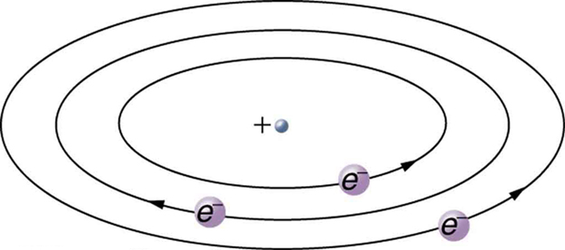

* Describe how electrons were discovered.
* Explain the Millikan oil drop experiment.
* Describe Rutherford’s gold foil experiment.
* Describe Rutherford’s planetary model of the atom.

Just as atoms are a substructure of matter, electrons and nuclei are substructures of the atom. The experiments that were used to discover electrons and nuclei reveal some of the basic properties of atoms and can be readily understood using ideas such as electrostatic and magnetic force, already covered in previous chapters.

Charges and Electromagnetic Forces

In previous discussions, we have noted that positive charge is associated with nuclei and negative charge with electrons. We have also covered many aspects of the electric and magnetic forces that affect charges. We will now explore the discovery of the electron and nucleus as substructures of the atom and examine their contributions to the properties of atoms.

# The Electron

Gas discharge tubes, such as that shown in [\[link\]](#import-auto-id2991497), consist of an evacuated glass tube containing two metal electrodes and a rarefied gas. When a high voltage is applied to the electrodes, the gas glows. These tubes were the precursors to today’s neon lights. They were first studied seriously by Heinrich Geissler, a German inventor and glassblower, starting in the 1860s. The English scientist William Crookes, among others, continued to study what for some time were called Crookes tubes, wherein electrons are freed from atoms and molecules in the rarefied gas inside the tube and are accelerated from the cathode (negative) to the anode (positive) by the high potential. These “*cathode rays*” collide with the gas atoms and molecules and excite them, resulting in the emission of electromagnetic (EM) radiation that makes the electrons’ path visible as a ray that spreads and fades as it moves away from the cathode.

Gas discharge tubes today are most commonly called **cathode-ray tubes**{: data-type="term" #import-auto-id1404830}, because the rays originate at the cathode. Crookes showed that the electrons carry momentum (they can make a small paddle wheel rotate). He also found that their normally straight path is bent by a magnet in the direction expected for a negative charge moving away from the cathode. These were the first direct indications of electrons and their charge.

  and are found in older TVs, computer screens, and x-ray machines. When a magnetic field is applied, the beam bends in the direction expected for negative charge. (credit: Paul Downey, Flickr)&#10;"){: #import-auto-id2991497}

The English physicist J. J. Thomson (1856–1940) improved and expanded the scope of experiments with gas discharge tubes. (See [\[link\]](#import-auto-id1352064) and [\[link\]](#fs-id2509061).) He verified the negative charge of the cathode rays with both magnetic and electric fields. Additionally, he collected the rays in a metal cup and found an excess of negative charge. Thomson was also able to measure the ratio of the charge of the electron to its mass, <math xmlns="http://www.w3.org/1998/Math/MathML"><semantics><mrow><mrow><msub><mi>q</mi><mrow><mi>e</mi></mrow></msub></mrow><mrow /></mrow><annotation encoding="StarMath 5.0"> size 12{q rSub { size 8{e} } } {}</annotation></semantics></math>

<math xmlns="http://www.w3.org/1998/Math/MathML"><semantics><mrow /><annotation encoding="StarMath 5.0">{}</annotation></semantics></math>

<math xmlns="http://www.w3.org/1998/Math/MathML"><semantics><mrow><mrow><mo stretchy="false">/</mo><msub><mi>m</mi><mrow><mi>e</mi></mrow></msub></mrow><mrow /></mrow><annotation encoding="StarMath 5.0"> size 12{m rSub { size 8{e} } } {}</annotation></semantics></math>

—an important step to finding the actual values of both <math xmlns="http://www.w3.org/1998/Math/MathML"><semantics><mrow><mrow><msub><mi>q</mi><mrow><mi>e</mi></mrow></msub></mrow></mrow></semantics></math>

<math xmlns="http://www.w3.org/1998/Math/MathML"><semantics /></math>

 and <math xmlns="http://www.w3.org/1998/Math/MathML"><semantics><mrow><mrow><msub><mi>m</mi><mrow><mi>e</mi></mrow></msub></mrow></mrow></semantics></math>

. [\[link\]](#fs-id961353) shows a cathode-ray tube, which produces a narrow beam of electrons that passes through charging plates connected to a high-voltage power supply. An electric field <math xmlns="http://www.w3.org/1998/Math/MathML"><semantics><mrow><mrow><mi mathvariant="bold">E</mi></mrow><mrow /></mrow><annotation encoding="StarMath 5.0"> size 12{E} {}</annotation></semantics></math>

 is produced between the charging plates, and the cathode-ray tube is placed between the poles of a magnet so that the electric field <math xmlns="http://www.w3.org/1998/Math/MathML"><semantics><mrow><mrow><mtext mathvariant="bold">E</mtext></mrow><mrow /></mrow><annotation encoding="StarMath 5.0"> size 12{E} {}</annotation></semantics></math>

 is perpendicular to the magnetic field <math xmlns="http://www.w3.org/1998/Math/MathML"><semantics><mrow><mrow><mi mathvariant="bold">B</mi></mrow><mrow /></mrow><annotation encoding="StarMath 5.0"> size 12{B} {}</annotation></semantics></math>

 of the magnet. These fields, being perpendicular to each other, produce opposing forces on the electrons. As discussed for mass spectrometers in [More Applications of Magnetism](/m42388), if the net force due to the fields vanishes, then the velocity of the charged particle is *<math xmlns="http://www.w3.org/1998/Math/MathML"><semantics><mrow><mrow><mrow><mi>v</mi><mo stretchy="false">=</mo><mrow><mi>E</mi><mo stretchy="false">/</mo><mi>B</mi></mrow></mrow></mrow><mrow /></mrow><annotation encoding="StarMath 5.0"> size 12{v=E/B} {}</annotation></semantics></math>

*. In this manner, Thomson determined the velocity of the electrons and then moved the beam up and down by adjusting the electric field.

"){: #import-auto-id1352064}

"){:}

{:}

To see how the amount of deflection is used to calculate <math xmlns="http://www.w3.org/1998/Math/MathML"><semantics><mrow><mrow><mrow><msub><mi>q</mi><mrow><mi>e</mi></mrow></msub><mo stretchy="false">/</mo><msub><mi>m</mi><mrow><mi>e</mi></mrow></msub></mrow></mrow><mrow /></mrow><annotation encoding="StarMath 5.0"> size 12{q rSub { size 8{e} } /m rSub { size 8{e} } } {}</annotation></semantics></math>

, note that the deflection is proportional to the electric force on the electron:

<math xmlns="http://www.w3.org/1998/Math/MathML"><semantics><mrow><mrow><mrow><mrow><mi>F</mi><mo stretchy="false">=</mo><msub><mi>q</mi><mrow><mi>e</mi></mrow></msub></mrow><mi>E</mi></mrow><mo>.</mo></mrow><mrow /></mrow><annotation encoding="StarMath 5.0"> size 12{F=q rSub { size 8{e} } E} {}</annotation></semantics></math>

But the vertical deflection is also related to the electron’s mass, since the electron’s acceleration is

<math xmlns="http://www.w3.org/1998/Math/MathML"> <semantics> <mrow> <mrow> <mrow> <mi>a</mi> <mo stretchy="false">=</mo> <mfrac> <mi>F</mi> <msub> <mi>m</mi> <mrow> <mi>e</mi> </mrow> </msub> </mfrac> </mrow> </mrow> <mrow /> <mtext>.</mtext> </mrow> <annotation encoding="StarMath 5.0"> size 12{a= { {F} over {m rSub { size 8{e} } } } } {}</annotation> </semantics> </math>

The value of <math xmlns="http://www.w3.org/1998/Math/MathML"><semantics><mrow><mrow><mi>F</mi></mrow><mrow /></mrow><annotation encoding="StarMath 5.0"> size 12{F} {}</annotation></semantics></math>

 is not known, since <math xmlns="http://www.w3.org/1998/Math/MathML"><semantics><mrow><mrow><msub><mi>q</mi><mrow><mi>e</mi></mrow></msub></mrow><mrow /></mrow><annotation encoding="StarMath 5.0"> size 12{q rSub { size 8{e} } } {}</annotation></semantics></math>

 was not yet known. Substituting the expression for electric force into the expression for acceleration yields

<math xmlns="http://www.w3.org/1998/Math/MathML"> <semantics> <mrow> <mrow> <mrow> <mrow> <mrow> <mi>a</mi> <mo stretchy="false">=</mo> <mfrac> <mi>F</mi> <msub> <mi>m</mi> <mrow> <mi>e</mi> </mrow> </msub> </mfrac> </mrow> <mo stretchy="false">=</mo> <mfrac> <mrow> <msub> <mi>q</mi> <mrow> <mi>e</mi> </mrow> </msub> <mi>E</mi> </mrow> <msub> <mi>m</mi> <mrow> <mi>e</mi> </mrow> </msub> </mfrac> </mrow> <mtext>.</mtext> </mrow> </mrow> <mrow /> </mrow> <annotation encoding="StarMath 5.0"> size 12{a= { {F} over {m rSub { size 8{e} } } } = { {q rSub { size 8{e} } E} over {m rSub { size 8{e} } } } "." } {}</annotation> </semantics> </math>

Gathering terms, we have

<math xmlns="http://www.w3.org/1998/Math/MathML"> <semantics> <mrow> <mrow> <mrow> <mfrac> <msub> <mi>q</mi> <mrow> <mi>e</mi> </mrow> </msub> <msub> <mi>m</mi> <mrow> <mi>e</mi> </mrow> </msub> </mfrac> <mo stretchy="false">=</mo> <mfrac> <mi>a</mi> <mi>E</mi> </mfrac> </mrow> </mrow> <mtext>.</mtext> <mrow /> </mrow> <annotation encoding="StarMath 5.0"> size 12{ { {q rSub { size 8{e} } } over {m rSub { size 8{e} } } } = { {a} over {E} } } {}</annotation> </semantics> </math>

The deflection is analyzed to get <math xmlns="http://www.w3.org/1998/Math/MathML"><semantics><mrow><mrow><mi>a</mi></mrow><mrow /></mrow><annotation encoding="StarMath 5.0"> size 12{a} {}</annotation></semantics></math>

, and <math xmlns="http://www.w3.org/1998/Math/MathML"><semantics><mrow><mrow><mi>E</mi></mrow><mrow /></mrow><annotation encoding="StarMath 5.0"> size 12{E} {}</annotation></semantics></math>

 is determined from the applied voltage and distance between the plates; thus, <math xmlns="http://www.w3.org/1998/Math/MathML"><semantics><mrow><mrow><mfrac><msub><mi>q</mi><mrow><mi>e</mi></mrow></msub><msub><mi>m</mi><mrow><mi>e</mi></mrow></msub></mfrac></mrow><mrow /></mrow><annotation encoding="StarMath 5.0"> size 12{ { {q rSub { size 8{e} } } over {m rSub { size 8{e} } } } } {}</annotation></semantics></math>

 can be determined. With the velocity known, another measurement of <math xmlns="http://www.w3.org/1998/Math/MathML"><semantics><mrow><mrow><mfrac><msub><mi>q</mi><mrow><mi>e</mi></mrow></msub><msub><mi>m</mi><mrow><mi>e</mi></mrow></msub></mfrac></mrow><mrow /></mrow><annotation encoding="StarMath 5.0"> size 12{ { {q rSub { size 8{e} } } over {m rSub { size 8{e} } } } } {}</annotation></semantics></math>

 can be obtained by bending the beam of electrons with the magnetic field. Since <math xmlns="http://www.w3.org/1998/Math/MathML"><semantics><mrow><mrow><mrow><mrow><msub><mi>F</mi><mrow><mtext>mag</mtext></mrow></msub><mo stretchy="false">=</mo><msub><mi>q</mi><mrow><mi>e</mi></mrow></msub></mrow><mrow><mstyle fontstyle="italic"><mrow><mtext>vB</mtext></mrow></mstyle><mo stretchy="false">=</mo><msub><mi>m</mi><mrow><mi>e</mi></mrow></msub></mrow><mi>a</mi></mrow></mrow><mrow /></mrow><annotation encoding="StarMath 5.0"> size 12{F rSub { size 8{"mag"} } =q rSub { size 8{e} } ital "vB"=m rSub { size 8{e} } a} {}</annotation></semantics></math>

, we have <math xmlns="http://www.w3.org/1998/Math/MathML"><semantics><mrow><mrow><mrow><mrow><msub><mi>q</mi><mrow><mi>e</mi></mrow></msub><mo stretchy="false">/</mo><msub><mi>m</mi><mrow><mi>e</mi></mrow></msub></mrow><mo stretchy="false">=</mo><mrow><mi>a</mi><mo stretchy="false">/</mo><mstyle fontstyle="italic"><mrow><mtext>vB</mtext></mrow></mstyle></mrow></mrow></mrow><mrow /></mrow><annotation encoding="StarMath 5.0"> size 12{q rSub { size 8{e} } /m rSub { size 8{e} } =a/ ital "vB"} {}</annotation></semantics></math>

. Consistent results are obtained using magnetic deflection.

What is so important about <math xmlns="http://www.w3.org/1998/Math/MathML"><semantics><mrow><mrow><mrow><msub><mi>q</mi><mrow><mi>e</mi></mrow></msub><mo stretchy="false">/</mo><msub><mi>m</mi><mrow><mi>e</mi></mrow></msub></mrow></mrow><mrow /></mrow><annotation encoding="StarMath 5.0"> size 12{q rSub { size 8{e} } /m rSub { size 8{e} } } {}</annotation></semantics></math>

, the ratio of the electron’s charge to its mass? The value obtained is

<math xmlns="http://www.w3.org/1998/Math/MathML"><semantics><mrow><mrow><mrow><mrow><mfrac><msub><mi>q</mi><mrow><mi>e</mi></mrow></msub><msub><mi>m</mi><mrow><mi>e</mi></mrow></msub></mfrac><mo stretchy="false">=</mo><mrow><mo stretchy="false">−</mo><mn>1</mn></mrow></mrow><mtext>.</mtext><mrow><mtext>76</mtext><mo stretchy="false">×</mo><msup><mtext>10</mtext><mrow><mtext>11</mtext></mrow></msup></mrow><mspace width="0.25em" /><mtext> C/kg (electron).</mtext></mrow></mrow><mrow /></mrow><annotation encoding="StarMath 5.0"> size 12{ { {q rSub { size 8{e} } } over {m rSub { size 8{e} } } } = - 1 "." "76" times "10" rSup { size 8{"11"} } " C/kg"} {}</annotation></semantics></math>

This is a huge number, as Thomson realized, and it implies that the electron has a very small mass. It was known from electroplating that about <math xmlns="http://www.w3.org/1998/Math/MathML"><semantics><mrow><mrow><mrow><msup><mtext>10</mtext><mrow><mn>8</mn></mrow></msup><mspace width="0.25em" /><mtext> C/kg</mtext></mrow></mrow><mrow /></mrow><annotation encoding="StarMath 5.0"> size 12{"10" rSup { size 8{8} } " C/kg"} {}</annotation></semantics></math>

 is needed to plate a material, a factor of about 1000 less than the charge per kilogram of electrons. Thomson went on to do the same experiment for positively charged hydrogen ions (now known to be bare protons) and found a charge per kilogram about 1000 times smaller than that for the electron, implying that the proton is about 1000 times more massive than the electron. Today, we know more precisely that

<math xmlns="http://www.w3.org/1998/Math/MathML"><semantics><mrow><mrow><mrow><mrow><mfrac><msub><mi>q</mi><mrow><mi>p</mi></mrow></msub><msub><mi>m</mi><mrow><mi>p</mi></mrow></msub></mfrac><mo stretchy="false">=</mo><mtext>9.58</mtext><mo stretchy="false">×</mo><msup><mtext>10</mtext><mrow><mn>7</mn></mrow></msup></mrow><mspace width="0.25em" /><mtext> C/kg</mtext></mrow><mo> (proton),</mo></mrow><mrow /></mrow><annotation encoding="StarMath 5.0"> size 12{ { {q rSub { size 8{p} } } over {m rSub { size 8{p} } } } =9 "." "57" times "10" rSup { size 8{7} } " C/kg"} {}</annotation></semantics></math>

where <math xmlns="http://www.w3.org/1998/Math/MathML"><semantics><mrow><mrow><msub><mi>q</mi><mrow><mi>p</mi></mrow></msub></mrow><mrow /></mrow><annotation encoding="StarMath 5.0"> size 12{q rSub { size 8{p} } } {}</annotation></semantics></math>

 is the charge of the proton and <math xmlns="http://www.w3.org/1998/Math/MathML"><semantics><mrow><mrow><msub><mi>m</mi><mrow><mi>p</mi></mrow></msub></mrow><mrow /></mrow><annotation encoding="StarMath 5.0"> size 12{m rSub { size 8{p} } } {}</annotation></semantics></math>

 is its mass. This ratio (to four significant figures) is 1836 times less charge per kilogram than for the electron. Since the charges of electrons and protons are equal in magnitude, this implies <math xmlns="http://www.w3.org/1998/Math/MathML"><semantics><mrow><mrow><mrow><mrow><msub><mi>m</mi><mrow><mi>p</mi></mrow></msub><mo stretchy="false">=</mo><mtext>1836</mtext></mrow><msub><mi>m</mi><mrow><mi>e</mi></mrow></msub></mrow></mrow><mrow /></mrow><annotation encoding="StarMath 5.0"> size 12{m rSub { size 8{p} } ="1836"m rSub { size 8{e} } } {}</annotation></semantics></math>

 .

Thomson performed a variety of experiments using differing gases in discharge tubes and employing other methods, such as the photoelectric effect, for freeing electrons from atoms. He always found the same properties for the electron, proving it to be an independent particle. For his work, the important pieces of which he began to publish in 1897, Thomson was awarded the 1906 Nobel Prize in Physics. In retrospect, it is difficult to appreciate how astonishing it was to find that the atom has a substructure. Thomson himself said, “It was only when I was convinced that the experiment left no escape from it that I published my belief in the existence of bodies smaller than atoms.”

Thomson attempted to measure the charge of individual electrons, but his method could determine its charge only to the order of magnitude expected.

Since Faraday’s experiments with electroplating in the 1830s, it had been known that about 100,000 C per mole was needed to plate singly ionized ions. Dividing this by the number of ions per mole (that is, by Avogadro’s number), which was approximately known, the charge per ion was calculated to be about <math xmlns="http://www.w3.org/1998/Math/MathML"><semantics><mrow><mrow><mrow><mn>1</mn><mtext>.</mtext><mrow><mn>6</mn><mo stretchy="false">×</mo><msup><mtext>10</mtext><mrow><mrow><mo stretchy="false">−</mo><mtext>19</mtext></mrow></mrow></msup></mrow><mspace width="0.25em" /><mtext> C</mtext></mrow></mrow><mrow /></mrow><annotation encoding="StarMath 5.0"> size 12{1 "." 6 times "10" rSup { size 8{ - "19"} } " C"} {}</annotation></semantics></math>

, close to the actual value.

An American physicist, Robert Millikan (1868–1953) (see [\[link\]](#import-auto-id1379919)), decided to improve upon Thomson’s experiment for measuring <math xmlns="http://www.w3.org/1998/Math/MathML"><semantics><mrow><mrow><msub><mi>q</mi><mrow><mi>e</mi></mrow></msub></mrow><mrow /></mrow><annotation encoding="StarMath 5.0"> size 12{q rSub { size 8{e} } } {}</annotation></semantics></math>

 and was eventually forced to try another approach, which is now a classic experiment performed by students. The Millikan oil drop experiment is shown in [\[link\]](#fs-id2010482).

"){: #import-auto-id1379919}

![Image of the apparatus used in the Millikan oil drop experiment, consisting of a parallel pair of horizontal metal plates with a pin hole opening in the top plate. The top plate has positive charge and the bottom plate has negative charge. Picture of a flashlight as a bright source of light and a beam of light passing in between the plates from left is shown. A telescope is shown at the front and an oil atomizer above the positive plate is also depicted. A zoomed image of metal plates describing the force acting on the oil droplet is also shown. Arrows pointing upwards are forces of electric field while arrows pointing downwards depict the force of gravity.](../resources/Figure_31_02_03b1.jpg "The Millikan oil drop experiment produced the first accurate direct measurement of the charge on electrons, one of the most fundamental constants in nature. Fine drops of oil become charged when sprayed. Their movement is observed between metal plates with a potential applied to oppose the gravitational force. The balance of gravitational and electric forces allows the calculation of the charge on a drop. The charge is found to be quantized in units of  &#10;&#10; &#10;  &#10;    &#x2212;1.6&#10;    &#xD7;&#10;   &#10;    10&#10;    &#x2212;19&#10;   &#10;   &#10;   C&#10;  &#10; &#10;, thus determining directly the charge of the excess and missing electrons on the oil drops."){:}

In the Millikan oil drop experiment, fine drops of oil are sprayed from an atomizer. Some of these are charged by the process and can then be suspended between metal plates by a voltage between the plates. In this situation, the weight of the drop is balanced by the electric force:

<math xmlns="http://www.w3.org/1998/Math/MathML"> <semantics> <mrow> <mrow> <mrow> <msub> <mi>m</mi> <mrow> <mtext>drop</mtext> </mrow> </msub> <mrow> <mi>g</mi> <mo stretchy="false">=</mo> <msub> <mi>q</mi> <mrow> <mi>e</mi> </mrow> </msub> </mrow> <mi>E</mi> </mrow> </mrow> <mrow /> </mrow> <annotation encoding="StarMath 5.0"> size 12{m rSub { size 8{"drop"} } g=q rSub { size 8{e} } E} {}</annotation> </semantics> </math>

The electric field is produced by the applied voltage, hence, <math xmlns="http://www.w3.org/1998/Math/MathML"><semantics><mrow><mrow><mrow><mi>E</mi><mo stretchy="false">=</mo><mrow><mi>V</mi><mo stretchy="false">/</mo><mi>d</mi></mrow></mrow></mrow><mrow /></mrow><annotation encoding="StarMath 5.0"> size 12{E=V/d} {}</annotation></semantics></math>

, and <math xmlns="http://www.w3.org/1998/Math/MathML"><semantics><mrow><mrow><mi>V</mi></mrow><mrow /></mrow><annotation encoding="StarMath 5.0"> size 12{V} {}</annotation></semantics></math>

 is adjusted to just balance the drop’s weight. The drops can be seen as points of reflected light using a microscope, but they are too small to directly measure their size and mass. The mass of the drop is determined by observing how fast it falls when the voltage is turned off. Since air resistance is very significant for these submicroscopic drops, the more massive drops fall faster than the less massive, and sophisticated sedimentation calculations can reveal their mass. Oil is used rather than water, because it does not readily evaporate, and so mass is nearly constant. Once the mass of the drop is known, the charge of the electron is given by rearranging the previous equation:

<math xmlns="http://www.w3.org/1998/Math/MathML"> <semantics> <mrow> <mrow> <mrow> <mrow> <mrow> <mi>q</mi> <mo stretchy="false">=</mo> <mfrac> <mrow> <msub> <mi>m</mi> <mrow> <mtext>drop</mtext> </mrow> </msub> <mi>g</mi> </mrow> <mi>E</mi> </mfrac> </mrow> <mo stretchy="false">=</mo> <mfrac> <mrow> <msub> <mi>m</mi> <mrow> <mtext>drop</mtext> </mrow> </msub> <mstyle fontstyle="italic"> <mrow> <mtext>gd</mtext> </mrow> </mstyle> </mrow> <mi>V</mi> </mfrac> </mrow> <mi>,</mi> </mrow> </mrow> <mrow /> </mrow> <annotation encoding="StarMath 5.0"> size 12{q= { {m rSub { size 8{"drop"} } g} over {E} } = { {m rSub { size 8{"drop"} } ital "gd"} over {V} } ,} {}</annotation> </semantics> </math>

where <math xmlns="http://www.w3.org/1998/Math/MathML"><semantics><mrow><mrow><mi>d</mi></mrow><mrow /></mrow><annotation encoding="StarMath 5.0"> size 12{d} {}</annotation></semantics></math>

 is the separation of the plates and <math xmlns="http://www.w3.org/1998/Math/MathML"><semantics><mrow><mrow><mi>V</mi></mrow><mrow /></mrow><annotation encoding="StarMath 5.0"> size 12{V} {}</annotation></semantics></math>

 is the voltage that holds the drop motionless. (The same drop can be observed for several hours to see that it really is motionless.) By 1913 Millikan had measured the charge of the electron *<math xmlns="http://www.w3.org/1998/Math/MathML"><semantics><mrow><mrow><msub><mi>q</mi><mrow><mi>e</mi></mrow></msub></mrow><mrow /></mrow><annotation encoding="StarMath 5.0"> size 12{q rSub { size 8{e} } } {}</annotation></semantics></math>

* to an accuracy of 1%, and he improved this by a factor of 10 within a few years to a value of <math xmlns="http://www.w3.org/1998/Math/MathML"><semantics><mrow><mrow><mrow><mrow><mo stretchy="false">−</mo><mn>1</mn></mrow><mtext>.</mtext><mrow><mtext>60</mtext><mo stretchy="false">×</mo><msup><mtext>10</mtext><mrow><mrow><mo stretchy="false">−</mo><mtext>19</mtext></mrow></mrow></msup></mrow><mspace width="0.25em" /><mtext> C</mtext></mrow></mrow><mrow /></mrow><annotation encoding="StarMath 5.0"> size 12{ - 1 "." "60" times "10" rSup { size 8{ - "19"} } " C"} {}</annotation></semantics></math>

. He also observed that all charges were multiples of the basic electron charge and that sudden changes could occur in which electrons were added or removed from the drops. For this very fundamental direct measurement of <math xmlns="http://www.w3.org/1998/Math/MathML"><semantics><mrow><mrow><msub><mi>q</mi><mrow><mi>e</mi></mrow></msub></mrow><mrow /></mrow><annotation encoding="StarMath 5.0"> size 12{q rSub { size 8{e} } } {}</annotation></semantics></math>

 and for his studies of the photoelectric effect, Millikan was awarded the 1923 Nobel Prize in Physics.

With the charge of the electron known and the charge-to-mass ratio known, the electron’s mass can be calculated. It is

<math xmlns="http://www.w3.org/1998/Math/MathML"> <semantics> <mrow> <mrow> <mrow> <mrow> <mi>m</mi> <mo stretchy="false">=</mo> <mfrac> <msub> <mi>q</mi> <mrow> <mi>e</mi> </mrow> </msub> <mfenced open="(" close=")"> <mfrac> <msub> <mi>q</mi> <mrow> <mi>e</mi> </mrow> </msub> <msub> <mi>m</mi> <mrow> <mi>e</mi> </mrow> </msub> </mfrac> </mfenced> </mfrac> </mrow> <mtext>.</mtext> </mrow> </mrow> <mrow /> </mrow> <annotation encoding="StarMath 5.0"> size 12{m= { {q rSub { size 8{e} } } over { left ( { {q rSub { size 8{e} } } over {m rSub { size 8{e} } } } right )} } "." } {}</annotation> </semantics> </math>

Substituting known values yields

<math xmlns="http://www.w3.org/1998/Math/MathML"> <semantics> <mrow> <mrow> <mrow> <msub> <mi>m</mi> <mrow> <mi>e</mi> </mrow> </msub> <mo stretchy="false">=</mo> <mfrac> <mrow> <mo stretchy="false">−</mo> <mrow> <mtext>1.60</mtext> <mo stretchy="false">×</mo> <msup> <mtext>10</mtext> <mrow> <mrow> <mo stretchy="false">−</mo> <mtext>19</mtext> </mrow> </mrow> </msup> </mrow><mspace width="0.25em" /> <mtext> C</mtext> </mrow> <mrow> <mrow> <mo stretchy="false">−</mo> <mn>1</mn> </mrow> <mtext>.</mtext> <mrow> <mtext>76</mtext> <mo stretchy="false">×</mo> <msup> <mtext>10</mtext> <mrow> <mtext>11</mtext> </mrow> </msup> </mrow> <mrow><mspace width="0.25em" /> <mtext>C/kg</mtext> </mrow> </mrow> </mfrac> </mrow> </mrow> <mrow /> </mrow> <annotation encoding="StarMath 5.0"> size 12{m rSub { size 8{e} } = { { - 1 "." "60" times "10" rSup { size 8{ - "19"} } " C"} over { - 1 "." "76" times "10" rSup { size 8{"11"} } {C} slash {"kg"} } } } {}</annotation> </semantics> </math>

or

<math xmlns="http://www.w3.org/1998/Math/MathML"><semantics><mrow><mrow><mrow><mrow><msub><mi>m</mi><mrow><mi>e</mi></mrow></msub><mo stretchy="false">=</mo><mn>9</mn></mrow><mtext>.</mtext><mrow><mtext>11</mtext><mo stretchy="false">×</mo><msup><mtext>10</mtext><mrow><mrow><mo stretchy="false">−</mo><mtext>31</mtext></mrow></mrow></msup></mrow><mspace width="0.25em" /><mtext> kg</mtext><mspace width="0.25em" /></mrow><mo> (electron’s mass),</mo></mrow><mrow /></mrow><annotation encoding="StarMath 5.0"> size 12{m rSub { size 8{e} } =9 "." "11" times "10" rSup { size 8{ - "31"} } " kg"} {}</annotation></semantics></math>

where the round-off errors have been corrected. The mass of the electron has been verified in many subsequent experiments and is now known to an accuracy of better than one part in one million. It is an incredibly small mass and remains the smallest known mass of any particle that has mass. (Some particles, such as photons, are massless and cannot be brought to rest, but travel at the speed of light.) A similar calculation gives the masses of other particles, including the proton. To three digits, the mass of the proton is now known to be

<math xmlns="http://www.w3.org/1998/Math/MathML"><semantics><mrow><mrow><mrow><mrow><msub><mi>m</mi><mrow><mi>p</mi></mrow></msub><mo stretchy="false">=</mo><mn>1</mn></mrow><mtext>.</mtext><mrow><mtext>67</mtext><mo stretchy="false">×</mo><msup><mtext>10</mtext><mrow><mrow><mo stretchy="false">−</mo><mtext>27</mtext></mrow></mrow></msup></mrow><mspace width="0.25em" /><mtext> kg</mtext><mspace width="0.25em" /></mrow><mo> (proton’s mass),</mo></mrow><mrow /></mrow><annotation encoding="StarMath 5.0"> size 12{m rSub { size 8{P} } =1 "." "67" times "10" rSup { size 8{ - "27"} } " kg"} {}</annotation></semantics></math>

which is nearly identical to the mass of a hydrogen atom. What Thomson and Millikan had done was to prove the existence of one substructure of atoms, the electron, and further to show that it had only a tiny fraction of the mass of an atom. The nucleus of an atom contains most of its mass, and the nature of the nucleus was completely unanticipated.

Another important characteristic of quantum mechanics was also beginning to emerge. All electrons are identical to one another. The charge and mass of electrons are not average values; rather, they are unique values that all electrons have. This is true of other fundamental entities at the submicroscopic level. All protons are identical to one another, and so on.

# The Nucleus

Here, we examine the first direct evidence of the size and mass of the nucleus. In later chapters, we will examine many other aspects of nuclear physics, but the basic information on nuclear size and mass is so important to understanding the atom that we consider it here.

Nuclear radioactivity was discovered in 1896, and it was soon the subject of intense study by a number of the best scientists in the world. Among them was New Zealander Lord Ernest Rutherford, who made numerous fundamental discoveries and earned the title of “father of nuclear physics.” Born in Nelson, Rutherford did his postgraduate studies at the Cavendish Laboratories in England before taking up a position at McGill University in Canada where he did the work that earned him a Nobel Prize in Chemistry in 1908. In the area of atomic and nuclear physics, there is much overlap between chemistry and physics, with physics providing the fundamental enabling theories. He returned to England in later years and had six future Nobel Prize winners as students. Rutherford used nuclear radiation to directly examine the size and mass of the atomic nucleus. The experiment he devised is shown in [\[link\]](#import-auto-id1995579). A radioactive source that emits alpha radiation was placed in a lead container with a hole in one side to produce a beam of alpha particles, which are a type of ionizing radiation ejected by the nuclei of a radioactive source. A thin gold foil was placed in the beam, and the scattering of the alpha particles was observed by the glow they caused when they struck a phosphor screen.

 ![Image of Rutherford&#x2019;s experiment depicting a cuboid shaped lead block having a radioactive sample in red colored circle, emitting a beam of alpha rays. The beam strikes a rectangular gold foil which lies inside a circular strip acting as a detecting screen. Two rays are reflected from the foil while the rest pass through the foil and hit the strip. The other part of the image shows magnified structure of gold foil with gold atoms with their nuclei. Diameter of gold atom is given as 10^\{-10}m and the diameter of the nucleus of the atom is 10^\{-15}m. Alpha rays in the form of arrows are shown passing horizontally through the atoms; some are shown deflected as they collide with the nuclei while the rest simply pass through.](../resources/Figure_31_02_04a.jpg "Rutherford&#x2019;s experiment gave direct evidence for the size and mass of the nucleus by scattering alpha particles from a thin gold foil. Alpha particles with energies of about 5 MeV size 12{5&quot; MeV&quot;} {} are emitted from a radioactive source (which is a small metal container in which a specific amount of a radioactive material is sealed), are collimated into a beam, and fall upon the foil. The number of particles that penetrate the foil or scatter to various angles indicates that gold nuclei are very small and contain nearly all of the gold atom&#x2019;s mass. This is particularly indicated by the alpha particles that scatter to very large angles, much like a soccer ball bouncing off a goalie&#x2019;s head."){: #import-auto-id1995579}

Alpha particles were known to be the doubly charged positive nuclei of helium atoms that had kinetic energies on the order of <math xmlns="http://www.w3.org/1998/Math/MathML"><semantics><mrow><mrow><mrow><mtext>5 MeV</mtext></mrow></mrow><mrow /></mrow><annotation encoding="StarMath 5.0"> size 12{5" MeV"} {}</annotation></semantics></math>

 when emitted in nuclear decay, which is the disintegration of the nucleus of an unstable nuclide by the spontaneous emission of charged particles. These particles interact with matter mostly via the Coulomb force, and the manner in which they scatter from nuclei can reveal nuclear size and mass. This is analogous to observing how a bowling ball is scattered by an object you cannot see directly. Because the alpha particle’s energy is so large compared with the typical energies associated with atoms (<math xmlns="http://www.w3.org/1998/Math/MathML"><semantics><mrow><mrow><mtext>MeV</mtext></mrow><mrow /></mrow><annotation encoding="StarMath 5.0"> size 12{"MeV"} {}</annotation></semantics></math>

 versus <math xmlns="http://www.w3.org/1998/Math/MathML"><semantics><mrow><mrow><mtext>eV</mtext></mrow><mrow /></mrow><annotation encoding="StarMath 5.0"> size 12{"eV"} {}</annotation></semantics></math>

), you would expect the alpha particles to simply crash through a thin foil much like a supersonic bowling ball would crash through a few dozen rows of bowling pins. Thomson had envisioned the atom to be a small sphere in which equal amounts of positive and negative charge were distributed evenly. The incident massive alpha particles would suffer only small deflections in such a model. Instead, Rutherford and his collaborators found that alpha particles occasionally were scattered to large angles, some even back in the direction from which they came! Detailed analysis using conservation of momentum and energy—particularly of the small number that came straight back—implied that gold nuclei are very small compared with the size of a gold atom, contain almost all of the atom’s mass, and are tightly bound. Since the gold nucleus is several times more massive than the alpha particle, a head-on collision would scatter the alpha particle straight back toward the source. In addition, the smaller the nucleus, the fewer alpha particles that would hit one head on.

Although the results of the experiment were published by his colleagues in 1909, it took Rutherford two years to convince himself of their meaning. Like Thomson before him, Rutherford was reluctant to accept such radical results. Nature on a small scale is so unlike our classical world that even those at the forefront of discovery are sometimes surprised. Rutherford later wrote: “It was almost as incredible as if you fired a 15-inch shell at a piece of tissue paper and it came back and hit you. On consideration, I realized that this scattering backwards ... \[meant\] ... the greatest part of the mass of the atom was concentrated in a tiny nucleus.” In 1911, Rutherford published his analysis together with a proposed model of the atom. The size of the nucleus was determined to be about <math xmlns="http://www.w3.org/1998/Math/MathML"><semantics><mrow><mrow><mrow><msup><mtext>10</mtext><mrow><mrow><mo stretchy="false">−</mo><mtext>15</mtext></mrow></mrow></msup><mspace width="0.25em" /><mtext> m</mtext></mrow></mrow><mrow /></mrow><annotation encoding="StarMath 5.0"> size 12{"10" rSup { size 8{ - "15"} } " m"} {}</annotation></semantics></math>

, or 100,000 times smaller than the atom. This implies a huge density, on the order of <math xmlns="http://www.w3.org/1998/Math/MathML"><semantics><mrow><mrow><mrow><msup><mtext>10</mtext><mrow><mtext>15</mtext></mrow></msup><mspace width="0.25em" /><msup><mtext> g/cm</mtext><mrow><mn>3</mn></mrow></msup></mrow></mrow><mrow /></mrow><annotation encoding="StarMath 5.0"> size 12{"10" rSup { size 8{"15"} } " g/cm" rSup { size 8{3} } } {}</annotation></semantics></math>

, vastly unlike any macroscopic matter. Also implied is the existence of previously unknown nuclear forces to counteract the huge repulsive Coulomb forces among the positive charges in the nucleus. Huge forces would also be consistent with the large energies emitted in nuclear radiation.

The small size of the nucleus also implies that the atom is mostly empty inside. In fact, in Rutherford’s experiment, most alphas went straight through the gold foil with very little scattering, since electrons have such small masses and since the atom was mostly empty with nothing for the alpha to hit. There were already hints of this at the time Rutherford performed his experiments, since energetic electrons had been observed to penetrate thin foils more easily than expected. [\[link\]](#import-auto-id1828262) shows a schematic of the atoms in a thin foil with circles representing the size of the atoms (about <math xmlns="http://www.w3.org/1998/Math/MathML"><semantics><mrow><mrow><mrow><msup><mtext>10</mtext><mrow><mrow><mo stretchy="false">−</mo><mtext>10</mtext></mrow></mrow></msup><mspace width="0.25em" /><mtext> m</mtext></mrow></mrow><mrow /></mrow><annotation encoding="StarMath 5.0"> size 12{"10" rSup { size 8{ - "10"} } " m"} {}</annotation></semantics></math>

) and dots representing the nuclei. (The dots are not to scale—if they were, you would need a microscope to see them.) Most alpha particles miss the small nuclei and are only slightly scattered by electrons. Occasionally, (about once in 8000 times in Rutherford’s experiment), an alpha hits a nucleus head-on and is scattered straight backward.

, while the dots represent the nuclei (about 10&#x2212;15 m size 12{&quot;10&quot; rSup { size 8{ - &quot;15&quot;} } &quot; m&quot;} {} in diameter). To be visible, the dots are much larger than scale. Most alpha particles crash through but are relatively unaffected because of their high energy and the electron&#x2019;s small mass. Some, however, head straight toward a nucleus and are scattered straight back. A detailed analysis gives the size and mass of the nucleus."){: #import-auto-id1828262}

Based on the size and mass of the nucleus revealed by his experiment, as well as the mass of electrons, Rutherford proposed the **planetary model of the atom**{: data-type="term" #import-auto-id3062411}. The planetary model of the atom pictures low-mass electrons orbiting a large-mass nucleus. The sizes of the electron orbits are large compared with the size of the nucleus, with mostly vacuum inside the atom. This picture is analogous to how low-mass planets in our solar system orbit the large-mass Sun at distances large compared with the size of the sun. In the atom, the attractive Coulomb force is analogous to gravitation in the planetary system. (See [\[link\]](#import-auto-id1934843).) Note that a model or mental picture is needed to explain experimental results, since the atom is too small to be directly observed with visible light.

 {: #import-auto-id1934843}

Rutherford’s planetary model of the atom was crucial to understanding the characteristics of atoms, and their interactions and energies, as we shall see in the next few sections. Also, it was an indication of how different nature is from the familiar classical world on the small, quantum mechanical scale. The discovery of a substructure to all matter in the form of atoms and molecules was now being taken a step further to reveal a substructure of atoms that was simpler than the 92 elements then known. We have continued to search for deeper substructures, such as those inside the nucleus, with some success. In later chapters, we will follow this quest in the discussion of quarks and other elementary particles, and we will look at the direction the search seems now to be heading.

PhET Explorations: Rutherford Scattering

How did Rutherford figure out the structure of the atom without being able to see it? Simulate the famous experiment in which he disproved the Plum Pudding model of the atom by observing alpha particles bouncing off atoms and determining that they must have a small core.

<figure markdown="1" id="eip-id1415077">
<figcaption>
[Rutherford Scattering](rutherford-scattering_en.jar)
</figcaption>
 {: data-type="image"}  
</figure>

# Section Summary

* Atoms are composed of negatively charged electrons, first proved to exist in cathode-ray-tube experiments, and a positively charged nucleus.
* {: #import-auto-id3357018} All electrons are identical and have a charge-to-mass ratio of
  

  <math xmlns="http://www.w3.org/1998/Math/MathML"> <semantics> <mrow> <mrow> <mfrac> <msub> <mi>q</mi> <mi>e</mi> </msub> <msub> <mi>m</mi> <mi>e</mi> </msub> </mfrac> <mo stretchy="false">=</mo> <mo stretchy="false">−</mo> <mtext>1.76</mtext> <mo stretchy="false">×</mo> <msup> <mtext>10</mtext> <mtext>11</mtext> </msup><mspace width="0.25em" /> <mtext> C/kg.</mtext> </mrow> </mrow> <annotation encoding="StarMath 5.0"> size 12{ { {q rSub { size 8{e} } } over {m rSub { size 8{e} } } } = - 1 "." "76" times "10" rSup { size 8{"11"} } " C/kg" "." } {}</annotation> </semantics> </math>
  

* The positive charge in the nuclei is carried by particles called protons, which have a charge-to-mass ratio of
  

  <math xmlns="http://www.w3.org/1998/Math/MathML"> <semantics> <mrow> <mrow> <mrow> <mrow> <mfrac> <msub> <mi>q</mi> <mrow> <mi>p</mi> </mrow> </msub> <msub> <mi>m</mi> <mrow> <mi>p</mi> </mrow> </msub> </mfrac> <mo stretchy="false">=</mo> <mn>9</mn> </mrow> <mtext>.</mtext> <mrow> <mtext>57</mtext> <mo stretchy="false">×</mo> <msup> <mtext>10</mtext> <mrow> <mn>7</mn> </mrow> </msup> </mrow><mspace width="0.25em" /> <mtext> C/kg</mtext> <mtext>.</mtext> </mrow> </mrow> <mrow /> </mrow> <annotation encoding="StarMath 5.0"> size 12{ { {q rSub { size 8{p} } } over {m rSub { size 8{p} } } } =9 "." "57" times "10" rSup { size 8{7} } " C/kg" "." } {}</annotation> </semantics> </math>
  

* Mass of electron,
  

  <math xmlns="http://www.w3.org/1998/Math/MathML"> <semantics> <mrow> <mrow> <mrow> <mrow> <msub> <mi>m</mi> <mrow> <mi>e</mi> </mrow> </msub> <mo stretchy="false">=</mo> <mn>9</mn> </mrow> <mtext>.</mtext> <mrow> <mtext>11</mtext> <mo stretchy="false">×</mo> <msup> <mtext>10</mtext> <mrow> <mrow> <mo stretchy="false">−</mo> <mtext>31</mtext> </mrow> </mrow> </msup> </mrow><mspace width="0.25em" /> <mtext> kg</mtext> <mtext>.</mtext> </mrow> </mrow> <mrow /> </mrow> <annotation encoding="StarMath 5.0"> size 12{m rSub { size 8{e} } =9 "." "11" times "10" rSup { size 8{ - "31"} } " kg" "." } {}</annotation> </semantics> </math>
  

* Mass of proton,
  

  <math xmlns="http://www.w3.org/1998/Math/MathML"> <semantics> <mrow> <mrow> <mrow> <mrow> <msub> <mi>m</mi> <mrow> <mi>p</mi> </mrow> </msub> <mo stretchy="false">=</mo> <mn>1</mn> </mrow> <mtext>.</mtext> <mrow> <mtext>67</mtext> <mo stretchy="false">×</mo> <msup> <mtext>10</mtext> <mrow> <mrow> <mo stretchy="false">−</mo> <mtext>27</mtext> </mrow> </mrow> </msup> </mrow><mspace width="0.25em" /> <mtext> kg.</mtext> </mrow> </mrow> <mrow /> </mrow> <annotation encoding="StarMath 5.0"> size 12{m rSub { size 8{p} } =1 "." "67" times "10" rSup { size 8{ - "27"} } " kg"} {}</annotation> </semantics> </math>
  

* The planetary model of the atom pictures electrons orbiting the nucleus in the same way that planets orbit the sun.

# Conceptual Questions

What two pieces of evidence allowed the first calculation of <math xmlns="http://www.w3.org/1998/Math/MathML"><semantics><mrow><mrow><mrow><msub><mi>m</mi><mrow><mi>e</mi></mrow></msub></mrow></mrow><mrow /></mrow><annotation encoding="StarMath 5.0"> size 12{m"" lSub { size 8{e} } } {}</annotation></semantics></math>

, the mass of the electron?

(a) The ratios <math xmlns="http://www.w3.org/1998/Math/MathML"><semantics><mrow><mrow><mrow><msub><mi>q</mi><mrow><mi>e</mi></mrow></msub><mo stretchy="false">/</mo><msub><mi>m</mi><mrow><mi>e</mi></mrow></msub></mrow></mrow><mrow /></mrow><annotation encoding="StarMath 5.0"> size 12{q rSub { size 8{e} } /m rSub { size 8{e} } } {}</annotation></semantics></math>

 and <math xmlns="http://www.w3.org/1998/Math/MathML"><semantics><mrow><mrow><mrow><msub><mi>q</mi><mrow><mi>p</mi></mrow></msub><mo stretchy="false">/</mo><msub><mi>m</mi><mrow><mi>p</mi></mrow></msub></mrow></mrow><mrow /></mrow><annotation encoding="StarMath 5.0"> size 12{q rSub { size 8{p} } /m rSub { size 8{p} } } {}</annotation></semantics></math>

.

(b) The values of <math xmlns="http://www.w3.org/1998/Math/MathML"><semantics><mrow><mrow><msub><mi>q</mi><mrow><mi>e</mi></mrow></msub></mrow><mrow /></mrow><annotation encoding="StarMath 5.0"> size 12{q rSub { size 8{e} } } {}</annotation></semantics></math>

 and <math xmlns="http://www.w3.org/1998/Math/MathML"><semantics><mrow><mrow><msub><mi>E</mi><mrow><mi>B</mi></mrow></msub></mrow><mrow /></mrow><annotation encoding="StarMath 5.0"> size 12{E rSub { size 8{B} } } {}</annotation></semantics></math>

.

(c) The ratio <math xmlns="http://www.w3.org/1998/Math/MathML"><semantics><mrow><mrow><mrow><msub><mi>q</mi><mrow><mi>e</mi></mrow></msub><mo stretchy="false">/</mo><msub><mi>m</mi><mrow><mi>e</mi></mrow></msub></mrow></mrow><mrow /></mrow><annotation encoding="StarMath 5.0"> size 12{q rSub { size 8{e} } /m rSub { size 8{e} } } {}</annotation></semantics></math>

 and <math xmlns="http://www.w3.org/1998/Math/MathML"><semantics><mrow><mrow><msub><mi>q</mi><mrow><mi>e</mi></mrow></msub></mrow><mrow /></mrow><annotation encoding="StarMath 5.0"> size 12{q rSub { size 8{e} } } {}</annotation></semantics></math>

.

Justify your response.

How do the allowed orbits for electrons in atoms differ from the allowed orbits for planets around the sun? Explain how the correspondence principle applies here.

# Problem Exercises

Rutherford found the size of the nucleus to be about <math xmlns="http://www.w3.org/1998/Math/MathML"><semantics><mrow><mrow><mrow><msup><mtext>10</mtext><mrow><mrow><mo stretchy="false">−</mo><mtext>15</mtext></mrow></mrow></msup><mspace width="0.25em" /><mtext> m</mtext></mrow></mrow><mrow /></mrow><annotation encoding="StarMath 5.0"> size 12{"10" rSup { size 8{ - "15"} } " m"} {}</annotation></semantics></math>

. This implied a huge density. What would this density be for gold?

<math xmlns="http://www.w3.org/1998/Math/MathML"> <semantics> <mrow> <mrow> <mrow> <mrow> <mtext>6</mtext> <mo stretchy="false">×</mo> <msup> <mtext>10</mtext> <mrow> <mtext>20</mtext> </mrow> </msup> </mrow> <mspace width="0.25em" /> <msup> <mtext>kg/m</mtext> <mrow> <mn>3</mn> </mrow> </msup> </mrow> </mrow> <mrow /> </mrow> <annotation encoding="StarMath 5.0"> size 12{1 "." "93" times "10" rSup { size 8{"25"} } `"kg/m" rSup { size 8{3} } } {}</annotation> </semantics> </math>

In Millikan’s oil-drop experiment, one looks at a small oil drop held motionless between two plates. Take the voltage between the plates to be 2033 V, and the plate separation to be 2.00 cm. The oil drop (of density <math xmlns="http://www.w3.org/1998/Math/MathML"><semantics><mrow><mrow><mrow><mn>0</mn><mtext>.</mtext><msup><mtext>81 g/cm</mtext><mrow><mn>3</mn></mrow></msup></mrow></mrow><mrow /></mrow><annotation encoding="StarMath 5.0"> size 12{0 "." "81 g/cm" rSup { size 8{3} } } {}</annotation></semantics></math>

) has a diameter of <math xmlns="http://www.w3.org/1998/Math/MathML"><semantics><mrow><mrow><mrow><mn>4</mn><mtext>.</mtext><mrow><mn>0</mn><mo stretchy="false">×</mo><msup><mtext>10</mtext><mrow><mrow><mo stretchy="false">−</mo><mn>6</mn></mrow></mrow></msup></mrow><mspace width="0.25em" /><mtext> m</mtext></mrow></mrow><mrow /></mrow><annotation encoding="StarMath 5.0"> size 12{4 "." 0 times "10" rSup { size 8{ - 6} } " m"} {}</annotation></semantics></math>

. Find the charge on the drop, in terms of electron units.

(a) An aspiring physicist wants to build a scale model of a hydrogen atom for her science fair project. If the atom is 1.00 m in diameter, how big should she try to make the nucleus?

(b) How easy will this be to do?

(a) <math xmlns="http://www.w3.org/1998/Math/MathML"> <semantics> <mrow> <mrow> <mrow> <mtext>10.0 μm</mtext> </mrow> </mrow> <mrow /> </mrow> <annotation encoding="StarMath 5.0"> size 12{"10" "." 0" μm"} {}</annotation> </semantics> </math>

(b) It isn’t hard to make one of approximately this size. It would be harder to make it exactly <math xmlns="http://www.w3.org/1998/Math/MathML"> <semantics> <mrow> <mrow> <mrow> <mtext>10.0 μm</mtext> </mrow> </mrow> <mrow /> </mrow> <annotation encoding="StarMath 5.0"> size 12{"10" "." 0" μm"} {}</annotation> </semantics> </math>

.

