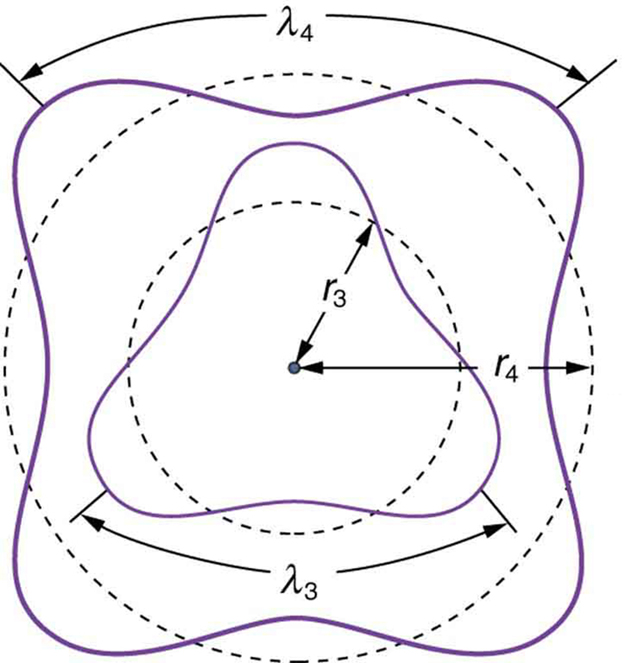
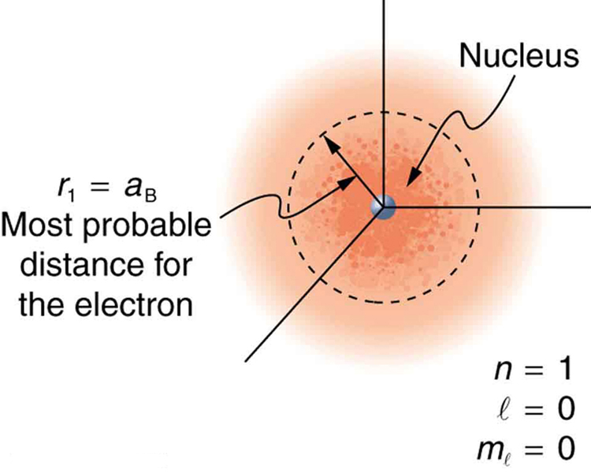

* Explain Bohr’s model of atom.
* Define and describe quantization of angular momentum.
* Calculate the angular momentum for an orbit of atom.
* Define and describe the wave-like properties of matter.

After visiting some of the applications of different aspects of atomic physics, we now return to the basic theory that was built upon Bohr’s atom. Einstein once said it was important to keep asking the questions we eventually teach children not to ask. Why is angular momentum quantized? You already know the answer. Electrons have wave-like properties, as de Broglie later proposed. They can exist only where they interfere constructively, and only certain orbits meet proper conditions, as we shall see in the next module.

Following Bohr’s initial work on the hydrogen atom, a decade was to pass before de Broglie proposed that matter has wave properties. The wave-like properties of matter were subsequently confirmed by observations of electron interference when scattered from crystals. Electrons can exist only in locations where they interfere constructively. How does this affect electrons in atomic orbits? When an electron is bound to an atom, its wavelength must fit into a small space, something like a standing wave on a string. (See [\[link\]](#import-auto-id2628777).) Allowed orbits are those orbits in which an electron constructively interferes with itself. Not all orbits produce constructive interference. Thus only certain orbits are allowed—the orbits are quantized.

![Figure a shows a string tied between two fixed supports. The string is being vibrated, which generates waves on the string. Figure b shows a circular orbit of radius r and a triangular shaped wave representing an electron. The condition for constructive interference and an allowed orbit given as two pi r is equal to n times lambda where n is an integer. Figure c shows a circular orbit of radius r prime and an irregular shaped wave representing an electron. The condition for destructive interference and a forbidden orbit is given as two pi r prime is not equal to n times lambda prime where n is an integer.](../resources/Figure_31_06_00a.jpg "(a) Waves on a string have a wavelength related to the length of the string, allowing them to interfere constructively. (b) If we imagine the string bent into a closed circle, we get a rough idea of how electrons in circular orbits can interfere constructively. (c) If the wavelength does not fit into the circumference, the electron interferes destructively; it cannot exist in such an orbit."){: #import-auto-id2628777}

For a circular orbit, constructive interference occurs when the electron’s wavelength fits neatly into the circumference, so that wave crests always align with crests and wave troughs align with troughs, as shown in [\[link\]](#import-auto-id2628777) (b). More precisely, when an integral multiple of the electron’s wavelength equals the circumference of the orbit, constructive interference is obtained. In equation form, the *condition for constructive interference and an allowed electron orbit* is

<math xmlns="http://www.w3.org/1998/Math/MathML"><semantics><mrow><mrow><mrow><msub><mi fontstyle="italic">nλ</mi><mrow><mi>n</mi></mrow></msub><mo stretchy="false">=</mo><msub><mrow><mn>2</mn><mi fontstyle="italic">πr</mi></mrow><mrow><mi>n</mi></mrow></msub></mrow></mrow><mrow /></mrow><annotation encoding="StarMath 5.0"> size 12{nλ rSub { size 8{n} } =2πr rSub { size 8{n} } } {}</annotation></semantics><semantics><mrow><mrow><mfenced open="(" close=")"><mrow><mrow><mi>n</mi><mo stretchy="false">=</mo></mrow><mn>1, 2, 3 ...</mn></mrow></mfenced><mtext>,</mtext></mrow><mrow /></mrow><annotation encoding="StarMath 5.0"> size 12{ left (n=1, 2, 3 "." "." "." right )} {}</annotation></semantics></math>

where <math xmlns="http://www.w3.org/1998/Math/MathML"><semantics><mrow><mrow><msub><mi>λ</mi><mrow><mi>n</mi></mrow></msub></mrow></mrow></semantics></math>

 is the electron’s wavelength and <math xmlns="http://www.w3.org/1998/Math/MathML"><semantics><mrow><mrow><msub><mi>r</mi><mrow><mi>n</mi></mrow></msub></mrow></mrow></semantics></math>

 is the radius of that circular orbit. The de Broglie wavelength is <math xmlns="http://www.w3.org/1998/Math/MathML"><semantics><mrow> <mi>λ</mi><mo>=</mo><mi>h</mi><mo>/</mo><mi>p</mi><mo>=</mo><mi>h</mi><mo>/</mo><mi fontstyle="italic">mv</mi></mrow></semantics></math>

, and so here <math xmlns="http://www.w3.org/1998/Math/MathML"> <semantics> <mrow> <mi>λ</mi><mo>=</mo><mi>h</mi><mo>/</mo><msub><mi>m</mi> <mi>e</mi></msub> <mi>v</mi> </mrow> </semantics> </math>

. Substituting this into the previous condition for constructive interference produces an interesting result:

<math xmlns="http://www.w3.org/1998/Math/MathML"> <semantics> <mrow> <mrow> <mrow> <mfrac> <mstyle fontstyle="italic"> <mrow> <mtext>nh</mtext> </mrow> </mstyle> <mrow> <msub> <mi>m</mi> <mrow> <mi>e</mi> </mrow> </msub> <mi>v</mi> </mrow> </mfrac> <mo stretchy="false">=</mo> <msub> <mrow> <mn>2π</mn> <mi>r</mi> </mrow> <mrow> <mi>n</mi> </mrow> </msub> <mi>.</mi> </mrow> </mrow> <mrow /> </mrow> <annotation encoding="StarMath 5.0"> size 12{ { { ital "nh"} over {m rSub { size 8{e} } v} } =2πr rSub { size 8{n} } } {}</annotation> </semantics> </math>

Rearranging terms, and noting that **<math xmlns="http://www.w3.org/1998/Math/MathML"><semantics><mrow><mrow><mrow><mi>L</mi><mo stretchy="false">=</mo><mstyle fontstyle="italic"><mrow><mtext>mvr</mtext></mrow></mstyle></mrow></mrow><mrow /></mrow><annotation encoding="StarMath 5.0"> size 12{L= ital "mvr"} {}</annotation></semantics></math>

 for a circular orbit, we obtain the quantization of angular momentum as the condition for allowed orbits:

<math xmlns="http://www.w3.org/1998/Math/MathML"> <semantics> <mrow> <mrow> <mrow> <mrow> <mi>L</mi> <mo stretchy="false">=</mo> <msub> <mi>m</mi> <mrow> <mi>e</mi> </mrow> </msub> </mrow> <mrow> <mstyle fontstyle="italic"> <mrow> <msub> <mtext>vr</mtext> <mrow> <mi>n</mi> </mrow> </msub> </mrow> </mstyle> <mo stretchy="false">=</mo> <mi>n</mi> </mrow> <mfrac> <mi>h</mi> <mn>2π</mn> </mfrac> </mrow> </mrow> <mrow /> </mrow> <annotation encoding="StarMath 5.0"> size 12{L=m rSub { size 8{e} } ital "vr" rSub { size 8{n} } =n { {h} over {2π} } } {}</annotation> </semantics> <semantics> <mrow> <mrow> <mfenced open="(" close=")"> <mrow> <mrow> <mi>n</mi> <mo stretchy="false">=</mo> </mrow> <mn>1, 2, 3 ...</mn> </mrow> </mfenced> <mtext>.</mtext> </mrow> <mrow /> </mrow> <annotation encoding="StarMath 5.0"> size 12{ left (n=1, 2, 3 "." "." "." right )} {}</annotation> </semantics> </math>

This is what Bohr was forced to hypothesize as the rule for allowed orbits, as stated earlier. We now realize that it is the condition for constructive interference of an electron in a circular orbit. [\[link\]](#import-auto-id1909367) illustrates this for <math xmlns="http://www.w3.org/1998/Math/MathML"><semantics><mrow><mrow><mrow><mi>n</mi><mo stretchy="false">=</mo><mn>3</mn></mrow></mrow><mrow /></mrow><annotation encoding="StarMath 5.0"> size 12{n=3} {}</annotation></semantics></math>

 and <math xmlns="http://www.w3.org/1998/Math/MathML"><semantics><mrow><mrow><mrow><mi>n</mi><mo stretchy="false">=</mo><mn>4.</mn></mrow></mrow><mrow /></mrow><annotation encoding="StarMath 5.0"> size 12{n=3} {}</annotation></semantics></math>

Waves and Quantization

The wave nature of matter is responsible for the quantization of energy levels in bound systems. Only those states where matter interferes constructively exist, or are “allowed.” Since there is a lowest orbit where this is possible in an atom, the electron cannot spiral into the nucleus. It cannot exist closer to or inside the nucleus. The wave nature of matter is what prevents matter from collapsing and gives atoms their sizes.

 {: #import-auto-id1909367}

Because of the wave character of matter, the idea of well-defined orbits gives way to a model in which there is a cloud of probability, consistent with Heisenberg’s uncertainty principle. [\[link\]](#import-auto-id2396594) shows how this applies to the ground state of hydrogen. If you try to follow the electron in some well-defined orbit using a probe that has a small enough wavelength to get some details, you will instead knock the electron out of its orbit. Each measurement of the electron’s position will find it to be in a definite location somewhere near the nucleus. Repeated measurements reveal a cloud of probability like that in the figure, with each speck the location determined by a single measurement. There is not a well-defined, circular-orbit type of distribution. Nature again proves to be different on a small scale than on a macroscopic scale.

{: #import-auto-id2396594}

There are many examples in which the wave nature of matter causes quantization in bound systems such as the atom. Whenever a particle is confined or bound to a small space, its allowed wavelengths are those which fit into that space. For example, the particle in a box model describes a particle free to move in a small space surrounded by impenetrable barriers. This is true in blackbody radiators (atoms and molecules) as well as in atomic and molecular spectra. Various atoms and molecules will have different sets of electron orbits, depending on the size and complexity of the system. When a system is large, such as a grain of sand, the tiny particle waves in it can fit in so many ways that it becomes impossible to see that the allowed states are discrete. Thus the correspondence principle is satisfied. As systems become large, they gradually look less grainy, and quantization becomes less evident. Unbound systems (small or not), such as an electron freed from an atom, do not have quantized energies, since their wavelengths are not constrained to fit in a certain volume.

PhET Explorations: Quantum Wave Interference

When do photons, electrons, and atoms behave like particles and when do they behave like waves? Watch waves spread out and interfere as they pass through a double slit, then get detected on a screen as tiny dots. Use quantum detectors to explore how measurements change the waves and the patterns they produce on the screen.

<figure markdown="1" id="eip-id1724263">
<figcaption>
[Quantum Wave Interference](quantum-wave-interference_en.jar)
</figcaption>
 {: data-type="image"}  
</figure>

# Section Summary

* Quantization of orbital energy is caused by the wave nature of matter. Allowed orbits in atoms occur for constructive interference of electrons in the orbit, requiring an integral number of wavelengths to fit in an orbit’s circumference; that is,
  

  <math xmlns="http://www.w3.org/1998/Math/MathML"> <semantics> <mrow> <mrow> <mrow> <msub> <mi fontstyle="italic">nλ</mi> <mrow> <mi>n</mi> </mrow> </msub> <mo stretchy="false">=</mo> <msub> <mrow> <mn>2</mn><mi fontstyle="italic">πr</mi> </mrow> <mi>n</mi> </msub> </mrow> </mrow> <mrow /> </mrow> <annotation encoding="StarMath 5.0"> size 12{nλ rSub { size 8{n} } =2πr rSub { size 8{n} } } {}</annotation> </semantics> <semantics> <mrow> <mrow> <mrow> <mfenced open="(" close=")"> <mrow> <mrow> <mi>n</mi> <mo stretchy="false">=</mo> </mrow> <mn>1, 2, 3 ...</mn> </mrow> </mfenced> <mi>,</mi> </mrow> </mrow> <mrow /> </mrow> <annotation encoding="StarMath 5.0"> size 12{ left (n=1, 2, 3 "." "." "." right ),} {}</annotation> </semantics></math>
  

  
  where
  <math xmlns="http://www.w3.org/1998/Math/MathML"><semantics><mrow><mrow><msub><mi>λ</mi><mrow><mi>n</mi></mrow></msub></mrow><mrow /></mrow><annotation encoding="StarMath 5.0"> size 12{λ rSub { size 8{n} } } {}</annotation></semantics></math>
  
  is the electron’s de Broglie wavelength.
* Owing to the wave nature of electrons and the Heisenberg uncertainty principle, there are no well-defined orbits; rather, there are clouds of probability.
* Bohr correctly proposed that the energy and radii of the orbits of electrons in atoms are quantized, with energy for transitions between orbits given by
  

  <math xmlns="http://www.w3.org/1998/Math/MathML"><semantics><mrow><mrow><mrow><mrow><mn>Δ</mn><mi fontstyle="italic">E</mi><mo stretchy="false">=</mo><mrow><mtext fontstyle="italic">hf</mtext></mrow></mrow><mo stretchy="false">=</mo><mrow><msub><mi>E</mi><mrow><mtext>i</mtext></mrow></msub><mo stretchy="false">−</mo><msub><mi>E</mi><mrow><mtext>f</mtext></mrow></msub></mrow></mrow></mrow><mo>,</mo><mrow /></mrow><annotation encoding="StarMath 5.0"> size 12{ΔE= ital "hf"=E rSub { size 8{i} } - E rSub { size 8{f} } } {}</annotation></semantics></math>
  

  
  where
  <math xmlns="http://www.w3.org/1998/Math/MathML"><semantics><mrow><mrow><mn>Δ</mn><mi fontstyle="italic">E</mi></mrow><mrow /></mrow><annotation encoding="StarMath 5.0"> size 12{ΔE} {}</annotation></semantics></math>
  
  is the change in energy between the initial and final orbits and
  <math xmlns="http://www.w3.org/1998/Math/MathML"><semantics><mrow><mrow><mstyle fontstyle="italic"><mrow><mtext>hf</mtext></mrow></mstyle></mrow><mrow /></mrow><annotation encoding="StarMath 5.0"> size 12{ ital "hf"} {}</annotation></semantics></math>
  
  is the energy of an absorbed or emitted photon.
* It is useful to plot orbit energies on a vertical graph called an energy-level diagram.
* The allowed orbits are circular, Bohr proposed, and must have quantized orbital angular momentum given by
  

  <math xmlns="http://www.w3.org/1998/Math/MathML"> <semantics> <mrow> <mrow> <mrow> <mrow> <mi>L</mi> <mo stretchy="false">=</mo> <msub> <mi>m</mi> <mi>e</mi> </msub> </mrow> <mrow> <mrow> <msub> <mtext fontstyle="italic">vr</mtext> <mi>n</mi> </msub> </mrow> <mo stretchy="false">=</mo> <mi>n</mi> </mrow> <mfrac> <mi>h</mi> <mn>2π</mn> </mfrac> </mrow> </mrow> <mrow /> </mrow> <annotation encoding="StarMath 5.0"> size 12{L=m rSub { size 8{e} } ital "vr" rSub { size 8{n} } =n { {h} over {2π} } } {}</annotation> </semantics> <semantics> <mrow> <mrow> <mrow> <mfenced open="(" close=")"> <mrow> <mrow> <mi>n</mi> <mo stretchy="false">=</mo> <mn>1, 2, 3 ...</mn> </mrow> </mrow> </mfenced> <mi>,</mi> </mrow> </mrow> <mrow /> </mrow> <annotation encoding="StarMath 5.0"> size 12{ left (n=1, 2, 3 "." "." "." right ),} {}</annotation> </semantics> </math>
  

  
  where
  <math xmlns="http://www.w3.org/1998/Math/MathML"><semantics><mrow><mrow><mi>L</mi></mrow><mrow /></mrow><annotation encoding="StarMath 5.0"> size 12{L} {}</annotation></semantics></math>
  
  is the angular momentum,
  <math xmlns="http://www.w3.org/1998/Math/MathML"><semantics><mrow><mrow><msub><mi>r</mi><mrow><mi>n</mi></mrow></msub></mrow><mrow /></mrow><annotation encoding="StarMath 5.0"> size 12{r rSub { size 8{n} } } {}</annotation></semantics></math>
  
  is the radius of orbit
  <math xmlns="http://www.w3.org/1998/Math/MathML"><semantics><mrow><mrow><msup><mi>n</mi><mrow /></msup></mrow><mrow /></mrow><annotation encoding="StarMath 5.0"> size 12{n rSup { size 8{"th"} } } {}</annotation></semantics></math>
  
  , and
  <math xmlns="http://www.w3.org/1998/Math/MathML"><semantics><mrow><mrow><mi>h</mi></mrow><mrow /></mrow><annotation encoding="StarMath 5.0"> size 12{h} {}</annotation></semantics></math>
  
  is Planck’s constant.

# Conceptual Questions

How is the de Broglie wavelength of electrons related to the quantization of their orbits in atoms and molecules?

