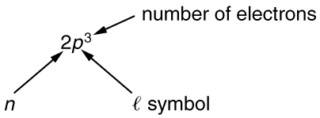
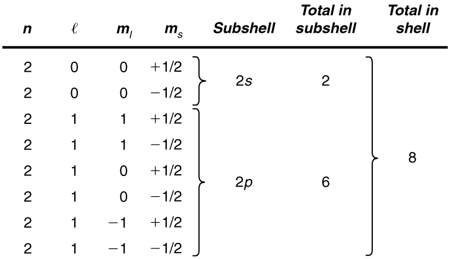

* Define the composition of an atom along with its electrons, neutrons, and protons.
* Explain the Pauli exclusion principle and its application to the atom.
* Specify the shell and subshell symbols and their positions.
* Define the position of electrons in different shells of an atom.
* State the position of each element in the periodic table according to shell filling.

# Multiple-Electron Atoms

All atoms except hydrogen are multiple-electron atoms. The physical and chemical properties of elements are directly related to the number of electrons a neutral atom has. The periodic table of the elements groups elements with similar properties into columns. This systematic organization is related to the number of electrons in a neutral atom, called the **atomic number**{: data-type="term" #import-auto-id1430981}, <math xmlns="http://www.w3.org/1998/Math/MathML"><semantics><mrow><mrow><mi>Z</mi></mrow><mrow /></mrow><annotation encoding="StarMath 5.0"> size 12{n} {}</annotation></semantics></math>

. We shall see in this section that the exclusion principle is key to the underlying explanations, and that it applies far beyond the realm of atomic physics.

In 1925, the Austrian physicist Wolfgang Pauli (see [\[link\]](#fs-id2688367)) proposed the following rule: No two electrons can have the same set of quantum numbers. That is, no two electrons can be in the same state. This statement is known as the **Pauli exclusion principle**{: data-type="term" #import-auto-id1931568}, because it excludes electrons from being in the same state. The Pauli exclusion principle is extremely powerful and very broadly applicable. It applies to any identical particles with half-integral intrinsic spin—that is, having <math xmlns="http://www.w3.org/1998/Math/MathML"><semantics><mrow><mrow><mrow><mrow><mi>s</mi><mo stretchy="false">=</mo><mrow><mn>1/2, 3/2, ...</mn></mrow></mrow></mrow></mrow><mrow /></mrow><annotation encoding="StarMath 5.0"> size 12{s=1/2,`3/2, "." "." "." "." } {}</annotation></semantics></math>

 Thus no two electrons can have the same set of quantum numbers.

Pauli Exclusion Principle

No two electrons can have the same set of quantum numbers. That is, no two electrons can be in the same state.

  played a major role in the development of quantum mechanics. He proposed the exclusion principle; hypothesized the existence of an important particle, called the neutrino, before it was directly observed; made fundamental contributions to several areas of theoretical physics; and influenced many students who went on to do important work of their own. (credit: Nobel Foundation, via Wikimedia Commons)"){: data-media-type="image/jpg"}

Let us examine how the exclusion principle applies to electrons in atoms. The quantum numbers involved were defined in [Quantum Numbers and Rules](/m42614) as <math xmlns="http://www.w3.org/1998/Math/MathML"><semantics><mrow><mrow><mrow><mi fontstyle="italic">n, l,</mi><mspace width="0.25em" /><msub><mi>m</mi><mrow><mi>l</mi></mrow></msub><mi fontstyle="italic">, s</mi></mrow></mrow><mrow /></mrow></semantics></math>

, and <math xmlns="http://www.w3.org/1998/Math/MathML"><semantics><mrow><mrow><msub><mi>m</mi><mrow><mi>s</mi></mrow></msub></mrow><mrow /></mrow><annotation encoding="StarMath 5.0"> size 12{m rSub { size 8{s} } } {}</annotation></semantics></math>

. Since <math xmlns="http://www.w3.org/1998/Math/MathML"><semantics><mrow><mrow><mi>s</mi></mrow><mrow /></mrow><annotation encoding="StarMath 5.0"> size 12{s} {}</annotation></semantics></math>

 is always <math xmlns="http://www.w3.org/1998/Math/MathML"><semantics><mrow><mrow><mrow><mn>1</mn><mo stretchy="false">/</mo><mn>2</mn></mrow></mrow><mrow /></mrow><annotation encoding="StarMath 5.0"> size 12{1/2} {}</annotation></semantics></math>

 for electrons, it is redundant to list <math xmlns="http://www.w3.org/1998/Math/MathML"><semantics><mrow><mrow><mi>s</mi></mrow><mrow /></mrow></semantics></math>

, and so we omit it and specify the state of an electron by a set of four numbers <math xmlns="http://www.w3.org/1998/Math/MathML"><semantics><mrow><mrow><mfenced open="(" close=")"><mrow><mi>n</mi><mi>,</mi><mspace width="0.25em" /><mi>l</mi><mi>,</mi><mspace width="0.25em" /><msub><mi>m</mi><mrow><mi>l</mi></mrow></msub><mi>,</mi><mspace width="0.25em" /><msub><mi>m</mi><mrow><mi>s</mi></mrow></msub></mrow></mfenced></mrow><mrow /></mrow></semantics></math>

. For example, the quantum numbers <math xmlns="http://www.w3.org/1998/Math/MathML"><semantics><mrow><mrow><mfenced open="(" close=")"><mrow><mn>2, 1, 0,</mn><mspace width="0.25em" /><mrow><mi /><mo stretchy="false">−</mo><mrow><mn>1</mn><mo stretchy="false">/</mo><mn>2</mn></mrow></mrow></mrow></mfenced></mrow><mrow /></mrow><annotation encoding="StarMath 5.0"> size 12{ left (2,` 1,` 0,` - 1/2 right )} {}</annotation></semantics></math>

 completely specify the state of an electron in an atom.

Since no two electrons can have the same set of quantum numbers, there are limits to how many of them can be in the same energy state. Note that <math xmlns="http://www.w3.org/1998/Math/MathML"><semantics><mrow><mrow><mi>n</mi></mrow><mrow /></mrow><annotation encoding="StarMath 5.0"> size 12{n} {}</annotation></semantics></math>

 determines the energy state in the absence of a magnetic field. So we first choose <math xmlns="http://www.w3.org/1998/Math/MathML"><semantics><mrow><mrow><mi>n</mi></mrow><mrow /></mrow><annotation encoding="StarMath 5.0"> size 12{n} {}</annotation></semantics></math>

, and then we see how many electrons can be in this energy state or energy level. Consider the <math xmlns="http://www.w3.org/1998/Math/MathML"><semantics><mrow><mrow><mrow><mi>n</mi><mo stretchy="false">=</mo><mn>1</mn></mrow></mrow><mrow /></mrow><annotation encoding="StarMath 5.0"> size 12{n=1} {}</annotation></semantics></math>

 level, for example. The only value <math xmlns="http://www.w3.org/1998/Math/MathML"><semantics><mrow><mrow><mi>l</mi></mrow><mrow /></mrow><annotation encoding="StarMath 5.0"> size 12{l} {}</annotation></semantics></math>

 can have is 0 (see [\[link\]](/m42614#import-auto-id3013526) for a list of possible values once <math xmlns="http://www.w3.org/1998/Math/MathML"><semantics><mrow><mrow><mi>n</mi></mrow><mrow /></mrow><annotation encoding="StarMath 5.0"> size 12{n} {}</annotation></semantics></math>

 is known), and thus <math xmlns="http://www.w3.org/1998/Math/MathML"><semantics><mrow><mrow><msub><mi>m</mi><mrow><mi>l</mi></mrow></msub></mrow><mrow /></mrow></semantics></math>

 can only be 0. The spin projection <math xmlns="http://www.w3.org/1998/Math/MathML"><semantics><mrow><mrow><msub><mi>m</mi><mrow><mi>s</mi></mrow></msub></mrow><mrow /></mrow></semantics></math>

 can be either <math xmlns="http://www.w3.org/1998/Math/MathML"><semantics><mrow><mrow><mrow><mrow><mo stretchy="false">+</mo><mn>1</mn></mrow><mo stretchy="false">/</mo><mn>2</mn></mrow></mrow><mrow /></mrow></semantics></math>

 or <math xmlns="http://www.w3.org/1998/Math/MathML"><semantics><mrow><mrow><mrow><mrow><mo stretchy="false">−</mo><mn>1</mn></mrow><mo stretchy="false">/</mo><mn>2</mn></mrow></mrow><mrow /></mrow></semantics></math>

, and so there can be two electrons in the <math xmlns="http://www.w3.org/1998/Math/MathML"><semantics><mrow><mrow><mrow><mi>n</mi><mo stretchy="false">=</mo><mn>1</mn></mrow></mrow><mrow /></mrow></semantics></math>

 state. One has quantum numbers <math xmlns="http://www.w3.org/1998/Math/MathML"><semantics><mrow><mrow><mfenced open="(" close=")"><mrow><mn>1, 0, 0,</mn><mrow><mspace width="0.25em" /><mo stretchy="false">+</mo><mrow><mn>1/2</mn></mrow></mrow></mrow></mfenced></mrow><mrow /></mrow></semantics></math>

, and the other has <math xmlns="http://www.w3.org/1998/Math/MathML"><semantics><mrow><mrow><mfenced open="(" close=")"><mrow><mn>1, 0, 0,</mn><mspace width="0.25em" /><mrow><mo stretchy="false">−</mo><mrow><mn>1/2</mn></mrow></mrow></mrow></mfenced></mrow><mrow /></mrow></semantics></math>

. [\[link\]](#fs-id2930681) illustrates that there can be one or two electrons having <math xmlns="http://www.w3.org/1998/Math/MathML"><semantics><mrow><mrow><mrow><mi>n</mi><mo stretchy="false">=</mo><mn>1</mn></mrow></mrow><mrow /></mrow><annotation encoding="StarMath 5.0"> size 12{n=1} {}</annotation></semantics></math>

, but not three.

![The figure here shows configuration of electrons. At the top, the key shows two purple balls, which depict electrons. The upward directed arrow on the first ball or electron shows its spin is plus one half, and the downward arrow on the second electron shows the opposite spin that is minus one half. Two other sections show the electronic configurations of electrons for two levels, n equal to one and n equal to two. One section shows the allowed configurations of the electron in the n is equal to one and two levels, and the second section for the configurations which are not allowed. In the allowed section, n is equal to two has three vacant shells and one electron in each of the outer two shells, one with spin up and one with spin down; and n is equal to one configuration has two shells containing one each spin up and spin down electron and the three other shells containing combinations of both spins each. For the not allowed section, n is equal to two have all vacant shells and n is equal to one have unevenly balanced electrons in its shells.](../resources/Figure_31_09_02a.jpg "The Pauli exclusion principle explains why some configurations of electrons are allowed while others are not. Since electrons cannot have the same set of quantum numbers, a maximum of two can be in the n=1 size 12{n=1} {} level, and a third electron must reside in the higher-energy n=2 size 12{n=2} {} level. If there are two electrons in the n=1 size 12{n=1} {} level, their spins must be in opposite directions. (More precisely, their spin projections must differ.)"){: data-media-type="image/jpg"}

# Shells and Subshells

Because of the Pauli exclusion principle, only hydrogen and helium can have all of their electrons in the <math xmlns="http://www.w3.org/1998/Math/MathML"><semantics><mrow><mrow><mrow><mi>n</mi><mo stretchy="false">=</mo><mn>1</mn></mrow></mrow><mrow /></mrow><annotation encoding="StarMath 5.0"> size 12{n=1} {}</annotation></semantics></math>

 state. Lithium (see the periodic table) has three electrons, and so one must be in the <math xmlns="http://www.w3.org/1998/Math/MathML"><semantics><mrow><mrow><mrow><mi>n</mi><mo stretchy="false">=</mo><mn>2</mn></mrow></mrow><mrow /></mrow><annotation encoding="StarMath 5.0"> size 12{n=2} {}</annotation></semantics></math>

 level. This leads to the concept of shells and shell filling. As we progress up in the number of electrons, we go from hydrogen to helium, lithium, beryllium, boron, and so on, and we see that there are limits to the number of electrons for each value of <math xmlns="http://www.w3.org/1998/Math/MathML"><semantics><mrow><mrow><mi>n</mi></mrow><mrow /></mrow><annotation encoding="StarMath 5.0"> size 12{n} {}</annotation></semantics></math>

. Higher values of the shell <math xmlns="http://www.w3.org/1998/Math/MathML"><semantics><mrow><mrow><mi>n</mi></mrow><mrow /></mrow><annotation encoding="StarMath 5.0"> size 12{n} {}</annotation></semantics></math>

 correspond to higher energies, and they can allow more electrons because of the various combinations of <math xmlns="http://www.w3.org/1998/Math/MathML"><semantics><mrow><mrow><mrow><mi>l</mi><mi>,</mi><mspace width="0.25em" /><msub><mi>m</mi><mrow><mi>l</mi></mrow></msub></mrow></mrow><mrow /></mrow><annotation encoding="StarMath 5.0"> size 12{l, m rSub { size 8{l} } } {}</annotation></semantics></math>

, and <math xmlns="http://www.w3.org/1998/Math/MathML"><semantics><mrow><mrow><msub><mi>m</mi><mrow><mi>s</mi></mrow></msub></mrow><mrow /></mrow><annotation encoding="StarMath 5.0"> size 12{m rSub { size 8{s} } } {}</annotation></semantics></math>

 that are possible. Each value of the principal quantum number <math xmlns="http://www.w3.org/1998/Math/MathML"><semantics><mrow><mrow><mi>n</mi></mrow><mrow /></mrow><annotation encoding="StarMath 5.0"> size 12{n} {}</annotation></semantics></math>

 thus corresponds to an atomic **shell**{: data-type="term" #import-auto-id2404667} into which a limited number of electrons can go. Shells and the number of electrons in them determine the physical and chemical properties of atoms, since it is the outermost electrons that interact most with anything outside the atom.

The probability clouds of electrons with the lowest value of <math xmlns="http://www.w3.org/1998/Math/MathML"><semantics><mrow><mrow><mi>l</mi></mrow><mrow /></mrow><annotation encoding="StarMath 5.0"> size 12{l} {}</annotation></semantics></math>

 are closest to the nucleus and, thus, more tightly bound. Thus when shells fill, they start with <math xmlns="http://www.w3.org/1998/Math/MathML"><semantics><mrow><mrow><mrow><mi>l</mi><mo stretchy="false">=</mo><mn>0</mn></mrow></mrow><mrow /></mrow><annotation encoding="StarMath 5.0"> size 12{l=0} {}</annotation></semantics></math>

, progress to <math xmlns="http://www.w3.org/1998/Math/MathML"><semantics><mrow><mrow><mrow><mi>l</mi><mo stretchy="false">=</mo><mn>1</mn></mrow></mrow><mrow /></mrow><annotation encoding="StarMath 5.0"> size 12{l=1} {}</annotation></semantics></math>

, and so on. Each value of <math xmlns="http://www.w3.org/1998/Math/MathML"><semantics><mrow><mrow><mi>l</mi></mrow><mrow /></mrow><annotation encoding="StarMath 5.0"> size 12{l} {}</annotation></semantics></math>

 thus corresponds to a **subshell**{: data-type="term" #import-auto-id1381606}.

The table given below lists symbols traditionally used to denote shells and subshells.

<table id="import-auto-id2016339" summary="A three-column table listing the shell n in the first column, the subshell number l in the second column, and the symbol for the subshell in the third column."><caption>Shell and Subshell Symbols</caption><thead>
           <tr>
            <th>Shell</th>
            <th colspan="2">Subshell</th>
          </tr>
  </thead><tbody>
          <tr>
            <td>
              <math xmlns="http://www.w3.org/1998/Math/MathML" display="block">
                <semantics>
                  <mrow>
                    
                      <mrow>
                        <mi>n</mi>
                      </mrow>
                    
                    <mrow />
                  </mrow>
                  <annotation encoding="StarMath 5.0"> size 12{n} {}</annotation>
                </semantics>
              </math> 
            </td>
            <td>
              <math xmlns="http://www.w3.org/1998/Math/MathML" display="block">
                <semantics>
                  <mrow>
                    
                      <mrow>
                        <mi>l</mi>
                      </mrow>
                    
                    <mrow />
                  </mrow>
                  <annotation encoding="StarMath 5.0"> size 12{l} {}</annotation>
                </semantics>
              </math> 
            </td>
            <td><strong><em>Symbol</em></strong></td>
          </tr>
     
<tr>
            <td>1</td>
            <td>0</td>
            <td>
              <math xmlns="http://www.w3.org/1998/Math/MathML" display="block">
                <semantics>
                  <mrow>
                    
                      <mrow>
                        <mi>s</mi>
                      </mrow>
                    
                    <mrow />
                  </mrow>
                  <annotation encoding="StarMath 5.0"> size 12{s} {}</annotation>
                </semantics>
              </math> 
            </td>
          </tr><tr>
           <td>2</td>
            <td>1</td>
            <td>
              <math xmlns="http://www.w3.org/1998/Math/MathML" display="block">
                <semantics>
                  <mrow>
                   
                      <mrow>
                        <mi>p</mi>
                      </mrow>
                    
                    <mrow />
                  </mrow>
                  <annotation encoding="StarMath 5.0"> size 12{p} {}</annotation>
                </semantics>
              </math> 
            </td>
          </tr><tr>
           <td>3</td>
           <td>2</td>
            <td>
              <math xmlns="http://www.w3.org/1998/Math/MathML" display="block">
                <semantics>
                  <mrow>
                    
                      <mrow>
                        <mi>d</mi>
                      </mrow>
                    
                    <mrow />
                  </mrow>
                  <annotation encoding="StarMath 5.0"> size 12{d} {}</annotation>
                </semantics>
              </math> 
            </td>
          </tr><tr>
            <td>4</td>
          <td>3</td>
            <td>
              <math xmlns="http://www.w3.org/1998/Math/MathML" display="block">
                <semantics>
                  <mrow>
                    
                      <mrow>
                        <mi>f</mi>
                      </mrow>
                    
                    <mrow />
                  </mrow>
                  <annotation encoding="StarMath 5.0"> size 12{f} {}</annotation>
                </semantics>
              </math> 
            </td>
          </tr><tr>
            <td>5</td>
          <td>4</td>
            <td>
              <math xmlns="http://www.w3.org/1998/Math/MathML" display="block">
                <semantics>
                  <mrow>
                    
                      <mrow>
                        <mi>g</mi>
                      </mrow>
                    
                    <mrow />
                  </mrow>
                  <annotation encoding="StarMath 5.0"> size 12{g} {}</annotation>
                </semantics>
              </math> 
            </td>
          </tr><tr>
            <td />
          <td>5</td>
            <td>
              <math xmlns="http://www.w3.org/1998/Math/MathML" display="block">
                <semantics>
                  <mrow>
                    
                      <mrow>
                        <mi>h</mi>
                      </mrow>
                    
                    <mrow />
                  </mrow>
                  <annotation encoding="StarMath 5.0"> size 12{h} {}</annotation>
                </semantics>
              </math> 
            </td>
          </tr><tr>
            <td />
            <td>6It is unusual to deal with subshells having <math xmlns="http://www.w3.org/1998/Math/MathML">
 <semantics>
   <mi>l</mi>
 </semantics>
</math> greater than 6, but when encountered, they continue to be labeled in alphabetical order.</td>
            <td>
              <math xmlns="http://www.w3.org/1998/Math/MathML" display="block">
                <semantics>
                  <mrow>
                    
                      <mrow>
                        <mi>i</mi>
                      </mrow>
                    
                    <mrow />
                  </mrow>
                  <annotation encoding="StarMath 5.0"> size 12{i} {}</annotation>
                </semantics>
              </math> 
            </td>
          </tr></tbody></table>

To denote shells and subshells, we write <math xmlns="http://www.w3.org/1998/Math/MathML"><semantics><mrow><mrow><mstyle fontstyle="italic"><mrow><mtext>nl</mtext></mrow></mstyle></mrow><mrow /></mrow><annotation encoding="StarMath 5.0"> size 12{ ital "nl"} {}</annotation></semantics></math>

 with a number for <math xmlns="http://www.w3.org/1998/Math/MathML"><semantics><mrow><mrow><mi>n</mi></mrow><mrow /></mrow><annotation encoding="StarMath 5.0"> size 12{n} {}</annotation></semantics></math>

 and a letter for <math xmlns="http://www.w3.org/1998/Math/MathML"><semantics><mrow><mrow><mi>l</mi></mrow><mrow /></mrow><annotation encoding="StarMath 5.0"> size 12{l} {}</annotation></semantics></math>

. For example, an electron in the <math xmlns="http://www.w3.org/1998/Math/MathML"><semantics><mrow><mrow><mrow><mi>n</mi><mo stretchy="false">=</mo><mn>1</mn></mrow></mrow><mrow /></mrow><annotation encoding="StarMath 5.0"> size 12{n=1} {}</annotation></semantics></math>

 state must have <math xmlns="http://www.w3.org/1998/Math/MathML"><semantics><mrow><mrow><mrow><mi>l</mi><mo stretchy="false">=</mo><mn>0</mn></mrow></mrow><mrow /></mrow><annotation encoding="StarMath 5.0"> size 12{l=1} {}</annotation></semantics></math>

, and it is denoted as a <math xmlns="http://www.w3.org/1998/Math/MathML"><semantics><mrow><mrow><mn>1</mn><mi>s</mi></mrow><mrow /></mrow><annotation encoding="StarMath 5.0"> size 12{1s} {}</annotation></semantics></math>

 electron. Two electrons in the *<math xmlns="http://www.w3.org/1998/Math/MathML"><semantics><mrow><mrow><mrow><mi>n</mi><mo stretchy="false">=</mo><mn>1</mn></mrow></mrow><mrow /></mrow><annotation encoding="StarMath 5.0"> size 12{n=1} {}</annotation></semantics></math>

* state is denoted as <math xmlns="http://www.w3.org/1998/Math/MathML"><semantics><mrow><mrow><mn>1</mn><msup><mi>s</mi><mrow><mn>2</mn></mrow></msup></mrow><mrow /></mrow><annotation encoding="StarMath 5.0"> size 12{1s rSup { size 8{2} } } {}</annotation></semantics></math>

. Another example is an electron in the <math xmlns="http://www.w3.org/1998/Math/MathML"><semantics><mrow><mrow><mrow><mi>n</mi><mo stretchy="false">=</mo><mn>2</mn></mrow></mrow><mrow /></mrow><annotation encoding="StarMath 5.0"> size 12{n=2} {}</annotation></semantics></math>

 state with <math xmlns="http://www.w3.org/1998/Math/MathML"><semantics><mrow><mrow><mrow><mi>l</mi><mo stretchy="false">=</mo><mn>1</mn></mrow></mrow><mrow /></mrow><annotation encoding="StarMath 5.0"> size 12{l=1} {}</annotation></semantics></math>

, written as <math xmlns="http://www.w3.org/1998/Math/MathML"><semantics><mrow><mrow><mn>2</mn><mi>p</mi></mrow><mrow /></mrow><annotation encoding="StarMath 5.0"> size 12{2p} {}</annotation></semantics></math>

. The case of three electrons with these quantum numbers is written <math xmlns="http://www.w3.org/1998/Math/MathML"><semantics><mrow><mrow><mn>2</mn><msup><mi>p</mi><mrow><mn>3</mn></mrow></msup></mrow><mrow /></mrow><annotation encoding="StarMath 5.0"> size 12{2p rSup { size 8{3} } } {}</annotation></semantics></math>

. This notation, called spectroscopic notation, is generalized as shown in [\[link\]](#import-auto-id3354513).

{: #import-auto-id3354513 data-media-type="image/png"}

Counting the number of possible combinations of quantum numbers allowed by the exclusion principle, we can determine how many electrons it takes to fill each subshell and shell.

How Many Electrons Can Be in This Shell?

List all the possible sets of quantum numbers for the <math xmlns="http://www.w3.org/1998/Math/MathML"><semantics><mrow><mrow><mrow><mi>n</mi><mo stretchy="false">=</mo><mn>2</mn></mrow></mrow><mrow /></mrow><annotation encoding="StarMath 5.0"> size 12{n=2} {}</annotation></semantics></math>

 shell, and determine the number of electrons that can be in the shell and each of its subshells.

**Strategy**

Given <math xmlns="http://www.w3.org/1998/Math/MathML"><semantics><mrow><mrow><mrow><mi>n</mi><mo stretchy="false">=</mo><mn>2</mn></mrow></mrow><mrow /></mrow><annotation encoding="StarMath 5.0"> size 12{n=2} {}</annotation></semantics></math>

 for the shell, the rules for quantum numbers limit <math xmlns="http://www.w3.org/1998/Math/MathML"><semantics><mrow><mrow><mi>l</mi></mrow><mrow /></mrow><annotation encoding="StarMath 5.0"> size 12{l} {}</annotation></semantics></math>

 to be 0 or 1. The shell therefore has two subshells, labeled <math xmlns="http://www.w3.org/1998/Math/MathML"><semantics><mrow><mrow><mn>2</mn><mi>s</mi></mrow><mrow /></mrow><annotation encoding="StarMath 5.0"> size 12{2s} {}</annotation></semantics></math>

 and <math xmlns="http://www.w3.org/1998/Math/MathML"><semantics><mrow><mrow><mn>2</mn><mi>p</mi></mrow><mrow /></mrow><annotation encoding="StarMath 5.0"> size 12{2p} {}</annotation></semantics></math>

. Since the lowest <math xmlns="http://www.w3.org/1998/Math/MathML"><semantics><mrow><mrow><mi>l</mi></mrow><mrow /></mrow><annotation encoding="StarMath 5.0"> size 12{l} {}</annotation></semantics></math>

 subshell fills first, we start with the <math xmlns="http://www.w3.org/1998/Math/MathML"><semantics><mrow><mrow><mn>2</mn><mi>s</mi></mrow><mrow /></mrow><annotation encoding="StarMath 5.0"> size 12{2s} {}</annotation></semantics></math>

 subshell possibilities and then proceed with the <math xmlns="http://www.w3.org/1998/Math/MathML"><semantics><mrow><mrow><mn>2</mn><mi>p</mi></mrow><mrow /></mrow><annotation encoding="StarMath 5.0"> size 12{2p} {}</annotation></semantics></math>

 subshell.

**Solution**

It is convenient to list the possible quantum numbers in a table, as shown below.

{: data-media-type="image/jpg"}

**Discussion**

It is laborious to make a table like this every time we want to know how many electrons can be in a shell or subshell. There exist general rules that are easy to apply, as we shall now see.

The number of electrons that can be in a subshell depends entirely on the value of <math xmlns="http://www.w3.org/1998/Math/MathML"><semantics><mrow><mrow><mi>l</mi></mrow><mrow /></mrow><annotation encoding="StarMath 5.0"> size 12{l} {}</annotation></semantics></math>

. Once <math xmlns="http://www.w3.org/1998/Math/MathML"><semantics><mrow><mrow><mi>l</mi></mrow><mrow /></mrow><annotation encoding="StarMath 5.0"> size 12{l} {}</annotation></semantics></math>

 is known, there are a fixed number of values of <math xmlns="http://www.w3.org/1998/Math/MathML"><semantics><mrow><mrow><msub><mi>m</mi><mrow><mi>l</mi></mrow></msub></mrow><mrow /></mrow><annotation encoding="StarMath 5.0"> size 12{m rSub { size 8{l} } } {}</annotation></semantics></math>

, each of which can have two values for <math xmlns="http://www.w3.org/1998/Math/MathML"><semantics><mrow><mrow><msub><mi>m</mi><mrow><mi>s</mi></mrow></msub></mrow><mrow /></mrow><annotation encoding="StarMath 5.0"> size 12{m rSub { size 8{s} } } {}</annotation></semantics></math>

 First, since <math xmlns="http://www.w3.org/1998/Math/MathML"><semantics><mrow><mrow><msub><mi>m</mi><mrow><mi>l</mi></mrow></msub></mrow><mrow /></mrow><annotation encoding="StarMath 5.0"> size 12{m rSub { size 8{l} } } {}</annotation></semantics></math>

 goes from *<math xmlns="http://www.w3.org/1998/Math/MathML"><semantics><mrow><mrow><mrow><mo stretchy="false">−</mo><mi>l</mi></mrow></mrow><mrow /></mrow><annotation encoding="StarMath 5.0"> size 12{ - l} {}</annotation></semantics></math>

* to *l* in steps of 1, there are <math xmlns="http://www.w3.org/1998/Math/MathML"><semantics><mrow><mrow><mrow><mn>2</mn><mi>l</mi><mo stretchy="false">+</mo><mn>1</mn></mrow></mrow><mrow /></mrow><annotation encoding="StarMath 5.0"> size 12{2l+1} {}</annotation></semantics></math>

 possibilities. This number is multiplied by 2, since each electron can be spin up or spin down. Thus the *maximum number of electrons that can be in a subshell* is <math xmlns="http://www.w3.org/1998/Math/MathML"><semantics><mrow><mrow><mrow><mn>2</mn><mfenced open="(" close=")"><mrow><mn>2</mn><mi>l</mi><mo stretchy="false">+</mo><mn>1</mn></mrow></mfenced></mrow></mrow><mrow /></mrow><annotation encoding="StarMath 5.0"> size 12{2 left (2l+1 right )} {}</annotation></semantics></math>

.

For example, the <math xmlns="http://www.w3.org/1998/Math/MathML"><semantics><mrow><mrow><mn>2</mn><mi>s</mi></mrow><mrow /></mrow><annotation encoding="StarMath 5.0"> size 12{2s} {}</annotation></semantics></math>

 subshell in [\[link\]](#fs-id3151425) has a maximum of 2 electrons in it, since <math xmlns="http://www.w3.org/1998/Math/MathML"><semantics><mrow><mrow><mrow><mn>2</mn><mrow><mfenced open="(" close=")"><mrow><mn>2</mn><mi>l</mi><mo stretchy="false">+</mo><mn>1</mn></mrow></mfenced><mo stretchy="false">=</mo><mn>2</mn></mrow><mrow><mfenced open="(" close=")"><mrow><mn>0</mn><mo stretchy="false">+</mo><mn>1</mn></mrow></mfenced><mo stretchy="false">=</mo><mn>2</mn></mrow></mrow></mrow><mrow /></mrow><annotation encoding="StarMath 5.0"> size 12{2 left (2l+1 right )=2 left (0+1 right )=2} {}</annotation></semantics></math>

 for this subshell. Similarly, the <math xmlns="http://www.w3.org/1998/Math/MathML"><semantics><mrow><mrow><mn>2</mn><mi>p</mi></mrow><mrow /></mrow><annotation encoding="StarMath 5.0"> size 12{2p} {}</annotation></semantics></math>

 subshell has a maximum of 6 electrons, since <math xmlns="http://www.w3.org/1998/Math/MathML"><semantics><mrow><mrow><mrow><mn>2</mn><mrow><mfenced open="(" close=")"><mrow><mn>2</mn><mi>l</mi><mo stretchy="false">+</mo><mn>1</mn></mrow></mfenced><mo stretchy="false">=</mo><mn>2</mn></mrow><mrow><mfenced open="(" close=")"><mrow><mn>2</mn><mo stretchy="false">+</mo><mn>1</mn></mrow></mfenced><mo stretchy="false">=</mo><mn>6</mn></mrow></mrow></mrow><mrow /></mrow><annotation encoding="StarMath 5.0"> size 12{2 left (2l+1 right )=2 left (2+1 right )=6} {}</annotation></semantics></math>

. For a shell, the maximum number is the sum of what can fit in the subshells. Some algebra shows that the *maximum number of electrons that can be in a shell* is <math xmlns="http://www.w3.org/1998/Math/MathML"><semantics><mrow><mrow><mn>2</mn><msup><mi>n</mi><mrow><mn>2</mn></mrow></msup></mrow><mrow /></mrow><annotation encoding="StarMath 5.0"> size 12{2n rSup { size 8{2} } } {}</annotation></semantics></math>

.

For example, for the first shell <math xmlns="http://www.w3.org/1998/Math/MathML"><semantics><mrow><mrow><mrow><mi>n</mi><mo stretchy="false">=</mo><mn>1</mn></mrow></mrow><mrow /></mrow><annotation encoding="StarMath 5.0"> size 12{n=1} {}</annotation></semantics></math>

, and so <math xmlns="http://www.w3.org/1998/Math/MathML"><semantics><mrow><mrow><mrow><mn>2</mn><msup><mi>n</mi><mrow><mn>2</mn></mrow></msup><mo stretchy="false">=</mo><mn>2</mn></mrow></mrow><mrow /></mrow><annotation encoding="StarMath 5.0"> size 12{2n rSup { size 8{2} } =2} {}</annotation></semantics></math>

. We have already seen that only two electrons can be in the <math xmlns="http://www.w3.org/1998/Math/MathML"><semantics><mrow><mrow><mrow><mi>n</mi><mo stretchy="false">=</mo><mn>1</mn></mrow></mrow><mrow /></mrow><annotation encoding="StarMath 5.0"> size 12{n=1} {}</annotation></semantics></math>

 shell. Similarly, for the second shell, <math xmlns="http://www.w3.org/1998/Math/MathML"><semantics><mrow><mrow><mrow><mi>n</mi><mo stretchy="false">=</mo><mn>2</mn></mrow></mrow><mrow /></mrow><annotation encoding="StarMath 5.0"> size 12{n=2} {}</annotation></semantics></math>

, and so <math xmlns="http://www.w3.org/1998/Math/MathML"><semantics><mrow><mrow><mrow><mn>2</mn><msup><mi>n</mi><mrow><mn>2</mn></mrow></msup><mo stretchy="false">=</mo><mn>8</mn></mrow></mrow><mrow /></mrow><annotation encoding="StarMath 5.0"> size 12{2n rSup { size 8{2} } =8} {}</annotation></semantics></math>

. As found in [\[link\]](#fs-id3151425), the total number of electrons in the <math xmlns="http://www.w3.org/1998/Math/MathML"><semantics><mrow><mrow><mrow><mi>n</mi><mo stretchy="false">=</mo><mn>2</mn></mrow></mrow><mrow /></mrow><annotation encoding="StarMath 5.0"> size 12{n=2} {}</annotation></semantics></math>

 shell is 8.

Subshells and Totals for
<math xmlns="http://www.w3.org/1998/Math/MathML"><semantics><mrow><mrow><mrow><mi>n</mi><mo stretchy="false">=</mo><mn>3</mn></mrow></mrow><mrow /></mrow><annotation encoding="StarMath 5.0"> size 12{n=3} {}</annotation></semantics></math>

How many subshells are in the <math xmlns="http://www.w3.org/1998/Math/MathML"><semantics><mrow><mrow><mrow><mi>n</mi><mo stretchy="false">=</mo><mn>3</mn></mrow></mrow><mrow /></mrow><annotation encoding="StarMath 5.0"> size 12{n=3} {}</annotation></semantics></math>

 shell? Identify each subshell, calculate the maximum number of electrons that will fit into each, and verify that the total is <math xmlns="http://www.w3.org/1998/Math/MathML"><semantics><mrow><mrow><mn>2</mn><msup><mi>n</mi><mrow><mn>2</mn></mrow></msup></mrow><mrow /></mrow><annotation encoding="StarMath 5.0"> size 12{2n rSup { size 8{2} } } {}</annotation></semantics></math>

.

**Strategy**

Subshells are determined by the value of <math xmlns="http://www.w3.org/1998/Math/MathML"><semantics><mrow><mrow><mi>l</mi></mrow><mrow /></mrow><annotation encoding="StarMath 5.0"> size 12{l} {}</annotation></semantics></math>

; thus, we first determine which values of <math xmlns="http://www.w3.org/1998/Math/MathML"><semantics><mrow><mrow><mstyle fontstyle="italic"><mrow><mtext>l</mtext></mrow></mstyle></mrow><mrow /></mrow><annotation encoding="StarMath 5.0"> size 12{ ital "ls"} {}</annotation></semantics></math>

 are allowed, and then we apply the equation “maximum number of electrons that can be in a subshell <math xmlns="http://www.w3.org/1998/Math/MathML"><semantics><mrow><mrow><mrow><mo>=</mo><mn>2</mn><mfenced open="(" close=")"><mrow><mn>2</mn><mi>l</mi><mo stretchy="false">+</mo><mn>1</mn></mrow></mfenced></mrow></mrow><mrow /></mrow><annotation encoding="StarMath 5.0"> size 12{2 left (2l+1 right )} {}</annotation></semantics></math>

” to find the number of electrons in each subshell.

**Solution**

Since <math xmlns="http://www.w3.org/1998/Math/MathML"><semantics><mrow><mrow><mrow><mi>n</mi><mo stretchy="false">=</mo><mn>3</mn></mrow></mrow><mrow /></mrow><annotation encoding="StarMath 5.0"> size 12{n=3} {}</annotation></semantics></math>

, we know that <math xmlns="http://www.w3.org/1998/Math/MathML"> <semantics> <mi>l</mi> </semantics> </math>

 can be <math xmlns="http://www.w3.org/1998/Math/MathML"><semantics><mrow><mrow><mrow><mn>0, 1</mn></mrow></mrow><mrow /></mrow></semantics></math>

, or <math xmlns="http://www.w3.org/1998/Math/MathML"><semantics><mrow><mrow><mn>2</mn></mrow><mrow /></mrow></semantics></math>

; thus, there are three possible subshells. In standard notation, they are labeled the <math xmlns="http://www.w3.org/1998/Math/MathML"><semantics><mrow><mrow><mn>3</mn><mi>s</mi></mrow><mrow /></mrow></semantics></math>

, <math xmlns="http://www.w3.org/1998/Math/MathML"><semantics><mrow><mrow><mn>3</mn><mi>p</mi></mrow><mrow /></mrow></semantics></math>

, and <math xmlns="http://www.w3.org/1998/Math/MathML"><semantics><mrow><mrow><mn>3</mn><mi>d</mi></mrow><mrow /></mrow><annotation encoding="StarMath 5.0"> size 12{3d} {}</annotation></semantics></math>

 subshells. We have already seen that 2 electrons can be in an <math xmlns="http://www.w3.org/1998/Math/MathML"><semantics><mrow><mrow><mi>s</mi></mrow><mrow /></mrow></semantics></math>

 state, and 6 in a <math xmlns="http://www.w3.org/1998/Math/MathML"><semantics><mrow><mrow><mi>p</mi></mrow><mrow /></mrow><annotation encoding="StarMath 5.0"> size 12{p} {}</annotation></semantics></math>

** state, but let us use the equation “maximum number of electrons that can be in a subshell = <math xmlns="http://www.w3.org/1998/Math/MathML"><semantics><mrow><mrow><mrow><mn>2</mn><mfenced open="(" close=")"><mrow><mn>2</mn><mi>l</mi><mo stretchy="false">+</mo><mn>1</mn></mrow></mfenced></mrow></mrow><mrow /></mrow><annotation encoding="StarMath 5.0"> size 12{2 left (2l+1 right )} {}</annotation></semantics></math>

” to calculate the maximum number in each:

<math xmlns="http://www.w3.org/1998/Math/MathML"> <semantics> <mrow> <mrow> <mtable columnalign="left"> <mtr> <mtd> <mrow> <mrow> <mrow> <mn> 3 </mn> <mi> s </mi><mspace width="0.25em" /> <mtext> has </mtext><mspace width="0.25em" /> <mrow> <mi> l </mi> <mo stretchy="false"> = </mo> <mn> 0 </mn> </mrow> <mtext> ; </mtext><mspace width="0.25em" /> <mtext> thus, </mtext><mspace width="0.25em" /> <mn> 2 </mn> <mrow> <mfenced open="(" close=")"> <mrow> <mrow> <mn> 2</mn><mi>l </mi> <mo stretchy="false"> + </mo> <mn> 1 </mn> </mrow> </mrow> </mfenced> <mo stretchy="false"> = </mo> <mn> 2 </mn> </mrow> <mrow> <mfenced open="(" close=")"> <mrow> <mrow> <mn> 0 </mn> <mo stretchy="false"> + </mo> <mn> 1 </mn> </mrow> </mrow> </mfenced> <mo stretchy="false"> = </mo> <mn> 2 </mn> </mrow> </mrow> </mrow> <mrow /> </mrow> </mtd> </mtr> <mtr> <mtd> <mrow> <mrow> <mrow> <mn> 3 </mn> <mi> p </mi><mspace width="0.25em" /> <mtext> has </mtext><mspace width="0.25em" /> <mrow> <mi> l </mi> <mo stretchy="false"> = </mo> <mtext> 1; thus, 2 </mtext> </mrow> <mrow> <mfenced open="(" close=")"> <mrow> <mrow> <mn> 2</mn><mi>l </mi> <mo stretchy="false"> + </mo> <mn> 1 </mn> </mrow> </mrow> </mfenced> <mo stretchy="false"> = </mo> <mn> 2 </mn> </mrow> <mrow> <mfenced open="(" close=")"> <mrow> <mrow> <mn> 2 </mn> <mo stretchy="false"> + </mo> <mn> 1 </mn> </mrow> </mrow> </mfenced> <mo stretchy="false"> = </mo> <mn> 6 </mn> </mrow> </mrow> </mrow> </mrow> </mtd> </mtr> <mtr> <mtd> <mrow> <mrow> <mrow> <mn> 3 </mn> <mi> d </mi><mspace width="0.25em" /> <mtext> has </mtext><mspace width="0.25em" /> <mrow> <mi> l </mi> <mo stretchy="false"> = </mo> <mtext> 2; thus, 2 </mtext> </mrow> <mrow> <mfenced open="(" close=")"> <mrow> <mrow> <mn> 2</mn><mi>l </mi> <mo stretchy="false"> + </mo> <mn> 1 </mn> </mrow> </mrow> </mfenced> <mo stretchy="false"> = </mo> <mn> 2 </mn> </mrow> <mrow> <mfenced open="(" close=")"> <mrow> <mrow> <mn> 4 </mn> <mo stretchy="false"> + </mo> <mn> 1 </mn> </mrow> </mrow> </mfenced> <mo stretchy="false"> = </mo> <mtext> 10 </mtext> </mrow> </mrow> </mrow> </mrow> </mtd> </mtr> <mtr> <mtd> <mrow> <mrow> <mrow> <mrow> <mtext> Total </mtext> <mo stretchy="false"> = </mo> <mtext> 18 </mtext> </mrow> </mrow> </mrow> </mrow> </mtd> </mtr> <mtr> <mtd> <mrow> <mrow> <mrow> <mo stretchy="false"> ( </mo> <mtext> in the </mtext><mspace width="0.25em" /> <mrow> <mi> n </mi> <mo stretchy="false"> = </mo> <mtext> 3 shell </mtext> </mrow> <mo stretchy="false"> ) </mo> </mrow> </mrow> </mrow> </mtd> </mtr> </mtable> </mrow> </mrow> </semantics> </math>

The equation “maximum number of electrons that can be in a shell = <math xmlns="http://www.w3.org/1998/Math/MathML"><semantics><mrow><mrow><mn>2</mn><msup><mi>n</mi><mrow><mn>2</mn></mrow></msup></mrow><mrow /></mrow><annotation encoding="StarMath 5.0"> size 12{2n rSup { size 8{2} } } {}</annotation></semantics></math>

” gives the maximum number in the <math xmlns="http://www.w3.org/1998/Math/MathML"><semantics><mrow><mrow><mrow><mi>n</mi><mo stretchy="false">=</mo><mn>3</mn></mrow></mrow><mrow /></mrow><annotation encoding="StarMath 5.0"> size 12{n=3} {}</annotation></semantics></math>

 shell to be

<math xmlns="http://www.w3.org/1998/Math/MathML"><semantics><mrow><mrow><mrow><mrow><mrow><mtext>Maximum number of electrons</mtext><mo stretchy="false">=</mo><mn>2</mn><msup><mi>n</mi><mrow><mn>2</mn></mrow></msup></mrow><mo stretchy="false">=</mo><mn>2</mn></mrow><mrow><msup><mfenced open="(" close=")"><mn>3</mn></mfenced><mrow><mn>2</mn></mrow></msup><mo stretchy="false">=</mo><mn>2</mn></mrow><mrow><mfenced open="(" close=")"><mn>9</mn></mfenced><mo stretchy="false">=</mo><mtext>18.</mtext></mrow></mrow></mrow></mrow></semantics></math>

**Discussion**

The total number of electrons in the three possible subshells is thus the same as the formula <math xmlns="http://www.w3.org/1998/Math/MathML"><semantics><mrow><mrow><mn>2</mn><msup><mi>n</mi><mrow><mn>2</mn></mrow></msup></mrow><mrow /></mrow><annotation encoding="StarMath 5.0"> size 12{2n rSup { size 8{2} } } {}</annotation></semantics></math>

. In standard (spectroscopic) notation, a filled <math xmlns="http://www.w3.org/1998/Math/MathML"><semantics><mrow><mrow><mrow><mi>n</mi><mo stretchy="false">=</mo><mn>3</mn></mrow></mrow><mrow /></mrow><annotation encoding="StarMath 5.0"> size 12{n=3} {}</annotation></semantics></math>

 shell is denoted as <math xmlns="http://www.w3.org/1998/Math/MathML"><semantics><mrow><mrow><mrow><mn>3</mn><msup><mi>s</mi><mrow><mn>2</mn></mrow></msup><mn>3</mn><msup><mi>p</mi><mrow><mn>6</mn></mrow></msup><mn>3</mn><msup><mi>d</mi><mrow><mtext>10</mtext></mrow></msup></mrow></mrow><mrow /></mrow><annotation encoding="StarMath 5.0"> size 12{3s rSup { size 8{2} } 3p rSup { size 8{6} } 3d rSup { size 8{"10"} } } {}</annotation></semantics></math>

. Shells do not fill in a simple manner. Before the <math xmlns="http://www.w3.org/1998/Math/MathML"><semantics><mrow><mrow><mrow><mi>n</mi><mo stretchy="false">=</mo><mn>3</mn></mrow></mrow><mrow /></mrow><annotation encoding="StarMath 5.0"> size 12{n=3} {}</annotation></semantics></math>

 shell is completely filled, for example, we begin to find electrons in the <math xmlns="http://www.w3.org/1998/Math/MathML"><semantics><mrow><mrow><mrow><mi>n</mi><mo stretchy="false">=</mo><mn>4</mn></mrow></mrow><mrow /></mrow><annotation encoding="StarMath 5.0"> size 12{n=4} {}</annotation></semantics></math>

 shell.

# Shell Filling and the Periodic Table

[\[link\]](#import-auto-id1526216) shows electron configurations for the first 20 elements in the periodic table, starting with hydrogen and its single electron and ending with calcium. The Pauli exclusion principle determines the maximum number of electrons allowed in each shell and subshell. But the order in which the shells and subshells are filled is complicated because of the large numbers of interactions between electrons.

<table id="import-auto-id1526216" summary="Eight-column table listing Elements in column one and Number of electrons (Z) in column 2. Columns 3 through 8 list the ground state configurations for each element. Many of the cells in these columns are blank because some elements have fewer than six ground state configurations. A ditto mark &#x201C; in a cell indicates that its value is the same as the last cell above it containing a value."><caption>Electron Configurations of Elements Hydrogen Through Calcium</caption><thead><tr>
            <th>Element</th>
            <th>Number of electrons (Z)</th>
         <th colspan="6">Ground state configuration</th>
    </tr></thead><tbody><tr>
            <td>H</td>
            <td>1</td>
            <td>
              <math xmlns="http://www.w3.org/1998/Math/MathML" display="block">
                <semantics>
                  <mrow>
                    
                      <mrow>
                       <mn>1</mn>
                        <msup>
                          <mi>s</mi>
                            <mrow>
                              <mn>1</mn>
                            </mrow>
                          
                        </msup>
                      </mrow>
                    
                    <mrow />
                  </mrow>
                  <annotation encoding="StarMath 5.0"> size 12{1s rSup { size 8{1} } } {}</annotation>
                </semantics>
              </math> 
            </td>
            <td />
            <td />
            <td />
            <td />
            <td />
          </tr><tr>
            <td>He</td>
            <td>2</td>
            <td>
              <math xmlns="http://www.w3.org/1998/Math/MathML" display="block">
                <semantics>
                  <mrow>
                    
                      <mrow>
                       <mn>1</mn>
                        <msup>
                          <mi>s</mi>
                            <mrow>
                              <mn>2</mn>
                            </mrow>
                          
                        </msup>
                      </mrow>
                    
                    <mrow />
                  </mrow>
                  <annotation encoding="StarMath 5.0"> size 12{1s rSup { size 8{2} } } {}</annotation>
                </semantics>
              </math> 
            </td>
            <td />
            <td />
            <td />
            <td />
            <td />
          </tr><tr>
            <td>Li</td>
            <td>3</td>
            <td>
              <math xmlns="http://www.w3.org/1998/Math/MathML" display="block">
                <semantics>
                  <mrow>
                    
                      <mrow>
                       <mn>1</mn>
                        <msup>
                          <mi>s</mi>
                            <mrow>
                              <mn>2</mn>
                            </mrow>
                          
                        </msup>
                      </mrow>
                    
                    <mrow />
                  </mrow>
                  <annotation encoding="StarMath 5.0"> size 12{1s rSup { size 8{2} } } {}</annotation>
                </semantics>
              </math> 
            </td>
            <td>
              <math xmlns="http://www.w3.org/1998/Math/MathML" display="block">
                <semantics>
                  <mrow>
                    
                      <mrow>
                       <mn>2</mn>
                        <msup>
                          <mi>s</mi>
                            <mrow>
                              <mn>1</mn>
                            </mrow>
                          
                        </msup>
                      </mrow>
                    
                    <mrow />
                  </mrow>
                  <annotation encoding="StarMath 5.0"> size 12{2s rSup { size 8{1} } } {}</annotation>
                </semantics>
              </math> 
            </td>
            <td />
            <td />
            <td />
            <td />
          </tr><tr>
            <td>Be</td>
            <td>4</td>
            <td>"</td>
            <td>
              <math xmlns="http://www.w3.org/1998/Math/MathML" display="block">
                <semantics>
                  <mrow>
                    
                      <mrow>
                       <mn>2</mn>
                        <msup>
                          <mi>s</mi>
                            <mrow>
                              <mn>2</mn>
                            </mrow>
                          
                        </msup>
                      </mrow>
                    
                    <mrow />
                  </mrow>
                  <annotation encoding="StarMath 5.0"> size 12{2s rSup { size 8{2} } } {}</annotation>
                </semantics>
              </math> 
            </td>
            <td />
            <td />
            <td />
            <td />
          </tr><tr>
            <td>B</td>
            <td>5</td>
            <td>"</td>
            <td>
              <math xmlns="http://www.w3.org/1998/Math/MathML" display="block">
                <semantics>
                  <mrow>
                    
                      <mrow>
                       <mn>2</mn>
                        <msup>
                          <mi>s</mi>
                            <mrow>
                              <mn>2</mn>
                            </mrow>
                          
                        </msup>
                      </mrow>
                    
                    <mrow />
                  </mrow>
                  <annotation encoding="StarMath 5.0"> size 12{2s rSup { size 8{2} } } {}</annotation>
                </semantics>
              </math> 
            </td>
            <td>
              <math xmlns="http://www.w3.org/1998/Math/MathML" display="block">
                <semantics>
                  <mrow>
                    
                      <mrow>
                       <mn>2</mn>
                        <msup>
                          <mi>p</mi>
                            <mrow>
                              <mn>1</mn>
                            </mrow>
                          
                        </msup>
                      </mrow>
                    
                    <mrow />
                  </mrow>
                  <annotation encoding="StarMath 5.0"> size 12{2p rSup { size 8{1} } } {}</annotation>
                </semantics>
              </math> 
            </td>
            <td />
            <td />
            <td />
          </tr><tr>
            <td>C</td>
            <td>6</td>
            <td>"</td>
            <td>
              <math xmlns="http://www.w3.org/1998/Math/MathML" display="block">
                <semantics>
                  <mrow>
                    
                      <mrow>
                       <mn>2</mn>
                        <msup>
                          <mi>s</mi>
                            <mrow>
                              <mn>2</mn>
                            </mrow>
                          
                        </msup>
                      </mrow>
                    
                    <mrow />
                  </mrow>
                  <annotation encoding="StarMath 5.0"> size 12{2s rSup { size 8{2} } } {}</annotation>
                </semantics>
              </math> 
            </td>
            <td>
              <math xmlns="http://www.w3.org/1998/Math/MathML" display="block">
                <semantics>
                  <mrow>
                    
                      <mrow>
                       <mn>2</mn>
                        <msup>
                          <mi>p</mi>
                            <mrow>
                              <mn>2</mn>
                            </mrow>
                          
                        </msup>
                      </mrow>
                    
                    <mrow />
                  </mrow>
                  <annotation encoding="StarMath 5.0"> size 12{2p rSup { size 8{2} } } {}</annotation>
                </semantics>
              </math> 
            </td>
            <td />
            <td />
            <td />
          </tr><tr>
            <td>N</td>
            <td>7</td>
            <td>"</td>
            <td>
              <math xmlns="http://www.w3.org/1998/Math/MathML" display="block">
                <semantics>
                  <mrow>
                    
                      <mrow>
                       <mn>2</mn>
                        <msup>
                          <mi>s</mi>
                            <mrow>
                              <mn>2</mn>
                            </mrow>
                          
                        </msup>
                      </mrow>
                    
                    <mrow />
                  </mrow>
                  <annotation encoding="StarMath 5.0"> size 12{2s rSup { size 8{2} } } {}</annotation>
                </semantics>
              </math> 
            </td>
            <td>
              <math xmlns="http://www.w3.org/1998/Math/MathML" display="block">
                <semantics>
                  <mrow>
                    
                      <mrow>
                       <mn>2</mn>
                        <msup>
                          <mi>p</mi>
                            <mrow>
                              <mn>3</mn>
                            </mrow>
                          
                        </msup>
                      </mrow>
                    
                    <mrow />
                  </mrow>
                  <annotation encoding="StarMath 5.0"> size 12{2p rSup { size 8{3} } } {}</annotation>
                </semantics>
              </math> 
            </td>
            <td />
            <td />
            <td />
          </tr><tr>
            <td>O</td>
            <td>8</td>
            <td>"</td>
            <td>
              <math xmlns="http://www.w3.org/1998/Math/MathML" display="block">
                <semantics>
                  <mrow>
                    
                      <mrow>
                       <mn>2</mn>
                        <msup>
                          <mi>s</mi>
                            <mrow>
                              <mn>2</mn>
                            </mrow>
                          
                        </msup>
                      </mrow>
                    
                    <mrow />
                  </mrow>
                  <annotation encoding="StarMath 5.0"> size 12{2s rSup { size 8{2} } } {}</annotation>
                </semantics>
              </math> 
            </td>
            <td>
              <math xmlns="http://www.w3.org/1998/Math/MathML" display="block">
                <semantics>
                  <mrow>
                    
                      <mrow>
                       <mn>2</mn>
                        <msup>
                          <mi>p</mi>
                            <mrow>
                              <mn>4</mn>
                            </mrow>
                          
                        </msup>
                      </mrow>
                    
                    <mrow />
                  </mrow>
                  <annotation encoding="StarMath 5.0"> size 12{2p rSup { size 8{4} } } {}</annotation>
                </semantics>
              </math> 
            </td>
            <td />
            <td />
            <td />
          </tr><tr>
            <td>F</td>
            <td>9</td>
            <td>"</td>
            <td>
              <math xmlns="http://www.w3.org/1998/Math/MathML" display="block">
                <semantics>
                  <mrow>
                    
                      <mrow>
                       <mn>2</mn>
                        <msup>
                          <mi>s</mi>
                            <mrow>
                              <mn>2</mn>
                            </mrow>
                          
                        </msup>
                      </mrow>
                    
                    <mrow />
                  </mrow>
                  <annotation encoding="StarMath 5.0"> size 12{2s rSup { size 8{2} } } {}</annotation>
                </semantics>
              </math> 
            </td>
            <td>
              <math xmlns="http://www.w3.org/1998/Math/MathML" display="block">
                <semantics>
                  <mrow>
                    
                      <mrow>
                       <mn>2</mn>
                        <msup>
                          <mi>p</mi>
                            <mrow>
                              <mn>5</mn>
                            </mrow>
                          
                        </msup>
                      </mrow>
                    
                    <mrow />
                  </mrow>
                  <annotation encoding="StarMath 5.0"> size 12{2p rSup { size 8{5} } } {}</annotation>
                </semantics>
              </math> 
            </td>
            <td />
            <td />
            <td />
          </tr><tr>
            <td>Ne</td>
            <td>10</td>
            <td>"</td>
            <td>
              <math xmlns="http://www.w3.org/1998/Math/MathML" display="block">
                <semantics>
                  <mrow>
                    
                      <mrow>
                       <mn>2</mn>
                        <msup>
                          <mi>s</mi>
                            <mrow>
                              <mn>2</mn>
                            </mrow>
                          
                        </msup>
                      </mrow>
                    
                    <mrow />
                  </mrow>
                  <annotation encoding="StarMath 5.0"> size 12{2s rSup { size 8{2} } } {}</annotation>
                </semantics>
              </math> 
            </td>
            <td>
              <math xmlns="http://www.w3.org/1998/Math/MathML" display="block">
                <semantics>
                  <mrow>
                    
                      <mrow>
                       <mn>2</mn>
                        <msup>
                          <mi>p</mi>
                            <mrow>
                              <mn>6</mn>
                            </mrow>
                          
                        </msup>
                      </mrow>
                    
                    <mrow />
                  </mrow>
                  <annotation encoding="StarMath 5.0"> size 12{2p rSup { size 8{6} } } {}</annotation>
                </semantics>
              </math> 
            </td>
            <td />
            <td />
            <td />
          </tr><tr>
            <td>Na</td>
            <td>11</td>
            <td>"</td>
            <td>
              <math xmlns="http://www.w3.org/1998/Math/MathML" display="block">
                <semantics>
                  <mrow>
                    
                      <mrow>
                       <mn>2</mn>
                        <msup>
                          <mi>s</mi>
                            <mrow>
                              <mn>2</mn>
                            </mrow>
                          
                        </msup>
                      </mrow>
                    
                    <mrow />
                  </mrow>
                  <annotation encoding="StarMath 5.0"> size 12{2s rSup { size 8{2} } } {}</annotation>
                </semantics>
              </math> 
            </td>
            <td>
              <math xmlns="http://www.w3.org/1998/Math/MathML" display="block">
                <semantics>
                  <mrow>
                    
                      <mrow>
                       <mn>2</mn>
                        <msup>
                          <mi>p</mi>
                            <mrow>
                              <mn>6</mn>
                            </mrow>
                          
                        </msup>
                      </mrow>
                    
                    <mrow />
                  </mrow>
                  <annotation encoding="StarMath 5.0"> size 12{2p rSup { size 8{6} } } {}</annotation>
                </semantics>
              </math> 
            </td>
            <td>
              <math xmlns="http://www.w3.org/1998/Math/MathML" display="block">
                <semantics>
                  <mrow>
                    
                      <mrow>
                       <mn>3</mn>
                        <msup>
                          <mi>s</mi>
                            <mrow>
                              <mn>1</mn>
                            </mrow>
                          
                        </msup>
                      </mrow>
                    
                    <mrow />
                  </mrow>
                  <annotation encoding="StarMath 5.0"> size 12{3s rSup { size 8{1} } } {}</annotation>
                </semantics>
              </math> 
            </td>
            <td />
            <td />
          </tr><tr>
            <td>Mg</td>
            <td>12</td>
            <td>"</td>
            <td>"</td>
            <td>"</td>
            <td>
              <math xmlns="http://www.w3.org/1998/Math/MathML" display="block">
                <semantics>
                  <mrow>
                    
                      <mrow>
                       <mn>3</mn>
                        <msup>
                          <mi>s</mi>
                            <mrow>
                              <mn>2</mn>
                            </mrow>
                          
                        </msup>
                      </mrow>
                    
                    <mrow />
                  </mrow>
                  <annotation encoding="StarMath 5.0"> size 12{3s rSup { size 8{2} } } {}</annotation>
                </semantics>
              </math> 
            </td>
            <td />
            <td />
          </tr><tr>
            <td>Al</td>
            <td>13</td>
            <td>"</td>
            <td>"</td>
            <td>"</td>
            <td>
              <math xmlns="http://www.w3.org/1998/Math/MathML" display="block">
                <semantics>
                  <mrow>
                    
                      <mrow>
                       <mn>3</mn>
                        <msup>
                          <mi>s</mi>
                            <mrow>
                              <mn>2</mn>
                            </mrow>
                          
                        </msup>
                      </mrow>
                    
                    <mrow />
                  </mrow>
                  <annotation encoding="StarMath 5.0"> size 12{3s rSup { size 8{2} } } {}</annotation>
                </semantics>
              </math> 
            </td>
            <td>
              <math xmlns="http://www.w3.org/1998/Math/MathML" display="block">
                <semantics>
                  <mrow>
                    
                      <mrow>
                       <mn>3</mn>
                        <msup>
                          <mi>p</mi>
                            <mrow>
                              <mn>1</mn>
                            </mrow>
                          
                        </msup>
                      </mrow>
                    
                    <mrow />
                  </mrow>
                  <annotation encoding="StarMath 5.0"> size 12{3p rSup { size 8{1} } } {}</annotation>
                </semantics>
              </math> 
            </td>
            <td />
          </tr><tr>
            <td>Si</td>
            <td>14</td>
            <td>"</td>
            <td>"</td>
            <td>"</td>
            <td>
              <math xmlns="http://www.w3.org/1998/Math/MathML" display="block">
                <semantics>
                  <mrow>
                    
                      <mrow>
                       <mn>3</mn>
                        <msup>
                          <mi>s</mi>
                            <mrow>
                              <mn>2</mn>
                            </mrow>
                          
                        </msup>
                      </mrow>
                    
                    <mrow />
                  </mrow>
                  <annotation encoding="StarMath 5.0"> size 12{3s rSup { size 8{2} } } {}</annotation>
                </semantics>
              </math> 
            </td>
            <td>
              <math xmlns="http://www.w3.org/1998/Math/MathML" display="block">
                <semantics>
                  <mrow>
                    
                      <mrow>
                       <mn>3</mn>
                        <msup>
                          <mi>p</mi>
                            <mrow>
                              <mn>2</mn>
                            </mrow>
                          
                        </msup>
                      </mrow>
                    
                    <mrow />
                  </mrow>
                  <annotation encoding="StarMath 5.0"> size 12{3p rSup { size 8{2} } } {}</annotation>
                </semantics>
              </math> 
            </td>
            <td />
          </tr><tr>
            <td>P</td>
            <td>15</td>
            <td>"</td>
            <td>"</td>
            <td>"</td>
            <td>
              <math xmlns="http://www.w3.org/1998/Math/MathML" display="block">
                <semantics>
                  <mrow>
                    
                      <mrow>
                       <mn>3</mn>
                        <msup>
                          <mi>s</mi>
                            <mrow>
                              <mn>2</mn>
                            </mrow>
                          
                        </msup>
                      </mrow>
                    
                    <mrow />
                  </mrow>
                  <annotation encoding="StarMath 5.0"> size 12{3s rSup { size 8{2} } } {}</annotation>
                </semantics>
              </math> 
            </td>
            <td>
              <math xmlns="http://www.w3.org/1998/Math/MathML" display="block">
                <semantics>
                  <mrow>
                    
                      <mrow>
                       <mn>3</mn>
                        <msup>
                          <mi>p</mi>
                            <mrow>
                              <mn>3</mn>
                            </mrow>
                          
                        </msup>
                      </mrow>
                    
                    <mrow />
                  </mrow>
                  <annotation encoding="StarMath 5.0"> size 12{3p rSup { size 8{3} } } {}</annotation>
                </semantics>
              </math> 
            </td>
            <td />
          </tr><tr>
            <td>S</td>
            <td>16</td>
            <td>"</td>
            <td>"</td>
            <td>"</td>
            <td>
              <math xmlns="http://www.w3.org/1998/Math/MathML" display="block">
                <semantics>
                  <mrow>
                    
                      <mrow>
                       <mn>3</mn>
                        <msup>
                          <mi>s</mi>
                            <mrow>
                              <mn>2</mn>
                            </mrow>
                          
                        </msup>
                      </mrow>
                    
                    <mrow />
                  </mrow>
                  <annotation encoding="StarMath 5.0"> size 12{3s rSup { size 8{2} } } {}</annotation>
                </semantics>
              </math> 
            </td>
            <td>
              <math xmlns="http://www.w3.org/1998/Math/MathML" display="block">
                <semantics>
                  <mrow>
                    
                      <mrow>
                       <mn>3</mn>
                        <msup>
                          <mi>p</mi>
                            <mrow>
                              <mn>4</mn>
                            </mrow>
                          
                        </msup>
                      </mrow>
                    
                    <mrow />
                  </mrow>
                  <annotation encoding="StarMath 5.0"> size 12{3p rSup { size 8{4} } } {}</annotation>
                </semantics>
              </math> 
            </td>
            <td />
          </tr><tr>
            <td>Cl</td>
            <td>17</td>
            <td>"</td>
            <td>"</td>
            <td>"</td>
            <td>
              <math xmlns="http://www.w3.org/1998/Math/MathML" display="block">
                <semantics>
                  <mrow>
                    
                      <mrow>
                       <mn>3</mn>
                        <msup>
                          <mi>s</mi>
                            <mrow>
                              <mn>2</mn>
                            </mrow>
                          
                        </msup>
                      </mrow>
                    
                    <mrow />
                  </mrow>
                  <annotation encoding="StarMath 5.0"> size 12{3s rSup { size 8{2} } } {}</annotation>
                </semantics>
              </math> 
            </td>
            <td>
              <math xmlns="http://www.w3.org/1998/Math/MathML" display="block">
                <semantics>
                  <mrow>
                    
                      <mrow>
                       <mn>3</mn>
                        <msup>
                          <mi>p</mi>
                            <mrow>
                              <mn>5</mn>
                            </mrow>
                          
                        </msup>
                      </mrow>
                    
                    <mrow />
                  </mrow>
                  <annotation encoding="StarMath 5.0"> size 12{3p rSup { size 8{5} } } {}</annotation>
                </semantics>
              </math> 
            </td>
            <td />
          </tr><tr>
            <td>Ar</td>
            <td>18</td>
            <td>"</td>
            <td>"</td>
            <td>"</td>
            <td>
              <math xmlns="http://www.w3.org/1998/Math/MathML" display="block">
                <semantics>
                  <mrow>
                    
                      <mrow>
                       <mn>3</mn>
                        <msup>
                          <mi>s</mi>
                            <mrow>
                              <mn>2</mn>
                            </mrow>
                          
                        </msup>
                      </mrow>
                    
                    <mrow />
                  </mrow>
                  <annotation encoding="StarMath 5.0"> size 12{3s rSup { size 8{2} } } {}</annotation>
                </semantics>
              </math> 
            </td>
            <td>
              <math xmlns="http://www.w3.org/1998/Math/MathML" display="block">
                <semantics>
                  <mrow>
                    
                      <mrow>
                       <mn>3</mn>
                        <msup>
                          <mi>p</mi>
                            <mrow>
                              <mn>6</mn>
                            </mrow>
                          
                        </msup>
                      </mrow>
                    
                    <mrow />
                  </mrow>
                  <annotation encoding="StarMath 5.0"> size 12{3p rSup { size 8{6} } } {}</annotation>
                </semantics>
              </math> 
            </td>
            <td />
          </tr><tr>
            <td>K</td>
            <td>19</td>
            <td>"</td>
            <td>"</td>
            <td>"</td>
            <td>
              <math xmlns="http://www.w3.org/1998/Math/MathML" display="block">
                <semantics>
                  <mrow>
                    
                      <mrow>
                       <mn>3</mn>
                        <msup>
                          <mi>s</mi>
                            <mrow>
                              <mn>2</mn>
                            </mrow>
                          
                        </msup>
                      </mrow>
                    
                    <mrow />
                  </mrow>
                  <annotation encoding="StarMath 5.0"> size 12{3s rSup { size 8{2} } } {}</annotation>
                </semantics>
              </math> 
            </td>
            <td>
              <math xmlns="http://www.w3.org/1998/Math/MathML" display="block">
                <semantics>
                  <mrow>
                    
                      <mrow>
                       <mn>3</mn>
                        <msup>
                          <mi>p</mi>
                            <mrow>
                              <mn>6</mn>
                            </mrow>
                          
                        </msup>
                      </mrow>
                    
                    <mrow />
                  </mrow>
                  <annotation encoding="StarMath 5.0"> size 12{3p rSup { size 8{6} } } {}</annotation>
                </semantics>
              </math> 
            </td>
            <td>
              <math xmlns="http://www.w3.org/1998/Math/MathML" display="block">
                <semantics>
                  <mrow>
                    
                      <mrow>
                       <mn>4</mn>
                        <msup>
                          <mi>s</mi>
                            <mrow>
                              <mn>1</mn>
                            </mrow>
                          
                        </msup>
                      </mrow>
                    
                    <mrow />
                  </mrow>
                  <annotation encoding="StarMath 5.0"> size 12{4s rSup { size 8{1} } } {}</annotation>
                </semantics>
              </math> 
            </td>
          </tr><tr>
            <td>Ca</td>
            <td>20</td>
            <td>"</td>
            <td>"</td>
            <td>"</td>
            <td>"</td>
            <td>"</td>
            <td>
              <math xmlns="http://www.w3.org/1998/Math/MathML" display="block">
                <semantics>
                  <mrow>
                    
                      <mrow>
                       <mn>4</mn>
                        <msup>
                          <mi>s</mi>
                            <mrow>
                              <mn>2</mn>
                            </mrow>
                          
                        </msup>
                      </mrow>
                    
                    <mrow />
                  </mrow>
                  <annotation encoding="StarMath 5.0"> size 12{4s rSup { size 8{2} } } {}</annotation>
                </semantics>
              </math> 
            </td>
          </tr></tbody></table>

Examining the above table, you can see that as the number of electrons in an atom increases from 1 in hydrogen to 2 in helium and so on, the lowest-energy shell gets filled first—that is, the <math xmlns="http://www.w3.org/1998/Math/MathML"><semantics><mrow><mrow><mrow><mi>n</mi><mo stretchy="false">=</mo><mn>1</mn></mrow></mrow><mrow /></mrow><annotation encoding="StarMath 5.0"> size 12{n=1} {}</annotation></semantics></math>

 shell fills first, and then the <math xmlns="http://www.w3.org/1998/Math/MathML"><semantics><mrow><mrow><mrow><mi>n</mi><mo stretchy="false">=</mo><mn>2</mn></mrow></mrow><mrow /></mrow><annotation encoding="StarMath 5.0"> size 12{n=2} {}</annotation></semantics></math>

 shell begins to fill. Within a shell, the subshells fill starting with the lowest *<math xmlns="http://www.w3.org/1998/Math/MathML"><semantics><mrow><mrow><mi>l</mi></mrow><mrow /></mrow><annotation encoding="StarMath 5.0"> size 12{l} {}</annotation></semantics></math>

*, or with the *<math xmlns="http://www.w3.org/1998/Math/MathML"><semantics><mrow><mrow><mi>s</mi></mrow><mrow /></mrow><annotation encoding="StarMath 5.0"> size 12{s} {}</annotation></semantics></math>

* subshell, then the <math xmlns="http://www.w3.org/1998/Math/MathML"><semantics><mrow><mrow><mi>p</mi></mrow><mrow /></mrow><annotation encoding="StarMath 5.0"> size 12{p} {}</annotation></semantics></math>

, and so on, usually until all subshells are filled. The first exception to this occurs for potassium, where the <math xmlns="http://www.w3.org/1998/Math/MathML"><semantics><mrow><mrow><mn>4</mn><mi>s</mi></mrow><mrow /></mrow><annotation encoding="StarMath 5.0"> size 12{4s} {}</annotation></semantics></math>

 subshell begins to fill before any electrons go into the <math xmlns="http://www.w3.org/1998/Math/MathML"><semantics><mrow><mrow><mn>3</mn><mi>d</mi></mrow><mrow /></mrow><annotation encoding="StarMath 5.0"> size 12{3d} {}</annotation></semantics></math>

 subshell. The next exception is not shown in [\[link\]](#import-auto-id1526216); it occurs for rubidium, where the <math xmlns="http://www.w3.org/1998/Math/MathML"><semantics><mrow><mrow><mn>5</mn><mi>s</mi></mrow><mrow /></mrow><annotation encoding="StarMath 5.0"> size 12{5s} {}</annotation></semantics></math>

 subshell starts to fill before the <math xmlns="http://www.w3.org/1998/Math/MathML"><semantics><mrow><mrow><mn>4</mn><mi>d</mi></mrow><mrow /></mrow><annotation encoding="StarMath 5.0"> size 12{4d} {}</annotation></semantics></math>

 subshell. The reason for these exceptions is that <math xmlns="http://www.w3.org/1998/Math/MathML"><semantics><mrow><mrow><mrow><mi>l</mi><mo stretchy="false">=</mo><mn>0</mn></mrow></mrow><mrow /></mrow><annotation encoding="StarMath 5.0"> size 12{l=0} {}</annotation></semantics></math>

 electrons have probability clouds that penetrate closer to the nucleus and, thus, are more tightly bound (lower in energy).

[\[link\]](#fs-id3068680) shows the periodic table of the elements, through element 118. Of special interest are elements in the main groups, namely, those in the columns numbered 1, 2, 13, 14, 15, 16, 17, and 18.

 "){: data-media-type="image/jpg"}

The number of electrons in the outermost subshell determines the atom’s chemical properties, since it is these electrons that are farthest from the nucleus and thus interact most with other atoms. If the outermost subshell can accept or give up an electron easily, then the atom will be highly reactive chemically. Each group in the periodic table is characterized by its outermost electron configuration. Perhaps the most familiar is Group 18 (Group VIII), the noble gases (helium, neon, argon, etc.). These gases are all characterized by a filled outer subshell that is particularly stable. This means that they have large ionization energies and do not readily give up an electron. Furthermore, if they were to accept an extra electron, it would be in a significantly higher level and thus loosely bound. Chemical reactions often involve sharing electrons. Noble gases can be forced into unstable chemical compounds only under high pressure and temperature.

Group 17 (Group VII) contains the halogens, such as fluorine, chlorine, iodine and bromine, each of which has one less electron than a neighboring noble gas. Each halogen has 5 <math xmlns="http://www.w3.org/1998/Math/MathML"><semantics><mrow><mrow><mi>p</mi></mrow><mrow /></mrow><annotation encoding="StarMath 5.0"> size 12{p} {}</annotation></semantics></math>

 electrons (a <math xmlns="http://www.w3.org/1998/Math/MathML"><semantics><mrow><msup><mi>p</mi><mtext>5</mtext></msup><mrow /></mrow><annotation encoding="StarMath 5.0"> size 12{p} {}</annotation></semantics></math>

 configuration), while the <math xmlns="http://www.w3.org/1998/Math/MathML"><semantics><mrow><mrow><mi>p</mi></mrow><mrow /></mrow><annotation encoding="StarMath 5.0"> size 12{p} {}</annotation></semantics></math>

 subshell can hold 6 electrons. This means the halogens have one vacancy in their outermost subshell. They thus readily accept an extra electron (it becomes tightly bound, closing the shell as in noble gases) and are highly reactive chemically. The halogens are also likely to form singly negative ions, such as <math xmlns="http://www.w3.org/1998/Math/MathML"><semantics><mrow><mrow><msup><mn>C1</mn><mrow><mrow><mo stretchy="false">−</mo><mrow /></mrow></mrow></msup></mrow><mrow /></mrow><annotation encoding="StarMath 5.0"> size 12{C1 rSup { size 8{ - {}} } } {}</annotation></semantics></math>

, fitting an extra electron into the vacancy in the outer subshell. In contrast, alkali metals, such as sodium and potassium, all have a single <math xmlns="http://www.w3.org/1998/Math/MathML"><semantics><mrow><mrow><mi>s</mi></mrow><mrow /></mrow><annotation encoding="StarMath 5.0"> size 12{s} {}</annotation></semantics></math>

 electron in their outermost subshell (an <math xmlns="http://www.w3.org/1998/Math/MathML"> <semantics> <mrow> <mrow> <msup> <mi>s</mi> <mrow> <mn>1</mn> </mrow> </msup> </mrow> <mrow /> </mrow> <annotation encoding="StarMath 5.0"> size 12{s rSup { size 8{1} } } {}</annotation> </semantics> </math>

 configuration) and are members of Group 1 (Group I). These elements easily give up their extra electron and are thus highly reactive chemically. As you might expect, they also tend to form singly positive ions, such as <math xmlns="http://www.w3.org/1998/Math/MathML"><semantics><mrow><mrow><msup><mtext>Na</mtext><mrow><mrow><mo stretchy="false">+</mo><mrow /></mrow></mrow></msup></mrow><mrow /></mrow><annotation encoding="StarMath 5.0"> size 12{"Na" rSup { size 8{+{}} } } {}</annotation></semantics></math>

, by losing their loosely bound outermost electron. They are metals (conductors), because the loosely bound outer electron can move freely.

Of course, other groups are also of interest. Carbon, silicon, and germanium, for example, have similar chemistries and are in Group 4 (Group IV). Carbon, in particular, is extraordinary in its ability to form many types of bonds and to be part of long chains, such as inorganic molecules. The large group of what are called transitional elements is characterized by the filling of the <math xmlns="http://www.w3.org/1998/Math/MathML"><semantics><mrow><mrow><mi>d</mi></mrow><mrow /></mrow><annotation encoding="StarMath 5.0"> size 12{d} {}</annotation></semantics></math>

 subshells and crossing of energy levels. Heavier groups, such as the lanthanide series, are more complex—their shells do not fill in simple order. But the groups recognized by chemists such as Mendeleev have an explanation in the substructure of atoms.

PhET Explorations: Build an Atom

Build an atom out of protons, neutrons, and electrons, and see how the element, charge, and mass change. Then play a game to test your ideas!

<figure markdown="1" id="eip-id1399668">
<figcaption>
[Build an Atom](build-an-atom_en.jar)
</figcaption>
 {: data-type="image"}  
</figure>

# Section Summary

* {: #import-auto-id1579132} The state of a system is completely described by a complete set of quantum numbers. This set is written as
  <math xmlns="http://www.w3.org/1998/Math/MathML"><semantics><mrow><mrow><mfenced open="(" close=")"><mrow><mi fontstyle="italic">n, l,</mi><mspace width="0.25em" /><msub><mi>m</mi><mrow><mi>l</mi></mrow></msub><mi>,</mi><mspace width="0.25em" /><msub><mi>m</mi><mrow><mi>s</mi></mrow></msub></mrow></mfenced></mrow><mrow /></mrow></semantics></math>
  
  .
* {: #import-auto-id2396692} The Pauli exclusion principle says that no two electrons can have the same set of quantum numbers; that is, no two electrons can be in the same state.
* {: #import-auto-id2409836} This exclusion limits the number of electrons in atomic shells and subshells. Each value of
  <math xmlns="http://www.w3.org/1998/Math/MathML"><semantics><mrow><mrow><mi>n</mi></mrow><mrow /></mrow><annotation encoding="StarMath 5.0"> size 12{n} {}</annotation></semantics></math>
  
  corresponds to a shell, and each value of
  <math xmlns="http://www.w3.org/1998/Math/MathML"><semantics><mrow><mrow><mi>l</mi></mrow><mrow /></mrow><annotation encoding="StarMath 5.0"> size 12{l} {}</annotation></semantics></math>
  
  corresponds to a subshell.
* {: #import-auto-id2953279} The maximum number of electrons that can be in a subshell is
  <math xmlns="http://www.w3.org/1998/Math/MathML"><semantics><mrow><mrow><mrow><mn>2</mn><mfenced open="(" close=")"><mrow><mn>2</mn><mi>l</mi><mo stretchy="false">+</mo><mn>1</mn></mrow></mfenced></mrow></mrow><mrow /></mrow><annotation encoding="StarMath 5.0"> size 12{2 left (2l+1 right )} {}</annotation></semantics></math>
  
  .
* {: #import-auto-id3043936} The maximum number of electrons that can be in a shell is
  <math xmlns="http://www.w3.org/1998/Math/MathML"><semantics><mrow><mrow><mn>2</mn><msup><mi>n</mi><mrow><mn>2</mn></mrow></msup></mrow><mrow /></mrow><annotation encoding="StarMath 5.0"> size 12{2n rSup { size 8{2} } } {}</annotation></semantics></math>
  
  .

# Conceptual Questions

Identify the shell, subshell, and number of electrons for the following: (a) <math xmlns="http://www.w3.org/1998/Math/MathML"><semantics><mrow><mrow><mn>2</mn><msup><mi>p</mi><mrow><mn>3</mn></mrow></msup></mrow><mrow /></mrow><annotation encoding="StarMath 5.0"> size 12{2p rSup { size 8{3} } } {}</annotation></semantics></math>

. (b) <math xmlns="http://www.w3.org/1998/Math/MathML"><semantics><mrow><mrow><mn>4</mn><msup><mi>d</mi><mrow><mn>9</mn></mrow></msup></mrow><mrow /></mrow><annotation encoding="StarMath 5.0"> size 12{4d rSup { size 8{9} } } {}</annotation></semantics></math>

. (c) <math xmlns="http://www.w3.org/1998/Math/MathML"><semantics><mrow><mrow><mn>3</mn><msup><mi>s</mi><mrow><mn>1</mn></mrow></msup></mrow><mrow /></mrow><annotation encoding="StarMath 5.0"> size 12{3s rSup { size 8{1} } } {}</annotation></semantics></math>

. (d) <math xmlns="http://www.w3.org/1998/Math/MathML"><semantics><mrow><mrow><mn>5</mn><msup><mi>g</mi><mrow><mtext>16</mtext></mrow></msup></mrow><mrow /></mrow><annotation encoding="StarMath 5.0"> size 12{5g rSup { size 8{"16"} } } {}</annotation></semantics></math>

.

Which of the following are not allowed? State which rule is violated for any that are not allowed. (a) <math xmlns="http://www.w3.org/1998/Math/MathML"><semantics><mrow><mrow><mn>1</mn><msup><mi>p</mi><mrow><mn>3</mn></mrow></msup></mrow><mrow /></mrow><annotation encoding="StarMath 5.0"> size 12{1p rSup { size 8{3} } } {}</annotation></semantics></math>

 (b) <math xmlns="http://www.w3.org/1998/Math/MathML"><semantics><mrow><mrow><mn>2</mn><msup><mi>p</mi><mrow><mn>8</mn></mrow></msup></mrow><mrow /></mrow><annotation encoding="StarMath 5.0"> size 12{2p rSup { size 8{8} } } {}</annotation></semantics></math>

(c) <math xmlns="http://www.w3.org/1998/Math/MathML"><semantics><mrow><mrow><mn>3</mn><msup><mi>g</mi><mrow><mtext>11</mtext></mrow></msup></mrow><mrow /></mrow><annotation encoding="StarMath 5.0"> size 12{3g rSup { size 8{"11"} } } {}</annotation></semantics></math>

 (d) <math xmlns="http://www.w3.org/1998/Math/MathML"><semantics><mrow><mrow><mn>4</mn><msup><mi>f</mi><mrow><mn>2</mn></mrow></msup></mrow><mrow /></mrow><annotation encoding="StarMath 5.0"> size 12{4f rSup { size 8{2} } } {}</annotation></semantics></math>

# Problem Exercises

(a) How many electrons can be in the <math xmlns="http://www.w3.org/1998/Math/MathML"><semantics><mrow><mrow><mrow><mi>n</mi><mo stretchy="false">=</mo><mn>4</mn></mrow></mrow><mrow /></mrow><annotation encoding="StarMath 5.0"> size 12{n=4} {}</annotation></semantics></math>

 shell?

(b) What are its subshells, and how many electrons can be in each?

(a) 32. (b) <math xmlns="http://www.w3.org/1998/Math/MathML"><semantics><mrow><mrow><mrow><mn>2</mn><mspace width="0.25em" /><mtext> in </mtext><mspace width="0.25em" /><mi>s</mi><mi>,</mi><mspace width="0.25em" /><mtext> 6 in </mtext><mspace width="0.25em" /><mi>p</mi><mi>,</mi><mspace width="0.25em" /><mtext> 10 in </mtext><mspace width="0.25em" /><mi>d</mi><mi>,</mi></mrow></mrow><mrow /></mrow></semantics></math>

 and 14 in <math xmlns="http://www.w3.org/1998/Math/MathML"><semantics><mrow><mrow><mi>f</mi></mrow><mrow /></mrow><annotation encoding="StarMath 5.0"> size 12{f} {}</annotation></semantics></math>

, for a total of 32.

(a) What is the minimum value of 1 for a subshell that has 11 electrons in it?

(b) If this subshell is in the <math xmlns="http://www.w3.org/1998/Math/MathML"> <semantics> <mrow> <mi>n</mi> <mo>=</mo> <mtext>5</mtext> </mrow> </semantics> </math>

 shell, what is the spectroscopic notation for this atom?

(a) If one subshell of an atom has 9 electrons in it, what is the minimum value of <math xmlns="http://www.w3.org/1998/Math/MathML"><semantics><mrow><mrow><mi>l</mi></mrow><mrow /></mrow><annotation encoding="StarMath 5.0"> size 12{l} {}</annotation></semantics></math>

? (b) What is the spectroscopic notation for this atom, if this subshell is part of the <math xmlns="http://www.w3.org/1998/Math/MathML"><semantics><mrow><mrow><mrow><mi>n</mi><mo stretchy="false">=</mo><mn>3</mn></mrow></mrow><mrow /></mrow><annotation encoding="StarMath 5.0"> size 12{n=3} {}</annotation></semantics></math>

 shell?

(a) 2

(b) <math xmlns="http://www.w3.org/1998/Math/MathML"><semantics><mrow><mrow><mn>3</mn><msup><mi>d</mi><mrow><mn>9</mn></mrow></msup></mrow><mrow /></mrow><annotation encoding="StarMath 5.0"> size 12{3d rSup { size 8{9} } } {}</annotation></semantics></math>

(a) List all possible sets of quantum numbers <math xmlns="http://www.w3.org/1998/Math/MathML"><semantics><mrow><mrow><mfenced open="(" close=")"><mrow><mi>n</mi><mi>,</mi><mspace width="0.25em" /><mi>l</mi><mi>,</mi><mspace width="0.25em" /><msub><mi>m</mi><mrow><mi>l</mi></mrow></msub><mi>,</mi><mspace width="0.25em" /><msub><mi>m</mi><mrow><mi>s</mi></mrow></msub></mrow></mfenced></mrow><mrow /></mrow></semantics></math>

 for the <math xmlns="http://www.w3.org/1998/Math/MathML"><semantics><mrow><mrow><mrow><mi>n</mi><mo stretchy="false">=</mo><mn>3</mn></mrow></mrow><mrow /></mrow></semantics></math>

 shell, and determine the number of electrons that can be in the shell and each of its subshells.

(b) Show that the number of electrons in the shell equals <math xmlns="http://www.w3.org/1998/Math/MathML"><semantics><mrow><mrow><mn>2</mn><msup><mi>n</mi><mrow><mn>2</mn></mrow></msup></mrow><mrow /></mrow><annotation encoding="StarMath 5.0"> size 12{2n rSup { size 8{2} } } {}</annotation></semantics></math>

 and that the number in each subshell is <math xmlns="http://www.w3.org/1998/Math/MathML"><semantics><mrow><mrow><mrow><mn>2</mn><mfenced open="(" close=")"><mrow><mn>2</mn><mi>l</mi><mo stretchy="false">+</mo><mn>1</mn></mrow></mfenced></mrow></mrow><mrow /></mrow><annotation encoding="StarMath 5.0"> size 12{2 left (2l+1 right )} {}</annotation></semantics></math>

.

Which of the following spectroscopic notations are not allowed? (a) <math xmlns="http://www.w3.org/1998/Math/MathML"> <semantics> <mrow> <mn>5</mn> <msup> <mi>s</mi> <mn>1</mn> </msup> </mrow> </semantics> </math>

 (b) <math xmlns="http://www.w3.org/1998/Math/MathML"> <semantics> <mrow> <mn>1</mn> <msup> <mi>d</mi> <mn>1</mn> </msup> </mrow> </semantics> </math>

 (c) <math xmlns="http://www.w3.org/1998/Math/MathML"> <semantics> <mrow> <mn>4</mn> <msup> <mi>s</mi> <mn>3</mn> </msup> </mrow> </semantics> </math>

 (d) <math xmlns="http://www.w3.org/1998/Math/MathML"> <semantics> <mrow> <mn>3</mn> <msup> <mi>p</mi> <mn>7</mn> </msup> </mrow> </semantics> </math>

 (e) <math xmlns="http://www.w3.org/1998/Math/MathML"> <semantics> <mrow> <mn>5</mn> <msup> <mi>g</mi> <mn>15</mn> </msup> </mrow> </semantics> </math>

. State which rule is violated for each that is not allowed.

(b) <math xmlns="http://www.w3.org/1998/Math/MathML"> <semantics><mrow> <mi>n</mi><mo>≥</mo><mi>l</mi></mrow> </semantics> </math>

 is violated,

(c) cannot have 3 electrons in <math xmlns="http://www.w3.org/1998/Math/MathML"> <semantics> <mi>s</mi> </semantics> </math>

 subshell since <math xmlns="http://www.w3.org/1998/Math/MathML"> <semantics> <mrow> <mn>3</mn> <mo>&gt;</mo> <mo>(</mo> <mn>2</mn> <mi>l</mi> <mo>+</mo> <mn>1</mn> <mo>)</mo> <mo>=</mo> <mn>2</mn> <mspace width="0.25em" /> </mrow> </semantics> </math>

(d) cannot have 7 electrons in <math xmlns="http://www.w3.org/1998/Math/MathML"> <semantics> <mi>p</mi> </semantics> </math>

 subshell since <math xmlns="http://www.w3.org/1998/Math/MathML"> <semantics> <mrow> <mn>7</mn> <mo>&gt;</mo> <mo>(</mo> <mn>2</mn> <mi>l</mi> <mo>+</mo> <mn>1</mn> <mo>)</mo> <mo>=</mo> <mn>2</mn> <mo>(</mo> <mn>2</mn> <mo>+</mo> <mn>1</mn> <mo>)</mo> <mo>=</mo> <mn>6</mn> </mrow> </semantics> </math>

Which of the following spectroscopic notations are allowed (that is, which violate none of the rules regarding values of quantum numbers)? (a) <math xmlns="http://www.w3.org/1998/Math/MathML"><semantics><mrow><mrow><mn>1</mn><msup><mi>s</mi><mrow><mn>1</mn></mrow></msup></mrow><mrow /></mrow><annotation encoding="StarMath 5.0"> size 12{1s rSup { size 8{1} } } {}</annotation></semantics></math>

(b) <math xmlns="http://www.w3.org/1998/Math/MathML"><semantics><mrow><mrow><mn>1</mn><msup><mi>d</mi><mrow><mn>3</mn></mrow></msup></mrow><mrow /></mrow><annotation encoding="StarMath 5.0"> size 12{1d rSup { size 8{3} } } {}</annotation></semantics></math>

(c) <math xmlns="http://www.w3.org/1998/Math/MathML"><semantics><mrow><mrow><mn>4</mn><msup><mi>s</mi><mrow><mn>2</mn></mrow></msup></mrow><mrow /></mrow><annotation encoding="StarMath 5.0"> size 12{4s rSup { size 8{2} } } {}</annotation></semantics></math>

 (d) <math xmlns="http://www.w3.org/1998/Math/MathML"><semantics><mrow><mrow><mn>3</mn><msup><mi>p</mi><mrow><mn>7</mn></mrow></msup></mrow><mrow /></mrow><annotation encoding="StarMath 5.0"> size 12{3p rSup { size 8{7} } } {}</annotation></semantics></math>

(e) <math xmlns="http://www.w3.org/1998/Math/MathML"><semantics><mrow><mrow><mn>6</mn><msup><mi>h</mi><mrow><mtext>20</mtext></mrow></msup></mrow><mrow /></mrow><annotation encoding="StarMath 5.0"> size 12{6h rSup { size 8{"20"} } } {}</annotation></semantics></math>

(a) Using the Pauli exclusion principle and the rules relating the allowed values of the quantum numbers <math xmlns="http://www.w3.org/1998/Math/MathML"><semantics><mrow><mrow><mfenced open="(" close=")"><mrow><mi>n</mi><mi>,</mi><mspace width="0.25em" /><mi /><mi>l</mi><mi>,</mi><mspace width="0.25em" /><mi /><msub><mi>m</mi><mrow><mi>l</mi></mrow></msub><mi>,</mi><mspace width="0.25em" /><mi /><msub><mi>m</mi><mrow><mi>s</mi></mrow></msub></mrow></mfenced></mrow><mrow /></mrow><annotation encoding="StarMath 5.0"> size 12{ left (n,`l,`m rSub { size 8{l} } ,`m rSub { size 8{s} } right )} {}</annotation></semantics></math>

, prove that the maximum number of electrons in a subshell is <math xmlns="http://www.w3.org/1998/Math/MathML"><semantics><mrow><mrow><mn>2</mn><msup><mi>n</mi><mrow><mn>2</mn></mrow></msup></mrow><mrow /></mrow><annotation encoding="StarMath 5.0"> size 12{2n rSup { size 8{2} } } {}</annotation></semantics></math>

.

(b) In a similar manner, prove that the maximum number of electrons in a shell is 2*n*2.

(a) The number of different values of <math xmlns="http://www.w3.org/1998/Math/MathML"><semantics><mrow><mrow><msub><mi>m</mi><mrow><mi>l</mi></mrow></msub></mrow><mrow /></mrow><annotation encoding="StarMath 5.0"> size 12{m rSub { size 8{l} } } {}</annotation></semantics></math>

 is <math xmlns="http://www.w3.org/1998/Math/MathML"><semantics><mrow><mrow><mrow><mrow><mo stretchy="false">±</mo><mi>l</mi></mrow><mrow><mi>,</mi><mo stretchy="false">±</mo><mo stretchy="false">(</mo></mrow><mrow><mi>l</mi><mo stretchy="false">−</mo><mn>1</mn></mrow><mo stretchy="false">)</mo><mo>,</mo><mtext>...,</mtext><mn>0</mn></mrow></mrow><mrow /></mrow></semantics></math>

 for each <math xmlns="http://www.w3.org/1998/Math/MathML"><semantics><mrow><mrow><mrow><mi>l</mi><mo stretchy="false">&gt;</mo><mn>0</mn></mrow></mrow><mrow /></mrow><annotation encoding="StarMath 5.0"> size 12{l&gt;0} {}</annotation></semantics></math>

 and one for <math xmlns="http://www.w3.org/1998/Math/MathML"><semantics><mrow><mrow><mrow><mrow><mi>l</mi><mo stretchy="false">=</mo><mn>0</mn></mrow><mo stretchy="false">⇒</mo><mo stretchy="false">(</mo><mrow><mn>2</mn><mi>l</mi><mo stretchy="false">+</mo><mn>1</mn></mrow><mo stretchy="false">)</mo><mtext>.</mtext></mrow></mrow><mrow /></mrow><annotation encoding="StarMath 5.0"> size 12{l=0 drarrow \( 2l+1 \) "." } {}</annotation></semantics></math>

 Also an overall factor of 2 since each <math xmlns="http://www.w3.org/1998/Math/MathML"><semantics><mrow><mrow><msub><mi>m</mi><mrow><mi>l</mi></mrow></msub></mrow><mrow /></mrow><annotation encoding="StarMath 5.0"> size 12{m rSub { size 8{l} } } {}</annotation></semantics></math>

 can have <math xmlns="http://www.w3.org/1998/Math/MathML"><semantics><mrow><mrow><msub><mi>m</mi><mrow><mi>s</mi></mrow></msub></mrow><mrow /></mrow><annotation encoding="StarMath 5.0"> size 12{m rSub { size 8{s} } } {}</annotation></semantics></math>

 equal to either <math xmlns="http://www.w3.org/1998/Math/MathML"><semantics><mrow><mrow><mrow><mrow><mo stretchy="false">+</mo><mn>1</mn></mrow><mo stretchy="false">/</mo><mn>2</mn></mrow></mrow><mrow /></mrow><annotation encoding="StarMath 5.0"> size 12{+1/2} {}</annotation></semantics></math>

 or <math xmlns="http://www.w3.org/1998/Math/MathML"><semantics><mrow><mrow><mrow><mrow><mrow><mo stretchy="false">−</mo><mn>1</mn></mrow><mo stretchy="false">/</mo><mn>2</mn></mrow><mo stretchy="false">⇒</mo><mn>2</mn><mo stretchy="false">(</mo><mrow><mn>2</mn><mi>l</mi><mo stretchy="false">+</mo><mn>1</mn></mrow><mo stretchy="false">)</mo></mrow></mrow><mrow /></mrow><annotation encoding="StarMath 5.0"> size 12{ - 1/2 drarrow 2 \( 2l+1 \) } {}</annotation></semantics></math>

.

(b) for each value of <math xmlns="http://www.w3.org/1998/Math/MathML"><semantics><mrow><mrow><mi>l</mi></mrow><mrow /></mrow><annotation encoding="StarMath 5.0"> size 12{l} {}</annotation></semantics></math>

, you get <math xmlns="http://www.w3.org/1998/Math/MathML"><semantics><mrow><mrow><mrow><mn>2</mn><mo stretchy="false">(</mo><mrow><mn>2</mn><mi>l</mi><mo stretchy="false">+</mo><mn>1</mn></mrow><mo stretchy="false">)</mo></mrow></mrow><mrow /></mrow><annotation encoding="StarMath 5.0"> size 12{2 \( 2l+1 \) } {}</annotation></semantics></math>

<math xmlns="http://www.w3.org/1998/Math/MathML"><semantics><mrow><mrow><mrow><mrow><mrow /><mo stretchy="false">=</mo></mrow><mtext>0, 1, 2, ...,</mtext><mo stretchy="false">(</mo><mi>n</mi><mtext>–1</mtext><mo stretchy="false">)</mo><mo stretchy="false">⇒</mo><mn>2</mn><mrow><mfenced open="{" close="}"><mrow><mrow><mrow><mfenced open="[" close="]"><mrow><mo stretchy="false">(</mo><mn>2</mn><mo stretchy="false">)</mo><mo stretchy="false">(</mo><mn>0</mn><mrow><mo stretchy="false">)</mo><mo stretchy="false">+</mo><mn>1</mn></mrow></mrow></mfenced><mo stretchy="false">+</mo><mfenced open="[" close="]"><mrow><mo stretchy="false">(</mo><mn>2</mn><mo stretchy="false">)</mo><mo stretchy="false">(</mo><mn>1</mn><mrow><mo stretchy="false">)</mo><mo stretchy="false">+</mo><mn>1</mn></mrow></mrow></mfenced></mrow><mo stretchy="false">+</mo><mtext>.</mtext></mrow><mtext>.</mtext><mtext>.</mtext><mrow><mtext>.</mtext><mo stretchy="false">+</mo><mfenced open="[" close="]"><mrow><mo stretchy="false">(</mo><mn>2</mn><mo stretchy="false">)</mo><mo stretchy="false">(</mo><mrow><mi>n</mi><mo stretchy="false">−</mo><mn>1</mn></mrow><mrow><mo stretchy="false">)</mo><mo stretchy="false">+</mo><mn>1</mn></mrow></mrow></mfenced></mrow></mrow></mfenced><mo stretchy="false">=</mo> <munder> <mrow> <mn>2</mn><mfenced open="[" close="]"><mrow><mrow><mrow><mn>1</mn><mo stretchy="false">+</mo><mn>3</mn></mrow><mo stretchy="false">+</mo><mtext>.</mtext></mrow><mtext>.</mtext><mrow><mtext>.</mtext><mo stretchy="false">+</mo><mo stretchy="false">(</mo></mrow><mrow><mn>2</mn><mi>n</mi><mo stretchy="false">−</mo><mn>3</mn></mrow><mrow><mo stretchy="false">)</mo><mo stretchy="false">+</mo><mo stretchy="false">(</mo></mrow><mrow><mn>2</mn><mi>n</mi><mo stretchy="false">−</mo><mn>1</mn></mrow><mo stretchy="false">)</mo></mrow></mfenced> </mrow> <munder> <mo stretchy="true">︸</mo> <mrow> <mi>n</mi><mspace width="0.25em" /> <mtext>terms</mtext> </mrow> </munder> </munder></mrow></mrow></mrow><mrow /></mrow><annotation encoding="StarMath 5.0"> size 12{ {}=0, 1," 2, " "." "." "." ", " \( "n–1" \) drarrow 2 left lbrace left [ \( 2 \) \( 0 \) +1 right ]+ left [ \( 2 \) \( 1 \) +1 right ]+ "." "." "." "." + left [ \( 2 \) \( n - 1 \) +1 right ] right rbrace = {2 left [1+3+ "." "." "." + \( 2n - 3 \) + \( 2n - 1 \) right ]} underbrace { size 8{n" terms"} } } {}</annotation></semantics></math>

 to see that the expression in the box is <math xmlns="http://www.w3.org/1998/Math/MathML"><semantics><mrow><mrow><mrow><mrow><mrow /><mo stretchy="false">=</mo><msup><mi>n</mi><mrow><mn>2</mn></mrow></msup></mrow><mi>,</mi></mrow></mrow><mrow /></mrow></semantics></math>

 imagine taking <math xmlns="http://www.w3.org/1998/Math/MathML"><semantics><mrow><mrow><mrow><mo stretchy="false">(</mo><mrow><mi>n</mi><mo stretchy="false">−</mo><mn>1</mn></mrow><mo stretchy="false">)</mo></mrow></mrow><mrow /></mrow><annotation encoding="StarMath 5.0"> size 12{ \( n - 1 \) } {}</annotation></semantics></math>

 from the last term and adding it to first term <math xmlns="http://www.w3.org/1998/Math/MathML"><semantics><mrow><mrow><mrow><mrow><mrow /><mo stretchy="false">=</mo><mn>2</mn></mrow><mrow><mfenced open="[" close="]"><mrow><mrow><mn>1</mn><mo stretchy="false">+</mo><mo stretchy="false">(</mo></mrow><mi>n</mi><mtext>–1</mtext><mrow><mrow><mo stretchy="false">)</mo><mo stretchy="false">+</mo><mn>3</mn></mrow><mo stretchy="false">+</mo><mtext>.</mtext></mrow><mtext>.</mtext><mrow><mtext>.</mtext><mo stretchy="false">+</mo><mo stretchy="false">(</mo></mrow><mrow><mn>2</mn><mi>n</mi><mo stretchy="false">−</mo><mn>3</mn></mrow><mrow><mo stretchy="false">)</mo><mo stretchy="false">+</mo><mo stretchy="false">(</mo></mrow><mrow><mn>2</mn><mi>n</mi><mo stretchy="false">−</mo><mn>1</mn></mrow><mo stretchy="false">)</mo><mi>–</mi><mo stretchy="false">(</mo><mrow><mi>n</mi><mo stretchy="false">−</mo><mn>1</mn></mrow><mo stretchy="false">)</mo></mrow></mfenced><mo stretchy="false">=</mo><mn>2</mn></mrow><mfenced open="[" close="]"><mrow><mrow><mrow><mi>n</mi><mo stretchy="false">+</mo><mn>3</mn></mrow><mo stretchy="false">+</mo><mtext>.</mtext></mrow><mtext>.</mtext><mtext>.</mtext><mrow><mtext>.</mtext><mo stretchy="false">+</mo><mo stretchy="false">(</mo></mrow><mrow><mn>2</mn><mi>n</mi><mo stretchy="false">−</mo><mn>3</mn></mrow><mrow><mo stretchy="false">)</mo><mo stretchy="false">+</mo><mi>n</mi></mrow></mrow></mfenced><mtext>.</mtext></mrow></mrow><mrow /></mrow><annotation encoding="StarMath 5.0"> size 12{ {}=2 left [1+ \( n"–1" \) +3+ "." "." "." + \( 2n - 3 \) + \( 2n - 1 \) – \( n - 1 \) right ]=2 left [n+3+ "." "." "." "." + \( 2n - 3 \) +n right ] "." } {}</annotation></semantics></math>

 Now take <math xmlns="http://www.w3.org/1998/Math/MathML"><semantics><mrow><mrow><mrow><mo stretchy="false">(</mo><mrow><mi>n</mi><mo stretchy="false">−</mo><mn>3</mn></mrow><mo stretchy="false">)</mo></mrow></mrow><mrow /></mrow><annotation encoding="StarMath 5.0"> size 12{ \( n - 3 \) } {}</annotation></semantics></math>

 from penultimate term and add to the second term <math xmlns="http://www.w3.org/1998/Math/MathML"><semantics><mrow><mrow><mrow><mn>2</mn><mrow> <munder><mfenced open="[" close="]"><mrow><mrow><mrow><mi>n</mi><mo stretchy="false">+</mo><mi>n</mi></mrow><mo stretchy="false">+</mo><mtext>.</mtext></mrow><mtext>.</mtext><mrow><mrow><mtext>.</mtext><mo stretchy="false">+</mo><mi>n</mi></mrow><mo stretchy="false">+</mo><mi>n</mi></mrow></mrow></mfenced> <munder> <mo stretchy="true">︸</mo> <mrow> <mi>n</mi><mspace width="0.25em" /> <mtext>terms</mtext> </mrow> </munder> </munder><mo stretchy="false">=</mo><msup><mrow><mn>2</mn><mi fontstyle="italic">n</mi></mrow><mrow><mn>2</mn></mrow></msup></mrow></mrow></mrow><mrow /></mrow><annotation encoding="StarMath 5.0"> size 12{2 { left [n+n+ "." "." "." +n+n right ]} underbrace { size 8{n" terms"} } =2n rSup { size 8{2} } } {}</annotation></semantics></math>

.

**Integrated Concepts**

Estimate the density of a nucleus by calculating the density of a proton, taking it to be a sphere 1.2 fm in diameter. Compare your result with the value estimated in this chapter.

**Integrated Concepts**

The electric and magnetic forces on an electron in the CRT in [[link]](/m42592#fs-id961353) are supposed to be in opposite directions. Verify this by determining the direction of each force for the situation shown. Explain how you obtain the directions (that is, identify the rules used).

The electric force on the electron is up (toward the positively charged plate). The magnetic force is down (by the RHR).

(a) What is the distance between the slits of a diffraction grating that produces a first-order maximum for the first Balmer line at an angle of <math xmlns="http://www.w3.org/1998/Math/MathML"> <semantics> <mtext>20.0º</mtext> </semantics> </math>

?

(b) At what angle will the fourth line of the Balmer series appear in first order?

(c) At what angle will the second-order maximum be for the first line?

**Integrated Concepts**

A galaxy moving away from the earth has a speed of <math xmlns="http://www.w3.org/1998/Math/MathML"> <semantics> <mrow> <mtext>0.0100</mtext><mi>c</mi> </mrow> </semantics> </math>

. What wavelength do we observe for an <math xmlns="http://www.w3.org/1998/Math/MathML"><semantics><mrow><mrow><mrow><msub><mi>n</mi><mrow><mtext>i</mtext></mrow></msub><mo stretchy="false">=</mo><mn>7</mn></mrow></mrow><mrow /></mrow><annotation encoding="StarMath 5.0"> size 12{n rSub { size 8{i} } =7} {}</annotation></semantics></math>

 to <math xmlns="http://www.w3.org/1998/Math/MathML"><semantics><mrow><mrow><mrow><msub><mi>n</mi><mrow><mtext>f</mtext></mrow></msub><mo stretchy="false">=</mo><mn>2</mn></mrow></mrow><mrow /></mrow><annotation encoding="StarMath 5.0"> size 12{n rSub { size 8{f} } =2} {}</annotation></semantics></math>

 transition for hydrogen in that galaxy?

401 nm

**Integrated Concepts**

Calculate the velocity of a star moving relative to the earth if you observe a wavelength of 91.0 nm for ionized hydrogen capturing an electron directly into the lowest orbital (that is, a <math xmlns="http://www.w3.org/1998/Math/MathML"><semantics><mrow><mrow><mrow><msub><mi>n</mi><mrow><mtext>i</mtext></mrow></msub><mo stretchy="false">=</mo><mo stretchy="false">∞</mo></mrow></mrow><mrow /></mrow><annotation encoding="StarMath 5.0"> size 12{n rSub { size 8{i} } = infinity } {}</annotation></semantics></math>

 to <math xmlns="http://www.w3.org/1998/Math/MathML"><semantics><mrow><mrow><mrow><msub><mi>n</mi><mrow><mtext>f</mtext></mrow></msub><mo stretchy="false">=</mo><mn>1</mn></mrow></mrow><mrow /></mrow><annotation encoding="StarMath 5.0"> size 12{n rSub { size 8{f} } =1} {}</annotation></semantics></math>

, or a Lyman series transition).

**Integrated Concepts**

In a Millikan oil-drop experiment using a setup like that in [[link]](/m42592#fs-id2010482), a 500-V potential difference is applied to plates separated by 2.50 cm. (a) What is the mass of an oil drop having two extra electrons that is suspended motionless by the field between the plates? (b) What is the diameter of the drop, assuming it is a sphere with the density of olive oil?

(a) <math xmlns="http://www.w3.org/1998/Math/MathML"><semantics><mrow><mrow><mrow><mn>6</mn><mtext>.</mtext><mrow><mtext>54</mtext><mo stretchy="false">×</mo><msup><mtext>10</mtext><mrow><mrow><mo stretchy="false">−</mo><mtext>16</mtext></mrow></mrow></msup></mrow><mspace width="0.25em" /><mtext> kg</mtext></mrow></mrow><mrow /></mrow><annotation encoding="StarMath 5.0"> size 12{6 "." "53" times "10" rSup { size 8{ - "16"} } " kg"} {}</annotation></semantics></math>

(b) <math xmlns="http://www.w3.org/1998/Math/MathML"><semantics><mrow><mrow><mrow><mn>5</mn><mtext>.</mtext><mrow><mtext>54</mtext><mo stretchy="false">×</mo><msup><mtext>10</mtext><mrow><mrow><mo stretchy="false">−</mo><mn>7</mn></mrow></mrow></msup></mrow><mspace width="0.25em" /><mtext> m</mtext></mrow></mrow><mrow /></mrow><annotation encoding="StarMath 5.0"> size 12{5 "." "53" times "10" rSup { size 8{ - 7} } " m"} {}</annotation></semantics></math>

**Integrated Concepts**

What double-slit separation would produce a first-order maximum at <math xmlns="http://www.w3.org/1998/Math/MathML"><semantics><mrow><mrow><mrow><mn>3</mn><mtext>.</mtext><mtext>00º</mtext></mrow></mrow><mrow /></mrow><annotation encoding="StarMath 5.0"> size 12{3 "." "00"°} {}</annotation></semantics></math>

 for 25.0-keV x rays? The small answer indicates that the wave character of x rays is best determined by having them interact with very small objects such as atoms and molecules.

<strong>Integrated Concepts </strong>

In a laboratory experiment designed to duplicate Thomson’s determination of <math xmlns="http://www.w3.org/1998/Math/MathML"><semantics><mrow><mrow><mrow><msub><mi>q</mi><mrow><mi>e</mi></mrow></msub><mo stretchy="false">/</mo><msub><mi>m</mi><mrow><mi>e</mi></mrow></msub></mrow></mrow><mrow /></mrow><annotation encoding="StarMath 5.0"> size 12{q rSub { size 8{e} } /m rSub { size 8{e} } } {}</annotation></semantics></math>

, a beam of electrons having a velocity of <math xmlns="http://www.w3.org/1998/Math/MathML"><semantics><mrow><mrow><mrow><mn>6</mn><mtext>.</mtext><mrow><mtext>00</mtext><mo stretchy="false">×</mo><msup><mtext>10</mtext><mrow><mn>7</mn></mrow></msup></mrow><mspace width="0.25em" /><mtext>m/s</mtext></mrow></mrow><mrow /></mrow><annotation encoding="StarMath 5.0"> size 12{6 "." "00" times "10" rSup { size 8{7} } `"m/s"} {}</annotation></semantics></math>

 enters a <math xmlns="http://www.w3.org/1998/Math/MathML"><semantics><mrow><mrow><mrow><mrow><mtext>5.00</mtext><mo stretchy="false">×</mo><msup><mtext>10</mtext><mrow><mrow><mo stretchy="false">−</mo><mn>3</mn></mrow></mrow></msup></mrow><mspace width="0.25em" /><mtext>T</mtext></mrow></mrow><mrow /></mrow></semantics></math>

 magnetic field. The beam moves perpendicular to the field in a path having a 6.80-cm radius of curvature. Determine <math xmlns="http://www.w3.org/1998/Math/MathML"><semantics><mrow><mrow><mrow><msub><mi>q</mi><mrow><mi>e</mi></mrow></msub><mo stretchy="false">/</mo><msub><mi>m</mi><mrow><mi>e</mi></mrow></msub></mrow></mrow><mrow /></mrow></semantics></math>

 from these observations, and compare the result with the known value.

<math xmlns="http://www.w3.org/1998/Math/MathML"> <semantics> <mrow> <mrow> <mrow> <mn>1</mn> <mtext>.</mtext> <mrow> <mtext>76</mtext> <mo stretchy="false">×</mo> <msup> <mtext>10</mtext> <mrow> <mtext>11</mtext> </mrow> </msup> </mrow><mspace width="0.25em" /> <mtext> C/kg</mtext> </mrow> </mrow> <mrow /> </mrow> <annotation encoding="StarMath 5.0"> size 12{1 "." "76" times "10" rSup { size 8{"11"} } " C/kg"} {}</annotation> </semantics> </math>

 , which agrees with the known value of <math xmlns="http://www.w3.org/1998/Math/MathML"> <semantics> <mrow> <mrow> <mrow> <mn>1</mn> <mtext>.</mtext> <mrow> <mtext>759</mtext> <mo stretchy="false">×</mo> <msup> <mtext>10</mtext> <mrow> <mtext>11</mtext> </mrow> </msup> </mrow><mspace width="0.25em" /> <mtext> C/kg</mtext> </mrow> </mrow> <mrow /> </mrow> <annotation encoding="StarMath 5.0"> size 12{1 "." "759" times "10" rSup { size 8{"11"} } " C/kg"} {}</annotation> </semantics> </math>

 to within the precision of the measurement

**Integrated Concepts**

Find the value of <math xmlns="http://www.w3.org/1998/Math/MathML"> <semantics> <mi>l</mi> </semantics> </math>

, the orbital angular momentum quantum number, for the moon around the earth. The extremely large value obtained implies that it is impossible to tell the difference between adjacent quantized orbits for macroscopic objects.

**Integrated Concepts**

Particles called muons exist in cosmic rays and can be created in particle accelerators. Muons are very similar to electrons, having the same charge and spin, but they have a mass 207 times greater. When muons are captured by an atom, they orbit just like an electron but with a smaller radius, since the mass in <math xmlns="http://www.w3.org/1998/Math/MathML"><semantics><mrow><mrow><mrow><mrow><mrow><msub><mi>a</mi><mrow><mtext>B</mtext></mrow></msub><mo stretchy="false">=</mo><mfrac><msup><mi>h</mi><mrow><mn>2</mn></mrow></msup><mrow><msup><mn>4π</mn><mrow><mn>2</mn></mrow></msup><msub><mi>m</mi><mrow><mi>e</mi></mrow></msub><mrow><msubsup><mtext fontstyle="italic">kq</mtext><mrow><mi>e</mi></mrow><mrow><mn>2</mn></mrow></msubsup></mrow></mrow></mfrac></mrow><mo stretchy="false">=</mo><mtext>0.529</mtext><mo stretchy="false">×</mo><msup><mtext>10</mtext><mrow><mrow><mo stretchy="false">−</mo><mtext>10</mtext></mrow></mrow></msup><mspace width="0.25em" /></mrow><mtext> m</mtext></mrow></mrow><mrow /></mrow></semantics></math>

 is 207 <math xmlns="http://www.w3.org/1998/Math/MathML"><semantics><mrow><mrow><msub><mi>m</mi><mrow><mi>e</mi></mrow></msub></mrow></mrow></semantics></math>

.

(a) Calculate the radius of the <math xmlns="http://www.w3.org/1998/Math/MathML"><semantics><mrow><mrow><mrow><mi>n</mi><mo stretchy="false">=</mo><mn>1</mn></mrow></mrow><mrow /></mrow><annotation encoding="StarMath 5.0"> size 12{n=1} {}</annotation></semantics></math>

 orbit for a muon in a uranium ion (<math xmlns="http://www.w3.org/1998/Math/MathML"><semantics><mrow><mrow><mrow><mi>Z</mi><mo stretchy="false">=</mo><mtext>92</mtext></mrow></mrow><mrow /></mrow><annotation encoding="StarMath 5.0"> size 12{Z="92"} {}</annotation></semantics></math>

).

(b) Compare this with the 7.5-fm radius of a uranium nucleus. Note that since the muon orbits inside the electron, it falls into a hydrogen-like orbit. Since your answer is less than the radius of the nucleus, you can see that the photons emitted as the muon falls into its lowest orbit can give information about the nucleus.

(a) 2.78 fm

(b) 0.37 of the nuclear radius.

**Integrated Concepts**

Calculate the minimum amount of energy in joules needed to create a population inversion in a helium-neon laser containing <math xmlns="http://www.w3.org/1998/Math/MathML"> <semantics> <mrow> <mrow> <mrow> <mn>1</mn> <mtext>.</mtext> <mrow> <mtext>00</mtext> <mo stretchy="false">×</mo> <msup> <mtext>10</mtext> <mrow> <mrow> <mo stretchy="false">−</mo> <mn>4</mn> </mrow> </mrow> </msup> </mrow> </mrow> </mrow> <mrow /> </mrow> <annotation encoding="StarMath 5.0"> size 12{1 "." "00" times "10" rSup { size 8{ - 4} } } {}</annotation> </semantics> </math>

 moles of neon.

**Integrated Concepts**

A carbon dioxide laser used in surgery emits infrared radiation with a wavelength of <math xmlns="http://www.w3.org/1998/Math/MathML"> <semantics> <mtext>10.6 μm</mtext> </semantics> </math>

. In 1.00 ms, this laser raised the temperature of <math xmlns="http://www.w3.org/1998/Math/MathML"><semantics><mrow><mrow><mrow><msup><mtext>1.00 cm</mtext><mrow><mn>3</mn></mrow></msup></mrow></mrow><mrow /></mrow></semantics></math>

 of flesh to <math xmlns="http://www.w3.org/1998/Math/MathML"><semantics><mrow><mrow><mrow><mtext>100ºC</mtext></mrow></mrow><mrow /></mrow></semantics></math>

 and evaporated it.

(a) How many photons were required? You may assume flesh has the same heat of vaporization as water. (b) What was the minimum power output during the flash?

(a) <math xmlns="http://www.w3.org/1998/Math/MathML"><semantics><mrow><mrow><mrow><mn>1</mn><mtext>.</mtext><mrow><mtext>34</mtext><mo stretchy="false">×</mo><msup><mtext>10</mtext><mrow><mtext>23</mtext></mrow></msup></mrow></mrow></mrow><mrow /></mrow><annotation encoding="StarMath 5.0"> size 12{1 "." "34" times "10" rSup { size 8{"23"} } } {}</annotation></semantics></math>

(b) 2.52 MW

**Integrated Concepts**

Suppose an MRI scanner uses 100-MHz radio waves.

(a) Calculate the photon energy.

(b) How does this compare to typical molecular binding energies?

**Integrated Concepts**

(a) An excimer laser used for vision correction emits 193-nm UV. Calculate the photon energy in eV.

(b) These photons are used to evaporate corneal tissue, which is very similar to water in its properties. Calculate the amount of energy needed per molecule of water to make the phase change from liquid to gas. That is, divide the heat of vaporization in kJ/kg by the number of water molecules in a kilogram.

(c) Convert this to eV and compare to the photon energy. Discuss the implications.

(a) 6.42 eV

(b) <math xmlns="http://www.w3.org/1998/Math/MathML"><semantics><mrow><mrow><mrow><mn>7.27</mn><mrow><mo stretchy="false">×</mo><msup><mtext>10</mtext><mrow><mrow><mo stretchy="false">−</mo><mtext>20</mtext></mrow></mrow></msup></mrow><mspace width="0.25em" /><mtext> J/molecule</mtext></mrow></mrow><mrow /></mrow><annotation encoding="StarMath 5.0"> size 12{6 "." "75" times "10" rSup { size 8{ - "20"} } " J/molecule"} {}</annotation></semantics></math>

(c) 0.454 eV, 14.1 times less than a single UV photon. Therefore, each photon will evaporate approximately 14 molecules of tissue. This gives the surgeon a rather precise method of removing corneal tissue from the surface of the eye.

**Integrated Concepts**

A neighboring galaxy rotates on its axis so that stars on one side move toward us as fast as 200 km/s, while those on the other side move away as fast as 200 km/s. This causes the EM radiation we receive to be Doppler shifted by velocities over the entire range of ±200 km/s. What range of wavelengths will we observe for the 656.0-nm line in the Balmer series of hydrogen emitted by stars in this galaxy. (This is called line broadening.)

**Integrated Concepts**

A pulsar is a rapidly spinning remnant of a supernova. It rotates on its axis, sweeping hydrogen along with it so that hydrogen on one side moves toward us as fast as 50.0 km/s, while that on the other side moves away as fast as 50.0 km/s. This means that the EM radiation we receive will be Doppler shifted over a range of <math xmlns="http://www.w3.org/1998/Math/MathML"><semantics><mrow><mrow><mrow><mrow><mo stretchy="false">±</mo><mtext>50</mtext></mrow><mn>.0 km/s</mn></mrow></mrow><mrow /></mrow><annotation encoding="StarMath 5.0"> size 12{ +- "50" "." 0" km/s"} {}</annotation></semantics></math>

. What range of wavelengths will we observe for the 91.20-nm line in the Lyman series of hydrogen? (Such line broadening is observed and actually provides part of the evidence for rapid rotation.)

91\.18 nm to 91.22 nm

**Integrated Concepts**

Prove that the velocity of charged particles moving along a straight path through perpendicular electric and magnetic fields is <math xmlns="http://www.w3.org/1998/Math/MathML"><semantics><mrow><mrow><mrow><mi>v</mi><mo stretchy="false">=</mo><mrow><mi>E</mi><mo stretchy="false">/</mo><mi>B</mi></mrow></mrow></mrow><mrow /></mrow><annotation encoding="StarMath 5.0"> size 12{v=E/B} {}</annotation></semantics></math>

. Thus crossed electric and magnetic fields can be used as a velocity selector independent of the charge and mass of the particle involved.

**Unreasonable Results**

(a) What voltage must be applied to an X-ray tube to obtain 0.0100-fm-wavelength X-rays for use in exploring the details of nuclei? (b) What is unreasonable about this result? (c) Which assumptions are unreasonable or inconsistent?

(a) <math xmlns="http://www.w3.org/1998/Math/MathML"><semantics><mrow><mrow><mrow><mn>1</mn><mtext>.</mtext><mrow><mtext>24</mtext><mo stretchy="false">×</mo><msup><mtext>10</mtext><mrow><mtext>11</mtext></mrow></msup></mrow><mspace width="0.25em" /><mtext> V</mtext></mrow></mrow><mrow /></mrow><annotation encoding="StarMath 5.0"> size 12{1 "." "24" times "10" rSup { size 8{"11"} } " V"} {}</annotation></semantics></math>

(b) The voltage is extremely large compared with any practical value.

(c) The assumption of such a short wavelength by this method is unreasonable.

**Unreasonable Results**

A student in a physics laboratory observes a hydrogen spectrum with a diffraction grating for the purpose of measuring the wavelengths of the emitted radiation. In the spectrum, she observes a yellow line and finds its wavelength to be 589 nm. (a) Assuming this is part of the Balmer series, determine <math xmlns="http://www.w3.org/1998/Math/MathML"><semantics><mrow><mrow><msub><mi>n</mi><mrow><mtext>i</mtext></mrow></msub></mrow><mrow /></mrow><annotation encoding="StarMath 5.0"> size 12{n rSub { size 8{i} } } {}</annotation></semantics></math>

, the principal quantum number of the initial state. (b) What is unreasonable about this result? (c) Which assumptions are unreasonable or inconsistent?

**Construct Your Own Problem**

The solar corona is so hot that most atoms in it are ionized. Consider a hydrogen-like atom in the corona that has only a single electron. Construct a problem in which you calculate selected spectral energies and wavelengths of the Lyman, Balmer, or other series of this atom that could be used to identify its presence in a very hot gas. You will need to choose the atomic number of the atom, identify the element, and choose which spectral lines to consider.

**Construct Your Own Problem**

Consider the Doppler-shifted hydrogen spectrum received from a rapidly receding galaxy. Construct a problem in which you calculate the energies of selected spectral lines in the Balmer series and examine whether they can be described with a formula like that in the equation <math xmlns="http://www.w3.org/1998/Math/MathML"><semantics><mrow><mrow><mrow><mrow><mfrac><mn>1</mn><mi>λ</mi></mfrac><mo stretchy="false">=</mo><mi>R</mi></mrow><mfenced open="(" close=")"><mrow><mfrac><mn>1</mn><msubsup><mi>n</mi><mrow><mtext>f</mtext></mrow><mrow><mn>2</mn></mrow></msubsup></mfrac><mo stretchy="false">−</mo><mfrac><mn>1</mn><msubsup><mi>n</mi><mrow><mtext>i</mtext></mrow><mrow><mn>2</mn></mrow></msubsup></mfrac></mrow></mfenced></mrow></mrow><mrow /></mrow><annotation encoding="StarMath 5.0"> size 12{ { {1} over {λ} } =R left ( { {1} over {n rSub { size 8{f} } rSup { size 8{2} } } } - { {1} over {n rSub { size 8{i} } rSup { size 8{2} } } } right )} {}</annotation></semantics></math>

, but with a different constant <math xmlns="http://www.w3.org/1998/Math/MathML"> <semantics> <mi>R</mi> </semantics> </math>

.

