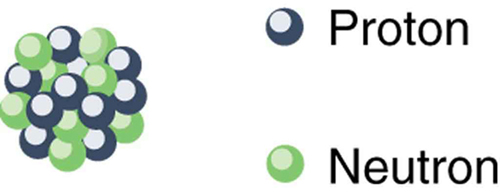

* Define and discuss the nucleus in an atom.
* Define atomic number.
* Define and discuss isotopes.
* Calculate the density of the nucleus.
* Explain nuclear force.

What is inside the nucleus? Why are some nuclei stable while others decay? (See [\[link\]](#import-auto-id1525377).) Why are there different types of decay (<math xmlns="http://www.w3.org/1998/Math/MathML"><semantics><mrow><mrow><mi>α</mi></mrow><mrow /></mrow><annotation encoding="StarMath 5.0"> size 12{α} {}</annotation></semantics></math>

, <math xmlns="http://www.w3.org/1998/Math/MathML"><semantics><mrow><mrow><mi>β</mi></mrow><mrow /></mrow><annotation encoding="StarMath 5.0"> size 12{β} {}</annotation></semantics></math>

 and <math xmlns="http://www.w3.org/1998/Math/MathML"><semantics><mrow><mrow><mi>γ</mi></mrow><mrow /></mrow><annotation encoding="StarMath 5.0"> size 12{γ} {}</annotation></semantics></math>

)? Why are nuclear decay energies so large? Pursuing natural questions like these has led to far more fundamental discoveries than you might imagine.

 , while the uranium in the disk (b) slowly decays over billions of years? Why is cesium in this ampule (c) even less stable than the uranium, decaying in far less than 1/1,000,000 the time? What is the reason uranium and cesium undergo different types of decay (&#x3B1; size 12{&#x3B1;} {} and &#x3B2; size 12{&#x3B2;} {}, respectively)? (credits: (a) Bresson Thomas, Wikimedia Commons; (b) U.S. Department of Energy; (c) Tomihahndorf, Wikimedia Commons)"){: #import-auto-id1525377}

We have already identified **protons**{: data-type="term" #import-auto-id2953779} as the particles that carry positive charge in the nuclei. However, there are actually *two* types of particles in the nuclei—the *proton* and the *neutron*, referred to collectively as **nucleons**{: data-type="term" #import-auto-id3161906}, the constituents of nuclei. As its name implies, the **neutron**{: data-type="term" #import-auto-id1177617} is a neutral particle (<math xmlns="http://www.w3.org/1998/Math/MathML"><semantics><mrow><mrow><mrow><mi>q</mi><mo stretchy="false">=</mo><mn>0</mn></mrow></mrow><mrow /></mrow><annotation encoding="StarMath 5.0"> size 12{q=0} {}</annotation></semantics></math>

) that has nearly the same mass and intrinsic spin as the proton. [\[link\]](#import-auto-id1575277) compares the masses of protons, neutrons, and electrons. Note how close the proton and neutron masses are, but the neutron is slightly more massive once you look past the third digit. Both nucleons are much more massive than an electron. In fact, <math xmlns="http://www.w3.org/1998/Math/MathML"><semantics><mrow><mrow><mrow><mrow><msub><mi>m</mi><mrow><mi>p</mi></mrow></msub><mo stretchy="false">=</mo><mtext>1836</mtext></mrow><msub><mi>m</mi><mrow><mi>e</mi></mrow></msub></mrow></mrow><mrow /></mrow><annotation encoding="StarMath 5.0"> size 12{m rSub { size 8{p} } ="1836" m rSub { size 8{e} } } {}</annotation></semantics></math>

 (as noted in [Medical Applications of Nuclear Physics](/m42646) and <math xmlns="http://www.w3.org/1998/Math/MathML"><semantics><mrow><mrow><mrow><mrow><msub><mi>m</mi><mrow><mi>n</mi></mrow></msub><mo stretchy="false">=</mo><mtext>1839</mtext></mrow><msub><mi>m</mi><mrow><mi>e</mi></mrow></msub></mrow></mrow><mrow /></mrow><annotation encoding="StarMath 5.0"> size 12{m rSub { size 8{n} } ="1839" m rSub { size 8{e} } } {}</annotation></semantics></math>

.

[\[link\]](#import-auto-id1575277) also gives masses in terms of mass units that are more convenient than kilograms on the atomic and nuclear scale. The first of these is the *unified **atomic mass**{: data-type="term"} unit* (u), defined as

<math xmlns="http://www.w3.org/1998/Math/MathML"><semantics><mrow><mrow><mrow><mrow><mtext>1 u</mtext><mo stretchy="false">=</mo><mn>1</mn></mrow><mtext>.</mtext><mtext>6605</mtext><mo>×</mo><msup><mtext>10</mtext><mrow><mrow><mo stretchy="false">−</mo><mtext>27</mtext></mrow></mrow></msup> <mspace width="0.25em" /><mtext>kg.</mtext></mrow></mrow><mrow /></mrow><annotation encoding="StarMath 5.0"> size 12{"1 u"=1 "." "6605"´"10" rSup { size 8{-"27"} } " kg"} {}</annotation></semantics></math>

This unit is defined so that a neutral carbon <math xmlns="http://www.w3.org/1998/Math/MathML"><semantics><mrow><mrow><mrow><msup><mrow /><mtext>12</mtext></msup><mtext>C</mtext></mrow></mrow><mrow /></mrow></semantics></math>

 atom has a mass of exactly 12 u. Masses are also expressed in units of <math xmlns="http://www.w3.org/1998/Math/MathML"><semantics><mrow><mrow><mrow><mtext>MeV/</mtext><msup><mi>c</mi><mrow><mn>2</mn></mrow></msup></mrow></mrow><mrow /></mrow></semantics></math>

. These units are very convenient when considering the conversion of mass into energy (and vice versa), as is so prominent in nuclear processes. Using <math xmlns="http://www.w3.org/1998/Math/MathML"><semantics><mrow><mrow><mrow><mi>E</mi><mo stretchy="false">=</mo><mrow><msup><mtext fontstyle="italic">mc</mtext><mrow><mn>2</mn></mrow></msup></mrow></mrow></mrow><mrow /></mrow><annotation encoding="StarMath 5.0"> size 12{E= ital "mc" rSup { size 8{2} } } {}</annotation></semantics></math>

 and units of <math xmlns="http://www.w3.org/1998/Math/MathML"><semantics><mrow><mrow><mi>m</mi></mrow><mrow /></mrow><annotation encoding="StarMath 5.0"> size 12{m} {}</annotation></semantics></math>

 in <math xmlns="http://www.w3.org/1998/Math/MathML"><semantics><mrow><mrow><mrow><mtext>MeV/</mtext><msup><mi>c</mi><mrow><mn>2</mn></mrow></msup></mrow></mrow><mrow /></mrow><annotation encoding="StarMath 5.0"> size 12{"MeV/"c rSup { size 8{2} } } {}</annotation></semantics></math>

, we find that <math xmlns="http://www.w3.org/1998/Math/MathML"><semantics><mrow><mrow><msup><mi>c</mi><mrow><mn>2</mn></mrow></msup></mrow><mrow /></mrow><annotation encoding="StarMath 5.0"> size 12{c rSup { size 8{2} } } {}</annotation></semantics></math>

 cancels and <math xmlns="http://www.w3.org/1998/Math/MathML"><semantics><mrow><mrow><mi>E</mi></mrow><mrow /></mrow><annotation encoding="StarMath 5.0"> size 12{E} {}</annotation></semantics></math>

 comes out conveniently in MeV. For example, if the rest mass of a proton is converted entirely into energy, then

<math xmlns="http://www.w3.org/1998/Math/MathML"><semantics><mrow><mrow><mrow><mrow><mrow><mi>E</mi><mo stretchy="false">=</mo><mrow><msup><mtext fontstyle="italic">mc</mtext><mrow><mn>2</mn></mrow></msup></mrow></mrow><mo stretchy="false">=</mo><mo stretchy="false">(</mo></mrow><mtext>938.27 MeV/</mtext><msup><mi>c</mi><mrow><mn>2</mn></mrow></msup><mo stretchy="false">)</mo><mrow><msup><mi>c</mi><mrow><mn>2</mn></mrow></msup><mo stretchy="false">=</mo><mtext>938.27 MeV.</mtext></mrow></mrow></mrow><mrow /></mrow><annotation encoding="StarMath 5.0"> size 12{E= ital "mc" rSup { size 8{2} } = \( "938" "." "27" "MeV/"c rSup { size 8{2} } \) c rSup { size 8{2} } ="938" "." "27"" MeV"} {}</annotation></semantics></math>

It is useful to note that 1 u of mass converted to energy produces 931.5 MeV, or

<math xmlns="http://www.w3.org/1998/Math/MathML"><semantics><mrow><mrow><mrow><mrow><mtext>1 u</mtext><mo stretchy="false">=</mo><mtext>931.5 MeV/</mtext></mrow><msup><mi>c</mi><mrow><mn>2</mn></mrow></msup></mrow></mrow><mo>.</mo><mrow /></mrow><annotation encoding="StarMath 5.0"> size 12{"1 u"="931" "." 5" MeV/"c rSup { size 8{2} } } {}</annotation></semantics></math>

All properties of a nucleus are determined by the number of protons and neutrons it has. A specific combination of protons and neutrons is called a **nuclide**{: data-type="term" #import-auto-id3162302} and is a unique nucleus. The following notation is used to represent a particular nuclide:

<math xmlns="http://www.w3.org/1998/Math/MathML"><semantics><mrow><mrow><mrow><msubsup><mrow /><mi>Z</mi><mi>A</mi></msubsup><msub><mtext>X</mtext><mrow><mi>N</mi></mrow></msub></mrow><mo>,</mo></mrow><mrow /></mrow><annotation encoding="StarMath 5.0"> size 12{"" lSub { size 8{Z} } lSup { size 8{A} } X rSub { size 8{N} } } {}</annotation></semantics></math>

where the symbols <math xmlns="http://www.w3.org/1998/Math/MathML"><semantics><mrow><mrow><mi>A</mi></mrow><mrow /></mrow><annotation encoding="StarMath 5.0"> size 12{A} {}</annotation></semantics></math>

, <math xmlns="http://www.w3.org/1998/Math/MathML"><semantics><mrow><mrow><mtext>X</mtext></mrow><mrow /></mrow><annotation encoding="StarMath 5.0"> size 12{X} {}</annotation></semantics></math>

, <math xmlns="http://www.w3.org/1998/Math/MathML"><semantics><mrow><mrow><mi>Z</mi></mrow><mrow /></mrow><annotation encoding="StarMath 5.0"> size 12{Z} {}</annotation></semantics></math>

 , and <math xmlns="http://www.w3.org/1998/Math/MathML"><semantics><mrow><mrow><mi>N</mi></mrow><mrow /></mrow><annotation encoding="StarMath 5.0"> size 12{N} {}</annotation></semantics></math>

 are defined as follows: The *number of protons in a nucleus* is the **atomic number**{: data-type="term" #import-auto-id1569357} <math xmlns="http://www.w3.org/1998/Math/MathML"><semantics><mrow><mrow><mi>Z</mi></mrow><mrow /></mrow><annotation encoding="StarMath 5.0"> size 12{Z} {}</annotation></semantics></math>

, as defined in [Medical Applications of Nuclear Physics](/m42646). X is the *symbol for the element*, such as Ca for calcium. However, once <math xmlns="http://www.w3.org/1998/Math/MathML"><semantics><mrow><mrow><mi>Z</mi></mrow><mrow /></mrow><annotation encoding="StarMath 5.0"> size 12{Z} {}</annotation></semantics></math>

 is known, the element is known; hence, <math xmlns="http://www.w3.org/1998/Math/MathML"><semantics><mrow><mrow><mi>Z</mi></mrow><mrow /></mrow><annotation encoding="StarMath 5.0"> size 12{Z} {}</annotation></semantics></math>

 and <math xmlns="http://www.w3.org/1998/Math/MathML"><semantics><mrow><mrow><mtext>X</mtext></mrow><mrow /></mrow></semantics></math>

 are redundant. For example, <math xmlns="http://www.w3.org/1998/Math/MathML"><semantics><mrow><mrow><mrow><mi>Z</mi><mo stretchy="false">=</mo><mtext>20</mtext></mrow></mrow><mrow /></mrow><annotation encoding="StarMath 5.0"> size 12{Z="20"} {}</annotation></semantics></math>

 is always calcium, and calcium always has <math xmlns="http://www.w3.org/1998/Math/MathML"><semantics><mrow><mrow><mrow><mi>Z</mi><mo stretchy="false">=</mo><mtext>20</mtext></mrow></mrow><mrow /></mrow><annotation encoding="StarMath 5.0"> size 12{Z="20"} {}</annotation></semantics></math>

. <math xmlns="http://www.w3.org/1998/Math/MathML"><semantics><mrow><mrow><mi>N</mi></mrow><mrow /></mrow><annotation encoding="StarMath 5.0"> size 12{N} {}</annotation></semantics></math>

 is the *number of neutrons* in a nucleus. In the notation for a nuclide, the subscript <math xmlns="http://www.w3.org/1998/Math/MathML"><semantics><mrow><mrow><mi>N</mi></mrow><mrow /></mrow><annotation encoding="StarMath 5.0"> size 12{N} {}</annotation></semantics></math>

 is usually omitted. The symbol <math xmlns="http://www.w3.org/1998/Math/MathML"><semantics><mrow><mrow><mi>A</mi></mrow><mrow /></mrow><annotation encoding="StarMath 5.0"> size 12{A} {}</annotation></semantics></math>

 is defined as the number of nucleons or the *total number of protons and neutrons*,

<math xmlns="http://www.w3.org/1998/Math/MathML"><semantics><mrow><mrow><mrow><mi>A</mi><mo stretchy="false">=</mo><mrow><mi>N</mi><mo stretchy="false">+</mo><mi>Z</mi></mrow></mrow><mo>,</mo></mrow><mrow /></mrow><annotation encoding="StarMath 5.0"> size 12{A=N+Z} {}</annotation></semantics></math>

where <math xmlns="http://www.w3.org/1998/Math/MathML"><semantics><mrow><mrow><mi>A</mi></mrow><mrow /></mrow><annotation encoding="StarMath 5.0"> size 12{A} {}</annotation></semantics></math>

 is also called the **mass number**{: data-type="term" #import-auto-id3180517}. This name for <math xmlns="http://www.w3.org/1998/Math/MathML"><semantics><mrow><mrow><mi>A</mi></mrow><mrow /></mrow><annotation encoding="StarMath 5.0"> size 12{A} {}</annotation></semantics></math>

 is logical; the mass of an atom is nearly equal to the mass of its nucleus, since electrons have so little mass. The mass of the nucleus turns out to be nearly equal to the sum of the masses of the protons and neutrons in it, which is proportional to <math xmlns="http://www.w3.org/1998/Math/MathML"><semantics><mrow><mrow><mi>A</mi></mrow><mrow /></mrow><annotation encoding="StarMath 5.0"> size 12{A} {}</annotation></semantics></math>

. In this context, it is particularly convenient to express masses in units of u. Both protons and neutrons have masses close to 1 u, and so the mass of an atom is close to <math xmlns="http://www.w3.org/1998/Math/MathML"><semantics><mrow><mrow><mi>A</mi></mrow><mrow /></mrow><annotation encoding="StarMath 5.0"> size 12{A} {}</annotation></semantics></math>

 u. For example, in an oxygen nucleus with eight protons and eight neutrons, <math xmlns="http://www.w3.org/1998/Math/MathML"><semantics><mrow><mrow><mrow><mi>A</mi><mo stretchy="false">=</mo><mtext>16</mtext></mrow></mrow><mrow /></mrow><annotation encoding="StarMath 5.0"> size 12{A="16"} {}</annotation></semantics></math>

, and its mass is 16 u. As noticed, the unified atomic mass unit is defined so that a neutral carbon atom (actually a <math xmlns="http://www.w3.org/1998/Math/MathML"><semantics><mrow><mrow><mrow><msup><mrow /><mtext>12</mtext></msup><mtext>C</mtext></mrow></mrow><mrow /></mrow><annotation encoding="StarMath 5.0"> size 12{"" lSup { size 8{"12"} } C} {}</annotation></semantics></math>

 atom) has a mass of *exactly* 12 <math xmlns="http://www.w3.org/1998/Math/MathML"><semantics><mrow><mrow><mtext>u</mtext></mrow><mrow /></mrow><annotation encoding="StarMath 5.0"> size 12{u} {}</annotation></semantics></math>

. Carbon was chosen as the standard, partly because of its importance in organic chemistry (see [Appendix A](/m42699)).

<table id="import-auto-id1575277" summary="The three particles proton, neutron, and electron, are listed in column 1 in that order. Columns from left to right contain the symbol for each particle, its mass in kilograms, its mass in unified atomic mass units (u), and its mass in M e V over c squared."><caption>Masses of the Proton, Neutron, and Electron</caption><thead>
         <tr>
            <th>Particle</th>
            <th>Symbol</th>
            <th>kg</th>
            <th>u</th>
            <th>MeV<em>c</em>2</th>
          </tr>
     </thead><tbody>
<tr>
            <td>Proton</td>
            <td><em>p</em></td>
            <td>
              <math xmlns="http://www.w3.org/1998/Math/MathML" display="block">
                <semantics>
                  <mrow>
                    
                      <mrow>
                        <mrow>
                          <mn>1</mn>
                          <mtext>.</mtext>
                          <mrow>
                            <mtext>67262</mtext>
                            <mo stretchy="false">×</mo>
                            <msup>
                              <mtext>10</mtext>
                              
                                <mrow>
                                  <mrow>
                                    <mo stretchy="false">−</mo>
                                    <mtext>27</mtext>
                                  </mrow>
                                </mrow>
                              
                            </msup>
                          </mrow>
                        </mrow>
                      </mrow>
                    
                    <mrow />
                  </mrow>
                  <annotation encoding="StarMath 5.0"> size 12{1 "." "67262" times "10" rSup { size 8{ - "27"} } } {}</annotation>
                </semantics>
              </math> 
            </td>
            <td>1.007276</td>
            <td>938.27</td>
          </tr><tr>
            <td>Neutron</td>
            <td><em>n</em></td>
            <td>
              <math xmlns="http://www.w3.org/1998/Math/MathML" display="block">
                <semantics>
                  <mrow>
                    
                      <mrow>
                        <mrow>
                          <mn>1</mn>
                          <mtext>.</mtext>
                          <mtext>67493</mtext>
                          <mi>×</mi>
                          <msup>
                            <mtext>10</mtext>
                            
                              <mrow>
                                <mrow>
                                  <mo stretchy="false">−</mo>
                                  <mtext>27</mtext>
                                </mrow>
                              </mrow>
                            
                          </msup>
                        </mrow>
                      </mrow>
                    
                    <mrow />
                  </mrow>
                  <annotation encoding="StarMath 5.0"> size 12{1 "." "67493"´"10" rSup { size 8{-"27"} } } {}</annotation>
                </semantics>
              </math> 
            </td>
            <td>1.008665</td>
            <td>939.57</td>
          </tr><tr>
            <td>Electron</td>
            <td><em>e</em></td>
            <td>
              <math xmlns="http://www.w3.org/1998/Math/MathML" display="block">
                <semantics>
                  <mrow>
                    
                      <mrow>
                        <mrow>
                          <mn>9</mn>
                          <mtext>.</mtext>
                          <mtext>1094</mtext>
                          <mi>×</mi>
                          <msup>
                            <mtext>10</mtext>
                            
                              <mrow>
                                <mrow>
                                  <mo stretchy="false">−</mo>
                                  <mtext>31</mtext>
                                </mrow>
                              </mrow>
                            
                          </msup>
                        </mrow>
                      </mrow>
                    
                    <mrow />
                  </mrow>
                  <annotation encoding="StarMath 5.0"> size 12{9 "." "1094"´"10" rSup { size 8{-"31"} } } {}</annotation>
                </semantics>
              </math> 
            </td>
            <td>0.00054858</td>
            <td>0.511</td>
          </tr></tbody></table>

Let us look at a few examples of nuclides expressed in the <math xmlns="http://www.w3.org/1998/Math/MathML"><semantics><mrow><mrow><mrow><msubsup><mrow /><mi>Z</mi><mi>A</mi></msubsup><msub><mtext>X</mtext><mrow><mi>N</mi></mrow></msub></mrow></mrow><mrow /></mrow></semantics></math>

 notation. The nucleus of the simplest atom, hydrogen, is a single proton, or <math xmlns="http://www.w3.org/1998/Math/MathML"><semantics><mrow><mrow><mrow><msubsup><mrow /><mn>1</mn><mn>1</mn></msubsup><mtext>H</mtext></mrow></mrow><mrow /></mrow></semantics></math>

 (the zero for no neutrons is often omitted). To check this symbol, refer to the periodic table—you see that the atomic number <math xmlns="http://www.w3.org/1998/Math/MathML"><semantics><mrow><mrow><mi>Z</mi></mrow><mrow /></mrow></semantics></math>

 of hydrogen is 1. Since you are given that there are no neutrons, the mass number <math xmlns="http://www.w3.org/1998/Math/MathML"><semantics><mrow><mrow><mi>A</mi></mrow><mrow /></mrow></semantics></math>

 is also 1. Suppose you are told that the helium nucleus or <math xmlns="http://www.w3.org/1998/Math/MathML"><semantics><mrow><mrow><mi>α</mi></mrow><mrow /></mrow></semantics></math>

 particle has two protons and two neutrons. You can then see that it is written <math xmlns="http://www.w3.org/1998/Math/MathML"><semantics><mrow><mrow><mrow><msubsup><mrow /><mn>2</mn><mn>4</mn></msubsup><msub><mtext>He</mtext><mrow><mn>2</mn></mrow></msub></mrow></mrow><mrow /></mrow></semantics></math>

. There is a scarce form of hydrogen found in nature called deuterium; its nucleus has one proton and one neutron and, hence, twice the mass of common hydrogen. The symbol for deuterium is, thus, <math xmlns="http://www.w3.org/1998/Math/MathML"><semantics><mrow><mrow><mrow><msubsup><mrow /><mn>1</mn><mn>2</mn></msubsup><msub><mtext>H</mtext><mrow><mn>1</mn></mrow></msub></mrow></mrow></mrow></semantics></math>

 (sometimes <math xmlns="http://www.w3.org/1998/Math/MathML"><semantics><mrow><mrow><mtext>D</mtext></mrow></mrow></semantics></math>

 is used, as for deuterated water <math xmlns="http://www.w3.org/1998/Math/MathML"><semantics><mrow><mrow><mrow><msub><mtext>D</mtext><mrow><mn>2</mn></mrow></msub> <mtext>O</mtext></mrow></mrow><mrow /></mrow></semantics></math>

). An even rarer—and radioactive—form of hydrogen is called tritium, since it has a single proton and two neutrons, and it is written <math xmlns="http://www.w3.org/1998/Math/MathML"><semantics><mrow><mrow><mrow><msubsup><mrow /><mn>1</mn><mn>3</mn></msubsup><msub><mtext>H</mtext><mrow><mn>2</mn></mrow></msub></mrow></mrow></mrow></semantics></math>

. These three varieties of hydrogen have nearly identical chemistries, but the nuclei differ greatly in mass, stability, and other characteristics. Nuclei (such as those of hydrogen) having the same <math xmlns="http://www.w3.org/1998/Math/MathML"><semantics><mrow><mrow><mi>Z</mi></mrow><mrow /></mrow><annotation encoding="StarMath 5.0"> size 12{Z} {}</annotation></semantics></math>

 and different <math xmlns="http://www.w3.org/1998/Math/MathML"><semantics><mrow><mrow><mi>N</mi></mrow><mrow /></mrow><annotation encoding="StarMath 5.0"> size 12{N} {}</annotation></semantics></math>

 s are defined to be **isotopes**{: data-type="term" #import-auto-id2601650} of the same element.

There is some redundancy in the symbols <math xmlns="http://www.w3.org/1998/Math/MathML"><semantics><mrow><mrow><mi>A</mi></mrow><mrow /></mrow><annotation encoding="StarMath 5.0"> size 12{A} {}</annotation></semantics></math>

, <math xmlns="http://www.w3.org/1998/Math/MathML"><semantics><mrow><mrow><mtext>X</mtext></mrow><mrow /></mrow><annotation encoding="StarMath 5.0"> size 12{X} {}</annotation></semantics></math>

, <math xmlns="http://www.w3.org/1998/Math/MathML"><semantics><mrow><mrow><mi>Z</mi></mrow><mrow /></mrow><annotation encoding="StarMath 5.0"> size 12{Z} {}</annotation></semantics></math>

, and <math xmlns="http://www.w3.org/1998/Math/MathML"><semantics><mrow><mrow><mi>N</mi></mrow><mrow /></mrow><annotation encoding="StarMath 5.0"> size 12{N} {}</annotation></semantics></math>

 . If the element <math xmlns="http://www.w3.org/1998/Math/MathML"><semantics><mrow><mrow><mtext>X</mtext></mrow><mrow /></mrow><annotation encoding="StarMath 5.0"> size 12{X} {}</annotation></semantics></math>

 is known, then <math xmlns="http://www.w3.org/1998/Math/MathML"><semantics><mrow><mrow><mi>Z</mi></mrow><mrow /></mrow><annotation encoding="StarMath 5.0"> size 12{Z} {}</annotation></semantics></math>

 can be found in a periodic table and is always the same for a given element. If both <math xmlns="http://www.w3.org/1998/Math/MathML"><semantics><mrow><mrow><mi>A</mi></mrow><mrow /></mrow><annotation encoding="StarMath 5.0"> size 12{A} {}</annotation></semantics></math>

 and <math xmlns="http://www.w3.org/1998/Math/MathML"><semantics><mrow><mrow><mtext>X</mtext></mrow><mrow /></mrow><annotation encoding="StarMath 5.0"> size 12{X} {}</annotation></semantics></math>

 are known, then <math xmlns="http://www.w3.org/1998/Math/MathML"><semantics><mrow><mrow><mi>N</mi></mrow><mrow /></mrow><annotation encoding="StarMath 5.0"> size 12{N} {}</annotation></semantics></math>

 can also be determined (first find <math xmlns="http://www.w3.org/1998/Math/MathML"><semantics><mrow><mrow><mi>Z</mi></mrow><mrow /></mrow><annotation encoding="StarMath 5.0"> size 12{Z} {}</annotation></semantics></math>

; then, <math xmlns="http://www.w3.org/1998/Math/MathML"><semantics><mrow><mrow><mrow><mi>N</mi><mo stretchy="false">=</mo><mrow><mi>A</mi><mo stretchy="false">−</mo><mi>Z</mi></mrow></mrow></mrow><mrow /></mrow><annotation encoding="StarMath 5.0"> size 12{N=A-Z} {}</annotation></semantics></math>

). Thus the simpler notation for nuclides is

<math xmlns="http://www.w3.org/1998/Math/MathML"><semantics><mrow><mrow><mrow><msup><mrow /><mi>A</mi></msup><mtext>X</mtext></mrow><mo>,</mo></mrow><mrow /></mrow><annotation encoding="StarMath 5.0"> size 12{"" lSup { size 8{A} } X} {}</annotation></semantics></math>

which is sufficient and is most commonly used. For example, in this simpler notation, the three isotopes of hydrogen are <math xmlns="http://www.w3.org/1998/Math/MathML"><semantics><mrow><mrow><mrow><msup><mrow /><mn>1</mn></msup><mtext>H, </mtext><mspace width="0.25em" /><msup><mrow /><mn>2</mn></msup><mtext>H,</mtext></mrow></mrow></mrow></semantics></math>

 and <math xmlns="http://www.w3.org/1998/Math/MathML"><semantics><mrow><mrow><mrow><msup><mrow /><mn>3</mn></msup><mtext>H,</mtext></mrow></mrow></mrow></semantics></math>

 while the <math xmlns="http://www.w3.org/1998/Math/MathML"><semantics><mrow><mrow><mi>α</mi></mrow><mrow /></mrow></semantics></math>

 particle is <math xmlns="http://www.w3.org/1998/Math/MathML"><semantics><mrow><mrow><mrow><msup><mrow /><mn>4</mn></msup><mtext>He</mtext></mrow></mrow></mrow></semantics></math>

. We read this backward, saying helium-4 for <math xmlns="http://www.w3.org/1998/Math/MathML"><semantics><mrow><mrow><mrow><msup><mrow /><mn>4</mn></msup><mtext>He</mtext></mrow></mrow></mrow></semantics></math>

, or uranium-238 for <math xmlns="http://www.w3.org/1998/Math/MathML"><semantics><mrow><mrow><mrow><msup><mrow /><mtext>238</mtext></msup><mtext>U</mtext></mrow></mrow></mrow></semantics></math>

. So for <math xmlns="http://www.w3.org/1998/Math/MathML"><semantics><mrow><mrow><mrow><msup><mrow /><mtext>238</mtext></msup><mtext>U</mtext></mrow></mrow><mrow /></mrow></semantics></math>

, should we need to know, we can determine that <math xmlns="http://www.w3.org/1998/Math/MathML"><semantics><mrow><mrow><mrow><mi>Z</mi><mo stretchy="false">=</mo><mtext>92</mtext></mrow></mrow></mrow></semantics></math>

 for uranium from the periodic table, and, thus, <math xmlns="http://www.w3.org/1998/Math/MathML"><semantics><mrow><mrow><mrow><mrow><mi>N</mi><mo stretchy="false">=</mo><mrow><mtext>238</mtext><mo stretchy="false">−</mo><mtext>92</mtext></mrow></mrow><mo stretchy="false">=</mo><mtext>146</mtext></mrow></mrow><mrow /></mrow><annotation encoding="StarMath 5.0"> size 12{N="238"-"92"="146"} {}</annotation></semantics></math>

.

A variety of experiments indicate that a nucleus behaves something like a tightly packed ball of nucleons, as illustrated in [\[link\]](#import-auto-id2588349). These nucleons have large kinetic energies and, thus, move rapidly in very close contact. Nucleons can be separated by a large force, such as in a collision with another nucleus, but resist strongly being pushed closer together. The most compelling evidence that nucleons are closely packed in a nucleus is that the **radius of a nucleus**{: data-type="term" #import-auto-id2597921}, <math xmlns="http://www.w3.org/1998/Math/MathML"><semantics><mrow><mrow><mi>r</mi></mrow><mrow /></mrow><annotation encoding="StarMath 5.0"> size 12{r} {}</annotation></semantics></math>

, is found to be given approximately by

<math xmlns="http://www.w3.org/1998/Math/MathML"><semantics><mrow><mrow><mrow><mrow><mi>r</mi><mo stretchy="false">=</mo><msub><mi>r</mi><mrow><mn>0</mn></mrow></msub></mrow><msup><mi>A</mi><mrow><mrow><mn>1</mn><mo stretchy="false">/</mo><mn>3</mn></mrow></mrow></msup></mrow><mo>,</mo></mrow><mrow /></mrow><annotation encoding="StarMath 5.0"> size 12{r=r rSub { size 8{0} } A rSup { size 8{1/3} } } {}</annotation></semantics></math>

where <math xmlns="http://www.w3.org/1998/Math/MathML"><semantics><mrow><mrow><mrow><mrow><msub><mi>r</mi><mrow><mn>0</mn></mrow></msub><mo stretchy="false">=</mo></mrow><mtext>1.2 fm</mtext></mrow></mrow><mrow /></mrow></semantics></math>

 and <math xmlns="http://www.w3.org/1998/Math/MathML"><semantics><mrow><mrow><mi>A</mi></mrow><mrow /></mrow></semantics></math>

 is the mass number of the nucleus. Note that <math xmlns="http://www.w3.org/1998/Math/MathML"><semantics><mrow><mrow><mrow><msup><mi>r</mi><mrow><mn>3</mn></mrow></msup><mo>∝</mo><mi fontstyle="italic">A</mi></mrow></mrow><mrow /></mrow><annotation encoding="StarMath 5.0"> size 12{r rSup { size 8{3} } µA} {}</annotation></semantics></math>

. Since many nuclei are spherical, and the volume of a sphere is <math xmlns="http://www.w3.org/1998/Math/MathML"><semantics><mrow><mrow><mrow><mrow><mi>V</mi><mo stretchy="false">=</mo><mo stretchy="false">(</mo></mrow><mrow><mn>4</mn><mo stretchy="false">/</mo><mn>3</mn></mrow><mo stretchy="false">)</mo><msup><mi fontstyle="italic">πr</mi><mrow><mn>3</mn></mrow></msup></mrow></mrow><mrow /></mrow><annotation encoding="StarMath 5.0"> size 12{V= \( 4/3 \) pr rSup { size 8{3} } } {}</annotation></semantics></math>

, we see that <math xmlns="http://www.w3.org/1998/Math/MathML"><semantics><mrow><mrow><mrow><mi>V</mi><mo stretchy="false">∝</mo><mi>A</mi></mrow></mrow><mrow /></mrow><annotation encoding="StarMath 5.0"> size 12{V prop A} {}</annotation></semantics></math>

 —that is, the volume of a nucleus is proportional to the number of nucleons in it. This is what would happen if you pack nucleons so closely that there is no empty space between them.

{: #import-auto-id2588349}

Nucleons are held together by nuclear forces and resist both being pulled apart and pushed inside one another. The volume of the nucleus is the sum of the volumes of the nucleons in it, here shown in different colors to represent protons and neutrons.

How Small and Dense Is a Nucleus?

(a) Find the radius of an iron-56 nucleus. (b) Find its approximate density in <math xmlns="http://www.w3.org/1998/Math/MathML"><semantics><mrow><mn>kg</mn><mo>/</mo><msup><mn>m</mn><mn>3</mn></msup></mrow></semantics></math>

, approximating the mass of <math xmlns="http://www.w3.org/1998/Math/MathML"><semantics><mrow><msup><mrow /><mn>56</mn></msup><mtext>Fe</mtext></mrow></semantics></math>

 to be 56 u.

**Strategy and Concept**

(a) Finding the radius of <math xmlns="http://www.w3.org/1998/Math/MathML"><semantics><mrow><msup><mrow /><mn>56</mn></msup><mtext>Fe</mtext></mrow></semantics></math>

 is a straightforward application of <math xmlns="http://www.w3.org/1998/Math/MathML"><semantics><mrow><mrow><mrow><mrow><mi>r</mi><mo stretchy="false">=</mo><msub><mi>r</mi><mrow><mn>0</mn></mrow></msub></mrow><msup><mi>A</mi><mrow><mrow><mn>1</mn><mo stretchy="false">/</mo><mn>3</mn></mrow></mrow></msup></mrow><mo>,</mo></mrow><mrow /></mrow></semantics></math>

 given <math xmlns="http://www.w3.org/1998/Math/MathML"><semantics><mrow><mi>A</mi><mo>=</mo><mn>56</mn></mrow></semantics></math>

. (b) To find the approximate density, we assume the nucleus is spherical (this one actually is), calculate its volume using the radius found in part (a), and then find its density from <math xmlns="http://www.w3.org/1998/Math/MathML"><semantics><mrow><mi>ρ</mi><mo>=</mo><mi fontstyle="italic">m/V</mi></mrow></semantics></math>

. Finally, we will need to convert density from units of <math xmlns="http://www.w3.org/1998/Math/MathML"><semantics><mrow><mn>u</mn><mo>/</mo><msup><mn>fm</mn><mn>3</mn></msup></mrow></semantics></math>

 to <math xmlns="http://www.w3.org/1998/Math/MathML"><semantics><mrow><mn>kg</mn><mo>/</mo><msup><mn>m</mn><mn>3</mn></msup></mrow></semantics></math>

.

**Solution**

(a) The radius of a nucleus is given by

<math xmlns="http://www.w3.org/1998/Math/MathML"><semantics><mrow><mrow><mrow><mrow><mi>r</mi><mo stretchy="false">=</mo><msub><mi>r</mi><mrow><mn>0</mn></mrow></msub></mrow><msup><mi>A</mi><mrow><mrow><mn>1</mn><mo stretchy="false">/</mo><mn>3</mn></mrow></mrow></msup></mrow><mo>.</mo></mrow><mrow /></mrow></semantics></math>

Substituting the values for <math xmlns="http://www.w3.org/1998/Math/MathML"><semantics><mrow><msub><mi>r</mi><mn>0</mn></msub></mrow></semantics></math>

 and <math xmlns="http://www.w3.org/1998/Math/MathML"><semantics><mrow><mi>A</mi></mrow></semantics></math>

 yields

<math xmlns="http://www.w3.org/1998/Math/MathML"><semantics><mrow> <mtable columnalign="left"> <mtr><mtd> <mi>r</mi></mtd> <mtd><mo stretchy="false">=</mo></mtd> <mtd> <msup><mn>(1.2 fm)(56)</mn><mn>1/3</mn></msup><mo>=</mo><mn>(1.2 fm)(3.83)</mn> </mtd></mtr> <mtr><mtd /> <mtd><mo stretchy="false">=</mo></mtd> <mtd><mn>4.6 fm</mn><mo>.</mo></mtd></mtr></mtable> </mrow></semantics></math>

(b) Density is defined to be <math xmlns="http://www.w3.org/1998/Math/MathML"><semantics><mrow><mi>ρ</mi><mo>=</mo><mi fontstyle="italic">m/V</mi></mrow></semantics></math>

, which for a sphere of radius <math xmlns="http://www.w3.org/1998/Math/MathML"><semantics><mrow><mi>r</mi></mrow></semantics></math>

 is

<math xmlns="http://www.w3.org/1998/Math/MathML"><semantics><mrow><mi>ρ</mi><mo>=</mo><mfrac><mi fontstyle="italic">m</mi><mi>V</mi></mfrac><mo>=</mo><mfrac><mi>m</mi><mrow><mn>(4/3)</mn><msup><mi fontstyle="italic">πr</mi><mn>3</mn></msup></mrow></mfrac><mo>.</mo></mrow></semantics></math>

Substituting known values gives

<math xmlns="http://www.w3.org/1998/Math/MathML"><semantics><mrow> <mtable columnalign="left"> <mtr><mtd> <mi>ρ</mi></mtd> <mtd><mo stretchy="false">=</mo></mtd> <mtd> <mfrac> <mn>56 u</mn> <mrow><mn>(1.33)(3.14)</mn> <msup><mn>(4.6 fm)</mn><mn>3</mn></msup> </mrow> </mfrac> </mtd></mtr> <mtr><mtd /> <mtd><mo stretchy="false">=</mo></mtd> <mtd><mn>0.138 u/</mn><msup><mn>fm</mn><mn>3</mn></msup><mo>.</mo></mtd></mtr></mtable> </mrow></semantics></math>

Converting to units of <math xmlns="http://www.w3.org/1998/Math/MathML"><semantics><mrow><mn>kg</mn><mo>/</mo><msup><mn>m</mn><mn>3</mn></msup></mrow></semantics></math>

, we find

<math xmlns="http://www.w3.org/1998/Math/MathML"><semantics><mrow> <mtable columnalign="left"> <mtr><mtd> <mi>ρ</mi></mtd> <mtd><mo stretchy="false">=</mo></mtd> <mtd> <mn>(0.138 u/</mn><msup><mn>fm</mn><mn>3</mn></msup><mo stretchy="false">)</mo> <mo stretchy="false">(</mo> <mn>1.66</mn><mo>×</mo><msup><mn>10</mn><mn>–27</mn></msup><mspace width="0.25em" /><mtext>kg/u</mtext> <mo stretchy="false">)</mo> <mo>(</mo> <mfrac> <mn>1 fm</mn> <mrow> <msup><mn>10</mn><mn>–15</mn></msup><mspace width="0.25em" /><mtext>m</mtext> </mrow> </mfrac> <mo>)</mo> </mtd></mtr> <mtr><mtd /> <mtd><mo stretchy="false">=</mo></mtd> <mtd> <mn>2.3</mn><mo>×</mo><msup><mn>10</mn><mn>17</mn></msup><mspace width="0.25em" /><msup><mtext>kg/m</mtext><mn>3</mn></msup><mo>.</mo> </mtd></mtr></mtable> </mrow></semantics></math>

**Discussion**

(a) The radius of this medium-sized nucleus is found to be approximately 4.6 fm, and so its diameter is about 10 fm, or <math xmlns="http://www.w3.org/1998/Math/MathML"><semantics><mrow><msup><mn>10</mn><mn>–14</mn></msup><mspace width="0.25em" /><mtext>m</mtext></mrow></semantics></math>

. In our discussion of Rutherford’s discovery of the nucleus, we noticed that it is about <math xmlns="http://www.w3.org/1998/Math/MathML"><semantics><mrow><msup><mn>10</mn><mn>–15</mn></msup><mspace width="0.25em" /><mtext>m</mtext></mrow></semantics></math>

 in diameter (which is for lighter nuclei), consistent with this result to an order of magnitude. The nucleus is much smaller in diameter than the typical atom, which has a diameter of the order of <math xmlns="http://www.w3.org/1998/Math/MathML"><semantics><mrow><msup><mn>10</mn><mn>–10</mn></msup><mspace width="0.25em" /><mtext>m</mtext></mrow></semantics></math>

.

(b) The density found here is so large as to cause disbelief. It is consistent with earlier discussions we have had about the nucleus being very small and containing nearly all of the mass of the atom. Nuclear densities, such as found here, are about <math xmlns="http://www.w3.org/1998/Math/MathML"><semantics><mrow><mn>2</mn><mo>×</mo><msup><mn>10</mn><mn>14</mn></msup></mrow></semantics></math>

 times greater than that of water, which has a density of “only” <math xmlns="http://www.w3.org/1998/Math/MathML"><semantics><mrow><msup><mn>10</mn><mn>3</mn></msup><mspace width="0.25em" /><msup><mtext>kg/m</mtext><mn>3</mn></msup></mrow></semantics></math>

. One cubic meter of nuclear matter, such as found in a neutron star, has the same mass as a cube of water 61 km on a side.

# Nuclear Forces and Stability

What forces hold a nucleus together? The nucleus is very small and its protons, being positive, exert tremendous repulsive forces on one another. (The Coulomb force increases as charges get closer, since it is proportional to <math xmlns="http://www.w3.org/1998/Math/MathML"><semantics><mrow><mrow><mrow><mn>1</mn><mo stretchy="false">/</mo><msup><mi>r</mi><mrow><mn>2</mn></mrow></msup></mrow></mrow><mrow /></mrow><annotation encoding="StarMath 5.0"> size 12{1/r rSup { size 8{2} } } {}</annotation></semantics></math>

, even at the tiny distances found in nuclei.) The answer is that two previously unknown forces hold the nucleus together and make it into a tightly packed ball of nucleons. These forces are called the *weak and strong nuclear forces*. Nuclear forces are so short ranged that they fall to zero strength when nucleons are separated by only a few fm. However, like glue, they are strongly attracted when the nucleons get close to one another. The strong nuclear force is about 100 times more attractive than the repulsive EM force, easily holding the nucleons together. Nuclear forces become extremely repulsive if the nucleons get too close, making nucleons strongly resist being pushed inside one another, something like ball bearings.

The fact that nuclear forces are very strong is responsible for the very large energies emitted in nuclear decay. During decay, the forces do work, and since work is force times the distance (<math xmlns="http://www.w3.org/1998/Math/MathML"><semantics><mrow><mrow><mrow><mrow><mi>W</mi><mo stretchy="false">=</mo><mstyle><mrow><mtext fontstyle="italic">Fd</mtext></mrow></mstyle></mrow><mspace width="0.25em" /><mtext>cos</mtext><mspace width="0.25em" /><mi>θ</mi></mrow></mrow><mrow /></mrow><annotation encoding="StarMath 5.0"> size 12{W= ital "Fd""cos"θ} {}</annotation></semantics></math>

), a large force can result in a large emitted energy. In fact, we know that there are *two* distinct nuclear forces because of the different types of nuclear decay—the strong nuclear force is responsible for <math xmlns="http://www.w3.org/1998/Math/MathML"><semantics><mrow><mrow><mi>α</mi></mrow><mrow /></mrow><annotation encoding="StarMath 5.0"> size 12{α} {}</annotation></semantics></math>

 decay, while the weak nuclear force is responsible for <math xmlns="http://www.w3.org/1998/Math/MathML"><semantics><mrow><mrow><mi>β</mi></mrow><mrow /></mrow><annotation encoding="StarMath 5.0"> size 12{β} {}</annotation></semantics></math>

 decay.

The many stable and unstable nuclei we have explored, and the hundreds we have not discussed, can be arranged in a table called the **chart of the nuclides**{: data-type="term" #import-auto-id3139281}, a simplified version of which is shown in [\[link\]](#import-auto-id1599401). Nuclides are located on a plot of <math xmlns="http://www.w3.org/1998/Math/MathML"><semantics><mrow><mrow><mi>N</mi></mrow><mrow /></mrow><annotation encoding="StarMath 5.0"> size 12{N} {}</annotation></semantics></math>

 versus <math xmlns="http://www.w3.org/1998/Math/MathML"><semantics><mrow><mrow><mi>Z</mi></mrow><mrow /></mrow><annotation encoding="StarMath 5.0"> size 12{Z} {}</annotation></semantics></math>

. Examination of a detailed chart of the nuclides reveals patterns in the characteristics of nuclei, such as stability, abundance, and types of decay, analogous to but more complex than the systematics in the periodic table of the elements.

 {: #import-auto-id1599401}

In principle, a nucleus can have any combination of protons and neutrons, but [\[link\]](#import-auto-id1599401) shows a definite pattern for those that are stable. For low-mass nuclei, there is a strong tendency for <math xmlns="http://www.w3.org/1998/Math/MathML"><semantics><mrow><mrow><mi>N</mi></mrow><mrow /></mrow><annotation encoding="StarMath 5.0"> size 12{N} {}</annotation></semantics></math>

 and <math xmlns="http://www.w3.org/1998/Math/MathML"><semantics><mrow><mrow><mi>Z</mi></mrow><mrow /></mrow><annotation encoding="StarMath 5.0"> size 12{Z} {}</annotation></semantics></math>

 to be nearly equal. This means that the nuclear force is more attractive when <math xmlns="http://www.w3.org/1998/Math/MathML"><semantics><mrow><mrow><mrow><mi>N</mi><mo stretchy="false">=</mo><mi>Z</mi></mrow></mrow><mrow /></mrow><annotation encoding="StarMath 5.0"> size 12{N=Z} {}</annotation></semantics></math>

. More detailed examination reveals greater stability when <math xmlns="http://www.w3.org/1998/Math/MathML"><semantics><mrow><mrow><mi>N</mi></mrow><mrow /></mrow><annotation encoding="StarMath 5.0"> size 12{N} {}</annotation></semantics></math>

 and <math xmlns="http://www.w3.org/1998/Math/MathML"><semantics><mrow><mrow><mi>Z</mi></mrow><mrow /></mrow><annotation encoding="StarMath 5.0"> size 12{Z} {}</annotation></semantics></math>

 are even numbers—nuclear forces are more attractive when neutrons and protons are in pairs. For increasingly higher masses, there are progressively more neutrons than protons in stable nuclei. This is due to the ever-growing repulsion between protons. Since nuclear forces are short ranged, and the Coulomb force is long ranged, an excess of neutrons keeps the protons a little farther apart, reducing Coulomb repulsion. Decay modes of nuclides out of the region of stability consistently produce nuclides closer to the region of stability. There are more stable nuclei having certain numbers of protons and neutrons, called **magic numbers**{: data-type="term" #import-auto-id3091653}. Magic numbers indicate a shell structure for the nucleus in which closed shells are more stable. Nuclear shell theory has been very successful in explaining nuclear energy levels, nuclear decay, and the greater stability of nuclei with closed shells. We have been producing ever-heavier transuranic elements since the early 1940s, and we have now produced the element with <math xmlns="http://www.w3.org/1998/Math/MathML"><semantics><mrow><mrow><mrow><mi>Z</mi><mo stretchy="false">=</mo><mtext>118</mtext></mrow></mrow><mrow /></mrow><annotation encoding="StarMath 5.0"> size 12{Z="118"} {}</annotation></semantics></math>

. There are theoretical predictions of an island of relative stability for nuclei with such high <math xmlns="http://www.w3.org/1998/Math/MathML"><semantics><mrow><mrow><mi>Z</mi></mrow><mrow /></mrow><annotation encoding="StarMath 5.0"> size 12{Z} {}</annotation></semantics></math>

 s.

  shared the 1963 Nobel Prize in physics with J. Jensen for the creation of the nuclear shell model. This successful nuclear model has nucleons filling shells analogous to electron shells in atoms. It was inspired by patterns observed in nuclear properties. (credit: Nobel Foundation via Wikimedia Commons)"){: #import-auto-id2055795}

# Section Summary

* Two particles, both called nucleons, are found inside nuclei. The two types of nucleons are protons and neutrons; they are very similar, except that the proton is positively charged while the neutron is neutral. Some of their characteristics are given in [\[link\]](#import-auto-id1575277) and compared with those of the electron. A mass unit convenient to atomic and nuclear processes is the unified atomic mass unit (u), defined to be
  

  <math xmlns="http://www.w3.org/1998/Math/MathML"> <semantics> <mrow> <mrow> <mrow> <mn>1 u</mn> <mrow> <mo stretchy="false">=</mo> <mtext>1.6605</mtext> <mo stretchy="false">×</mo> <msup> <mtext>10</mtext> <mrow> <mrow> <mo stretchy="false">−</mo> <mtext>27</mtext> </mrow> </mrow> </msup><mspace width="0.25em" /> <mtext> kg</mtext> <mo stretchy="false">=</mo> <mtext>931.46 MeV</mtext> <mo stretchy="false">/</mo> <msup> <mi>c</mi> <mrow> <mn>2</mn> </mrow> </msup> </mrow> <mo>.</mo> </mrow> </mrow> </mrow> </semantics> </math>
  

* A nuclide is a specific combination of protons and neutrons, denoted by
  

  <math xmlns="http://www.w3.org/1998/Math/MathML"><semantics><mrow><mrow><mrow><msubsup><mrow /><mi>Z</mi><mi>A</mi></msubsup><msub><mtext>X</mtext><mrow><mi>N</mi></mrow></msub></mrow></mrow><mrow /> <mspace width="0.25em" /><mrow><mtext>or simply</mtext></mrow><mrow><mrow><mrow><msup><mrow /><mi>A</mi></msup><mtext>X,</mtext></mrow></mrow><mrow /></mrow></mrow><annotation encoding="StarMath 5.0"> size 12{"" lSup { size 8{A} } X} {}</annotation></semantics></math>
  

  
  <math xmlns="http://www.w3.org/1998/Math/MathML"><semantics><mrow><mrow><mi>Z</mi></mrow><mrow /></mrow><annotation encoding="StarMath 5.0"> size 12{Z} {}</annotation></semantics></math>
  
  is the number of protons or atomic number, X is the symbol for the element,
  <math xmlns="http://www.w3.org/1998/Math/MathML"><semantics><mrow><mrow><mi>N</mi></mrow><mrow /></mrow><annotation encoding="StarMath 5.0"> size 12{N} {}</annotation></semantics></math>
  
  is the number of neutrons, and
  <math xmlns="http://www.w3.org/1998/Math/MathML"><semantics><mrow><mrow><mi>A</mi></mrow><mrow /></mrow><annotation encoding="StarMath 5.0"> size 12{A} {}</annotation></semantics></math>
  
  is the mass number or the total number of protons and neutrons,
  

  <math xmlns="http://www.w3.org/1998/Math/MathML"><semantics><mrow><mrow><mrow><mi>A</mi><mo stretchy="false">=</mo><mrow><mi>N</mi><mo stretchy="false">+</mo><mi>Z</mi></mrow><mo>.</mo></mrow></mrow><mrow /></mrow><annotation encoding="StarMath 5.0"> size 12{A=N+Z} {}</annotation></semantics></math>
  

* {: #import-auto-id3082029} Nuclides having the same
  <math xmlns="http://www.w3.org/1998/Math/MathML"><semantics><mrow><mrow><mi>Z</mi></mrow><mrow /></mrow><annotation encoding="StarMath 5.0"> size 12{Z} {}</annotation></semantics></math>
  
  but different
  <math xmlns="http://www.w3.org/1998/Math/MathML"><semantics><mrow><mrow><mi>N</mi></mrow><mrow /></mrow><annotation encoding="StarMath 5.0"> size 12{N} {}</annotation></semantics></math>
  
  are isotopes of the same element.
* {: #import-auto-id2673990} The radius of a nucleus,
  <math xmlns="http://www.w3.org/1998/Math/MathML"><semantics><mrow><mrow><mi>r</mi></mrow><mrow /></mrow><annotation encoding="StarMath 5.0"> size 12{r} {}</annotation></semantics></math>
  
  , is approximately
  

  <math xmlns="http://www.w3.org/1998/Math/MathML"><semantics><mrow><mrow><mrow><mrow><mi>r</mi><mo stretchy="false">=</mo><msub><mi>r</mi><mrow><mn>0</mn></mrow></msub></mrow><msup><mi>A</mi><mrow><mrow><mn>1</mn><mo stretchy="false">/</mo><mn>3</mn></mrow></mrow></msup></mrow><mo>,</mo></mrow><mrow /></mrow></semantics></math>
  

  
  where
  <math xmlns="http://www.w3.org/1998/Math/MathML"><semantics><mrow><mrow><mrow><mrow><msub><mi>r</mi><mrow><mn>0</mn></mrow></msub><mo stretchy="false">=</mo><mn>1.2 fm</mn></mrow></mrow></mrow><mrow /></mrow></semantics></math>
  
  . Nuclear volumes are proportional to
  <math xmlns="http://www.w3.org/1998/Math/MathML"><semantics><mrow><mrow><mi>A</mi></mrow><mrow /></mrow><annotation encoding="StarMath 5.0"> size 12{A} {}</annotation></semantics></math>
  
  . There are two nuclear forces, the weak and the strong. Systematics in nuclear stability seen on the chart of the nuclides indicate that there are shell closures in nuclei for values of
  <math xmlns="http://www.w3.org/1998/Math/MathML"><semantics><mrow><mrow><mi>Z</mi></mrow><mrow /></mrow><annotation encoding="StarMath 5.0"> size 12{Z} {}</annotation></semantics></math>
  
  and
  <math xmlns="http://www.w3.org/1998/Math/MathML"><semantics><mrow><mrow><mi>N</mi></mrow><mrow /></mrow><annotation encoding="StarMath 5.0"> size 12{N} {}</annotation></semantics></math>
  
  equal to the magic numbers, which correspond to highly stable nuclei.

# Conceptual Questions

The weak and strong nuclear forces are basic to the structure of matter. Why we do not experience them directly?

Define and make clear distinctions between the terms neutron, nucleon, nucleus, nuclide, and neutrino.

What are isotopes? Why do different isotopes of the same element have similar chemistries?

# Problems &amp; Exercises

Verify that a <math xmlns="http://www.w3.org/1998/Math/MathML"><semantics><mrow><mrow><mrow><mn>2</mn><mtext>.</mtext><mrow><mn>3</mn><mo stretchy="false">×</mo><msup><mtext>10</mtext><mrow><mtext>17</mtext></mrow></msup></mrow><mspace width="0.25em" /><mtext>kg</mtext></mrow></mrow><mrow /></mrow><annotation encoding="StarMath 5.0"> size 12{2 "." 3 times "10" rSup { size 8{"17"} } "kg"} {}</annotation></semantics></math>

 mass of water at normal density would make a cube 60 km on a side, as claimed in [[link]](#eip-193). (This mass at nuclear density would make a cube 1.0 m on a side.)

<math xmlns="http://www.w3.org/1998/Math/MathML"> <semantics> <mrow> <mrow> <mtable columnalign="left"> <mtr> <mtd> <mrow> <mrow> <mi>m</mi> <mo stretchy="false">=</mo> <mi fontstyle="italic">ρV</mi> </mrow> <mo stretchy="false">=</mo> <msup> <mi fontstyle="italic">ρd</mi> <mrow> <mn>3</mn> </mrow> </msup> </mrow> </mtd> <mtd> <mo stretchy="false">⇒</mo> </mtd> <mtd> <mrow> <mrow> <mrow> <mi>a</mi> <mo stretchy="false">=</mo> <msup> <mfenced open="(" close=")"> <mfrac> <mi>m</mi> <mi>ρ</mi> </mfrac> </mfenced> <mrow> <mn>1/3</mn> </mrow> </msup> </mrow> <mo stretchy="false">=</mo> <msup> <mfenced open="(" close=")"> <mfrac> <mrow> <mn>2.3</mn> <mrow> <mo stretchy="false">×</mo> <msup> <mtext>10</mtext> <mtext>17</mtext> </msup> <mspace width="0.25em" /><mtext>kg</mtext> </mrow> </mrow> <mrow> <mtext>1000</mtext><mspace width="0.25em" /> <msup> <mtext> kg/m</mtext> <mrow> <mn>3</mn> </mrow> </msup> </mrow> </mfrac> </mfenced> <mrow> <mrow /> <mfrac> <mn>1</mn> <mn>3</mn> </mfrac> </mrow> </msup> </mrow> </mrow> </mtd> </mtr> <mtr> <mtd /> <mtd><mo stretchy="false">=</mo></mtd> <mtd> <mrow> <mrow> <mtext>61</mtext> <mo stretchy="false">×</mo> <msup> <mtext>10</mtext> <mrow> <mn>3</mn> </mrow> </msup> </mrow> <mrow><mspace width="0.25em" /> <mtext> m</mtext> <mo stretchy="false">=</mo> <mtext>61 km</mtext> </mrow> </mrow> </mtd> </mtr> </mtable> </mrow> </mrow> </semantics> </math>

Find the length of a side of a cube having a mass of 1.0 kg and the density of nuclear matter, taking this to be <math xmlns="http://www.w3.org/1998/Math/MathML"><semantics><mrow><mrow><mrow><mn>2</mn><mtext>.</mtext><mn>3</mn><mi>×</mi><msup><mtext>10</mtext><mrow><mtext>17</mtext></mrow></msup><mspace width="0.25em" /><msup><mtext> kg/m</mtext><mrow><mn>3</mn></mrow></msup></mrow></mrow><mrow /></mrow><annotation encoding="StarMath 5.0"> size 12{2 "." 3´"10" rSup { size 8{"17"} } " kg/m" rSup { size 8{3} } } {}</annotation></semantics></math>

.

What is the radius of an <math xmlns="http://www.w3.org/1998/Math/MathML"><semantics><mrow><mrow><mi>α</mi></mrow><mrow /></mrow><annotation encoding="StarMath 5.0"> size 12{α} {}</annotation></semantics></math>

 particle?

<math xmlns="http://www.w3.org/1998/Math/MathML"> <semantics> <mrow> <mrow> <mrow> <mn>1.9 fm</mn> </mrow> </mrow> <mrow /> </mrow> <annotation encoding="StarMath 5.0"> size 12{1 "." 9" fm"} {}</annotation> </semantics> </math>

Find the radius of a <math xmlns="http://www.w3.org/1998/Math/MathML"><semantics><mrow><mrow><mrow><msup><mrow /><mtext>238</mtext></msup><mtext>Pu</mtext></mrow></mrow><mrow /></mrow><annotation encoding="StarMath 5.0"> size 12{"" lSup { size 8{"238"} } "Pu"} {}</annotation></semantics></math>

 nucleus. <math xmlns="http://www.w3.org/1998/Math/MathML"><semantics><mrow><mrow><mrow><msup><mrow /><mtext>238</mtext></msup><mtext>Pu</mtext></mrow></mrow><mrow /></mrow><annotation encoding="StarMath 5.0"> size 12{"" lSup { size 8{"238"} } "Pu"} {}</annotation></semantics></math>

 is a manufactured nuclide that is used as a power source on some space probes.

(a) Calculate the radius of <math xmlns="http://www.w3.org/1998/Math/MathML"><semantics><mrow><mrow><mrow><msup><mrow /><mtext>58</mtext></msup><mtext>Ni</mtext></mrow></mrow><mrow /></mrow><annotation encoding="StarMath 5.0"> size 12{"" lSup { size 8{"58"} } "Ni"} {}</annotation></semantics></math>

, one of the most tightly bound stable nuclei.

(b) What is the ratio of the radius of <math xmlns="http://www.w3.org/1998/Math/MathML"><semantics><mrow><mrow><mrow><msup><mrow /><mtext>58</mtext></msup><mtext>Ni</mtext></mrow></mrow><mrow /></mrow><annotation encoding="StarMath 5.0"> size 12{"" lSup { size 8{"58"} } "Ni"} {}</annotation></semantics></math>

 to that of <math xmlns="http://www.w3.org/1998/Math/MathML"><semantics><mrow><mrow><mrow><msup><mrow /><mtext>258</mtext></msup><mtext>Ha</mtext></mrow></mrow><mrow /></mrow><annotation encoding="StarMath 5.0"> size 12{"" lSup { size 8{"258"} } "Ha"} {}</annotation></semantics></math>

, one of the largest nuclei ever made? Note that the radius of the largest nucleus is still much smaller than the size of an atom.

(a) <math xmlns="http://www.w3.org/1998/Math/MathML"><semantics><mrow><mrow><mrow><mn>4.6 fm</mn></mrow></mrow><mrow /></mrow><annotation encoding="StarMath 5.0"> size 12{4 "." "6 fm"} {}</annotation></semantics></math>

(b) <math xmlns="http://www.w3.org/1998/Math/MathML"><semantics><mrow><mrow><mrow><mn>0</mn><mtext>.</mtext><mtext>61 to 1</mtext></mrow></mrow><mrow /></mrow><annotation encoding="StarMath 5.0"> size 12{0 "." "61 to 1"} {}</annotation></semantics></math>

The unified atomic mass unit is defined to be <math xmlns="http://www.w3.org/1998/Math/MathML"><semantics><mrow><mrow><mrow><mn>1</mn><mspace width="0.25em" /><mrow><mtext> u</mtext><mo stretchy="false">=</mo><mn>1</mn></mrow><mtext>.</mtext><mtext>6605</mtext><mi>×</mi><msup><mtext>10</mtext><mrow><mrow><mn>−27</mn></mrow></mrow></msup><mspace width="0.25em" /><mtext>kg</mtext></mrow></mrow><mrow /></mrow><annotation encoding="StarMath 5.0"> size 12{1" u"=1 "." "6605"×"10" rSup { size 8{-"27"} } "kg"} {}</annotation></semantics></math>

. Verify that this amount of mass converted to energy yields 931.5 MeV. Note that you must use four-digit or better values for <math xmlns="http://www.w3.org/1998/Math/MathML"><semantics><mrow><mrow><mi>c</mi></mrow><mrow /></mrow><annotation encoding="StarMath 5.0"> size 12{c} {}</annotation></semantics></math>

 and <math xmlns="http://www.w3.org/1998/Math/MathML"><semantics><mrow><mrow><mrow><mo stretchy="false">∣</mo><msub><mi>q</mi><mrow><mi>e</mi></mrow></msub><mo stretchy="false">∣</mo></mrow></mrow><mrow /></mrow><annotation encoding="StarMath 5.0"> size 12{ lline q rSub { size 8{e} } rline } {}</annotation></semantics></math>

.

What is the ratio of the velocity of a <math xmlns="http://www.w3.org/1998/Math/MathML"><semantics><mrow><mrow><mi>β</mi></mrow><mrow /></mrow><annotation encoding="StarMath 5.0"> size 12{β} {}</annotation></semantics></math>

 particle to that of an <math xmlns="http://www.w3.org/1998/Math/MathML"><semantics><mrow><mrow><mi>α</mi></mrow><mrow /></mrow><annotation encoding="StarMath 5.0"> size 12{α} {}</annotation></semantics></math>

 particle, if they have the same nonrelativistic kinetic energy?

<math xmlns="http://www.w3.org/1998/Math/MathML"> <semantics> <mrow> <mrow> <mrow> <mtext>85</mtext> <mtext>.</mtext> <mtext>4 to 1</mtext> </mrow> </mrow> <mrow /> </mrow> <annotation encoding="StarMath 5.0"> size 12{"85" "." "4 to 1"} {}</annotation> </semantics> </math>

If a 1.50-cm-thick piece of lead can absorb 90.0% of the <math xmlns="http://www.w3.org/1998/Math/MathML"><semantics><mrow><mrow><mi>γ</mi></mrow><mrow /></mrow><annotation encoding="StarMath 5.0"> size 12{γ} {}</annotation></semantics></math>

 rays from a radioactive source, how many centimeters of lead are needed to absorb all but 0.100% of the <math xmlns="http://www.w3.org/1998/Math/MathML"><semantics><mrow><mrow><mi>γ</mi></mrow><mrow /></mrow><annotation encoding="StarMath 5.0"> size 12{γ} {}</annotation></semantics></math>

 rays?

The detail observable using a probe is limited by its wavelength. Calculate the energy of a <math xmlns="http://www.w3.org/1998/Math/MathML"><semantics><mrow><mrow><mi>γ</mi></mrow><mrow /></mrow><annotation encoding="StarMath 5.0"> size 12{γ} {}</annotation></semantics></math>

-ray photon that has a wavelength of <math xmlns="http://www.w3.org/1998/Math/MathML"><semantics><mrow><mrow><mrow><mrow><mn>1</mn><mo stretchy="false">×</mo><msup><mtext>10</mtext><mrow><mrow><mo stretchy="false">−</mo><mtext>16</mtext></mrow></mrow></msup></mrow><mspace width="0.25em" /><mtext>m</mtext></mrow></mrow><mrow /></mrow><annotation encoding="StarMath 5.0"> size 12{1 times "10" rSup { size 8{ - "16"} } m} {}</annotation></semantics></math>

, small enough to detect details about one-tenth the size of a nucleon. Note that a photon having this energy is difficult to produce and interacts poorly with the nucleus, limiting the practicability of this probe.

<math xmlns="http://www.w3.org/1998/Math/MathML"> <semantics> <mrow> <mrow> <mrow> <mtext>12.4 GeV</mtext> </mrow> </mrow> <mrow /> </mrow> <annotation encoding="StarMath 5.0"> size 12{"12" "." "4 GeV"} {}</annotation> </semantics> </math>

(a) Show that if you assume the average nucleus is spherical with a radius <math xmlns="http://www.w3.org/1998/Math/MathML"><semantics><mrow><mrow><mrow><mrow><mi>r</mi><mo stretchy="false">=</mo><msub><mi>r</mi><mrow><mn>0</mn></mrow></msub></mrow><msup><mi>A</mi><mrow><mrow><mn>1</mn><mo stretchy="false">/</mo><mn>3</mn></mrow></mrow></msup></mrow></mrow><mrow /></mrow><annotation encoding="StarMath 5.0"> size 12{r=r rSub { size 8{0} } A rSup { size 8{1/3} } } {}</annotation></semantics></math>

, and with a mass of <math xmlns="http://www.w3.org/1998/Math/MathML"><semantics><mrow><mrow><mi>A</mi></mrow><mrow /></mrow><annotation encoding="StarMath 5.0"> size 12{A} {}</annotation></semantics></math>

 u, then its density is independent of <math xmlns="http://www.w3.org/1998/Math/MathML"><semantics><mrow><mrow><mi>A</mi></mrow><mrow /></mrow><annotation encoding="StarMath 5.0"> size 12{A} {}</annotation></semantics></math>

.

(b) Calculate that density in <math xmlns="http://www.w3.org/1998/Math/MathML"><semantics><mrow><mrow><msup><mtext>u/fm</mtext><mrow><mn>3</mn></mrow></msup></mrow><mrow /></mrow><annotation encoding="StarMath 5.0"> size 12{"u/fm" rSup { size 8{3} } } {}</annotation></semantics></math>

 and <math xmlns="http://www.w3.org/1998/Math/MathML"><semantics><mrow><mrow><msup><mtext>kg/m</mtext><mrow><mn>3</mn></mrow></msup></mrow><mrow /></mrow><annotation encoding="StarMath 5.0"> size 12{"kg/m" rSup { size 8{3} } } {}</annotation></semantics></math>

, and compare your results with those found in [[link]](#eip-193) for <math xmlns="http://www.w3.org/1998/Math/MathML"><semantics><mrow><mrow><mrow><msup><mrow /><mtext>56</mtext></msup><mtext>Fe</mtext></mrow></mrow><mrow /></mrow><annotation encoding="StarMath 5.0"> size 12{"" lSup { size 8{"56"} } "Fe"} {}</annotation></semantics></math>

.

What is the ratio of the velocity of a 5.00-MeV <math xmlns="http://www.w3.org/1998/Math/MathML"><semantics><mrow><mrow><mi>β</mi></mrow><mrow /></mrow><annotation encoding="StarMath 5.0"> size 12{β} {}</annotation></semantics></math>

 ray to that of an <math xmlns="http://www.w3.org/1998/Math/MathML"><semantics><mrow><mrow><mi>α</mi></mrow><mrow /></mrow><annotation encoding="StarMath 5.0"> size 12{β} {}</annotation></semantics></math>

 particle with the same kinetic energy? This should confirm that <math xmlns="http://www.w3.org/1998/Math/MathML"><semantics><mrow><mrow><mi>β</mi></mrow><mrow /></mrow><annotation encoding="StarMath 5.0"> size 12{β} {}</annotation></semantics></math>

s travel much faster than <math xmlns="http://www.w3.org/1998/Math/MathML"><semantics><mrow><mrow><mi>α</mi></mrow><mrow /></mrow><annotation encoding="StarMath 5.0"> size 12{β} {}</annotation></semantics></math>

s even when relativity is taken into consideration. (See also [[link]](#fs-id3046141).)

19\.3 to 1

(a) What is the kinetic energy in MeV of a <math xmlns="http://www.w3.org/1998/Math/MathML"><semantics><mrow><mrow><mi>β</mi></mrow><mrow /></mrow><annotation encoding="StarMath 5.0"> size 12{β} {}</annotation></semantics></math>

 ray that is traveling at <math xmlns="http://www.w3.org/1998/Math/MathML"><semantics><mrow><mrow><mn>0.998</mn><mi>c</mi></mrow><mrow /></mrow></semantics></math>

? This gives some idea of how energetic a <math xmlns="http://www.w3.org/1998/Math/MathML"><semantics><mrow><mrow><mi>β</mi></mrow><mrow /></mrow><annotation encoding="StarMath 5.0"> size 12{β} {}</annotation></semantics></math>

 ray must be to travel at nearly the same speed as a <math xmlns="http://www.w3.org/1998/Math/MathML"><semantics><mrow><mrow><mi>γ</mi></mrow><mrow /></mrow></semantics></math>

 ray. (b) What is the velocity of the <math xmlns="http://www.w3.org/1998/Math/MathML"><semantics><mrow><mrow><mi>γ</mi></mrow><mrow /></mrow></semantics></math>

 ray relative to the <math xmlns="http://www.w3.org/1998/Math/MathML"><semantics><mrow><mrow><mi>β</mi></mrow><mrow /></mrow><annotation encoding="StarMath 5.0"> size 12{β} {}</annotation></semantics></math>

 ray?

## Glossary
{: data-type="glossary-title"}

atomic mass
: the total mass of the protons, neutrons, and electrons in a single atom
{: .definition #import-auto-id2396696}

atomic number
: number of protons in a nucleus
{: .definition #import-auto-id2660270}

chart of the nuclides
: a table comprising stable and unstable nuclei
{: .definition #import-auto-id2989962}

isotopes
: nuclei having the same
  <math xmlns="http://www.w3.org/1998/Math/MathML"><semantics><mrow><mrow><mi>Z</mi></mrow><mrow /></mrow><annotation encoding="StarMath 5.0"> size 12{Z} {}</annotation></semantics></math>
  
  and different
  <math xmlns="http://www.w3.org/1998/Math/MathML"><semantics><mrow><mrow><mi fontstyle="italic">N</mi></mrow><mrow /></mrow><annotation encoding="StarMath 5.0"> size 12{Ns} {}</annotation></semantics></math>
  
  s
{: .definition #import-auto-id1870066}

magic numbers
: a number that indicates a shell structure for the nucleus in which closed shells are more stable
{: .definition #import-auto-id3401047}

mass number
: number of nucleons in a nucleus
{: .definition}

neutron
: a neutral particle that is found in a nucleus
{: .definition #import-auto-id2666444}

nucleons
: the particles found inside nuclei
{: .definition #import-auto-id3158754}

nucleus
: a region consisting of protons and neutrons at the center of an atom
{: .definition #import-auto-id1024373}

nuclide
: a type of atom whose nucleus has specific numbers of protons and neutrons
{: .definition #import-auto-id3018335}

protons
: the positively charged nucleons found in a nucleus
{: .definition #import-auto-id2658200}

radius of a nucleus
: the radius of a nucleus is
  <math xmlns="http://www.w3.org/1998/Math/MathML"><semantics><mrow><mrow><mrow><mrow><mi>r</mi><mo stretchy="false">=</mo><msub><mi>r</mi><mrow><mn>0</mn></mrow></msub></mrow><msup><mi>A</mi><mrow><mrow><mn>1</mn><mo stretchy="false">/</mo><mn>3</mn></mrow></mrow></msup></mrow></mrow><mrow /></mrow><annotation encoding="StarMath 5.0"> size 12{r=r rSub { size 8{0} } A rSup { size 8{1/3} } } {}</annotation></semantics></math>
{: .definition #import-auto-id2459265}

