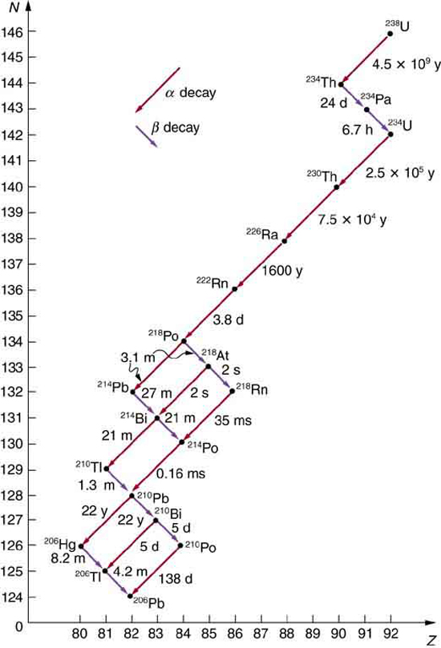
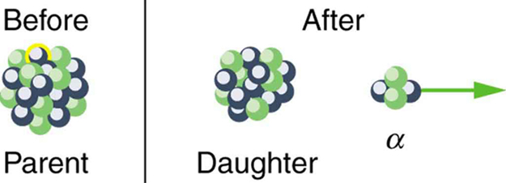
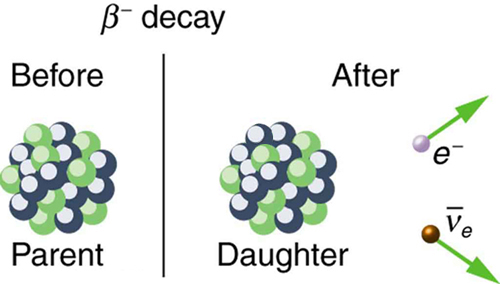
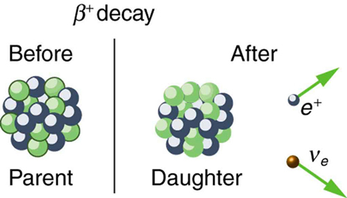

<div data-type="abstract" markdown="1">
* Define and discuss nuclear decay.
* State the conservation laws.
* Explain parent and daughter nucleus.
* Calculate the energy emitted during nuclear decay.

</div>

Nuclear **decay**{: data-type="term"} has provided an amazing window into the realm of the very small. Nuclear decay gave the first indication of the connection between mass and energy, and it revealed the existence of two of the four basic forces in nature. In this section, we explore the major modes of nuclear decay; and, like those who first explored them, we will discover evidence of previously unknown particles and conservation laws.

Some nuclides are stable, apparently living forever. Unstable nuclides decay (that is, they are radioactive), eventually producing a stable nuclide after many decays. We call the original nuclide the **parent**{: data-type="term" #import-auto-id1986389} and its decay products the **daughters**{: data-type="term" #import-auto-id2429491}. Some radioactive nuclides decay in a single step to a stable nucleus. For example, <math xmlns="http://www.w3.org/1998/Math/MathML"><semantics><mrow><mrow><mrow><msup><mrow /><mtext>60</mtext></msup><mtext>Co</mtext></mrow></mrow><mrow /></mrow><annotation encoding="StarMath 5.0"> size 12{"" lSup { size 8{"60"} } "Co"} {}</annotation></semantics></math>

 is unstable and decays directly to <math xmlns="http://www.w3.org/1998/Math/MathML"><semantics><mrow><mrow><mrow><msup><mrow /><mtext>60</mtext></msup><mtext>Ni</mtext></mrow></mrow><mrow /></mrow><annotation encoding="StarMath 5.0"> size 12{"" lSup { size 8{"60"} } "Ni"} {}</annotation></semantics></math>

, which is stable. Others, such as <math xmlns="http://www.w3.org/1998/Math/MathML"><semantics><mrow><mrow><mrow><msup><mrow /><mtext>238</mtext></msup><mtext>U</mtext></mrow></mrow><mrow /></mrow><annotation encoding="StarMath 5.0"> size 12{"" lSup { size 8{"238"} } U} {}</annotation></semantics></math>

, decay to another unstable nuclide, resulting in a **decay series**{: data-type="term" #import-auto-id1518523} in which each subsequent nuclide decays until a stable nuclide is finally produced. The decay series that starts from <math xmlns="http://www.w3.org/1998/Math/MathML"><semantics><mrow><mrow><mrow><msup><mrow /><mtext>238</mtext></msup><mtext>U</mtext></mrow></mrow><mrow /></mrow><annotation encoding="StarMath 5.0"> size 12{"" lSup { size 8{"238"} } U} {}</annotation></semantics></math>

 is of particular interest, since it produces the radioactive isotopes <math xmlns="http://www.w3.org/1998/Math/MathML"><semantics><mrow><mrow><mrow><msup><mrow /><mtext>226</mtext></msup><mtext>Ra</mtext></mrow></mrow><mrow /></mrow><annotation encoding="StarMath 5.0"> size 12{"" lSup { size 8{"226"} } "Ra"} {}</annotation></semantics></math>

 and <math xmlns="http://www.w3.org/1998/Math/MathML"><semantics><mrow><mrow><mrow><msup><mrow /><mtext>210</mtext></msup><mtext>Po</mtext></mrow></mrow><mrow /></mrow><annotation encoding="StarMath 5.0"> size 12{"" lSup { size 8{"210"} } "Po"} {}</annotation></semantics></math>

, which the Curies first discovered (see [\[link\]](#import-auto-id1930472)). Radon gas is also produced (<math xmlns="http://www.w3.org/1998/Math/MathML"><semantics><mrow><mrow><mrow><msup><mrow /><mtext>222</mtext></msup><mtext>Rn</mtext></mrow></mrow><mrow /></mrow><annotation encoding="StarMath 5.0"> size 12{"" lSup { size 8{"222"} } "Rn"} {}</annotation></semantics></math>

 in the series), an increasingly recognized naturally occurring hazard. Since radon is a noble gas, it emanates from materials, such as soil, containing even trace amounts of <math xmlns="http://www.w3.org/1998/Math/MathML"><semantics><mrow><mrow><mrow><msup><mrow /><mtext>238</mtext></msup><mtext>U</mtext></mrow></mrow><mrow /></mrow><annotation encoding="StarMath 5.0"> size 12{"" lSup { size 8{"238"} } U} {}</annotation></semantics></math>

 and can be inhaled. The decay of radon and its daughters produces internal damage. The <math xmlns="http://www.w3.org/1998/Math/MathML"><semantics><mrow><mrow><mrow><msup><mrow /><mtext>238</mtext></msup><mtext>U</mtext></mrow></mrow><mrow /></mrow><annotation encoding="StarMath 5.0"> size 12{"" lSup { size 8{"238"} } U} {}</annotation></semantics></math>

 decay series ends with <math xmlns="http://www.w3.org/1998/Math/MathML"><semantics><mrow><mrow><mrow><msup><mrow /><mtext>206</mtext></msup><mtext>Pb</mtext></mrow></mrow><mrow /></mrow><annotation encoding="StarMath 5.0"> size 12{"" lSup { size 8{"206"} } "Pb"} {}</annotation></semantics></math>

, a stable isotope of lead.

{: #import-auto-id1930472}

Note that the daughters of <math xmlns="http://www.w3.org/1998/Math/MathML"><semantics><mrow><mrow><mi>α</mi></mrow><mrow /></mrow><annotation encoding="StarMath 5.0"> size 12{α} {}</annotation></semantics></math>

 decay shown in [\[link\]](#import-auto-id1930472) always have two fewer protons and two fewer neutrons than the parent. This seems reasonable, since we know that <math xmlns="http://www.w3.org/1998/Math/MathML"><semantics><mrow><mrow><mi>α</mi></mrow><mrow /></mrow><annotation encoding="StarMath 5.0"> size 12{α} {}</annotation></semantics></math>

 decay is the emission of a <math xmlns="http://www.w3.org/1998/Math/MathML"><semantics><mrow><mrow><mrow><msup><mrow /><mn>4</mn></msup><mtext>He</mtext></mrow></mrow><mrow /></mrow><annotation encoding="StarMath 5.0"> size 12{"" lSup { size 8{4} } "He"} {}</annotation></semantics></math>

 nucleus, which has two protons and two neutrons. The daughters of <math xmlns="http://www.w3.org/1998/Math/MathML"><semantics><mrow><mrow><mi>β</mi></mrow><mrow /></mrow><annotation encoding="StarMath 5.0"> size 12{β} {}</annotation></semantics></math>

 decay have one less neutron and one more proton than their parent. Beta decay is a little more subtle, as we shall see. No <math xmlns="http://www.w3.org/1998/Math/MathML"><semantics><mrow><mrow><mi>γ</mi></mrow><mrow /></mrow><annotation encoding="StarMath 5.0"> size 12{γ} {}</annotation></semantics></math>

 decays are shown in the figure, because they do not produce a daughter that differs from the parent.

# Alpha Decay

In **alpha decay**{: data-type="term"}, a <math xmlns="http://www.w3.org/1998/Math/MathML"><semantics><mrow><mrow><mrow><msup><mrow /><mn>4</mn></msup><mtext>He</mtext></mrow></mrow><mrow /></mrow><annotation encoding="StarMath 5.0"> size 12{"" lSup { size 8{4} } "He"} {}</annotation></semantics></math>

 nucleus simply breaks away from the parent nucleus, leaving a daughter with two fewer protons and two fewer neutrons than the parent (see [\[link\]](#import-auto-id3078027)). One example of <math xmlns="http://www.w3.org/1998/Math/MathML"><semantics><mrow><mrow><mi>α</mi></mrow><mrow /></mrow><annotation encoding="StarMath 5.0"> size 12{α} {}</annotation></semantics></math>

 decay is shown in [\[link\]](#import-auto-id1930472) for <math xmlns="http://www.w3.org/1998/Math/MathML"><semantics><mrow><mrow><mrow><msup><mrow /><mtext>238</mtext></msup><mtext>U</mtext></mrow></mrow><mrow /></mrow><annotation encoding="StarMath 5.0"> size 12{"" lSup { size 8{"238"} } U} {}</annotation></semantics></math>

. Another nuclide that undergoes <math xmlns="http://www.w3.org/1998/Math/MathML"><semantics><mrow><mrow><mi>α</mi></mrow><mrow /></mrow><annotation encoding="StarMath 5.0"> size 12{α} {}</annotation></semantics></math>

 decay is <span><math xmlns="http://www.w3.org/1998/Math/MathML"><semantics><mrow><mrow><mrow><msup><mrow /><mtext>239</mtext></msup><mtext>Pu</mtext></mrow></mrow><mrow /></mrow><annotation encoding="StarMath 5.0"> size 12{"" lSup { size 8{"239"} } "Pu"} {}</annotation></semantics></math>
.</span> The decay equations for these two nuclides are

<div data-type="equation" id="eip-653">
<math xmlns="http://www.w3.org/1998/Math/MathML"> <semantics> <mrow> <mrow> <mrow> <msup> <mrow /> <mtext>238</mtext> </msup> <mtext>U</mtext> <mo stretchy="false">→</mo> <msup> <mrow /> <mtext>234</mtext> </msup> <msubsup> <mtext>Th</mtext> <mtext>92</mtext> <mtext>234</mtext> </msubsup> <mo stretchy="false">+</mo> <msup> <mrow /> <mn>4</mn> </msup> </mrow> <mtext>He</mtext> </mrow> </mrow> </semantics> </math>
</div>

and

<div data-type="equation" id="eip-697">
<math xmlns="http://www.w3.org/1998/Math/MathML"><semantics><mrow><mrow><mrow><msup><mrow /><mtext>239</mtext></msup><mtext>Pu</mtext><mo stretchy="false">→</mo><msup><mrow /><mtext>235</mtext></msup><mrow><mtext>U</mtext><mo stretchy="false">+</mo><msup><mrow /><mn>4</mn></msup></mrow><mtext>He</mtext></mrow><mo>.</mo></mrow><mrow /></mrow><annotation encoding="StarMath 5.0"> size 12{"" lSup { size 8{"239"} } "Pu" rightarrow "" lSup { size 8{"235"} } U+"" lSup { size 8{4} } "He"} {}</annotation></semantics></math>
</div>

{: #import-auto-id3078027}

If you examine the periodic table of the elements, you will find that Th has <math xmlns="http://www.w3.org/1998/Math/MathML"><semantics><mrow><mrow><mrow><mi>Z</mi><mo stretchy="false">=</mo><mtext>90</mtext></mrow></mrow><mrow /></mrow><annotation encoding="StarMath 5.0"> size 12{Z="90"} {}</annotation></semantics></math>

, two fewer than U, which has <math xmlns="http://www.w3.org/1998/Math/MathML"><semantics><mrow><mrow><mrow><mi>Z</mi><mo stretchy="false">=</mo><mtext>92</mtext></mrow></mrow><mrow /></mrow><annotation encoding="StarMath 5.0"> size 12{Z="92"} {}</annotation></semantics></math>

. Similarly, in the second **decay equation**{: data-type="term"}, we see that U has two fewer protons than Pu, which has <math xmlns="http://www.w3.org/1998/Math/MathML"><semantics><mrow><mrow><mrow><mi>Z</mi><mo stretchy="false">=</mo><mtext>94</mtext></mrow></mrow><mrow /></mrow><annotation encoding="StarMath 5.0"> size 12{Z="94"} {}</annotation></semantics></math>

. The general rule for <math xmlns="http://www.w3.org/1998/Math/MathML"><semantics><mrow><mrow><mi>α</mi></mrow><mrow /></mrow><annotation encoding="StarMath 5.0"> size 12{α} {}</annotation></semantics></math>

 decay is best written in the format <math xmlns="http://www.w3.org/1998/Math/MathML"><semantics><mrow><mrow><mrow><msubsup><mrow /><mi>Z</mi><mi>A</mi></msubsup><msub><mtext>X</mtext><mrow><mi>N</mi></mrow></msub></mrow></mrow><mrow /></mrow></semantics></math>

. If a certain nuclide is known to <math xmlns="http://www.w3.org/1998/Math/MathML"><semantics><mrow><mrow><mi>α</mi></mrow><mrow /></mrow><annotation encoding="StarMath 5.0"> size 12{α} {}</annotation></semantics></math>

 decay (generally this information must be looked up in a table of isotopes, such as in [Appendix B](/m42702)), its <math xmlns="http://www.w3.org/1998/Math/MathML"><semantics><mrow><mrow><mi>α</mi></mrow><mrow /></mrow><annotation encoding="StarMath 5.0"> size 12{α} {}</annotation></semantics></math>

<strong data-type="term" id="import-auto-id2930041"> decay equation</strong> is

<div data-type="equation" id="eip-692">
<math xmlns="http://www.w3.org/1998/Math/MathML"><semantics><mrow><mrow><mrow> <msubsup><mrow /><mi>Z</mi><mi>A</mi></msubsup> <msub><mtext>X</mtext><mrow><mi>N</mi></mrow></msub> <mo stretchy="false">→</mo> <msubsup><mrow /><mrow><mi>Z</mi><mo stretchy="false">−</mo><mn>2</mn></mrow><mrow><mi>A</mi><mo stretchy="false">−</mo><mn>4</mn></mrow></msubsup> <mrow> <msub><mtext>Y</mtext><mrow><mi>N</mi><mo stretchy="false">−</mo><mn>2</mn></mrow> </msub> <mo stretchy="false">+</mo> <msubsup><mrow /><mn>2</mn><mn>4</mn></msubsup> </mrow><msub><mtext>He</mtext><mn>2</mn></msub> </mrow></mrow><mrow><mspace width="0.25em" /><mspace width="0.25em" /><mspace width="0.25em" /><mo>(</mo><mi>α</mi><mspace width="0.25em" /><mtext>decay</mtext><mo>)</mo></mrow></mrow><annotation encoding="StarMath 5.0"> size 12{α} {}</annotation></semantics></math>
</div>

where Y is the nuclide that has two fewer protons than X, such as Th having two fewer than U. So if you were told that <math xmlns="http://www.w3.org/1998/Math/MathML"><semantics><mrow><mrow><mrow><msup><mrow /><mtext>239</mtext></msup><mtext>Pu</mtext></mrow></mrow><mrow /></mrow></semantics></math>

 <math xmlns="http://www.w3.org/1998/Math/MathML"><semantics><mrow><mrow><mi>α</mi></mrow><mrow /></mrow></semantics></math>

 decays and were asked to write the complete decay equation, you would first look up which element has two fewer protons (an atomic number two lower) and find that this is uranium. Then since four nucleons have broken away from the original 239, its atomic mass would be 235.

It is instructive to examine conservation laws related to <math xmlns="http://www.w3.org/1998/Math/MathML"><semantics><mrow><mrow><mi>α</mi></mrow><mrow /></mrow><annotation encoding="StarMath 5.0"> size 12{α} {}</annotation></semantics></math>

 decay. You can see from the equation <math xmlns="http://www.w3.org/1998/Math/MathML"><semantics><mrow><mrow><mrow> <msubsup><mrow /><mi>Z</mi><mi>A</mi></msubsup> <msub><mtext>X</mtext><mrow><mi>N</mi></mrow></msub> <mo stretchy="false">→</mo> <msubsup><mrow /><mrow><mi>Z</mi><mo stretchy="false">−</mo><mn>2</mn></mrow><mrow><mi>A</mi><mo stretchy="false">−</mo><mn>4</mn></mrow></msubsup> <mrow> <msub><mtext>Y</mtext><mrow><mi>N</mi><mo stretchy="false">−</mo><mn>2</mn></mrow> </msub> <mo stretchy="false">+</mo> <msubsup><mrow /><mn>2</mn><mn>4</mn></msubsup> </mrow><msub><mtext>He</mtext><mn>2</mn></msub> </mrow></mrow></mrow></semantics></math>

 that total charge is conserved. Linear and angular momentum are conserved, too. Although conserved angular momentum is not of great consequence in this type of decay, conservation of linear momentum has interesting consequences. If the nucleus is at rest when it decays, its momentum is zero. In that case, the fragments must fly in opposite directions with equal-magnitude momenta so that total momentum remains zero. This results in the <math xmlns="http://www.w3.org/1998/Math/MathML"><semantics><mrow><mrow><mi>α</mi></mrow><mrow /></mrow><annotation encoding="StarMath 5.0"> size 12{α} {}</annotation></semantics></math>

** particle carrying away most of the energy, as a bullet from a heavy rifle carries away most of the energy of the powder burned to shoot it. Total mass–energy is also conserved: the energy produced in the decay comes from conversion of a fraction of the original mass. As discussed in [Atomic Physics](/m42585), the general relationship is

<div data-type="equation" id="eip-241">
<math xmlns="http://www.w3.org/1998/Math/MathML"> <semantics> <mrow> <mrow> <mrow> <mrow> <mi>E</mi><mspace width="0.15em" /> <mo stretchy="false">=</mo> <mo stretchy="false">(</mo> <mo>Δ</mo><mi>m</mi> <mo stretchy="false">)</mo> </mrow> <msup> <mi>c</mi> <mn>2</mn> </msup> </mrow> <mo>.</mo> </mrow> <mrow /> </mrow> </semantics> </math>
</div>

Here, <math xmlns="http://www.w3.org/1998/Math/MathML"><semantics><mrow><mrow><mi>E</mi></mrow><mrow /></mrow><annotation encoding="StarMath 5.0"> size 12{E} {}</annotation></semantics></math>

 is the **nuclear reaction energy**{: data-type="term" #import-auto-id3403043} (the reaction can be nuclear decay or any other reaction), and <math xmlns="http://www.w3.org/1998/Math/MathML"><semantics><mrow><mrow><mn>Δ</mn><mi fontstyle="italic">m</mi></mrow><mrow /></mrow><annotation encoding="StarMath 5.0"> size 12{Δm} {}</annotation></semantics></math>

 is the difference in mass between initial and final products. When the final products have less total mass, <math xmlns="http://www.w3.org/1998/Math/MathML"><semantics><mrow><mrow><mn>Δ</mn><mi fontstyle="italic">m</mi></mrow><mrow /></mrow><annotation encoding="StarMath 5.0"> size 12{Δm} {}</annotation></semantics></math>

 is positive, and the reaction releases energy (is exothermic). When the products have greater total mass, the reaction is endothermic (<math xmlns="http://www.w3.org/1998/Math/MathML"><semantics><mrow><mrow><mn>Δ</mn><mi fontstyle="italic">m</mi></mrow><mrow /></mrow><annotation encoding="StarMath 5.0"> size 12{Δm} {}</annotation></semantics></math>

 is negative) and must be induced with an energy input. For <math xmlns="http://www.w3.org/1998/Math/MathML"><semantics><mrow><mrow><mi>α</mi></mrow></mrow><annotation encoding="StarMath 5.0"> size 12{α} {}</annotation></semantics></math>

 decay to be spontaneous, the decay products must have smaller mass than the parent.

<div data-type="example" markdown="1">
<div data-type="title">
Alpha Decay Energy Found from Nuclear Masses
</div>
Find the energy emitted in the <math xmlns="http://www.w3.org/1998/Math/MathML"><semantics><mrow><mrow><mi>α</mi></mrow><mrow /></mrow><annotation encoding="StarMath 5.0"> size 12{α} {}</annotation></semantics></math>

 decay of <math xmlns="http://www.w3.org/1998/Math/MathML"><semantics><mrow><mrow><mrow><msup><mrow /><mtext>239</mtext></msup><mtext>Pu</mtext></mrow></mrow><mrow /></mrow><annotation encoding="StarMath 5.0"> size 12{"" lSup { size 8{"239"} } "Pu"} {}</annotation></semantics></math>

.

**Strategy**

Nuclear reaction energy, such as released in *α* decay, can be found using the equation <math xmlns="http://www.w3.org/1998/Math/MathML"><semantics><mrow><mrow><mrow><mrow><mi>E</mi><mo stretchy="false">=</mo><mo stretchy="false">(</mo></mrow><mn>Δ</mn><mi fontstyle="italic">m</mi><mo stretchy="false">)</mo><msup><mi>c</mi><mrow><mn>2</mn></mrow></msup></mrow></mrow><mrow /></mrow><annotation encoding="StarMath 5.0"> size 12{E= \( Δm \) c"" lSup { size 8{2} } } {}</annotation></semantics></math>

. We must first find <math xmlns="http://www.w3.org/1998/Math/MathML"><semantics><mrow><mrow><mn>Δ</mn><mi fontstyle="italic">m</mi></mrow><mrow /></mrow><annotation encoding="StarMath 5.0"> size 12{Δm} {}</annotation></semantics></math>

, the difference in mass between the parent nucleus and the products of the decay. This is easily done using masses given in [Appendix A](/m42699).

**Solution**

The decay equation was given earlier for <math xmlns="http://www.w3.org/1998/Math/MathML"><semantics><mrow><mrow><mrow><msup><mrow /><mtext>239</mtext></msup><mtext>Pu</mtext></mrow></mrow><mrow /></mrow><annotation encoding="StarMath 5.0"> size 12{"" lSup { size 8{"239"} } "Pu"} {}</annotation></semantics></math>

 ; it is

<div data-type="equation" id="eip-774">
<math xmlns="http://www.w3.org/1998/Math/MathML"><semantics><mrow><mrow><mrow><msup><mrow /><mtext>239</mtext></msup><mtext>Pu</mtext><mo stretchy="false">→</mo><msup><mrow /><mtext>235</mtext></msup><mrow><mtext>U</mtext><mo stretchy="false">+</mo><msup><mrow /><mn>4</mn></msup></mrow><mtext>He</mtext></mrow></mrow><mo>.</mo><mrow /></mrow></semantics></math>
</div>
Thus the pertinent masses are those of <math xmlns="http://www.w3.org/1998/Math/MathML"><semantics><mrow><mrow><mrow><msup><mrow /><mtext>239</mtext></msup><mtext>Pu</mtext></mrow></mrow><mrow /></mrow></semantics></math>

, <math xmlns="http://www.w3.org/1998/Math/MathML"><semantics><mrow><mrow><mrow><msup><mrow /><mtext>235</mtext></msup><mtext>U</mtext></mrow></mrow><mrow /></mrow></semantics></math>

, and the <math xmlns="http://www.w3.org/1998/Math/MathML"><semantics><mrow><mrow><mi>α</mi></mrow></mrow></semantics></math>

 particle or <math xmlns="http://www.w3.org/1998/Math/MathML"><semantics><mrow><mrow><mrow><msup><mrow /><mn>4</mn></msup><mtext>He</mtext></mrow></mrow><mrow /></mrow></semantics></math>

, all of which are listed in [Appendix A](/m42699). The initial mass was <math xmlns="http://www.w3.org/1998/Math/MathML"><semantics><mrow><mrow><mrow><mi>m</mi><msup><mo stretchy="false">(</mo><mrow><mtext>239</mtext></mrow></msup><mtext>Pu</mtext><mrow><mo stretchy="false">)</mo><mo stretchy="false">=</mo><mtext>239</mtext></mrow><mtext>.</mtext><mtext>052157 u</mtext></mrow></mrow><mrow /></mrow></semantics></math>

. The final mass is the sum <math xmlns="http://www.w3.org/1998/Math/MathML"><semantics><mrow><mrow><mrow><mi>m</mi><msup><mo stretchy="false">(</mo><mrow><mtext>235</mtext></mrow></msup><mtext>U</mtext><mo stretchy="false">)</mo><mtext> + </mtext><mi>m</mi><msup><mo stretchy="false">(</mo><mrow><mn>4</mn></mrow></msup><mtext>He</mtext><mo stretchy="false">)</mo><mtext> = 235</mtext><mtext>.</mtext><mtext>043924 u + 4.002602 u = 239.046526 u</mtext></mrow></mrow><mrow /></mrow></semantics></math>

. Thus,

<div data-type="equation" id="eip-495">
<math xmlns="http://www.w3.org/1998/Math/MathML"> <semantics> <mrow> <mrow> <mtable columnalign="left"> <mtr> <mtd> <mn>Δ</mn> <mi fontstyle="italic">m</mi> </mtd> <mtd> <mo stretchy="false">=</mo> </mtd> <mtd> <mi>m</mi> <msup> <mo stretchy="false">(</mo> <mrow> <mtext>239</mtext> </mrow> </msup> <mtext>Pu</mtext> <mrow> <mo stretchy="false">)</mo> <mo stretchy="false">−</mo> <mo stretchy="false">[</mo> </mrow> <mi>m</mi> <msup> <mo stretchy="false">(</mo> <mrow> <mtext>235</mtext> </mrow> </msup> <mtext>U</mtext> <mrow> <mo stretchy="false">)</mo> <mo stretchy="false">+</mo> <mi>m</mi> </mrow> <mo stretchy="false">(</mo> <msup> <mrow /> <mn>4</mn> </msup> <mtext>He</mtext> <mo stretchy="false">)</mo> <mo stretchy="false">]</mo> </mtd> </mtr> <mtr> <mtd /> <mtd><mo stretchy="false">=</mo></mtd> <mtd> <mrow> <mrow> <mtext /> </mrow> <mtext>239.052157 u</mtext> <mo stretchy="false">−</mo> <mtext>239.046526 u</mtext> </mrow> </mtd> </mtr> <mtr> <mtd /> <mtd><mo stretchy="false">=</mo></mtd> <mtd> <mrow> <mrow> </mrow> <mtext>0.0005631 u.</mtext> </mrow> </mtd> </mtr> </mtable> </mrow> </mrow> </semantics> </math>
</div>
Now we can find <math xmlns="http://www.w3.org/1998/Math/MathML"><semantics><mrow><mrow><mi>E</mi></mrow><mrow /></mrow><annotation encoding="StarMath 5.0"> size 12{E} {}</annotation></semantics></math>

 by entering <math xmlns="http://www.w3.org/1998/Math/MathML"><semantics><mrow><mrow><mn>Δ</mn><mi fontstyle="italic">m</mi></mrow><mrow /></mrow><annotation encoding="StarMath 5.0"> size 12{Δm} {}</annotation></semantics></math>

 into the equation:

<div data-type="equation" id="eip-135">
<math xmlns="http://www.w3.org/1998/Math/MathML"><semantics><mrow><mrow><mrow><mrow><mi>E</mi><mo stretchy="false">=</mo><mo stretchy="false">(</mo></mrow><mn>Δ</mn><mi fontstyle="italic">m</mi><mo stretchy="false">)</mo><mrow><msup><mi>c</mi><mrow><mn>2</mn></mrow></msup><mo stretchy="false">=</mo><mo stretchy="false">(</mo></mrow><mn>0</mn><mtext>.005631 u</mtext><mo stretchy="false">)</mo><msup><mi>c</mi><mrow><mn>2</mn></mrow></msup><mo>.</mo></mrow></mrow></mrow></semantics></math>
</div>
We know <math xmlns="http://www.w3.org/1998/Math/MathML"><semantics><mrow><mrow><mrow><mtext>1 u</mtext><mo>=</mo><mtext>931.5 MeV/</mtext><msup><mi>c</mi><mrow><mn>2</mn></mrow></msup></mrow></mrow><mrow /></mrow><annotation encoding="StarMath 5.0"> size 12{1" u =931" "." "5 MeV/"c rSup { size 8{2} } } {}</annotation></semantics></math>

, and so

<div data-type="equation" id="eip-101">
<math xmlns="http://www.w3.org/1998/Math/MathML"><semantics><mrow><mrow><mrow><mrow><mi>E</mi><mo stretchy="false">=</mo><mo stretchy="false">(</mo></mrow><mn>0</mn><mtext>.</mtext><mtext>005631</mtext><mo stretchy="false">)</mo><mo stretchy="false">(</mo><mtext>931.5 MeV</mtext><mrow><mo stretchy="false">/</mo><msup><mi>c</mi><mrow><mn>2</mn></mrow></msup></mrow><mo stretchy="false">)</mo><mo stretchy="false">(</mo><msup><mi>c</mi><mrow><mn>2</mn></mrow></msup><mrow><mo stretchy="false">)</mo><mo stretchy="false">=</mo></mrow><mtext>5.25 MeV</mtext><mo>.</mo></mrow></mrow><mrow /></mrow><annotation encoding="StarMath 5.0"> size 12{E= \( 0 "." "005631" \) \( "931" "." 5" MeV"/c rSup { size 8{2} } \) \( c rSup { size 8{2} } \) =5 "." "25"" MeV"} {}</annotation></semantics></math>
</div>
**Discussion**

The energy released in this <math xmlns="http://www.w3.org/1998/Math/MathML"><semantics><mrow><mrow><mi>α</mi></mrow><mrow /></mrow><annotation encoding="StarMath 5.0"> size 12{α} {}</annotation></semantics></math>

 decay is in the <math xmlns="http://www.w3.org/1998/Math/MathML"><semantics><mrow><mrow><mtext>MeV</mtext></mrow><mrow /></mrow><annotation encoding="StarMath 5.0"> size 12{"MeV"} {}</annotation></semantics></math>

 range, about <math xmlns="http://www.w3.org/1998/Math/MathML"><semantics><mrow><mrow><msup><mtext>10</mtext><mrow><mn>6</mn></mrow></msup></mrow><mrow /></mrow><annotation encoding="StarMath 5.0"> size 12{"10" rSup { size 8{6} } } {}</annotation></semantics></math>

 times as great as typical chemical reaction energies, consistent with many previous discussions. Most of this energy becomes kinetic energy of the <math xmlns="http://www.w3.org/1998/Math/MathML"><semantics><mrow><mrow><mi>α</mi></mrow><mrow /></mrow><annotation encoding="StarMath 5.0"> size 12{α} {}</annotation></semantics></math>

 particle (or <math xmlns="http://www.w3.org/1998/Math/MathML"><semantics><mrow><mrow><mrow><msup><mrow /><mn>4</mn></msup><mtext>He</mtext></mrow></mrow><mrow /></mrow><annotation encoding="StarMath 5.0"> size 12{"" lSup { size 8{4} } "He"} {}</annotation></semantics></math>

 nucleus), which moves away at high speed. The energy carried away by the recoil of the <math xmlns="http://www.w3.org/1998/Math/MathML"><semantics><mrow><mrow><mrow><msup><mrow /><mtext>235</mtext></msup><mtext>U</mtext></mrow></mrow><mrow /></mrow><annotation encoding="StarMath 5.0"> size 12{"" lSup { size 8{"235"} } U} {}</annotation></semantics></math>

 nucleus is much smaller in order to conserve momentum. The <math xmlns="http://www.w3.org/1998/Math/MathML"><semantics><mrow><mrow><mrow><msup><mrow /><mtext>235</mtext></msup><mtext>U</mtext></mrow></mrow><mrow /></mrow><annotation encoding="StarMath 5.0"> size 12{"" lSup { size 8{"235"} } U} {}</annotation></semantics></math>

 nucleus can be left in an excited state to later emit photons (<math xmlns="http://www.w3.org/1998/Math/MathML"><semantics><mrow><mrow><mi>γ</mi></mrow><mrow /></mrow><annotation encoding="StarMath 5.0"> size 12{γ} {}</annotation></semantics></math>

 rays). This decay is spontaneous and releases energy, because the products have less mass than the parent nucleus. The question of why the products have less mass will be discussed in [Binding Energy](/m42640). Note that the masses given in [Appendix A](/m42699) are atomic masses of neutral atoms, including their electrons. The mass of the electrons is the same before and after <math xmlns="http://www.w3.org/1998/Math/MathML"><semantics><mrow><mrow><mi>α</mi></mrow></mrow></semantics></math>

 decay, and so their masses subtract out when finding <math xmlns="http://www.w3.org/1998/Math/MathML"><semantics><mrow><mrow><mn>Δ</mn><mi fontstyle="italic">m</mi></mrow></mrow></semantics></math>

. In this case, there are 94 electrons before and after the decay.

</div>

# Beta Decay

There are actually *three* types of **beta decay**{: data-type="term"}. The first discovered was “ordinary” beta decay and is called <math xmlns="http://www.w3.org/1998/Math/MathML"><semantics><mrow><mrow><msup><mi>β</mi><mrow><mrow><mo stretchy="false">−</mo><mrow /></mrow></mrow></msup></mrow><mrow /></mrow><annotation encoding="StarMath 5.0"> size 12{β rSup { size 8{ - {}} } } {}</annotation></semantics></math>

 decay or electron emission. The symbol <math xmlns="http://www.w3.org/1998/Math/MathML"><semantics><mrow><mrow><msup><mi>β</mi><mrow><mrow><mo stretchy="false">−</mo><mrow /></mrow></mrow></msup></mrow><mrow /></mrow><annotation encoding="StarMath 5.0"> size 12{β rSup { size 8{ - {}} } } {}</annotation></semantics></math>

 represents *an electron emitted in nuclear beta decay*. Cobalt-60 is a nuclide that <math xmlns="http://www.w3.org/1998/Math/MathML"><semantics><mrow><mrow><msup><mi>β</mi><mrow><mrow><mo stretchy="false">−</mo><mrow /></mrow></mrow></msup></mrow><mrow /></mrow><annotation encoding="StarMath 5.0"> size 12{β rSup { size 8{ - {}} } } {}</annotation></semantics></math>

 decays in the following manner:

<div data-type="equation" id="eip-799">
<math xmlns="http://www.w3.org/1998/Math/MathML"><semantics><mrow><mrow><mrow><msup><mrow /><mtext>60</mtext></msup><mtext>Co</mtext><mo stretchy="false">→</mo><msup><mrow /><mtext>60</mtext></msup><mrow><mrow><mtext>Ni</mtext><mo stretchy="false">+</mo><msup><mi>β</mi><mrow><mrow><mo stretchy="false">−</mo><mrow /></mrow></mrow></msup></mrow><mo stretchy="false">+</mo><mtext> neutrino.</mtext></mrow></mrow></mrow><mrow /></mrow><annotation encoding="StarMath 5.0"> size 12{"" lSup { size 8{"60"} } "Co" rightarrow "" lSup { size 8{"60"} } "Ni"+β rSup { size 8{-{}} } +" neutrino"} {}</annotation></semantics></math>
</div>

The **neutrino**{: data-type="term" #import-auto-id1917824} is a particle emitted in beta decay that was unanticipated and is of fundamental importance. The neutrino was not even proposed in theory until more than 20 years after beta decay was known to involve electron emissions. Neutrinos are so difficult to detect that the first direct evidence of them was not obtained until 1953. Neutrinos are nearly massless, have no charge, and do not interact with nucleons via the strong nuclear force. Traveling approximately at the speed of light, they have little time to affect any nucleus they encounter. This is, owing to the fact that they have no charge (and they are not EM waves), they do not interact through the EM force. They do interact via the relatively weak and very short range weak nuclear force. Consequently, neutrinos escape almost any detector and penetrate almost any shielding. However, neutrinos do carry energy, angular momentum (they are fermions with half-integral spin), and linear momentum away from a beta decay. When accurate measurements of beta decay were made, it became apparent that energy, angular momentum, and linear momentum were not accounted for by the daughter nucleus and electron alone. Either a previously unsuspected particle was carrying them away, or three conservation laws were being violated. Wolfgang Pauli made a formal proposal for the existence of neutrinos in 1930. The Italian-born American physicist Enrico Fermi (1901–1954) gave neutrinos their name, meaning little neutral ones, when he developed a sophisticated theory of beta decay (see [\[link\]](#import-auto-id2672424)). Part of Fermi’s theory was the identification of the weak nuclear force as being distinct from the strong nuclear force and in fact responsible for beta decay.

  is named after him, as are an entire class of subatomic particles (fermions), an element (Fermium), and a major research laboratory (Fermilab). His experimental work included studies of radioactivity, for which he won the 1938 Nobel Prize in physics, and creation of the first nuclear chain reaction. (credit: United States Department of Energy, Office of Public Affairs)"){: #import-auto-id2672424}

The neutrino also reveals a new conservation law. There are various families of particles, one of which is the electron family. We propose that the number of members of the electron family is constant in any process or any closed system. In our example of beta decay, there are no members of the electron family present before the decay, but after, there is an electron and a neutrino. So electrons are given an electron family number of <math xmlns="http://www.w3.org/1998/Math/MathML"><semantics><mrow><mrow><mrow><mo stretchy="false">+</mo><mn>1</mn></mrow></mrow><mrow /></mrow></semantics></math>

. The neutrino in <math xmlns="http://www.w3.org/1998/Math/MathML"><semantics><mrow><mrow><msup><mi>β</mi><mrow><mrow><mo stretchy="false">−</mo><mrow /></mrow></mrow></msup></mrow><mrow /></mrow><annotation encoding="StarMath 5.0"> size 12{β rSup { size 8{ - {}} } } {}</annotation></semantics></math>

 decay is an **electron’s antineutrino**{: data-type="term" #import-auto-id3044197}, given the symbol <math xmlns="http://www.w3.org/1998/Math/MathML"><semantics><mrow><mrow><msub><mover><mi>ν</mi><mo>¯</mo></mover><mrow><mi>e</mi></mrow></msub></mrow><mrow /></mrow></semantics></math>

, where <math xmlns="http://www.w3.org/1998/Math/MathML"><semantics><mrow><mrow><mi>ν</mi></mrow></mrow></semantics></math>

 is the Greek letter nu, and the subscript *e* means this neutrino is related to the electron. The bar indicates this is a particle of **antimatter**{: data-type="term" #import-auto-id1431233}. (All particles have antimatter counterparts that are nearly identical except that they have the opposite charge. Antimatter is almost entirely absent on Earth, but it is found in nuclear decay and other nuclear and particle reactions as well as in outer space.) The electron’s antineutrino <math xmlns="http://www.w3.org/1998/Math/MathML"><semantics><mrow><mrow><msub><mover><mi>ν</mi><mo>¯</mo></mover><mrow><mi>e</mi></mrow></msub></mrow><mrow /></mrow></semantics></math>

, being antimatter, has an electron family number of <math xmlns="http://www.w3.org/1998/Math/MathML"><semantics><mrow><mn>–1</mn></mrow></semantics></math>

. The total is zero, before and after the decay. The new conservation law, obeyed in all circumstances, states that the *total electron family number is constant*. An electron cannot be created without also creating an antimatter family member. This law is analogous to the conservation of charge in a situation where total charge is originally zero, and equal amounts of positive and negative charge must be created in a reaction to keep the total zero.

If a nuclide <math xmlns="http://www.w3.org/1998/Math/MathML"><semantics><mrow><mrow><mrow><msubsup><mrow /><mi>Z</mi><mi>A</mi></msubsup><msub><mn>X</mn><mrow><mi>N</mi></mrow></msub></mrow></mrow></mrow></semantics></math>

 is known to <math xmlns="http://www.w3.org/1998/Math/MathML"><semantics><mrow><mrow><msup><mi>β</mi><mrow><mrow><mo stretchy="false">−</mo><mrow /></mrow></mrow></msup></mrow><mrow /></mrow></semantics></math>

 decay, then its <math xmlns="http://www.w3.org/1998/Math/MathML"><semantics><mrow><mrow><msup><mi>β</mi><mrow><mrow><mo stretchy="false">−</mo><mrow /></mrow></mrow></msup></mrow><mrow /></mrow></semantics></math>

**** decay equation is

<div data-type="equation" id="eip-338">
<math xmlns="http://www.w3.org/1998/Math/MathML"> <semantics> <mrow> <mrow> <mrow> <mmultiscripts> <mtext /> <mprescripts /> <mrow> <mi>Z</mi> </mrow> <mrow> <mi>A</mi> </mrow> </mmultiscripts> <msub> <mtext>X</mtext> <mrow> <mi>N</mi> </mrow> </msub> <mo stretchy="false">→</mo> <mmultiscripts> <mtext /> <mprescripts /> <mrow> <mrow> <mi>Z</mi> <mo stretchy="false">+</mo> <mn>1</mn> </mrow> </mrow> <mrow> <mi>A</mi> </mrow> </mmultiscripts> <mrow> <mrow> <msub> <mtext>Y</mtext> <mrow> <mrow> <mi>N</mi> <mo stretchy="false">−</mo> <mn>1</mn> </mrow> </mrow> </msub> <mo stretchy="false">+</mo> <msup> <mi>β</mi> <mrow> <mrow> <mo stretchy="false">−</mo> <mrow /> </mrow> </mrow> </msup> </mrow> <mo stretchy="false">+</mo> <msub> <mover accent="true"> <mi>ν</mi> <mo stretchy="true">-</mo> </mover> <mrow> <mi>e</mi> </mrow> </msub> </mrow> <mi /><mspace width="0.25em" /> <mo stretchy="false">(</mo> <msup> <mi>β</mi> <mrow> <mrow> <mo stretchy="false">−</mo> <mrow /> </mrow> </mrow> </msup> <mi /><mspace width="0.25em" /> <mtext>decay</mtext> <mo stretchy="false">)</mo> <mo>,</mo> </mrow> </mrow> <mrow /> </mrow> <annotation encoding="StarMath 5.0"> size 12{"" lSub { size 8{Z} } lSup { size 8{A} } X rSub { size 8{N} } rightarrow "" lSub { size 8{Z+1} } lSup { size 8{A} } Y rSub { size 8{N - 1} } +β rSup { size 8{ - {}} } + { bar {ν}} rSub { size 8{e} } ``` \( β rSup { size 8{ - {}} } `"decay" \) ,} {}</annotation> </semantics> </math>
</div>

where Y is the nuclide having one more proton than X (see [\[link\]](#import-auto-id2446798)). So if you know that a certain nuclide <math xmlns="http://www.w3.org/1998/Math/MathML"><semantics><mrow><mrow><msup><mi>β</mi><mrow><mrow><mo stretchy="false">−</mo><mrow /></mrow></mrow></msup></mrow><mrow /></mrow></semantics></math>

 decays, you can find the daughter nucleus by first looking up <math xmlns="http://www.w3.org/1998/Math/MathML"><semantics><mrow><mrow><mi>Z</mi></mrow><mrow /></mrow></semantics></math>

 for the parent and then determining which element has atomic number <math xmlns="http://www.w3.org/1998/Math/MathML"><semantics><mrow><mrow><mrow><mi>Z</mi><mo stretchy="false">+</mo><mn>1</mn></mrow></mrow><mrow /></mrow></semantics></math>

. In the example of the <math xmlns="http://www.w3.org/1998/Math/MathML"><semantics><mrow><mrow><msup><mi>β</mi><mrow><mrow><mo stretchy="false">−</mo><mrow /></mrow></mrow></msup></mrow><mrow /></mrow></semantics></math>

 decay of <math xmlns="http://www.w3.org/1998/Math/MathML"><semantics><mrow><mrow><mrow><msup><mrow /><mtext>60</mtext></msup><mtext>Co</mtext></mrow></mrow><mrow /></mrow><annotation encoding="StarMath 5.0"> size 12{"" lSup { size 8{"60"} } "Co"} {}</annotation></semantics></math>

 given earlier, we see that <math xmlns="http://www.w3.org/1998/Math/MathML"><semantics><mrow><mrow><mrow><mi>Z</mi><mo stretchy="false">=</mo><mtext>27</mtext></mrow></mrow><mrow /></mrow></semantics></math>

 for Co and <math xmlns="http://www.w3.org/1998/Math/MathML"><semantics><mrow><mrow><mrow><mi>Z</mi><mo stretchy="false">=</mo><mtext>28</mtext></mrow></mrow></mrow></semantics></math>

 is Ni. It is as if one of the neutrons in the parent nucleus decays into a proton, electron, and neutrino. In fact, neutrons outside of nuclei do just that—they live only an average of a few minutes and <math xmlns="http://www.w3.org/1998/Math/MathML"><semantics><mrow><mrow><msup><mi>β</mi><mrow><mrow><mo stretchy="false">−</mo><mrow /></mrow></mrow></msup></mrow><mrow /></mrow></semantics></math>

 decay in the following manner:

<div data-type="equation" id="eip-828">
<math xmlns="http://www.w3.org/1998/Math/MathML"> <semantics> <mrow> <mrow> <mrow> <mtext>n</mtext> <mo stretchy="false">→</mo> <mrow> <mrow> <mtext>p</mtext> <mo stretchy="false">+</mo> <msup> <mi>β</mi> <mrow> <mrow> <mo stretchy="false">−</mo> <mrow /> </mrow> </mrow> </msup> </mrow> <mo stretchy="false">+</mo> <msub> <mover accent="true"> <mi>ν</mi> <mo stretchy="true">-</mo> </mover> <mrow> <mi>e</mi> </mrow> </msub> </mrow><mo>.</mo> </mrow> </mrow> <mrow /> </mrow> <annotation encoding="StarMath 5.0"> size 12{n rightarrow p+β rSup { size 8{ - {}} } + { bar {ν}} rSub { size 8{e} } } {}</annotation> </semantics> </math>
</div>

{: #import-auto-id2446798}

We see that charge is conserved in <math xmlns="http://www.w3.org/1998/Math/MathML"><semantics><mrow><mrow><msup><mi>β</mi><mrow><mrow><mo stretchy="false">−</mo><mrow /></mrow></mrow></msup></mrow><mrow /></mrow></semantics></math>

 decay, since the total charge is <math xmlns="http://www.w3.org/1998/Math/MathML"><semantics><mrow><mrow><mi>Z</mi></mrow><mrow /></mrow><annotation encoding="StarMath 5.0"> size 12{Z} {}</annotation></semantics></math>

 before and after the decay. For example, in <math xmlns="http://www.w3.org/1998/Math/MathML"><semantics><mrow><mrow><mrow><msup><mrow /><mtext>60</mtext></msup><mtext>Co</mtext></mrow></mrow><mrow /></mrow></semantics></math>

 decay, total charge is 27 before decay, since cobalt has <math xmlns="http://www.w3.org/1998/Math/MathML"><semantics><mrow><mrow><mrow><mi>Z</mi><mo stretchy="false">=</mo><mtext>27</mtext></mrow></mrow></mrow></semantics></math>

. After decay, the daughter nucleus is Ni, which has <math xmlns="http://www.w3.org/1998/Math/MathML"><semantics><mrow><mrow><mrow><mi>Z</mi><mo stretchy="false">=</mo><mtext>28</mtext></mrow></mrow></mrow></semantics></math>

, and there is an electron, so that the total charge is also <math xmlns="http://www.w3.org/1998/Math/MathML"><semantics><mrow><mn>28 + (–1)</mn></mrow></semantics></math>

 or 27. Angular momentum is conserved, but not obviously (you have to examine the spins and angular momenta of the final products in detail to verify this). Linear momentum is also conserved, again imparting most of the decay energy to the electron and the antineutrino, since they are of low and zero mass, respectively. Another new conservation law is obeyed here and elsewhere in nature. *The total number of nucleons <math xmlns="http://www.w3.org/1998/Math/MathML"><semantics><mrow><mrow><mi>A</mi></mrow><mrow /></mrow></semantics></math>

 is conserved*. In <math xmlns="http://www.w3.org/1998/Math/MathML"><semantics><mrow><mrow><mrow><msup><mrow /><mtext>60</mtext></msup><mtext>Co</mtext></mrow></mrow></mrow></semantics></math>

 decay, for example, there are 60 nucleons before and after the decay. Note that total <math xmlns="http://www.w3.org/1998/Math/MathML"><semantics><mrow><mrow><mi>A</mi></mrow></mrow></semantics></math>

 is also conserved in <math xmlns="http://www.w3.org/1998/Math/MathML"><semantics><mrow><mrow><mi>α</mi></mrow><mrow /></mrow></semantics></math>

 decay. Also note that the total number of protons changes, as does the total number of neutrons, so that total <math xmlns="http://www.w3.org/1998/Math/MathML"><semantics><mrow><mrow><mi>Z</mi></mrow><mrow /></mrow><annotation encoding="StarMath 5.0"> size 12{Z} {}</annotation></semantics></math>

 and total <math xmlns="http://www.w3.org/1998/Math/MathML"><semantics><mrow><mrow><mi>N</mi></mrow><mrow /></mrow><annotation encoding="StarMath 5.0"> size 12{N} {}</annotation></semantics></math>

 are *not* conserved in <math xmlns="http://www.w3.org/1998/Math/MathML"><semantics><mrow><mrow><msup><mi>β</mi><mrow><mrow><mo stretchy="false">−</mo><mrow /></mrow></mrow></msup></mrow><mrow /></mrow><annotation encoding="StarMath 5.0"> size 12{β rSup { size 8{ - {}} } } {}</annotation></semantics></math>

 decay, as they are in <math xmlns="http://www.w3.org/1998/Math/MathML"><semantics><mrow><mrow><mi>α</mi></mrow><mrow /></mrow><annotation encoding="StarMath 5.0"> size 12{α} {}</annotation></semantics></math>

 decay. Energy released in <math xmlns="http://www.w3.org/1998/Math/MathML"><semantics><mrow><mrow><msup><mi>β</mi><mrow><mrow><mo stretchy="false">−</mo><mrow /></mrow></mrow></msup></mrow><mrow /></mrow><annotation encoding="StarMath 5.0"> size 12{β rSup { size 8{ - {}} } } {}</annotation></semantics></math>

 decay can be calculated given the masses of the parent and products.

<div data-type="example" markdown="1">
<div data-type="title">
<math xmlns="http://www.w3.org/1998/Math/MathML"><semantics><mrow><mrow><msup><mi>β</mi><mrow><mrow><mo stretchy="false">−</mo><mrow /></mrow></mrow></msup></mrow><mrow /></mrow><annotation encoding="StarMath 5.0"> size 12{β rSup { size 8{ - {}} } } {}</annotation></semantics></math>
Decay Energy from Masses
</div>
Find the energy emitted in the <math xmlns="http://www.w3.org/1998/Math/MathML"><semantics><mrow><mrow><msup><mi>β</mi><mrow><mrow><mo stretchy="false">−</mo><mrow /></mrow></mrow></msup></mrow><mrow /></mrow><annotation encoding="StarMath 5.0"> size 12{β rSup { size 8{ - {}} } } {}</annotation></semantics></math>

 decay of <math xmlns="http://www.w3.org/1998/Math/MathML"><semantics><mrow><mrow><mrow><msup><mrow /><mtext>60</mtext></msup><mtext>Co</mtext></mrow></mrow><mrow /></mrow><annotation encoding="StarMath 5.0"> size 12{"" lSup { size 8{"60"} } "Co"} {}</annotation></semantics></math>

.

**Strategy and Concept**

As in the preceding example, we must first find <math xmlns="http://www.w3.org/1998/Math/MathML"><semantics><mrow><mrow><mn>Δ</mn><mi fontstyle="italic">m</mi></mrow></mrow></semantics></math>

, the difference in mass between the parent nucleus and the products of the decay, using masses given in [Appendix A](/m42699). Then the emitted energy is calculated as before, using <math xmlns="http://www.w3.org/1998/Math/MathML"><semantics><mrow><mrow><mrow><mrow><mi>E</mi><mo stretchy="false">=</mo><mo stretchy="false">(</mo></mrow><mn>Δ</mn><mi fontstyle="italic">m</mi><mo stretchy="false">)</mo><msup><mi>c</mi><mrow><mn>2</mn></mrow></msup></mrow></mrow><mrow /></mrow></semantics></math>

. The initial mass is just that of the parent nucleus, and the final mass is that of the daughter nucleus and the electron created in the decay. The neutrino is massless, or nearly so. However, since the masses given in [Appendix A](/m42699) are for neutral atoms, the daughter nucleus has one more electron than the parent, and so the extra electron mass that corresponds to the <math xmlns="http://www.w3.org/1998/Math/MathML"><semantics><mrow><mrow><msup><mi fontstyle="italic">β</mi><mo>–</mo></msup></mrow></mrow></semantics></math>

 is included in the atomic mass of Ni. Thus,

<div data-type="equation" id="eip-741">
<math xmlns="http://www.w3.org/1998/Math/MathML"><semantics><mrow><mrow><mrow><mrow><mn>Δ</mn><mi fontstyle="italic">m</mi><mo stretchy="false">=</mo><mi>m</mi></mrow><mo stretchy="false">(</mo><msup><mrow /><mtext>60</mtext></msup><mtext>Co</mtext><mrow> <mo stretchy="false">)</mo><mo stretchy="false">−</mo><mi>m</mi></mrow><mo stretchy="false">(</mo><msup><mrow /><mtext>60</mtext></msup><mtext>Ni</mtext><mo stretchy="false">).</mo></mrow></mrow><mrow /></mrow><annotation encoding="StarMath 5.0"> size 12{Δm=m \( "" lSup { size 8{"60"} } "Co" \) -m \( "" lSup { size 8{"60"} } "Ni" \) } {}</annotation></semantics></math>
</div>
**Solution**

The <math xmlns="http://www.w3.org/1998/Math/MathML"><semantics><mrow><mrow><msup><mi>β</mi><mrow><mrow><mo stretchy="false">−</mo><mrow /></mrow></mrow></msup></mrow></mrow></semantics></math>

 decay equation for <math xmlns="http://www.w3.org/1998/Math/MathML"><semantics><mrow><mrow><mrow><msup><mrow /><mtext>60</mtext></msup><mtext>Co</mtext></mrow></mrow><mrow /></mrow><annotation encoding="StarMath 5.0"> size 12{"" lSup { size 8{"60"} } "Co"} {}</annotation></semantics></math>

 is

<div data-type="equation" id="eip-626">
<math xmlns="http://www.w3.org/1998/Math/MathML"><semantics><mrow><mrow><mrow><msubsup><mrow /><mtext>27</mtext><mtext>60</mtext></msubsup><msub><mtext>Co</mtext><mrow><mtext>33</mtext></mrow></msub> <mo stretchy="false">→</mo> <msubsup><mrow /><mtext>28</mtext><mtext>60</mtext></msubsup><mrow><msub><mtext>Ni</mtext><mtext>32</mtext></msub> <mo stretchy="false">+</mo> <msup><mi>β</mi><mrow><mrow> <mo stretchy="false">−</mo> </mrow></mrow></msup></mrow> <mo stretchy="false">+</mo><msub><mover accent="true"><mi>ν</mi><mo>¯</mo></mover><mrow><mi>e</mi></mrow></msub></mrow></mrow><mo>.</mo></mrow></semantics></math>
</div>
As noticed,

<div data-type="equation" id="eip-371">
<math xmlns="http://www.w3.org/1998/Math/MathML"><semantics><mrow><mrow><mrow><mrow><mn>Δ</mn><mi fontstyle="italic">m</mi><mo stretchy="false">=</mo><mi>m</mi></mrow><mo stretchy="false">(</mo><msup><mrow /><mtext>60</mtext></msup><mtext>Co</mtext><mrow> <mo stretchy="false">)</mo><mo stretchy="false">−</mo><mi>m</mi></mrow><mo stretchy="false">(</mo><msup><mrow /><mtext>60</mtext></msup><mtext>Ni</mtext><mo stretchy="false">).</mo></mrow></mrow><mrow /></mrow><annotation encoding="StarMath 5.0"> size 12{Δm=m \( "" lSup { size 8{"60"} } "Co" \) -m \( "" lSup { size 8{"60"} } "Ni" \) } {}</annotation></semantics></math>
</div>
Entering the masses found in [Appendix A](/m42699) gives

<div data-type="equation" id="eip-592">
<math xmlns="http://www.w3.org/1998/Math/MathML"><semantics><mrow><mrow><mrow><mrow><mn>Δ</mn><mi fontstyle="italic">m</mi><mo stretchy="false">=</mo><mtext>59</mtext></mrow><mtext>.</mtext><mtext>933820 u</mtext><mo stretchy="false">−</mo><mtext>59.930789 u</mtext><mo stretchy="false">=</mo><mtext>0.003031 u</mtext></mrow><mo>.</mo></mrow><mrow /></mrow></semantics></math>
</div>
Thus,

<div data-type="equation" id="eip-902">
<math xmlns="http://www.w3.org/1998/Math/MathML"><semantics><mrow><mrow><mrow><mrow><mi>E</mi><mo stretchy="false">=</mo><mo stretchy="false">(</mo></mrow><mn>Δ</mn><mi fontstyle="italic">m</mi><mo stretchy="false">)</mo><mrow><msup><mi>c</mi><mrow><mn>2</mn></mrow></msup><mo stretchy="false">=</mo><mo stretchy="false">(</mo></mrow><mtext>0.003031 u</mtext><mo stretchy="false">)</mo><msup><mi fontstyle="italic">c</mi><mrow><mn>2</mn></mrow></msup></mrow><mo>.</mo></mrow><mrow /></mrow><annotation encoding="StarMath 5.0"> size 12{E= \( Δm \) c rSup { size 8{2} } = \( 0 "." "003031" \) \( uc rSup { size 8{2} } \) } {}</annotation></semantics></math>
</div>
Using <math xmlns="http://www.w3.org/1998/Math/MathML"><semantics><mrow><mrow><mrow><mn>1 u</mn><mo stretchy="false">=</mo><mn>931.5 MeV</mn><mo stretchy="false">/</mo><msup><mi>c</mi><mrow><mn>2</mn></mrow></msup></mrow></mrow></mrow></semantics></math>

, we obtain

<div data-type="equation" id="eip-19">
<math xmlns="http://www.w3.org/1998/Math/MathML"><semantics><mrow><mrow><mrow><mrow><mi>E</mi><mo stretchy="false">=</mo><mo stretchy="false">(</mo></mrow><mn>0</mn><mtext>.</mtext><mtext>003031</mtext><mo stretchy="false">)</mo><mo stretchy="false">(</mo><mn>931.5 MeV</mn><mrow><mo stretchy="false">/</mo><msup><mi>c</mi><mrow><mn>2</mn></mrow></msup></mrow><mo stretchy="false">)</mo><mo stretchy="false">(</mo><msup><mi>c</mi><mrow><mn>2</mn></mrow></msup><mrow><mo stretchy="false">)</mo><mo stretchy="false">=</mo><mn>2</mn></mrow><mtext>.</mtext><mtext>82 MeV.</mtext></mrow></mrow><mrow /></mrow><annotation encoding="StarMath 5.0"> size 12{E= \( 0 "." "003031" \) \( "931" "." 5" MeV"/c rSup { size 8{2} } \) \( c rSup { size 8{2} } \) =2 "." "82"" MeV"} {}</annotation></semantics></math>
</div>
**Discussion and Implications**

Perhaps the most difficult thing about this example is convincing yourself that the <math xmlns="http://www.w3.org/1998/Math/MathML"><semantics><mrow><mrow><msup><mi>β</mi><mrow><mrow><mo stretchy="false">−</mo><mrow /></mrow></mrow></msup></mrow><mrow /></mrow><annotation encoding="StarMath 5.0"> size 12{β rSup { size 8{ - {}} } } {}</annotation></semantics></math>

 mass is included in the atomic mass of <math xmlns="http://www.w3.org/1998/Math/MathML"><semantics><mrow><mrow><mrow><msup><mrow /><mtext>60</mtext></msup><mtext>Ni</mtext></mrow></mrow><mrow /></mrow></semantics></math>

. Beyond that are other implications. Again the decay energy is in the MeV range. This energy is shared by all of the products of the decay. In many <math xmlns="http://www.w3.org/1998/Math/MathML"><semantics><mrow><mrow><mrow><msup><mrow /><mtext>60</mtext></msup><mtext>Co</mtext></mrow></mrow><mrow /></mrow></semantics></math>

 decays, the daughter nucleus <math xmlns="http://www.w3.org/1998/Math/MathML"><semantics><mrow><mrow><mrow><msup><mrow /><mtext>60</mtext></msup><mtext>Ni</mtext></mrow></mrow></mrow></semantics></math>

 is left in an excited state and emits photons ( <math xmlns="http://www.w3.org/1998/Math/MathML"><semantics><mrow><mrow><mi>γ</mi></mrow></mrow><annotation encoding="StarMath 5.0"> size 12{g} {}</annotation></semantics></math>

 rays). Most of the remaining energy goes to the electron and neutrino, since the recoil kinetic energy of the daughter nucleus is small. One final note: the electron emitted in <math xmlns="http://www.w3.org/1998/Math/MathML"><semantics><mrow><mrow><msup><mi>β</mi><mrow><mrow><mo stretchy="false">−</mo><mrow /></mrow></mrow></msup></mrow><mrow /></mrow></semantics></math>

 decay is created in the nucleus at the time of decay.

</div>

The second type of beta decay is less common than the first. It is <math xmlns="http://www.w3.org/1998/Math/MathML"><semantics><mrow><mrow><msup><mi>β</mi><mrow><mrow><mo stretchy="false">+</mo><mrow /></mrow></mrow></msup></mrow><mrow /></mrow><annotation encoding="StarMath 5.0"> size 12{β rSup { size 8{+{}} } } {}</annotation></semantics></math>

decay. Certain nuclides decay by the emission of a *positive* electron. This is **antielectron**{: data-type="term" #import-auto-id1539094} or **positron decay**{: data-type="term" #import-auto-id3340946} (see [\[link\]](#import-auto-id3250027)). {: #import-auto-id3250027}


The antielectron is often represented by the symbol <math xmlns="http://www.w3.org/1998/Math/MathML"><semantics><mrow><mrow><msup><mi>e</mi><mrow><mrow><mo stretchy="false">+</mo><mrow /></mrow></mrow></msup></mrow><mrow /></mrow><annotation encoding="StarMath 5.0"> size 12{e rSup { size 8{+{}} } } {}</annotation></semantics></math>

, but in beta decay it is written as <math xmlns="http://www.w3.org/1998/Math/MathML"><semantics><mrow><mrow><msup><mi>β</mi><mrow><mrow><mo stretchy="false">+</mo><mrow /></mrow></mrow></msup></mrow><mrow /></mrow><annotation encoding="StarMath 5.0"> size 12{β rSup { size 8{+{}} } } {}</annotation></semantics></math>

 to indicate the antielectron was emitted in a nuclear decay. Antielectrons are the antimatter counterpart to electrons, being nearly identical, having the same mass, spin, and so on, but having a positive charge and an electron family number of <math xmlns="http://www.w3.org/1998/Math/MathML"><semantics><mn>–1</mn></semantics></math>

. When a **positron**{: data-type="term"} encounters an electron, there is a mutual annihilation in which all the mass of the antielectron-electron pair is converted into pure photon energy. (The reaction, <math xmlns="http://www.w3.org/1998/Math/MathML"><semantics><mrow><mrow><mrow><mrow><msup><mi>e</mi><mrow><mrow><mo stretchy="false">+</mo><mrow /></mrow></mrow></msup><mo stretchy="false">+</mo><msup><mi>e</mi><mrow><mrow><mo stretchy="false">−</mo><mrow /></mrow></mrow></msup></mrow><mo stretchy="false">→</mo><mrow><mi>γ</mi><mo stretchy="false">+</mo><mi>γ</mi></mrow></mrow></mrow><mrow /></mrow><annotation encoding="StarMath 5.0"> size 12{e rSup { size 8{+{}} } +e rSup { size 8{-{}} } rightarrow g+g} {}</annotation></semantics></math>

, conserves electron family number as well as all other conserved quantities.) If a nuclide <math xmlns="http://www.w3.org/1998/Math/MathML"><semantics><mrow><mrow><mrow><msubsup><mrow /><mi>Z</mi><mi>A</mi></msubsup><msub><mn>X</mn><mrow><mi>N</mi></mrow></msub></mrow></mrow><mrow /></mrow></semantics></math>

 is known to <math xmlns="http://www.w3.org/1998/Math/MathML"><semantics><mrow><mrow><msup><mi>β</mi><mrow><mrow><mo stretchy="false">+</mo><mrow /></mrow></mrow></msup></mrow><mrow /></mrow></semantics></math>

 decay, then its <math xmlns="http://www.w3.org/1998/Math/MathML"><semantics><mrow><mrow><msup><mi>β</mi><mrow><mrow><mo stretchy="false">+</mo><mrow /></mrow></mrow></msup></mrow><mrow /></mrow><annotation encoding="StarMath 5.0"> size 12{β rSup { size 8{+{}} } } {}</annotation></semantics></math>

****{::}**decay equation**{: data-type="term" #import-auto-id3102703} is

<div data-type="equation" id="eip-92">
<math xmlns="http://www.w3.org/1998/Math/MathML"><semantics><mrow><mrow><mrow><msubsup><mrow /><mi>Z</mi><mrow><mi>A</mi></mrow></msubsup> <msub> <mtext>X</mtext> <mrow> <mi>N</mi> </mrow> </msub> <mo stretchy="false">→</mo> <mmultiscripts> <mtext /> <mprescripts /> <mrow> <mrow> <mi>Z</mi> <mo stretchy="false">−</mo> <mn>1</mn> </mrow> </mrow> <mrow> <mi>A</mi> </mrow> </mmultiscripts> <mrow> <mrow> <msub> <mtext>Y</mtext> <mrow> <mrow> <mi>N</mi> <mo stretchy="false">+</mo> <mn>1</mn> </mrow> </mrow> </msub> <mo stretchy="false">+</mo> <msup> <mi>β</mi> <mrow> <mrow> <mo stretchy="false">+</mo> <mrow /> </mrow> </mrow> </msup> </mrow> <mo stretchy="false">+</mo> <msub> <mi>ν</mi> <mrow> <mi>e</mi> </mrow> </msub> </mrow> <mi /><mspace width="0.25em" /> <mo stretchy="false">(</mo> <msup> <mi>β</mi> <mrow> <mrow> <mo stretchy="false">+</mo> <mrow /> </mrow> </mrow> </msup> <mi /><mspace width="0.25em" /> <mtext>decay</mtext> <mo stretchy="false">)</mo> <mi>,</mi> </mrow> </mrow> <mrow /> </mrow> <annotation encoding="StarMath 5.0"> size 12{"" lSub { size 8{Z} } lSup { size 8{A} } X rSub { size 8{N} } rightarrow "" lSub { size 8{Z - 1} } lSup { size 8{A} } Y rSub { size 8{N+1} } +β rSup { size 8{+{}} } +ν rSub { size 8{e} } ```` \( β rSup { size 8{+{}} } `"decay" \) ,} {}</annotation> </semantics> </math>
</div>

where Y is the nuclide having one less proton than X (to conserve charge) and <math xmlns="http://www.w3.org/1998/Math/MathML"><semantics><mrow><mrow><msub><mi>ν</mi><mrow><mi>e</mi></mrow></msub></mrow><mrow /></mrow></semantics></math>

 is the symbol for the **electron’s neutrino**{: data-type="term" #import-auto-id1815789}, which has an electron family number of <math xmlns="http://www.w3.org/1998/Math/MathML"><semantics><mn>+1</mn></semantics></math>

. Since an antimatter member of the electron family (the <math xmlns="http://www.w3.org/1998/Math/MathML"><semantics><mrow><mrow><msup><mi>β</mi><mrow><mrow><mo stretchy="false">+</mo><mrow /></mrow></mrow></msup></mrow><mrow /></mrow></semantics></math>

) is created in the decay, a matter member of the family (here the <math xmlns="http://www.w3.org/1998/Math/MathML"><semantics><mrow><mrow><msub><mi>ν</mi><mrow><mi>e</mi></mrow></msub></mrow><mrow /></mrow></semantics></math>

) must also be created. Given, for example, that <math xmlns="http://www.w3.org/1998/Math/MathML"><semantics><mrow><mrow><mrow><msup><mrow /><mtext>22</mtext></msup><mtext>Na</mtext></mrow></mrow></mrow></semantics></math>

 <math xmlns="http://www.w3.org/1998/Math/MathML"><semantics><mrow><mrow><msup><mi>β</mi><mrow><mrow><mo stretchy="false">+</mo><mrow /></mrow></mrow></msup></mrow><mrow /></mrow><annotation encoding="StarMath 5.0"> size 12{β rSup { size 8{+{}} } } {}</annotation></semantics></math>

 decays, you can write its full decay equation by first finding that <math xmlns="http://www.w3.org/1998/Math/MathML"><semantics><mrow><mrow><mrow><mi>Z</mi><mo stretchy="false">=</mo><mtext>11</mtext></mrow></mrow><mrow /></mrow></semantics></math>

 for <math xmlns="http://www.w3.org/1998/Math/MathML"><semantics><mrow><mrow><mrow><msup><mrow /><mtext>22</mtext></msup><mtext>Na</mtext></mrow></mrow><mrow /></mrow></semantics></math>

, so that the daughter nuclide will have <math xmlns="http://www.w3.org/1998/Math/MathML"><semantics><mrow><mrow><mrow><mi>Z</mi><mo stretchy="false">=</mo><mtext>10</mtext></mrow></mrow><mrow /></mrow><annotation encoding="StarMath 5.0"> size 12{Z="10"} {}</annotation></semantics></math>

, the atomic number for neon. Thus the <math xmlns="http://www.w3.org/1998/Math/MathML"><semantics><mrow><mrow><msup><mi>β</mi><mrow><mrow><mo stretchy="false">+</mo><mrow /></mrow></mrow></msup></mrow><mrow /></mrow><annotation encoding="StarMath 5.0"> size 12{β rSup { size 8{+{}} } } {}</annotation></semantics></math>

 decay equation for <math xmlns="http://www.w3.org/1998/Math/MathML"><semantics><mrow><mrow><mrow><msup><mrow /><mtext>22</mtext></msup><mtext>Na</mtext></mrow></mrow><mrow /></mrow></semantics></math>

 is

<div data-type="equation" id="eip-720">
<math xmlns="http://www.w3.org/1998/Math/MathML"><semantics><mrow><mrow><mrow><msubsup><mrow /><mtext>11</mtext><mrow><mtext>22</mtext></mrow></msubsup><msub><mtext>Na</mtext><mrow><mtext>11</mtext></mrow></msub><mo stretchy="false">→</mo><msubsup><mrow /><mtext>10</mtext><mrow><mtext>22</mtext></mrow></msubsup><mrow><mrow><msub><mtext>Ne</mtext><mrow><mtext>12</mtext></mrow></msub><mo stretchy="false">+</mo><msup><mi>β</mi><mrow><mrow><mo stretchy="false">+</mo><mrow /></mrow></mrow></msup></mrow><mo stretchy="false">+</mo><msub><mi>ν</mi><mrow><mi>e</mi></mrow></msub></mrow><mo>.</mo></mrow></mrow><mrow /></mrow></semantics></math>
</div>

In <math xmlns="http://www.w3.org/1998/Math/MathML"><semantics><mrow><mrow><msup><mi>β</mi><mrow><mrow><mo stretchy="false">+</mo><mrow /></mrow></mrow></msup></mrow><mrow /></mrow><annotation encoding="StarMath 5.0"> size 12{β rSup { size 8{+{}} } } {}</annotation></semantics></math>

 decay, it is as if one of the protons in the parent nucleus decays into a neutron, a positron, and a neutrino. Protons do not do this outside of the nucleus, and so the decay is due to the complexities of the nuclear force. Note again that the total number of nucleons is constant in this and any other reaction. To find the energy emitted in <math xmlns="http://www.w3.org/1998/Math/MathML"><semantics><mrow><mrow><msup><mi>β</mi><mrow><mrow><mo stretchy="false">+</mo><mrow /></mrow></mrow></msup></mrow><mrow /></mrow><annotation encoding="StarMath 5.0"> size 12{β rSup { size 8{+{}} } } {}</annotation></semantics></math>

 decay, you must again count the number of electrons in the neutral atoms, since atomic masses are used. The daughter has one less electron than the parent, and one electron mass is created in the decay. Thus, in <math xmlns="http://www.w3.org/1998/Math/MathML"><semantics><mrow><mrow><msup><mi>β</mi><mrow><mrow><mo stretchy="false">+</mo><mrow /></mrow></mrow></msup></mrow><mrow /></mrow><annotation encoding="StarMath 5.0"> size 12{β rSup { size 8{+{}} } } {}</annotation></semantics></math>

 decay,

<div data-type="equation" id="eip-770">
<math xmlns="http://www.w3.org/1998/Math/MathML"><semantics><mrow><mrow><mrow><mrow><mn>Δ</mn><mi fontstyle="italic">m</mi><mo stretchy="false">=</mo><mi>m</mi></mrow><mo stretchy="false">(</mo><mtext>parent</mtext><mrow><mo stretchy="false">)</mo><mo stretchy="false">−</mo><mo stretchy="false">[</mo></mrow><mi>m</mi><mo stretchy="false">(</mo><mtext>daughter</mtext><mrow><mo stretchy="false">)</mo><mo stretchy="false">+</mo><msub><mrow><mn>2</mn><mi>m</mi></mrow><mi>e</mi></msub></mrow><mo stretchy="false">]</mo><mo>,</mo></mrow></mrow><mrow /></mrow></semantics></math>
</div>

since we use the masses of neutral atoms.

**Electron capture**{: data-type="term"} is the third type of beta decay. Here, a nucleus captures an inner-shell electron and undergoes a nuclear reaction that has the same effect as <math xmlns="http://www.w3.org/1998/Math/MathML"><semantics><mrow><mrow><msup><mi>β</mi><mrow><mrow><mo stretchy="false">+</mo><mrow /></mrow></mrow></msup></mrow><mrow /></mrow><annotation encoding="StarMath 5.0"> size 12{β rSup { size 8{+{}} } } {}</annotation></semantics></math>

 decay. Electron capture is sometimes denoted by the letters EC. We know that electrons cannot reside in the nucleus, but this is a nuclear reaction that consumes the electron and occurs spontaneously only when the products have less mass than the parent plus the electron. If a nuclide <math xmlns="http://www.w3.org/1998/Math/MathML"><semantics><mrow><mrow><mrow><msubsup><mrow /><mi>Z</mi><mrow><mi>A</mi></mrow></msubsup><msub><mn>X</mn><mrow><mi>N</mi></mrow></msub></mrow></mrow><mrow /></mrow></semantics></math>

 is known to undergo electron capture, then its **electron capture equation**{: data-type="term" #import-auto-id3137718} is

<div data-type="equation">
<math xmlns="http://www.w3.org/1998/Math/MathML"><semantics><mrow><mrow><mrow><msubsup><mrow /><mi>Z</mi><mrow><mi>A</mi></mrow></msubsup> <mrow> <msub> <mtext>X</mtext> <mrow> <mi>N</mi> </mrow> </msub> <mo stretchy="false">+</mo> <msup> <mi>e</mi> <mrow> <mrow> <mo stretchy="false">−</mo> <mrow /> </mrow> </mrow> </msup> </mrow> <mo stretchy="false">→</mo> <mmultiscripts> <mtext /> <mprescripts /> <mrow> <mrow> <mi>Z</mi> <mo stretchy="false">−</mo> <mn>1</mn> </mrow> </mrow> <mrow> <mi>A</mi> </mrow> </mmultiscripts> <mrow> <msub> <mtext>Y</mtext> <mrow> <mrow> <mi>N</mi> <mo stretchy="false">+</mo> <mn>1</mn> </mrow> </mrow> </msub> <mo stretchy="false">+</mo> <msub> <mi>ν</mi> <mrow> <mi>e</mi> </mrow> </msub> </mrow> <mi /> <mo stretchy="false">(</mo> <mtext>electron capture, or EC</mtext> <mo stretchy="false">)</mo> <mtext>.</mtext> </mrow> </mrow> <mrow /> </mrow> <annotation encoding="StarMath 5.0"> size 12{"" lSub { size 8{Z} } lSup { size 8{A} } X rSub { size 8{N} } +e rSup { size 8{ - {}} } rightarrow "" lSub { size 8{Z - 1} } lSup { size 8{A} } Y rSub { size 8{N+1} } +ν rSub { size 8{e} } ``` \( "electron capture, or EC" \) "." } {}</annotation> </semantics> </math>
</div>

Any nuclide that can <math xmlns="http://www.w3.org/1998/Math/MathML"><semantics><mrow><mrow><msup><mi>β</mi><mrow><mrow><mo stretchy="false">+</mo><mrow /></mrow></mrow></msup></mrow><mrow /></mrow><annotation encoding="StarMath 5.0"> size 12{β rSup { size 8{+{}} } } {}</annotation></semantics></math>

 decay can also undergo electron capture (and often does both). The same conservation laws are obeyed for EC as for <math xmlns="http://www.w3.org/1998/Math/MathML"><semantics><mrow><mrow><msup><mi>β</mi><mrow><mrow><mo stretchy="false">+</mo><mrow /></mrow></mrow></msup></mrow><mrow /></mrow><annotation encoding="StarMath 5.0"> size 12{β rSup { size 8{+{}} } } {}</annotation></semantics></math>

 decay. It is good practice to confirm these for yourself.

All forms of beta decay occur because the parent nuclide is unstable and lies outside the region of stability in the chart of nuclides. Those nuclides that have relatively more neutrons than those in the region of stability will <math xmlns="http://www.w3.org/1998/Math/MathML"><semantics><mrow><mrow><msup><mi>β</mi><mrow><mrow><mo stretchy="false">−</mo><mrow /></mrow></mrow></msup></mrow><mrow /></mrow><annotation encoding="StarMath 5.0"> size 12{β rSup { size 8{ - {}} } } {}</annotation></semantics></math>

 decay to produce a daughter with fewer neutrons, producing a daughter nearer the region of stability. Similarly, those nuclides having relatively more protons than those in the region of stability will <math xmlns="http://www.w3.org/1998/Math/MathML"><semantics><mrow><mrow><msup><mi>β</mi><mrow><mrow><mo stretchy="false">−</mo><mrow /></mrow></mrow></msup></mrow><mrow /></mrow><annotation encoding="StarMath 5.0"> size 12{β rSup { size 8{ - {}} } } {}</annotation></semantics></math>

 decay or undergo electron capture to produce a daughter with fewer protons, nearer the region of stability.

# Gamma Decay

**Gamma decay**{: data-type="term"} is the simplest form of nuclear decay—it is the emission of energetic photons by nuclei left in an excited state by some earlier process. Protons and neutrons in an excited nucleus are in higher orbitals, and they fall to lower levels by photon emission (analogous to electrons in excited atoms). Nuclear excited states have lifetimes typically of only about <math xmlns="http://www.w3.org/1998/Math/MathML"><semantics><mrow><mrow><msup><mtext>10</mtext><mrow><mrow><mo stretchy="false">−</mo><mtext>14</mtext></mrow></mrow></msup></mrow><mrow /></mrow><annotation encoding="StarMath 5.0"> size 12{"10" rSup { size 8{ - "14"} } } {}</annotation></semantics></math>

 s, an indication of the great strength of the forces pulling the nucleons to lower states. The <math xmlns="http://www.w3.org/1998/Math/MathML"><semantics><mrow><mrow><mi>γ</mi></mrow><mrow /></mrow><annotation encoding="StarMath 5.0"> size 12{γ} {}</annotation></semantics></math>

 decay equation is simply

<div data-type="equation">
<math xmlns="http://www.w3.org/1998/Math/MathML"><semantics><mrow><mrow><mrow><msubsup><mrow /><mi>Z</mi><mrow><mi>A</mi></mrow></msubsup> <msubsup> <mtext>X</mtext> <mrow> <mi>N</mi> </mrow> <mrow><mo>*</mo><mrow /> </mrow> </msubsup> <mo stretchy="false">→</mo> <mmultiscripts> <mtext /> <mprescripts /> <mrow> <mi>Z</mi> </mrow> <mrow> <mi>A</mi> </mrow> </mmultiscripts> <mrow> <mrow> <mrow> <msub> <mtext>X</mtext> <mrow> <mi>N</mi> </mrow> </msub> <mo stretchy="false">+</mo> <msub> <mi>γ</mi> <mrow> <mn>1</mn> </mrow> </msub> </mrow> <mo stretchy="false">+</mo> <msub> <mi>γ</mi> <mrow> <mn>2</mn> </mrow> </msub> </mrow> <mo stretchy="false">+</mo> <mo stretchy="false">⋯</mo> </mrow> <mi /><mspace width="0.25em" /> <mo stretchy="false">(</mo> <mi>γ</mi> <mi /><mspace width="0.25em" /> <mtext>decay</mtext> <mo stretchy="false">)</mo> </mrow> </mrow> <mrow /> </mrow> <annotation encoding="StarMath 5.0"> size 12{"" lSub { size 8{Z} } lSup { size 8{A} } X rSub { size 8{N} } rSup { size 8{*} } rightarrow "" lSub { size 8{Z} } lSup { size 8{A} } X rSub { size 8{N} } +γ rSub { size 8{1} } +γ rSub { size 8{2} } + dotsaxis ``` \( γ`"decay" \) } {}</annotation> </semantics> </math>
</div>

where the asterisk indicates the nucleus is in an excited state. There may be one or more <math xmlns="http://www.w3.org/1998/Math/MathML"><semantics><mrow><mrow><mi>γ</mi></mrow><mrow /></mrow></semantics></math>

 s emitted, depending on how the nuclide de-excites. In radioactive decay, <math xmlns="http://www.w3.org/1998/Math/MathML"><semantics><mrow><mrow><mi>γ</mi></mrow><mrow /></mrow></semantics></math>

 emission is common and is preceded by <math xmlns="http://www.w3.org/1998/Math/MathML"><semantics><mrow><mrow><mi>γ</mi></mrow></mrow></semantics></math>

 or <math xmlns="http://www.w3.org/1998/Math/MathML"><semantics><mrow><mrow><mi>β</mi></mrow><mrow /></mrow><annotation encoding="StarMath 5.0"> size 12{β} {}</annotation></semantics></math>

 decay. For example, when <math xmlns="http://www.w3.org/1998/Math/MathML"><semantics><mrow><mrow><mrow><msup><mrow /><mtext>60</mtext></msup><mtext>Co</mtext></mrow></mrow></mrow></semantics></math>

 <math xmlns="http://www.w3.org/1998/Math/MathML"><semantics><mrow><mrow><msup><mi>β</mi><mrow><mrow><mo stretchy="false">−</mo><mrow /></mrow></mrow></msup></mrow><mrow /></mrow><annotation encoding="StarMath 5.0"> size 12{β rSup { size 8{ - {}} } } {}</annotation></semantics></math>

 decays, it most often leaves the daughter nucleus in an excited state, written <math xmlns="http://www.w3.org/1998/Math/MathML"><semantics><mrow><mrow><mrow><msup><mrow /><mtext>60</mtext></msup><mtext>Ni*</mtext></mrow></mrow></mrow></semantics></math>

. Then the nickel nucleus quickly <math xmlns="http://www.w3.org/1998/Math/MathML"><semantics><mrow><mrow><mi>γ</mi></mrow><mrow /></mrow><annotation encoding="StarMath 5.0"> size 12{γ} {}</annotation></semantics></math>

 decays by the emission of two penetrating <math xmlns="http://www.w3.org/1998/Math/MathML"><semantics><mrow><mrow><mi>γ</mi></mrow><mrow /></mrow><annotation encoding="StarMath 5.0"> size 12{γ} {}</annotation></semantics></math>

 s:

<div data-type="equation" id="eip-25">
<math xmlns="http://www.w3.org/1998/Math/MathML"><semantics><mrow><mrow><mrow><msup><mrow /><mtext>60</mtext></msup><mtext>Ni*</mtext><mo stretchy="false">→</mo><msup><mrow /><mtext>60</mtext></msup><mrow><mrow><mtext>Ni</mtext><mo stretchy="false">+</mo><msub><mi>γ</mi><mrow><mn>1</mn></mrow></msub></mrow><mo stretchy="false">+</mo><msub><mi>γ</mi><mrow><mn>2</mn></mrow></msub></mrow><mo>.</mo></mrow></mrow><mrow /></mrow><annotation encoding="StarMath 5.0"> size 12{"" lSup { size 8{"60"} } "Ni" rSup { size 8{*} } rightarrow "" lSup { size 8{"60"} } "Ni"+γ rSub { size 8{1} } +γ rSub { size 8{2} } } {}</annotation></semantics></math>
</div>

These are called cobalt <math xmlns="http://www.w3.org/1998/Math/MathML"><semantics><mrow><mrow><mi>γ</mi></mrow><mrow /></mrow><annotation encoding="StarMath 5.0"> size 12{γ} {}</annotation></semantics></math>

 rays, although they come from nickel—they are used for cancer therapy, for example. It is again constructive to verify the conservation laws for gamma decay. Finally, since <math xmlns="http://www.w3.org/1998/Math/MathML"><semantics><mrow><mrow><mi>γ</mi></mrow><mrow /></mrow><annotation encoding="StarMath 5.0"> size 12{γ} {}</annotation></semantics></math>

 decay does not change the nuclide to another species, it is not prominently featured in charts of decay series, such as that in [\[link\]](#import-auto-id1930472).

There are other types of nuclear decay, but they occur less commonly than <math xmlns="http://www.w3.org/1998/Math/MathML"><semantics><mrow><mi>α</mi></mrow></semantics></math>

, <math xmlns="http://www.w3.org/1998/Math/MathML"><semantics><mrow><mi>β</mi></mrow></semantics></math>

, and <math xmlns="http://www.w3.org/1998/Math/MathML"><semantics><mrow><mrow><mi>γ</mi></mrow><mrow /></mrow><annotation encoding="StarMath 5.0"> size 12{γ} {}</annotation></semantics></math>

 decay. Spontaneous fission is the most important of the other forms of nuclear decay because of its applications in nuclear power and weapons. It is covered in the next chapter.

# Section Summary

* {: #import-auto-id2681094} When a parent nucleus decays, it produces a daughter nucleus following rules and conservation laws. There are three major types of nuclear decay, called alpha
  <math xmlns="http://www.w3.org/1998/Math/MathML"><semantics><mrow><mrow><mrow><mfenced open="(" close=")"><mi>α</mi></mfenced><mi>,</mi></mrow></mrow><mrow /></mrow><annotation encoding="StarMath 5.0"> size 12{ left (α right ),} {}</annotation></semantics></math>
  
  beta
  <math xmlns="http://www.w3.org/1998/Math/MathML"><semantics><mrow><mrow><mrow><mfenced open="(" close=")"><mi>β</mi></mfenced><mi>,</mi></mrow></mrow><mrow /></mrow><annotation encoding="StarMath 5.0"> size 12{ left (β right ),} {}</annotation></semantics></math>
  
  and gamma
  <math xmlns="http://www.w3.org/1998/Math/MathML"><semantics><mrow><mrow><mfenced open="(" close=")"><mi>γ</mi></mfenced></mrow><mrow /></mrow><annotation encoding="StarMath 5.0"> size 12{ left (γ right )} {}</annotation></semantics></math>
  
  . The
  <math xmlns="http://www.w3.org/1998/Math/MathML"><semantics><mrow><mrow><mi>α</mi></mrow><mrow /></mrow><annotation encoding="StarMath 5.0"> size 12{α} {}</annotation></semantics></math>
  
  decay equation is
  <div data-type="equation" id="eip-10">
  <math xmlns="http://www.w3.org/1998/Math/MathML"><semantics><mrow><mrow><mrow><msubsup><mrow /><mi>Z</mi><mi>A</mi></msubsup><msub><mn>X</mn><mrow><mi>N</mi></mrow></msub><mo stretchy="false">→</mo><msubsup><mrow /><mrow><mi>Z</mi><mo stretchy="false">−</mo><mn>2</mn></mrow><mrow><mi>A</mi><mo stretchy="false">−</mo><mn>4</mn></mrow></msubsup><mrow><msub><mtext>Y</mtext><mrow><mrow><mi>N</mi><mo stretchy="false">−</mo><mn>2</mn></mrow></mrow></msub><mo stretchy="false">+</mo><msubsup><mrow /><mn>2</mn><mn>4</mn></msubsup></mrow><msub><mtext>He</mtext><mrow><mn>2</mn></mrow></msub></mrow><mo>.</mo></mrow><mrow /></mrow><annotation encoding="StarMath 5.0"> size 12{"" lSub { size 8{Z} } lSup { size 8{A} } X rSub { size 8{N} } rightarrow "" lSub { size 8{Z - 2} } lSup { size 8{A - 4} } Y rSub { size 8{N - 2} } +"" lSub { size 8{2} } lSup { size 8{4} } "He" rSub { size 8{2} } } {}</annotation></semantics></math>
  </div>

* {: #import-auto-id2402192} Nuclear decay releases an amount of energy
  <math xmlns="http://www.w3.org/1998/Math/MathML"><semantics><mrow><mrow><mi>E</mi></mrow><mrow /></mrow><annotation encoding="StarMath 5.0"> size 12{E} {}</annotation></semantics></math>
  
  related to the mass destroyed
  <math xmlns="http://www.w3.org/1998/Math/MathML"><semantics><mrow><mrow><mn>Δ</mn><mi fontstyle="italic">m</mi></mrow><mrow /></mrow></semantics></math>
  
  by
  <div data-type="equation" id="eip-789">
  <math xmlns="http://www.w3.org/1998/Math/MathML"><semantics><mrow><mrow><mrow><mrow><mi>E</mi><mo stretchy="false">=</mo><mo stretchy="false">(</mo></mrow><mn>Δ</mn><mi fontstyle="italic">m</mi><mo stretchy="false">)</mo><msup><mi>c</mi><mrow><mn>2</mn></mrow></msup></mrow><mo>.</mo></mrow><mrow /></mrow><annotation encoding="StarMath 5.0"> size 12{E= \( Δm \) c rSup { size 8{2} } } {}</annotation></semantics></math>
  </div>

* {: #import-auto-id3450034} There are three forms of beta decay. The
  <math xmlns="http://www.w3.org/1998/Math/MathML"><semantics><mrow><mrow><msup><mi>β</mi><mrow><mrow><mo stretchy="false">−</mo><mrow /></mrow></mrow></msup></mrow><mrow /></mrow><annotation encoding="StarMath 5.0"> size 12{β rSup { size 8{ - {}} } } {}</annotation></semantics></math>
  
  decay equation is
  <div data-type="equation" id="eip-95">
  <math xmlns="http://www.w3.org/1998/Math/MathML"><semantics><mrow><mrow><mrow><msubsup><mrow /><mi>Z</mi><mi>A</mi></msubsup><msub><mn>X</mn><mrow><mi>N</mi></mrow></msub><mo stretchy="false">→</mo><msubsup><mrow /><mrow><mi>Z</mi><mo stretchy="false">+</mo><mn>1</mn></mrow><mrow><mi>A</mi></mrow></msubsup><mrow><mrow><msub><mtext>Y</mtext><mrow><mrow><mi>N</mi><mo stretchy="false">−</mo><mn>1</mn></mrow></mrow></msub><mo stretchy="false">+</mo><msup><mi>β</mi><mrow><mrow><mo stretchy="false">−</mo><mrow /></mrow></mrow></msup></mrow><mo stretchy="false">+</mo><msub><mover accent="true"><mi>ν</mi><mo>¯</mo></mover><mrow><mi>e</mi></mrow></msub></mrow></mrow></mrow><mo>.</mo><mrow /></mrow></semantics></math>
  </div>

* {: #import-auto-id1614644} The
  <math xmlns="http://www.w3.org/1998/Math/MathML"><semantics><mrow><mrow><msup><mi>β</mi><mrow><mrow><mo stretchy="false">+</mo><mrow /></mrow></mrow></msup></mrow><mrow /></mrow></semantics></math>
  
  decay equation is
  <div data-type="equation" id="eip-696">
  <math xmlns="http://www.w3.org/1998/Math/MathML"><semantics><mrow><mrow><mrow><msubsup><mrow /><mi>Z</mi><mi>A</mi></msubsup><mrow><msub><mn>X</mn><mrow><mi>N</mi></mrow></msub></mrow><mo stretchy="false">→</mo><msubsup><mrow /><mrow><mi>Z</mi><mo stretchy="false">−</mo><mn>1</mn></mrow><mrow><mi>A</mi></mrow></msubsup><mrow><msub><mtext>Y</mtext><mrow><mrow><mi>N</mi><mo stretchy="false">+</mo><mn>1</mn></mrow></mrow></msub><mo stretchy="false">+</mo><msup><mi>β</mi><mo stretchy="false">+</mo></msup><mo stretchy="false">+</mo><msub><mi>ν</mi><mrow><mi>e</mi></mrow></msub></mrow><mo>.</mo></mrow></mrow><mrow /></mrow></semantics></math>
  </div>

* {: #import-auto-id3149618} The electron capture equation is
  <div data-type="equation" id="eip-679">
  <math xmlns="http://www.w3.org/1998/Math/MathML"><semantics><mrow><mrow><mrow><msubsup><mrow /><mi>Z</mi><mi>A</mi></msubsup><mrow><msub><mn>X</mn><mrow><mi>N</mi></mrow></msub><mo stretchy="false">+</mo><msup><mi>e</mi><mrow><mrow><mo stretchy="false">−</mo><mrow /></mrow></mrow></msup></mrow><mo stretchy="false">→</mo><msubsup><mrow /><mrow><mi>Z</mi><mo stretchy="false">−</mo><mn>1</mn></mrow><mrow><mi>A</mi></mrow></msubsup><mrow><msub><mtext>Y</mtext><mrow><mrow><mi>N</mi><mo stretchy="false">+</mo><mn>1</mn></mrow></mrow></msub><mo stretchy="false">+</mo><msub><mi>ν</mi><mrow><mi>e</mi></mrow></msub></mrow><mo>.</mo></mrow></mrow><mrow /></mrow></semantics></math>
  </div>

* {: #import-auto-id2600265} <math xmlns="http://www.w3.org/1998/Math/MathML"><semantics><mrow><mrow><msup><mi>β</mi><mrow><mrow><mo stretchy="false">−</mo><mrow /></mrow></mrow></msup></mrow><mrow /></mrow></semantics></math>
  
  is an electron,
  <math xmlns="http://www.w3.org/1998/Math/MathML"><semantics><mrow><mrow><msup><mi>β</mi><mrow><mrow><mo stretchy="false">+</mo><mrow /></mrow></mrow></msup></mrow><mrow /></mrow><annotation encoding="StarMath 5.0"> size 12{β rSup { size 8{+{}} } } {}</annotation></semantics></math>
  
  is an antielectron or positron,
  <math xmlns="http://www.w3.org/1998/Math/MathML"><semantics><mrow><mrow><msub><mi>ν</mi><mrow><mi>e</mi></mrow></msub></mrow><mrow /></mrow><annotation encoding="StarMath 5.0"> size 12{v rSub { size 8{e} } } {}</annotation></semantics></math>
  
  represents an electron’s neutrino, and
  <math xmlns="http://www.w3.org/1998/Math/MathML"><semantics><mrow><mrow><msub><mover accent="true"><mi>ν</mi><mo>¯</mo></mover><mrow><mi>e</mi></mrow></msub></mrow><mrow /></mrow><annotation encoding="StarMath 5.0"> size 12{ {overline {ν rSub { size 8{e} } }} } {}</annotation></semantics></math>
  
  is an electron’s antineutrino. In addition to all previously known conservation laws, two new ones arise— conservation of electron family number and conservation of the total number of nucleons. The
  <math xmlns="http://www.w3.org/1998/Math/MathML"><semantics><mrow><mrow><mi>γ</mi></mrow><mrow /></mrow></semantics></math>
  
  decay equation is
  <div data-type="equation" id="eip-665">
  <math xmlns="http://www.w3.org/1998/Math/MathML"> <semantics> <mrow> <mrow> <mrow> <mmultiscripts> <mtext /> <mprescripts /> <mrow> <mi>Z</mi> </mrow> <mrow> <mi>A</mi> </mrow> </mmultiscripts> <msubsup> <mtext>X</mtext> <mrow> <mi>N</mi> </mrow> <mrow><mo>*</mo></mrow> </msubsup> <mo stretchy="false">→</mo> <mmultiscripts> <mtext /> <mprescripts /> <mrow> <mi>Z</mi> </mrow> <mrow> <mi>A</mi> </mrow> </mmultiscripts> <mrow> <mrow> <mrow> <msub> <mtext>X</mtext> <mrow> <mi>N</mi> </mrow> </msub> <mo stretchy="false">+</mo> <msub> <mi>γ</mi> <mrow> <mn>1</mn> </mrow> </msub> </mrow> <mo stretchy="false">+</mo> <msub> <mi>γ</mi> <mrow> <mn>2</mn> </mrow> </msub> </mrow> <mo stretchy="false">+</mo> <mo stretchy="false">⋯</mo> </mrow> </mrow> </mrow> <mrow /> </mrow> <annotation encoding="StarMath 5.0"> size 12{"" lSub { size 8{Z} } lSup { size 8{A} } X rSub { size 8{N} } rSup { size 8{*} } rightarrow "" lSub { size 8{Z} } lSup { size 8{A} } X rSub { size 8{N} } +γ rSub { size 8{1} } +γ rSub { size 8{2} } + dotsaxis } {}</annotation> </semantics> </math>
  </div>
  
  <math xmlns="http://www.w3.org/1998/Math/MathML"><semantics><mrow><mrow><mi>γ</mi></mrow><mrow /></mrow><annotation encoding="StarMath 5.0"> size 12{γ} {}</annotation></semantics></math>
  
  is a high-energy photon originating in a nucleus.

# Conceptual Questions

<div data-type="exercise" data-label="conceptual-questions">
<div data-type="problem" markdown="1">
Star Trek fans have often heard the term “antimatter drive.” Describe how you could use a magnetic field to trap antimatter, such as produced by nuclear decay, and later combine it with matter to produce energy. Be specific about the type of antimatter, the need for vacuum storage, and the fraction of matter converted into energy.

</div>
</div>

<div data-type="exercise" data-label="conceptual-questions">
<div data-type="problem" markdown="1">
What conservation law requires an electron’s neutrino to be produced in electron capture? Note that the electron no longer exists after it is captured by the nucleus.

</div>
</div>

<div data-type="exercise" data-label="conceptual-questions">
<div data-type="problem" markdown="1">
Neutrinos are experimentally determined to have an extremely small mass. Huge numbers of neutrinos are created in a supernova at the same time as massive amounts of light are first produced. When the 1987A supernova occurred in the Large Magellanic Cloud, visible primarily in the Southern Hemisphere and some 100,000 light-years away from Earth, neutrinos from the explosion were observed at about the same time as the light from the blast. How could the relative arrival times of neutrinos and light be used to place limits on the mass of neutrinos?

</div>
</div>

<div data-type="exercise" data-label="conceptual-questions">
<div data-type="problem" markdown="1">
What do the three types of beta decay have in common that is distinctly different from alpha decay?

</div>
</div>

# Problems &amp; Exercises

In the following eight problems, write the complete decay equation for the given nuclide in the complete <math xmlns="http://www.w3.org/1998/Math/MathML"><semantics><mrow><mrow><mrow><msubsup><mrow /><mi>Z</mi><mi>A</mi></msubsup><msub><mn>X</mn><mrow><mi>N</mi></mrow></msub></mrow></mrow><mrow /></mrow><annotation encoding="StarMath 5.0"> size 12{"" lSub { size 8{Z} } lSup { size 8{A} } X rSub { size 8{N} } } {}</annotation></semantics></math>

 notation. Refer to the periodic table for values of <math xmlns="http://www.w3.org/1998/Math/MathML"><semantics><mrow><mrow><mi>Z</mi></mrow><mrow /></mrow><annotation encoding="StarMath 5.0"> size 12{Z} {}</annotation></semantics></math>

.

<div data-type="exercise" data-label="problem-exercises">
<div data-type="problem" markdown="1">
<math xmlns="http://www.w3.org/1998/Math/MathML"><semantics><mrow><mrow><msup><mi>β</mi><mrow><mrow><mo stretchy="false">−</mo><mrow /></mrow></mrow></msup></mrow><mrow /></mrow><annotation encoding="StarMath 5.0"> size 12{β rSup { size 8{ - {}} } } {}</annotation></semantics></math>

 decay of <math xmlns="http://www.w3.org/1998/Math/MathML"><semantics><mrow><mrow><mrow><msup><mrow /><mn>3</mn></msup><mtext>H</mtext></mrow></mrow><mrow /></mrow><annotation encoding="StarMath 5.0"> size 12{"" lSup { size 8{3} } H} {}</annotation></semantics></math>

 (tritium), a manufactured isotope of hydrogen used in some digital watch displays, and manufactured primarily for use in hydrogen bombs.

</div>
<div data-type="solution">
<div data-type="equation" id="import-auto-id2384056">
<math xmlns="http://www.w3.org/1998/Math/MathML"> <semantics> <mrow> <mrow> <mrow> <msubsup> <mrow /> <mn>1</mn> <mn>3</mn> </msubsup> <msub> <mtext>H</mtext> <mrow> <mn>2</mn> </mrow> </msub> <mo stretchy="false">→</mo> <msubsup> <mrow /> <mn>2</mn> <mn>3</mn> </msubsup> <mrow> <mrow> <msub> <mtext>He</mtext> <mrow> <mn>1</mn> </mrow> </msub> <mo stretchy="false">+</mo> <msup> <mi>β</mi> <mrow> <mrow> <mo stretchy="false">−</mo> <mrow /> </mrow> </mrow> </msup> </mrow> <mo stretchy="false">+</mo> <msub> <mover accent="true"> <mi>ν</mi> <mo>¯</mo> </mover> <mrow> <mi>e</mi> </mrow> </msub> </mrow> </mrow> </mrow> </mrow> </semantics> </math>
</div>
</div>
</div>

<div data-type="exercise" data-label="problem-exercises">
<div data-type="problem" markdown="1">
<math xmlns="http://www.w3.org/1998/Math/MathML"><semantics><mrow><mrow><msup><mi>β</mi><mrow><mrow><mo stretchy="false">−</mo><mrow /></mrow></mrow></msup></mrow><mrow /></mrow><annotation encoding="StarMath 5.0"> size 12{β rSup { size 8{ - {}} } } {}</annotation></semantics></math>

 decay of <math xmlns="http://www.w3.org/1998/Math/MathML"><semantics><mrow><mrow><mrow><msup><mrow /><mtext>40</mtext></msup><mn>K</mn></mrow></mrow><mrow /></mrow><annotation encoding="StarMath 5.0"> size 12{"" lSup { size 8{"40"} } K} {}</annotation></semantics></math>

, a naturally occurring rare isotope of potassium responsible for some of our exposure to background radiation.

</div>
</div>

<div data-type="exercise" data-label="problem-exercises">
<div data-type="problem" markdown="1">
<math xmlns="http://www.w3.org/1998/Math/MathML"><semantics><mrow><mrow><msup><mi>β</mi><mrow><mrow><mo stretchy="false">+</mo><mrow /></mrow></mrow></msup></mrow><mrow /></mrow><annotation encoding="StarMath 5.0"> size 12{β rSup { size 8{+{}} } } {}</annotation></semantics></math>

 decay of <math xmlns="http://www.w3.org/1998/Math/MathML"><semantics><mrow><mrow><mrow><msup><mrow /><mtext>50</mtext></msup><mtext>Mn</mtext></mrow></mrow><mrow /></mrow><annotation encoding="StarMath 5.0"> size 12{"" lSup { size 8{"50"} } "Mn"} {}</annotation></semantics></math>

.

</div>
<div data-type="solution">
<div data-type="equation" id="import-auto-id3253996">
<math xmlns="http://www.w3.org/1998/Math/MathML"> <semantics> <mrow> <mrow> <mrow> <msubsup> <mrow /> <mtext>25</mtext> <mtext>50</mtext> </msubsup> <msub> <mi>M</mi> <mrow> <mtext>25</mtext> </mrow> </msub> <mo stretchy="false">→</mo> <msubsup> <mrow /> <mtext>24</mtext> <mtext>50</mtext> </msubsup> <mrow> <mrow> <msub> <mtext>Cr</mtext> <mrow> <mtext>26</mtext> </mrow> </msub> <mo stretchy="false">+</mo> <msup> <mi>β</mi> <mo stretchy="false">+</mo> </msup> </mrow> <mo stretchy="false">+</mo> <msub> <mi>ν</mi> <mrow> <mi>e</mi> </mrow> </msub> </mrow> </mrow> </mrow> </mrow> <annotation encoding="StarMath 5.0"> size 12{"" lSub { size 8{"25"} } lSup { size 8{"50"} } M rSub { size 8{"25"} } rightarrow "" lSub { size 8{"24"} } lSup { size 8{"50"} } "Cr" rSub { size 8{"20"} } +β rSup { size 8{+{}} } +v rSub { size 8{e} } } {}</annotation> </semantics> </math>
</div>
</div>
</div>

<div data-type="exercise" data-label="problem-exercises">
<div data-type="problem" markdown="1">
<math xmlns="http://www.w3.org/1998/Math/MathML"><semantics><mrow><mrow><msup><mi>β</mi><mrow><mrow><mo stretchy="false">+</mo><mrow /></mrow></mrow></msup></mrow><mrow /></mrow><annotation encoding="StarMath 5.0"> size 12{β rSup { size 8{+{}} } } {}</annotation></semantics></math>

 decay of <math xmlns="http://www.w3.org/1998/Math/MathML"><semantics><mrow><mrow><mrow><msup><mrow /><mtext>52</mtext></msup><mtext>Fe</mtext></mrow></mrow><mrow /></mrow><annotation encoding="StarMath 5.0"> size 12{"" lSup { size 8{"52"} } "Fe"} {}</annotation></semantics></math>

.

</div>
</div>

<div data-type="exercise" data-label="problem-exercises">
<div data-type="problem" markdown="1">
Electron capture by <math xmlns="http://www.w3.org/1998/Math/MathML"><semantics><mrow><mrow><mrow><msup><mrow /><mn>7</mn></msup><mtext>Be</mtext></mrow></mrow><mrow /></mrow><annotation encoding="StarMath 5.0"> size 12{"" lSup { size 8{7} } "Be"} {}</annotation></semantics></math>

.

</div>
<div data-type="solution">
<div data-type="equation" id="import-auto-id1488206">
<math xmlns="http://www.w3.org/1998/Math/MathML"> <semantics> <mrow> <mrow> <mrow> <msubsup> <mrow /> <mn>4</mn> <mn>7</mn> </msubsup> <mrow> <msub> <mtext>Be</mtext> <mrow> <mn>3</mn> </mrow> </msub> <mo stretchy="false">+</mo> <msup> <mi>e</mi> <mrow> <mrow> <mo stretchy="false">−</mo> <mrow /> </mrow> </mrow> </msup> </mrow> <mo stretchy="false">→</mo> <msubsup> <mrow /> <mn>3</mn> <mn>7</mn> </msubsup> <mrow> <msub> <mtext>Li</mtext> <mrow> <mn>4</mn> </mrow> </msub> <mo stretchy="false">+</mo> <msub> <mi>ν</mi> <mrow> <mi>e</mi> </mrow> </msub> </mrow> </mrow> </mrow> <mrow /> </mrow> <annotation encoding="StarMath 5.0"> size 12{"" lSub { size 8{4} } lSup { size 8{7} } "Be" rSub { size 8{3} } +e rSup { size 8{ - {}} } rightarrow "" lSub { size 8{3} } lSup { size 8{7} } "Li" rSub { size 8{4} } +v rSub { size 8{e} } } {}</annotation> </semantics> </math>
</div>
</div>
</div>

<div data-type="exercise" data-label="problem-exercises">
<div data-type="problem" markdown="1">
Electron capture by <math xmlns="http://www.w3.org/1998/Math/MathML"><semantics><mrow><mrow><mrow><msup><mrow /><mtext>106</mtext></msup><mtext>In</mtext></mrow></mrow><mrow /></mrow><annotation encoding="StarMath 5.0"> size 12{"" lSup { size 8{"106"} } "In"} {}</annotation></semantics></math>

.

</div>
</div>

<div data-type="exercise" data-label="problem-exercises">
<div data-type="problem" markdown="1">
<math xmlns="http://www.w3.org/1998/Math/MathML"><semantics><mrow><mrow><mi>α</mi></mrow><mrow /></mrow><annotation encoding="StarMath 5.0"> size 12{α} {}</annotation></semantics></math>

 decay of <math xmlns="http://www.w3.org/1998/Math/MathML"><semantics><mrow><mrow><mrow><msup><mrow /><mtext>210</mtext></msup><mtext>Po</mtext></mrow></mrow><mrow /></mrow><annotation encoding="StarMath 5.0"> size 12{"" lSup { size 8{"210"} } "Po"} {}</annotation></semantics></math>

, the isotope of polonium in the decay series of <math xmlns="http://www.w3.org/1998/Math/MathML"><semantics><mrow><mrow><mrow><msup><mrow /><mtext>238</mtext></msup><mtext>U</mtext></mrow></mrow><mrow /></mrow><annotation encoding="StarMath 5.0"> size 12{"" lSup { size 8{"238"} } U} {}</annotation></semantics></math>

 that was discovered by the Curies. A favorite isotope in physics labs, since it has a short half-life and decays to a stable nuclide.

</div>
<div data-type="solution">
<div data-type="equation" id="import-auto-id3076865">
<math xmlns="http://www.w3.org/1998/Math/MathML"> <semantics> <mrow> <mrow> <mrow> <msubsup> <mrow /> <mtext>84</mtext> <mtext>210</mtext> </msubsup> <msub> <mtext>Po</mtext> <mrow> <mtext>126</mtext> </mrow> </msub> <mo stretchy="false">→</mo> <msubsup> <mrow /> <mtext>82</mtext> <mtext>206</mtext> </msubsup> <mrow> <msub> <mtext>Pb</mtext> <mrow> <mtext>124</mtext> </mrow> </msub> <mo stretchy="false">+</mo> <msubsup> <mrow /> <mn>2</mn> <mn>4</mn> </msubsup> </mrow> <msub> <mtext>He</mtext> <mrow> <mn>2</mn> </mrow> </msub> </mrow> </mrow> </mrow> <annotation encoding="StarMath 5.0"> size 12{"" lSub { size 8{"84"} } lSup { size 8{"210"} } "Pb" rSub { size 8{"126"} } rightarrow "" lSub { size 8{"82"} } lSup { size 8{"206"} } "Pb" rSub { size 8{"124"} } +"" lSub { size 8{2} } lSup { size 8{4} } "He" rSub { size 8{2} } } {}</annotation> </semantics> </math>
</div>
</div>
</div>

<div data-type="exercise" data-label="problem-exercises">
<div data-type="problem" markdown="1">
<math xmlns="http://www.w3.org/1998/Math/MathML"><semantics><mrow><mrow><mi>α</mi></mrow><mrow /></mrow><annotation encoding="StarMath 5.0"> size 12{α} {}</annotation></semantics></math>

 decay of <math xmlns="http://www.w3.org/1998/Math/MathML"><semantics><mrow><mrow><mrow><msup><mrow /><mtext>226</mtext></msup><mtext>Ra</mtext></mrow></mrow><mrow /></mrow><annotation encoding="StarMath 5.0"> size 12{"" lSup { size 8{"226"} } "Ra"} {}</annotation></semantics></math>

, another isotope in the decay series of <math xmlns="http://www.w3.org/1998/Math/MathML"><semantics><mrow><mrow><mrow><msup><mrow /><mtext>238</mtext></msup><mtext>U</mtext></mrow></mrow><mrow /></mrow><annotation encoding="StarMath 5.0"> size 12{"" lSup { size 8{"238"} } U} {}</annotation></semantics></math>

, first recognized as a new element by the Curies. Poses special problems because its daughter is a radioactive noble gas.

</div>
</div>

In the following four problems, identify the parent nuclide and write the complete decay equation in the <math xmlns="http://www.w3.org/1998/Math/MathML"><semantics><mrow><mrow><mrow><msubsup><mrow /><mi>Z</mi><mi>A</mi></msubsup><msub><mn>X</mn><mrow><mi>N</mi></mrow></msub></mrow></mrow><mrow /></mrow><annotation encoding="StarMath 5.0"> size 12{"" lSub { size 8{Z} } lSup { size 8{A} } X rSub { size 8{N} } } {}</annotation></semantics></math>

 notation. Refer to the periodic table for values of <math xmlns="http://www.w3.org/1998/Math/MathML"><semantics><mrow><mrow><mi>Z</mi></mrow><mrow /></mrow><annotation encoding="StarMath 5.0"> size 12{Z} {}</annotation></semantics></math>

.

<div data-type="exercise" data-label="problem-exercises">
<div data-type="problem" markdown="1">
<math xmlns="http://www.w3.org/1998/Math/MathML"><semantics><mrow><mrow><msup><mi>β</mi><mrow><mrow><mo stretchy="false">−</mo><mrow /></mrow></mrow></msup></mrow><mrow /></mrow><annotation encoding="StarMath 5.0"> size 12{β rSup { size 8{ - {}} } } {}</annotation></semantics></math>

 decay producing <math xmlns="http://www.w3.org/1998/Math/MathML"><semantics><mrow><mrow><mrow><msup><mrow /><mtext>137</mtext></msup><mtext>Ba</mtext></mrow></mrow><mrow /></mrow><annotation encoding="StarMath 5.0"> size 12{"" lSup { size 8{"137"} } "Ba"} {}</annotation></semantics></math>

. The parent nuclide is a major waste product of reactors and has chemistry similar to potassium and sodium, resulting in its concentration in your cells if ingested.

</div>
<div data-type="solution">
<div data-type="equation" id="import-auto-id3036694">
<math xmlns="http://www.w3.org/1998/Math/MathML"> <semantics> <mrow> <mrow> <mrow> <msubsup> <mrow /> <mtext>55</mtext> <mtext>137</mtext> </msubsup> <msub> <mtext>Cs</mtext> <mrow> <mtext>82</mtext> </mrow> </msub> <mo stretchy="false">→</mo> <msubsup> <mrow /> <mtext>56</mtext> <mtext>137</mtext> </msubsup> <mrow> <mrow> <msub> <mtext>Ba</mtext> <mrow> <mtext>81</mtext> </mrow> </msub> <mo stretchy="false">+</mo> <msup> <mi>β</mi> <mo stretchy="false">−</mo> </msup> </mrow> <mo stretchy="false">+</mo> <msub> <mover accent="true"> <mi>ν</mi> <mo>¯</mo> </mover> <mrow> <mi>e</mi> </mrow> </msub> </mrow> </mrow> </mrow> <mrow /> </mrow> <annotation encoding="StarMath 5.0"> size 12{"" lSub { size 8{"55"} } lSup { size 8{"137"} } "Cs" rSub { size 8{"82"} } rightarrow "" lSub { size 8{"56"} } lSup { size 8{"137"} } "Ba" rSub { size 8{"81"} } +β rSup { size 8{ - {}} } + {overline {v rSub { size 8{e} } }} } {}</annotation> </semantics> </math>
</div>
</div>
</div>

<div data-type="exercise" data-label="problem-exercises">
<div data-type="problem" markdown="1">
<math xmlns="http://www.w3.org/1998/Math/MathML"><semantics><mrow><mrow><msup><mi>β</mi><mrow><mrow><mo stretchy="false">−</mo><mrow /></mrow></mrow></msup></mrow><mrow /></mrow><annotation encoding="StarMath 5.0"> size 12{β rSup { size 8{ - {}} } } {}</annotation></semantics></math>

 decay producing <math xmlns="http://www.w3.org/1998/Math/MathML"><semantics><mrow><mrow><mrow><msup><mrow /><mtext>90</mtext></msup><mtext>Y</mtext></mrow></mrow><mrow /></mrow><annotation encoding="StarMath 5.0"> size 12{"" lSup { size 8{"90"} } Y} {}</annotation></semantics></math>

. The parent nuclide is a major waste product of reactors and has chemistry similar to calcium, so that it is concentrated in bones if ingested (<math xmlns="http://www.w3.org/1998/Math/MathML"><semantics><mrow><mrow><mrow><msup><mrow /><mtext>90</mtext></msup><mtext>Y</mtext></mrow></mrow><mrow /></mrow><annotation encoding="StarMath 5.0"> size 12{"" lSup { size 8{"90"} } Y} {}</annotation></semantics></math>

 is also radioactive.)

</div>
</div>

<div data-type="exercise" data-label="problem-exercises">
<div data-type="problem" markdown="1">
<math xmlns="http://www.w3.org/1998/Math/MathML"><semantics><mrow><mrow><mi>α</mi></mrow><mrow /></mrow><annotation encoding="StarMath 5.0"> size 12{α} {}</annotation></semantics></math>

 decay producing <math xmlns="http://www.w3.org/1998/Math/MathML"><semantics><mrow><mrow><mrow><msup><mrow /><mtext>228</mtext></msup><mtext>Ra</mtext></mrow></mrow><mrow /></mrow><annotation encoding="StarMath 5.0"> size 12{"" lSup { size 8{"228"} } "Ra"} {}</annotation></semantics></math>

. The parent nuclide is nearly 100% of the natural element and is found in gas lantern mantles and in metal alloys used in jets (<math xmlns="http://www.w3.org/1998/Math/MathML"><semantics><mrow><mrow><mrow><msup><mrow /><mtext>228</mtext></msup><mtext>Ra</mtext></mrow></mrow><mrow /></mrow><annotation encoding="StarMath 5.0"> size 12{"" lSup { size 8{"228"} } "Ra"} {}</annotation></semantics></math>

 is also radioactive).

</div>
<div data-type="solution">
<div data-type="equation" id="import-auto-id1894648">
<math xmlns="http://www.w3.org/1998/Math/MathML"> <semantics> <mrow> <mrow> <mrow> <msubsup> <mrow /> <mtext>90</mtext> <mtext>232</mtext> </msubsup> <msub> <mtext>Th</mtext> <mrow> <mtext>142</mtext> </mrow> </msub> <mo stretchy="false">→</mo> <msubsup> <mrow /> <mtext>88</mtext> <mtext>228</mtext> </msubsup> <mrow> <msub> <mtext>Ra</mtext> <mrow> <mtext>140</mtext> </mrow> </msub> <mo stretchy="false">+</mo> <msubsup> <mrow /> <mn>2</mn> <mn>4</mn> </msubsup> </mrow> <msub> <mtext>He</mtext> <mrow> <mn>2</mn> </mrow> </msub> </mrow> </mrow> </mrow> <annotation encoding="StarMath 5.0"> size 12{"" lSub { size 8{"90"} } lSup { size 8{"232"} } "Th" rSub { size 8{"142"} } rightarrow "" lSub { size 8{"88"} } lSup { size 8{"228"} } "Ra" rSub { size 8{"140"} } +"" lSub { size 8{2} } lSup { size 8{4} } "He" rSub { size 8{2} } } {}</annotation> </semantics> </math>
</div>
</div>
</div>

<div data-type="exercise" data-label="problem-exercises">
<div data-type="problem" markdown="1">
<math xmlns="http://www.w3.org/1998/Math/MathML"><semantics><mrow><mrow><mi>α</mi></mrow><mrow /></mrow><annotation encoding="StarMath 5.0"> size 12{α} {}</annotation></semantics></math>

 decay producing <math xmlns="http://www.w3.org/1998/Math/MathML"><semantics><mrow><mrow><mrow><msup><mrow /><mtext>208</mtext></msup><mtext>Pb</mtext></mrow></mrow><mrow /></mrow><annotation encoding="StarMath 5.0"> size 12{"" lSup { size 8{"208"} } "Pb"} {}</annotation></semantics></math>

. The parent nuclide is in the decay series produced by <math xmlns="http://www.w3.org/1998/Math/MathML"><semantics><mrow><mrow><mrow><msup><mrow /><mtext>232</mtext></msup><mtext>Th</mtext></mrow></mrow><mrow /></mrow><annotation encoding="StarMath 5.0"> size 12{"" lSup { size 8{"232"} } "Th"} {}</annotation></semantics></math>

, the only naturally occurring isotope of thorium.

</div>
</div>

<div data-type="exercise" data-label="problem-exercises">
<div data-type="problem" markdown="1">
When an electron and positron annihilate, both their masses are destroyed, creating two equal energy photons to preserve momentum. (a) Confirm that the annihilation equation <math xmlns="http://www.w3.org/1998/Math/MathML"><semantics><mrow><mrow><mrow><mrow><msup><mi>e</mi><mrow><mrow><mo stretchy="false">+</mo><mrow /></mrow></mrow></msup><mo stretchy="false">+</mo><msup><mi>e</mi><mrow><mrow><mo stretchy="false">−</mo><mrow /></mrow></mrow></msup></mrow><mo stretchy="false">→</mo><mrow><mi>γ</mi><mo stretchy="false">+</mo><mi>γ</mi></mrow></mrow></mrow><mrow /></mrow><annotation encoding="StarMath 5.0"> size 12{e rSup { size 8{+{}} } +e rSup { size 8{ - {}} } rightarrow γ+γ} {}</annotation></semantics></math>

** conserves charge, electron family number, and total number of nucleons. To do this, identify the values of each before and after the annihilation. (b) Find the energy of each <math xmlns="http://www.w3.org/1998/Math/MathML"><semantics><mrow><mrow><mi>γ</mi></mrow><mrow /></mrow><annotation encoding="StarMath 5.0"> size 12{γ} {}</annotation></semantics></math>

 ray, assuming the electron and positron are initially nearly at rest. (c) Explain why the two <math xmlns="http://www.w3.org/1998/Math/MathML"><semantics><mrow><mrow><mi>γ</mi></mrow><mrow /></mrow><annotation encoding="StarMath 5.0"> size 12{γ} {}</annotation></semantics></math>

 rays travel in exactly opposite directions if the center of mass of the electron-positron system is initially at rest.

</div>
<div data-type="solution" markdown="1">
(a) <math xmlns="http://www.w3.org/1998/Math/MathML"><semantics><mrow><mrow><mrow><mtext>charge: </mtext><mrow><mrow><mfenced open="(" close=")"><mrow><mo stretchy="false">+</mo><mn>1</mn></mrow></mfenced><mo stretchy="false">+</mo><mfenced open="(" close=")"><mrow><mo stretchy="false">−</mo><mn>1</mn></mrow></mfenced></mrow><mo stretchy="false">=</mo><mn>0</mn></mrow><mi>;</mi><mspace width="0.25em" /><mspace width="0.25em" /><mspace width="0.25em" /> <mtext> electron family number:</mtext><mspace width="0.25em" /><mrow><mrow><mfenced open="(" close=")"><mrow><mo stretchy="false">+</mo><mn>1</mn></mrow></mfenced><mo stretchy="false">+</mo><mfenced open="(" close=")"><mrow><mo stretchy="false">−</mo><mn>1</mn></mrow></mfenced></mrow><mo stretchy="false">=</mo><mn>0</mn></mrow><mi>;</mi><mspace width="0.25em" /><mspace width="0.25em" /><mspace width="0.25em" /> <mrow><mrow><mi>A</mi><mn>: 0</mn><mo stretchy="false">+</mo><mn>0</mn></mrow><mo stretchy="false">=</mo><mn>0</mn></mrow></mrow></mrow><mrow /></mrow></semantics></math>

(b) 0.511 MeV

(c) The two <math xmlns="http://www.w3.org/1998/Math/MathML"><semantics><mrow><mrow><mi>γ</mi></mrow><mrow /></mrow><annotation encoding="StarMath 5.0"> size 12{γ} {}</annotation></semantics></math>

 rays must travel in exactly opposite directions in order to conserve momentum, since initially there is zero momentum if the center of mass is initially at rest.

</div>
</div>

<div data-type="exercise" data-label="problem-exercises">
<div data-type="problem" markdown="1">
Confirm that charge, electron family number, and the total number of nucleons are all conserved by the rule for <math xmlns="http://www.w3.org/1998/Math/MathML"><semantics><mrow><mi>α</mi></mrow></semantics></math>

 decay given in the equation <math xmlns="http://www.w3.org/1998/Math/MathML"><semantics><mrow><mrow><mrow><msubsup><mrow /><mi>Z</mi><mi>A</mi></msubsup><msub><mn>X</mn><mrow><mi>N</mi></mrow></msub><mo stretchy="false">→</mo> <msubsup><mrow /><mrow><mi>Z</mi><mo stretchy="false">−</mo><mn>2</mn></mrow><mrow><mi>A</mi><mo stretchy="false">−</mo><mn>4</mn></mrow></msubsup> <mrow><msub><mtext>Y</mtext><mrow><mrow><mi>N</mi><mo stretchy="false">−</mo><mn>2</mn></mrow></mrow></msub> <mo stretchy="false">+</mo> <msubsup><mrow /><mn>2</mn><mn>4</mn></msubsup></mrow> <msub><mtext>He</mtext><mrow><mn>2</mn></mrow></msub> </mrow></mrow><mrow /></mrow></semantics></math>

. To do this, identify the values of each before and after the decay.

</div>
</div>

<div data-type="exercise" data-label="problem-exercises">
<div data-type="problem" markdown="1">
Confirm that charge, electron family number, and the total number of nucleons are all conserved by the rule for <math xmlns="http://www.w3.org/1998/Math/MathML"><semantics><mrow><mrow><msup><mi>β</mi><mrow><mrow><mo stretchy="false">−</mo><mrow /></mrow></mrow></msup></mrow><mrow /></mrow></semantics></math>

 decay given in the equation <math xmlns="http://www.w3.org/1998/Math/MathML"><semantics><mrow><mrow><mrow><msubsup><mrow /><mi>Z</mi><mi>A</mi></msubsup> <msub><mn>X</mn><mrow><mi>N</mi></mrow></msub> <mo stretchy="false">→</mo> <msubsup><mrow /><mrow><mi>Z</mi><mo stretchy="false">+</mo><mn>1</mn></mrow><mrow><mi>A</mi></mrow></msubsup> <mrow><mrow> <msub><mtext>Y</mtext> <mrow><mi>N</mi><mo stretchy="false">−</mo><mn>1</mn></mrow></msub> <mo stretchy="false">+</mo> <msup><mi>β</mi><mrow><mrow><mo stretchy="false">−</mo><mrow /></mrow></mrow></msup> </mrow><mo stretchy="false">+</mo> <msub><mover accent="true"><mi>ν</mi><mo>¯</mo></mover><mrow><mi>e</mi></mrow></msub></mrow></mrow></mrow><mrow /></mrow><annotation encoding="StarMath 5.0"> size 12{"" lSub { size 8{Z} } lSup { size 8{A} } X rSub { size 8{N} } rightarrow "" lSub { size 8{Z−1} } lSup { size 8{A} } Y rSub { size 8{N - 1} } +β rSup { size 8{ - {}} } + {overline {v rSub { size 8{e} } }} } {}</annotation></semantics></math>

. To do this, identify the values of each before and after the decay.

</div>
<div data-type="solution">
<div data-type="equation" id="import-auto-id1464681">
<math xmlns="http://www.w3.org/1998/Math/MathML"> <semantics> <mrow> <mrow> <mrow> <mrow> <mrow> <mrow> <mi>Z</mi> <mo stretchy="false">=</mo> <mrow> <mfenced open="(" close=")"> <mrow> <mi>Z</mi> <mo stretchy="false">+</mo> <mn>1</mn> </mrow> </mfenced> <mo stretchy="false">−</mo> <mn>1;</mn> </mrow> </mrow> </mrow> </mrow> <mspace width="0.25em" /><mspace width="0.25em" /><mspace width="0.25em" /> </mrow> <mrow> <mrow> <mi>A</mi> <mo stretchy="false">=</mo> <mi>A</mi> <mtext> ;</mtext> </mrow><mspace width="0.25em" /><mspace width="0.25em" /><mspace width="0.25em" /> <mrow> <mtext> efn : 0</mtext> <mo stretchy="false">=</mo> <mrow> <mfenced open="(" close=")"> <mrow> <mo stretchy="false">+</mo> <mn>1</mn> </mrow> </mfenced> <mo stretchy="false">+</mo> <mfenced open="(" close=")"> <mrow> <mo stretchy="false">−</mo> <mn>1</mn> </mrow> </mfenced> </mrow> </mrow> </mrow> </mrow> </mrow> </semantics> </math>
</div>
</div>
</div>

<div data-type="exercise" data-label="problem-exercises">
<div data-type="problem" markdown="1">
Confirm that charge, electron family number, and the total number of nucleons are all conserved by the rule for <math xmlns="http://www.w3.org/1998/Math/MathML"><semantics><mrow><mrow><msup><mi>β</mi><mrow><mrow><mo stretchy="false">−</mo><mrow /></mrow></mrow></msup></mrow><mrow /></mrow><annotation encoding="StarMath 5.0"> size 12{β rSup { size 8{ - {}} } } {}</annotation></semantics></math>

 decay given in the equation <math xmlns="http://www.w3.org/1998/Math/MathML"><semantics><mrow><mrow><mrow><msubsup><mrow /><mi>Z</mi><mi>A</mi></msubsup> <msub><mn>X</mn><mrow><mi>N</mi></mrow></msub> <mo stretchy="false">→</mo> <msubsup><mrow /><mrow><mi>Z</mi><mo stretchy="false">−</mo><mn>1</mn></mrow><mrow><mi>A</mi></mrow></msubsup> <mrow><mrow> <msub><mtext>Y</mtext> <mrow><mi>N</mi><mo stretchy="false">−</mo><mn>1</mn></mrow></msub> <mo stretchy="false">+</mo> <msup><mi>β</mi><mrow><mrow><mo stretchy="false">−</mo><mrow /></mrow></mrow></msup> </mrow><mo stretchy="false">+</mo> <msub><mi>ν</mi><mrow><mi>e</mi></mrow></msub></mrow></mrow></mrow><mrow /></mrow></semantics></math>

. To do this, identify the values of each before and after the decay.

</div>
</div>

<div data-type="exercise" data-label="problem-exercises">
<div data-type="problem" markdown="1">
Confirm that charge, electron family number, and the total number of nucleons are all conserved by the rule for electron capture given in the equation <math xmlns="http://www.w3.org/1998/Math/MathML"><semantics><mrow><mrow><mrow><msubsup><mrow /><mi>Z</mi><mi>A</mi></msubsup><mrow><msub><mn>X</mn><mrow><mi>N</mi></mrow></msub><mo stretchy="false">+</mo><msup><mi>e</mi><mrow><mrow><mo stretchy="false">−</mo><mrow /></mrow></mrow></msup></mrow><mo stretchy="false">→</mo><msubsup><mrow /><mrow><mi>Z</mi><mo stretchy="false">−</mo><mn>1</mn></mrow><mrow><mi>A</mi></mrow></msubsup><mrow><msub><mtext>Y</mtext><mrow><mrow><mi>N</mi><mo stretchy="false">+</mo><mn>1</mn></mrow></mrow></msub><mo stretchy="false">+</mo><msub><mi>ν</mi><mrow><mi>e</mi></mrow></msub></mrow></mrow></mrow><mrow /></mrow><annotation encoding="StarMath 5.0"> size 12{"" lSub { size 8{Z} } lSup { size 8{A} } X rSub { size 8{N} } +e rSup { size 8{ - {}} } rightarrow "" lSub { size 8{Z - 1} } lSup { size 8{A} } Y rSub { size 8{N+1} } +v rSub { size 8{e} } } {}</annotation></semantics></math>

. To do this, identify the values of each before and after the capture.

</div>
<div data-type="solution">
<div data-type="equation" id="import-auto-id2648112">
<math xmlns="http://www.w3.org/1998/Math/MathML"> <semantics> <mrow> <mrow> <mrow> <mrow> <mrow> <mrow> <mrow> <mi>Z</mi> <mo stretchy="false">-</mo> <mn>1</mn> </mrow> <mo stretchy="false">=</mo> <mrow> <mi>Z</mi> <mo stretchy="false">−</mo> <mn>1;</mn> </mrow> </mrow> </mrow><mspace width="0.25em" /><mspace width="0.25em" /><mspace width="0.25em" /> <mi>A</mi> <mo stretchy="false">=</mo> <mi>A</mi><mn>;</mn><mspace width="0.25em" /><mspace width="0.25em" /><mspace width="0.25em" /> </mrow> <mtext>efn : </mtext> <mrow> <mfenced open="(" close=")"> <mrow> <mo stretchy="false">+</mo> <mn>1</mn> </mrow> </mfenced> <mo stretchy="false">=</mo> <mfenced open="(" close=")"> <mrow> <mo stretchy="false">+</mo> <mn>1</mn> </mrow> </mfenced> </mrow> </mrow> </mrow> </mrow> <annotation encoding="StarMath 5.0">alignl { stack { size 12{Z+1=Z - 1" before/after; captured "e rSup { size 8{ - 1} } " is last term rhs;"} {} # A=A" ; efn : " left (+1 right )= left (+1 right ) {} } } {}</annotation> </semantics> </math>
</div>
</div>
</div>

<div data-type="exercise" data-label="problem-exercises">
<div data-type="problem" markdown="1">
A rare decay mode has been observed in which <math xmlns="http://www.w3.org/1998/Math/MathML"><semantics><mrow><mrow><mrow><msup><mrow /><mtext>222</mtext></msup><mtext>Ra</mtext></mrow></mrow><mrow /></mrow></semantics></math>

 emits a <math xmlns="http://www.w3.org/1998/Math/MathML"><semantics><mrow><mrow><mrow><msup><mrow /><mtext>14</mtext></msup><mn>C</mn></mrow></mrow><mrow /></mrow></semantics></math>

 nucleus. (a) The decay equation is <math xmlns="http://www.w3.org/1998/Math/MathML"><semantics><mrow><mrow><mrow><msup><mrow /><mrow><mtext>222</mtext></mrow></msup><mtext>Ra</mtext><msup><mo stretchy="false">→</mo><mrow><mi>A</mi></mrow></msup><msup><mtext>X+</mtext><mrow><mtext>14</mtext></mrow></msup><mtext>C</mtext></mrow></mrow><mrow /></mrow><annotation encoding="StarMath 5.0"> size 12{ {} rSup { size 8{"222"} } "Ra" rightarrow rSup { size 8{A} } "X+" rSup { size 8{"14"} } C} {}</annotation></semantics></math>

. Identify the nuclide <math xmlns="http://www.w3.org/1998/Math/MathML"><semantics><mrow><mrow><mrow><msup><mrow /><mi>A</mi></msup><mn>X</mn></mrow></mrow><mrow /></mrow></semantics></math>

. (b) Find the energy emitted in the decay. The mass of <math xmlns="http://www.w3.org/1998/Math/MathML"><semantics><mrow><mrow><mrow><msup><mrow /><mtext>222</mtext></msup><mtext>Ra</mtext></mrow></mrow><mrow /></mrow><annotation encoding="StarMath 5.0"> size 12{"" lSup { size 8{"222"} } "Ra"} {}</annotation></semantics></math>

 is 222.015353 u.

</div>
</div>

<div data-type="exercise" data-label="problem-exercises">
<div data-type="problem" markdown="1">
(a) Write the complete <math xmlns="http://www.w3.org/1998/Math/MathML"><semantics><mrow><mrow><mi>α</mi></mrow><mrow /></mrow><annotation encoding="StarMath 5.0"> size 12{α} {}</annotation></semantics></math>

 decay equation for <math xmlns="http://www.w3.org/1998/Math/MathML"><semantics><mrow><mrow><mrow><msup><mrow /><mtext>226</mtext></msup><mtext>Ra</mtext></mrow></mrow><mrow /></mrow><annotation encoding="StarMath 5.0"> size 12{"" lSup { size 8{"226"} } "Ra"} {}</annotation></semantics></math>

.

(b) Find the energy released in the decay.

</div>
<div data-type="solution" markdown="1">
(a) <math xmlns="http://www.w3.org/1998/Math/MathML"><semantics><mrow><mrow><mrow><msubsup><mrow /><mtext>88</mtext><mtext>226</mtext></msubsup><msub><mtext>Ra</mtext><mn>138</mn></msub><mo stretchy="false">→</mo> <msubsup><mrow /><mtext>86</mtext><mtext>222</mtext></msubsup> <mrow><msub><mtext>Rn</mtext><mrow><mtext>136</mtext></mrow></msub><mo stretchy="false">+</mo> <msubsup><mrow /><mn>2</mn><mn>4</mn></msubsup></mrow> <msub><mtext>He</mtext><mrow><mn>2</mn></mrow></msub> </mrow></mrow><mrow /></mrow></semantics></math>

(b) 4.87 MeV

</div>
</div>

<div data-type="exercise" data-label="problem-exercises">
<div data-type="problem" markdown="1">
(a) Write the complete <math xmlns="http://www.w3.org/1998/Math/MathML"><semantics><mrow><mrow><mi>α</mi></mrow><mrow /></mrow><annotation encoding="StarMath 5.0"> size 12{α} {}</annotation></semantics></math>

 decay equation for <math xmlns="http://www.w3.org/1998/Math/MathML"><semantics><mrow><mrow><mrow><msup><mrow /><mtext>249</mtext></msup><mtext>Cf</mtext></mrow></mrow><mrow /></mrow><annotation encoding="StarMath 5.0"> size 12{"" lSup { size 8{"249"} } "Cf"} {}</annotation></semantics></math>

.

(b) Find the energy released in the decay.

</div>
</div>

<div data-type="exercise" data-label="problem-exercises">
<div data-type="problem" markdown="1">
(a) Write the complete <math xmlns="http://www.w3.org/1998/Math/MathML"><semantics><mrow><mrow><msup><mi>β</mi><mrow><mrow><mo stretchy="false">−</mo><mrow /></mrow></mrow></msup></mrow><mrow /></mrow><annotation encoding="StarMath 5.0"> size 12{β rSup { size 8{ - {}} } } {}</annotation></semantics></math>

 decay equation for the neutron. (b) Find the energy released in the decay.

</div>
<div data-type="solution" markdown="1">
(a) <math xmlns="http://www.w3.org/1998/Math/MathML"><semantics><mrow><mrow><mrow><mtext>n</mtext><mo stretchy="false">→</mo><mrow><mrow><mtext>p</mtext><mo stretchy="false">+</mo><msup><mi>β</mi><mrow><mrow><mo stretchy="false">−</mo></mrow></mrow></msup></mrow><mo stretchy="false">+</mo><msub><mover accent="true"><mi>ν</mi><mo>¯</mo></mover><mrow><mi>e</mi></mrow></msub></mrow></mrow></mrow><mrow /></mrow></semantics></math>

(b) ) 0.783 MeV

</div>
</div>

<div data-type="exercise" data-label="problem-exercises">
<div data-type="problem" markdown="1">
(a) Write the complete <math xmlns="http://www.w3.org/1998/Math/MathML"><semantics><mrow><mrow><msup><mi>β</mi><mrow><mrow><mo stretchy="false">−</mo><mrow /></mrow></mrow></msup></mrow><mrow /></mrow><annotation encoding="StarMath 5.0"> size 12{β rSup { size 8{ - {}} } } {}</annotation></semantics></math>

 decay equation for <math xmlns="http://www.w3.org/1998/Math/MathML"><semantics><mrow><mrow><mrow><msup><mrow /><mtext>90</mtext></msup><mtext>Sr</mtext></mrow></mrow><mrow /></mrow><annotation encoding="StarMath 5.0"> size 12{"" lSup { size 8{"90"} } "Sr"} {}</annotation></semantics></math>

, a major waste product of nuclear reactors. (b) Find the energy released in the decay.

</div>
</div>

<div data-type="exercise" data-label="problem-exercises">
<div data-type="problem" markdown="1">
Calculate the energy released in the <math xmlns="http://www.w3.org/1998/Math/MathML"><semantics><mrow><mrow><msup><mi>β</mi><mrow><mrow><mo stretchy="false">+</mo><mrow /></mrow></mrow></msup></mrow><mrow /></mrow><annotation encoding="StarMath 5.0"> size 12{β rSup { size 8{+{}} } } {}</annotation></semantics></math>

 decay of <math xmlns="http://www.w3.org/1998/Math/MathML"><semantics><mrow><mrow><mrow><msup><mrow /><mtext>22</mtext></msup><mtext>Na</mtext></mrow></mrow><mrow /></mrow></semantics></math>

, the equation for which is given in the text. The masses of <math xmlns="http://www.w3.org/1998/Math/MathML"><semantics><mrow><mrow><mrow><msup><mrow /><mtext>22</mtext></msup><mtext>Na</mtext></mrow></mrow><mrow /></mrow></semantics></math>

 and <math xmlns="http://www.w3.org/1998/Math/MathML"><semantics><mrow><mrow><mrow><msup><mrow /><mtext>22</mtext></msup><mtext>Ne</mtext></mrow></mrow><mrow /></mrow><annotation encoding="StarMath 5.0"> size 12{"" lSup { size 8{"22"} } "Ne"} {}</annotation></semantics></math>

 are 21.994434 and 21.991383 u, respectively.

</div>
<div data-type="solution" markdown="1">
1\.82 MeV

</div>
</div>

<div data-type="exercise" data-label="problem-exercises">
<div data-type="problem" markdown="1">
(a) Write the complete <math xmlns="http://www.w3.org/1998/Math/MathML"><semantics><mrow><mrow><msup><mi>β</mi><mrow><mrow><mo stretchy="false">+</mo><mrow /></mrow></mrow></msup></mrow><mrow /></mrow><annotation encoding="StarMath 5.0"> size 12{β rSup { size 8{+{}} } } {}</annotation></semantics></math>

 decay equation for <math xmlns="http://www.w3.org/1998/Math/MathML"><semantics><mrow><mrow><mrow><msup><mrow /><mtext>11</mtext></msup><mtext>C</mtext></mrow></mrow><mrow /></mrow><annotation encoding="StarMath 5.0"> size 12{"" lSup { size 8{"11"} } C} {}</annotation></semantics></math>

.

(b) Calculate the energy released in the decay. The masses of <math xmlns="http://www.w3.org/1998/Math/MathML"><semantics><mrow><mrow><mrow><msup><mrow /><mtext>11</mtext></msup><mtext>C</mtext></mrow></mrow><mrow /></mrow><annotation encoding="StarMath 5.0"> size 12{"" lSup { size 8{"11"} } C} {}</annotation></semantics></math>

 and <math xmlns="http://www.w3.org/1998/Math/MathML"><semantics><mrow><mrow><mrow><msup><mrow /><mtext>11</mtext></msup><mtext>B</mtext></mrow></mrow><mrow /></mrow><annotation encoding="StarMath 5.0"> size 12{"" lSup { size 8{"11"} } B} {}</annotation></semantics></math>

 are 11.011433 and 11.009305 u, respectively.

</div>
</div>

<div data-type="exercise" data-label="problem-exercises">
<div data-type="problem" markdown="1">
(a) Calculate the energy released in the <math xmlns="http://www.w3.org/1998/Math/MathML"><semantics><mrow><mrow><mi>α</mi></mrow><mrow /></mrow><annotation encoding="StarMath 5.0"> size 12{α} {}</annotation></semantics></math>

 decay of <math xmlns="http://www.w3.org/1998/Math/MathML"><semantics><mrow><mrow><mrow><msup><mrow /><mtext>238</mtext></msup><mtext>U</mtext></mrow></mrow><mrow /></mrow><annotation encoding="StarMath 5.0"> size 12{"" lSup { size 8{"238"} } U} {}</annotation></semantics></math>

.

(b) What fraction of the mass of a single <math xmlns="http://www.w3.org/1998/Math/MathML"><semantics><mrow><mrow><mrow><msup><mrow /><mtext>238</mtext></msup><mtext>U</mtext></mrow></mrow><mrow /></mrow><annotation encoding="StarMath 5.0"> size 12{"" lSup { size 8{"238"} } U} {}</annotation></semantics></math>

 is destroyed in the decay? The mass of <math xmlns="http://www.w3.org/1998/Math/MathML"><semantics><mrow><mrow><mrow><msup><mrow /><mtext>234</mtext></msup><mtext>Th</mtext></mrow></mrow><mrow /></mrow><annotation encoding="StarMath 5.0"> size 12{"" lSup { size 8{"234"} } "Th"} {}</annotation></semantics></math>

 is 234.043593 u.

(c) Although the fractional mass loss is large for a single nucleus, it is difficult to observe for an entire macroscopic sample of uranium. Why is this?

</div>
<div data-type="solution" markdown="1">
(a) 4.274 MeV

(b) <math xmlns="http://www.w3.org/1998/Math/MathML"><semantics><mrow><mrow><mrow><mn>1</mn><mtext>.</mtext><mrow><mtext>927</mtext><mo stretchy="false">×</mo><msup><mtext>10</mtext><mrow><mrow><mo stretchy="false">−</mo><mn>5</mn></mrow></mrow></msup></mrow></mrow></mrow><mrow /></mrow><annotation encoding="StarMath 5.0"> size 12{1 "." "927" times "10" rSup { size 8{ - 5} } u} {}</annotation></semantics></math>

(c) Since U-238 is a slowly decaying substance, only a very small number of nuclei decay on human timescales; therefore, although those nuclei that decay lose a noticeable fraction of their mass, the change in the total mass of the sample is not detectable for a macroscopic sample.

</div>
</div>

<div data-type="exercise" data-label="problem-exercises">
<div data-type="problem" markdown="1">
(a) Write the complete reaction equation for electron capture by <math xmlns="http://www.w3.org/1998/Math/MathML"><semantics><mrow><mrow><mrow><msup><mrow /><mn>7</mn></msup><mtext>Be.</mtext></mrow></mrow><mrow /></mrow><annotation encoding="StarMath 5.0"> size 12{"" lSup { size 8{7} } "Be"} {}</annotation></semantics></math>

(b) Calculate the energy released.

</div>
</div>

<div data-type="exercise" data-label="problem-exercises">
<div data-type="problem" markdown="1">
(a) Write the complete reaction equation for electron capture by <math xmlns="http://www.w3.org/1998/Math/MathML"><semantics><mrow><mrow><mrow><msup><mrow /><mtext>15</mtext></msup><mtext>O</mtext></mrow></mrow><mrow /></mrow><annotation encoding="StarMath 5.0"> size 12{"" lSup { size 8{"15"} } O} {}</annotation></semantics></math>

.

(b) Calculate the energy released.

</div>
<div data-type="solution" markdown="1">
(a) <math xmlns="http://www.w3.org/1998/Math/MathML"><semantics><mrow><mrow><mrow><msubsup><mrow /><mn>8</mn><mtext>15</mtext></msubsup><mrow><msub><mn>O</mn><mrow><mn>7</mn></mrow></msub><mo stretchy="false">+</mo> <msup><mi>e</mi><mrow><mrow><mo stretchy="false">−</mo><mrow /></mrow></mrow></msup> </mrow><mo stretchy="false">→</mo><msubsup><mrow /><mn>7</mn><mtext>15</mtext></msubsup><mrow><msub><mn>N</mn><mrow><mn>8</mn></mrow></msub><mo stretchy="false">+</mo><msub><mi>ν</mi><mrow><mi>e</mi></mrow></msub></mrow></mrow></mrow><mrow /></mrow><annotation encoding="StarMath 5.0"> size 12{"" lSub { size 8{8} } lSup { size 8{"15"} } O rSub { size 8{7} } +e rSup { size 8{ - {}} } rightarrow "" lSub { size 8{7} } lSup { size 8{"15"} } N rSub { size 8{8} } +v rSub { size 8{e} } } {}</annotation></semantics></math>

(b) 2.754 MeV

</div>
</div>

