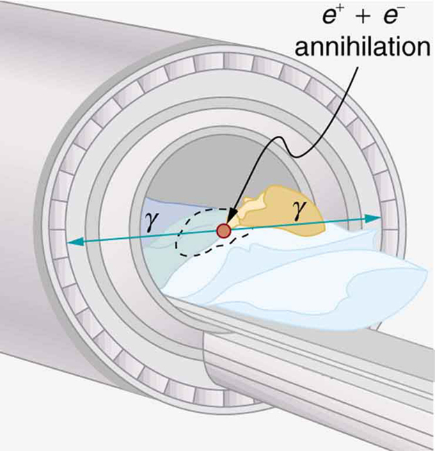

* Explain the working principle behind an anger camera.
* Describe the SPECT and PET imaging techniques.

A host of medical imaging techniques employ nuclear radiation. What makes nuclear radiation so useful? First, <math xmlns="http://www.w3.org/1998/Math/MathML"><semantics><mrow><mrow><mi>γ</mi></mrow><mrow /></mrow><annotation encoding="StarMath 5.0"> size 12{γ} {}</annotation></semantics></math>

 radiation can easily penetrate tissue; hence, it is a useful probe to monitor conditions inside the body. Second, nuclear radiation depends on the nuclide and not on the chemical compound it is in, so that a radioactive nuclide can be put into a compound designed for specific purposes. The compound is said to be **tagged**{: data-type="term" #import-auto-id2968500}. A tagged compound used for medical purposes is called a **radiopharmaceutical**{: data-type="term"}. Radiation detectors external to the body can determine the location and concentration of a radiopharmaceutical to yield medically useful information. For example, certain drugs are concentrated in inflamed regions of the body, and this information can aid diagnosis and treatment as seen in [\[link\]](#import-auto-id2042847). Another application utilizes a radiopharmaceutical which the body sends to bone cells, particularly those that are most active, to detect cancerous tumors or healing points. Images can then be produced of such bone scans. Radioisotopes are also used to determine the functioning of body organs, such as blood flow, heart muscle activity, and iodine uptake in the thyroid gland.

"){: #import-auto-id2042847}

### Medical Application

[\[link\]](#eip-909) lists certain medical diagnostic uses of radiopharmaceuticals, including isotopes and activities that are typically administered. Many organs can be imaged with a variety of nuclear isotopes replacing a stable element by a radioactive isotope. One common diagnostic employs iodine to image the thyroid, since iodine is concentrated in that organ. The most active thyroid cells, including cancerous cells, concentrate the most iodine and, therefore, emit the most radiation. Conversely, hypothyroidism is indicated by lack of iodine uptake. Note that there is more than one isotope that can be used for several types of scans. Another common nuclear diagnostic is the thallium scan for the cardiovascular system, particularly used to evaluate blockages in the coronary arteries and examine heart activity. The salt TlCl can be used, because it acts like NaCl and follows the blood. Gallium-67 accumulates where there is rapid cell growth, such as in tumors and sites of infection. Hence, it is useful in cancer imaging. Usually, the patient receives the injection one day and has a whole body scan 3 or 4 days later because it can take several days for the gallium to build up.

<table id="eip-909" summary="Two-column table. Column A lists several medical procedures. Under each procedure in column A is a list of isotopes commonly used for the procedure. Column B lists the typical activity for each isotope in m C I."><caption>Diagnostic Uses of Radiopharmaceuticals</caption><thead><tr>
            <th>
              <strong>Procedure, isotope</strong>
            </th>
            <th>Typical activity (mCi), where
<math xmlns="http://www.w3.org/1998/Math/MathML" display="block"><semantics><mrow><mrow><mrow><mn>1 mCi</mn><mo>=</mo><mn>3.7</mn><mrow><mo stretchy="false">×</mo><msup><mtext>10</mtext><mrow><mn>7</mn></mrow></msup><mspace width="0.25em" /><mtext>Bq</mtext></mrow></mrow></mrow><mrow /></mrow><annotation encoding="StarMath 5.0"> size 12{3 "." 7 times "10" rSup { size 8{7} } } {}</annotation></semantics></math></th>
          </tr></thead><tbody><tr>
            <td colspan="2">
              <strong><strong><em>Brain scan</em></strong></strong>
            </td>

          </tr><tr>
            <td>
              <math xmlns="http://www.w3.org/1998/Math/MathML" display="block">
                <semantics>
                  <mrow>
                    
                      <mrow>
                        <mrow><msup>
                              <mrow />
                                <mtext>99m</mtext>
                              </msup>
                            
                          <mtext>Tc</mtext>
                        </mrow>
                      </mrow>
                  </mrow>
                  <annotation encoding="StarMath 5.0"> size 12{"" lSup { size 8{"99m"} } "Tc"} {}</annotation>
                </semantics>
              </math> 
            </td>
            <td>7.5</td>
          </tr><tr>
            <td><math xmlns="http://www.w3.org/1998/Math/MathML" display="block"><semantics><mrow><mrow><mrow><msup><mrow /><mtext>113m</mtext></msup><mtext>In</mtext></mrow></mrow></mrow></semantics></math></td>
            <td>7.5</td>
          </tr>
          <tr>
          <td>
<math xmlns="http://www.w3.org/1998/Math/MathML" display="block"><semantics><mrow><mrow><mrow><msup><mrow /><mtext>11</mtext></msup><mtext>C (PET)</mtext></mrow></mrow><mrow /></mrow></semantics></math>
          </td>
          <td>20</td>
          </tr>
           <tr>
            <td><math xmlns="http://www.w3.org/1998/Math/MathML" display="block"><semantics><mrow><mrow><mrow><msup><mrow /><mtext>13</mtext></msup><mtext>N (PET)</mtext></mrow></mrow><mrow /></mrow></semantics></math></td>
            <td>20</td>
          </tr><tr>
            <td><math xmlns="http://www.w3.org/1998/Math/MathML" display="block"><semantics><mrow><mrow><mrow><msup><mrow /><mtext>15</mtext></msup><mtext>O (PET)</mtext></mrow></mrow><mrow /></mrow><annotation encoding="StarMath 5.0"> size 12{"" lSup { size 8{"15"} } O} {}</annotation></semantics></math></td>
            <td>50</td>
          </tr><tr>
            <td><math xmlns="http://www.w3.org/1998/Math/MathML" display="block"><semantics><mrow><mrow><mrow><msup><mrow /><mtext>18</mtext></msup><mtext>F (PET)</mtext></mrow></mrow><mrow /></mrow></semantics></math></td>
            <td>10</td>
          </tr><tr>
            <td colspan="2">
              <strong><em>Lung scan</em></strong>
            </td>

          </tr><tr>
            <td>
              <math xmlns="http://www.w3.org/1998/Math/MathML" display="block">
                <semantics>
                  <mrow>
                    
                      <mrow>
                        <mrow><msup>
                              <mrow />
                                <mtext>99m</mtext>
                              </msup>
                            
                          <mtext>Tc</mtext>
                        </mrow>
                      </mrow>
                  </mrow>
                  
                </semantics>
              </math> 
            </td>
            <td>2</td>
          </tr><tr>
            <td>
              <math xmlns="http://www.w3.org/1998/Math/MathML" display="block">
                <semantics>
                  <mrow>
                    
                      <mrow>
                        <mrow>
                            <msup>
                              <mrow />
                                <mtext>133</mtext>
                              </msup>
                          <mtext>Xe</mtext>
                        </mrow>
                      </mrow>
                  </mrow>
                </semantics>
              </math> 
            </td>
            <td>7.5</td>
          </tr><tr>
            <td colspan="2">
              <strong><em>Cardiovascular blood pool</em></strong>
            </td>
  
          </tr><tr>
            <td>
              <math xmlns="http://www.w3.org/1998/Math/MathML" display="block">
                <semantics>
                  <mrow>
                    
                      <mrow>
                        <mrow><msup>
                              <mrow />
                                <mtext>131</mtext>
                              </msup>
                          <mtext>I</mtext>
                        </mrow>
                      </mrow>
                  </mrow>
                </semantics>
              </math> 
            </td>
            <td>0.2</td>
          </tr><tr>
            <td>
              <math xmlns="http://www.w3.org/1998/Math/MathML" display="block">
                <semantics>
                  <mrow>
                    
                      <mrow>
                        <mrow><msup>
                              <mrow />
                                <mtext>99m</mtext>
                              </msup>
                            
                          <mtext>Tc</mtext>
                        </mrow>
                      </mrow>
                  </mrow>
                </semantics>
              </math> 
            </td>
            <td>2</td>
          </tr><tr>
            <td colspan="2">
              <strong><em>Cardiovascular arterial flow</em></strong>
            </td>
 
          </tr><tr>
            <td>
              <math xmlns="http://www.w3.org/1998/Math/MathML" display="block">
                <semantics>
                  <mrow>
                    
                      <mrow>
                        <mrow><msup>
                              <mrow />
                                <mtext>201</mtext>
                              </msup>
                            
                          <mtext>Tl</mtext>
                        </mrow>
                      </mrow>
                    
                  </mrow>
                </semantics>
              </math> 
            </td>
            <td>3</td>
          </tr><tr>
            <td>
              <math xmlns="http://www.w3.org/1998/Math/MathML" display="block">
                <semantics>
                  <mrow>
                    
                      <mrow>
                        <mrow><msup>
                              <mrow />
                                <mtext>24</mtext>
                              </msup>
                            
                          <mtext>Na</mtext>
                        </mrow>
                      </mrow>
                    
                  </mrow>
                </semantics>
              </math> 
            </td>
            <td>7.5</td>
          </tr><tr>
            <td colspan="2">
              <strong><em>Thyroid scan</em></strong>
            </td>

          </tr><tr>
            <td>
              <math xmlns="http://www.w3.org/1998/Math/MathML" display="block">
                <semantics>
                  <mrow>
                    
                      <mrow>
                        <mrow><msup>
                              <mrow />
                                <mtext>131</mtext>
                              </msup>
                            
                          <mtext>I</mtext>
                        </mrow>
                      </mrow>
                  </mrow>
                 
                </semantics>
              </math> 
            </td>
            <td>0.05</td>
          </tr><tr>
            <td>
              <math xmlns="http://www.w3.org/1998/Math/MathML" display="block">
                <semantics>
                  <mrow>
                    
                      <mrow>
                        <mrow><msup>
                              <mrow />
                                <mtext>123</mtext>
                              </msup>
                            
                          <mtext>I</mtext>
                        </mrow>
                      </mrow>
                  </mrow>
                </semantics>
              </math> 
            </td>
            <td>0.07</td>
          </tr><tr>
            <td colspan="2">
              <strong><em>Liver scan</em></strong>
            </td>
   
          </tr><tr>
            <td><math xmlns="http://www.w3.org/1998/Math/MathML" display="block"><semantics><mrow><mrow><mrow><msup><mrow /><mtext>198</mtext></msup><mtext>Au</mtext></mrow></mrow><mrow /></mrow><annotation encoding="StarMath 5.0"> size 12{"" lSup { size 8{"198"} } "Au"} {}</annotation></semantics></math> (colloid)</td>
            <td>0.1</td>
          </tr><tr>
            <td><math xmlns="http://www.w3.org/1998/Math/MathML" display="block"><semantics><mrow><mrow><mrow><msup><mrow /><mtext>99m</mtext></msup><mtext>Tc</mtext></mrow></mrow></mrow></semantics></math> (colloid)</td>
            <td>2</td>
          </tr><tr>
            <td colspan="2">
              <strong><em>Bone scan</em></strong>
            </td>
     
          </tr><tr>
            <td>
              <math xmlns="http://www.w3.org/1998/Math/MathML" display="block">
                <semantics>
                  <mrow>
                    
                      <mrow>
                        <mrow><msup>
                              <mrow />
                                <mtext>85</mtext>
                              </msup>
                            
                          <mtext>Sr</mtext>
                        </mrow>
                      </mrow>
                  </mrow>
                </semantics>
              </math> 
            </td>
            <td>0.1</td>
          </tr><tr>
            <td>
              <math xmlns="http://www.w3.org/1998/Math/MathML" display="block">
                <semantics>
                  <mrow>
                    
                      <mrow>
                        <mrow><msup>
                              <mrow />
                                <mtext>99m</mtext>
                              </msup>
                            
                          <mtext>Tc</mtext>
                        </mrow>
                      </mrow>
                  </mrow>
                </semantics>
              </math> 
            </td>
            <td>10</td>
          </tr><tr>
            <td colspan="2">
              <strong><em>Kidney scan</em></strong>
            </td>
     
          </tr><tr>
            <td>
              <math xmlns="http://www.w3.org/1998/Math/MathML" display="block">
                <semantics>
                  <mrow>
                    
                      <mrow>
                        <mrow><msup>
                              <mrow />
                                <mtext>197</mtext>
                              </msup>
                            
                          <mtext>Hg</mtext>
                        </mrow>
                      </mrow>
                  </mrow>
                </semantics>
              </math> 
            </td>
            <td>0.1</td>
          </tr><tr>
            <td>
              <math xmlns="http://www.w3.org/1998/Math/MathML" display="block">
                <semantics>
                  <mrow>
                    
                      <mrow>
                        <mrow><msup>
                              <mrow />
                                <mtext>99m</mtext>
                              </msup>
                            
                          <mtext>Tc</mtext>
                        </mrow>
                      </mrow>
                  </mrow>
                </semantics>
              </math> 
            </td>
            <td>1.5</td>
          </tr></tbody></table>

Note that [\[link\]](#eip-909) lists many diagnostic uses for <math xmlns="http://www.w3.org/1998/Math/MathML"><semantics><mrow><mrow><mrow><msup><mrow /><mtext>99m</mtext></msup><mtext>Tc</mtext></mrow></mrow><mrow /></mrow><annotation encoding="StarMath 5.0"> size 12{"" lSup { size 8{"99m"} } "Tc"} {}</annotation></semantics></math>

, where “m” stands for a metastable state of the technetium nucleus. Perhaps 80 percent of all radiopharmaceutical procedures employ <math xmlns="http://www.w3.org/1998/Math/MathML"><semantics><mrow><mrow><mrow><msup><mrow /><mtext>99m</mtext></msup><mtext>Tc</mtext></mrow></mrow><mrow /></mrow><annotation encoding="StarMath 5.0"> size 12{"" lSup { size 8{"99m"} } "Tc"} {}</annotation></semantics></math>

 because of its many advantages. One is that the decay of its metastable state produces a single, easily identified 0.142-MeV <math xmlns="http://www.w3.org/1998/Math/MathML"><semantics><mrow><mrow><mi>γ</mi></mrow><mrow /></mrow></semantics></math>

 ray. Additionally, the radiation dose to the patient is limited by the short 6.0-h half-life of <math xmlns="http://www.w3.org/1998/Math/MathML"><semantics><mrow><mrow><mrow><msup><mrow /><mtext>99m</mtext></msup><mtext>Tc</mtext></mrow></mrow><mrow /></mrow></semantics></math>

. And, although its half-life is short, it is easily and continuously produced on site. The basic process for production is neutron activation of molybdenum, which quickly <math xmlns="http://www.w3.org/1998/Math/MathML"><semantics><mrow><mrow><mi>β</mi></mrow><mrow /></mrow></semantics></math>

 decays into <math xmlns="http://www.w3.org/1998/Math/MathML"><semantics><mrow><mrow><mrow><msup><mrow /><mtext>99m</mtext></msup><mtext>Tc</mtext></mrow></mrow><mrow /></mrow></semantics></math>

. Technetium-99m can be attached to many compounds to allow the imaging of the skeleton, heart, lungs, kidneys, etc.

[\[link\]](#import-auto-id1909409) shows one of the simpler methods of imaging the concentration of nuclear activity, employing a device called an **Anger camera**{: data-type="term" #import-auto-id3047149}**** or **gamma camera**{: data-type="term" #import-auto-id2990678}. A piece of lead with holes bored through it collimates <math xmlns="http://www.w3.org/1998/Math/MathML"><semantics><mrow><mrow><mi>γ</mi></mrow><mrow /></mrow><annotation encoding="StarMath 5.0"> size 12{γ} {}</annotation></semantics></math>

 rays emerging from the patient, allowing detectors to receive <math xmlns="http://www.w3.org/1998/Math/MathML"><semantics><mrow><mrow><mi>γ</mi></mrow><mrow /></mrow><annotation encoding="StarMath 5.0"> size 12{γ} {}</annotation></semantics></math>

 rays from specific directions only. The computer analysis of detector signals produces an image. One of the disadvantages of this detection method is that there is no depth information (i.e., it provides a two-dimensional view of the tumor as opposed to a three-dimensional view), because radiation from any location under that detector produces a signal.

{: #import-auto-id1909409}

Imaging techniques much like those in x-ray computed tomography (CT) scans use nuclear activity in patients to form three-dimensional images. [\[link\]](#import-auto-id2410176) shows a patient in a circular array of detectors that may be stationary or rotated, with detector output used by a computer to construct a detailed image. This technique is called **single-photon-emission computed tomography(SPECT)**{: data-type="term" #import-auto-id2688094} or sometimes simply SPET. The spatial resolution of this technique is poor, about 1 cm, but the contrast (i.e. the difference in visual properties that makes an object distinguishable from other objects and the background) is good.

 "){: #import-auto-id2410176}

Images produced by <math xmlns="http://www.w3.org/1998/Math/MathML"><semantics><mrow><mrow><msup><mi>β</mi><mrow><mrow><mo stretchy="false">+</mo><mrow /></mrow></mrow></msup></mrow><mrow /></mrow></semantics></math>

 emitters have become important in recent years. When the emitted positron ( <math xmlns="http://www.w3.org/1998/Math/MathML"><semantics><mrow><mrow><msup><mi>β</mi><mrow><mrow><mo stretchy="false">+</mo><mrow /></mrow></mrow></msup></mrow><mrow /></mrow></semantics></math>

) encounters an electron, mutual annihilation occurs, producing two <math xmlns="http://www.w3.org/1998/Math/MathML"><semantics><mrow><mrow><mi fontstyle="italic">γ</mi></mrow><mrow /></mrow></semantics></math>

 rays. These <math xmlns="http://www.w3.org/1998/Math/MathML"><semantics><mrow><mrow><mi fontstyle="italic">γ</mi></mrow><mrow /></mrow></semantics></math>

 rays have identical 0.511-MeV energies (the energy comes from the destruction of an electron or positron mass) and they move directly away from one another, allowing detectors to determine their point of origin accurately, as shown in [\[link\]](#import-auto-id3400779). The system is called **positron emission tomography (PET)**{: data-type="term" #import-auto-id2957607}. It requires detectors on opposite sides to simultaneously (i.e., at the same time) detect photons of 0.511-MeV energy and utilizes computer imaging techniques similar to those in SPECT and CT scans. Examples of <math xmlns="http://www.w3.org/1998/Math/MathML"><semantics><mrow><mrow><msup><mi>β</mi><mrow><mrow><mo stretchy="false">+</mo><mrow /></mrow></mrow></msup></mrow><mrow /></mrow><annotation encoding="StarMath 5.0"> size 12{β rSup { size 8{+{}} } } {}</annotation></semantics></math>

 -emitting isotopes used in PET are <math xmlns="http://www.w3.org/1998/Math/MathML"><semantics><mrow><mrow><mrow><msup><mrow /><mtext>11</mtext></msup><mtext>C</mtext></mrow></mrow><mrow /></mrow><annotation encoding="StarMath 5.0"> size 12{"" lSup { size 8{"11"} } C} {}</annotation></semantics></math>

, <math xmlns="http://www.w3.org/1998/Math/MathML"><semantics><mrow><mrow><mrow><msup><mrow /><mtext>13</mtext></msup><mtext>N</mtext></mrow></mrow><mrow /></mrow><annotation encoding="StarMath 5.0"> size 12{"" lSup { size 8{"13"} } N} {}</annotation></semantics></math>

, <math xmlns="http://www.w3.org/1998/Math/MathML"><semantics><mrow><mrow><mrow><msup><mrow /><mtext>15</mtext></msup><mtext>O</mtext></mrow></mrow><mrow /></mrow><annotation encoding="StarMath 5.0"> size 12{"" lSup { size 8{"15"} } O} {}</annotation></semantics></math>

, and <math xmlns="http://www.w3.org/1998/Math/MathML"><semantics><mrow><mrow><mrow><msup><mrow /><mtext>18</mtext></msup><mtext>F</mtext></mrow></mrow><mrow /></mrow></semantics></math>

, as seen in [\[link\]](#eip-909). This list includes C, N, and O, and so they have the advantage of being able to function as tags for natural body compounds. Its resolution of 0.5 cm is better than that of SPECT; the accuracy and sensitivity of PET scans make them useful for examining the brain’s anatomy and function. The brain’s use of oxygen and water can be monitored with <math xmlns="http://www.w3.org/1998/Math/MathML"><semantics><mrow><mrow><mrow><msup><mrow /><mtext>15</mtext></msup><mtext>O</mtext></mrow></mrow><mrow /></mrow></semantics></math>

. PET is used extensively for diagnosing brain disorders. It can note decreased metabolism in certain regions prior to a confirmation of Alzheimer’s disease. PET can locate regions in the brain that become active when a person carries out specific activities, such as speaking, closing their eyes, and so on.

{: #import-auto-id3400779}

PhET Explorations: Simplified MRI

Is it a tumor? Magnetic Resonance Imaging (MRI) can tell. Your head is full of tiny radio transmitters (the nuclear spins of the hydrogen nuclei of your water molecules). In an MRI unit, these little radios can be made to broadcast their positions, giving a detailed picture of the inside of your head.

<figure markdown="1" id="eip-id1430273">
<figcaption>
[Simplified MRI](mri_en.jar)
</figcaption>

[{: data-print="false"}](mri_en.jar){: data-type="image-with-thumbnail"} {: data-print="true"}

</figure>

### Section Summary

* {: #import-auto-id1389596} Radiopharmaceuticals are compounds that are used for medical imaging and therapeutics.
* {: #import-auto-id2017105} The process of attaching a radioactive substance is called tagging.
* {: #import-auto-id3004371} [\[link\]](#eip-909) lists certain diagnostic uses of radiopharmaceuticals including the isotope and activity typically used in diagnostics.
* {: #import-auto-id1842380} One common imaging device is the Anger camera, which consists of a lead collimator, radiation detectors, and an analysis computer.
* {: #import-auto-id1607938} Tomography performed with **<math xmlns="http://www.w3.org/1998/Math/MathML"><semantics><mrow><mrow><mi fontstyle="italic">γ</mi></mrow><mrow /></mrow><annotation encoding="StarMath 5.0"> size 12{γ} {}</annotation></semantics></math>
  
  **-emitting radiopharmaceuticals is called SPECT and has the advantages of x-ray CT scans coupled with organ- and function-specific drugs.
* {: #import-auto-id1236408} PET is a similar technique that uses **<math xmlns="http://www.w3.org/1998/Math/MathML"><semantics><mrow><mrow><msup><mi>β</mi><mrow><mrow><mo stretchy="false">+</mo><mrow /></mrow></mrow></msup></mrow><mrow /></mrow><annotation encoding="StarMath 5.0"> size 12{β rSup { size 8{+{}} } } {}</annotation></semantics></math>
  
  ** emitters and detects the two annihilation **<math xmlns="http://www.w3.org/1998/Math/MathML"><semantics><mrow><mrow><mi fontstyle="italic">γ</mi></mrow><mrow /></mrow><annotation encoding="StarMath 5.0"> size 12{γ} {}</annotation></semantics></math>
  
  ** rays, which aid to localize the source.

### Conceptual Questions

In terms of radiation dose, what is the major difference between medical diagnostic uses of radiation and medical therapeutic uses?

One of the methods used to limit radiation dose to the patient in medical imaging is to employ isotopes with short half-lives. How would this limit the dose?

### Problems &amp; Exercises

A neutron generator uses an <math xmlns="http://www.w3.org/1998/Math/MathML"><semantics><mrow><mrow><mi>α</mi></mrow><mrow /></mrow><annotation encoding="StarMath 5.0"> size 12{α} {}</annotation></semantics></math>

 source, such as radium, to bombard beryllium, inducing the reaction <math xmlns="http://www.w3.org/1998/Math/MathML"><semantics><mrow><mrow><mrow><msup><mrow /><mn>4</mn></msup><mrow><mtext>He</mtext><mo stretchy="false">+</mo> <msup><mrow /><mn>9</mn></msup></mrow><mtext>Be</mtext><mo stretchy="false">→</mo> <msup><mrow /><mtext>12</mtext></msup><mrow><mtext>C</mtext><mo stretchy="false">+</mo><mi>n</mi></mrow></mrow></mrow><mrow /></mrow></semantics></math>

. Such neutron sources are called RaBe sources, or PuBe sources if they use plutonium to get the <math xmlns="http://www.w3.org/1998/Math/MathML"><semantics><mrow><mrow><mi>α</mi></mrow><mrow /></mrow></semantics></math>

 s. Calculate the energy output of the reaction in MeV.

5\.701 MeV

Neutrons from a source (perhaps the one discussed in the preceding problem) bombard natural molybdenum, which is 24 percent <math xmlns="http://www.w3.org/1998/Math/MathML"><semantics><mrow><mrow><mrow><msup><mrow /><mtext>98</mtext></msup><mtext>Mo</mtext></mrow></mrow><mrow /></mrow></semantics></math>

. What is the energy output of the reaction <math xmlns="http://www.w3.org/1998/Math/MathML"><semantics><mrow><mrow><mrow><msup><mrow /><mtext>98</mtext></msup><mrow><mtext>Mo</mtext><mo stretchy="false">+</mo><mi>n</mi></mrow><mo stretchy="false">→</mo> <msup><mrow /><mtext>99</mtext></msup><mrow><mtext>Mo</mtext><mo stretchy="false">+</mo><mi>γ</mi></mrow></mrow></mrow><mrow /></mrow></semantics></math>

 ? The mass of <math xmlns="http://www.w3.org/1998/Math/MathML"><semantics><mrow><mrow><mrow><msup><mrow /><mtext>98</mtext></msup><mtext>Mo</mtext></mrow></mrow><mrow /></mrow></semantics></math>

 is given in [Appendix A: Atomic Masses](/m42699), and that of <math xmlns="http://www.w3.org/1998/Math/MathML"><semantics><mrow><mrow><mrow><msup><mrow /><mtext>99</mtext></msup><mtext>Mo</mtext></mrow></mrow><mrow /></mrow></semantics></math>

 is 98.907711 u.

The purpose of producing <math xmlns="http://www.w3.org/1998/Math/MathML"><semantics><mrow><mrow><mrow><msup><mrow /><mtext>99</mtext></msup><mtext>Mo</mtext></mrow></mrow><mrow /></mrow></semantics></math>

 (usually by neutron activation of natural molybdenum, as in the preceding problem) is to produce <math xmlns="http://www.w3.org/1998/Math/MathML"><semantics><mrow><mrow><mrow><msup><mrow /><mtext>99m</mtext></msup><mtext>Tc.</mtext></mrow></mrow><mrow /></mrow></semantics></math>

 Using the rules, verify that the <math xmlns="http://www.w3.org/1998/Math/MathML"><semantics><mrow><mrow><msup><mi>β</mi><mrow><mrow><mo stretchy="false">−</mo><mrow /></mrow></mrow></msup></mrow><mrow /></mrow></semantics></math>

 decay of <math xmlns="http://www.w3.org/1998/Math/MathML"><semantics><mrow><mrow><mrow><msup><mrow /><mtext>99</mtext></msup><mtext>Mo</mtext></mrow></mrow><mrow /></mrow></semantics></math>

 produces <math xmlns="http://www.w3.org/1998/Math/MathML"><semantics><mrow><mrow><mrow><msup><mrow /><mtext>99m</mtext></msup><mtext>Tc</mtext></mrow></mrow><mrow /></mrow></semantics></math>

. (Most <math xmlns="http://www.w3.org/1998/Math/MathML"><semantics><mrow><mrow><mrow><msup><mrow /><mtext>99m</mtext></msup><mtext>Tc</mtext></mrow></mrow><mrow /></mrow></semantics></math>

 nuclei produced in this decay are left in a metastable excited state denoted <math xmlns="http://www.w3.org/1998/Math/MathML"><semantics><mrow><mrow><mrow><msup><mrow /><mtext>99m</mtext></msup><mtext>Tc</mtext></mrow></mrow></mrow></semantics></math>

.)

<math xmlns="http://www.w3.org/1998/Math/MathML"> <semantics> <mrow> <mrow> <mrow> <msubsup> <mrow /> <mtext>42</mtext> <mrow> <mtext>99</mtext> </mrow> </msubsup> <msub> <mtext>Mo</mtext> <mrow> <mtext>57</mtext> </mrow> </msub> <mo stretchy="false">→</mo> <msubsup> <mrow /> <mtext>43</mtext> <mrow> <mtext>99</mtext> </mrow> </msubsup> <mrow> <mrow> <msub> <mtext>Tc</mtext> <mrow> <mtext>56</mtext> </mrow> </msub> <mo stretchy="false">+</mo> <msup> <mi>β</mi> <mrow> <mrow> <mo stretchy="false">−</mo> <mrow /> </mrow> </mrow> </msup> </mrow> <mo stretchy="false">+</mo> <msub> <mover accent="true"> <mi>v</mi> <mo>¯</mo> </mover> <mrow> <mi>e</mi> </mrow> </msub> </mrow> </mrow> </mrow> </mrow> </semantics> </math>

(a) Two annihilation <math xmlns="http://www.w3.org/1998/Math/MathML"><semantics><mrow><mrow><mi fontstyle="italic">γ</mi></mrow><mrow /></mrow><annotation encoding="StarMath 5.0"> size 12{γ} {}</annotation></semantics></math>

 rays in a PET scan originate at the same point and travel to detectors on either side of the patient. If the point of origin is 9.00 cm closer to one of the detectors, what is the difference in arrival times of the photons? (This could be used to give position information, but the time difference is small enough to make it difficult.)

(b) How accurately would you need to be able to measure arrival time differences to get a position resolution of 1.00 mm?

[[link]](#eip-909) indicates that 7.50 mCi of <math xmlns="http://www.w3.org/1998/Math/MathML"><semantics><mrow><mrow><mrow><msup><mrow /><mtext>99m</mtext></msup><mtext>Tc</mtext></mrow></mrow><mrow /></mrow><annotation encoding="StarMath 5.0"> size 12{"" lSup { size 8{"99m"} } "Tc"} {}</annotation></semantics></math>

 is used in a brain scan. What is the mass of technetium?

<math xmlns="http://www.w3.org/1998/Math/MathML"> <semantics> <mrow> <mrow> <mrow> <mn>1</mn> <mtext>.</mtext> <mrow> <mtext>43</mtext> <mo stretchy="false">×</mo> <msup> <mtext>10</mtext> <mrow> <mrow> <mo stretchy="false">−</mo> <mn>9</mn> </mrow> </mrow> </msup> </mrow> <mspace width="0.25em" /> <mtext>g</mtext> </mrow> </mrow> <mrow /> </mrow> <annotation encoding="StarMath 5.0"> size 12{1 "." "43" times "10" rSup { size 8{ - 9} } `g} {}</annotation> </semantics> </math>

The activities of <math xmlns="http://www.w3.org/1998/Math/MathML"><semantics><mrow><mrow><mrow><msup><mrow /><mtext>131</mtext></msup><mtext>I</mtext></mrow></mrow><mrow /></mrow><annotation encoding="StarMath 5.0"> size 12{"" lSup { size 8{"131"} } I} {}</annotation></semantics></math>

 and <math xmlns="http://www.w3.org/1998/Math/MathML"><semantics><mrow><mrow><mrow><msup><mrow /><mtext>123</mtext></msup><mtext>I</mtext></mrow></mrow><mrow /></mrow><annotation encoding="StarMath 5.0"> size 12{"" lSup { size 8{"123"} } I} {}</annotation></semantics></math>

 used in thyroid scans are given in [[link]](#eip-909) to be 50 and <math xmlns="http://www.w3.org/1998/Math/MathML"><semantics><mrow><mrow><mtext>70 μ</mtext><mn>Ci</mn></mrow><mrow /></mrow></semantics></math>

, respectively. Find and compare the masses of <math xmlns="http://www.w3.org/1998/Math/MathML"><semantics><mrow><mrow><mrow><msup><mrow /><mtext>131</mtext></msup><mtext>I</mtext></mrow></mrow><mrow /></mrow></semantics></math>

 and <math xmlns="http://www.w3.org/1998/Math/MathML"><semantics><mrow><mrow><mrow><msup><mrow /><mtext>123</mtext></msup><mtext>I</mtext></mrow></mrow><mrow /></mrow></semantics></math>

 in such scans, given their respective half-lives are 8.04 d and 13.2 h. The masses are so small that the radioiodine is usually mixed with stable iodine as a carrier to ensure normal chemistry and distribution in the body.

(a) Neutron activation of sodium, which is 100%<math xmlns="http://www.w3.org/1998/Math/MathML"><semantics><mrow><mrow><mrow><msup><mrow /><mtext>23</mtext></msup><mtext>Na</mtext></mrow></mrow><mrow /></mrow></semantics></math>

, produces <math xmlns="http://www.w3.org/1998/Math/MathML"><semantics><mrow><mrow><mrow><msup><mrow /><mtext>24</mtext></msup><mtext>Na</mtext></mrow></mrow><mrow /></mrow></semantics></math>

, which is used in some heart scans, as seen in [[link]](#eip-909). The equation for the reaction is <math xmlns="http://www.w3.org/1998/Math/MathML"><semantics><mrow><mrow><mrow><msup><mrow /><mtext>23</mtext></msup><mrow><mtext>Na</mtext><mo stretchy="false">+</mo><mi>n</mi></mrow><mo stretchy="false">→</mo> <msup><mrow /><mtext>24</mtext></msup><mrow><mtext>Na</mtext><mo stretchy="false">+</mo><mi>γ</mi></mrow></mrow></mrow><mrow /></mrow></semantics></math>

. Find its energy output, given the mass of <math xmlns="http://www.w3.org/1998/Math/MathML"><semantics><mrow><mrow><mrow><msup><mrow /><mtext>24</mtext></msup><mtext>Na</mtext></mrow></mrow></mrow></semantics></math>

 is 23.990962 u.

(b) What mass of <math xmlns="http://www.w3.org/1998/Math/MathML"><semantics><mrow><mrow><mrow><msup><mrow /><mtext>24</mtext></msup><mtext>Na</mtext></mrow></mrow><mrow /></mrow><annotation encoding="StarMath 5.0"> size 12{"" lSup { size 8{"24"} } "Na"} {}</annotation></semantics></math>

 produces the needed 5.0-mCi activity, given its half-life is 15.0 h?

(a) 6.958 MeV

(b) <math xmlns="http://www.w3.org/1998/Math/MathML"><semantics><mrow><mrow><mrow><mn>5</mn><mtext>.</mtext><mrow><mn>7</mn><mo stretchy="false">×</mo><msup><mtext>10</mtext><mrow><mrow><mo stretchy="false">−</mo><mtext>10</mtext></mrow></mrow></msup></mrow><mspace width="0.25em" /><mtext>g</mtext></mrow></mrow><mrow /></mrow><annotation encoding="StarMath 5.0"> size 12{5 "." 7 times "10" rSup { size 8{ - "10"} } `g} {}</annotation></semantics></math>

### Glossary
{: data-type="glossary-title"}

Anger camera
: a common medical imaging device that uses a scintillator connected to a series of photomultipliers
{: #import-auto-id2449340}

gamma camera
: another name for an Anger camera
^

positron emission tomography (PET)
: tomography technique that uses
  <math xmlns="http://www.w3.org/1998/Math/MathML"><semantics><mrow><mrow><msup><mi>β</mi><mrow><mrow><mo stretchy="false">+</mo><mrow /></mrow></mrow></msup></mrow><mrow /></mrow><annotation encoding="StarMath 5.0"> size 12{β rSup { size 8{+{}} } } {}</annotation></semantics></math>
  
  emitters and detects the two annihilation
  <math xmlns="http://www.w3.org/1998/Math/MathML"><semantics><mrow><mrow><mi fontstyle="italic">γ</mi></mrow><mrow /></mrow><annotation encoding="StarMath 5.0"> size 12{γ} {}</annotation></semantics></math>
  
  rays, aiding in source localization
{: #import-auto-id2070170}

radiopharmaceutical
: compound used for medical imaging
{: #import-auto-id2687821}

single-photon-emission computed tomography (SPECT)
: tomography performed with
  <math xmlns="http://www.w3.org/1998/Math/MathML"><semantics><mrow><mrow><mi fontstyle="italic">γ</mi></mrow><mrow /></mrow><annotation encoding="StarMath 5.0"> size 12{γ} {}</annotation></semantics></math>
  
  -emitting radiopharmaceuticals
{: #import-auto-id2514218}

tagged
: process of attaching a radioactive substance to a chemical compound
{: #import-auto-id1368664}

