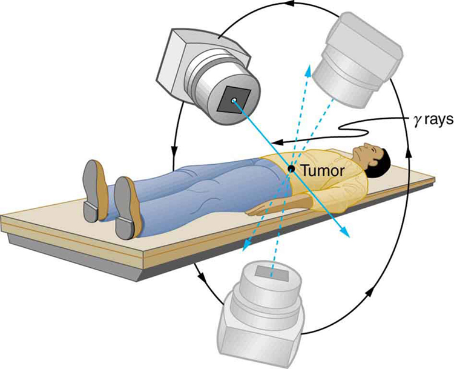

* Explain the concept of radiotherapy and list typical doses for cancer therapy.

Therapeutic applications of ionizing radiation, called radiation therapy or **radiotherapy**{: data-type="term" #import-auto-id2591478}, have existed since the discovery of x-rays and nuclear radioactivity. Today, radiotherapy is used almost exclusively for cancer therapy, where it saves thousands of lives and improves the quality of life and longevity of many it cannot save. Radiotherapy may be used alone or in combination with surgery and chemotherapy (drug treatment) depending on the type of cancer and the response of the patient. A careful examination of all available data has established that radiotherapy’s beneficial effects far outweigh its long-term risks.

# Medical Application

The earliest uses of ionizing radiation on humans were mostly harmful, with many at the level of snake oil as seen in [\[link\]](#import-auto-id2678324). Radium-doped cosmetics that glowed in the dark were used around the time of World War I. As recently as the 1950s, radon mine tours were promoted as healthful and rejuvenating—those who toured were exposed but gained no benefits. Radium salts were sold as health elixirs for many years. The gruesome death of a wealthy industrialist, who became psychologically addicted to the brew, alerted the unsuspecting to the dangers of radium salt elixirs. Most abuses finally ended after the legislation in the 1950s.

"){: #import-auto-id2678324 data-media-type="image/png"}

Radiotherapy is effective against cancer because cancer cells reproduce rapidly and, consequently, are more sensitive to radiation. The central problem in radiotherapy is to make the dose for cancer cells as high as possible while limiting the dose for normal cells. The ratio of abnormal cells killed to normal cells killed is called the **therapeutic ratio**{: data-type="term" #import-auto-id1276219}, and all radiotherapy techniques are designed to enhance this ratio. Radiation can be concentrated in cancerous tissue by a number of techniques. One of the most prevalent techniques for well-defined tumors is a geometric technique shown in [\[link\]](#import-auto-id1339459). A narrow beam of radiation is passed through the patient from a variety of directions with a common crossing point in the tumor. This concentrates the dose in the tumor while spreading it out over a large volume of normal tissue. The external radiation can be x-rays, <math xmlns="http://www.w3.org/1998/Math/MathML"><semantics><mrow><mrow><mrow><msup><mrow /><mtext>60</mtext></msup><mtext>Co </mtext><mi /><mi>γ</mi></mrow></mrow><mrow /></mrow></semantics></math>

 rays, or ionizing-particle beams produced by accelerators. Accelerator-produced beams of neutrons, <math xmlns="http://www.w3.org/1998/Math/MathML"><semantics><mrow><mtext>π-mesons</mtext></mrow></semantics></math>

, and heavy ions such as nitrogen nuclei have been employed, and these can be quite effective. These particles have larger QFs or RBEs and sometimes can be better localized, producing a greater therapeutic ratio. But accelerator radiotherapy is much more expensive and less frequently employed than other forms.

{: #import-auto-id1339459 data-media-type="image/jpg"}

Another form of radiotherapy uses chemically inert radioactive implants. One use is for prostate cancer. Radioactive seeds (about 40 to 100 and the size of a grain of rice) are placed in the prostate region. The isotopes used are usually <math xmlns="http://www.w3.org/1998/Math/MathML"><semantics><mrow><mrow><mrow><msup><mrow /><mtext>135</mtext></msup><mtext>I</mtext></mrow></mrow><mrow /></mrow><annotation encoding="StarMath 5.0"> size 12{"" lSup { size 8{"135"} } I} {}</annotation></semantics></math>

 (6-month half life) or <math xmlns="http://www.w3.org/1998/Math/MathML"><semantics><mrow><mrow><mrow><msup><mrow /><mtext>103</mtext></msup><mtext>Pd</mtext></mrow></mrow><mrow /></mrow><annotation encoding="StarMath 5.0"> size 12{"" lSup { size 8{"103"} } "Pd"} {}</annotation></semantics></math>

 (3-month half life). Alpha emitters have the dual advantages of a large QF and a small range for better localization.

Radiopharmaceuticals are used for cancer therapy when they can be localized well enough to produce a favorable therapeutic ratio. Thyroid cancer is commonly treated utilizing radioactive iodine. Thyroid cells concentrate iodine, and cancerous thyroid cells are more aggressive in doing this. An ingenious use of radiopharmaceuticals in cancer therapy tags antibodies with radioisotopes. Antibodies produced by a patient to combat his cancer are extracted, cultured, loaded with a radioisotope, and then returned to the patient. The antibodies are concentrated almost entirely in the tissue they developed to fight, thus localizing the radiation in abnormal tissue. The therapeutic ratio can be quite high for short-range radiation. There is, however, a significant dose for organs that eliminate radiopharmaceuticals from the body, such as the liver, kidneys, and bladder. As with most radiotherapy, the technique is limited by the tolerable amount of damage to the normal tissue.

[\[link\]](#import-auto-id1994467) lists typical therapeutic doses of radiation used against certain cancers. The doses are large, but not fatal because they are localized and spread out in time. Protocols for treatment vary with the type of cancer and the condition and response of the patient. Three to five 200-rem treatments per week for a period of several weeks is typical. Time between treatments allows the body to repair normal tissue. This effect occurs because damage is concentrated in the abnormal tissue, and the abnormal tissue is more sensitive to radiation. Damage to normal tissue limits the doses. You will note that the greatest doses are given to any tissue that is not rapidly reproducing, such as in the adult brain. Lung cancer, on the other end of the scale, cannot ordinarily be cured with radiation because of the sensitivity of lung tissue and blood to radiation. But radiotherapy for lung cancer does alleviate symptoms and prolong life and is therefore justified in some cases.

<table id="import-auto-id1994467" summary="This table has two columns. The left column lists the type of cancer and the right column lists the typical dose of radiation administered for each type of cancer."><caption>Cancer Radiotherapy</caption><thead><tr>
                        <th>
                            <strong>Type of Cancer</strong>
                        </th>
                        <th>
                            <strong>Typical dose (Sv)</strong>
                        </th>
                    </tr></thead><tbody><tr>
                        <td>Lung</td>
                        <td>10–20</td>
                    </tr><tr>
                        <td>Hodgkin’s disease</td>
                        <td>40–45</td>
                    </tr><tr>
                        <td>Skin</td>
                        <td>40–50</td>
                    </tr><tr>
                        <td>Ovarian</td>
                        <td>50–75</td>
                    </tr><tr>
                        <td>Breast</td>
                        <td>50–80+</td>
                    </tr><tr>
                        <td>Brain</td>
                        <td>80+</td>
                    </tr><tr>
<td>Neck</td>
<td>80+</td>
</tr><tr>
<td>Bone</td>
<td>80+</td>
</tr><tr>
<td>Soft tissue</td>
<td>80+</td>
</tr><tr>
<td>Thyroid</td>
<td>80+</td>
</tr></tbody></table>

Finally, it is interesting to note that chemotherapy employs drugs that interfere with cell division and is, thus, also effective against cancer. It also has almost the same side effects, such as nausea and hair loss, and risks, such as the inducement of another cancer.

# Section Summary

* {: #import-auto-id1921189} Radiotherapy is the use of ionizing radiation to treat ailments, now limited to cancer therapy.
* {: #import-auto-id3154476} The sensitivity of cancer cells to radiation enhances the ratio of cancer cells killed to normal cells killed, which is called the therapeutic ratio.
* {: #import-auto-id1585961} Doses for various organs are limited by the tolerance of normal tissue for radiation. Treatment is localized in one region of the body and spread out in time.

# Conceptual Questions

Radiotherapy is more likely to be used to treat cancer in elderly patients than in young ones. Explain why. Why is radiotherapy used to treat young people at all?

# Problems &amp; Exercises

A beam of 168-MeV nitrogen nuclei is used for cancer therapy. If this beam is directed onto a 0.200-kg tumor and gives it a 2.00-Sv dose, how many nitrogen nuclei were stopped? (Use an RBE of 20 for heavy ions.)

<math xmlns="http://www.w3.org/1998/Math/MathML"> <semantics> <mrow> <mrow> <mrow> <mn>7.44</mn> <mrow> <mo stretchy="false">×</mo> <msup> <mtext>10</mtext> <mrow> <mn>8</mn> </mrow> </msup> </mrow> </mrow> </mrow> <mrow /> </mrow> <annotation encoding="StarMath 5.0"> size 12{7 "." "44" times "10" rSup { size 8{8} } } {}</annotation> </semantics> </math>

(a) If the average molecular mass of compounds in food is 50.0 g, how many molecules are there in 1.00 kg of food? (b) How many ion pairs are created in 1.00 kg of food, if it is exposed to 1000 Sv and it takes 32.0 eV to create an ion pair? (c) Find the ratio of ion pairs to molecules. (d) If these ion pairs recombine into a distribution of 2000 new compounds, how many parts per billion is each?

Calculate the dose in Sv to the chest of a patient given an x-ray under the following conditions. The x-ray beam intensity is <math xmlns="http://www.w3.org/1998/Math/MathML"><semantics><mrow><mtext>1.50 W</mtext><msup><mtext>/m</mtext><mn>2</mn></msup></mrow></semantics></math>

, the area of the chest exposed is <math xmlns="http://www.w3.org/1998/Math/MathML"><semantics><mrow><mtext>0.0750</mtext><mspace width="0.25em" /><msup><mtext>m</mtext><mn>2</mn></msup></mrow></semantics></math>

, 35.0% of the x-rays are absorbed in 20.0 kg of tissue, and the exposure time is 0.250 s.

<math xmlns="http://www.w3.org/1998/Math/MathML"><semantics><mrow><mn>4.92</mn><mo>×</mo><msup><mn>10</mn><mn>–4</mn></msup><mspace width="0.25em" /><mtext>Sv</mtext></mrow></semantics></math>

(a) A cancer patient is exposed to <math xmlns="http://www.w3.org/1998/Math/MathML"><semantics><mrow><mi>γ</mi></mrow></semantics></math>

 rays from a 5000-Ci <math xmlns="http://www.w3.org/1998/Math/MathML"><semantics><mrow><msup><mrow /><mn>60</mn></msup><mtext>Co</mtext></mrow></semantics></math>

 transillumination unit for 32.0 s. The <math xmlns="http://www.w3.org/1998/Math/MathML"><semantics><mrow><mi>γ</mi></mrow></semantics></math>

 rays are collimated in such a manner that only 1.00% of them strike the patient. Of those, 20.0% are absorbed in a tumor having a mass of 1.50 kg. What is the dose in rem to the tumor, if the average <math xmlns="http://www.w3.org/1998/Math/MathML"><semantics><mrow><mi>γ</mi></mrow></semantics></math>

 energy per decay is 1.25 MeV? None of the <math xmlns="http://www.w3.org/1998/Math/MathML"><semantics><mrow><mrow><mi>β</mi></mrow><mrow /></mrow><annotation encoding="StarMath 5.0"> size 12{β} {}</annotation></semantics></math>

 s from the decay reach the patient. (b) Is the dose consistent with stated therapeutic doses?

What is the mass of <math xmlns="http://www.w3.org/1998/Math/MathML"><semantics><mrow><msup><mrow /><mn>60</mn></msup><mtext>Co</mtext></mrow></semantics></math>

 in a cancer therapy transillumination unit containing 5.00 kCi of <math xmlns="http://www.w3.org/1998/Math/MathML"><semantics><mrow><msup><mrow /><mn>60</mn></msup><mtext>Co</mtext></mrow></semantics></math>

?

4\.43 g

Large amounts of <math xmlns="http://www.w3.org/1998/Math/MathML"><semantics><mrow><msup><mrow /><mn>65</mn></msup><mtext>Zn</mtext></mrow></semantics></math>

 are produced in copper exposed to accelerator beams. While machining contaminated copper, a physicist ingests <math xmlns="http://www.w3.org/1998/Math/MathML"><semantics><mrow><mn>50.0 μCi</mn></mrow></semantics></math>

 of <math xmlns="http://www.w3.org/1998/Math/MathML"><semantics><mrow><msup><mrow /><mn>65</mn></msup><mtext>Zn</mtext></mrow></semantics></math>

. Each <math xmlns="http://www.w3.org/1998/Math/MathML"><semantics><mrow><msup><mrow /><mn>65</mn></msup><mtext>Zn</mtext></mrow></semantics></math>

 decay emits an average <math xmlns="http://www.w3.org/1998/Math/MathML"><semantics><mrow><mi>γ</mi></mrow></semantics></math>

-ray energy of 0.550 MeV, 40.0% of which is absorbed in the scientist’s 75.0-kg body. What dose in mSv is caused by this in one day?

Naturally occurring <math xmlns="http://www.w3.org/1998/Math/MathML"><semantics><mrow><mrow><mrow><msup><mrow /><mtext>40</mtext></msup><mtext>K</mtext></mrow></mrow><mrow /></mrow></semantics></math>

 is listed as responsible for 16 mrem/y of background radiation. Calculate the mass of <math xmlns="http://www.w3.org/1998/Math/MathML"><semantics><mrow><mrow><mrow><msup><mrow /><mtext>40</mtext></msup><mtext>K</mtext></mrow></mrow><mrow /></mrow></semantics></math>

 that must be inside the 55-kg body of a woman to produce this dose. Each <math xmlns="http://www.w3.org/1998/Math/MathML"><semantics><mrow><mrow><mrow><msup><mrow /><mtext>40</mtext></msup><mtext>K</mtext></mrow></mrow><mrow /></mrow></semantics></math>

 decay emits a 1.32-MeV <math xmlns="http://www.w3.org/1998/Math/MathML"><semantics><mrow><mrow><mi>β</mi></mrow><mrow /></mrow></semantics></math>

, and 50% of the energy is absorbed inside the body.

0\.010 g

(a) Background radiation due to <math xmlns="http://www.w3.org/1998/Math/MathML"><semantics><mrow><msup><mrow /><mn>226</mn></msup><mtext>Ra</mtext></mrow></semantics></math>

 averages only 0.01 mSv/y, but it can range upward depending on where a person lives. Find the mass of <math xmlns="http://www.w3.org/1998/Math/MathML"><semantics><mrow><msup><mrow /><mn>226</mn></msup><mtext>Ra</mtext></mrow></semantics></math>

 in the 80.0-kg body of a man who receives a dose of 2.50-mSv/y from it, noting that each <math xmlns="http://www.w3.org/1998/Math/MathML"><semantics><mrow><msup><mrow /><mn>226</mn></msup><mtext>Ra</mtext></mrow></semantics></math>

 decay emits a 4.80-MeV <math xmlns="http://www.w3.org/1998/Math/MathML"><semantics><mrow><mi>α</mi></mrow></semantics></math>

 particle. You may neglect dose due to daughters and assume a constant amount, evenly distributed due to balanced ingestion and bodily elimination. (b) Is it surprising that such a small mass could cause a measurable radiation dose? Explain.

The annual radiation dose from <math xmlns="http://www.w3.org/1998/Math/MathML"><semantics><mrow><msup><mrow /><mn>14</mn></msup><mtext>C</mtext></mrow></semantics></math>

 in our bodies is 0.01 mSv/y. Each <math xmlns="http://www.w3.org/1998/Math/MathML"><semantics><mrow><msup><mrow /><mn>14</mn></msup><mtext>C</mtext></mrow></semantics></math>

 decay emits a <math xmlns="http://www.w3.org/1998/Math/MathML"><semantics><mrow><mrow><msup><mi>β</mi><mo>–</mo></msup></mrow><mrow /></mrow></semantics></math>

 averaging 0.0750 MeV. Taking the fraction of <math xmlns="http://www.w3.org/1998/Math/MathML"><semantics><mrow><msup><mrow /><mn>14</mn></msup><mtext>C</mtext></mrow></semantics></math>

 to be <math xmlns="http://www.w3.org/1998/Math/MathML"><semantics><mrow><mn>1.3</mn><mo>×</mo><msup><mn>10</mn><mn>–12</mn></msup><mspace width="0.25em" /><mtext>N</mtext></mrow></semantics></math>

 of normal <math xmlns="http://www.w3.org/1998/Math/MathML"><semantics><mrow><msup><mrow /><mn>12</mn></msup><mtext>C</mtext></mrow></semantics></math>

, and assuming the body is 13% carbon, estimate the fraction of the decay energy absorbed. (The rest escapes, exposing those close to you.)

95%

If everyone in Australia received an extra 0.05 mSv per year of radiation, what would be the increase in the number of cancer deaths per year? (Assume that time had elapsed for the effects to become apparent.) Assume that there are <math xmlns="http://www.w3.org/1998/Math/MathML"><semantics><mrow><mrow><mrow><mtext>200</mtext><mo stretchy="false">×</mo><msup><mtext>10</mtext><mrow><mrow><mo stretchy="false">−</mo><mn>4</mn></mrow></mrow></msup></mrow></mrow><mrow /></mrow><annotation encoding="StarMath 5.0"> size 12{"200" times "10" rSup { size 8{ - 4} } } {}</annotation></semantics></math>

 deaths per Sv of radiation per year. What percent of the actual number of cancer deaths recorded is this?

