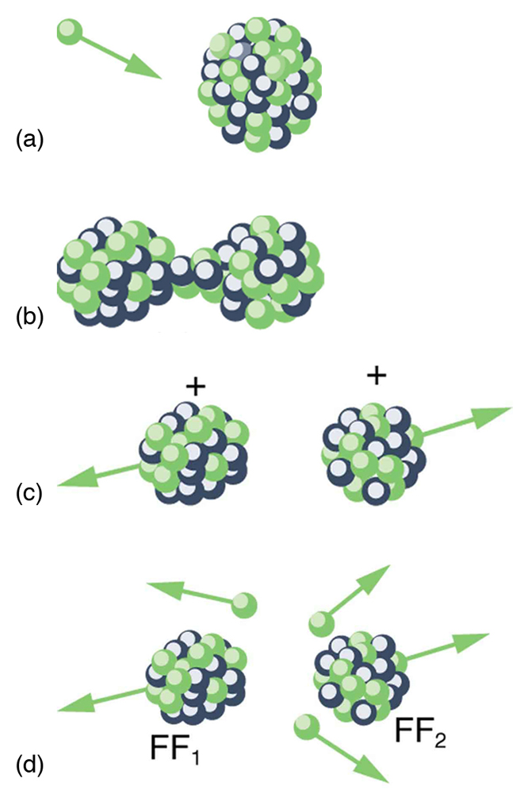
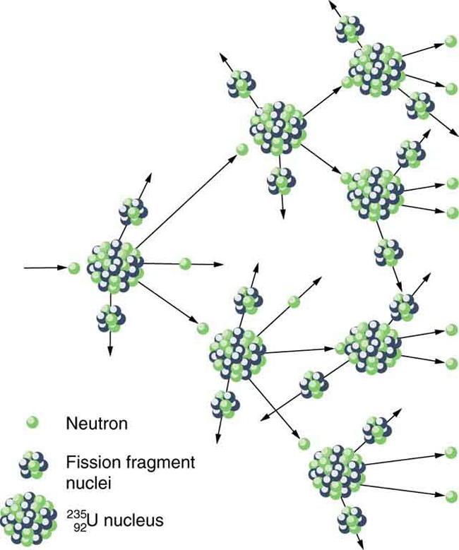

* Define nuclear fission.
* Discuss how fission fuel reacts and describe what it produces.
* Describe controlled and uncontrolled chain reactions.

**Nuclear fission**{: data-type="term" #import-auto-id2992737} is a reaction in which a nucleus is split (or *fissured*). Controlled fission is a reality, whereas controlled fusion is a hope for the future. Hundreds of nuclear fission power plants around the world attest to the fact that controlled fission is practical and, at least in the short term, economical, as seen in [\[link\]](#import-auto-id1575461). Whereas nuclear power was of little interest for decades following TMI and Chernobyl (and now Fukushima Daiichi), growing concerns over global warming has brought nuclear power back on the table as a viable energy alternative. By the end of 2009, there were 442 reactors operating in 30 countries, providing 15% of the world’s electricity. France provides over 75% of its electricity with nuclear power, while the US has 104 operating reactors providing 20% of its electricity. Australia and New Zealand have none. China is building nuclear power plants at the rate of one start every month.

"){: #import-auto-id1575461 data-media-type="image/jpg"}

Fission is the opposite of fusion and releases energy only when heavy nuclei are split. As noted in [Fusion](/m42659), energy is released if the products of a nuclear reaction have a greater binding energy per nucleon (<math xmlns="http://www.w3.org/1998/Math/MathML"><semantics><mrow><mrow><mrow><mtext>BE</mtext><mo stretchy="false">/</mo><mi>A</mi></mrow></mrow><mrow /></mrow><annotation encoding="StarMath 5.0"> size 12{"BE"/A} {}</annotation></semantics></math>

) than the parent nuclei. [\[link\]](#import-auto-id2932164) shows that <math xmlns="http://www.w3.org/1998/Math/MathML"><semantics><mrow><mrow><mrow><mtext>BE</mtext><mo stretchy="false">/</mo><mi>A</mi></mrow></mrow><mrow /></mrow><annotation encoding="StarMath 5.0"> size 12{"BE"/A} {}</annotation></semantics></math>

 is greater for medium-mass nuclei than heavy nuclei, implying that when a heavy nucleus is split, the products have less mass per nucleon, so that mass is destroyed and energy is released in the reaction. The amount of energy per fission reaction can be large, even by nuclear standards. The graph in [\[link\]](#import-auto-id2932164) shows <math xmlns="http://www.w3.org/1998/Math/MathML"><semantics><mrow><mrow><mrow><mtext>BE</mtext><mo stretchy="false">/</mo><mi>A</mi></mrow></mrow><mrow /></mrow><annotation encoding="StarMath 5.0"> size 12{"BE"/A} {}</annotation></semantics></math>

 to be about 7.6 MeV/nucleon for the heaviest nuclei (<math xmlns="http://www.w3.org/1998/Math/MathML"><semantics><mrow><mrow><mi>A</mi></mrow><mrow /></mrow><annotation encoding="StarMath 5.0"> size 12{A} {}</annotation></semantics></math>

 about 240), while <math xmlns="http://www.w3.org/1998/Math/MathML"><semantics><mrow><mrow><mrow><mtext>BE</mtext><mo stretchy="false">/</mo><mi>A</mi></mrow></mrow><mrow /></mrow><annotation encoding="StarMath 5.0"> size 12{"BE"/A} {}</annotation></semantics></math>

 is about 8.6 MeV/nucleon for nuclei having <math xmlns="http://www.w3.org/1998/Math/MathML"><semantics><mrow><mrow><mi>A</mi></mrow><mrow /></mrow><annotation encoding="StarMath 5.0"> size 12{A} {}</annotation></semantics></math>

 about 120. Thus, if a heavy nucleus splits in half, then about 1 MeV per nucleon, or approximately 240 MeV per fission, is released. This is about 10 times the energy per fusion reaction, and about 100 times the energy of the average <math xmlns="http://www.w3.org/1998/Math/MathML"><semantics><mrow><mrow><mi>α</mi></mrow><mrow /></mrow><annotation encoding="StarMath 5.0"> size 12{α} {}</annotation></semantics></math>

, <math xmlns="http://www.w3.org/1998/Math/MathML"><semantics><mrow><mrow><mi>β</mi></mrow><mrow /></mrow><annotation encoding="StarMath 5.0"> size 12{β} {}</annotation></semantics></math>

, or <math xmlns="http://www.w3.org/1998/Math/MathML"><semantics><mrow><mrow><mi>γ</mi></mrow><mrow /></mrow><annotation encoding="StarMath 5.0"> size 12{γ} {}</annotation></semantics></math>

 decay.

Calculating Energy Released by Fission

Calculate the energy released in the following spontaneous fission reaction:

<math xmlns="http://www.w3.org/1998/Math/MathML"> <semantics> <mrow> <mrow> <mrow> <msup> <mrow /> <mtext>238</mtext> </msup> <mtext>U</mtext> <mo stretchy="false">→</mo> <msup> <mrow /> <mtext>95</mtext> </msup> <mrow> <mtext>Sr</mtext> <mo stretchy="false">+</mo> <msup> <mrow /> <mtext>140</mtext> </msup> </mrow> <mrow> <mtext>Xe</mtext> <mo stretchy="false">+</mo> <mn>3</mn><mi>n</mi> </mrow> </mrow> </mrow> </mrow> </semantics> </math>

given the atomic masses to be <math xmlns="http://www.w3.org/1998/Math/MathML"><semantics><mrow><mrow><mrow><mi>m</mi><mo stretchy="false">(</mo><msup><mrow /><mtext>238</mtext></msup><mtext>U</mtext><mrow><mo stretchy="false">)</mo><mo stretchy="false">=</mo> </mrow> <mtext>238.050784 u</mtext> </mrow></mrow><mrow /></mrow></semantics></math>

, <math xmlns="http://www.w3.org/1998/Math/MathML"><semantics><mrow><mrow><mrow><mi>m</mi><mo stretchy="false">(</mo><msup><mrow /><mtext>95</mtext></msup><mtext>Sr</mtext><mrow><mo stretchy="false">)</mo><mo stretchy="false">=</mo></mrow> <mtext>94.919388 u</mtext></mrow></mrow><mrow /></mrow></semantics></math>

, <math xmlns="http://www.w3.org/1998/Math/MathML"><semantics><mrow><mrow><mrow><mi>m</mi><mo stretchy="false">(</mo><msup><mrow /><mtext>140</mtext></msup><mtext>Xe</mtext><mrow><mo stretchy="false">)</mo><mo stretchy="false">=</mo></mrow> <mtext>139.921610 u</mtext></mrow></mrow><mrow /></mrow></semantics></math>

, and <math xmlns="http://www.w3.org/1998/Math/MathML"><semantics><mrow><mrow><mrow><mi>m</mi><mo stretchy="false">(</mo><mi>n</mi><mrow><mo stretchy="false">)</mo><mo stretchy="false">=</mo></mrow><mn>1.008665 u</mn></mrow></mrow><mrow /></mrow></semantics></math>

.

**Strategy**

As always, the energy released is equal to the mass destroyed times <math xmlns="http://www.w3.org/1998/Math/MathML"> <semantics> <mrow> <mrow> <msup> <mi>c</mi> <mrow> <mn>2</mn> </mrow> </msup> </mrow> <mrow /> </mrow> <annotation encoding="StarMath 5.0"> size 12{c rSup { size 8{2} } } {}</annotation> </semantics> </math>

 , so we must find the difference in mass between the parent <math xmlns="http://www.w3.org/1998/Math/MathML"> <semantics> <mrow> <mrow> <mrow> <msup> <mrow /> <mrow> <mtext>238</mtext> </mrow> </msup> <mtext>U</mtext> </mrow> </mrow> <mrow /> </mrow> <annotation encoding="StarMath 5.0"> size 12{ {} rSup { size 8{"238"} } U} {}</annotation> </semantics> </math>

 and the fission products.

**Solution**

The products have a total mass of

<math xmlns="http://www.w3.org/1998/Math/MathML"><semantics><mrow><mrow><mtable columnalign="left"><mtr> <mtd><msub><mi>m</mi><mrow><mtext>products</mtext></mrow></msub></mtd> <mtd><mo stretchy="false">=</mo></mtd> <mtd><mtext>94.919388 u</mtext> <mo stretchy="false">+</mo> <mtext>139.921610 u</mtext><mo stretchy="false">+</mo> <mn>3</mn><mfenced open="(" close=")"> <mn>1.008665 u</mn></mfenced></mtd> </mtr> <mtr> <mtd /> <mtd><mo stretchy="false">=</mo></mtd> <mtd><mrow><mtext /> <mtext>237.866993 u.</mtext></mrow></mtd> </mtr></mtable><mrow /></mrow></mrow></semantics></math>

The mass lost is the mass of <math xmlns="http://www.w3.org/1998/Math/MathML"> <semantics> <mrow> <mrow> <mrow> <msup> <mrow /> <mrow> <mtext>238</mtext> </mrow> </msup> <mtext>U</mtext> </mrow> </mrow> <mrow /> </mrow> <annotation encoding="StarMath 5.0"> size 12{ {} rSup { size 8{"238"} } U} {}</annotation> </semantics> </math>

 minus <math xmlns="http://www.w3.org/1998/Math/MathML"><semantics><mrow><mrow><msub><mi>m</mi><mrow><mtext>products</mtext></mrow></msub></mrow><mrow /></mrow><annotation encoding="StarMath 5.0"> size 12{m rSub { size 8{"products"} } } {}</annotation></semantics></math>

, or

<math xmlns="http://www.w3.org/1998/Math/MathML"><semantics><mrow><mrow><mrow><mn>Δ</mn><mi fontstyle="italic">m</mi><mo stretchy="false">=</mo> <mtext>238.050784 u</mtext><mo stretchy="false">−</mo> <mtext>237.8669933 u</mtext><mo stretchy="false">=</mo> <mn>0.183791 u</mn></mrow></mrow><mo>,</mo><mrow /></mrow></semantics></math>

so the energy released is

<math xmlns="http://www.w3.org/1998/Math/MathML"> <semantics> <mrow> <mrow> <mtable columnalign="left"> <mtr> <mtd> <mi>E</mi> </mtd> <mtd> <mo stretchy="false">=</mo> </mtd> <mtd> <mfenced open="(" close=")"><mrow><mn>Δ</mn> <mi fontstyle="italic">m</mi></mrow> </mfenced> <msup> <mi>c</mi> <mrow> <mn>2</mn> </mrow> </msup> </mtd> </mtr> <mtr> <mtd /> <mtd><mo stretchy="false">=</mo></mtd> <mtd> <mrow> <mrow> <mfenced open="(" close=")"> <mrow> <mtext>0.183791 u</mtext> </mrow> </mfenced> </mrow> <mfrac> <mrow> <mtext>931.5 Me</mtext> <mtext>V/</mtext> <msup> <mi>c</mi> <mrow> <mn>2</mn> </mrow> </msup> </mrow> <mtext>u</mtext> </mfrac> <mrow> <msup> <mi>c</mi> <mrow> <mn>2</mn> </mrow> </msup> <mo stretchy="false">=</mo> <mtext>171.2 MeV.</mtext> </mrow> <mrow /> </mrow> </mtd> </mtr> </mtable> <mrow /> </mrow> </mrow> <annotation encoding="StarMath 5.0">alignl { stack { size 12{E= left (Δm right )c rSup { size 8{2} } } {} # " "= left (0 "." "183791"`u right ) { {"931" "." 5`"MeV/"c rSup { size 8{2} } } over {u} } c rSup { size 8{2} } ="171"`"MeV" "." {} } } {}</annotation> </semantics> </math>

**Discussion**

A number of important things arise in this example. The 171-MeV energy released is large, but a little less than the earlier estimated 240 MeV. This is because this fission reaction produces neutrons and does not split the nucleus into two equal parts. Fission of a given nuclide, such as <math xmlns="http://www.w3.org/1998/Math/MathML"> <semantics> <mrow> <mrow> <mrow> <msup> <mrow /> <mrow> <mtext>238</mtext> </mrow> </msup> <mtext>U</mtext> </mrow> </mrow> <mrow /> </mrow> <annotation encoding="StarMath 5.0"> size 12{ {} rSup { size 8{"238"} } U} {}</annotation> </semantics> </math>

 , does not always produce the same products. Fission is a statistical process in which an entire range of products are produced with various probabilities. Most fission produces neutrons, although the number varies with each fission. This is an extremely important aspect of fission, because *neutrons can induce more fission*, enabling self-sustaining chain reactions.

Spontaneous fission can occur, but this is usually not the most common decay mode for a given nuclide. For example, <math xmlns="http://www.w3.org/1998/Math/MathML"> <semantics> <mrow> <mrow> <mrow> <msup> <mrow /> <mrow> <mtext>238</mtext> </mrow> </msup> <mtext>U</mtext> </mrow> </mrow> <mrow /> </mrow> <annotation encoding="StarMath 5.0"> size 12{ {} rSup { size 8{"238"} } U} {}</annotation> </semantics> </math>

 can spontaneously fission, but it decays mostly by <math xmlns="http://www.w3.org/1998/Math/MathML"><semantics><mrow><mrow><mi>α</mi></mrow><mrow /></mrow><annotation encoding="StarMath 5.0"> size 12{α} {}</annotation></semantics></math>

 emission. Neutron-induced fission is crucial as seen in [\[link\]](#import-auto-id2932164). Being chargeless, even low-energy neutrons can strike a nucleus and be absorbed once they feel the attractive nuclear force. Large nuclei are described by a **liquid drop model**{: data-type="term" #import-auto-id1933994} with surface tension and oscillation modes, because the large number of nucleons act like atoms in a drop. The neutron is attracted and thus, deposits energy, causing the nucleus to deform as a liquid drop. If stretched enough, the nucleus narrows in the middle. The number of nucleons in contact and the strength of the nuclear force binding the nucleus together are reduced. Coulomb repulsion between the two ends then succeeds in fissioning the nucleus, which pops like a water drop into two large pieces and a few neutrons. **Neutron-induced fission**{: data-type="term" #import-auto-id2973361} can be written as

<math xmlns="http://www.w3.org/1998/Math/MathML"><semantics><mrow><mrow><mrow><mrow><mi>n</mi><mo stretchy="false">+</mo> <msup> <mspace width="0.25em" /> <mrow><mi>A</mi></mrow> </msup></mrow><mtext>X</mtext><mo stretchy="false">→</mo><mrow><mrow><msub><mtext>FF</mtext><mrow><mn>1</mn></mrow></msub><mo stretchy="false">+</mo><msub><mtext>FF</mtext><mrow><mn>2</mn></mrow></msub></mrow><mo stretchy="false">+</mo><mstyle fontstyle="italic"><mrow><mtext>xn</mtext></mrow></mstyle></mrow></mrow></mrow><mo>,</mo><mrow /></mrow><annotation encoding="StarMath 5.0"> size 12{n+"" lSup { size 8{A} } X rightarrow "FF" rSub { size 8{1} } +"FF" rSub { size 8{2} } + ital "xn"} {}</annotation></semantics></math>

where <math xmlns="http://www.w3.org/1998/Math/MathML"><semantics><mrow><mrow><msub><mtext>FF</mtext><mrow><mn>1</mn></mrow></msub></mrow><mrow /></mrow><annotation encoding="StarMath 5.0"> size 12{"FF" rSub { size 8{1} } } {}</annotation></semantics></math>

 and <math xmlns="http://www.w3.org/1998/Math/MathML"><semantics><mrow><mrow><msub><mtext>FF</mtext><mrow><mn>2</mn></mrow></msub></mrow><mrow /></mrow><annotation encoding="StarMath 5.0"> size 12{"FF" rSub { size 8{2} } } {}</annotation></semantics></math>

 are the two daughter nuclei, called **fission fragments**{: data-type="term" #import-auto-id2953251}, and <math xmlns="http://www.w3.org/1998/Math/MathML"><semantics><mrow><mrow><mi>x</mi></mrow><mrow /></mrow><annotation encoding="StarMath 5.0"> size 12{x} {}</annotation></semantics></math>

 is the number of neutrons produced. Most often, the masses of the fission fragments are not the same. Most of the released energy goes into the kinetic energy of the fission fragments, with the remainder going into the neutrons and excited states of the fragments. Since neutrons can induce fission, a self-sustaining chain reaction is possible, provided more than one neutron is produced on average — that is, if <math xmlns="http://www.w3.org/1998/Math/MathML"><semantics><mrow><mrow><mrow><mi>x</mi><mo stretchy="false">&gt;</mo><mn>1</mn></mrow></mrow><mrow /></mrow><annotation encoding="StarMath 5.0"> size 12{x&gt;1} {}</annotation></semantics></math>

 in <math xmlns="http://www.w3.org/1998/Math/MathML"><semantics><mrow><mrow><mrow><mrow><mi>n</mi><mo stretchy="false">+</mo><msup><mrow /><mi>A</mi></msup></mrow><mtext>X</mtext><mo stretchy="false">→</mo><mrow><mrow><msub><mtext>FF</mtext><mrow><mn>1</mn></mrow></msub><mo stretchy="false">+</mo><msub><mtext>FF</mtext><mrow><mn>2</mn></mrow></msub></mrow><mo stretchy="false">+</mo><mstyle fontstyle="italic"><mrow><mtext>xn</mtext></mrow></mstyle></mrow></mrow></mrow><mrow /></mrow></semantics></math>

. This can also be seen in [\[link\]](#import-auto-id3112861).

An example of a typical neutron-induced fission reaction is

<math xmlns="http://www.w3.org/1998/Math/MathML"><semantics><mrow><mrow><mrow><mrow><mi>n</mi><mo stretchy="false">+</mo><msubsup><mrow /><mtext>92</mtext><mtext>235</mtext></msubsup></mrow><mtext>U</mtext> <mo stretchy="false">→</mo> <msubsup><mrow /><mtext>56</mtext><mtext>142</mtext></msubsup><mrow><mtext>Ba</mtext> <mo stretchy="false">+</mo> <msubsup><mrow /><mtext>36</mtext><mtext>91</mtext></msubsup><mtext>Kr</mtext><mo stretchy="false">+</mo><mn>3</mn><mi fontstyle="italic">n.</mi></mrow></mrow></mrow></mrow></semantics></math>

Note that in this equation, the total charge remains the same (is conserved): <math xmlns="http://www.w3.org/1998/Math/MathML"> <semantics> <mrow> <mrow> <mrow> <mrow> <mtext>92</mtext> <mo stretchy="false">+</mo> <mn>0</mn> </mrow> <mo stretchy="false">=</mo> <mrow> <mtext>56</mtext> <mo stretchy="false">+</mo> <mtext>36</mtext> </mrow> </mrow> </mrow> <mrow /> </mrow> <annotation encoding="StarMath 5.0"> size 12{"92"+0="56"+"36"} {}</annotation> </semantics> </math>

 . Also, as far as whole numbers are concerned, the mass is constant: <math xmlns="http://www.w3.org/1998/Math/MathML"> <semantics> <mrow> <mrow> <mrow> <mrow> <mn>1</mn> <mo stretchy="false">+</mo> <mtext>235</mtext> </mrow> <mo stretchy="false">=</mo> <mrow> <mrow> <mtext>142</mtext> <mo stretchy="false">+</mo> <mtext>91</mtext> </mrow> <mo stretchy="false">+</mo> <mn>3</mn> </mrow> </mrow> </mrow> <mrow /> </mrow> <annotation encoding="StarMath 5.0"> size 12{1+"235"="142"+"91"+3} {}</annotation> </semantics> </math>

 . This is not true when we consider the masses out to 6 or 7 significant places, as in the previous example.

{: #import-auto-id2932164 data-media-type="image/jpg"}

 {: #import-auto-id3112861 data-media-type="image/jpg"}

Not every neutron produced by fission induces fission. Some neutrons escape the fissionable material, while others interact with a nucleus without making it fission. We can enhance the number of fissions produced by neutrons by having a large amount of fissionable material. The minimum amount necessary for self-sustained fission of a given nuclide is called its **critical mass**{: data-type="term" #import-auto-id1413046}. Some nuclides, such as <math xmlns="http://www.w3.org/1998/Math/MathML"> <semantics> <mrow> <mrow> <mrow> <msup> <mrow /> <mrow> <mtext>239</mtext> </mrow> </msup> <mstyle> <mrow> <mtext>Pu</mtext> </mrow> </mstyle> </mrow> </mrow> <mrow /> </mrow> <annotation encoding="StarMath 5.0"> size 12{ {} rSup { size 8{"239"} } ital "Pu"} {}</annotation> </semantics> </math>

 , produce more neutrons per fission than others, such as <math xmlns="http://www.w3.org/1998/Math/MathML"> <semantics> <mrow> <mrow> <mrow> <msup> <mrow /> <mrow> <mtext>235</mtext> </mrow> </msup> <mtext>U</mtext> </mrow> </mrow> <mrow /> </mrow> <annotation encoding="StarMath 5.0"> size 12{ {} rSup { size 8{"235"} } U} {}</annotation> </semantics> </math>

 . Additionally, some nuclides are easier to make fission than others. In particular, <math xmlns="http://www.w3.org/1998/Math/MathML"> <semantics> <mrow> <mrow> <mrow> <msup> <mrow /> <mrow> <mtext>235</mtext> </mrow> </msup> <mtext>U</mtext> </mrow> </mrow> <mrow /> </mrow> <annotation encoding="StarMath 5.0"> size 12{ {} rSup { size 8{"235"} } U} {}</annotation> </semantics> </math>

 and <math xmlns="http://www.w3.org/1998/Math/MathML"> <semantics> <mrow> <mrow> <mrow> <msup> <mrow /> <mrow> <mtext>239</mtext> </mrow> </msup> <mstyle> <mrow> <mtext>Pu</mtext> </mrow> </mstyle> </mrow> </mrow> <mrow /> </mrow> <annotation encoding="StarMath 5.0"> size 12{ {} rSup { size 8{"239"} } ital "Pu"} {}</annotation> </semantics> </math>

 are easier to fission than the much more abundant <math xmlns="http://www.w3.org/1998/Math/MathML"> <semantics> <mrow> <mrow> <mrow> <msup> <mrow /> <mrow> <mtext>238</mtext> </mrow> </msup> <mtext>U</mtext> </mrow> </mrow> <mrow /> </mrow> <annotation encoding="StarMath 5.0"> size 12{ {} rSup { size 8{"238"} } U} {}</annotation> </semantics> </math>

 . Both factors affect critical mass, which is smallest for <math xmlns="http://www.w3.org/1998/Math/MathML"> <semantics> <mrow> <mrow> <mrow> <msup> <mrow /> <mrow> <mtext>239</mtext> </mrow> </msup> <mstyle> <mrow> <mtext>Pu</mtext> </mrow> </mstyle> </mrow> </mrow> <mrow /> </mrow> <annotation encoding="StarMath 5.0"> size 12{ {} rSup { size 8{"239"} } ital "Pu"} {}</annotation> </semantics> </math>

 .

The reason <math xmlns="http://www.w3.org/1998/Math/MathML"> <semantics> <mrow> <mrow> <mrow> <msup> <mrow /> <mrow> <mtext>235</mtext> </mrow> </msup> <mtext>U</mtext> </mrow> </mrow> <mrow /> </mrow> <annotation encoding="StarMath 5.0"> size 12{ {} rSup { size 8{"235"} } U} {}</annotation> </semantics> </math>

 and <math xmlns="http://www.w3.org/1998/Math/MathML"> <semantics> <mrow> <mrow> <mrow> <msup> <mrow /> <mrow> <mtext>239</mtext> </mrow> </msup> <mstyle> <mrow> <mtext>Pu</mtext> </mrow> </mstyle> </mrow> </mrow> <mrow /> </mrow> <annotation encoding="StarMath 5.0"> size 12{ {} rSup { size 8{"239"} } ital "Pu"} {}</annotation> </semantics> </math>

 are easier to fission than <math xmlns="http://www.w3.org/1998/Math/MathML"> <semantics> <mrow> <mrow> <mrow> <msup> <mrow /> <mrow> <mtext>238</mtext> </mrow> </msup> <mtext>U</mtext> </mrow> </mrow> <mrow /> </mrow> <annotation encoding="StarMath 5.0"> size 12{ {} rSup { size 8{"238"} } U} {}</annotation> </semantics> </math>

 is that the nuclear force is more attractive for an even number of neutrons in a nucleus than for an odd number. Consider that <math xmlns="http://www.w3.org/1998/Math/MathML"> <semantics> <mrow> <mrow> <mrow> <msubsup> <mrow /> <mtext>92</mtext> <mrow> <mtext>235</mtext> </mrow> </msubsup> <msub> <mtext>U</mtext> <mrow> <mtext>143</mtext> </mrow> </msub> </mrow> </mrow> </mrow> <annotation encoding="StarMath 5.0"> size 12{"" lSub { size 8{"92"} } lSup { size 8{"235"} } U rSub { size 8{"143"} } } {}</annotation> </semantics> </math>

 has 143 neutrons, and <math xmlns="http://www.w3.org/1998/Math/MathML"> <semantics> <mrow> <mrow> <mrow> <msubsup> <mrow /> <mtext>94</mtext> <mtext>239</mtext> </msubsup> <msub> <mtext>P</mtext> <mrow> <mtext>145</mtext> </mrow> </msub> </mrow> </mrow> <mrow /> </mrow> <annotation encoding="StarMath 5.0"> size 12{"" lSub { size 8{"94"} } lSup { size 8{"239"} } P rSub { size 8{"145"} } } {}</annotation> </semantics> </math>

 has 145 neutrons, whereas <math xmlns="http://www.w3.org/1998/Math/MathML"> <semantics> <mrow> <mrow> <mrow> <msubsup> <mrow /> <mtext>92</mtext> <mtext>238</mtext> </msubsup> <msub> <mtext>U</mtext> <mrow> <mtext>146</mtext> </mrow> </msub> </mrow> </mrow> <mrow /> </mrow> <annotation encoding="StarMath 5.0"> size 12{"" lSub { size 8{"92"} } lSup { size 8{"238"} } U rSub { size 8{"146"} } } {}</annotation> </semantics> </math>

 has 146. When a neutron encounters a nucleus with an odd number of neutrons, the nuclear force is more attractive, because the additional neutron will make the number even. About 2-MeV more energy is deposited in the resulting nucleus than would be the case if the number of neutrons was already even. This extra energy produces greater deformation, making fission more likely. Thus, <math xmlns="http://www.w3.org/1998/Math/MathML"> <semantics> <mrow> <mrow> <mrow> <msup> <mrow /> <mrow> <mtext>235</mtext> </mrow> </msup> <mtext>U</mtext> </mrow> </mrow> <mrow /> </mrow> <annotation encoding="StarMath 5.0"> size 12{ {} rSup { size 8{"235"} } U} {}</annotation> </semantics> </math>

 and <math xmlns="http://www.w3.org/1998/Math/MathML"> <semantics> <mrow> <mrow> <mrow> <msup> <mrow /> <mrow> <mtext>239</mtext> </mrow> </msup> <mstyle> <mrow> <mtext>Pu</mtext> </mrow> </mstyle> </mrow> </mrow> <mrow /> </mrow> <annotation encoding="StarMath 5.0"> size 12{ {} rSup { size 8{"239"} } ital "Pu"} {}</annotation> </semantics> </math>

 are superior fission fuels. The isotope <math xmlns="http://www.w3.org/1998/Math/MathML"> <semantics> <mrow> <mrow> <mrow> <msup> <mrow /> <mrow> <mtext>235</mtext> </mrow> </msup> <mtext>U</mtext> </mrow> </mrow> <mrow /> </mrow> <annotation encoding="StarMath 5.0"> size 12{ {} rSup { size 8{"235"} } U} {}</annotation> </semantics> </math>

 is only 0.72 % of natural uranium, while <math xmlns="http://www.w3.org/1998/Math/MathML"> <semantics> <mrow> <mrow> <mrow> <msup> <mrow /> <mrow> <mtext>238</mtext> </mrow> </msup> <mtext>U</mtext> </mrow> </mrow> <mrow /> </mrow> <annotation encoding="StarMath 5.0"> size 12{ {} rSup { size 8{"238"} } U} {}</annotation> </semantics> </math>

 is 99.27%, and <math xmlns="http://www.w3.org/1998/Math/MathML"> <semantics> <mrow> <mrow> <mrow> <msup> <mrow /> <mrow> <mtext>239</mtext> </mrow> </msup> <mstyle> <mrow> <mtext>Pu</mtext> </mrow> </mstyle> </mrow> </mrow> <mrow /> </mrow> <annotation encoding="StarMath 5.0"> size 12{ {} rSup { size 8{"239"} } ital "Pu"} {}</annotation> </semantics> </math>

 does not exist in nature. Australia has the largest deposits of uranium in the world, standing at 28% of the total. This is followed by Kazakhstan and Canada. The US has only 3% of global reserves.

Most fission reactors utilize <math xmlns="http://www.w3.org/1998/Math/MathML"> <semantics> <mrow> <mrow> <mrow> <msup> <mrow /> <mrow> <mtext>235</mtext> </mrow> </msup> <mtext>U</mtext> </mrow> </mrow> <mrow /> </mrow> <annotation encoding="StarMath 5.0"> size 12{ {} rSup { size 8{"235"} } U} {}</annotation> </semantics> </math>

 , which is separated from <math xmlns="http://www.w3.org/1998/Math/MathML"> <semantics> <mrow> <mrow> <mrow> <msup> <mrow /> <mrow> <mtext>238</mtext> </mrow> </msup> <mtext>U</mtext> </mrow> </mrow> <mrow /> </mrow> <annotation encoding="StarMath 5.0"> size 12{ {} rSup { size 8{"238"} } U} {}</annotation> </semantics> </math>

 at some expense. This is called enrichment. The most common separation method is gaseous diffusion of uranium hexafluoride (<math xmlns="http://www.w3.org/1998/Math/MathML"><semantics><mrow><mrow><msub><mtext>UF</mtext><mrow><mn>6</mn></mrow></msub></mrow><mrow /></mrow><annotation encoding="StarMath 5.0"> size 12{"UF" rSub { size 8{6} } } {}</annotation></semantics></math>

) through membranes. Since <math xmlns="http://www.w3.org/1998/Math/MathML"> <semantics> <mrow> <mrow> <mrow> <msup> <mrow /> <mrow> <mtext>235</mtext> </mrow> </msup> <mtext>U</mtext> </mrow> </mrow> <mrow /> </mrow> <annotation encoding="StarMath 5.0"> size 12{ {} rSup { size 8{"235"} } U} {}</annotation> </semantics> </math>

 has less mass than <math xmlns="http://www.w3.org/1998/Math/MathML"> <semantics> <mrow> <mrow> <mrow> <msup> <mrow /> <mrow> <mtext>238</mtext> </mrow> </msup> <mtext>U</mtext> </mrow> </mrow> <mrow /> </mrow> <annotation encoding="StarMath 5.0"> size 12{ {} rSup { size 8{"238"} } U} {}</annotation> </semantics> </math>

 , its <math xmlns="http://www.w3.org/1998/Math/MathML"><semantics><mrow><mrow><msub><mtext>UF</mtext><mrow><mn>6</mn></mrow></msub></mrow><mrow /></mrow><annotation encoding="StarMath 5.0"> size 12{"UF" rSub { size 8{6} } } {}</annotation></semantics></math>

 molecules have higher average velocity at the same temperature and diffuse faster. Another interesting characteristic of <math xmlns="http://www.w3.org/1998/Math/MathML"> <semantics> <mrow> <mrow> <mrow> <msup> <mrow /> <mrow> <mtext>235</mtext> </mrow> </msup> <mtext>U</mtext> </mrow> </mrow> <mrow /> </mrow> <annotation encoding="StarMath 5.0"> size 12{ {} rSup { size 8{"235"} } U} {}</annotation> </semantics> </math>

 is that it preferentially absorbs very slow moving neutrons (with energies a fraction of an eV), whereas fission reactions produce fast neutrons with energies in the order of an MeV. To make a self-sustained fission reactor with <math xmlns="http://www.w3.org/1998/Math/MathML"> <semantics> <mrow> <mrow> <mrow> <msup> <mrow /> <mrow> <mtext>235</mtext> </mrow> </msup> <mtext>U</mtext> </mrow> </mrow> <mrow /> </mrow> <annotation encoding="StarMath 5.0"> size 12{ {} rSup { size 8{"235"} } U} {}</annotation> </semantics> </math>

 , it is thus necessary to slow down (“thermalize”) the neutrons. Water is very effective, since neutrons collide with protons in water molecules and lose energy. [\[link\]](#import-auto-id2407718) shows a schematic of a reactor design, called the pressurized water reactor.

 ![The figure shows a close-shielded vessel containing fuel rod and control rods along with a moderator in one chamber from which heat is taken out to the other chamber to change water to steam. Next, the steam is taken out from the vessel to run a turbine, and then it is condensed and sent back to the closed vessel.](../resources/Figure_33_06_04a.jpg "A pressurized water reactor is cleverly designed to control the fission of large amounts of &#10;        &#10;          &#10;            &#10;              &#10;                &#10;                  &#10;                    &#10;                    &#10;                      &#10;                        235&#10;                      &#10;                    &#10;                  &#10;                  U&#10;                &#10;              &#10;            &#10;            &#10;          &#10;           size 12{ {} rSup { size 8{&quot;235&quot;} } U} {}&#10;        &#10;       &#10;    , while using the heat produced in the fission reaction to create steam for generating electrical energy. Control rods adjust neutron flux so that criticality is obtained, but not exceeded. In case the reactor overheats and boils the water away, the chain reaction terminates, because water is needed to thermalize the neutrons. This inherent safety feature can be overwhelmed in extreme circumstances.&#10;      "){: #import-auto-id2407718 data-media-type="image/jpg"}

Control rods containing nuclides that very strongly absorb neutrons are used to adjust neutron flux. To produce large power, reactors contain hundreds to thousands of critical masses, and the chain reaction easily becomes self-sustaining, a condition called **criticality**{: data-type="term" #import-auto-id3378898}. Neutron flux should be carefully regulated to avoid an exponential increase in fissions, a condition called **supercriticality**{: data-type="term" #import-auto-id3177206}. Control rods help prevent overheating, perhaps even a meltdown or explosive disassembly. The water that is used to thermalize neutrons, necessary to get them to induce fission in <math xmlns="http://www.w3.org/1998/Math/MathML"> <semantics> <mrow> <mrow> <mrow> <msup> <mrow /> <mrow> <mtext>235</mtext> </mrow> </msup> <mtext>U</mtext> </mrow> </mrow> <mrow /> </mrow> <annotation encoding="StarMath 5.0"> size 12{ {} rSup { size 8{"235"} } U} {}</annotation> </semantics> </math>

 , and achieve criticality, provides a negative feedback for temperature increases. In case the reactor overheats and boils the water to steam or is breached, the absence of water kills the chain reaction. Considerable heat, however, can still be generated by the reactor’s radioactive fission products. Other safety features, thus, need to be incorporated in the event of a *loss of coolant* accident, including auxiliary cooling water and pumps.

Calculating Energy from a Kilogram of Fissionable Fuel

Calculate the amount of energy produced by the fission of 1.00 kg of <math xmlns="http://www.w3.org/1998/Math/MathML"> <semantics> <mrow> <mrow> <mrow> <msup> <mrow /> <mrow> <mtext>235</mtext> </mrow> </msup> <mtext>U</mtext> </mrow> </mrow> <mrow /> </mrow> <annotation encoding="StarMath 5.0"> size 12{ {} rSup { size 8{"235"} } U} {}</annotation> </semantics> </math>

 , given the average fission reaction of <math xmlns="http://www.w3.org/1998/Math/MathML"> <semantics> <mrow> <mrow> <mrow> <msup> <mrow /> <mrow> <mtext>235</mtext> </mrow> </msup> <mtext>U</mtext> </mrow> </mrow> <mrow /> </mrow> <annotation encoding="StarMath 5.0"> size 12{ {} rSup { size 8{"235"} } U} {}</annotation> </semantics> </math>

 produces 200 MeV.

**Strategy**

The total energy produced is the number of <math xmlns="http://www.w3.org/1998/Math/MathML"> <semantics> <mrow> <mrow> <mrow> <msup> <mrow /> <mrow> <mtext>235</mtext> </mrow> </msup> <mtext>U</mtext> </mrow> </mrow> <mrow /> </mrow> <annotation encoding="StarMath 5.0"> size 12{ {} rSup { size 8{"235"} } U} {}</annotation> </semantics> </math>

 atoms times the given energy per <math xmlns="http://www.w3.org/1998/Math/MathML"> <semantics> <mrow> <mrow> <mrow> <msup> <mrow /> <mrow> <mtext>235</mtext> </mrow> </msup> <mtext>U</mtext> </mrow> </mrow> <mrow /> </mrow> <annotation encoding="StarMath 5.0"> size 12{ {} rSup { size 8{"235"} } U} {}</annotation> </semantics> </math>

 fission. We should therefore find the number of <math xmlns="http://www.w3.org/1998/Math/MathML"> <semantics> <mrow> <mrow> <mrow> <msup> <mrow /> <mrow> <mtext>235</mtext> </mrow> </msup> <mtext>U</mtext> </mrow> </mrow> <mrow /> </mrow> <annotation encoding="StarMath 5.0"> size 12{ {} rSup { size 8{"235"} } U} {}</annotation> </semantics> </math>

 atoms in 1.00 kg.

**Solution**

The number of <math xmlns="http://www.w3.org/1998/Math/MathML"> <semantics> <mrow> <mrow> <mrow> <msup> <mrow /> <mrow> <mtext>235</mtext> </mrow> </msup> <mtext>U</mtext> </mrow> </mrow> <mrow /> </mrow> </semantics> </math>

 atoms in 1.00 kg is Avogadro’s number times the number of moles. One mole of <math xmlns="http://www.w3.org/1998/Math/MathML"> <semantics> <mrow> <mrow> <mrow> <msup> <mrow /> <mrow> <mtext>235</mtext> </mrow> </msup> <mtext>U</mtext> </mrow> </mrow> <mrow /> </mrow> </semantics> </math>

 has a mass of 235.04 g; thus, there are <math xmlns="http://www.w3.org/1998/Math/MathML"><semantics><mrow><mrow><mrow><mo stretchy="false">(</mo><mtext>1000 g</mtext><mrow><mo stretchy="false">)</mo><mo stretchy="false">/</mo><mo stretchy="false">(</mo></mrow><mtext>235.04 g/mol</mtext><mo stretchy="false">)</mo><mo stretchy="false">=</mo><mn>4.25 mol</mn></mrow></mrow><mrow /></mrow></semantics></math>

. The number of <math xmlns="http://www.w3.org/1998/Math/MathML"> <semantics> <mrow> <mrow> <mrow> <msup> <mrow /> <mrow> <mtext>235</mtext> </mrow> </msup> <mtext>U</mtext> </mrow> </mrow> <mrow /> </mrow> <annotation encoding="StarMath 5.0"> size 12{ {} rSup { size 8{"235"} } U} {}</annotation> </semantics> </math>

 atoms is therefore,

<math xmlns="http://www.w3.org/1998/Math/MathML"><semantics><mrow><mrow><mrow><mfenced open="(" close=")"><mrow><mn>4.25 mol</mn></mrow></mfenced><mrow><mfenced open="(" close=")"> <mrow><mn>6.02</mn><mo stretchy="false">×</mo><msup><mtext>10</mtext><mtext>23</mtext></msup><mspace width="0.25em" /><msup><mrow /><mtext>235</mtext></msup><mtext>U/mol</mtext></mrow></mfenced><mo stretchy="false">=</mo><mn>2</mn></mrow><mtext>.</mtext><mrow><mtext>56</mtext><mo stretchy="false">×</mo><msup><mtext>10</mtext><mrow><mtext>24</mtext></mrow></msup></mrow><mspace width="0.25em" /><msup><mrow /><mtext>235</mtext></msup><mtext>U</mtext></mrow></mrow><mrow /><mo>.</mo></mrow><annotation encoding="StarMath 5.0"> size 12{ left (4 "." "25"`"mol" right ) left (6 "." "02" times "10" rSup { size 8{"23"} } `"" lSup { size 8{"235"} } "U/mol" right )=2 "." "56" times "10" rSup { size 8{"24"} } `"" lSup { size 8{"235"} } U} {}</annotation></semantics></math>

So the total energy released is

<math xmlns="http://www.w3.org/1998/Math/MathML"> <semantics> <mrow> <mrow> <mtable columnalign="left"> <mtr> <mtd> <mi>E</mi> </mtd> <mtd> <mo stretchy="false">=</mo> </mtd> <mtd> <mfenced open="(" close=")"> <mrow> <mn>2</mn> <mtext>.</mtext> <mrow> <mtext>56</mtext> <mo stretchy="false">×</mo> <msup> <mtext>10</mtext> <mrow> <mtext>24</mtext> </mrow> </msup> </mrow> <mspace width="0.25em" /> <msup> <mrow /> <mtext>235</mtext> </msup> <mtext>U</mtext> </mrow> </mfenced> <mfenced open="(" close=")"> <mfrac> <mrow> <mtext>200 MeV</mtext> </mrow> <mrow> <msup> <mrow /> <mtext>235</mtext> </msup> <mtext>U</mtext> </mrow> </mfrac> </mfenced> <mfenced open="(" close=")"> <mfrac> <mrow> <mn>1.60</mn> <mrow> <mo stretchy="false">×</mo> <msup> <mtext>10</mtext> <mrow> <mrow> <mo stretchy="false">−</mo> <mtext>13</mtext> </mrow> </mrow> </msup> </mrow> <mspace width="0.25em" /> <mtext>J</mtext> </mrow> <mtext>MeV</mtext> </mfrac> </mfenced> </mtd> </mtr> <mtr> <mtd /> <mtd><mo stretchy="false">=</mo></mtd> <mtd> <mrow> <mrow> <mtext /> <mtext> 8.21</mtext> <mo stretchy="false">×</mo> <msup> <mtext>10</mtext> <mrow> <mtext>13</mtext> </mrow> </msup> </mrow> <mspace width="0.25em" /> <mtext>J</mtext> <mtext>.</mtext> <mrow /> </mrow> </mtd> </mtr> </mtable> <mrow /> </mrow> </mrow> <annotation encoding="StarMath 5.0">alignl { stack { size 12{E= left (2 "." "56" times "10" rSup { size 8{"24"} } `"" lSup { size 8{"235"} } U right ) left ( { {"200"`"MeV"} over {"" lSup { size 8{"235"} } U} } right ) left ( { {1 "." "60" times "10" rSup { size 8{ - "13"} } `J} over {"MeV"} } right )} {} # " "=" 8" "." "20" times "10" rSup { size 8{"13"} } `J "." {} } } {}</annotation> </semantics> </math>

**Discussion**

This is another impressively large amount of energy, equivalent to about 14,000 barrels of crude oil or 600,000 gallons of gasoline. But, it is only one-fourth the energy produced by the fusion of a kilogram mixture of deuterium and tritium as seen in [\[link\]](/m42659#fs-id1395304). Even though each fission reaction yields about ten times the energy of a fusion reaction, the energy per kilogram of fission fuel is less, because there are far fewer moles per kilogram of the heavy nuclides. Fission fuel is also much more scarce than fusion fuel, and less than 1% of uranium <math xmlns="http://www.w3.org/1998/Math/MathML"> <semantics> <mrow> <mrow> <mrow><mtext>(the</mtext><mspace width="0.25em" /> <msup> <mrow /> <mrow> <mtext>235</mtext> </mrow> </msup> <mtext>U</mtext> </mrow><mtext>)</mtext> </mrow> <mrow /> </mrow> <annotation encoding="StarMath 5.0"> size 12{ {} rSup { size 8{"235"} } U} {}</annotation> </semantics> </math>

 is readily usable.

One nuclide already mentioned is <math xmlns="http://www.w3.org/1998/Math/MathML"> <semantics> <mrow> <mrow> <mrow> <msup> <mrow /> <mrow> <mtext>239</mtext> </mrow> </msup> <mstyle> <mrow> <mtext>Pu</mtext> </mrow> </mstyle> </mrow> </mrow> <mrow /> </mrow> <annotation encoding="StarMath 5.0"> size 12{ {} rSup { size 8{"239"} } ital "Pu"} {}</annotation> </semantics> </math>

 , which has a 24,120-y half-life and does not exist in nature. Plutonium-239 is manufactured from <math xmlns="http://www.w3.org/1998/Math/MathML"> <semantics> <mrow> <mrow> <mrow> <msup> <mrow /> <mrow> <mtext>238</mtext> </mrow> </msup> <mtext>U</mtext> </mrow> </mrow> <mrow /> </mrow> <annotation encoding="StarMath 5.0"> size 12{ {} rSup { size 8{"238"} } U} {}</annotation> </semantics> </math>

 in reactors, and it provides an opportunity to utilize the other 99% of natural uranium as an energy source. The following reaction sequence, called **breeding**{: data-type="term" #import-auto-id3151319}, produces <math xmlns="http://www.w3.org/1998/Math/MathML"> <semantics> <mrow> <mrow> <mrow> <msup> <mrow /> <mrow> <mtext>239</mtext> </mrow> </msup> <mstyle> <mrow> <mtext>Pu</mtext> </mrow> </mstyle> </mrow> </mrow> <mrow /> </mrow> <annotation encoding="StarMath 5.0"> size 12{ {} rSup { size 8{"239"} } ital "Pu"} {}</annotation> </semantics> </math>

 . Breeding begins with neutron capture by <math xmlns="http://www.w3.org/1998/Math/MathML"> <semantics> <mrow> <mrow> <mrow> <msup> <mrow /> <mrow> <mtext>238</mtext> </mrow> </msup> <mtext>U</mtext> </mrow> </mrow> <mrow /> </mrow> <annotation encoding="StarMath 5.0"> size 12{ {} rSup { size 8{"238"} } U} {}</annotation> </semantics> </math>

\:

<math xmlns="http://www.w3.org/1998/Math/MathML"><semantics><mrow><mrow><mrow><msup><mrow /><mtext>238</mtext></msup><mrow><mtext>U</mtext><mo stretchy="false">+</mo><mi>n</mi></mrow><mo stretchy="false">→</mo><msup><mrow /><mtext>239</mtext></msup><mrow><mtext>U</mtext><mo stretchy="false">+</mo><mi>γ</mi></mrow></mrow></mrow><mrow /><mo>.</mo></mrow></semantics></math>

Uranium-239 then <math xmlns="http://www.w3.org/1998/Math/MathML"><semantics><mrow><msup><mi>β</mi><mo>–</mo></msup></mrow></semantics></math>

 decays:

<math xmlns="http://www.w3.org/1998/Math/MathML"><semantics><mrow><mrow><mrow><msup><mrow /><mtext>239</mtext></msup><mtext>U</mtext><mo stretchy="false">→</mo><msup><mrow /><mtext>239</mtext></msup><mrow><mrow><mtext>Np</mtext><mo stretchy="false">+</mo><msup><mi>β</mi><mrow><mrow><mo stretchy="false">−</mo><mrow /></mrow></mrow></msup></mrow><mo stretchy="false">+</mo><msub><mi>v</mi><mrow><mi>e</mi></mrow></msub></mrow></mrow></mrow><mtext> (</mtext><mrow /></mrow></semantics><semantics><mrow><mrow><mrow><mrow><msub><mtext>t</mtext><mrow><mtext>1/2</mtext></mrow></msub><mo stretchy="false">=</mo><mtext>23</mtext></mrow><mspace width="0.25em" /><mtext>min)</mtext></mrow><mo>.</mo></mrow><mrow /></mrow></semantics></math>

Neptunium-239 also <math xmlns="http://www.w3.org/1998/Math/MathML"><semantics><mrow><msup><mi>β</mi><mo>–</mo></msup></mrow></semantics></math>

 decays:

<math xmlns="http://www.w3.org/1998/Math/MathML"><semantics><mrow><mrow><mrow><msup><mrow /><mtext>239</mtext></msup><mtext>Np</mtext><mo stretchy="false">→</mo><msup><mrow /><mtext>239</mtext></msup><mrow><mrow><mtext>Pu</mtext><mo stretchy="false">+</mo><msup><mi>β</mi><mrow><mrow><mo stretchy="false">−</mo><mrow /></mrow></mrow></msup></mrow><mo stretchy="false">+</mo><msub><mi>v</mi><mrow><mi>e</mi></mrow></msub></mrow></mrow><mtext> (</mtext></mrow><mrow /></mrow></semantics><semantics><mrow><mrow><mrow><mrow><msub><mtext>t</mtext><mrow><mtext>1/2</mtext></mrow></msub><mo stretchy="false">=</mo><mn>2</mn></mrow><mtext>.</mtext><mn>4</mn><mspace width="0.25em" /><mtext>d</mtext></mrow><mtext>).</mtext></mrow><mrow /></mrow></semantics></math>

Plutonium-239 builds up in reactor fuel at a rate that depends on the probability of neutron capture by <math xmlns="http://www.w3.org/1998/Math/MathML"> <semantics> <mrow> <mrow> <mrow> <msup> <mrow /> <mrow> <mtext>238</mtext> </mrow> </msup> <mtext>U</mtext> </mrow> </mrow> <mrow /> </mrow> <annotation encoding="StarMath 5.0"> size 12{ {} rSup { size 8{"238"} } U} {}</annotation> </semantics> </math>

 (all reactor fuel contains more <math xmlns="http://www.w3.org/1998/Math/MathML"> <semantics> <mrow> <mrow> <mrow> <msup> <mrow /> <mrow> <mtext>238</mtext> </mrow> </msup> <mtext>U</mtext> </mrow> </mrow> <mrow /> </mrow> <annotation encoding="StarMath 5.0"> size 12{ {} rSup { size 8{"238"} } U} {}</annotation> </semantics> </math>

 than <math xmlns="http://www.w3.org/1998/Math/MathML"> <semantics> <mrow> <mrow> <mrow> <msup> <mrow /> <mrow> <mtext>235</mtext> </mrow> </msup> <mtext>U</mtext> </mrow> </mrow> <mrow /> </mrow> <annotation encoding="StarMath 5.0"> size 12{ {} rSup { size 8{"235"} } U} {}</annotation> </semantics> </math>

 ). Reactors designed specifically to make plutonium are called **breeder reactors**{: data-type="term" #import-auto-id3348891}. They seem to be inherently more hazardous than conventional reactors, but it remains unknown whether their hazards can be made economically acceptable. The four reactors at Chernobyl, including the one that was destroyed, were built to breed plutonium and produce electricity. These reactors had a design that was significantly different from the pressurized water reactor illustrated above.

Plutonium-239 has advantages over <math xmlns="http://www.w3.org/1998/Math/MathML"> <semantics> <mrow> <mrow> <mrow> <msup> <mrow /> <mrow> <mtext>235</mtext> </mrow> </msup> <mtext>U</mtext> </mrow> </mrow> <mrow /> </mrow> <annotation encoding="StarMath 5.0"> size 12{ {} rSup { size 8{"235"} } U} {}</annotation> </semantics> </math>

 as a reactor fuel — it produces more neutrons per fission on average, and it is easier for a thermal neutron to cause it to fission. It is also chemically different from uranium, so it is inherently easier to separate from uranium ore. This means <math xmlns="http://www.w3.org/1998/Math/MathML"> <semantics> <mrow> <mrow> <mrow> <msup> <mrow /> <mrow> <mtext>239</mtext> </mrow> </msup> <mstyle> <mrow> <mtext>Pu</mtext> </mrow> </mstyle> </mrow> </mrow> <mrow /> </mrow> <annotation encoding="StarMath 5.0"> size 12{ {} rSup { size 8{"239"} } ital "Pu"} {}</annotation> </semantics> </math>

 has a particularly small critical mass, an advantage for nuclear weapons.

PhET Explorations: Nuclear Fission

Start a chain reaction, or introduce non-radioactive isotopes to prevent one. Control energy production in a nuclear reactor!

<figure markdown="1" id="eip-id3031673">
<figcaption>
[Nuclear Fission](nuclear-fission_en.jar)
</figcaption>
 {: data-type="image"}  
</figure>

# Section Summary

* {: #import-auto-id3385751} Nuclear fission is a reaction in which a nucleus is split.
* {: #import-auto-id3092820} Fission releases energy when heavy nuclei are split into medium-mass nuclei.
* {: #import-auto-id1987829} Self-sustained fission is possible, because neutron-induced fission also produces neutrons that can induce other fissions,
  <math xmlns="http://www.w3.org/1998/Math/MathML"><semantics><mrow><mrow><mrow><mrow><mi>n</mi><mo>+</mo><msup><mrow /><mi>A</mi></msup></mrow><mi>X</mi><mo stretchy="false">→</mo><mrow><mrow><msub><mtext>FF</mtext><mrow><mn>1</mn></mrow></msub><mo stretchy="false">+</mo><msub><mtext>FF</mtext><mrow><mn>2</mn></mrow></msub></mrow><mo stretchy="false">+</mo><mstyle fontstyle="italic"><mrow><mtext>xn</mtext></mrow></mstyle></mrow></mrow></mrow><mrow /></mrow></semantics></math>
  
  , where
  <math xmlns="http://www.w3.org/1998/Math/MathML"><semantics><mrow><mrow><msub><mtext>FF</mtext><mrow><mn>1</mn></mrow></msub></mrow><mrow /></mrow><annotation encoding="StarMath 5.0"> size 12{"FF" rSub { size 8{1} } } {}</annotation></semantics></math>
  
  and
  <math xmlns="http://www.w3.org/1998/Math/MathML"><semantics><mrow><mrow><msub><mtext>FF</mtext><mrow><mn>2</mn></mrow></msub></mrow><mrow /></mrow><annotation encoding="StarMath 5.0"> size 12{"FF" rSub { size 8{2} } } {}</annotation></semantics></math>
  
  are the two daughter nuclei, or fission fragments, and *x* is the number of neutrons produced.
* {: #import-auto-id2384260} A minimum mass, called the critical mass, should be present to achieve criticality.
* {: #import-auto-id1486815} More than a critical mass can produce supercriticality.
* {: #import-auto-id2408955} The production of new or different isotopes (especially
  <math xmlns="http://www.w3.org/1998/Math/MathML"> <semantics> <mrow> <mrow> <mrow> <msup> <mrow /> <mrow> <mtext>239</mtext> </mrow> </msup> <mrow> <mtext>Pu</mtext> </mrow> </mrow> </mrow> <mrow /> </mrow> </semantics> </math>
  
  ) by nuclear transformation is called breeding, and reactors designed for this purpose are called breeder reactors.

# Conceptual Questions

Explain why the fission of heavy nuclei releases energy. Similarly, why is it that energy input is required to fission light nuclei?

Explain, in terms of conservation of momentum and energy, why collisions of neutrons with protons will thermalize neutrons better than collisions with oxygen.

The ruins of the Chernobyl reactor are enclosed in a huge concrete structure built around it after the accident. Some rain penetrates the building in winter, and radioactivity from the building increases. What does this imply is happening inside?

Since the uranium or plutonium nucleus fissions into several fission fragments whose mass distribution covers a wide range of pieces, would you expect more residual radioactivity from fission than fusion? Explain.

The core of a nuclear reactor generates a large amount of thermal energy from the decay of fission products, even when the power-producing fission chain reaction is turned off. Would this residual heat be greatest after the reactor has run for a long time or short time? What if the reactor has been shut down for months?

How can a nuclear reactor contain many critical masses and not go supercritical? What methods are used to control the fission in the reactor?

Why can heavy nuclei with odd numbers of neutrons be induced to fission with thermal neutrons, whereas those with even numbers of neutrons require more energy input to induce fission?

Why is a conventional fission nuclear reactor not able to explode as a bomb?

# Problem Exercises

(a) Calculate the energy released in the neutron-induced fission (similar to the spontaneous fission in [[link]](#fs-id3012379))

<math xmlns="http://www.w3.org/1998/Math/MathML" display="block"><semantics><mrow><mrow><mrow><mrow><mi>n</mi><mo stretchy="false">+</mo><msup><mrow /><mtext>238</mtext></msup> </mrow><mtext>U</mtext><mo stretchy="false">→</mo> <msup><mrow /><mtext>96</mtext></msup> <mrow><mtext>Sr </mtext><mo stretchy="false">+</mo> <msup><mrow /><mtext>140</mtext></msup> <mtext>Xe</mtext><mo stretchy="false">+</mo><mn>3</mn><mi fontstyle="italic">n,</mi></mrow></mrow></mrow><mrow /></mrow> </semantics></math>

given <math xmlns="http://www.w3.org/1998/Math/MathML"><semantics><mrow><mi>m</mi><mo stretchy="false">(</mo><msup><mrow /><mtext>96</mtext></msup> <mtext>Sr</mtext><mo stretchy="false">)</mo> <mo stretchy="false">=</mo> <mtext>95.921750 u</mtext></mrow></semantics></math>

 and <math xmlns="http://www.w3.org/1998/Math/MathML"><semantics><mrow><mi>m</mi><mo stretchy="false">(</mo><msup><mrow /><mtext>140</mtext></msup> <mtext>Xe</mtext><mo stretchy="false">)</mo> <mo stretchy="false">=</mo> <mtext>139.92164</mtext></mrow></semantics></math>

. (b) This result is about 6 MeV greater than the result for spontaneous fission. Why? (c) Confirm that the total number of nucleons and total charge are conserved in this reaction.

(a) 177.1 MeV

(b) Because the gain of an external neutron yields about 6 MeV, which is the average <math xmlns="http://www.w3.org/1998/Math/MathML"><semantics><mrow><mn>BE/</mn><mi>A</mi></mrow></semantics></math>

 for heavy nuclei.

(c) <math xmlns="http://www.w3.org/1998/Math/MathML"><semantics><mrow><mrow><mrow><mrow><mrow><mi>A</mi><mo stretchy="false">=</mo><mrow><mn>1</mn><mo stretchy="false">+</mo><mtext>238</mtext></mrow></mrow><mo stretchy="false">=</mo><mrow><mrow><mrow><mrow><mtext>96</mtext><mo stretchy="false">+</mo><mtext>140</mtext></mrow><mo stretchy="false">+</mo><mn>1</mn></mrow><mo stretchy="false">+</mo><mn>1</mn></mrow><mo stretchy="false">+</mo><mn>1,</mn></mrow></mrow><mspace width="0.25em" /><mrow><mrow><mi>Z</mi><mo stretchy="false">=</mo><mtext>92</mtext></mrow><mo stretchy="false">=</mo><mrow><mtext>38</mtext><mo stretchy="false">+</mo><mtext>53</mtext></mrow></mrow><mi>,</mi><mspace width="0.25em" /><mrow><mrow><mtext>efn</mtext><mo stretchy="false">=</mo><mn>0</mn></mrow><mo stretchy="false">=</mo><mn>0</mn></mrow></mrow></mrow><mrow /></mrow><annotation encoding="StarMath 5.0"> size 12{A=1+"238"="96"+"140"+1+1+1,`Z="92"="38"+"53",`"efn"=0=0} {}</annotation></semantics></math>

(a) Calculate the energy released in the neutron-induced fission reaction

<math xmlns="http://www.w3.org/1998/Math/MathML" display="block"><semantics><mrow><mrow><mrow><mrow><mi>n</mi><mo>+</mo><msup><mrow /><mtext>235</mtext></msup></mrow> <mtext>U</mtext><mo stretchy="false">→</mo> <msup><mrow /><mtext>92</mtext></msup> <mrow><mtext>Kr</mtext><mo stretchy="false">+</mo> <msup><mrow /><mtext>142</mtext></msup> <mtext>Ba</mtext><mo stretchy="false">+</mo><mn>2</mn><mi fontstyle="italic">n,</mi></mrow></mrow></mrow><mrow /></mrow></semantics></math>

given <math xmlns="http://www.w3.org/1998/Math/MathML"><semantics><mrow><mrow><mrow><mi>m</mi><mo stretchy="false">(</mo><msup><mrow /><mtext>92</mtext></msup><mtext>Kr</mtext><mrow><mo stretchy="false">)</mo><mo stretchy="false">=</mo><mtext>91</mtext></mrow><mtext>.</mtext><mtext>926269 u</mtext></mrow></mrow><mrow /></mrow></semantics></math>

 and <math xmlns="http://www.w3.org/1998/Math/MathML"><semantics><mrow><mrow><mrow><mi>m</mi><mo stretchy="false">(</mo><msup><mrow /><mtext>142</mtext></msup><mtext>Ba</mtext><mrow><mo stretchy="false">)</mo><mo stretchy="false">=</mo><mtext>141</mtext></mrow><mtext>.</mtext><mtext>916361</mtext><mspace width="0.25em" /><mtext>u</mtext></mrow></mrow><mrow /></mrow></semantics></math>

.

(b) Confirm that the total number of nucleons and total charge are conserved in this reaction.

(a) Calculate the energy released in the neutron-induced fission reaction

<math xmlns="http://www.w3.org/1998/Math/MathML" display="block"><semantics><mrow><mrow><mrow><mrow><mi>n</mi><mo>+</mo> <msup><mrow /><mtext>239</mtext></msup></mrow><mtext>Pu</mtext><mo stretchy="false">→</mo> <msup><mrow /><mtext>96</mtext></msup><mrow><mtext>Sr</mtext><mo stretchy="false">+</mo> <msup><mrow /><mtext>140</mtext></msup></mrow><mrow><mtext>Ba</mtext><mo stretchy="false">+</mo><mn>4</mn><mi>n</mi></mrow></mrow><mo>,</mo></mrow><mrow /></mrow></semantics></math>

given <math xmlns="http://www.w3.org/1998/Math/MathML"><semantics><mrow><mrow><mrow><mi>m</mi><mo stretchy="false">(</mo><msup><mrow /><mtext>96</mtext></msup><mtext>Sr</mtext><mrow><mo stretchy="false">)</mo><mo stretchy="false">=</mo><mtext>95</mtext></mrow><mtext>.</mtext><mtext>921750 u</mtext></mrow></mrow><mrow /></mrow></semantics></math>

 and <math xmlns="http://www.w3.org/1998/Math/MathML"><semantics><mrow><mrow><mrow><mi>m</mi><mo stretchy="false">(</mo><msup><mrow /><mtext>140</mtext></msup><mtext>Ba</mtext><mrow><mo stretchy="false">)</mo><mo stretchy="false">=</mo><mtext>139</mtext></mrow><mtext>.</mtext><mtext>910581 u</mtext></mrow></mrow><mrow /></mrow><annotation encoding="StarMath 5.0"> size 12{m \( "" lSup { size 8{"140"} } "Ba" \) ="139" "." "910581"`u} {}</annotation></semantics></math>

.

(b) Confirm that the total number of nucleons and total charge are conserved in this reaction.

(a) 180.6 MeV

(b) <math xmlns="http://www.w3.org/1998/Math/MathML"><semantics><mrow><mrow><mrow><mrow><mrow><mi>A</mi><mo stretchy="false">=</mo><mrow><mn>1</mn><mo stretchy="false">+</mo><mtext>239</mtext></mrow></mrow><mo stretchy="false">=</mo><mrow><mrow><mrow><mrow><mrow><mtext>96</mtext><mo stretchy="false">+</mo><mtext>140</mtext></mrow><mo stretchy="false">+</mo><mn>1</mn></mrow><mo stretchy="false">+</mo><mn>1</mn></mrow><mo stretchy="false">+</mo><mn>1</mn></mrow><mo stretchy="false">+</mo><mn>1,</mn></mrow></mrow><mspace width="0.25em" /><mrow><mrow><mi>Z</mi><mo stretchy="false">=</mo><mtext>94</mtext></mrow><mo stretchy="false">=</mo><mrow><mtext>38</mtext><mo stretchy="false">+</mo><mtext>56</mtext></mrow></mrow><mi>,</mi><mspace width="0.25em" /><mrow><mrow><mtext>efn</mtext><mo stretchy="false">=</mo><mn>0</mn></mrow><mo stretchy="false">=</mo><mn>0</mn></mrow></mrow></mrow><mrow /></mrow><annotation encoding="StarMath 5.0"> size 12{A=1+"239"="96"+"140"+1+1+1+1,`Z="94"="38"+"56",`"efn"=0=0} {}</annotation></semantics></math>

Confirm that each of the reactions listed for plutonium breeding just following [[link]](#fs-id3180113) conserves the total number of nucleons, the total charge, and electron family number.

Breeding plutonium produces energy even before any plutonium is fissioned. (The primary purpose of the four nuclear reactors at Chernobyl was breeding plutonium for weapons. Electrical power was a by-product used by the civilian population.) Calculate the energy produced in each of the reactions listed for plutonium breeding just following [[link]](#fs-id3180113). The pertinent masses are <math xmlns="http://www.w3.org/1998/Math/MathML"><semantics><mrow><mrow><mrow><mi>m</mi><mo stretchy="false">(</mo><msup><mrow /><mtext>239</mtext></msup><mtext>U</mtext> <mo stretchy="false">)</mo><mo stretchy="false">=</mo><mtext>239.054289 u</mtext></mrow></mrow><mrow /></mrow></semantics></math>

, <math xmlns="http://www.w3.org/1998/Math/MathML"><semantics><mrow><mrow><mrow><mi>m</mi><mo stretchy="false">(</mo><msup><mrow /><mtext>239</mtext></msup><mtext>Np</mtext> <mo stretchy="false">)</mo><mo stretchy="false">=</mo> <mtext>239.052932 u</mtext></mrow></mrow><mrow /></mrow></semantics></math>

, and <math xmlns="http://www.w3.org/1998/Math/MathML"><semantics><mrow><mrow><mrow><mi>m</mi><mo stretchy="false">(</mo><msup><mrow /><mtext>239</mtext></msup><mtext>Pu</mtext> <mo stretchy="false">)</mo><mo stretchy="false">=</mo> <mtext>239.052157 u</mtext></mrow></mrow><mrow /></mrow></semantics></math>

.

<math xmlns="http://www.w3.org/1998/Math/MathML"><semantics><mrow><mrow><mrow><msup><mrow /><mtext>238</mtext></msup><mrow><mtext>U</mtext><mo stretchy="false">+</mo><mi>n</mi></mrow><mspace width="0.25em" /><mo stretchy="false">→</mo><msup><mrow /><mtext>239</mtext></msup><mrow><mtext>U</mtext><mo stretchy="false">+</mo><mi>γ</mi></mrow></mrow></mrow><mrow /></mrow></semantics></math>

 4.81 MeV

<math xmlns="http://www.w3.org/1998/Math/MathML"><semantics><mrow><mrow><mrow><msup><mrow /><mtext>239</mtext></msup><mtext>U</mtext><mo stretchy="false">→</mo><msup><mrow /><mtext>239</mtext></msup><mrow><mrow><mtext>Np</mtext><mo stretchy="false">+</mo><msup><mi>β</mi><mrow><mrow><mo stretchy="false">−</mo><mrow /></mrow></mrow></msup></mrow><mo stretchy="false">+</mo><msub><mi>v</mi><mrow><mi>e</mi></mrow></msub></mrow></mrow></mrow><mrow /></mrow></semantics></math>

 0.753 MeV

<math xmlns="http://www.w3.org/1998/Math/MathML"><semantics><mrow><mrow><mrow><mmultiscripts><mtext /><mprescripts /><none /><mrow><mtext>239</mtext></mrow></mmultiscripts><mtext>Np</mtext><mo stretchy="false">→</mo><mmultiscripts><mtext /><mprescripts /><none /><mrow><mtext>239</mtext></mrow></mmultiscripts><mrow><mrow><mtext>Pu</mtext><mo stretchy="false">+</mo><msup><mi>β</mi><mrow><mrow><mo stretchy="false">−</mo><mrow /></mrow></mrow></msup></mrow><mo stretchy="false">+</mo><msub><mi>v</mi><mrow><mi>e</mi></mrow></msub></mrow></mrow></mrow><mrow /></mrow><annotation encoding="StarMath 5.0"> size 12{"" lSup { size 8{"239"} } "Np" rightarrow "" lSup { size 8{"239"} } "Pu"+β rSup { size 8{ - {}} } +v rSub { size 8{e} } } {}</annotation></semantics></math>

 0.211 MeV

The naturally occurring radioactive isotope <math xmlns="http://www.w3.org/1998/Math/MathML"><semantics><mrow><mrow><mrow><msup><mrow /><mtext>232</mtext></msup><mtext>Th</mtext></mrow></mrow><mrow /></mrow><annotation encoding="StarMath 5.0"> size 12{"" lSup { size 8{"232"} } "Th"} {}</annotation></semantics></math>

 does not make good fission fuel, because it has an even number of neutrons; however, it can be bred into a suitable fuel (much as <math xmlns="http://www.w3.org/1998/Math/MathML"><semantics><mrow><mrow><mrow><msup><mrow /><mtext>238</mtext></msup><mtext>U</mtext></mrow></mrow><mrow /></mrow><annotation encoding="StarMath 5.0"> size 12{"" lSup { size 8{"238"} } U} {}</annotation></semantics></math>

 is bred into <math xmlns="http://www.w3.org/1998/Math/MathML"><semantics><mrow><mrow><mrow><msup><mrow /><mtext>239</mtext></msup><mtext>P</mtext></mrow></mrow><mrow /></mrow><annotation encoding="StarMath 5.0"> size 12{"" lSup { size 8{"239"} } P} {}</annotation></semantics></math>

).

(a) What are <math xmlns="http://www.w3.org/1998/Math/MathML"><semantics><mrow><mrow><mi>Z</mi></mrow><mrow /></mrow><annotation encoding="StarMath 5.0"> size 12{Z} {}</annotation></semantics></math>

 and <math xmlns="http://www.w3.org/1998/Math/MathML"><semantics><mrow><mrow><mi>N</mi></mrow><mrow /></mrow><annotation encoding="StarMath 5.0"> size 12{N} {}</annotation></semantics></math>

 for <math xmlns="http://www.w3.org/1998/Math/MathML"><semantics><mrow><mrow><mrow><msup><mrow /><mtext>232</mtext></msup><mtext>Th</mtext></mrow></mrow><mrow /></mrow><annotation encoding="StarMath 5.0"> size 12{"" lSup { size 8{"232"} } "Th"} {}</annotation></semantics></math>

?

(b) Write the reaction equation for neutron captured by <math xmlns="http://www.w3.org/1998/Math/MathML"> <semantics> <mrow> <mrow> <mrow> <msup> <mrow /> <mrow> <mtext>232</mtext> </mrow> </msup> <mrow> <mtext>Th</mtext> </mrow> </mrow> </mrow> </mrow> </semantics> </math>

 and identify the nuclide <math xmlns="http://www.w3.org/1998/Math/MathML"><semantics><mrow><mrow><mrow><msup><mrow /><mi>A</mi></msup><mi>X</mi></mrow></mrow><mrow /></mrow></semantics></math>

 produced in <math xmlns="http://www.w3.org/1998/Math/MathML"><semantics><mrow><mrow><mrow><mrow><mi>n</mi><mo stretchy="false">+</mo><msup><mrow /><mtext>232</mtext></msup></mrow><mtext>Th</mtext><mo stretchy="false">→</mo><msup><mrow /><mi>A</mi></msup><mrow><mi>X</mi><mo stretchy="false">+</mo><mi>γ</mi></mrow></mrow></mrow><mrow /></mrow></semantics></math>

.

(c) The product nucleus <math xmlns="http://www.w3.org/1998/Math/MathML"><semantics><mrow><mrow><msup><mi>β</mi><mrow><mrow><mo stretchy="false">−</mo><mrow /></mrow></mrow></msup></mrow><mrow /></mrow><annotation encoding="StarMath 5.0"> size 12{β rSup { size 8{ - {}} } } {}</annotation></semantics></math>

 decays, as does its daughter. Write the decay equations for each, and identify the final nucleus.

(d) Confirm that the final nucleus has an odd number of neutrons, making it a better fission fuel.

(e) Look up the half-life of the final nucleus to see if it lives long enough to be a useful fuel.

The electrical power output of a large nuclear reactor facility is 900 MW. It has a 35.0% efficiency in converting nuclear power to electrical.

(a) What is the thermal nuclear power output in megawatts?

(b) How many <math xmlns="http://www.w3.org/1998/Math/MathML"><semantics><mrow><mrow><mrow><msup><mrow /><mtext>235</mtext></msup><mtext>U</mtext></mrow></mrow><mrow /></mrow><annotation encoding="StarMath 5.0"> size 12{"" lSup { size 8{"235"} } U} {}</annotation></semantics></math>

 nuclei fission each second, assuming the average fission produces 200 MeV?

(c) What mass of <math xmlns="http://www.w3.org/1998/Math/MathML"><semantics><mrow><mrow><mrow><msup><mrow /><mtext>235</mtext></msup><mtext>U</mtext></mrow></mrow><mrow /></mrow><annotation encoding="StarMath 5.0"> size 12{"" lSup { size 8{"235"} } U} {}</annotation></semantics></math>

 is fissioned in one year of full-power operation?

(a) <math xmlns="http://www.w3.org/1998/Math/MathML"><semantics><mrow><mrow><mrow><mn>2</mn><mtext>.</mtext><mrow><mtext>57</mtext><mo stretchy="false">×</mo><msup><mtext>10</mtext><mrow><mn>3</mn></mrow></msup></mrow><mspace width="0.25em" /><mtext>MW</mtext></mrow></mrow><mrow /></mrow><annotation encoding="StarMath 5.0"> size 12{2 "." "57" times "10" rSup { size 8{3} } `"MW"} {}</annotation></semantics></math>

(b) <math xmlns="http://www.w3.org/1998/Math/MathML"><semantics><mrow><mrow><mrow><mn>8.03</mn><mrow><mo stretchy="false">×</mo><msup><mtext>10</mtext><mrow><mtext>19</mtext></mrow></msup></mrow><mspace width="0.25em" /><mtext>fission/s</mtext></mrow></mrow><mrow /></mrow><annotation encoding="StarMath 5.0"> size 12{8 "." "04" times "10" rSup { size 8{"19"} } `"fission/s"} {}</annotation></semantics></math>

(c) 991 kg

A large power reactor that has been in operation for some months is turned off, but residual activity in the core still produces 150 MW of power. If the average energy per decay of the fission products is 1.00 MeV, what is the core activity in curies?

