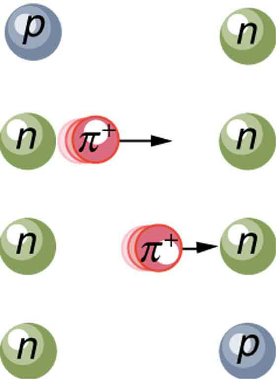

* Define Yukawa particle.
* State the Heisenberg uncertainty principle.
* Describe pion.
* Estimate the mass of a pion.
* Explain meson.

Particle physics as we know it today began with the ideas of Hideki Yukawa in 1935. Physicists had long been concerned with how forces are transmitted, finding the concept of fields, such as electric and magnetic fields to be very useful. A field surrounds an object and carries the force exerted by the object through space. Yukawa was interested in the strong nuclear force in particular and found an ingenious way to explain its short range. His idea is a blend of particles, forces, relativity, and quantum mechanics that is applicable to all forces. Yukawa proposed that force is transmitted by the exchange of particles (called carrier particles). The field consists of these carrier particles.

 {: #import-auto-id1169737824808}

Specifically for the strong nuclear force, Yukawa proposed that a previously unknown particle, now called a **pion**{: data-type="term" #import-auto-id1169737795110}, is exchanged between nucleons, transmitting the force between them. [\[link\]](#import-auto-id1169737824808) illustrates how a pion would carry a force between a proton and a neutron. The pion has mass and can only be created by violating the conservation of mass-energy. This is allowed by the Heisenberg uncertainty principle if it occurs for a sufficiently short period of time. As discussed in [Probability: The Heisenberg Uncertainty Principle](/m42579) the Heisenberg uncertainty principle relates the uncertainties <math xmlns="http://www.w3.org/1998/Math/MathML"><semantics><mrow><mrow><mtext>Δ</mtext><mi>E</mi></mrow><mrow /></mrow><annotation encoding="StarMath 5.0"> size 12{ΔE} {}</annotation></semantics></math>

 in energy and <math xmlns="http://www.w3.org/1998/Math/MathML"><semantics><mrow><mrow><mtext>Δ</mtext><mi>t</mi></mrow><mrow /></mrow><annotation encoding="StarMath 5.0"> size 12{Δt} {}</annotation></semantics></math>

 in time by

<math xmlns="http://www.w3.org/1998/Math/MathML"><semantics><mrow><mrow><mrow><mtext>Δ</mtext><mi>E</mi><mtext>Δ</mtext><mi>t</mi><mo stretchy="false">≥</mo><mfrac><mi>h</mi><mrow><mn>4</mn><mi>π</mi></mrow></mfrac></mrow></mrow><mrow /></mrow><annotation encoding="StarMath 5.0"> size 12{ΔEΔt &gt;= { {h} over {4π} } } {}</annotation></semantics><mtext>,</mtext></math>

where <math xmlns="http://www.w3.org/1998/Math/MathML"><semantics><mrow><mrow><mi>h</mi></mrow><mrow /></mrow><annotation encoding="StarMath 5.0"> size 12{h} {}</annotation></semantics></math>

 is Planck’s constant. Therefore, conservation of mass-energy can be violated by an amount <math xmlns="http://www.w3.org/1998/Math/MathML"><semantics><mrow><mrow><mtext>Δ</mtext><mi>E</mi></mrow><mrow /></mrow><annotation encoding="StarMath 5.0"> size 12{ΔE} {}</annotation></semantics></math>

 for a time <math xmlns="http://www.w3.org/1998/Math/MathML"><semantics><mrow><mrow><mrow><mtext>Δ</mtext><mi>t</mi><mo stretchy="false">≈</mo><mfrac><mrow><mi>h</mi></mrow><mrow><mn>4πΔ</mn><mi>E</mi></mrow> </mfrac></mrow></mrow><mrow /></mrow><annotation encoding="StarMath 5.0"> size 12{Δt approx { {h} over {4πΔE} } } {}</annotation></semantics></math>

 in which time no process can detect the violation. This allows the temporary creation of a particle of mass <math xmlns="http://www.w3.org/1998/Math/MathML"><semantics><mrow><mrow><mi>m</mi></mrow><mrow /></mrow><annotation encoding="StarMath 5.0"> size 12{m} {}</annotation></semantics></math>

, where <math xmlns="http://www.w3.org/1998/Math/MathML"><semantics><mrow><mrow><mrow><mtext>Δ</mtext><mi>E</mi><mo stretchy="false">=</mo><mrow><msup><mi fontstyle="italic">mc</mi><mrow><mn>2</mn></mrow></msup></mrow></mrow></mrow><mrow /></mrow><annotation encoding="StarMath 5.0"> size 12{ΔE= ital "mc" rSup { size 8{2} } } {}</annotation></semantics></math>

. The larger the mass and the greater the <math xmlns="http://www.w3.org/1998/Math/MathML"><semantics><mrow><mrow><mtext>Δ</mtext><mi>E</mi></mrow><mrow /></mrow><annotation encoding="StarMath 5.0"> size 12{ΔE} {}</annotation></semantics></math>

, the shorter is the time it can exist. This means the range of the force is limited, because the particle can only travel a limited distance in a finite amount of time. In fact, the maximum distance is <math xmlns="http://www.w3.org/1998/Math/MathML"><semantics><mrow><mrow><mrow><mi>d</mi><mo stretchy="false">≈</mo><mi>c</mi><mtext>Δ</mtext><mi>t</mi></mrow></mrow><mrow /></mrow><annotation encoding="StarMath 5.0"> size 12{d approx cΔt} {}</annotation></semantics></math>

, where *c* is the speed of light. The pion must then be captured and, thus, cannot be directly observed because that would amount to a permanent violation of mass-energy conservation. Such particles (like the pion above) are called **virtual particles**{: data-type="term" #import-auto-id1169738139222}, because they cannot be directly observed but their *effects* can be directly observed. Realizing all this, Yukawa used the information on the range of the strong nuclear force to estimate the mass of the pion, the particle that carries it. The steps of his reasoning are approximately retraced in the following worked example:

Calculating the Mass of a Pion

Taking the range of the strong nuclear force to be about 1 fermi (<math xmlns="http://www.w3.org/1998/Math/MathML"><semantics><mrow><mrow><mrow><msup><mtext>10</mtext><mrow><mrow><mo stretchy="false">−</mo><mtext>15</mtext></mrow></mrow></msup><mspace width="0.25em" /><mtext>m</mtext></mrow></mrow><mrow /></mrow><annotation encoding="StarMath 5.0"> size 12{"10" rSup { size 8{ - "15"} } m} {}</annotation></semantics></math>

), calculate the approximate mass of the pion carrying the force, assuming it moves at nearly the speed of light.

**Strategy**

The calculation is approximate because of the assumptions made about the range of the force and the speed of the pion, but also because a more accurate calculation would require the sophisticated mathematics of quantum mechanics. Here, we use the Heisenberg uncertainty principle in the simple form stated above, as developed in [Probability: The Heisenberg Uncertainty Principle](/m42579). First, we must calculate the time <math xmlns="http://www.w3.org/1998/Math/MathML"><semantics><mrow><mrow><mtext>Δ</mtext><mi>t</mi></mrow><mrow /></mrow><annotation encoding="StarMath 5.0"> size 12{Δt} {}</annotation></semantics></math>

 that the pion exists, given that the distance it travels at nearly the speed of light is about 1 fermi. Then, the Heisenberg uncertainty principle can be solved for the energy <math xmlns="http://www.w3.org/1998/Math/MathML"><semantics><mrow><mrow><mtext>Δ</mtext><mi>E</mi></mrow><mrow /></mrow><annotation encoding="StarMath 5.0"> size 12{ΔE} {}</annotation></semantics></math>

, and from that the mass of the pion can be determined. We will use the units of <math xmlns="http://www.w3.org/1998/Math/MathML"><semantics><mrow><mrow><mrow><mtext>MeV</mtext><mo stretchy="false">/</mo><msup><mi>c</mi><mrow><mn>2</mn></mrow></msup></mrow></mrow><mrow /></mrow><annotation encoding="StarMath 5.0"> size 12{"MeV"/c rSup { size 8{2} } } {}</annotation></semantics></math>

 for mass, which are convenient since we are often considering converting mass to energy and vice versa.

**Solution**

The distance the pion travels is <math xmlns="http://www.w3.org/1998/Math/MathML"><semantics><mrow><mrow><mrow><mi>d</mi><mo stretchy="false">≈</mo><mi fontstyle="italic">c</mi><mn>Δ</mn><mi>t</mi></mrow></mrow><mrow /></mrow></semantics></math>

, and so the time during which it exists is approximately

<math xmlns="http://www.w3.org/1998/Math/MathML"> <semantics> <mrow> <mrow> <mtable columnalign="left"> <mtr><mtd> <mtext>Δ</mtext><mi>t</mi></mtd> <mtd> <mo stretchy="false">≈</mo></mtd> <mtd> <mrow> <mrow> <mrow> <mrow> <mfrac> <mi>d</mi> <mi>c</mi> </mfrac> </mrow> <mo stretchy="false">=</mo> <mfrac> <mrow> <msup> <mtext>10</mtext> <mrow> <mrow> <mo stretchy="false">−</mo> <mtext>15</mtext> </mrow> </mrow> </msup> <mi /> <mspace width="0.25em" /> <mtext>m</mtext> </mrow> <mrow> <mn>3</mn> <mtext>.</mtext> <mrow> <mn>0</mn> <mo stretchy="false">×</mo> <msup> <mtext>10</mtext> <mrow> <mn>8</mn> </mrow> </msup> </mrow> <mi /> <mspace width="0.25em" /> <mtext>m/s</mtext> </mrow> </mfrac> </mrow> </mrow> </mrow></mtd> </mtr> <mtr><mtd /> <mtd> <mo stretchy="false">≈</mo></mtd> <mtd> <mrow> <mrow> <mn>3.3</mn> <mo stretchy="false">×</mo> <msup> <mtext>10</mtext> <mrow> <mrow> <mo stretchy="false">−</mo> <mtext>24</mtext> </mrow> </mrow> </msup> </mrow> <mspace width="0.25em" /> <mtext>s.</mtext> </mrow></mtd> </mtr> </mtable> </mrow> </mrow> <annotation encoding="StarMath 5.0">alignl { stack { size 12{Δt approx { {d} over {c} } = { {"10" rSup { size 8{ - "15"} } `m} over {3 "." 0 times "10" rSup { size 8{8} } `"m/s"} } } {} # " " approx 3 "." 3 times "10" rSup { size 8{ - "24"} } `s "." {} } } {}</annotation> </semantics> </math>

Now, solving the Heisenberg uncertainty principle for <math xmlns="http://www.w3.org/1998/Math/MathML"><semantics><mrow><mrow><mtext>Δ</mtext><mi>E</mi></mrow><mrow /></mrow><annotation encoding="StarMath 5.0"> size 12{ΔE} {}</annotation></semantics></math>

 gives

<math xmlns="http://www.w3.org/1998/Math/MathML"><semantics><mrow><mrow><mrow><mrow><mtext>Δ</mtext><mi>E</mi><mo stretchy="false">≈</mo><mfrac><mi>h</mi><mrow><mn>4</mn><mi>π</mi><mn>Δ</mn><mi>t</mi></mrow></mfrac></mrow><mo stretchy="false">≈</mo><mfrac><mrow><mn>6</mn><mtext>.</mtext><mrow><mtext>63</mtext><mo stretchy="false">×</mo><msup><mtext>10</mtext><mrow><mrow><mo stretchy="false">−</mo><mtext>34</mtext></mrow></mrow></msup></mrow><mspace width="0.25em" /><mrow><mtext>J</mtext><mo stretchy="false">⋅</mo><mtext>s</mtext></mrow></mrow><mrow><mn>4π</mn><mfenced open="(" close=")"><mrow><mn>3</mn><mtext>.</mtext><mrow><mn>3</mn><mo stretchy="false">×</mo><msup><mtext>10</mtext><mrow><mrow><mo stretchy="false">−</mo><mtext>24</mtext></mrow></mrow></msup></mrow><mspace width="0.25em" /><mtext>s</mtext></mrow></mfenced></mrow></mfrac></mrow></mrow><mrow /></mrow><annotation encoding="StarMath 5.0"> size 12{ΔE approx { {h} over {4πΔt} } approx { {6 "." "63" times "10" rSup { size 8{ - "34"} } `J cdot s} over {4π left (3 "." 3 times "10" rSup { size 8{ - "24"} } `s right )} } } {}</annotation></semantics><mtext>.</mtext></math>

Solving this and converting the energy to MeV gives

<math xmlns="http://www.w3.org/1998/Math/MathML"><semantics><mrow><mrow><mrow><mrow><mtext>Δ</mtext><mi>E</mi><mo stretchy="false">≈</mo><mfenced open="(" close=")"><mrow><mn>1</mn><mtext>.</mtext><mrow><mn>6</mn><mo stretchy="false">×</mo><msup><mtext>10</mtext><mrow><mrow><mo stretchy="false">−</mo><mtext>11</mtext></mrow></mrow></msup></mrow><mspace width="0.25em" /><mtext>J</mtext></mrow></mfenced></mrow><mrow><mfrac><mrow><mn>1</mn><mi /><mspace width="0.25em" /><mtext>MeV</mtext></mrow><mrow><mn>1</mn><mtext>.</mtext><mrow><mn>6</mn><mo stretchy="false">×</mo><msup><mtext>10</mtext><mrow><mrow><mo stretchy="false">−</mo><mtext>13</mtext></mrow></mrow></msup></mrow><mspace width="0.25em" /><mtext>J</mtext></mrow></mfrac><mo stretchy="false">=</mo><mtext>100</mtext></mrow><mi /><mspace width="0.25em" /><mtext>MeV</mtext></mrow></mrow><mrow /></mrow><annotation encoding="StarMath 5.0"> size 12{ΔE approx left (1 "." 6 times "10" rSup { size 8{ - "11"} } `J right ) { {1`"MeV"} over {1 "." 6 times "10" rSup { size 8{ - "13"} } `J} } ="100"`"MeV"} {}</annotation></semantics><mtext>.</mtext></math>

Mass is related to energy by <math xmlns="http://www.w3.org/1998/Math/MathML"><semantics><mrow><mrow><mrow><mtext>Δ</mtext><mi>E</mi><mo stretchy="false">=</mo><mstyle fontstyle="italic"><mrow><msup><mtext>mc</mtext><mrow><mn fontstyle="normal">2</mn></mrow></msup></mrow></mstyle></mrow></mrow><mrow /></mrow><annotation encoding="StarMath 5.0"> size 12{ΔE= ital "mc" rSup { size 8{2} } } {}</annotation></semantics></math>

, so that the mass of the pion is <math xmlns="http://www.w3.org/1998/Math/MathML"><semantics><mrow><mrow><mrow><mi>m</mi><mo stretchy="false">=</mo><mrow><mtext>Δ</mtext><mi>E</mi><mo stretchy="false">/</mo><msup><mi>c</mi><mrow><mn>2</mn></mrow></msup></mrow></mrow></mrow><mrow /></mrow><annotation encoding="StarMath 5.0"> size 12{m=ΔE/c rSup { size 8{2} } } {}</annotation></semantics></math>

, or

<math xmlns="http://www.w3.org/1998/Math/MathML"><semantics><mrow><mrow><mrow><mrow><mi>m</mi><mo stretchy="false">≈</mo><mtext>100</mtext></mrow><mi /><mspace width="0.25em" /><mtext>MeV/</mtext><msup><mi>c</mi><mrow><mn>2</mn></mrow></msup></mrow></mrow><mrow /></mrow><annotation encoding="StarMath 5.0"> size 12{m approx "100"`"MeV/"c rSup { size 8{2} } } {}</annotation></semantics><mtext>.</mtext></math>

**Discussion**

This is about 200 times the mass of an electron and about one-tenth the mass of a nucleon. No such particles were known at the time Yukawa made his bold proposal.

Yukawa’s proposal of particle exchange as the method of force transfer is intriguing. But how can we verify his proposal if we cannot observe the virtual pion directly? If sufficient energy is in a nucleus, it would be possible to free the pion—that is, to create its mass from external energy input. This can be accomplished by collisions of energetic particles with nuclei, but energies greater than 100 MeV are required to conserve both energy and momentum. In 1947, pions were observed in cosmic-ray experiments, which were designed to supply a small flux of high-energy protons that may collide with nuclei. Soon afterward, accelerators of sufficient energy were creating pions in the laboratory under controlled conditions. Three pions were discovered, two with charge and one neutral, and given the symbols <math xmlns="http://www.w3.org/1998/Math/MathML"><semantics><mrow><mrow><mrow><msup><mi>π</mi><mrow><mrow><mo stretchy="false">+</mo><mrow /></mrow></mrow></msup><mtext>,</mtext> <mspace width="0.25em" /><msup><mi>π</mi><mrow><mrow><mo stretchy="false">−</mo><mrow /></mrow></mrow></msup><mtext>, and</mtext> <mspace width="0.25em" /><mi /><msup><mi> π</mi><mrow><mn>0</mn></mrow></msup></mrow></mrow><mrow /></mrow><annotation encoding="StarMath 5.0"> size 12{π rSup { size 8{+{}} } ,`π rSup { size 8{ - {}} } ,`"and "`π rSup { size 8{0} } } {}</annotation></semantics></math>

, respectively. The masses of <math xmlns="http://www.w3.org/1998/Math/MathML"><semantics><mrow><mrow><msup><mi>π</mi><mrow><mrow><mo stretchy="false">+</mo><mrow /></mrow></mrow></msup></mrow><mrow /></mrow><annotation encoding="StarMath 5.0"> size 12{π rSup { size 8{+{}} } } {}</annotation></semantics></math>

 and <math xmlns="http://www.w3.org/1998/Math/MathML"><semantics><mrow><mrow><msup><mi>π</mi><mrow><mrow><mo stretchy="false">−</mo><mrow /></mrow></mrow></msup></mrow><mrow /></mrow><annotation encoding="StarMath 5.0"> size 12{π rSup { size 8{ - {}} } } {}</annotation></semantics></math>

 are identical at <math xmlns="http://www.w3.org/1998/Math/MathML"><semantics><mrow><mrow><mrow><mtext>139</mtext><mtext>.</mtext><mn>6</mn><mi /><mspace width="0.25em" /><mtext>MeV/</mtext><msup><mi>c</mi><mrow><mn>2</mn></mrow></msup></mrow></mrow><mrow /></mrow><annotation encoding="StarMath 5.0"> size 12{"139" "." 6`"MeV/"c rSup { size 8{2} } } {}</annotation></semantics></math>

, whereas <math xmlns="http://www.w3.org/1998/Math/MathML"><semantics><mrow><mrow><msup><mi>π</mi><mrow><mn>0</mn></mrow></msup></mrow><mrow /></mrow><annotation encoding="StarMath 5.0"> size 12{ π rSup { size 8{0} } } {}</annotation></semantics></math>

 has a mass of <math xmlns="http://www.w3.org/1998/Math/MathML"><semantics><mrow><mrow><mrow><mtext>135</mtext><mtext>.</mtext><mn>0</mn><mi /><mspace width="0.25em" /><mtext>MeV/</mtext><msup><mi>c</mi><mrow><mn>2</mn></mrow></msup></mrow></mrow><mrow /></mrow><annotation encoding="StarMath 5.0"> size 12{"135" "." 0`"MeV/"c rSup { size 8{2} } } {}</annotation></semantics></math>

. These masses are close to the predicted value of <math xmlns="http://www.w3.org/1998/Math/MathML"><semantics><mrow><mrow><mrow><mtext>100</mtext><mi /><mspace width="0.25em" /><mtext>MeV/</mtext><msup><mi>c</mi><mrow><mn>2</mn></mrow></msup></mrow></mrow><mrow /></mrow><annotation encoding="StarMath 5.0"> size 12{"100"`"MeV/"c rSup { size 8{2} } } {}</annotation></semantics></math>

 and, since they are intermediate between electron and nucleon masses, the particles are given the name **meson**{: data-type="term" #import-auto-id1169737770273} (now an entire class of particles, as we shall see in [Particles, Patterns, and Conservation Laws](/m42674)).

The pions, or <math xmlns="http://www.w3.org/1998/Math/MathML"><semantics><mrow><mrow><mi>π</mi></mrow><mrow /></mrow><annotation encoding="StarMath 5.0"> size 12{π} {}</annotation></semantics></math>

-mesons as they are also called, have masses close to those predicted and feel the strong nuclear force. Another previously unknown particle, now called the muon, was discovered during cosmic-ray experiments in 1936 (one of its discoverers, Seth Neddermeyer, also originated the idea of implosion for plutonium bombs). Since the mass of a muon is around <math xmlns="http://www.w3.org/1998/Math/MathML"><semantics><mrow><mrow><mrow><mtext>106</mtext><mi /><mspace width="0.25em" /><mtext>MeV/</mtext><msup><mi>c</mi><mrow><mn>2</mn></mrow></msup></mrow></mrow><mrow /></mrow><annotation encoding="StarMath 5.0"> size 12{"106"`"MeV/"c rSup { size 8{2} } } {}</annotation></semantics></math>

, at first it was thought to be the particle predicted by Yukawa. But it was soon realized that muons do not feel the strong nuclear force and could not be Yukawa’s particle. Their role was unknown, causing the respected physicist I. I. Rabi to comment, “Who ordered that?” This remains a valid question today. We have discovered hundreds of subatomic particles; the roles of some are only partially understood. But there are various patterns and relations to forces that have led to profound insights into nature’s secrets.

### Summary

* {: #import-auto-id1169737937077} Yukawa’s idea of virtual particle exchange as the carrier of forces is crucial, with virtual particles being formed in temporary violation of the conservation of mass-energy as allowed by the Heisenberg uncertainty principle.

### Problems &amp; Exercises

A virtual particle having an approximate mass of <math xmlns="http://www.w3.org/1998/Math/MathML"><semantics><mrow><mrow><mrow><msup><mtext>10</mtext><mrow><mtext>14</mtext></mrow></msup><mi /><mspace width="0.25em" /><mtext>GeV/</mtext><msup><mi>c</mi><mrow><mn>2</mn></mrow></msup></mrow></mrow><mrow /></mrow><annotation encoding="StarMath 5.0"> size 12{"10" rSup { size 8{"14"} } `"GeV/"c rSup { size 8{2} } } {}</annotation></semantics></math>

 may be associated with the unification of the strong and electroweak forces. For what length of time could this virtual particle exist (in temporary violation of the conservation of mass-energy as allowed by the Heisenberg uncertainty principle)?

<math xmlns="http://www.w3.org/1998/Math/MathML"> <semantics> <mrow> <mrow> <mrow> <mrow> <mn>3</mn> <mo stretchy="false">×</mo> <msup> <mtext>10</mtext> <mrow> <mrow> <mo stretchy="false">−</mo> <mtext>39</mtext> </mrow> </mrow> </msup> </mrow> <mspace width="0.25em" /> <mtext>s</mtext> </mrow> </mrow> <mrow /> </mrow> <annotation encoding="StarMath 5.0"> size 12{3 times "10" rSup { size 8{ - "39"} } `s} {}</annotation> </semantics> </math>

Calculate the mass in <math xmlns="http://www.w3.org/1998/Math/MathML"><semantics><mrow><mrow><mrow><mtext>GeV/</mtext><msup><mi>c</mi><mrow><mn>2</mn></mrow></msup></mrow></mrow><mrow /></mrow><annotation encoding="StarMath 5.0"> size 12{"GeV/"c rSup { size 8{2} } } {}</annotation></semantics></math>

 of a virtual carrier particle that has a range limited to <math xmlns="http://www.w3.org/1998/Math/MathML"><semantics><mrow><mrow><msup><mtext>10</mtext><mrow><mrow><mo stretchy="false">−</mo><mtext>30</mtext></mrow></mrow></msup></mrow><mrow /></mrow><annotation encoding="StarMath 5.0"> size 12{"10" rSup { size 8{ - "30"} } } {}</annotation></semantics></math>

 m by the Heisenberg uncertainty principle. Such a particle might be involved in the unification of the strong and electroweak forces.

Another component of the strong nuclear force is transmitted by the exchange of virtual *K*-mesons. Taking *K*-mesons to have an average mass of <math xmlns="http://www.w3.org/1998/Math/MathML"><semantics><mrow><mrow><mrow><mtext>495</mtext><mi /><mspace width="0.25em" /><mtext>MeV/</mtext><msup><mi>c</mi><mrow><mn>2</mn></mrow></msup></mrow></mrow><mrow /></mrow><annotation encoding="StarMath 5.0"> size 12{"495"`"MeV/"c rSup { size 8{2} } } {}</annotation></semantics></math>

, what is the approximate range of this component of the strong force?

<math xmlns="http://www.w3.org/1998/Math/MathML"> <semantics> <mrow> <mrow> <mrow> <mn>1</mn> <mtext>.</mtext> <mrow> <mtext>99</mtext> <mo stretchy="false">×</mo> <msup> <mtext>10</mtext> <mrow> <mrow> <mo stretchy="false">−</mo> <mtext>16</mtext> </mrow> </mrow> </msup> </mrow> <mspace width="0.25em" /> <mtext>m</mtext> <mi /> <mspace width="0.25em" /><mspace width="0.25em" /> <mo stretchy="false">(</mo> <mn>0</mn> <mtext>.</mtext> <mn>2</mn> <mi /> <mspace width="0.25em" /> <mtext>fm</mtext> <mo stretchy="false">)</mo> </mrow> </mrow> <mrow /> </mrow> <annotation encoding="StarMath 5.0"> size 12{1 "." "99" times "10" rSup { size 8{ - "16"} } `m` \( 0 "." 2`"fm" \) } {}</annotation> </semantics> </math>

### Glossary
{: data-type="glossary-title"}

pion
: particle exchanged between nucleons, transmitting the force between them
{: #import-auto-id1169737930720}

virtual particles
: particles which cannot be directly observed but their effects can be directly observed
{: #import-auto-id1169737939834}

meson
: particle whose mass is intermediate between the electron and nucleon masses
{: #import-auto-id1169737086949}

