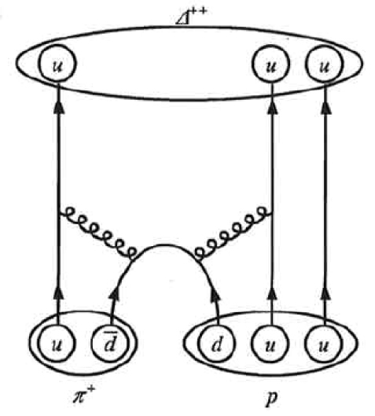

* Define fundamental particle.
* Describe quark and antiquark.
* List the flavors of quark.
* Outline the quark composition of hadrons.
* Determine quantum numbers from quark composition.

Quarks have been mentioned at various points in this text as fundamental building blocks and members of the exclusive club of truly elementary particles. Note that an elementary or **fundamental particle**{: data-type="term" #import-auto-id1169738051993} has no substructure (it is not made of other particles) and has no finite size other than its wavelength. This does not mean that fundamental particles are stable—some decay, while others do not. Keep in mind that *all* leptons seem to be fundamental, whereas*no* hadrons are fundamental. There is strong evidence that **quarks**{: data-type="term" #import-auto-id1169738116422} are the fundamental building blocks of hadrons as seen in [\[link\]](#import-auto-id1169737965898). Quarks are the second group of fundamental particles (leptons are the first). The third and perhaps final group of fundamental particles is the carrier particles for the four basic forces. Leptons, quarks, and carrier particles may be all there is. In this module we will discuss the quark substructure of hadrons and its relationship to forces as well as indicate some remaining questions and problems.

![The figure shows four spheres that are labeled proton, neutron, positive pion, and negative pion. The proton sphere contains a blue up quark with spin up, a green down quark with spin down, and a red up quark with spin up. Below the figure are two equations. The upper equation is labeled spin and reads one half plus one half minus one half equals one half, and the lower equation is labeled charge and reads plus two thirds plus two thirds minus one third equals one. The neutron sphere contains a green up quark with spin down, a blue down quark with spin up, and a red down quark with spin up. The corresponding spin equation reads minus one half plus one half plus one half equals one half, and the charge equation reads plus two thirds minus one third minus one third equals zero. The positive pion sphere contains a red up quark with spin up and an anti red anti down quark with spin down. The corresponding spin equation reads plus one half minus one half equals zero, and the charge equation reads plus two thirds plus one third equals plus one. The negative pion sphere contains a green anti up quark with spin up and an anti green down quark with spin down. The corresponding spin equation reads plus one half minus one half equals zero, and the charge equation reads minus two thirds minus one third equals minus one.](../resources/Figure_34_05_01.jpg "All baryons, such as the proton and neutron shown here, are composed of three quarks. All mesons, such as the pions shown here, are composed of a quark-antiquark pair. Arrows represent the spins of the quarks, which, as we shall see, are also colored. The colors are such that they need to add to white for any possible combination of quarks."){: #import-auto-id1169737965898 data-media-type="image/jpg"}

# Conception of Quarks

Quarks were first proposed independently by American physicists Murray Gell-Mann and George Zweig in 1963. Their quaint name was taken by Gell-Mann from a James Joyce novel—Gell-Mann was also largely responsible for the concept and name of strangeness. (Whimsical names are common in particle physics, reflecting the personalities of modern physicists.) Originally, three quark types—or **flavors**{: data-type="term" #import-auto-id1169737980329}—were proposed to account for the then-known mesons and baryons. These quark flavors are named **up**{: data-type="term" #import-auto-id1169738117705} (*u*), **down**{: data-type="term" #import-auto-id1169738086585} (*d*), and **strange**{: data-type="term" #import-auto-id1169738116986} (*s*). All quarks have half-integral spin and are thus fermions. All mesons have integral spin while all baryons have half-integral spin. Therefore, mesons should be made up of an even number of quarks while baryons need to be made up of an odd number of quarks. [\[link\]](#import-auto-id1169737965898) shows the quark substructure of the proton, neutron, and two pions. The most radical proposal by Gell-Mann and Zweig is the fractional charges of quarks, which are <math xmlns="http://www.w3.org/1998/Math/MathML"><semantics><mrow><mrow><mrow><mrow><mo stretchy="false">±</mo><mfenced open="(" close=")"><mfrac><mn>2</mn><mn>3</mn></mfrac></mfenced></mrow><msub><mi>q</mi><mrow><mi>e</mi></mrow></msub></mrow></mrow><mrow /></mrow><annotation encoding="StarMath 5.0"> size 12{ +- left ( { {2} over {3} } right )q rSub { size 8{e} } } {}</annotation></semantics></math>

 and <math xmlns="http://www.w3.org/1998/Math/MathML"><semantics><mrow><mrow><mrow><mfenced open="(" close=")"><mfrac><mn>1</mn><mn>3</mn></mfrac></mfenced><msub><mi>q</mi><mrow><mi>e</mi></mrow></msub></mrow></mrow><mrow /></mrow><annotation encoding="StarMath 5.0"> size 12{ left ( { {1} over {3} } right )q rSub { size 8{e} } } {}</annotation></semantics></math>

, whereas all directly observed particles have charges that are integral multiples of <math xmlns="http://www.w3.org/1998/Math/MathML"><semantics><mrow><mrow><msub><mi>q</mi><mrow><mi>e</mi></mrow></msub></mrow><mrow /></mrow><annotation encoding="StarMath 5.0"> size 12{q rSub { size 8{e} } } {}</annotation></semantics></math>

. Note that the fractional value of the quark does not violate the fact that the *e* is the smallest unit of charge that is observed, because a free quark cannot exist. [\[link\]](#import-auto-id1169738110830) lists characteristics of the six quark flavors that are now thought to exist. Discoveries made since 1963 have required extra quark flavors, which are divided into three families quite analogous to leptons.

# How Does it Work?

To understand how these quark substructures work, let us specifically examine the proton, neutron, and the two pions pictured in [\[link\]](#import-auto-id1169737965898) before moving on to more general considerations. First, the proton *p* is composed of the three quarks *uud*, so that its total charge is <math xmlns="http://www.w3.org/1998/Math/MathML"><semantics><mrow><mrow><mrow><mrow><mo stretchy="false">+</mo><mfenced open="(" close=")"><mfrac><mn>2</mn><mn>3</mn></mfrac></mfenced></mrow><mrow><msub><mi>q</mi><mrow><mi>e</mi></mrow></msub><mo stretchy="false">+</mo><mfenced open="(" close=")"><mfrac><mn>2</mn><mn>3</mn></mfrac></mfenced></mrow><mrow><msub><mi>q</mi><mrow><mi>e</mi></mrow></msub><mo stretchy="false">−</mo><mfenced open="(" close=")"><mfrac><mn>1</mn><mn>3</mn></mfrac></mfenced></mrow><mrow><msub><mi>q</mi><mrow><mi>e</mi></mrow></msub><mo stretchy="false">=</mo><msub><mi>q</mi><mrow><mi>e</mi></mrow></msub></mrow></mrow></mrow><mrow /></mrow><annotation encoding="StarMath 5.0"> size 12{+ left ( { {2} over {3} } right )q rSub { size 8{e} } + left ( { {2} over {3} } right )q rSub { size 8{e} } - left ( { {1} over {3} } right )q rSub { size 8{e} } =q rSub { size 8{e} } } {}</annotation></semantics></math>

, as expected. With the spins aligned as in the figure, the proton’s intrinsic spin is <math xmlns="http://www.w3.org/1998/Math/MathML"><semantics><mrow><mrow><mrow><mrow><mrow><mrow><mo stretchy="false">+</mo><mfenced open="(" close=")"><mfrac><mn>1</mn><mn>2</mn></mfrac></mfenced></mrow><mo stretchy="false">+</mo><mfenced open="(" close=")"><mfrac><mn>1</mn><mn>2</mn></mfrac></mfenced></mrow><mo stretchy="false">−</mo><mfenced open="(" close=")"><mfrac><mn>1</mn><mn>2</mn></mfrac></mfenced></mrow><mo stretchy="false">=</mo><mfenced open="(" close=")"><mfrac><mn>1</mn><mn>2</mn></mfrac></mfenced></mrow></mrow><mrow /></mrow><annotation encoding="StarMath 5.0"> size 12{+ left ( { {1} over {2} } right )+ left ( { {1} over {2} } right ) - left ( { {1} over {2} } right )= left ( { {1} over {2} } right )} {}</annotation></semantics></math>

, also as expected. Note that the spins of the up quarks are aligned, so that they would be in the same state except that they have different colors (another quantum number to be elaborated upon a little later). Quarks obey the Pauli exclusion principle. Similar comments apply to the neutron *n*, which is composed of the three quarks *udd*. Note also that the neutron is made of charges that add to zero but move internally, producing its well-known magnetic moment. When the neutron <math xmlns="http://www.w3.org/1998/Math/MathML"><semantics><mrow><mrow><msup><mi>β</mi><mrow><mrow><mo stretchy="false">−</mo><mrow /></mrow></mrow></msup></mrow><mrow /></mrow><annotation encoding="StarMath 5.0"> size 12{β rSup { size 8{ - {}} } } {}</annotation></semantics></math>

 decays, it does so by changing the flavor of one of its quarks. Writing neutron <math xmlns="http://www.w3.org/1998/Math/MathML"><semantics><mrow><mrow><msup><mi>β</mi><mrow><mrow><mo stretchy="false">−</mo><mrow /></mrow></mrow></msup></mrow><mrow /></mrow><annotation encoding="StarMath 5.0"> size 12{β rSup { size 8{ - {}} } } {}</annotation></semantics></math>

 decay in terms of quarks,

<math xmlns="http://www.w3.org/1998/Math/MathML"><semantics><mrow><mrow><mrow><mi>n</mi><mo stretchy="false">→</mo><mrow><mrow><mi>p</mi><mo stretchy="false">+</mo><msup><mi>β</mi><mrow><mrow><mo stretchy="false">−</mo><mrow /></mrow></mrow></msup></mrow><mo stretchy="false">+</mo><msub><mover accent="true"><mi>v</mi><mo stretchy="true">-</mo></mover><mrow><mi>e</mi></mrow></msub></mrow></mrow></mrow><mrow /></mrow><annotation encoding="StarMath 5.0"> size 12{n rightarrow p+β rSup { size 8{ - {}} } + { bar {v}} rSub { size 8{e} } } {}</annotation></semantics><mtext>  becomes  </mtext><semantics><mrow><mrow><mrow><mstyle fontstyle="italic"><mrow><mtext>udd</mtext></mrow></mstyle><mo stretchy="false">→</mo><mrow><mrow><mstyle fontstyle="italic"><mrow><mtext>uud</mtext></mrow></mstyle><mo stretchy="false">+</mo><msup><mi>β</mi><mrow><mrow><mo stretchy="false">−</mo><mrow /></mrow></mrow></msup></mrow><mo stretchy="false">+</mo><msub><mover accent="true"><mi>v</mi><mo stretchy="true">-</mo></mover><mrow><mi>e</mi></mrow></msub></mrow></mrow></mrow><mrow /></mrow><annotation encoding="StarMath 5.0"> size 12{ ital "udd" rightarrow ital "uud"+β rSup { size 8{ - {}} } + { bar {v}} rSub { size 8{e} } } {}</annotation></semantics><mtext>.</mtext></math>

We see that this is equivalent to a down quark changing flavor to become an up quark:

<math xmlns="http://www.w3.org/1998/Math/MathML"> <semantics> <mrow> <mrow> <mrow> <mi>d</mi> <mo stretchy="false">→</mo> <mrow> <mrow> <mi>u</mi> <mo stretchy="false">+</mo> <msup> <mi>β</mi> <mrow> <mrow> <mo stretchy="false">−</mo> <mrow /> </mrow> </mrow> </msup> </mrow> <mo stretchy="false">+</mo> <msub> <mover accent="true"> <mi>v</mi> <mo stretchy="true">-</mo> </mover> <mrow> <mi>e</mi> </mrow> </msub> </mrow> </mrow> </mrow> <mrow /> </mrow> <annotation encoding="StarMath 5.0"> size 12{d rightarrow u+β rSup { size 8{ - {}} } + { bar {v}} rSub { size 8{e} } } {}</annotation> </semantics> </math>

<table id="import-auto-id1169738110830" summary="Quarks and Antiquarks"><caption>Quarks and Antiquarks
The lower of the <math xmlns="http://www.w3.org/1998/Math/MathML"><semantics><mrow><mrow><mrow><mo stretchy="false">±</mo><mrow /></mrow></mrow><mrow /></mrow><annotation encoding="StarMath 5.0"> size 12{ +- {}} {}</annotation></semantics></math> symbols are the values for antiquarks.
</caption><thead>        
<tr>
            <th>
              <strong>Name</strong>
            </th>
            <th>
              <strong>Symbol</strong>
            </th>
            <th>
              <strong>Antiparticle</strong>
            </th>
            <th>
              <strong>Spin</strong>
            </th>
            <th>
              <strong>Charge</strong>
            </th>
            <th>
              <math xmlns="http://www.w3.org/1998/Math/MathML" display="block">
                <semantics>
                  <mrow>
                    
                      <mrow>
                        <mi>B</mi>
                      </mrow>
                    
                    <mrow />
                  </mrow>
                  <annotation encoding="StarMath 5.0"> size 12{B} {}</annotation>
                </semantics>
              </math> 
              

<math xmlns="http://www.w3.org/1998/Math/MathML"><semantics><mrow><mrow><mi>B</mi></mrow><mrow /></mrow><annotation encoding="StarMath 5.0"> size 12{B} {}</annotation></semantics></math> is baryon number, <em>S</em> is strangeness, <math xmlns="http://www.w3.org/1998/Math/MathML"><semantics><mrow><mrow><mi>c</mi></mrow><mrow /></mrow><annotation encoding="StarMath 5.0"> size 12{c} {}</annotation></semantics></math> is charm, <math xmlns="http://www.w3.org/1998/Math/MathML"><semantics><mrow><mrow><mi>b</mi></mrow><mrow /></mrow><annotation encoding="StarMath 5.0"> size 12{b} {}</annotation></semantics></math> is bottomness, <math xmlns="http://www.w3.org/1998/Math/MathML"><semantics><mrow><mrow><mi>t</mi></mrow><mrow /></mrow><annotation encoding="StarMath 5.0"> size 12{t} {}</annotation></semantics></math> is topness.
 
            </th>

            <th>
              <math xmlns="http://www.w3.org/1998/Math/MathML" display="block">
                <semantics>
                  <mrow>
                    
                      <mrow>
                        <mi>S</mi>
                      </mrow>
                    
                    <mrow />
                  </mrow>
                  <annotation encoding="StarMath 5.0"> size 12{S} {}</annotation>
                </semantics>
              </math> 

            </th>
            <th>
              <math xmlns="http://www.w3.org/1998/Math/MathML" display="block">
                <semantics>
                  <mrow>
                    
                      <mrow>
                        <mi>c</mi>
                      </mrow>
                    
                    <mrow />
                  </mrow>
                  <annotation encoding="StarMath 5.0"> size 12{c} {}</annotation>
                </semantics>
              </math> 
            </th>
            <th>
              <math xmlns="http://www.w3.org/1998/Math/MathML" display="block">
                <semantics>
                  <mrow>
                    
                      <mrow>
                        <mi>b</mi>
                      </mrow>
                    
                    <mrow />
                  </mrow>
                  <annotation encoding="StarMath 5.0"> size 12{b} {}</annotation>
                </semantics>
              </math> 
            </th>
            <th>
              <math xmlns="http://www.w3.org/1998/Math/MathML" display="block">
                <semantics>
                  <mrow>
                    
                      <mrow>
                        <mi>t</mi>
                      </mrow>
                    
                    <mrow />
                  </mrow>
                  <annotation encoding="StarMath 5.0"> size 12{t} {}</annotation>
                </semantics>
              </math> 
            </th>
            <th>
              Mass <math xmlns="http://www.w3.org/1998/Math/MathML">
<mo stretchy="false">(</mo>
<mtext>GeV</mtext>
<mo stretchy="false">/</mo>
<msup>
<mi>c</mi>
<mn>2</mn>
</msup>
<mo stretchy="false">)</mo>
</math>
Values are approximate, are not directly observable, and vary with model.
 
            
            </th>
          </tr>
</thead><tbody>
<tr>
            <td>Up</td>
            <td>
              <math xmlns="http://www.w3.org/1998/Math/MathML" display="block">
                <semantics>
                  <mrow>
                    
                      <mrow>
                        <mi>u</mi>
                      </mrow>
                    
                    <mrow />
                  </mrow>
                  <annotation encoding="StarMath 5.0"> size 12{u} {}</annotation>
                </semantics>
              </math> 
            </td>
            <td>
              <math xmlns="http://www.w3.org/1998/Math/MathML" display="block">
                <semantics>
                  <mrow>
                    
                      <mrow>
                        <mover accent="true">
                          <mi>u</mi>
                          <mo stretchy="true">-</mo>
                        </mover>
                      </mrow>
                    
                    <mrow />
                  </mrow>
                  <annotation encoding="StarMath 5.0"> size 12{ { bar  {u}}} {}</annotation>
                </semantics>
              </math> 
            </td>
<td>1/2</td>
                               <td>
              <math xmlns="http://www.w3.org/1998/Math/MathML" display="block">
                <semantics>
                  <mrow>
                    
                      <mrow>
                        <mrow>
                          <mrow>
                            <mo stretchy="false">±</mo>
                            <mfrac>
                              <mn>2</mn>
                              <mn>3</mn>
                            </mfrac>
                          </mrow>
                          <msub>
                            <mi>q</mi>
                            
                              <mrow>
                                <mi>e</mi>
                              </mrow>
                            
                          </msub>
                        </mrow>
                      </mrow>
                    
                    <mrow />
                  </mrow>
                  <annotation encoding="StarMath 5.0"> size 12{ +-  {  {2}  over  {3} } q rSub { size 8{e} } } {}</annotation>
                </semantics>
              </math> 
            </td>
                          <td>
              <math xmlns="http://www.w3.org/1998/Math/MathML" display="block">
                <semantics>
                  <mrow>
                    
                      <mrow>
                        <mrow>
                          <mo stretchy="false">±</mo>
                          <mfrac>
                            <mn>1</mn>
                            <mn>3</mn>
                          </mfrac>
                        </mrow>
                      </mrow>
                    
                    <mrow />
                  </mrow>
                  <annotation encoding="StarMath 5.0"> size 12{ +-  {  {1}  over  {3} } } {}</annotation>
                </semantics>
              </math> 
            </td>
            <td>0</td>
            <td>0</td>
            <td>0</td>
            <td>0</td>
            <td>0.005</td>
          </tr><tr>
            <td>Down</td>
            <td>
              <math xmlns="http://www.w3.org/1998/Math/MathML" display="block">
                <semantics>
                  <mrow>
                    
                      <mrow>
                        <mi>d</mi>
                      </mrow>
                    
                    <mrow />
                  </mrow>
                  <annotation encoding="StarMath 5.0"> size 12{d} {}</annotation>
                </semantics>
              </math> 
            </td>
            <td>
              <math xmlns="http://www.w3.org/1998/Math/MathML" display="block">
                <semantics>
                  <mrow>
                    
                      <mrow>
                        <mover accent="true">
                          <mi>d</mi>
                          <mo stretchy="true">-</mo>
                        </mover>
                      </mrow>
                    
                    <mrow />
                  </mrow>
                  <annotation encoding="StarMath 5.0"> size 12{ { bar  {d}}} {}</annotation>
                </semantics>
              </math> 
            </td>
              <td>1/2</td>
            
            <td>
              <math xmlns="http://www.w3.org/1998/Math/MathML" display="block">
                <semantics>
                  <mrow>
                    
                      <mrow>
                        <mrow>
                          <mrow>
                            <mo stretchy="false">∓</mo>
                            <mfrac>
                              <mn>1</mn>
                              <mn>3</mn>
                            </mfrac>
                          </mrow>
                          <msub>
                            <mi>q</mi>
                            
                              <mrow>
                                <mi>e</mi>
                              </mrow>
                            
                          </msub>
                        </mrow>
                      </mrow>
                    
                    <mrow />
                  </mrow>
                  <annotation encoding="StarMath 5.0"> size 12{ -+  {  {1}  over  {3} } q rSub { size 8{e} } } {}</annotation>
                </semantics>
              </math> 
            </td>
            <td>
              <math xmlns="http://www.w3.org/1998/Math/MathML" display="block">
                <semantics>
                  <mrow>
                    
                      <mrow>
                        <mrow>
                          <mo stretchy="false">±</mo>
                          <mfrac>
                            <mn>1</mn>
                            <mn>3</mn>
                          </mfrac>
                        </mrow>
                      </mrow>
                    
                    <mrow />
                  </mrow>
                  <annotation encoding="StarMath 5.0"> size 12{ +-  {  {1}  over  {3} } } {}</annotation>
                </semantics>
              </math> 
            </td>
            <td>0</td>
            <td>0</td>
            <td>0</td>
            <td>0</td>
            <td>0.008</td>
          </tr>
            <tr>
            <td colspan="11" />
            </tr>
             <tr>
            <td>Strange</td>
            <td>
              <math xmlns="http://www.w3.org/1998/Math/MathML" display="block">
                <semantics>
                  <mrow>
                    
                      <mrow>
                        <mi>s</mi>
                      </mrow>
                    
                    <mrow />
                  </mrow>
                  <annotation encoding="StarMath 5.0"> size 12{s} {}</annotation>
                </semantics>
              </math> 
            </td>
            <td>
              <math xmlns="http://www.w3.org/1998/Math/MathML" display="block">
                <semantics>
                  <mrow>
                    
                      <mrow>
                        <mover accent="true">
                          <mi>s</mi>
                          <mo stretchy="true">-</mo>
                        </mover>
                      </mrow>
                    
                    <mrow />
                  </mrow>
                  <annotation encoding="StarMath 5.0"> size 12{ { bar  {s}}} {}</annotation>
                </semantics>
              </math> 
            </td>
              <td>1/2</td>
                        <td>
              <math xmlns="http://www.w3.org/1998/Math/MathML" display="block">
                <semantics>
                  <mrow>
                    
                      <mrow>
                        <mrow>
                          <mrow>
                            <mo stretchy="false">∓</mo>
                            <mfrac>
                              <mn>1</mn>
                              <mn>3</mn>
                            </mfrac>
                          </mrow>
                          <msub>
                            <mi>q</mi>
                            
                              <mrow>
                                <mi>e</mi>
                              </mrow>
                            
                          </msub>
                        </mrow>
                      </mrow>
                    
                    <mrow />
                  </mrow>
                  <annotation encoding="StarMath 5.0"> size 12{ -+  {  {1}  over  {3} } q rSub { size 8{e} } } {}</annotation>
                </semantics>
              </math> 
            </td>
            <td>
              <math xmlns="http://www.w3.org/1998/Math/MathML" display="block">
                <semantics>
                  <mrow>
                    
                      <mrow>
                        <mrow>
                          <mo stretchy="false">±</mo>
                          <mfrac>
                            <mn>1</mn>
                            <mn>3</mn>
                          </mfrac>
                        </mrow>
                      </mrow>
                    
                    <mrow />
                  </mrow>
                  <annotation encoding="StarMath 5.0"> size 12{ +-  {  {1}  over  {3} } } {}</annotation>
                </semantics>
              </math> 
            </td>
            <td>
              <math xmlns="http://www.w3.org/1998/Math/MathML" display="block">
                <semantics>
                  <mrow>
                    
                      <mrow>
                        <mrow>
                          <mo stretchy="false">∓</mo>
                          <mn>1</mn>
                        </mrow>
                      </mrow>
                    
                    <mrow />
                  </mrow>
                  <annotation encoding="StarMath 5.0"> size 12{ -+ 1} {}</annotation>
                </semantics>
              </math> 
            </td>
            <td>0</td>
            <td>0</td>
            <td>0</td>
            <td>0.50</td>
          </tr><tr>
            <td>Charmed</td>
            <td>
              <math xmlns="http://www.w3.org/1998/Math/MathML" display="block">
                <semantics>
                  <mrow>
                    
                      <mrow>
                        <mi>c</mi>
                      </mrow>
                    
                    <mrow />
                  </mrow>
                  <annotation encoding="StarMath 5.0"> size 12{c} {}</annotation>
                </semantics>
              </math> 
            </td>
            <td>
              <math xmlns="http://www.w3.org/1998/Math/MathML" display="block">
                <semantics>
                  <mrow>
                    
                      <mrow>
                        <mover accent="true">
                          <mi>c</mi>
                          <mo stretchy="true">-</mo>
                        </mover>
                      </mrow>
                    
                    <mrow />
                  </mrow>
                  <annotation encoding="StarMath 5.0"> size 12{ { bar  {c}}} {}</annotation>
                </semantics>
              </math> 
            </td>
              <td>1/2</td>
                        <td>
              <math xmlns="http://www.w3.org/1998/Math/MathML" display="block">
                <semantics>
                  <mrow>
                    
                      <mrow>
                        <mrow>
                          <mrow>
                            <mo stretchy="false">±</mo>
                            <mfrac>
                              <mn>2</mn>
                              <mn>3</mn>
                            </mfrac>
                          </mrow>
                          <msub>
                            <mi>q</mi>
                            
                              <mrow>
                                <mi>e</mi>
                              </mrow>
                            
                          </msub>
                        </mrow>
                      </mrow>
                    
                    <mrow />
                  </mrow>
                  <annotation encoding="StarMath 5.0"> size 12{ +-  {  {2}  over  {3} } q rSub { size 8{e} } } {}</annotation>
                </semantics>
              </math> 
            </td>
            <td>
              <math xmlns="http://www.w3.org/1998/Math/MathML" display="block">
                <semantics>
                  <mrow>
                    
                      <mrow>
                        <mrow>
                          <mo stretchy="false">±</mo>
                          <mfrac>
                            <mn>1</mn>
                            <mn>3</mn>
                          </mfrac>
                        </mrow>
                      </mrow>
                    
                    <mrow />
                  </mrow>
                  <annotation encoding="StarMath 5.0"> size 12{ +-  {  {1}  over  {3} } } {}</annotation>
                </semantics>
              </math> 
            </td>
            <td>0</td>
            <td>
              <math xmlns="http://www.w3.org/1998/Math/MathML" display="block">
                <semantics>
                  <mrow>
                    
                      <mrow>
                        <mrow>
                          <mo stretchy="false">±</mo>
                          <mn>1</mn>
                        </mrow>
                      </mrow>
                    
                    <mrow />
                  </mrow>
                  <annotation encoding="StarMath 5.0"> size 12{ +- 1} {}</annotation>
                </semantics>
              </math> 
            </td>
            <td>0</td>
            <td>0</td>
            <td>1.6</td>
          </tr>
           <tr>
            <td colspan="11" />
            </tr>           <tr>
            <td>Bottom</td>
            <td>
              <math xmlns="http://www.w3.org/1998/Math/MathML" display="block">
                <semantics>
                  <mrow>
                    
                      <mrow>
                        <mi>b</mi>
                      </mrow>
                    
                    <mrow />
                  </mrow>
                  <annotation encoding="StarMath 5.0"> size 12{b} {}</annotation>
                </semantics>
              </math> 
            </td>
            <td>
              <math xmlns="http://www.w3.org/1998/Math/MathML" display="block">
                <semantics>
                  <mrow>
                    
                      <mrow>
                        <mover accent="true">
                          <mi>b</mi>
                          <mo stretchy="true">-</mo>
                        </mover>
                      </mrow>
                    
                    <mrow />
                  </mrow>
                  <annotation encoding="StarMath 5.0"> size 12{ { bar  {b}}} {}</annotation>
                </semantics>
              </math> 
            </td>
              <td>1/2</td>
           
            <td>
              <math xmlns="http://www.w3.org/1998/Math/MathML" display="block">
                <semantics>
                  <mrow>
                    
                      <mrow>
                        <mrow>
                          <mrow>
                            <mo stretchy="false">∓</mo>
                            <mfrac>
                              <mn>1</mn>
                              <mn>3</mn>
                            </mfrac>
                          </mrow>
                          <msub>
                            <mi>q</mi>
                            
                              <mrow>
                                <mi>e</mi>
                              </mrow>
                            
                          </msub>
                        </mrow>
                      </mrow>
                    
                    <mrow />
                  </mrow>
                  <annotation encoding="StarMath 5.0"> size 12{ -+  {  {1}  over  {3} } q rSub { size 8{e} } } {}</annotation>
                </semantics>
              </math> 
            </td>
            <td>
              <math xmlns="http://www.w3.org/1998/Math/MathML" display="block">
                <semantics>
                  <mrow>
                    
                      <mrow>
                        <mrow>
                          <mo stretchy="false">±</mo>
                          <mfrac>
                            <mn>1</mn>
                            <mn>3</mn>
                          </mfrac>
                        </mrow>
                      </mrow>
                    
                    <mrow />
                  </mrow>
                  <annotation encoding="StarMath 5.0"> size 12{ +-  {  {1}  over  {3} } } {}</annotation>
                </semantics>
              </math> 
            </td>
            <td>0</td>
            <td>0</td>
            <td>
              <math xmlns="http://www.w3.org/1998/Math/MathML" display="block">
                <semantics>
                  <mrow>
                    
                      <mrow>
                        <mrow>
                          <mo stretchy="false">∓</mo>
                          <mn>1</mn>
                        </mrow>
                      </mrow>
                    
                    <mrow />
                  </mrow>
                  <annotation encoding="StarMath 5.0"> size 12{ -+ 1} {}</annotation>
                </semantics>
              </math> 
            </td>
            <td>0</td>
            <td>5</td>
          </tr><tr>
            <td>Top</td>
            <td>
              <math xmlns="http://www.w3.org/1998/Math/MathML" display="block">
                <semantics>
                  <mrow>
                    
                      <mrow>
                        <mi>t</mi>
                      </mrow>
                    
                    <mrow />
                  </mrow>
                  <annotation encoding="StarMath 5.0"> size 12{t} {}</annotation>
                </semantics>
              </math> 
            </td>
            <td>
              <math xmlns="http://www.w3.org/1998/Math/MathML" display="block">
                <semantics>
                  <mrow>
                    
                      <mrow>
                        <mover accent="true">
                          <mi>t</mi>
                          <mo stretchy="true">-</mo>
                        </mover>
                      </mrow>
                    
                    <mrow />
                  </mrow>
                  <annotation encoding="StarMath 5.0"> size 12{ { bar  {t}}} {}</annotation>
                </semantics>
              </math> 
            </td>
              <td>1/2</td>
           
            <td>
              <math xmlns="http://www.w3.org/1998/Math/MathML" display="block">
                <semantics>
                  <mrow>
                    
                      <mrow>
                        <mrow>
                          <mrow>
                            <mo stretchy="false">±</mo>
                            <mfrac>
                              <mn>2</mn>
                              <mn>3</mn>
                            </mfrac>
                          </mrow>
                          <msub>
                            <mi>q</mi>
                            
                              <mrow>
                                <mi>e</mi>
                              </mrow>
                            
                          </msub>
                        </mrow>
                      </mrow>
                    
                    <mrow />
                  </mrow>
                  <annotation encoding="StarMath 5.0"> size 12{ +-  {  {2}  over  {3} } q rSub { size 8{e} } } {}</annotation>
                </semantics>
              </math> 
            </td>
            <td>
              <math xmlns="http://www.w3.org/1998/Math/MathML" display="block">
                <semantics>
                  <mrow>
                    
                      <mrow>
                        <mrow>
                          <mo stretchy="false">±</mo>
                          <mfrac>
                            <mn>1</mn>
                            <mn>3</mn>
                          </mfrac>
                        </mrow>
                      </mrow>
                    
                    <mrow />
                  </mrow>
                  <annotation encoding="StarMath 5.0"> size 12{ +-  {  {1}  over  {3} } } {}</annotation>
                </semantics>
              </math> 
            </td>
            <td>0</td>
            <td>0</td>
            <td>0</td>
            <td>
              <math xmlns="http://www.w3.org/1998/Math/MathML" display="block">
                <semantics>
                  <mrow>
                    
                      <mrow>
                        <mrow>
                          <mo stretchy="false">±</mo>
                          <mn>1</mn>
                        </mrow>
                      </mrow>
                    
                    <mrow />
                  </mrow>
                  <annotation encoding="StarMath 5.0"> size 12{ +- 1} {}</annotation>
                </semantics>
              </math> 
            </td>
            <td>173</td>
          </tr></tbody></table>

<table id="import-auto-id1169737909561" summary=""><caption>Quark Composition of Selected Hadrons
These two mesons are different mixtures, but each is its own antiparticle, as indicated by its quark composition.
</caption><thead><tr>
            <th>
              <strong>Particle</strong>
            </th>
            <th colspan="2">
              <strong>Quark Composition</strong>
            </th>
          </tr></thead><tbody><tr>
            <td colspan="3">
              <strong><em>Mesons</em></strong>
            </td>
          </tr><tr>
            <td colspan="2">
              <math xmlns="http://www.w3.org/1998/Math/MathML" display="block">
                <semantics>
                  <mrow>
                    
                      <mrow>
                        <msup>
                          <mi>π</mi>
                          
                            <mrow>
                              <mrow>
                                <mo stretchy="false">+</mo>
                                <mrow />
                              </mrow>
                            </mrow>
                          
                        </msup>
                      </mrow>
                    
                    <mrow />
                  </mrow>
                  <annotation encoding="StarMath 5.0"> size 12{π rSup { size 8{+{}} } } {}</annotation>
                </semantics>
              </math> 
            </td>
            
            <td>
              <math xmlns="http://www.w3.org/1998/Math/MathML" display="block">
                <semantics>
                  <mrow>
                    
                      <mrow>
                        <mrow>
                          <mi>u</mi>
                          <mover accent="true">
                            <mi>d</mi>
                            <mo stretchy="true">-</mo>
                          </mover>
                        </mrow>
                      </mrow>
                    
                    <mrow />
                  </mrow>
                  <annotation encoding="StarMath 5.0"> size 12{u { bar  {d}}} {}</annotation>
                </semantics>
              </math> 
            </td>
          </tr><tr>
            <td colspan="2">
              <math xmlns="http://www.w3.org/1998/Math/MathML" display="block">
                <semantics>
                  <mrow>
                    
                      <mrow>
                        <msup>
                          <mi>π</mi>
                          
                            <mrow>
                              <mrow>
                                <mo stretchy="false">−</mo>
                                <mrow />
                              </mrow>
                            </mrow>
                          
                        </msup>
                      </mrow>
                    
                    <mrow />
                  </mrow>
                  <annotation encoding="StarMath 5.0"> size 12{π rSup { size 8{ - {}} } } {}</annotation>
                </semantics>
              </math> 
            </td>
            
            <td>
              <math xmlns="http://www.w3.org/1998/Math/MathML" display="block">
                <semantics>
                  <mrow>
                    
                      <mrow>
                        <mrow>
                          <mover accent="true">
                            <mi>u</mi>
                            <mo stretchy="true">-</mo>
                          </mover>
                          <mi>d</mi>
                        </mrow>
                      </mrow>
                    
                    <mrow />
                  </mrow>
                  <annotation encoding="StarMath 5.0"> size 12{ { bar  {u}}d} {}</annotation>
                </semantics>
              </math> 
            </td>
          </tr><tr>
            <td colspan="2">
              <math xmlns="http://www.w3.org/1998/Math/MathML" display="block">
                <semantics>
                  <mrow>
                    
                      <mrow>
                        <msup>
                          <mi>π</mi>
                          
                            <mrow>
                              <mn>0</mn>
                            </mrow>
                          
                        </msup>
                      </mrow>
                    
                    <mrow />
                  </mrow>
                  <annotation encoding="StarMath 5.0"> size 12{π rSup { size 8{0} } } {}</annotation>
                </semantics>
              </math> 
            </td>
            
            <td><math xmlns="http://www.w3.org/1998/Math/MathML" display="block"><semantics><mrow><mrow><mrow><mi>u</mi><mover accent="true"><mi>u</mi><mo stretchy="true">-</mo></mover></mrow></mrow><mrow /></mrow><annotation encoding="StarMath 5.0"> size 12{u { bar  {u}}} {}</annotation></semantics></math>, <math xmlns="http://www.w3.org/1998/Math/MathML" display="block"><semantics><mrow><mrow><mrow><mi>d</mi><mover accent="true"><mi>d</mi><mo stretchy="true">-</mo></mover></mrow></mrow><mrow /></mrow><annotation encoding="StarMath 5.0"> size 12{d { bar  {d}}} {}</annotation></semantics></math> mixtureThese two mesons are different mixtures, but each is its own antiparticle, as indicated by its quark composition.</td>
          </tr><tr>
            <td colspan="2">
              <math xmlns="http://www.w3.org/1998/Math/MathML" display="block">
                <semantics>
                  <mrow>
                    
                      <mrow>
                        <msup>
                          <mi>η</mi>
                          
                            <mrow>
                              <mn>0</mn>
                            </mrow>
                          
                        </msup>
                      </mrow>
                    
                    <mrow />
                  </mrow>
                  <annotation encoding="StarMath 5.0"> size 12{η rSup { size 8{0} } } {}</annotation>
                </semantics>
              </math> 
            </td>
           
            <td><math xmlns="http://www.w3.org/1998/Math/MathML" display="block"><semantics><mrow><mrow><mrow><mi>u</mi><mover accent="true"><mi>u</mi><mo stretchy="true">-</mo></mover></mrow></mrow><mrow /></mrow><annotation encoding="StarMath 5.0"> size 12{u { bar  {u}}} {}</annotation></semantics></math>, <math xmlns="http://www.w3.org/1998/Math/MathML" display="block"><semantics><mrow><mrow><mrow><mi>d</mi><mover accent="true"><mi>d</mi><mo stretchy="true">-</mo></mover></mrow></mrow><mrow /></mrow><annotation encoding="StarMath 5.0"> size 12{d { bar  {d}}} {}</annotation></semantics></math> mixtureThese two mesons are different mixtures, but each is its own antiparticle, as indicated by its quark composition.</td>
          </tr><tr>
            <td colspan="2">
              <math xmlns="http://www.w3.org/1998/Math/MathML" display="block">
                <semantics>
                  <mrow>
                    
                      <mrow>
                        <msup>
                          <mi>K</mi>
                          
                            <mrow>
                              <mn>0</mn>
                            </mrow>
                          
                        </msup>
                      </mrow>
                    
                    <mrow />
                  </mrow>
                  <annotation encoding="StarMath 5.0"> size 12{K rSup { size 8{0} } } {}</annotation>
                </semantics>
              </math> 
            </td>
           
            <td>
              <math xmlns="http://www.w3.org/1998/Math/MathML" display="block">
                <semantics>
                  <mrow>
                    
                      <mrow>
                        <mrow>
                          <mi>d</mi>
                          <mover accent="true">
                            <mi>s</mi>
                            <mo stretchy="true">-</mo>
                          </mover>
                        </mrow>
                      </mrow>
                    
                    <mrow />
                  </mrow>
                  <annotation encoding="StarMath 5.0"> size 12{d { bar  {s}}} {}</annotation>
                </semantics>
              </math> 
            </td>
          </tr><tr>
            <td colspan="2">
              <math xmlns="http://www.w3.org/1998/Math/MathML" display="block">
                <semantics>
                  <mrow>
                    
                      <mrow>
                        <msup>
                          <mover accent="true">
                            <mi>K</mi>
                            <mo stretchy="true">-</mo>
                          </mover>
                          
                            <mrow>
                              <mn>0</mn>
                            </mrow>
                          
                        </msup>
                      </mrow>
                    
                    <mrow />
                  </mrow>
                  <annotation encoding="StarMath 5.0"> size 12{ { bar  {K}} rSup { size 8{0} } } {}</annotation>
                </semantics>
              </math> 
            </td>
            
            <td>
              <math xmlns="http://www.w3.org/1998/Math/MathML" display="block">
                <semantics>
                  <mrow>
                    
                      <mrow>
                        <mrow>
                          <mover accent="true">
                            <mi>d</mi>
                            <mo stretchy="true">-</mo>
                          </mover>
                          <mi>s</mi>
                        </mrow>
                      </mrow>
                    
                    <mrow />
                  </mrow>
                  <annotation encoding="StarMath 5.0"> size 12{ { bar  {d}}s} {}</annotation>
                </semantics>
              </math> 
            </td>
          </tr><tr>
            <td colspan="2">
              <math xmlns="http://www.w3.org/1998/Math/MathML" display="block">
                <semantics>
                  <mrow>
                    
                      <mrow>
                        <msup>
                          <mi>K</mi>
                          
                            <mrow>
                              <mrow>
                                <mo stretchy="false">+</mo>
                                <mrow />
                              </mrow>
                            </mrow>
                          
                        </msup>
                      </mrow>
                    
                    <mrow />
                  </mrow>
                  <annotation encoding="StarMath 5.0"> size 12{K rSup { size 8{+{}} } } {}</annotation>
                </semantics>
              </math> 
            </td>
            
            <td>
              <math xmlns="http://www.w3.org/1998/Math/MathML" display="block">
                <semantics>
                  <mrow>
                    
                      <mrow>
                        <mrow>
                          <mi>u</mi>
                          <mover accent="true">
                            <mi>s</mi>
                            <mo stretchy="true">-</mo>
                          </mover>
                        </mrow>
                      </mrow>
                    
                    <mrow />
                  </mrow>
                  <annotation encoding="StarMath 5.0"> size 12{u { bar  {s}}} {}</annotation>
                </semantics>
              </math> 
            </td>
          </tr><tr>
            <td colspan="2">
              <math xmlns="http://www.w3.org/1998/Math/MathML" display="block">
                <semantics>
                  <mrow>
                    
                      <mrow>
                        <msup>
                          <mi>K</mi>
                          
                            <mrow>
                              <mrow>
                                <mo stretchy="false">−</mo>
                                <mrow />
                              </mrow>
                            </mrow>
                          
                        </msup>
                      </mrow>
                    
                    <mrow />
                  </mrow>
                  <annotation encoding="StarMath 5.0"> size 12{K rSup { size 8{ - {}} } } {}</annotation>
                </semantics>
              </math> 
            </td>
            
            <td>
              <math xmlns="http://www.w3.org/1998/Math/MathML" display="block">
                <semantics>
                  <mrow>
                    
                      <mrow>
                        <mrow>
                          <mover accent="true">
                            <mi>u</mi>
                            <mo stretchy="true">-</mo>
                          </mover>
                          <mi>s</mi>
                        </mrow>
                      </mrow>
                    
                    <mrow />
                  </mrow>
                  <annotation encoding="StarMath 5.0"> size 12{ { bar  {u}}s} {}</annotation>
                </semantics>
              </math> 
            </td>
          </tr><tr>
            <td colspan="2">
              <math xmlns="http://www.w3.org/1998/Math/MathML" display="block">
                <semantics>
                  <mrow>
                    
                      <mrow>
                        <mrow>
                          <mi>J</mi>
                          <mo stretchy="false">/</mo>
                          <mi>ψ</mi>
                        </mrow>
                      </mrow>
                    
                    <mrow />
                  </mrow>
                  <annotation encoding="StarMath 5.0"> size 12{J/ψ} {}</annotation>
                </semantics>
              </math> 
            </td>
            
            <td>
              <math xmlns="http://www.w3.org/1998/Math/MathML" display="block">
                <semantics>
                  <mrow>
                    
                      <mrow>
                        <mrow>
                          <mi>c</mi>
                          <mover accent="true">
                            <mi>c</mi>
                            <mo stretchy="true">-</mo>
                          </mover>
                        </mrow>
                      </mrow>
                    
                    <mrow />
                  </mrow>
                  <annotation encoding="StarMath 5.0"> size 12{c { bar  {c}}} {}</annotation>
                </semantics>
              </math> 
            </td>
          </tr><tr>
            <td colspan="2"><math xmlns="http://www.w3.org/1998/Math/MathML">
<mi>ϒ</mi>
</math></td>
            
            <td>
              <math xmlns="http://www.w3.org/1998/Math/MathML" display="block">
                <semantics>
                  <mrow>
                    
                      <mrow>
                        <mrow>
                          <mi>b</mi>
                          <mover accent="true">
                            <mi>b</mi>
                            <mo stretchy="true">-</mo>
                          </mover>
                        </mrow>
                      </mrow>
                    
                    <mrow />
                  </mrow>
                  <annotation encoding="StarMath 5.0"> size 12{b { bar  {b}}} {}</annotation>
                </semantics>
              </math> 
            </td>
          </tr><tr>
            <td colspan="3">
              <strong><em>BaryonsAntibaryons have the antiquarks of their counterparts. The antiproton <math xmlns="http://www.w3.org/1998/Math/MathML"><semantics><mrow><mrow><mover accent="true"><mi>p</mi><mo stretchy="true">-</mo></mover></mrow><mrow /></mrow><annotation encoding="StarMath 5.0"> size 12{ { bar  {p}}} {}</annotation></semantics></math> is <math xmlns="http://www.w3.org/1998/Math/MathML"><semantics><mrow><mrow><mrow><mover accent="true"><mi>u</mi><mo stretchy="true">-</mo></mover><mover accent="true"><mi>u</mi><mo stretchy="true">-</mo></mover><mover accent="true"><mi>d</mi><mo stretchy="true">-</mo></mover></mrow></mrow><mrow /></mrow><annotation encoding="StarMath 5.0"> size 12{ { bar  {u}} { bar  {u}} { bar  {d}}} {}</annotation></semantics></math>, for example.,Baryons composed of the same quarks are different states of the same particle. For example, the <math xmlns="http://www.w3.org/1998/Math/MathML"><semantics><mrow><mrow><msup><mtext>Δ</mtext><mrow><mrow><mo stretchy="false">+</mo><mrow /></mrow></mrow></msup></mrow><mrow /></mrow><annotation encoding="StarMath 5.0"> size 12{Δ rSup { size 8{+{}} } } {}</annotation></semantics></math> is an excited state of the proton. </em>
              <strong /></strong>
            </td>
            
            
          </tr><tr>
            <td colspan="2">
              <math xmlns="http://www.w3.org/1998/Math/MathML" display="block">
                <semantics>
                  <mrow>
                    
                      <mrow>
                        <mi>p</mi>
                      </mrow>
                    
                    <mrow />
                  </mrow>
                  <annotation encoding="StarMath 5.0"> size 12{p} {}</annotation>
                </semantics>
              </math> 
            </td>
            
            <td>
              <math xmlns="http://www.w3.org/1998/Math/MathML" display="block">
                <semantics>
                  <mrow>
                    
                      <mrow>
                        <mstyle fontstyle="italic">
                          <mrow>
                            <mtext>uud</mtext>
                          </mrow>
                        </mstyle>
                      </mrow>
                    
                    <mrow />
                  </mrow>
                  <annotation encoding="StarMath 5.0"> size 12{ ital "uud"} {}</annotation>
                </semantics>
              </math> 
            </td>
          </tr><tr>
            <td colspan="2">
              <math xmlns="http://www.w3.org/1998/Math/MathML" display="block">
                <semantics>
                  <mrow>
                    
                      <mrow>
                        <mi>n</mi>
                      </mrow>
                    
                    <mrow />
                  </mrow>
                  <annotation encoding="StarMath 5.0"> size 12{n} {}</annotation>
                </semantics>
              </math> 
            </td>
            
            <td>
              <math xmlns="http://www.w3.org/1998/Math/MathML" display="block">
                <semantics>
                  <mrow>
                    
                      <mrow>
                        <mstyle fontstyle="italic">
                          <mrow>
                            <mtext>udd</mtext>
                          </mrow>
                        </mstyle>
                      </mrow>
                    
                    <mrow />
                  </mrow>
                  <annotation encoding="StarMath 5.0"> size 12{ ital "uud"} {}</annotation>
                </semantics>
              </math> 
            </td>
          </tr><tr>
            <td colspan="2">
              <math xmlns="http://www.w3.org/1998/Math/MathML" display="block">
                <semantics>
                  <mrow>
                    
                      <mrow>
                        <msup>
                          <mtext>Δ</mtext>
                          
                            <mrow>
                              <mn>0</mn>
                            </mrow>
                          
                        </msup>
                      </mrow>
                    
                    <mrow />
                  </mrow>
                  <annotation encoding="StarMath 5.0"> size 12{Δ rSup { size 8{0} } } {}</annotation>
                </semantics>
              </math> 
            </td>
           
            <td>
              <math xmlns="http://www.w3.org/1998/Math/MathML" display="block">
                <semantics>
                  <mrow>
                    
                      <mrow>
                        <mstyle fontstyle="italic">
                          <mrow>
                            <mtext>udd</mtext>
                          </mrow>
                        </mstyle>
                      </mrow>
                    
                    <mrow />
                  </mrow>
                  <annotation encoding="StarMath 5.0"> size 12{ ital "uud"} {}</annotation>
                </semantics>
              </math> 
            </td>
          </tr><tr>
            <td colspan="2">
              <math xmlns="http://www.w3.org/1998/Math/MathML" display="block">
                <semantics>
                  <mrow>
                    
                      <mrow>
                        <msup>
                          <mtext>Δ</mtext>
                          
                            <mrow>
                              <mrow>
                                <mo stretchy="false">+</mo>
                                <mrow />
                              </mrow>
                            </mrow>
                          
                        </msup>
                      </mrow>
                    
                    <mrow />
                  </mrow>
                  <annotation encoding="StarMath 5.0"> size 12{Δ rSup { size 8{+{}} } } {}</annotation>
                </semantics>
              </math> 
            </td>
            
            <td>
              <math xmlns="http://www.w3.org/1998/Math/MathML" display="block">
                <semantics>
                  <mrow>
                    
                      <mrow>
                        <mstyle fontstyle="italic">
                          <mrow>
                            <mtext>uud</mtext>
                          </mrow>
                        </mstyle>
                      </mrow>
                    
                    <mrow />
                  </mrow>
                  <annotation encoding="StarMath 5.0"> size 12{ ital "uud"} {}</annotation>
                </semantics>
              </math> 
            </td>
          </tr><tr>
            <td colspan="2">
              <math xmlns="http://www.w3.org/1998/Math/MathML" display="block">
                <semantics>
                  <mrow>
                    
                      <mrow>
                        <msup>
                          <mtext>Δ</mtext>
                          
                            <mrow>
                              <mrow>
                                <mo stretchy="false">−</mo>
                                <mrow />
                              </mrow>
                            </mrow>
                          
                        </msup>
                      </mrow>
                    
                    <mrow />
                  </mrow>
                  <annotation encoding="StarMath 5.0"> size 12{Δ rSup { size 8{ - {}} } } {}</annotation>
                </semantics>
              </math> 
            </td>
            
            <td>
              <math xmlns="http://www.w3.org/1998/Math/MathML" display="block">
                <semantics>
                  <mrow>
                    
                      <mrow>
                        <mstyle fontstyle="italic">
                          <mrow>
                            <mtext>ddd</mtext>
                          </mrow>
                        </mstyle>
                      </mrow>
                    
                    <mrow />
                  </mrow>
                  <annotation encoding="StarMath 5.0"> size 12{ ital "ddd"} {}</annotation>
                </semantics>
              </math> 
            </td>
          </tr><tr>
            <td colspan="2">
              <math xmlns="http://www.w3.org/1998/Math/MathML" display="block">
                <semantics>
                  <mrow>
                    
                      <mrow>
                        <msup>
                          <mtext>Δ</mtext>
                          
                            <mrow>
                              <mtext>++</mtext>
                            </mrow>
                          
                        </msup>
                      </mrow>
                    
                    <mrow />
                  </mrow>
                  <annotation encoding="StarMath 5.0"> size 12{Δ rSup { size 8{"++"} } } {}</annotation>
                </semantics>
              </math> 
            </td>
            
            <td>
              <math xmlns="http://www.w3.org/1998/Math/MathML" display="block">
                <semantics>
                  <mrow>
                    
                      <mrow>
                        <mstyle fontstyle="italic">
                          <mrow>
                            <mtext>uuu</mtext>
                          </mrow>
                        </mstyle>
                      </mrow>
                    
                    <mrow />
                  </mrow>
                  <annotation encoding="StarMath 5.0"> size 12{ ital "uuu"} {}</annotation>
                </semantics>
              </math> 
            </td>
          </tr><tr>
            <td colspan="2">
              <math xmlns="http://www.w3.org/1998/Math/MathML" display="block">
                <semantics>
                  <mrow>
                    
                      <mrow>
                        <msup>
                          <mtext>Λ</mtext>
                          
                            <mrow>
                              <mn>0</mn>
                            </mrow>
                          
                        </msup>
                      </mrow>
                    
                    <mrow />
                  </mrow>
                  <annotation encoding="StarMath 5.0"> size 12{Λ rSup { size 8{0} } } {}</annotation>
                </semantics>
              </math> 
            </td>
           
            <td>
              <math xmlns="http://www.w3.org/1998/Math/MathML" display="block">
                <semantics>
                  <mrow>
                    
                      <mrow>
                        <mstyle fontstyle="italic">
                          <mrow>
                            <mtext>uds</mtext>
                          </mrow>
                        </mstyle>
                      </mrow>
                    
                    <mrow />
                  </mrow>
                  <annotation encoding="StarMath 5.0"> size 12{ ital "uds"} {}</annotation>
                </semantics>
              </math> 
            </td>
          </tr><tr>
            <td colspan="2">
              <math xmlns="http://www.w3.org/1998/Math/MathML" display="block">
                <semantics>
                  <mrow>
                    
                      <mrow>
                        <msup>
                          <mtext>Σ</mtext>
                          
                            <mrow>
                              <mn>0</mn>
                            </mrow>
                          
                        </msup>
                      </mrow>
                    
                    <mrow />
                  </mrow>
                  <annotation encoding="StarMath 5.0"> size 12{Σ rSup { size 8{0} } } {}</annotation>
                </semantics>
              </math> 
            </td>
            
            <td>
              <math xmlns="http://www.w3.org/1998/Math/MathML" display="block">
                <semantics>
                  <mrow>
                    
                      <mrow>
                        <mstyle fontstyle="italic">
                          <mrow>
                            <mtext>uds</mtext>
                          </mrow>
                        </mstyle>
                      </mrow>
                    
                    <mrow />
                  </mrow>
                  <annotation encoding="StarMath 5.0"> size 12{ ital "uds"} {}</annotation>
                </semantics>
              </math> 
            </td>
          </tr><tr>
            <td colspan="2">
              <math xmlns="http://www.w3.org/1998/Math/MathML" display="block">
                <semantics>
                  <mrow>
                    
                      <mrow>
                        <msup>
                          <mtext>Σ</mtext>
                          
                            <mrow>
                              <mrow>
                                <mo stretchy="false">+</mo>
                                <mrow />
                              </mrow>
                            </mrow>
                          
                        </msup>
                      </mrow>
                    
                    <mrow />
                  </mrow>
                  <annotation encoding="StarMath 5.0"> size 12{Σ rSup { size 8{+{}} } } {}</annotation>
                </semantics>
              </math> 
            </td>
            
            <td>
              <math xmlns="http://www.w3.org/1998/Math/MathML" display="block">
                <semantics>
                  <mrow>
                    
                      <mrow>
                        <mstyle fontstyle="italic">
                          <mrow>
                            <mtext>uus</mtext>
                          </mrow>
                        </mstyle>
                      </mrow>
                    
                    <mrow />
                  </mrow>
                  <annotation encoding="StarMath 5.0"> size 12{ ital "uus"} {}</annotation>
                </semantics>
              </math> 
            </td>
          </tr><tr>
            <td colspan="2">
              <math xmlns="http://www.w3.org/1998/Math/MathML" display="block">
                <semantics>
                  <mrow>
                    
                      <mrow>
                        <msup>
                          <mtext>Σ</mtext>
                          
                            <mrow>
                              <mrow>
                                <mo stretchy="false">−</mo>
                                <mrow />
                              </mrow>
                            </mrow>
                          
                        </msup>
                      </mrow>
                    
                    <mrow />
                  </mrow>
                  <annotation encoding="StarMath 5.0"> size 12{Σ rSup { size 8{ - {}} } } {}</annotation>
                </semantics>
              </math> 
            </td>
            
            <td>
              <math xmlns="http://www.w3.org/1998/Math/MathML" display="block">
                <semantics>
                  <mrow>
                    
                      <mrow>
                        <mstyle fontstyle="italic">
                          <mrow>
                            <mtext>dds</mtext>
                          </mrow>
                        </mstyle>
                      </mrow>
                    
                    <mrow />
                  </mrow>
                  <annotation encoding="StarMath 5.0"> size 12{ ital "dds"} {}</annotation>
                </semantics>
              </math> 
            </td>
          </tr><tr>
            <td colspan="2">
              <math xmlns="http://www.w3.org/1998/Math/MathML" display="block">
                <semantics>
                  <mrow>
                    
                      <mrow>
                        <msup>
                          <mtext>Ξ</mtext>
                          
                            <mrow>
                              <mn>0</mn>
                            </mrow>
                          
                        </msup>
                      </mrow>
                    
                    <mrow />
                  </mrow>
                  <annotation encoding="StarMath 5.0"> size 12{Ξ rSup { size 8{0} } } {}</annotation>
                </semantics>
              </math> 
            </td>
                       <td>
              <math xmlns="http://www.w3.org/1998/Math/MathML" display="block">
                <semantics>
                  <mrow>
                    
                      <mrow>
                        <mstyle fontstyle="italic">
                          <mrow>
                            <mtext>uss</mtext>
                          </mrow>
                        </mstyle>
                      </mrow>
                    
                    <mrow />
                  </mrow>
                  <annotation encoding="StarMath 5.0"> size 12{ ital "uss"} {}</annotation>
                </semantics>
              </math> 
            </td>
          </tr><tr>
            <td colspan="2">
              <math xmlns="http://www.w3.org/1998/Math/MathML" display="block">
                <semantics>
                  <mrow>
                    
                      <mrow>
                        <msup>
                          <mtext>Ξ</mtext>
                          
                            <mrow>
                              <mrow>
                                <mo stretchy="false">−</mo>
                                <mrow />
                              </mrow>
                            </mrow>
                          
                        </msup>
                      </mrow>
                    
                    <mrow />
                  </mrow>
                  <annotation encoding="StarMath 5.0"> size 12{Ξ rSup { size 8{ - {}} } } {}</annotation>
                </semantics>
              </math> 
            </td>
            
            <td>
              <math xmlns="http://www.w3.org/1998/Math/MathML" display="block">
                <semantics>
                  <mrow>
                    
                      <mrow>
                        <mstyle fontstyle="italic">
                          <mrow>
                            <mtext>dss</mtext>
                          </mrow>
                        </mstyle>
                      </mrow>
                    
                    <mrow />
                  </mrow>
                  <annotation encoding="StarMath 5.0"> size 12{ ital "dss"} {}</annotation>
                </semantics>
              </math> 
            </td>
          </tr><tr>
            <td colspan="2">
              <math xmlns="http://www.w3.org/1998/Math/MathML" display="block">
                <semantics>
                  <mrow>
                    
                      <mrow>
                        <msup>
                          <mo stretchy="false">Ω</mo>
                          
                            <mrow>
                              <mrow>
                                <mo stretchy="false">−</mo>
                                <mrow />
                              </mrow>
                            </mrow>
                          
                        </msup>
                      </mrow>
                    
                    <mrow />
                  </mrow>
                  <annotation encoding="StarMath 5.0"> size 12{ %OMEGA  rSup { size 8{ - {}} } } {}</annotation>
                </semantics>
              </math> 
            </td>
            
            <td>
              <math xmlns="http://www.w3.org/1998/Math/MathML" display="block">
                <semantics>
                  <mrow>
                    
                      <mrow>
                        <mstyle fontstyle="italic">
                          <mrow>
                            <mtext>sss</mtext>
                          </mrow>
                        </mstyle>
                      </mrow>
                    
                    <mrow />
                  </mrow>
                  <annotation encoding="StarMath 5.0"> size 12{ ital "sss"} {}</annotation>
                </semantics>
              </math> 
            </td>
          </tr></tbody></table>

This is an example of the general fact that **the weak nuclear force can change the flavor of a quark**. By general, we mean that any quark can be converted to any other (change flavor) by the weak nuclear force. Not only can we get <math xmlns="http://www.w3.org/1998/Math/MathML"><semantics><mrow><mrow><mrow><mi>d</mi><mo stretchy="false">→</mo><mi>u</mi></mrow></mrow><mrow /></mrow><annotation encoding="StarMath 5.0"> size 12{d rightarrow u} {}</annotation></semantics></math>

, we can also get <math xmlns="http://www.w3.org/1998/Math/MathML"><semantics><mrow><mrow><mrow><mi>u</mi><mo stretchy="false">→</mo><mi>d</mi></mrow></mrow><mrow /></mrow><annotation encoding="StarMath 5.0"> size 12{u rightarrow d} {}</annotation></semantics></math>

. Furthermore, the strange quark can be changed by the weak force, too, making <math xmlns="http://www.w3.org/1998/Math/MathML"><semantics><mrow><mrow><mrow><mi>s</mi><mo stretchy="false">→</mo><mi>u</mi></mrow></mrow><mrow /></mrow><annotation encoding="StarMath 5.0"> size 12{s rightarrow u} {}</annotation></semantics></math>

 and <math xmlns="http://www.w3.org/1998/Math/MathML"><semantics><mrow><mrow><mrow><mi>s</mi><mo stretchy="false">→</mo><mi>d</mi></mrow></mrow><mrow /></mrow><annotation encoding="StarMath 5.0"> size 12{s rightarrow d} {}</annotation></semantics></math>

 possible. This explains the violation of the conservation of strangeness by the weak force noted in the preceding section. Another general fact is that **the strong nuclear force cannot change the flavor of a quark.**

Again, from [\[link\]](#import-auto-id1169737965898), we see that the <math xmlns="http://www.w3.org/1998/Math/MathML"><semantics><mrow><mrow><msup><mi>π</mi><mrow><mrow><mo stretchy="false">+</mo><mrow /></mrow></mrow></msup></mrow><mrow /></mrow><annotation encoding="StarMath 5.0"> size 12{π rSup { size 8{+{}} } } {}</annotation></semantics></math>

 meson (one of the three pions) is composed of an up quark plus an antidown quark, or <math xmlns="http://www.w3.org/1998/Math/MathML"><semantics><mrow><mrow><mrow><mi>u</mi><mover accent="true"><mi>d</mi><mo stretchy="true">-</mo></mover></mrow></mrow><mrow /></mrow><annotation encoding="StarMath 5.0"> size 12{u { bar {d}}} {}</annotation></semantics></math>

. Its total charge is thus <math xmlns="http://www.w3.org/1998/Math/MathML"><semantics><mrow><mrow><mrow><mrow><mo stretchy="false">+</mo><mfenced open="(" close=")"><mfrac><mn>2</mn><mn>3</mn></mfrac></mfenced></mrow><mrow><msub><mi>q</mi><mrow><mi>e</mi></mrow></msub><mo stretchy="false">+</mo><mfenced open="(" close=")"><mfrac><mn>1</mn><mn>3</mn></mfrac></mfenced></mrow><mrow><msub><mi>q</mi><mrow><mi>e</mi></mrow></msub><mo stretchy="false">=</mo><msub><mi>q</mi><mrow><mi>e</mi></mrow></msub></mrow></mrow></mrow><mrow /></mrow><annotation encoding="StarMath 5.0"> size 12{+ left ( { {2} over {3} } right )q rSub { size 8{e} } + left ( { {1} over {3} } right )q rSub { size 8{e} } =q rSub { size 8{e} } } {}</annotation></semantics></math>

, as expected. Its baryon number is 0, since it has a quark and an antiquark with baryon numbers <math xmlns="http://www.w3.org/1998/Math/MathML"><semantics><mrow><mrow><mrow><mrow><mrow><mo stretchy="false">+</mo><mfenced open="(" close=")"><mfrac><mn>1</mn><mn>3</mn></mfrac></mfenced></mrow><mo stretchy="false">−</mo><mfenced open="(" close=")"><mfrac><mn>1</mn><mn>3</mn></mfrac></mfenced></mrow><mo stretchy="false">=</mo><mn>0</mn></mrow></mrow><mrow /></mrow><annotation encoding="StarMath 5.0"> size 12{+ left ( { {1} over {3} } right ) - left ( { {1} over {3} } right )=0} {}</annotation></semantics></math>

. The <math xmlns="http://www.w3.org/1998/Math/MathML"><semantics><mrow><mrow><msup><mi>π</mi><mrow><mrow><mo stretchy="false">+</mo><mrow /></mrow></mrow></msup></mrow><mrow /></mrow><annotation encoding="StarMath 5.0"> size 12{π rSup { size 8{+{}} } } {}</annotation></semantics></math>

 half-life is relatively long since, although it is composed of matter and antimatter, the quarks are different flavors and the weak force should cause the decay by changing the flavor of one into that of the other. The spins of the <math xmlns="http://www.w3.org/1998/Math/MathML"><semantics><mrow><mrow><mi>u</mi></mrow><mrow /></mrow><annotation encoding="StarMath 5.0"> size 12{u} {}</annotation></semantics></math>

 and <math xmlns="http://www.w3.org/1998/Math/MathML"><semantics><mrow><mrow><mover accent="true"><mi>d</mi><mo stretchy="true">-</mo></mover></mrow><mrow /></mrow><annotation encoding="StarMath 5.0"> size 12{ { bar {d}}} {}</annotation></semantics></math>

 quarks are antiparallel, enabling the pion to have spin zero, as observed experimentally. Finally, the <math xmlns="http://www.w3.org/1998/Math/MathML"><semantics><mrow><mrow><msup><mi>π</mi><mrow><mrow><mo stretchy="false">−</mo><mrow /></mrow></mrow></msup></mrow><mrow /></mrow><annotation encoding="StarMath 5.0"> size 12{π rSup { size 8{ - {}} } } {}</annotation></semantics></math>

 meson shown in [\[link\]](#import-auto-id1169737965898) is the antiparticle of the <math xmlns="http://www.w3.org/1998/Math/MathML"><semantics><mrow><mrow><msup><mi>π</mi><mrow><mrow><mo stretchy="false">+</mo><mrow /></mrow></mrow></msup></mrow><mrow /></mrow><annotation encoding="StarMath 5.0"> size 12{π rSup { size 8{+{}} } } {}</annotation></semantics></math>

 meson, and it is composed of the corresponding quark antiparticles. That is, the <math xmlns="http://www.w3.org/1998/Math/MathML"><semantics><mrow><mrow><msup><mi>π</mi><mrow><mrow><mo stretchy="false">+</mo><mrow /></mrow></mrow></msup></mrow><mrow /></mrow><annotation encoding="StarMath 5.0"> size 12{π rSup { size 8{+{}} } } {}</annotation></semantics></math>

 meson is <math xmlns="http://www.w3.org/1998/Math/MathML"><semantics><mrow><mrow><mrow><mi>u</mi><mover accent="true"><mi>d</mi><mo stretchy="true">-</mo></mover></mrow></mrow><mrow /></mrow><annotation encoding="StarMath 5.0"> size 12{u { bar {d}}} {}</annotation></semantics></math>

, while the <math xmlns="http://www.w3.org/1998/Math/MathML"><semantics><mrow><mrow><msup><mi>π</mi><mrow><mrow><mo stretchy="false">−</mo><mrow /></mrow></mrow></msup></mrow><mrow /></mrow><annotation encoding="StarMath 5.0"> size 12{π rSup { size 8{ - {}} } } {}</annotation></semantics></math>

 meson is <math xmlns="http://www.w3.org/1998/Math/MathML"><semantics><mrow><mrow><mrow><mover accent="true"><mi>u</mi><mo stretchy="true">-</mo></mover><mi>d</mi></mrow></mrow><mrow /></mrow><annotation encoding="StarMath 5.0"> size 12{ { bar {u}}d} {}</annotation></semantics></math>

. These two pions annihilate each other quickly, because their constituent quarks are each other’s antiparticles.

Two general rules for combining quarks to form hadrons are:

1.  {: #import-auto-id1169737713616} Baryons are composed of three quarks, and antibaryons are composed of three antiquarks.
2.  {: #import-auto-id1169738052552} Mesons are combinations of a quark and an antiquark.
{: data-number-style="arabic"}

One of the clever things about this scheme is that only integral charges result, even though the quarks have fractional charge.

# All Combinations are Possible

All quark combinations are possible. [\[link\]](#import-auto-id1169737909561) lists some of these combinations. When Gell-Mann and Zweig proposed the original three quark flavors, particles corresponding to all combinations of those three had not been observed. The pattern was there, but it was incomplete—much as had been the case in the periodic table of the elements and the chart of nuclides. The <math xmlns="http://www.w3.org/1998/Math/MathML"><semantics><mrow><mrow><msup><mo stretchy="false">Ω</mo><mrow><mrow><mo stretchy="false">−</mo><mrow /></mrow></mrow></msup></mrow><mrow /></mrow><annotation encoding="StarMath 5.0"> size 12{ %OMEGA rSup { size 8{ - {}} } } {}</annotation></semantics></math>

 particle, in particular, had not been discovered but was predicted by quark theory. Its combination of three strange quarks, <math xmlns="http://www.w3.org/1998/Math/MathML"><semantics><mrow><mrow><mstyle fontstyle="italic"><mrow><mtext>sss</mtext></mrow></mstyle></mrow><mrow /></mrow><annotation encoding="StarMath 5.0"> size 12{ ital "sss"} {}</annotation></semantics></math>

, gives it a strangeness of <math xmlns="http://www.w3.org/1998/Math/MathML"><semantics><mrow><mrow><mrow><mo stretchy="false">−</mo><mn>3</mn></mrow></mrow><mrow /></mrow><annotation encoding="StarMath 5.0"> size 12{ - 3} {}</annotation></semantics></math>

 (see [\[link\]](/m42674#import-auto-id1169736657305)) and other predictable characteristics, such as spin, charge, approximate mass, and lifetime. If the quark picture is complete, the <math xmlns="http://www.w3.org/1998/Math/MathML"><semantics><mrow><mrow><msup><mo stretchy="false">Ω</mo><mrow><mrow><mo stretchy="false">−</mo><mrow /></mrow></mrow></msup></mrow><mrow /></mrow><annotation encoding="StarMath 5.0"> size 12{ %OMEGA rSup { size 8{ - {}} } } {}</annotation></semantics></math>

 should exist. It was first observed in 1964 at Brookhaven National Laboratory and had the predicted characteristics as seen in [\[link\]](#import-auto-id1169737944464). The discovery of the <math xmlns="http://www.w3.org/1998/Math/MathML"><semantics><mrow><mrow><msup><mo stretchy="false">Ω</mo><mrow><mrow><mo stretchy="false">−</mo><mrow /></mrow></mrow></msup></mrow><mrow /></mrow><annotation encoding="StarMath 5.0"> size 12{ %OMEGA rSup { size 8{ - {}} } } {}</annotation></semantics></math>

 was convincing indirect evidence for the existence of the three original quark flavors and boosted theoretical and experimental efforts to further explore particle physics in terms of quarks.

Patterns and Puzzles: Atoms, Nuclei, and Quarks

Patterns in the properties of atoms allowed the periodic table to be developed. From it, previously unknown elements were predicted and observed. Similarly, patterns were observed in the properties of nuclei, leading to the chart of nuclides and successful predictions of previously unknown nuclides. Now with particle physics, patterns imply a quark substructure that, if taken literally, predicts previously unknown particles. These have now been observed in another triumph of underlying unity.

 ![The figure shows a trace of a bubble chamber picture that shows the first observation of an omega minus particle. The trace looks like the branch of a small bush. There is a stem at the bottom labeled K minus, then a vertex from which comes a short arched segment labeled omega minus. This segment branches into a dashed line labeled xi zero and an arched line labeled pie minus. Various other solid and dashed lines continue upwards with various labels, such as lambda zero, gamma, K plus, and so on. From the scale bar in the figure, the sigma minus segment is about five centimeters long, which is much shorter than most of the other segments.](../resources/Figure_34_05_02.jpg "The image relates to the discovery of the &#x3A9;&#x2212; size 12{ %OMEGA  rSup { size 8{ - {}} } } {}. It is a secondary reaction in which an accelerator-produced K&#x2212; size 12{K rSup { size 8{ - {}} } } {} collides with a proton via the strong force and conserves strangeness to produce the &#x3A9;&#x2212; size 12{ %OMEGA  rSup { size 8{ - {}} } } {} with characteristics predicted by the quark model. As with other predictions of previously unobserved particles, this gave a tremendous boost to quark theory. (credit: Brookhaven National Laboratory)&#10;      "){: #import-auto-id1169737944464 data-media-type="image/png"}

Quantum Numbers From Quark Composition

Verify the quantum numbers given for the <math xmlns="http://www.w3.org/1998/Math/MathML"><semantics><mrow><mrow><msup><mtext>Ξ</mtext><mrow><mn>0</mn></mrow></msup></mrow><mrow /></mrow><annotation encoding="StarMath 5.0"> size 12{Ξ rSup { size 8{0} } } {}</annotation></semantics></math>

 particle in [\[link\]](/m42674#import-auto-id1169736657305) by adding the quantum numbers for its quark composition as given in [\[link\]](#import-auto-id1169737909561).

**Strategy**

The composition of the <math xmlns="http://www.w3.org/1998/Math/MathML"><semantics><mrow><mrow><msup><mtext>Ξ</mtext><mrow><mn>0</mn></mrow></msup></mrow><mrow /></mrow><annotation encoding="StarMath 5.0"> size 12{Ξ rSup { size 8{0} } } {}</annotation></semantics></math>

 is given as <math xmlns="http://www.w3.org/1998/Math/MathML"><semantics><mrow><mrow><mstyle fontstyle="italic"><mrow><mtext>uss</mtext></mrow></mstyle></mrow><mrow /></mrow><annotation encoding="StarMath 5.0"> size 12{ ital "uss"} {}</annotation></semantics></math>

 in [\[link\]](#import-auto-id1169737909561). The quantum numbers for the constituent quarks are given in [\[link\]](#import-auto-id1169738110830). We will not consider spin, because that is not given for the <math xmlns="http://www.w3.org/1998/Math/MathML"><semantics><mrow><mrow><msup><mtext>Ξ</mtext><mrow><mn>0</mn></mrow></msup></mrow><mrow /></mrow><annotation encoding="StarMath 5.0"> size 12{Ξ rSup { size 8{0} } } {}</annotation></semantics></math>

. But we can check on charge and the other quantum numbers given for the quarks.

**Solution**

The total charge of *uss* is <math xmlns="http://www.w3.org/1998/Math/MathML"><semantics><mrow><mrow><mrow><mrow><mo stretchy="false">+</mo><mfenced open="(" close=")"><mfrac><mn>2</mn><mn>3</mn></mfrac></mfenced></mrow><mrow><msub><mi>q</mi><mrow><mi>e</mi></mrow></msub><mo stretchy="false">−</mo><mfenced open="(" close=")"><mfrac><mn>1</mn><mn>3</mn></mfrac></mfenced></mrow><mrow><msub><mi>q</mi><mrow><mi>e</mi></mrow></msub><mo stretchy="false">−</mo><mfenced open="(" close=")"><mfrac><mn>1</mn><mn>3</mn></mfrac></mfenced></mrow><mrow><msub><mi>q</mi><mrow><mi>e</mi></mrow></msub><mo stretchy="false">=</mo><mn>0</mn></mrow></mrow></mrow><mrow /></mrow><annotation encoding="StarMath 5.0"> size 12{+ left ( { {2} over {3} } right )q rSub { size 8{e} } - left ( { {1} over {3} } right )q rSub { size 8{e} } - left ( { {1} over {3} } right )q rSub { size 8{e} } =0} {}</annotation></semantics></math>

, which is correct for the <math xmlns="http://www.w3.org/1998/Math/MathML"><semantics><mrow><mrow><msup><mtext>Ξ</mtext><mrow><mn>0</mn></mrow></msup></mrow><mrow /></mrow><annotation encoding="StarMath 5.0"> size 12{Ξ rSup { size 8{0} } } {}</annotation></semantics></math>

. The baryon number is <math xmlns="http://www.w3.org/1998/Math/MathML"><semantics><mrow><mrow><mrow><mrow><mrow><mrow><mo stretchy="false">+</mo><mfenced open="(" close=")"><mfrac><mn>1</mn><mn>3</mn></mfrac></mfenced></mrow><mo stretchy="false">+</mo><mfenced open="(" close=")"><mfrac><mn>1</mn><mn>3</mn></mfrac></mfenced></mrow><mo stretchy="false">+</mo><mfenced open="(" close=")"><mfrac><mn>1</mn><mn>3</mn></mfrac></mfenced></mrow><mo stretchy="false">=</mo><mn>1</mn></mrow></mrow><mrow /></mrow><annotation encoding="StarMath 5.0"> size 12{+ left ( { {1} over {3} } right )+ left ( { {1} over {3} } right )+ left ( { {1} over {3} } right )=1} {}</annotation></semantics></math>

, also correct since the <math xmlns="http://www.w3.org/1998/Math/MathML"><semantics><mrow><mrow><msup><mtext>Ξ</mtext><mrow><mn>0</mn></mrow></msup></mrow><mrow /></mrow><annotation encoding="StarMath 5.0"> size 12{Ξ rSup { size 8{0} } } {}</annotation></semantics></math>

 is a matter baryon and has <math xmlns="http://www.w3.org/1998/Math/MathML"><semantics><mrow><mrow><mrow><mi>B</mi><mo stretchy="false">=</mo><mn>1</mn></mrow></mrow><mrow /></mrow><annotation encoding="StarMath 5.0"> size 12{B=1} {}</annotation></semantics></math>

, as listed in [\[link\]](/m42674#import-auto-id1169736657305). Its strangeness is <math xmlns="http://www.w3.org/1998/Math/MathML"><semantics><mrow><mrow><mrow><mrow><mi>S</mi><mo stretchy="false">=</mo><mrow><mrow><mn>0</mn><mo stretchy="false">−</mo><mn>1</mn></mrow><mo stretchy="false">−</mo><mn>1</mn></mrow></mrow><mo stretchy="false">=</mo><mrow><mo stretchy="false">−</mo><mn>2</mn></mrow></mrow></mrow><mrow /></mrow><annotation encoding="StarMath 5.0"> size 12{S=0 - 1 - 1= - 2} {}</annotation></semantics></math>

, also as expected from [\[link\]](/m42674#import-auto-id1169736657305). Its charm, bottomness, and topness are 0, as are its lepton family numbers (it is not a lepton).

**Discussion**

This procedure is similar to what the inventors of the quark hypothesis did when checking to see if their solution to the puzzle of particle patterns was correct. They also checked to see if all combinations were known, thereby predicting the previously unobserved <math xmlns="http://www.w3.org/1998/Math/MathML"><semantics><mrow><mrow><msup><mo stretchy="false">Ω</mo><mrow><mrow><mo stretchy="false">−</mo><mrow /></mrow></mrow></msup></mrow><mrow /></mrow><annotation encoding="StarMath 5.0"> size 12{ %OMEGA rSup { size 8{ - {}} } } {}</annotation></semantics></math>

 as the completion of a pattern.

# Now, Let Us Talk About Direct Evidence

At first, physicists expected that, with sufficient energy, we should be able to free quarks and observe them directly. This has not proved possible. There is still no direct observation of a fractional charge or any isolated quark. When large energies are put into collisions, other particles are created—but no quarks emerge. There is nearly direct evidence for quarks that is quite compelling. By 1967, experiments at SLAC scattering 20-GeV electrons from protons had produced results like Rutherford had obtained for the nucleus nearly 60 years earlier. The SLAC scattering experiments showed unambiguously that there were three pointlike (meaning they had sizes considerably smaller than the probe’s wavelength) charges inside the proton as seen in [\[link\]](#import-auto-id1169737729575). This evidence made all but the most skeptical admit that there was validity to the quark substructure of hadrons.

 {: #import-auto-id1169737729575 data-media-type="image/jpg"}

More recent and higher-energy experiments have produced jets of particles in collisions, highly suggestive of three quarks in a nucleon. Since the quarks are very tightly bound, energy put into separating them pulls them only so far apart before it starts being converted into other particles. More energy produces more particles, not a separation of quarks. Conservation of momentum requires that the particles come out in jets along the three paths in which the quarks were being pulled. Note that there are only three jets, and that other characteristics of the particles are consistent with the three-quark substructure.

 &#10;  "){: data-media-type="image/jpeg"}

# Quarks Have Their Ups and Downs

The quark model actually lost some of its early popularity because the original model with three quarks had to be modified. The up and down quarks seemed to compose normal matter as seen in [\[link\]](#import-auto-id1169737909561), while the single strange quark explained strangeness. Why didn’t it have a counterpart? A fourth quark flavor called **charm**{: data-type="term" #import-auto-id1169737793391} (*c*) was proposed as the counterpart of the strange quark to make things symmetric—there would be two normal quarks (*u* and *d*) and two exotic quarks (*s* and *c*). Furthermore, at that time only four leptons were known, two normal and two exotic. It was attractive that there would be four quarks and four leptons. The problem was that no known particles contained a charmed quark. Suddenly, in November of 1974, two groups (one headed by C. C. Ting at Brookhaven National Laboratory and the other by Burton Richter at SLAC) independently and nearly simultaneously discovered a new meson with characteristics that made it clear that its substructure is <math xmlns="http://www.w3.org/1998/Math/MathML"><semantics><mrow><mrow><mrow><mi>c</mi><mover accent="true"><mi>c</mi><mo stretchy="true">-</mo></mover></mrow></mrow><mrow /></mrow><annotation encoding="StarMath 5.0"> size 12{c { bar {c}}} {}</annotation></semantics></math>

. It was called *J* by one group and psi (<math xmlns="http://www.w3.org/1998/Math/MathML"><semantics><mrow><mrow><mi>ψ</mi></mrow><mrow /></mrow><annotation encoding="StarMath 5.0"> size 12{ψ} {}</annotation></semantics></math>

) by the other and now is known as the <math xmlns="http://www.w3.org/1998/Math/MathML"><semantics><mrow><mrow><mrow><mi>J</mi><mo stretchy="false">/</mo><mi>ψ</mi></mrow></mrow><mrow /></mrow><annotation encoding="StarMath 5.0"> size 12{J/ψ} {}</annotation></semantics></math>

 meson. Since then, numerous particles have been discovered containing the charmed quark, consistent in every way with the quark model. The discovery of the <math xmlns="http://www.w3.org/1998/Math/MathML"><semantics><mrow><mrow><mrow><mi>J</mi><mo stretchy="false">/</mo><mi>ψ</mi></mrow></mrow><mrow /></mrow><annotation encoding="StarMath 5.0"> size 12{J/ψ} {}</annotation></semantics></math>

 meson had such a rejuvenating effect on quark theory that it is now called the November Revolution. Ting and Richter shared the 1976 Nobel Prize.

History quickly repeated itself. In 1975, the tau (<math xmlns="http://www.w3.org/1998/Math/MathML"><semantics><mrow><mrow><mi>τ</mi></mrow><mrow /></mrow><annotation encoding="StarMath 5.0"> size 12{τ} {}</annotation></semantics></math>

) was discovered, and a third family of leptons emerged as seen in [\[link\]](/m42674#import-auto-id1169736657305)). **** Theorists quickly proposed two more quark flavors called **top**{: data-type="term" #import-auto-id1169737762258} (*t*) or truth and **bottom**{: data-type="term" #import-auto-id1169737952045} (*b*) or beauty to keep the number of quarks the same as the number of leptons. And in 1976, the upsilon (<math xmlns="http://www.w3.org/1998/Math/MathML"> <mi>ϒ</mi></math>

) meson was discovered and shown to be composed of a bottom and an antibottom quark or <math xmlns="http://www.w3.org/1998/Math/MathML"><semantics><mrow><mrow><mrow><mi>b</mi><mover accent="true"><mi>b</mi><mo stretchy="true">-</mo></mover></mrow></mrow><mrow /></mrow><annotation encoding="StarMath 5.0"> size 12{b { bar {b}}} {}</annotation></semantics></math>

, quite analogous to the <math xmlns="http://www.w3.org/1998/Math/MathML"><semantics><mrow><mrow><mrow><mi>J</mi><mo stretchy="false">/</mo><mi>ψ</mi></mrow></mrow><mrow /></mrow><annotation encoding="StarMath 5.0"> size 12{J/ψ} {}</annotation></semantics></math>

 being <math xmlns="http://www.w3.org/1998/Math/MathML"><semantics><mrow><mrow><mrow><mi>c</mi><mover accent="true"><mi>c</mi><mo stretchy="true">-</mo></mover></mrow></mrow><mrow /></mrow><annotation encoding="StarMath 5.0"> size 12{c { bar {c}}} {}</annotation></semantics></math>

 as seen in [\[link\]](#import-auto-id1169737909561). Being a single flavor, these mesons are sometimes called bare charm and bare bottom and reveal the characteristics of their quarks most clearly. Other mesons containing bottom quarks have since been observed. In 1995, two groups at Fermilab confirmed the top quark’s existence, completing the picture of six quarks listed in [\[link\]](#import-auto-id1169738110830). Each successive quark discovery—first <math xmlns="http://www.w3.org/1998/Math/MathML"><semantics><mrow><mrow><mi>c</mi></mrow><mrow /></mrow><annotation encoding="StarMath 5.0"> size 12{c} {}</annotation></semantics></math>

, then <math xmlns="http://www.w3.org/1998/Math/MathML"><semantics><mrow><mrow><mi>b</mi></mrow><mrow /></mrow><annotation encoding="StarMath 5.0"> size 12{b} {}</annotation></semantics></math>

, and finally <math xmlns="http://www.w3.org/1998/Math/MathML"><semantics><mrow><mrow><mi>t</mi></mrow><mrow /></mrow><annotation encoding="StarMath 5.0"> size 12{t} {}</annotation></semantics></math>

 —has required higher energy because each has higher mass. Quark masses in [\[link\]](#import-auto-id1169738110830) are only approximately known, because they are not directly observed. They must be inferred from the masses of the particles they combine to form.

# What’s Color got to do with it?—A Whiter Shade of Pale

As mentioned and shown in [\[link\]](#import-auto-id1169737965898), quarks carry another quantum number, which we call **color**{: data-type="term" #import-auto-id1169737796366}. Of course, it is not the color we sense with visible light, but its properties are analogous to those of three primary and three secondary colors. Specifically, a quark can have one of three color values we call **red** (<math xmlns="http://www.w3.org/1998/Math/MathML"><semantics><mrow><mrow><mi>R</mi></mrow><mrow /></mrow><annotation encoding="StarMath 5.0"> size 12{R} {}</annotation></semantics></math>

), **green** (<math xmlns="http://www.w3.org/1998/Math/MathML"><semantics><mrow><mrow><mi>G</mi></mrow><mrow /></mrow><annotation encoding="StarMath 5.0"> size 12{G} {}</annotation></semantics></math>

), and **blue** (<math xmlns="http://www.w3.org/1998/Math/MathML"><semantics><mrow><mrow><mi>B</mi></mrow><mrow /></mrow><annotation encoding="StarMath 5.0"> size 12{B} {}</annotation></semantics></math>

) in analogy to those primary visible colors. Antiquarks have three values we call **antired or cyan**<math xmlns="http://www.w3.org/1998/Math/MathML"><semantics><mrow><mrow><mfenced open="(" close=")"><mover accent="true"><mi>R</mi><mo stretchy="true">-</mo></mover></mfenced></mrow><mrow /></mrow><annotation encoding="StarMath 5.0"> size 12{ left ( { bar {R}} right )} {}</annotation></semantics></math>

, **antigreen or magenta**<math xmlns="http://www.w3.org/1998/Math/MathML"><semantics><mrow><mrow><mfenced open="(" close=")"><mover accent="true"><mi>G</mi><mo stretchy="true">-</mo></mover></mfenced></mrow><mrow /></mrow><annotation encoding="StarMath 5.0"> size 12{ left ( { bar {G}} right )} {}</annotation></semantics></math>

, and **antiblue or yellow**<math xmlns="http://www.w3.org/1998/Math/MathML"><semantics><mrow><mrow><mfenced open="(" close=")"><mover accent="true"><mi>B</mi><mo stretchy="true">-</mo></mover></mfenced></mrow><mrow /></mrow><annotation encoding="StarMath 5.0"> size 12{ left ( { bar {B}} right )} {}</annotation></semantics></math>

 in analogy to those secondary visible colors. The reason for these names is that when certain visual colors are combined, the eye sees white. The analogy of the colors combining to white is used to explain why baryons are made of three quarks, why mesons are a quark and an antiquark, and why we cannot isolate a single quark. The force between the quarks is such that their combined colors produce white. This is illustrated in [\[link\]](#import-auto-id1169737796363). A baryon must have one of each primary color or RGB, which produces white. A meson must have a primary color and its anticolor, also producing white.

 {: #import-auto-id1169737796363 data-media-type="image/jpg"}

Why must hadrons be white? The color scheme is intentionally devised to explain why baryons have three quarks and mesons have a quark and an antiquark. Quark color is thought to be similar to charge, but with more values. An ion, by analogy, exerts much stronger forces than a neutral molecule. When the color of a combination of quarks is white, it is like a neutral atom. The forces a white particle exerts are like the polarization forces in molecules, but in hadrons these leftovers are the strong nuclear force. When a combination of quarks has color other than white, it exerts *extremely* large forces—even larger than the strong force—and perhaps cannot be stable or permanently separated. This is part of the **theory of quark confinement**{: data-type="term" #import-auto-id1169737813358}, which explains how quarks can exist and yet never be isolated or directly observed. Finally, an extra quantum number with three values (like those we assign to color) is necessary for quarks to obey the Pauli exclusion principle. Particles such as the <math xmlns="http://www.w3.org/1998/Math/MathML"><semantics><mrow><mrow><msup><mo stretchy="false">Ω</mo><mrow><mrow><mo stretchy="false">−</mo><mrow /></mrow></mrow></msup></mrow><mrow /></mrow><annotation encoding="StarMath 5.0"> size 12{ %OMEGA rSup { size 8{ - {}} } } {}</annotation></semantics></math>

, which is composed of three strange quarks, <math xmlns="http://www.w3.org/1998/Math/MathML"><semantics><mrow><mrow><mstyle fontstyle="italic"><mrow><mtext>sss</mtext></mrow></mstyle></mrow><mrow /></mrow><annotation encoding="StarMath 5.0"> size 12{ ital "sss"} {}</annotation></semantics></math>

, and the <math xmlns="http://www.w3.org/1998/Math/MathML"><semantics><mrow><mrow><msup><mtext>Δ</mtext><mrow><mtext>++</mtext></mrow></msup></mrow><mrow /></mrow><annotation encoding="StarMath 5.0"> size 12{Δ rSup { size 8{"++"} } } {}</annotation></semantics></math>

, which is three up quarks, *uuu*, can exist because the quarks have different colors and do not have the same quantum numbers. Color is consistent with all observations and is now widely accepted. Quark theory including color is called **quantum chromodynamics**{: data-type="term" #import-auto-id1169736844515} (QCD), also named by Gell-Mann.

# The Three Families

Fundamental particles are thought to be one of three types—leptons, quarks, or carrier particles. Each of those three types is further divided into three analogous families as illustrated in [\[link\]](#import-auto-id1169737830993). We have examined leptons and quarks in some detail. Each has six members (and their six antiparticles) divided into three analogous families. The first family is normal matter, of which most things are composed. The second is exotic, and the third more exotic and more massive than the second. The only stable particles are in the first family, which also has unstable members.

Always searching for symmetry and similarity, physicists have also divided the carrier particles into three families, omitting the graviton. Gravity is special among the four forces in that it affects the space and time in which the other forces exist and is proving most difficult to include in a Theory of Everything or TOE (to stub the pretension of such a theory). Gravity is thus often set apart. It is not certain that there is meaning in the groupings shown in [\[link\]](#import-auto-id1169737830993), but the analogies are tempting. In the past, we have been able to make significant advances by looking for analogies and patterns, and this is an example of one under current scrutiny. There are connections between the families of leptons, in that the <math xmlns="http://www.w3.org/1998/Math/MathML"><semantics><mrow><mrow><mi>τ</mi></mrow><mrow /></mrow><annotation encoding="StarMath 5.0"> size 12{τ} {}</annotation></semantics></math>

 decays into the <math xmlns="http://www.w3.org/1998/Math/MathML"><semantics><mrow><mrow><mi>μ</mi></mrow><mrow /></mrow><annotation encoding="StarMath 5.0"> size 12{μ} {}</annotation></semantics></math>

 and the <math xmlns="http://www.w3.org/1998/Math/MathML"><semantics><mrow><mrow><mi>μ</mi></mrow><mrow /></mrow><annotation encoding="StarMath 5.0"> size 12{μ} {}</annotation></semantics></math>

 into the *e*. Similarly for quarks, the higher families eventually decay into the lowest, leaving only *u* and *d* quarks. We have long sought connections between the forces in nature. Since these are carried by particles, we will explore connections between gluons, <math xmlns="http://www.w3.org/1998/Math/MathML"><semantics><mrow><mrow><msup><mi>W</mi><mrow><mrow><mo stretchy="false">±</mo><mrow /></mrow></mrow></msup></mrow><mrow /></mrow><annotation encoding="StarMath 5.0"> size 12{W rSup { size 8{ +- {}} } } {}</annotation></semantics></math>

 and <math xmlns="http://www.w3.org/1998/Math/MathML"><semantics><mrow><mrow><msup><mi>Z</mi><mrow><mn>0</mn></mrow></msup></mrow><mrow /></mrow><annotation encoding="StarMath 5.0"> size 12{Z rSup { size 8{0} } } {}</annotation></semantics></math>

, and photons as part of the search for unification of forces discussed in [GUTs: The Unification of Forces](/m42680)..

![This figure shows three types of particles arranged in three rows. In the top row are leptons, in the middle row are quarks, and in the bottom row are carrier particles. The rows are divided into three columns, with the columns labeled family one, family two, and family three, from left to right. In family one are the electron and electron neutrino, the up and down quarks, and the photon and upsilon. In family two are the muon and muon neutrino, the strange and charmed quarks, and the W plus, W minus, and Z zero. In family three are the tau and tau neutrino, the top and bottom quarks, and gluons.](../resources/Figure_34_05_06.jpg "The three types of particles are leptons, quarks, and carrier particles. Each of those types is divided into three analogous families, with the graviton left out."){: #import-auto-id1169737830993 data-media-type="image/jpg"}

# Summary

* {: #import-auto-id1169737848096} Hadrons are thought to be composed of quarks, with baryons having three quarks and mesons having a quark and an antiquark.
* {: #import-auto-id1169737764243} The characteristics of the six quarks and their antiquark counterparts are given in [\[link\]](#import-auto-id1169738110830), and the quark compositions of certain hadrons are given in [\[link\]](#import-auto-id1169737909561).
* {: #import-auto-id1169737709559} Indirect evidence for quarks is very strong, explaining all known hadrons and their quantum numbers, such as strangeness, charm, topness, and bottomness.
* {: #import-auto-id1169737709563} Quarks come in six flavors and three colors and occur only in combinations that produce white.
* {: #import-auto-id1169737966530} Fundamental particles have no further substructure, not even a size beyond their de Broglie wavelength.
* {: #import-auto-id1169737966533} There are three types of fundamental particles—leptons, quarks, and carrier particles. Each type is divided into three analogous families as indicated in [\[link\]](#import-auto-id1169737830993).

# Conceptual Questions

The quark flavor change <math xmlns="http://www.w3.org/1998/Math/MathML"><semantics><mrow><mrow><mrow><mi>d</mi><mo stretchy="false">→</mo><mi>u</mi></mrow></mrow><mrow /></mrow><annotation encoding="StarMath 5.0"> size 12{d rightarrow u} {}</annotation></semantics></math>

 takes place in <math xmlns="http://www.w3.org/1998/Math/MathML"><semantics><mrow><mrow><msup><mi>β</mi><mrow><mrow><mo stretchy="false">−</mo><mrow /></mrow></mrow></msup></mrow><mrow /></mrow><annotation encoding="StarMath 5.0"> size 12{β rSup { size 8{ - {}} } } {}</annotation></semantics></math>

 decay. Does this mean that the reverse quark flavor change <math xmlns="http://www.w3.org/1998/Math/MathML"><semantics><mrow><mrow><mrow><mi>u</mi><mo stretchy="false">→</mo><mi>d</mi></mrow></mrow><mrow /></mrow><annotation encoding="StarMath 5.0"> size 12{u rightarrow d} {}</annotation></semantics></math>

 takes place in <math xmlns="http://www.w3.org/1998/Math/MathML"><semantics><mrow><mrow><msup><mi>β</mi><mrow><mrow><mo stretchy="false">+</mo><mrow /></mrow></mrow></msup></mrow><mrow /></mrow><annotation encoding="StarMath 5.0"> size 12{β rSup { size 8{+{}} } } {}</annotation></semantics></math>

 decay? Justify your response by writing the decay in terms of the quark constituents, noting that it looks as if a proton is converted into a neutron in <math xmlns="http://www.w3.org/1998/Math/MathML"><semantics><mrow><mrow><msup><mi>β</mi><mrow><mrow><mo stretchy="false">+</mo><mrow /></mrow></mrow></msup></mrow><mrow /></mrow><annotation encoding="StarMath 5.0"> size 12{β rSup { size 8{+{}} } } {}</annotation></semantics></math>

 decay.

Explain how the weak force can change strangeness by changing quark flavor.

Beta decay is caused by the weak force, as are all reactions in which strangeness changes. Does this imply that the weak force can change quark flavor? Explain.

Why is it easier to see the properties of the *c*, *b*, and *t* quarks in mesons having composition <math xmlns="http://www.w3.org/1998/Math/MathML"><semantics><mrow><mrow><msup><mi>W</mi><mrow><mrow><mo stretchy="false">−</mo><mrow /></mrow></mrow></msup></mrow><mrow /></mrow><annotation encoding="StarMath 5.0"> size 12{W rSup { size 8{ - {}} } } {}</annotation></semantics></math>

 or <math xmlns="http://www.w3.org/1998/Math/MathML"><semantics><mrow><mrow><mrow><mi>t</mi><mover accent="true"><mi>t</mi><mo stretchy="true">-</mo></mover></mrow></mrow><mrow /></mrow><annotation encoding="StarMath 5.0"> size 12{t { bar {t}}} {}</annotation></semantics></math>

 rather than in baryons having a mixture of quarks, such as *udb*?

How can quarks, which are fermions, combine to form bosons? Why must an even number combine to form a boson? Give one example by stating the quark substructure of a boson.

What evidence is cited to support the contention that the gluon force between quarks is greater than the strong nuclear force between hadrons? How is this related to color? Is it also related to quark confinement?

Discuss how we know that <math xmlns="http://www.w3.org/1998/Math/MathML"><mi>π</mi><mtext>-mesons</mtext> </math>

 (<math xmlns="http://www.w3.org/1998/Math/MathML"><semantics><mrow><mrow><mrow><msup><mi>π</mi><mrow><mrow><mo stretchy="false">+</mo><mrow /></mrow></mrow></msup><mi>,</mi><mi /><mi>π</mi><mi>,</mi><mi /><msup><mi>π</mi><mrow><mn>0</mn></mrow></msup></mrow></mrow><mrow /></mrow><annotation encoding="StarMath 5.0"> size 12{π rSup { size 8{+{}} } ,`π,`π rSup { size 8{0} } } {}</annotation></semantics></math>

) are not fundamental particles and are not the basic carriers of the strong force.

An antibaryon has three antiquarks with colors <math xmlns="http://www.w3.org/1998/Math/MathML"><semantics><mrow><mrow><mrow><mover accent="true"><mi>R</mi><mo stretchy="true">-</mo></mover><mover accent="true"><mi>G</mi><mo stretchy="true">-</mo></mover><mover accent="true"><mi>B</mi><mo stretchy="true">-</mo></mover></mrow></mrow><mrow /></mrow><annotation encoding="StarMath 5.0"> size 12{ { bar {R}} { bar {G}} { bar {B}}} {}</annotation></semantics></math>

. What is its color?

Suppose leptons are created in a reaction. Does this imply the weak force is acting? (for example, consider <math xmlns="http://www.w3.org/1998/Math/MathML"><semantics><mrow><mrow><mi>β</mi></mrow><mrow /></mrow><annotation encoding="StarMath 5.0"> size 12{β} {}</annotation></semantics></math>

 decay.)

How can the lifetime of a particle indicate that its decay is caused by the strong nuclear force? How can a change in strangeness imply which force is responsible for a reaction? What does a change in quark flavor imply about the force that is responsible?

(a) Do all particles having strangeness also have at least one strange quark in them?

(b) Do all hadrons with a strange quark also have nonzero strangeness?

The sigma-zero particle decays mostly via the reaction <math xmlns="http://www.w3.org/1998/Math/MathML"><semantics><mrow><mrow><mrow><msup><mtext>Σ</mtext><mrow><mn>0</mn></mrow></msup><mo stretchy="false">→</mo><mrow><msup><mtext>Λ</mtext><mrow><mn>0</mn></mrow></msup><mo stretchy="false">+</mo><mi>γ</mi></mrow></mrow></mrow><mrow /></mrow><annotation encoding="StarMath 5.0"> size 12{Σ rSup { size 8{0} } rightarrow Λ rSup { size 8{0} } +γ} {}</annotation></semantics></math>

. Explain how this decay and the respective quark compositions imply that the <math xmlns="http://www.w3.org/1998/Math/MathML"><semantics><mrow><mrow><msup><mtext>Σ</mtext><mrow><mn>0</mn></mrow></msup></mrow><mrow /></mrow><annotation encoding="StarMath 5.0"> size 12{Σ rSup { size 8{0} } } {}</annotation></semantics></math>

 is an excited state of the <math xmlns="http://www.w3.org/1998/Math/MathML"><semantics><mrow><mrow><msup><mtext>Λ</mtext><mrow><mn>0</mn></mrow></msup></mrow><mrow /></mrow><annotation encoding="StarMath 5.0"> size 12{Λ rSup { size 8{0} } } {}</annotation></semantics></math>

.

What do the quark compositions and other quantum numbers imply about the relationships between the <math xmlns="http://www.w3.org/1998/Math/MathML"><semantics><mrow><mrow><msup><mtext>Δ</mtext><mrow><mrow><mo stretchy="false">+</mo><mrow /></mrow></mrow></msup></mrow><mrow /></mrow><annotation encoding="StarMath 5.0"> size 12{Δ rSup { size 8{+{}} } } {}</annotation></semantics></math>

 and the proton? The <math xmlns="http://www.w3.org/1998/Math/MathML"><semantics><mrow><mrow><msup><mtext>Δ</mtext><mrow><mn>0</mn></mrow></msup></mrow><mrow /></mrow><annotation encoding="StarMath 5.0"> size 12{Δ rSup { size 8{0} } } {}</annotation></semantics></math>

 and the neutron?

Discuss the similarities and differences between the photon and the <math xmlns="http://www.w3.org/1998/Math/MathML"><semantics><mrow><mrow><msup><mi>Z</mi><mrow><mn>0</mn></mrow></msup></mrow><mrow /></mrow><annotation encoding="StarMath 5.0"> size 12{Z rSup { size 8{0} } } {}</annotation></semantics></math>

 in terms of particle properties, including forces felt.

Identify evidence for electroweak unification.

The quarks in a particle are confined, meaning individual quarks cannot be directly observed. Are gluons confined as well? Explain

# Problems &amp; Exercises

(a) Verify from its quark composition that the <math xmlns="http://www.w3.org/1998/Math/MathML"><semantics><mrow><mrow><msup><mtext>Δ</mtext><mrow><mrow><mo stretchy="false">+</mo><mrow /></mrow></mrow></msup></mrow><mrow /></mrow><annotation encoding="StarMath 5.0"> size 12{Δ rSup { size 8{+{}} } } {}</annotation></semantics></math>

 particle could be an excited state of the proton.

(b) There is a spread of about 100 MeV in the decay energy of the <math xmlns="http://www.w3.org/1998/Math/MathML"><semantics><mrow><mrow><msup><mtext>Δ</mtext><mrow><mrow><mo stretchy="false">+</mo><mrow /></mrow></mrow></msup></mrow><mrow /></mrow><annotation encoding="StarMath 5.0"> size 12{Δ rSup { size 8{+{}} } } {}</annotation></semantics></math>

, interpreted as uncertainty due to its short lifetime. What is its approximate lifetime?

(c) Does its decay proceed via the strong or weak force?

(a) The <math xmlns="http://www.w3.org/1998/Math/MathML"><semantics><mrow><mrow><mstyle fontstyle="italic"><mrow><mtext>uud</mtext></mrow></mstyle></mrow><mrow /></mrow><annotation encoding="StarMath 5.0"> size 12{ ital "uud"} {}</annotation></semantics></math>

 composition is the same as for a proton.

(b) <math xmlns="http://www.w3.org/1998/Math/MathML"><semantics><mrow><mrow><mrow><mn>3</mn><mtext>.</mtext><mrow><mn>3</mn><mo stretchy="false">×</mo><msup><mtext>10</mtext><mrow><mrow><mo stretchy="false">−</mo><mtext>24</mtext></mrow></mrow></msup></mrow><mspace width="0.25em" /><mtext>s</mtext></mrow></mrow><mrow /></mrow><annotation encoding="StarMath 5.0"> size 12{3 "." 3 times "10" rSup { size 8{ - "24"} } `s} {}</annotation></semantics></math>

(c) Strong (short lifetime)

Accelerators such as the Triangle Universities Meson Facility (TRIUMF) in British Columbia produce secondary beams of pions by having an intense primary proton beam strike a target. Such “meson factories” have been used for many years to study the interaction of pions with nuclei and, hence, the strong nuclear force. One reaction that occurs is <math xmlns="http://www.w3.org/1998/Math/MathML"><semantics><mrow><mrow><mrow><mrow><msup><mi>π</mi><mrow><mrow><mo stretchy="false">+</mo><mrow /></mrow></mrow></msup><mo stretchy="false">+</mo><mi>p</mi></mrow><mo stretchy="false">→</mo><msup><mtext>Δ</mtext><mrow><mtext>++</mtext></mrow></msup><mo stretchy="false">→</mo><mrow><msup><mi>π</mi><mrow><mrow><mo stretchy="false">+</mo><mrow /></mrow></mrow></msup><mo stretchy="false">+</mo><mi>p</mi></mrow></mrow></mrow><mrow /></mrow><annotation encoding="StarMath 5.0"> size 12{π rSup { size 8{+{}} } +p rightarrow Δ rSup { size 8{"++"} } rightarrow π rSup { size 8{+{}} } +p} {}</annotation></semantics></math>

, where the <math xmlns="http://www.w3.org/1998/Math/MathML"><semantics><mrow><mrow><msup><mtext>Δ</mtext><mrow><mtext>++</mtext></mrow></msup></mrow><mrow /></mrow><annotation encoding="StarMath 5.0"> size 12{Δ rSup { size 8{"++"} } } {}</annotation></semantics></math>

 is a very short-lived particle. The graph in [[link]](#import-auto-id1169737802702) shows the probability of this reaction as a function of energy. The width of the bump is the uncertainty in energy due to the short lifetime of the <math xmlns="http://www.w3.org/1998/Math/MathML"><semantics><mrow><mrow><msup><mtext>Δ</mtext><mrow><mtext>++</mtext></mrow></msup></mrow><mrow /></mrow><annotation encoding="StarMath 5.0"> size 12{Δ rSup { size 8{"++"} } } {}</annotation></semantics></math>

.

(a) Find this lifetime.

(b) Verify from the quark composition of the particles that this reaction annihilates and then re-creates a *d* quark and a <math xmlns="http://www.w3.org/1998/Math/MathML"><semantics><mrow><mrow><mover accent="true"><mi>d</mi><mo stretchy="true">-</mo></mover></mrow><mrow /></mrow><annotation encoding="StarMath 5.0"> size 12{ { bar {d}}} {}</annotation></semantics></math>

 antiquark by writing the reaction and decay in terms of quarks.

(c) Draw a Feynman diagram of the production and decay of the <math xmlns="http://www.w3.org/1998/Math/MathML"><semantics><mrow><mrow><msup><mtext>Δ</mtext><mrow><mtext>++</mtext></mrow></msup></mrow><mrow /></mrow><annotation encoding="StarMath 5.0"> size 12{Δ rSup { size 8{"++"} } } {}</annotation></semantics></math>

 showing the individual quarks involved.

{: #import-auto-id1169737802702 data-media-type="image/jpg"}

The reaction <math xmlns="http://www.w3.org/1998/Math/MathML"><semantics><mrow><mrow><mrow><mrow><msup><mi>π</mi><mrow><mrow><mo stretchy="false">+</mo><mrow /></mrow></mrow></msup><mo stretchy="false">+</mo><mi>p</mi></mrow><mo stretchy="false">→</mo><msup><mtext>Δ</mtext><mrow><mtext>++</mtext></mrow></msup></mrow></mrow><mrow /></mrow><annotation encoding="StarMath 5.0"> size 12{π rSup { size 8{+{}} } +p rightarrow Δ rSup { size 8{"++"} } } {}</annotation></semantics></math>

 (described in the preceding problem) takes place via the strong force. (a) What is the baryon number of the <math xmlns="http://www.w3.org/1998/Math/MathML"><semantics><mrow><mrow><msup><mtext>Δ</mtext><mrow><mtext>++</mtext></mrow></msup></mrow><mrow /></mrow><annotation encoding="StarMath 5.0"> size 12{Δ rSup { size 8{"++"} } } {}</annotation></semantics></math>

 particle?

(b) Draw a Feynman diagram of the reaction showing the individual quarks involved.

a) <math xmlns="http://www.w3.org/1998/Math/MathML"><semantics><mrow><mrow><mrow><msup><mtext>Δ</mtext><mrow><mtext>++</mtext></mrow></msup><mo stretchy="false">(</mo><mstyle fontstyle="italic"><mrow><mtext>uuu</mtext></mrow></mstyle><mo stretchy="false">)</mo><mi>;</mi><mspace width="0.25em" /><mrow><mrow><mi>B</mi><mo stretchy="false">=</mo><mrow><mrow><mfrac><mn>1</mn><mn>3</mn></mfrac><mo stretchy="false">+</mo><mfrac><mn>1</mn><mn>3</mn></mfrac></mrow><mo stretchy="false">+</mo><mfrac><mn>1</mn><mn>3</mn></mfrac></mrow></mrow><mo stretchy="false">=</mo><mn>1</mn></mrow></mrow></mrow><mrow /></mrow><annotation encoding="StarMath 5.0"> size 12{Δ rSup { size 8{"++"} } \( ital "uuu" \) ; B= { {1} over {3} } + { {1} over {3} } + { {1} over {3} } = {underline {1}} } {}</annotation></semantics></math>

b) {: #eip-id2028683 data-media-type="image/wmf" height="250"}

One of the decay modes of the omega minus is <math xmlns="http://www.w3.org/1998/Math/MathML"><semantics><mrow><mrow><mrow><msup><mo stretchy="false">Ω</mo><mrow><mrow><mo stretchy="false">−</mo><mrow /></mrow></mrow></msup><mo stretchy="false">→</mo><mrow><msup><mtext>Ξ</mtext><mrow><mn>0</mn></mrow></msup><mo stretchy="false">+</mo><msup><mi>π</mi><mrow><mrow><mo stretchy="false">−</mo><mrow /></mrow></mrow></msup></mrow></mrow></mrow><mrow /></mrow><annotation encoding="StarMath 5.0"> size 12{ %OMEGA rSup { size 8{ - {}} } rightarrow Ξ rSup { size 8{0} } +π rSup { size 8{ - {}} } } {}</annotation></semantics></math>

.

(a) What is the change in strangeness?

(b) Verify that baryon number and charge are conserved, while lepton numbers are unaffected.

(c) Write the equation in terms of the constituent quarks, indicating that the weak force is responsible.

Repeat the previous problem for the decay mode <math xmlns="http://www.w3.org/1998/Math/MathML"><semantics><mrow><mrow><mrow><msup><mo stretchy="false">Ω</mo><mrow><mrow><mo stretchy="false">−</mo><mrow /></mrow></mrow></msup><mo stretchy="false">→</mo><mrow><msup><mtext>Λ</mtext><mrow><mn>0</mn></mrow></msup><mo stretchy="false">+</mo><msup><mi>K</mi><mrow><mrow><mo stretchy="false">−</mo><mrow /></mrow></mrow></msup><mo>.</mo></mrow></mrow></mrow><mrow /></mrow><annotation encoding="StarMath 5.0"> size 12{ %OMEGA rSup { size 8{ - {}} } rightarrow Λ rSup { size 8{0} } +K rSup { size 8{ - {}} } } {}</annotation></semantics></math>

(a) <math xmlns="http://www.w3.org/1998/Math/MathML"><semantics><mrow><mrow><mrow><mo stretchy="false">+</mo><mn>1</mn></mrow></mrow><mrow /></mrow><annotation encoding="StarMath 5.0"> size 12{+1} {}</annotation></semantics></math>

(b) <math xmlns="http://www.w3.org/1998/Math/MathML"><semantics><mrow><mrow><mrow><mrow><mrow><mi>B</mi><mo stretchy="false">=</mo><mn>1</mn></mrow><mo stretchy="false">=</mo><mrow><mn>1</mn><mo stretchy="false">+</mo><mn>0,  </mn></mrow></mrow><mi /><mrow><mrow><mi>Z</mi><mo stretchy="false">=</mo><mrow /></mrow><mo stretchy="false">=</mo><mrow><mrow><mn>0</mn><mo stretchy="false">+</mo><mo stretchy="false">(</mo></mrow><mo stretchy="false">−</mo><mn>1</mn></mrow></mrow><mo stretchy="false">)</mo></mrow></mrow><mrow /></mrow><annotation encoding="StarMath 5.0"> size 12{B=1=1+0,`Z= - 1=0+ \( - 1 \) } {}</annotation></semantics></math>

, all lepton numbers are 0 before and after

(c) <math xmlns="http://www.w3.org/1998/Math/MathML"><semantics><mrow><mrow><mrow><mo stretchy="false">(</mo><mstyle fontstyle="italic"><mrow><mtext>sss</mtext></mrow></mstyle><mo stretchy="false">)</mo><mo stretchy="false">→</mo><mo stretchy="false">(</mo><mstyle fontstyle="italic"><mrow><mtext>uds</mtext></mrow></mstyle><mrow><mo stretchy="false">)</mo><mo stretchy="false">+</mo><mfenced open="(" close=")"><mrow><mover accent="true"><mi>u</mi><mo stretchy="true">-</mo></mover><mi>s</mi></mrow></mfenced></mrow></mrow></mrow><mrow /></mrow><annotation encoding="StarMath 5.0"> size 12{ \( ital "sss" \) rightarrow \( ital "uds" \) + left ( { bar {u}}s right )} {}</annotation></semantics></math>

One decay mode for the eta-zero meson is <math xmlns="http://www.w3.org/1998/Math/MathML"><semantics><mrow><mrow><mrow><msup><mi>η</mi><mrow><mn>0</mn></mrow></msup><mo stretchy="false">→</mo><mrow><mi>γ</mi><mo stretchy="false">+</mo><mi>γ.</mi></mrow></mrow></mrow><mrow /></mrow><annotation encoding="StarMath 5.0"> size 12{η rSup { size 8{0} } rightarrow γ+γ} {}</annotation></semantics></math>

(a) Find the energy released.

(b) What is the uncertainty in the energy due to the short lifetime?

(c) Write the decay in terms of the constituent quarks.

(d) Verify that baryon number, lepton numbers, and charge are conserved.

One decay mode for the eta-zero meson is <math xmlns="http://www.w3.org/1998/Math/MathML"><semantics><mrow><mrow><mrow><msup><mi>η</mi><mrow><mn>0</mn></mrow></msup><mo stretchy="false">→</mo><mrow><msup><mi>π</mi><mrow><mn>0</mn></mrow></msup><mo stretchy="false">+</mo><msup><mi>π</mi><mrow><mn>0</mn></mrow></msup></mrow></mrow></mrow><mrow /></mrow><annotation encoding="StarMath 5.0"> size 12{η rSup { size 8{0} } rightarrow π rSup { size 8{0} } +π rSup { size 8{0} } } {}</annotation></semantics></math>

.

(a) Write the decay in terms of the quark constituents.

(b) How much energy is released?

(c) What is the ultimate release of energy, given the decay mode for the pi zero is <math xmlns="http://www.w3.org/1998/Math/MathML"><semantics><mrow><mrow><mrow><msup><mi>π</mi><mrow><mn>0</mn></mrow></msup><mo stretchy="false">→</mo><mrow><mi>γ</mi><mo stretchy="false">+</mo><mi>γ</mi></mrow></mrow></mrow><mrow /></mrow><annotation encoding="StarMath 5.0"> size 12{π rSup { size 8{0} } rightarrow γ+γ} {}</annotation></semantics></math>

?

(a) <math xmlns="http://www.w3.org/1998/Math/MathML"><semantics><mrow><mrow><mrow><mo stretchy="false">(</mo><mi>u</mi><mrow><mover accent="true"><mi>u</mi><mo stretchy="true">-</mo></mover><mo stretchy="false">+</mo><mi>d</mi></mrow><mover accent="true"><mi>d</mi><mo>¯</mo></mover><mo stretchy="false">)</mo><mo stretchy="false">→</mo><mo stretchy="false">(</mo><mi>u</mi><mrow><mover accent="true"><mi>u</mi><mo stretchy="true">-</mo></mover><mo stretchy="false">+</mo><mi>d</mi></mrow><mover accent="true"><mi>d</mi><mo>¯</mo></mover><mrow><mo stretchy="false">)</mo><mo stretchy="false">+</mo><mo stretchy="false">(</mo></mrow><mi>u</mi><mrow><mover accent="true"><mi>u</mi><mo stretchy="true">-</mo></mover><mo stretchy="false">+</mo><mi>d</mi></mrow><mover accent="true"><mi>d</mi><mo>¯</mo></mover><mo stretchy="false">)</mo></mrow></mrow><mrow /></mrow><annotation encoding="StarMath 5.0"> size 12{ \( u { bar {u}}+d {overline {d}} \) rightarrow \( u { bar {u}}+d {overline {d}} \) + \( u { bar {u}}+d {overline {d}} \) } {}</annotation></semantics></math>

(b) 277.9 MeV

(c) 547.9 MeV

Is the decay <math xmlns="http://www.w3.org/1998/Math/MathML"><semantics><mrow><mrow><mrow><mi>n</mi><mo stretchy="false">→</mo><mrow><msup><mi>e</mi><mrow><mrow><mo stretchy="false">+</mo><mrow /></mrow></mrow></msup><mo stretchy="false">+</mo><msup><mi>e</mi><mrow><mrow><mo stretchy="false">−</mo><mrow /></mrow></mrow></msup></mrow></mrow></mrow><mrow /></mrow><annotation encoding="StarMath 5.0"> size 12{n rightarrow e rSup { size 8{+{}} } +e rSup { size 8{ - {}} } } {}</annotation></semantics></math>

 possible considering the appropriate conservation laws? State why or why not.

Is the decay <math xmlns="http://www.w3.org/1998/Math/MathML"><semantics><mrow><mrow><mrow><msup><mi>μ</mi><mrow><mrow><mo stretchy="false">−</mo><mrow /></mrow></mrow></msup><mo stretchy="false">→</mo><mrow><mrow><msup><mi>e</mi><mrow><mrow><mo stretchy="false">−</mo><mrow /></mrow></mrow></msup><mo stretchy="false">+</mo><msub><mi>ν</mi><mrow><mi>e</mi></mrow></msub></mrow><mo stretchy="false">+</mo><msub><mi>ν</mi><mrow><mi>μ</mi></mrow></msub></mrow></mrow></mrow><mrow /></mrow><annotation encoding="StarMath 5.0"> size 12{μ rSup { size 8{ - {}} } rightarrow e rSup { size 8{ - {}} } +ν rSub { size 8{e} } +ν rSub { size 8{μ} } } {}</annotation></semantics></math>

 possible considering the appropriate conservation laws? State why or why not.

No. <math xmlns="http://www.w3.org/1998/Math/MathML"><semantics><mrow><mrow><mrow><mtext>Charge</mtext><mo stretchy="false">=</mo><mrow><mo stretchy="false">−</mo><mn>1</mn></mrow></mrow></mrow><mrow /></mrow><annotation encoding="StarMath 5.0"> size 12{"Charge"= - 1} {}</annotation></semantics></math>

 is conserved. <math xmlns="http://www.w3.org/1998/Math/MathML"><semantics><mrow><mrow><mrow><mrow><mrow><msub><mi>L</mi><mrow><msub><mi>e</mi><mrow><mtext>i</mtext></mrow></msub></mrow></msub><mo stretchy="false">=</mo><mn>0</mn></mrow><mo stretchy="false">≠</mo><msub><mi>L</mi><msub><mi>e</mi><mrow><mtext>f</mtext></mrow></msub></msub></mrow><mrow><mrow><mrow /><mo stretchy="false">=</mo><mn>2</mn></mrow></mrow></mrow></mrow><mrow /></mrow><annotation encoding="StarMath 5.0"> size 12{L rSub { size 8{e rSub { size 6{i} } } } =0 &lt;&gt; L rSub {e rSub { size 6{f} } } size 12{ {}=2}} {}</annotation></semantics></math>

 is not conserved. <math xmlns="http://www.w3.org/1998/Math/MathML"><semantics><mrow><mrow><mrow><msub><mi>L</mi><mrow><mi>μ</mi></mrow></msub><mo stretchy="false">=</mo><mn>1</mn></mrow></mrow><mrow /></mrow><annotation encoding="StarMath 5.0"> size 12{L rSub { size 8{μ} } =1} {}</annotation></semantics></math>

 is conserved.

(a) Is the decay <math xmlns="http://www.w3.org/1998/Math/MathML"><semantics><mrow><mrow><mrow><msup><mtext>Λ</mtext><mrow><mn>0</mn></mrow></msup><mo stretchy="false">→</mo><mrow><mi>n</mi><mo stretchy="false">+</mo><msup><mi>π</mi><mrow><mn>0</mn></mrow></msup></mrow></mrow></mrow><mrow /></mrow><annotation encoding="StarMath 5.0"> size 12{Λ rSup { size 8{0} } rightarrow n+π rSup { size 8{0} } } {}</annotation></semantics></math>

 possible considering the appropriate conservation laws? State why or why not.

(b) Write the decay in terms of the quark constituents of the particles.

(a) Is the decay <math xmlns="http://www.w3.org/1998/Math/MathML"><semantics><mrow><mrow><mrow><msup><mtext>Σ</mtext><mrow><mrow><mo stretchy="false">−</mo><mrow /></mrow></mrow></msup><mo stretchy="false">→</mo><mrow><mi>n</mi><mo stretchy="false">+</mo><msup><mi>π</mi><mrow><mrow><mo stretchy="false">−</mo><mrow /></mrow></mrow></msup></mrow></mrow></mrow><mrow /></mrow><annotation encoding="StarMath 5.0"> size 12{Σ rSup { size 8{ - {}} } rightarrow n+π rSup { size 8{ - {}} } } {}</annotation></semantics></math>

 possible considering the appropriate conservation laws? State why or why not. (b) Write the decay in terms of the quark constituents of the particles.

(a)Yes. <math xmlns="http://www.w3.org/1998/Math/MathML"><semantics><mrow><mrow><mrow><mrow><mrow><mi>Z</mi><mo stretchy="false">=</mo><mrow><mo stretchy="false">−</mo><mn>1</mn></mrow></mrow><mo stretchy="false">=</mo><mrow><mrow><mn>0</mn><mo stretchy="false">+</mo><mo stretchy="false">(</mo></mrow><mo stretchy="false">−</mo><mn>1</mn></mrow></mrow><mo stretchy="false">)</mo></mrow></mrow><mrow /></mrow><annotation encoding="StarMath 5.0"> size 12{Z= - 1=0+ \( - 1 \) } {}</annotation></semantics></math>

, <math xmlns="http://www.w3.org/1998/Math/MathML"><semantics><mrow><mrow><mrow><mrow><mi>B</mi><mo stretchy="false">=</mo><mn>1</mn></mrow><mo stretchy="false">=</mo><mrow><mn>1</mn><mo stretchy="false">+</mo><mn>0</mn></mrow></mrow></mrow><mrow /></mrow><annotation encoding="StarMath 5.0"> size 12{B=1=1+0} {}</annotation></semantics></math>

, all lepton family numbers are 0 before and after, spontaneous since mass greater before reaction.

(b) <math xmlns="http://www.w3.org/1998/Math/MathML"><semantics><mrow><mrow><mrow><mstyle fontstyle="italic"><mrow><mtext>dds</mtext></mrow></mstyle><mo stretchy="false">→</mo><mrow><mstyle fontstyle="italic"><mrow><mtext>udd</mtext></mrow></mstyle><mo stretchy="false">+</mo><mover accent="true"><mi>u</mi><mo stretchy="true">-</mo></mover></mrow><mi>d</mi></mrow></mrow><mrow /></mrow><annotation encoding="StarMath 5.0"> size 12{ ital "dds" rightarrow ital "udd"+ { bar {u}}d} {}</annotation></semantics></math>

The only combination of quark colors that produces a white baryon is *RGB*. Identify all the color combinations that can produce a white meson.

(a) Three quarks form a baryon. How many combinations of the six known quarks are there if all combinations are possible?

(b) This number is less than the number of known baryons. Explain why.

(a) 216

(b) There are more baryons observed because we have the 6 antiquarks and various mixtures of quarks (as for the π-meson) as well.

(a) Show that the conjectured decay of the proton, <math xmlns="http://www.w3.org/1998/Math/MathML"><semantics><mrow><mrow><mrow><mi>p</mi><mo stretchy="false">→</mo><mrow><msup><mi>π</mi><mrow><mn>0</mn></mrow></msup><mo stretchy="false">+</mo><msup><mi>e</mi><mrow><mrow><mo stretchy="false">+</mo><mrow /></mrow></mrow></msup></mrow></mrow></mrow><mrow /></mrow><annotation encoding="StarMath 5.0"> size 12{p rightarrow π rSup { size 8{0} } +e rSup { size 8{+{}} } } {}</annotation></semantics></math>

, violates conservation of baryon number and conservation of lepton number.

(b) What is the analogous decay process for the antiproton?

Verify the quantum numbers given for the <math xmlns="http://www.w3.org/1998/Math/MathML"><semantics><mrow><mrow><msup><mo stretchy="false">Ω</mo><mrow><mrow><mo stretchy="false">+</mo><mrow /></mrow></mrow></msup></mrow><mrow /></mrow><annotation encoding="StarMath 5.0"> size 12{ %OMEGA rSup { size 8{+{}} } } {}</annotation></semantics></math>

 in [[link]](/m42674#import-auto-id1169736657305) by adding the quantum numbers for its quark constituents as inferred from [[link]](#import-auto-id1169737909561).

<math xmlns="http://www.w3.org/1998/Math/MathML"> <semantics> <mrow> <mrow> <mtable columnalign="left"> <mtr><mtd> <msup> <mo stretchy="false">Ω</mo> <mrow> <mrow> <mo stretchy="false">+</mo> <mrow /> </mrow> </mrow> </msup> <mo stretchy="false">(</mo> <mover accent="true"> <mi>s</mi> <mo stretchy="true">-</mo> </mover> <mover accent="true"> <mi>s</mi> <mo stretchy="true">-</mo> </mover> <mover accent="true"> <mi>s</mi> <mo stretchy="true">-</mo> </mover> <mo stretchy="false">)</mo> </mtd></mtr> <mtr><mtd> <mi>B</mi> <mo stretchy="false">=</mo> <mrow> <mrow> <mrow> <mo stretchy="false">−</mo> <mfrac> <mn>1</mn> <mn>3</mn> </mfrac> </mrow> <mo stretchy="false">−</mo> <mfrac> <mn>1</mn> <mn>3</mn> </mfrac> </mrow> <mo stretchy="false">−</mo> <mfrac> <mn>1</mn> <mn>3</mn> </mfrac> </mrow> <mo stretchy="false">=</mo> <mrow> <mo stretchy="false">−</mo> <mn>1,</mn> </mrow> </mtd> </mtr> <mtr><mtd> <mrow> <msub> <mi>L</mi> <mrow> <mi>e</mi> </mrow> </msub> <mi>,</mi> <mspace width="0.25em" /> <mi>μ</mi> <mi>,</mi> <mspace width="0.25em" /> <mrow> <mrow> <mi>τ</mi> <mo stretchy="false">=</mo> <mrow> <mrow> <mn>0</mn> <mo stretchy="false">+</mo> <mn>0</mn> </mrow> <mo stretchy="false">+</mo> <mn>0</mn> </mrow> </mrow> <mo stretchy="false">=</mo> <mn>0,</mn> </mrow> <mrow /> </mrow> </mtd></mtr> <mtr><mtd> <mrow> <mi>Q</mi> <mo stretchy="false">=</mo> <mrow> <mrow> <mfrac> <mn>1</mn> <mn>3</mn> </mfrac> <mo stretchy="false">+</mo> <mfrac> <mn>1</mn> <mn>3</mn> </mfrac> </mrow> <mo stretchy="false">+</mo> <mfrac> <mn>1</mn> <mn>3</mn> </mfrac> </mrow> </mrow> <mo stretchy="false">=</mo> <mn>1,</mn> </mtd></mtr> <mtr><mtd> <mrow> <mrow> <mi>S</mi> <mo stretchy="false">=</mo> <mrow> <mrow> <mn>1</mn> <mo stretchy="false">+</mo> <mn>1</mn> </mrow> <mo stretchy="false">+</mo> <mn>1</mn> </mrow> </mrow> <mo stretchy="false">=</mo> <mn>3</mn> </mrow> <mtext>.</mtext> <mrow /> </mtd></mtr> </mtable> <mrow /> </mrow> </mrow> <annotation encoding="StarMath 5.0">alignl { stack { size 12{ %OMEGA rSup { size 8{+{}} } \( { bar {s}} { bar {s}} { bar {s}} \) ,~B= - { {1} over {3} } - { {1} over {3} } - { {1} over {3} } = - 1,} {} # L rSub { size 8{e} } ,`μ,`τ=0+0+0=0, {} # Q= { {1} over {3} } + { {1} over {3} } + { {1} over {3} } =1,~S=1+1+1=3 "." {} } } {}</annotation> </semantics> </math>

Verify the quantum numbers given for the proton and neutron in [[link]](/m42674#import-auto-id1169736657305) by adding the quantum numbers for their quark constituents as given in [[link]](#import-auto-id1169737909561).

(a) How much energy would be released if the proton did decay via the conjectured reaction <math xmlns="http://www.w3.org/1998/Math/MathML"><semantics><mrow><mrow><mrow><mi>p</mi><mo stretchy="false">→</mo><mrow><msup><mi>π</mi><mrow><mn>0</mn></mrow></msup><mo stretchy="false">+</mo><msup><mi>e</mi><mrow><mrow><mo stretchy="false">+</mo><mrow /></mrow></mrow></msup></mrow></mrow></mrow><mrow /></mrow><annotation encoding="StarMath 5.0"> size 12{p rightarrow π rSup { size 8{0} } +e rSup { size 8{+{}} } } {}</annotation></semantics></math>

?

(b) Given that the <math xmlns="http://www.w3.org/1998/Math/MathML"><semantics><mrow><mrow><msup><mi>π</mi><mrow><mn>0</mn></mrow></msup></mrow><mrow /></mrow><annotation encoding="StarMath 5.0"> size 12{π rSup { size 8{0} } } {}</annotation></semantics></math>

 decays to two <math xmlns="http://www.w3.org/1998/Math/MathML"><semantics><mrow><mrow><mi>γ</mi></mrow><mrow /></mrow><annotation encoding="StarMath 5.0"> size 12{γ} {}</annotation></semantics></math>

 s and that the <math xmlns="http://www.w3.org/1998/Math/MathML"><semantics><mrow><mrow><msup><mi>e</mi><mrow><mrow><mo stretchy="false">+</mo><mrow /></mrow></mrow></msup></mrow><mrow /></mrow><annotation encoding="StarMath 5.0"> size 12{e rSup { size 8{+{}} } } {}</annotation></semantics></math>

 will find an electron to annihilate, what total energy is ultimately produced in proton decay?

(c) Why is this energy greater than the proton’s total mass (converted to energy)?

(a)803 MeV

(b) 938.8 MeV

(c) The annihilation energy of an extra electron is included in the total energy.

(a) Find the charge, baryon number, strangeness, charm, and bottomness of the <math xmlns="http://www.w3.org/1998/Math/MathML"><semantics><mrow><mrow><mrow><mi>J</mi><mo stretchy="false">/</mo><mi>Ψ</mi></mrow></mrow><mrow /></mrow><annotation encoding="StarMath 5.0"> size 12{J/Ψ} {}</annotation></semantics></math>

 particle from its quark composition.

(b) Do the same for the <math xmlns="http://www.w3.org/1998/Math/MathML"> <mi>ϒ</mi> </math>

 particle.

There are particles called *D*-mesons. One of them is the <math xmlns="http://www.w3.org/1998/Math/MathML"><semantics><mrow><mrow><msup><mi>D</mi><mrow><mrow><mo stretchy="false">+</mo><mrow /></mrow></mrow></msup></mrow><mrow /></mrow><annotation encoding="StarMath 5.0"> size 12{D rSup { size 8{+{}} } } {}</annotation></semantics></math>

 meson, which has a single positive charge and a baryon number of zero, also the value of its strangeness, topness, and bottomness. It has a charm of <math xmlns="http://www.w3.org/1998/Math/MathML"><semantics><mrow><mrow><mrow><mo stretchy="false">+</mo><mn>1.</mn></mrow></mrow><mrow /></mrow><annotation encoding="StarMath 5.0"> size 12{+1} {}</annotation></semantics></math>

 What is its quark configuration?

<math xmlns="http://www.w3.org/1998/Math/MathML"> <semantics> <mrow> <mrow> <mrow> <mi>c</mi> <mover accent="true"> <mi>d</mi> <mo>¯</mo> </mover> </mrow> </mrow> <mrow /> </mrow> <annotation encoding="StarMath 5.0"> size 12{c {overline {d}} } {}</annotation> </semantics> </math>

There are particles called bottom mesons or *B*-mesons. One of them is the <math xmlns="http://www.w3.org/1998/Math/MathML"><semantics><mrow><mrow><msup><mi>B</mi><mrow><mrow><mo stretchy="false">−</mo><mrow /></mrow></mrow></msup></mrow><mrow /></mrow><annotation encoding="StarMath 5.0"> size 12{B rSup { size 8{ - {}} } } {}</annotation></semantics></math>

 meson, which has a single negative charge; its baryon number is zero, as are its strangeness, charm, and topness. It has a bottomness of <math xmlns="http://www.w3.org/1998/Math/MathML"><semantics><mrow><mrow><mrow><mo stretchy="false">−</mo><mn>1</mn></mrow></mrow><mrow /></mrow><annotation encoding="StarMath 5.0"> size 12{ - 1} {}</annotation></semantics></math>

. What is its quark configuration?

(a) What particle has the quark composition <math xmlns="http://www.w3.org/1998/Math/MathML"><semantics><mrow><mrow><mrow><mover accent="true"><mi>u</mi><mo stretchy="true">-</mo></mover><mover accent="true"><mi>u</mi><mo stretchy="true">-</mo></mover><mover accent="true"><mi>d</mi><mo stretchy="true">-</mo></mover></mrow></mrow><mrow /></mrow><annotation encoding="StarMath 5.0"> size 12{ { bar {u}} { bar {u}} { bar {d}}} {}</annotation></semantics></math>

?

(b) What should its decay mode be?

a)The antiproton

b) <math xmlns="http://www.w3.org/1998/Math/MathML"><semantics><mrow><mrow><mrow><mover accent="true"><mi>p</mi><mo stretchy="true">-</mo></mover><mo stretchy="false">→</mo><mrow><msup><mi>π</mi><mrow><mn>0</mn></mrow></msup><mo stretchy="false">+</mo><msup><mi>e</mi><mrow><mrow><mo stretchy="false">−</mo><mrow /></mrow></mrow></msup></mrow></mrow></mrow><mrow /></mrow><annotation encoding="StarMath 5.0"> size 12{ { bar {p}} rightarrow π rSup { size 8{0} } +e rSup { size 8{ - {}} } } {}</annotation></semantics></math>

(a) Show that all combinations of three quarks produce integral charges. Thus baryons must have integral charge.

(b) Show that all combinations of a quark and an antiquark produce only integral charges. Thus mesons must have integral charge.

