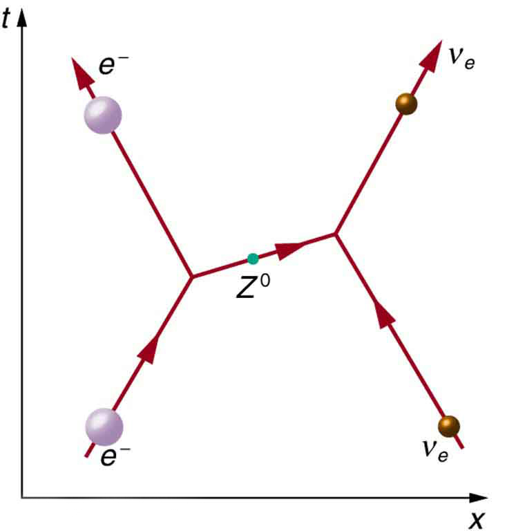
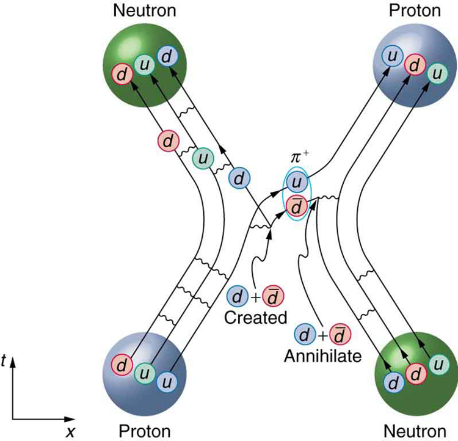

* State the grand unified theory.
* Explain the electroweak theory.
* Define gluons.
* Describe the principle of quantum chromodynamics.
* Define the standard model.

Present quests to show that the four basic forces are different manifestations of a single unified force follow a long tradition. In the 19th century, the distinct electric and magnetic forces were shown to be intimately connected and are now collectively called the electromagnetic force. More recently, the weak nuclear force has been shown to be connected to the electromagnetic force in a manner suggesting that a theory may be constructed in which all four forces are unified. Certainly, there are similarities in how forces are transmitted by the exchange of carrier particles, and the carrier particles themselves (the gauge bosons in [\[link\]](/m42674#import-auto-id1169736657305)) are also similar in important ways. The analogy to the unification of electric and magnetic forces is quite good—the four forces are distinct under normal circumstances, but there are hints of connections even on the atomic scale, and there may be conditions under which the forces are intimately related and even indistinguishable. The search for a correct theory linking the forces, called the **Grand Unified Theory (GUT)**{: data-type="term" #import-auto-id1169738148021}, is explored in this section in the realm of particle physics. [Frontiers of Physics](/m42683) expands the story in making a connection with cosmology, on the opposite end of the distance scale.

[\[link\]](#import-auto-id1169736611236) is a Feynman diagram showing how the weak nuclear force is transmitted by the carrier particle <math xmlns="http://www.w3.org/1998/Math/MathML"><semantics><mrow><mrow><msup><mi>Z</mi><mrow><mn>0</mn></mrow></msup></mrow><mrow /></mrow><annotation encoding="StarMath 5.0"> size 12{Z rSup { size 8{0} } } {}</annotation></semantics></math>

, similar to the diagrams in [\[link\]](/m42671#import-auto-id1169738052383) and [\[link\]](/m42671#import-auto-id1169737991710) for the electromagnetic and strong nuclear forces. In the 1960s, a gauge theory, called **electroweak theory**{: data-type="term" #import-auto-id1169737710958}, was developed by Steven Weinberg, Sheldon Glashow, and Abdus Salam and proposed that the electromagnetic and weak forces are identical at sufficiently high energies. One of its predictions, in addition to describing both electromagnetic and weak force phenomena, was the existence of the <math xmlns="http://www.w3.org/1998/Math/MathML"><semantics><mrow><mrow><mrow><msup><mi>W</mi><mrow><mrow><mo stretchy="false">+</mo><mrow /></mrow></mrow></msup><mi>,</mi><mi /><msup><mi>W</mi><mrow><mrow><mo stretchy="false">−</mo><mrow /></mrow></mrow></msup></mrow></mrow><mrow /></mrow></semantics></math>

, and <math xmlns="http://www.w3.org/1998/Math/MathML"><semantics><mrow><mrow><msup><mi>Z</mi><mrow><mn>0</mn></mrow></msup></mrow><mrow /></mrow></semantics></math>

 carrier particles. Not only were three particles having spin 1 predicted, the mass of the <math xmlns="http://www.w3.org/1998/Math/MathML"><semantics><mrow><mrow><msup><mi>W</mi><mrow><mrow><mo stretchy="false">+</mo></mrow></mrow></msup></mrow><mrow /></mrow></semantics></math>

 and <math xmlns="http://www.w3.org/1998/Math/MathML"><semantics><mrow><mrow><msup><mi>W</mi><mrow><mrow><mo stretchy="false">−</mo><mrow /></mrow></mrow></msup></mrow><mrow /></mrow></semantics></math>

 was predicted to be <math xmlns="http://www.w3.org/1998/Math/MathML"><semantics><mrow><mrow><mrow><mtext>81 GeV/</mtext><msup><mi>c</mi><mrow><mn>2</mn></mrow></msup></mrow></mrow><mrow /></mrow></semantics></math>

, and that of the <math xmlns="http://www.w3.org/1998/Math/MathML"><semantics><mrow><mrow><msup><mi>Z</mi><mrow><mn>0</mn></mrow></msup></mrow></mrow></semantics></math>

 was predicted to be <math xmlns="http://www.w3.org/1998/Math/MathML"><semantics><mrow><mrow><mrow><mtext>90 GeV/</mtext><msup><mi>c</mi><mrow><mn>2</mn></mrow></msup></mrow></mrow></mrow></semantics></math>

. (Their masses had to be about 1000 times that of the pion, or about <math xmlns="http://www.w3.org/1998/Math/MathML"><semantics><mrow><mrow><mrow><mtext>100 GeV/</mtext><msup><mi>c</mi><mrow><mn>2</mn></mrow></msup></mrow></mrow></mrow></semantics></math>

, since the range of the weak force is about 1000 times less than the strong force carried by virtual pions.) In 1983, these carrier particles were observed at CERN with the predicted characteristics, including masses having the predicted values as seen in [\[link\]](/m42674#import-auto-id1169736657305). This was another triumph of particle theory and experimental effort, resulting in the 1984 Nobel Prize to the experiment’s group leaders Carlo Rubbia and Simon van der Meer. Theorists Weinberg, Glashow, and Salam had already been honored with the 1979 Nobel Prize for other aspects of electroweak theory.

{: #import-auto-id1169736611236 data-media-type="image/jpg"}

Although the weak nuclear force is very short ranged ( <math xmlns="http://www.w3.org/1998/Math/MathML"> <msup> <mrow> <mn>&lt; 10</mn> </mrow> <mrow> <mo>–</mo> <mn>18</mn> </mrow> </msup> <mtext>  m</mtext> </math>

, as indicated in [\[link\]](/m42671#import-auto-id1169738010507)), its effects on atomic levels can be measured given the extreme precision of modern techniques. Since electrons spend some time in the nucleus, their energies are affected, and spectra can even indicate new aspects of the weak force, such as the possibility of other carrier particles. So systems many orders of magnitude larger than the range of the weak force supply evidence of electroweak unification in addition to evidence found at the particle scale.

**Gluons**{: data-type="term" #import-auto-id1169738218659} (<math xmlns="http://www.w3.org/1998/Math/MathML"><semantics><mrow><mrow><mi>g</mi></mrow><mrow /></mrow><annotation encoding="StarMath 5.0"> size 12{g} {}</annotation></semantics></math>

) are the proposed carrier particles for the strong nuclear force, although they are not directly observed. Like quarks, gluons may be confined to systems having a total color of white. Less is known about gluons than the fact that they are the carriers of the weak and certainly of the electromagnetic force. QCD theory calls for eight gluons, all massless and all spin 1. Six of the gluons carry a color and an anticolor, while two do not carry color, as illustrated in [\[link\]](#import-auto-id1169737711152)(a). There is indirect evidence of the existence of gluons in nucleons. When high-energy electrons are scattered from nucleons and evidence of quarks is seen, the momenta of the quarks are smaller than they would be if there were no gluons. That means that the gluons carrying force between quarks also carry some momentum, inferred by the already indirect quark momentum measurements. At any rate, the gluons carry color charge and can change the colors of quarks when exchanged, as seen in [\[link\]](#import-auto-id1169737711152)(b). In the figure, a red down quark interacts with a green strange quark by sending it a gluon. That gluon carries red away from the down quark and leaves it green, because it is an <math xmlns="http://www.w3.org/1998/Math/MathML"><semantics><mrow><mrow><mrow><mi>R</mi><mover accent="true"><mi>G</mi><mo stretchy="true">-</mo></mover></mrow></mrow><mrow /></mrow><annotation encoding="StarMath 5.0"> size 12{R { bar {G}}} {}</annotation></semantics></math>

 (red-antigreen) gluon. (Taking antigreen away leaves you green.) Its antigreenness kills the green in the strange quark, and its redness turns the quark red.

![The first image shows eight circles representing gluons. The first gluon is colored red and anti green, the second gluon is colored green and anti red, the third gluon is colored blue and anti red, the fourth gluon is colored red and anti blue, the fifth gluon is colored green and anti blue, and the sixth gluon is colored blue and anti green. The last two gluons are white. The second image shows a Feynman diagram in which time proceeds in along the vertical y axis and distance along the horizontal x axis. A red down quark and a green strange quark are approaching each other. They exchange a red and anti green gluon, then move apart, with the red down quark having changed to a green down quark and the green strange quark having changed to a red strange quark. ](../resources/Figure_34_06_02.jpg "In figure (a), the eight types of gluons that carry the strong nuclear force are divided into a group of six that carry color and a group of two that do not. Figure (b) shows that the exchange of gluons between quarks carries the strong force and may change the color of a quark."){: #import-auto-id1169737711152 data-media-type="image/jpg"}

The strong force is complicated, since observable particles that feel the strong force (hadrons) contain multiple quarks. [\[link\]](#import-auto-id1169737906132) shows the quark and gluon details of pion exchange between a proton and a neutron as illustrated earlier in [\[link\]](/m42669#import-auto-id1169737824808) and [\[link\]](/m42671#import-auto-id1169737991710). The quarks within the proton and neutron move along together exchanging gluons, until the proton and neutron get close together. As the <math xmlns="http://www.w3.org/1998/Math/MathML"><semantics><mrow><mrow><mi>u</mi></mrow><mrow /></mrow><annotation encoding="StarMath 5.0"> size 12{u} {}</annotation></semantics></math>

 quark leaves the proton, a gluon creates a pair of virtual particles, a <math xmlns="http://www.w3.org/1998/Math/MathML"><semantics><mrow><mrow><mi>d</mi></mrow><mrow /></mrow><annotation encoding="StarMath 5.0"> size 12{d} {}</annotation></semantics></math>

 quark and a <math xmlns="http://www.w3.org/1998/Math/MathML"><semantics><mrow><mrow><mover accent="true"><mi>d</mi><mo stretchy="true">-</mo></mover></mrow><mrow /></mrow><annotation encoding="StarMath 5.0"> size 12{ { bar {d}}} {}</annotation></semantics></math>

 antiquark. The <math xmlns="http://www.w3.org/1998/Math/MathML"><semantics><mrow><mrow><mi>d</mi></mrow><mrow /></mrow><annotation encoding="StarMath 5.0"> size 12{d} {}</annotation></semantics></math>

 quark stays behind and the proton turns into a neutron, while the <math xmlns="http://www.w3.org/1998/Math/MathML"><semantics><mrow><mrow><mi>u</mi></mrow><mrow /></mrow><annotation encoding="StarMath 5.0"> size 12{u} {}</annotation></semantics></math>

 and <math xmlns="http://www.w3.org/1998/Math/MathML"><semantics><mrow><mrow><mover accent="true"><mi>d</mi><mo stretchy="true">-</mo></mover></mrow><mrow /></mrow><annotation encoding="StarMath 5.0"> size 12{ { bar {d}}} {}</annotation></semantics></math>

 move together as a <math xmlns="http://www.w3.org/1998/Math/MathML"><semantics><mrow><mrow><msup><mi>π</mi><mrow><mrow><mo stretchy="false">+</mo><mrow /></mrow></mrow></msup></mrow><mrow /></mrow><annotation encoding="StarMath 5.0"> size 12{π rSup { size 8{+{}} } } {}</annotation></semantics></math>

 ([\[link\]](/m42678#import-auto-id1169737909561) confirms the <math xmlns="http://www.w3.org/1998/Math/MathML"><semantics><mrow><mrow><mrow><mi>u</mi><mover accent="true"><mi>d</mi><mo stretchy="true">-</mo></mover></mrow></mrow><mrow /></mrow><annotation encoding="StarMath 5.0"> size 12{u { bar {d}}} {}</annotation></semantics></math>

 composition for the <math xmlns="http://www.w3.org/1998/Math/MathML"><semantics><mrow><mrow><msup><mi>π</mi><mrow><mrow><mo stretchy="false">+</mo><mrow /></mrow></mrow></msup></mrow><mrow /></mrow><annotation encoding="StarMath 5.0"> size 12{π rSup { size 8{+{}} } } {}</annotation></semantics></math>

.) The <math xmlns="http://www.w3.org/1998/Math/MathML"><semantics><mrow><mrow><mover accent="true"><mi>d</mi><mo stretchy="true">-</mo></mover></mrow><mrow /></mrow><annotation encoding="StarMath 5.0"> size 12{ { bar {d}}} {}</annotation></semantics></math>

 annihilates a <math xmlns="http://www.w3.org/1998/Math/MathML"><semantics><mrow><mrow><mi>d</mi></mrow><mrow /></mrow><annotation encoding="StarMath 5.0"> size 12{d} {}</annotation></semantics></math>

 quark in the neutron, the <math xmlns="http://www.w3.org/1998/Math/MathML"><semantics><mrow><mrow><mi>u</mi></mrow><mrow /></mrow><annotation encoding="StarMath 5.0"> size 12{u} {}</annotation></semantics></math>

 joins the neutron, and the neutron becomes a proton. A pion is exchanged and a force is transmitted.

{: #import-auto-id1169737906132 data-media-type="image/jpg"}

It is beyond the scope of this text to go into more detail on the types of quark and gluon interactions that underlie the observable particles, but the theory (**quantum chromodynamics**{: data-type="term" #import-auto-id1169737869734} or QCD) is very self-consistent. So successful have QCD and the electroweak theory been that, taken together, they are called the **Standard Model**{: data-type="term" #import-auto-id1169738007161}. Advances in knowledge are expected to modify, but not overthrow, the Standard Model of particle physics and forces.

Making Connections: Unification of Forces

Grand Unified Theory (GUT) is successful in describing the four forces as distinct under normal circumstances, but connected in fundamental ways. Experiments have verified that the weak and electromagnetic force become identical at very small distances and provide the GUT description of the carrier particles for the forces. GUT predicts that the other forces become identical under conditions so extreme that they cannot be tested in the laboratory, although there may be lingering evidence of them in the evolution of the universe. GUT is also successful in describing a system of carrier particles for all four forces, but there is much to be done, particularly in the realm of gravity.

How can forces be unified? They are definitely distinct under most circumstances, for example, being carried by different particles and having greatly different strengths. But experiments show that at extremely small distances, the strengths of the forces begin to become more similar. In fact, electroweak theory’s prediction of the <math xmlns="http://www.w3.org/1998/Math/MathML"> <msup> <mi>W</mi> <mo>+</mo> </msup> </math>

, <math xmlns="http://www.w3.org/1998/Math/MathML"> <msup> <mi>W</mi> <mo>-</mo> </msup> </math>

, and <math xmlns="http://www.w3.org/1998/Math/MathML"><semantics><mrow><mrow><msup><mi>Z</mi><mrow><mn>0</mn></mrow></msup></mrow><mrow /></mrow><annotation encoding="StarMath 5.0"> size 12{Z rSup { size 8{0} } } {}</annotation></semantics></math>

 carrier particles was based on the strengths of the two forces being identical at extremely small distances as seen in [\[link\]](#import-auto-id1169738128124). As discussed in case of the creation of virtual particles for extremely short times, the small distances or short ranges correspond to the large masses of the carrier particles and the correspondingly large energies needed to create them. Thus, the energy scale on the horizontal axis of [\[link\]](#import-auto-id1169738128124) corresponds to smaller and smaller distances, with 100 GeV corresponding to approximately, <math xmlns="http://www.w3.org/1998/Math/MathML"> <msup> <mrow> <mn>10</mn> </mrow> <mrow> <mo>-</mo> <mn>18</mn> </mrow> </msup> <mtext>m</mtext> </math>

 for example. At that distance, the strengths of the EM and weak forces are the same. To test physics at that distance, energies of about 100 GeV must be put into the system, and that is sufficient to create and release the <math xmlns="http://www.w3.org/1998/Math/MathML"> <msup> <mi>W</mi> <mo>+</mo> </msup> </math>

, <math xmlns="http://www.w3.org/1998/Math/MathML"> <msup> <mi>W</mi> <mo>-</mo> </msup> </math>

, and <math xmlns="http://www.w3.org/1998/Math/MathML"><semantics><mrow><mrow><msup><mi>Z</mi><mrow><mn>0</mn></mrow></msup></mrow><mrow /></mrow><annotation encoding="StarMath 5.0"> size 12{Z rSup { size 8{0} } } {}</annotation></semantics></math>

 carrier particles. At those and higher energies, the masses of the carrier particles becomes less and less relevant, and the <math xmlns="http://www.w3.org/1998/Math/MathML"><semantics><mrow><mrow><msup><mi>Z</mi><mrow><mn>0</mn></mrow></msup></mrow><mrow /></mrow><annotation encoding="StarMath 5.0"> size 12{Z rSup { size 8{0} } } {}</annotation></semantics></math>

 in particular resembles the massless, chargeless, spin 1 photon. In fact, there is enough energy when things are pushed to even smaller distances to transform the, and <math xmlns="http://www.w3.org/1998/Math/MathML"><semantics><mrow><mrow><msup><mi>Z</mi><mrow><mn>0</mn></mrow></msup></mrow><mrow /></mrow><annotation encoding="StarMath 5.0"> size 12{Z rSup { size 8{0} } } {}</annotation></semantics></math>

 into massless carrier particles more similar to photons and gluons. These have not been observed experimentally, but there is a prediction of an associated particle called the **Higgs boson**{: data-type="term"}. The mass of this particle is not predicted with nearly the certainty with which the mass of the <math xmlns="http://www.w3.org/1998/Math/MathML"><semantics><mrow><mrow><mrow><msup><mi>W</mi><mrow><mrow><mo stretchy="false">+</mo><mrow /></mrow></mrow></msup><mi>,</mi><mspace width="0.25em" /><msup><mi>W</mi><mrow><mrow><mo stretchy="false">−</mo><mrow /></mrow></mrow></msup></mrow><mo>,</mo></mrow><mrow /></mrow></semantics></math>

 and <math xmlns="http://www.w3.org/1998/Math/MathML"><semantics><mrow><mrow><msup><mi>Z</mi><mrow><mn>0</mn></mrow></msup></mrow><mrow /></mrow><annotation encoding="StarMath 5.0"> size 12{Z rSup { size 8{0} } } {}</annotation></semantics></math>

 particles were predicted, but it was hoped that the Higgs boson could be observed at the now-canceled Superconducting Super Collider (SSC). Ongoing experiments at the Large Hadron Collider at CERN have presented some evidence for a Higgs boson with a mass of 125 GeV, and there is a possibility of a direct discovery during 2012. The existence of this more massive particle would give validity to the theory that the carrier particles are identical under certain circumstances.

![The figure shows a graph with the strength of four basics forces plotted along the y axis and energy plotted along the x axis in giga electron volts. Near zero giga electron volts, the difference in forces is large. Gravity is the weakest force, followed by the weak force, then the electromagnetic force, and finally the strong force is the strongest. At about one hundred giga electron volts, the curves for the electromagnetic and weak force combine to become the electroweak force, but gravity remains weaker and the strong force remains stronger. Near ten to the fifteen giga electron volts, the electroweak force combines with the strong force at a point labeled G U T. Finally, at about ten to the nineteenth giga electron volts, gravity is combined with the electroweak plus strong force at a point labeled T O E.](../resources/Figure_34_06_04.jpg "The relative strengths of the four basic forces vary with distance and, hence, energy is needed to probe small distances. At ordinary energies (a few eV or less), the forces differ greatly as indicated in [link]. However, at energies available at accelerators, the weak and EM forces become identical, or unified. Unfortunately, the energies at which the strong and electroweak forces become the same are unreachable even in principle at any conceivable accelerator. The universe may provide a laboratory, and nature may show effects at ordinary energies that give us clues about the validity of this graph."){: #import-auto-id1169738128124 data-media-type="image/jpg"}

The small distances and high energies at which the electroweak force becomes identical with the strong nuclear force are not reachable with any conceivable human-built accelerator. At energies of about <math xmlns="http://www.w3.org/1998/Math/MathML"><semantics><mrow><mrow><mrow><msup><mtext>10</mtext><mrow><mtext>14</mtext></mrow></msup><mspace width="0.25em" /><mtext>GeV</mtext></mrow></mrow><mrow /></mrow><annotation encoding="StarMath 5.0"> size 12{"10" rSup { size 8{"14"} } `"GeV"} {}</annotation></semantics></math>

 (16,000 J per particle), distances of about <math xmlns="http://www.w3.org/1998/Math/MathML"><semantics><mrow><mrow><mrow><msup><mtext>10</mtext><mrow><mrow><mo stretchy="false">−</mo><mtext>30</mtext></mrow></mrow></msup><mspace width="0.25em" /><mtext>m</mtext></mrow></mrow><mrow /></mrow><annotation encoding="StarMath 5.0"> size 12{"10" rSup { size 8{ - "30"} } `m} {}</annotation></semantics></math>

 can be probed. Such energies are needed to test theory directly, but these are about <math xmlns="http://www.w3.org/1998/Math/MathML"><semantics><mrow><mrow><msup><mtext>10</mtext><mrow><mtext>10</mtext></mrow></msup></mrow><mrow /></mrow><annotation encoding="StarMath 5.0"> size 12{"10" rSup { size 8{"10"} } } {}</annotation></semantics></math>

 higher than the proposed giant SSC would have had, and the distances are about <math xmlns="http://www.w3.org/1998/Math/MathML"><semantics><mrow><mrow><msup><mtext>10</mtext><mrow><mrow><mo stretchy="false">−</mo><mtext>12</mtext></mrow></mrow></msup></mrow><mrow /></mrow><annotation encoding="StarMath 5.0"> size 12{"10" rSup { size 8{ - "12"} } } {}</annotation></semantics></math>

 smaller than any structure we have direct knowledge of. This would be the realm of various GUTs, of which there are many since there is no constraining evidence at these energies and distances. Past experience has shown that any time you probe so many orders of magnitude further (here, about <math xmlns="http://www.w3.org/1998/Math/MathML"><semantics><mrow><mrow><msup><mtext>10</mtext><mrow><mtext>12</mtext></mrow></msup></mrow><mrow /></mrow><annotation encoding="StarMath 5.0"> size 12{"10" rSup { size 8{"12"} } } {}</annotation></semantics></math>

), you find the unexpected. Even more extreme are the energies and distances at which gravity is thought to unify with the other forces in a TOE. Most speculative and least constrained by experiment are TOEs, one of which is called **Superstring theory**{: data-type="term" #import-auto-id1169737993458}. Superstrings are entities that are <math xmlns="http://www.w3.org/1998/Math/MathML"><semantics><mrow><mrow><mrow><msup><mtext>10</mtext><mrow><mrow><mo stretchy="false">−</mo><mtext>35</mtext></mrow></mrow></msup><mspace width="0.25em" /><mtext>m</mtext></mrow></mrow><mrow /></mrow><annotation encoding="StarMath 5.0"> size 12{"10" rSup { size 8{ - "35"} } `m} {}</annotation></semantics></math>

 in scale and act like one-dimensional oscillating strings and are also proposed to underlie all particles, forces, and space itself.

At the energy of GUTs, the carrier particles of the weak force would become massless and identical to gluons. If that happens, then both lepton and baryon conservation would be violated. We do not see such violations, because we do not encounter such energies. However, there is a tiny probability that, at ordinary energies, the virtual particles that violate the conservation of baryon number may exist for extremely small amounts of time (corresponding to very small ranges). All GUTs thus predict that the proton should be unstable, but would decay with an extremely long lifetime of about <math xmlns="http://www.w3.org/1998/Math/MathML"><semantics><mrow><mrow><mrow><msup><mtext>10</mtext><mrow><mtext>31</mtext></mrow></msup><mspace width="0.25em" /><mtext>y</mtext></mrow></mrow><mrow /></mrow><annotation encoding="StarMath 5.0"> size 12{"10" rSup { size 8{"31"} } `y} {}</annotation></semantics></math>

. The predicted decay mode is

<math xmlns="http://www.w3.org/1998/Math/MathML"><semantics><mrow><mrow><mrow><mi>p</mi><mo stretchy="false">→</mo><mrow><msup><mi>π</mi><mrow><mn>0</mn></mrow></msup><mo stretchy="false">+</mo><msup><mi>e</mi><mrow><mrow><mo stretchy="false">+</mo><mrow /></mrow></mrow></msup></mrow></mrow></mrow><mrow /></mrow><annotation encoding="StarMath 5.0"> size 12{p rightarrow π rSup { size 8{0} } +e rSup { size 8{+{}} } } {}</annotation></semantics><mtext>, (proposed proton decay)</mtext></math>

which violates both conservation of baryon number and electron family number. Although <math xmlns="http://www.w3.org/1998/Math/MathML"><semantics><mrow><mrow><mrow><msup><mtext>10</mtext><mrow><mtext>31</mtext></mrow></msup><mspace width="0.25em" /><mtext>y</mtext></mrow></mrow><mrow /></mrow><annotation encoding="StarMath 5.0"> size 12{"10" rSup { size 8{"31"} } `y} {}</annotation></semantics></math>

 is an extremely long time (about <math xmlns="http://www.w3.org/1998/Math/MathML"><semantics><mrow><mrow><msup><mtext>10</mtext><mrow><mtext>21</mtext></mrow></msup></mrow><mrow /></mrow></semantics></math>

 times the age of the universe), there are a lot of protons, and detectors have been constructed to look for the proposed decay mode as seen in [\[link\]](#import-auto-id1169737910782). It is somewhat comforting that proton decay has not been detected, and its experimental lifetime is now greater than <math xmlns="http://www.w3.org/1998/Math/MathML"><semantics><mrow><mrow><mrow><mrow><mn>5</mn><mo stretchy="false">×</mo><msup><mtext>10</mtext><mrow><mtext>32</mtext></mrow></msup></mrow><mspace width="0.25em" /><mtext>y</mtext></mrow></mrow><mrow /></mrow></semantics></math>

. This does not prove GUTs wrong, but it does place greater constraints on the theories, benefiting theorists in many ways.

From looking increasingly inward at smaller details for direct evidence of electroweak theory and GUTs, we turn around and look to the universe for evidence of the unification of forces. In the 1920s, the expansion of the universe was discovered. Thinking backward in time, the universe must once have been very small, dense, and extremely hot. At a tiny fraction of a second after the fabled Big Bang, forces would have been unified and may have left their fingerprint on the existing universe. This, one of the most exciting forefronts of physics, is the subject of [Frontiers of Physics](/m42683).

 "){: #import-auto-id1169737910782 data-media-type="image/jpg"}

# Summary

* {: #import-auto-id1169736649095} Attempts to show unification of the four forces are called Grand Unified Theories (GUTs) and have been partially successful, with connections proven between EM and weak forces in electroweak theory.
* {: #import-auto-id1169737895017} The strong force is carried by eight proposed particles called gluons, which are intimately connected to a quantum number called color—their governing theory is thus called quantum chromodynamics (QCD). Taken together, QCD and the electroweak theory are widely accepted as the Standard Model of particle physics.
* {: #import-auto-id1169737906347} Unification of the strong force is expected at such high energies that it cannot be directly tested, but it may have observable consequences in the as-yet unobserved decay of the proton and topics to be discussed in the next chapter. Although unification of forces is generally anticipated, much remains to be done to prove its validity.

# Conceptual Questions

If a GUT is proven, and the four forces are unified, it will still be correct to say that the orbit of the moon is determined by the gravitational force. Explain why.

If the Higgs boson is discovered and found to have mass, will it be considered the ultimate carrier of the weak force? Explain your response.

Gluons and the photon are massless. Does this imply that the <math xmlns="http://www.w3.org/1998/Math/MathML"><semantics><mrow><mrow><msup><mi>W</mi><mrow><mrow><mo stretchy="false">+</mo><mrow /></mrow></mrow></msup></mrow><mrow /></mrow><annotation encoding="StarMath 5.0"> size 12{W rSup { size 8{+{}} } } {}</annotation></semantics></math>

, <math xmlns="http://www.w3.org/1998/Math/MathML"><semantics><mrow><mrow><msup><mi>W</mi><mrow><mrow><mo stretchy="false">−</mo><mrow /></mrow></mrow></msup></mrow><mrow /></mrow><annotation encoding="StarMath 5.0"> size 12{W rSup { size 8{ - {}} } } {}</annotation></semantics></math>

, and <math xmlns="http://www.w3.org/1998/Math/MathML"><semantics><mrow><mrow><msup><mi>Z</mi><mrow><mn>0</mn></mrow></msup></mrow><mrow /></mrow><annotation encoding="StarMath 5.0"> size 12{Z rSup { size 8{0} } } {}</annotation></semantics></math>

 are the ultimate carriers of the weak force?

# Problems &amp; Exercises   {#eip-130}

**Integrated Concepts**

The intensity of cosmic ray radiation decreases rapidly with increasing energy, but there are occasionally extremely energetic cosmic rays that create a shower of radiation from all the particles they create by striking a nucleus in the atmosphere as seen in the figure given below. Suppose a cosmic ray particle having an energy of <math xmlns="http://www.w3.org/1998/Math/MathML"><semantics><mrow><mrow><mrow><msup><mtext>10</mtext><mrow><mtext>10</mtext></mrow></msup><mspace width="0.25em" /><mtext>GeV</mtext></mrow></mrow><mrow /></mrow></semantics></math>

 converts its energy into particles with masses averaging <math xmlns="http://www.w3.org/1998/Math/MathML"><semantics><mrow><mrow><mrow><mtext>200</mtext><mspace width="0.25em" /><mtext>MeV/</mtext><msup><mi>c</mi><mrow><mn>2</mn></mrow></msup></mrow></mrow></mrow></semantics></math>

. (a) How many particles are created? (b) If the particles rain down on a <math xmlns="http://www.w3.org/1998/Math/MathML"><semantics><mrow><mrow><mrow><mn>1</mn><mtext>.</mtext><msup><mtext>00-km</mtext><mrow><mn>2</mn></mrow></msup></mrow></mrow><mrow /></mrow></semantics></math>

 area, how many particles are there per square meter?

 and, after multiple collisions, huge numbers of particles are created from this energy. Cosmic ray showers have been observed to extend over many square kilometers.&#10;      "){: #import-auto-id1169737713107 data-media-type="image/jpg"}

(a) <math xmlns="http://www.w3.org/1998/Math/MathML"><semantics><mrow><mrow><mrow><mn>5</mn><mrow><mo stretchy="false">×</mo><msup><mtext>10</mtext><mrow><mtext>10</mtext></mrow></msup></mrow></mrow></mrow><mrow /></mrow><annotation encoding="StarMath 5.0"> size 12{5 times "10" rSup { size 8{"10"} } } {}</annotation></semantics></math>

(b) <math xmlns="http://www.w3.org/1998/Math/MathML"><semantics><mrow><mrow><mrow><mn>5</mn><mrow><mo stretchy="false">×</mo><msup><mtext>10</mtext><mrow><mn>4</mn></mrow></msup></mrow><mspace width="0.25em" /><msup><mtext>particles/m</mtext><mrow><mn>2</mn></mrow></msup></mrow></mrow><mrow /></mrow></semantics></math>

**Integrated Concepts**

Assuming conservation of momentum, what is the energy of each <math xmlns="http://www.w3.org/1998/Math/MathML"><semantics><mrow><mrow><mi>γ</mi></mrow><mrow /></mrow><annotation encoding="StarMath 5.0"> size 12{γ} {}</annotation></semantics></math>

 ray produced in the decay of a neutral at rest pion, in the reaction <math xmlns="http://www.w3.org/1998/Math/MathML"><semantics><mrow><mrow><mrow><msup><mi>π</mi><mrow><mn>0</mn></mrow></msup><mo stretchy="false">→</mo><mrow><mi>γ</mi><mo stretchy="false">+</mo><mi>γ</mi></mrow></mrow></mrow><mrow /></mrow><annotation encoding="StarMath 5.0"> size 12{π rSup { size 8{0} } rightarrow γ+γ} {}</annotation></semantics></math>

?

**Integrated Concepts**

What is the wavelength of a 50-GeV electron, which is produced at SLAC? This provides an idea of the limit to the detail it can probe.

<math xmlns="http://www.w3.org/1998/Math/MathML"> <semantics> <mrow> <mrow> <mrow> <mrow> <mn>2.5</mn> <mo stretchy="false">×</mo> <msup> <mtext>10</mtext> <mrow> <mrow> <mo stretchy="false">−</mo> <mtext>17</mtext> </mrow> </mrow> </msup> </mrow> <mspace width="0.25em" /> <mtext>m</mtext> </mrow> </mrow> <mrow /> </mrow> <annotation encoding="StarMath 5.0"> size 12{2 "." 5 times "10" rSup { size 8{ - "17"} } `m} {}</annotation> </semantics> </math>

**Integrated Concepts**

(a) Calculate the relativistic quantity <math xmlns="http://www.w3.org/1998/Math/MathML"><semantics><mrow><mrow><mrow><mi>γ</mi><mo stretchy="false">=</mo><mfrac><mn>1</mn><msqrt><mrow><mn>1</mn><mo stretchy="false">−</mo><mrow><msup><mi>v</mi><mrow><mn>2</mn></mrow></msup><mo stretchy="false">/</mo><msup><mi>c</mi><mrow><mn>2</mn></mrow></msup></mrow></mrow></msqrt></mfrac></mrow></mrow><mrow /></mrow><annotation encoding="StarMath 5.0"> size 12{γ= { {1} over { sqrt {1 - v rSup { size 8{2} } /c rSup { size 8{2} } } } } } {}</annotation></semantics></math>

 for 1.00-TeV protons produced at Fermilab. (b) If such a proton created a <math xmlns="http://www.w3.org/1998/Math/MathML"><semantics><mrow><mrow><msup><mi>π</mi><mrow><mrow><mo stretchy="false">+</mo><mrow /></mrow></mrow></msup></mrow><mrow /></mrow><annotation encoding="StarMath 5.0"> size 12{π rSup { size 8{+{}} } } {}</annotation></semantics></math>

 having the same speed, how long would its life be in the laboratory? (c) How far could it travel in this time?

**Integrated Concepts**

The primary decay mode for the negative pion is <math xmlns="http://www.w3.org/1998/Math/MathML"><semantics><mrow><mrow><mrow><msup><mi>π</mi><mrow><mrow><mo stretchy="false">−</mo><mrow /></mrow></mrow></msup><mo stretchy="false">→</mo><mrow><msup><mi>μ</mi><mrow><mrow><mo stretchy="false">−</mo><mrow /></mrow></mrow></msup><mo stretchy="false">+</mo><msub><mover accent="true"><mi>ν</mi><mo stretchy="true">-</mo></mover><mrow><mi>μ</mi></mrow></msub></mrow></mrow></mrow><mrow /></mrow><annotation encoding="StarMath 5.0"> size 12{π rSup { size 8{ - {}} } rightarrow μ rSup { size 8{ - {}} } + { bar {ν}} rSub { size 8{μ} } } {}</annotation></semantics></math>

. (a) What is the energy release in MeV in this decay? (b) Using conservation of momentum, how much energy does each of the decay products receive, given the <math xmlns="http://www.w3.org/1998/Math/MathML"><semantics><mrow><mrow><msup><mi>π</mi><mrow><mrow><mo stretchy="false">−</mo><mrow /></mrow></mrow></msup></mrow><mrow /></mrow><annotation encoding="StarMath 5.0"> size 12{π rSup { size 8{ - {}} } } {}</annotation></semantics></math>

 is at rest when it decays? You may assume the muon antineutrino is massless and has momentum <math xmlns="http://www.w3.org/1998/Math/MathML"><semantics><mrow><mrow><mrow><mi>p</mi><mo stretchy="false">=</mo><mrow><mi>E</mi><mo stretchy="false">/</mo><mi>c</mi></mrow></mrow></mrow><mrow /></mrow><annotation encoding="StarMath 5.0"> size 12{p=E/c} {}</annotation></semantics></math>

, just like a photon.

(a) 33.9 MeV

(b) Muon antineutrino 29.8 MeV, muon 4.1 MeV (kinetic energy)

**Integrated Concepts**

Plans for an accelerator that produces a secondary beam of *K*-mesons to scatter from nuclei, for the purpose of studying the strong force, call for them to have a kinetic energy of 500 MeV. (a) What would the relativistic quantity <math xmlns="http://www.w3.org/1998/Math/MathML"><semantics><mrow><mrow><mrow><mi>γ</mi><mo stretchy="false">=</mo><mfrac><mn>1</mn><msqrt><mrow><mn>1</mn><mo stretchy="false">−</mo><mrow><msup><mi>v</mi><mrow><mn>2</mn></mrow></msup><mo stretchy="false">/</mo><msup><mi>c</mi><mrow><mn>2</mn></mrow></msup></mrow></mrow></msqrt></mfrac></mrow></mrow><mrow /></mrow><annotation encoding="StarMath 5.0"> size 12{γ= { {1} over { sqrt {1 - v rSup { size 8{2} } /c rSup { size 8{2} } } } } } {}</annotation></semantics></math>

 be for these particles? (b) How long would their average lifetime be in the laboratory? (c) How far could they travel in this time?

**Integrated Concepts**

Suppose you are designing a proton decay experiment and you can detect 50 percent of the proton decays in a tank of water. (a) How many kilograms of water would you need to see one decay per month, assuming a lifetime of <math xmlns="http://www.w3.org/1998/Math/MathML"><semantics><mrow><mrow><mrow><msup><mtext>10</mtext><mrow><mtext>31</mtext></mrow></msup><mspace width="0.25em" /><mtext>y</mtext></mrow></mrow><mrow /></mrow></semantics></math>

? (b) How many cubic meters of water is this? (c) If the actual lifetime is <math xmlns="http://www.w3.org/1998/Math/MathML"><semantics><mrow><mrow><mrow><msup><mtext>10</mtext><mrow><mtext>33</mtext></mrow></msup><mspace width="0.25em" /><mtext>y</mtext></mrow></mrow><mrow /></mrow></semantics></math>

, how long would you have to wait on an average to see a single proton decay?

(a) <math xmlns="http://www.w3.org/1998/Math/MathML"><semantics><mrow><mrow><mrow><mn>7</mn><mtext>.</mtext><mrow><mn>2</mn><mo stretchy="false">×</mo><msup><mtext>10</mtext><mrow><mn>5</mn></mrow></msup></mrow><mspace width="0.25em" /><mtext>kg</mtext></mrow></mrow><mrow /></mrow><annotation encoding="StarMath 5.0"> size 12{7 "." 2 times "10" rSup { size 8{5} } `"kg"} {}</annotation></semantics></math>

(b) <math xmlns="http://www.w3.org/1998/Math/MathML"><semantics><mrow><mrow><mrow><mn>7</mn><mtext>.</mtext><mrow><mn>2</mn><mo stretchy="false">×</mo><msup><mtext>10</mtext><mrow><mn>2</mn></mrow></msup></mrow><mspace width="0.25em" /><msup><mtext>m</mtext><mrow><mn>3</mn></mrow></msup></mrow></mrow><mrow /></mrow><annotation encoding="StarMath 5.0"> size 12{7 "." 2 times "10" rSup { size 8{2} } `m rSup { size 8{3} } } {}</annotation></semantics></math>

(c) <math xmlns="http://www.w3.org/1998/Math/MathML"><semantics><mrow><mrow><mtext>100 months</mtext></mrow><mrow /></mrow><annotation encoding="StarMath 5.0"> size 12{"100 months"} {}</annotation></semantics></math>

**Integrated Concepts**

In supernovas, neutrinos are produced in huge amounts. They were detected from the 1987A supernova in the Magellanic Cloud, which is about 120,000 light years away from the Earth (relatively close to our Milky Way galaxy). If neutrinos have a mass, they cannot travel at the speed of light, but if their mass is small, they can get close. (a) Suppose a neutrino with a <math xmlns="http://www.w3.org/1998/Math/MathML"><semantics><mrow><mrow><mrow><mn>7</mn><mtext>-eV/</mtext><msup><mi>c</mi><mrow><mn>2</mn></mrow></msup></mrow></mrow><mrow /></mrow><annotation encoding="StarMath 5.0"> size 12{7"-eV/"c rSup { size 8{2} } } {}</annotation></semantics></math>

 mass has a kinetic energy of 700 keV. Find the relativistic quantity <math xmlns="http://www.w3.org/1998/Math/MathML"><semantics><mrow><mrow><mrow><mi>γ</mi><mo stretchy="false">=</mo><mfrac><mn>1</mn><msqrt><mrow><mn>1</mn><mo stretchy="false">−</mo><mrow><msup><mi>v</mi><mrow><mn>2</mn></mrow></msup><mo stretchy="false">/</mo><msup><mi>c</mi><mrow><mn>2</mn></mrow></msup></mrow></mrow></msqrt></mfrac></mrow></mrow><mrow /></mrow><annotation encoding="StarMath 5.0"> size 12{γ= { {1} over { sqrt {1 - v rSup { size 8{2} } /c rSup { size 8{2} } } } } } {}</annotation></semantics></math>

 for it. (b) If the neutrino leaves the 1987A supernova at the same time as a photon and both travel to Earth, how much sooner does the photon arrive? This is not a large time difference, given that it is impossible to know which neutrino left with which photon and the poor efficiency of the neutrino detectors. Thus, the fact that neutrinos were observed within hours of the brightening of the supernova only places an upper limit on the neutrino’s mass. (Hint: You may need to use a series expansion to find *v* for the neutrino, since its <math xmlns="http://www.w3.org/1998/Math/MathML"><semantics><mrow><mrow><mi>γ</mi></mrow><mrow /></mrow><annotation encoding="StarMath 5.0"> size 12{γ} {}</annotation></semantics></math>

 is so large.)

**Construct Your Own Problem** 

Consider an ultrahigh-energy cosmic ray entering the Earth’s atmosphere (some have energies approaching a joule). Construct a problem in which you calculate the energy of the particle based on the number of particles in an observed cosmic ray shower. Among the things to consider are the average mass of the shower particles, the average number per square meter, and the extent (number of square meters covered) of the shower. Express the energy in eV and joules.

**Construct Your Own Problem** 

Consider a detector needed to observe the proposed, but extremely rare, decay of an electron. Construct a problem in which you calculate the amount of matter needed in the detector to be able to observe the decay, assuming that it has a signature that is clearly identifiable. Among the things to consider are the estimated half life (long for rare events), and the number of decays per unit time that you wish to observe, as well as the number of electrons in the detector substance.

