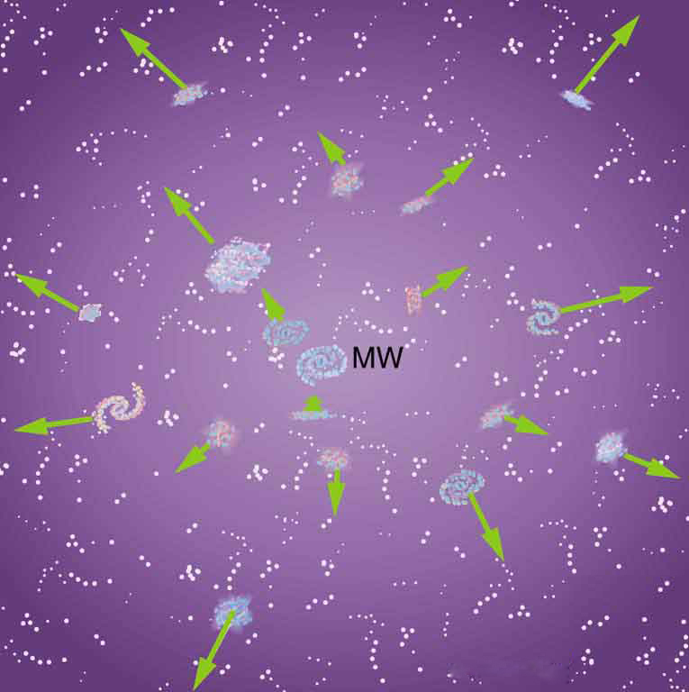

* Discuss the expansion of the universe.
* Explain the Big Bang.

Look at the sky on some clear night when you are away from city lights. There you will see thousands of individual stars and a faint glowing background of millions more. The Milky Way, as it has been called since ancient times, is an arm of our galaxy of stars—the word *galaxy* coming from the Greek word *galaxias*, meaning milky. We know a great deal about our Milky Way galaxy and of the billions of other galaxies beyond its fringes. But they still provoke wonder and awe (see [\[link\]](#import-auto-id1169738110906)). And there are still many questions to be answered. Most remarkable when we view the universe on the large scale is that once again explanations of its character and evolution are tied to the very small scale. Particle physics and the questions being asked about the very small scales may also have their answers in the very large scales.

  and E. Ofek (Caltech))"){: #import-auto-id1169738110906 data-media-type="image/png"}

As has been noted in numerous Things Great and Small vignettes, this is not the first time the large has been explained by the small and vice versa. Newton realized that the nature of gravity on Earth that pulls an apple to the ground could explain the motion of the moon and planets so much farther away. Minute atoms and molecules explain the chemistry of substances on a much larger scale. Decays of tiny nuclei explain the hot interior of the Earth. Fusion of nuclei likewise explains the energy of stars. Today, the patterns in particle physics seem to be explaining the evolution and character of the universe. And the nature of the universe has implications for unexplored regions of particle physics.

**Cosmology**{: data-type="term" #import-auto-id1169737796458} is the study of the character and evolution of the universe. What are the major characteristics of the universe as we know them today? First, there are approximately <math xmlns="http://www.w3.org/1998/Math/MathML"><semantics><mrow><mrow><msup><mtext>10</mtext><mrow><mtext>11</mtext></mrow></msup></mrow><mrow /></mrow><annotation encoding="StarMath 5.0"> size 12{"10" rSup { size 8{"11"} } } {}</annotation></semantics></math>

 galaxies in the observable part of the universe. An average galaxy contains more than <math xmlns="http://www.w3.org/1998/Math/MathML"><semantics><mrow><mrow><msup><mtext>10</mtext><mrow><mtext>11</mtext></mrow></msup></mrow><mrow /></mrow><annotation encoding="StarMath 5.0"> size 12{"10" rSup { size 8{"11"} } } {}</annotation></semantics></math>

 stars, with our Milky Way galaxy being larger than average, both in its number of stars and its dimensions. Ours is a spiral-shaped galaxy with a diameter of about 100,000 light years and a thickness of about 2000 light years in the arms with a central bulge about 10,000 light years across. The Sun lies about 30,000 light years from the center near the galactic plane. There are significant clouds of gas, and there is a halo of less-dense regions of stars surrounding the main body. (See [\[link\]](#fs-id1690621).) Evidence strongly suggests the existence of a large amount of additional matter in galaxies that does not produce light—the mysterious dark matter we shall later discuss.

![The figure contains three images of the Milky Way galaxy. The first is a side view from outer space and shows a long thin grouping of bright stars against a black background. In the middle of this thin line of stars is a bright yellow ball that looks a bit like an egg yolk in the middle of the egg white. The length of the thin line is given as one hundred thousand light years and it thickness is given as two thousand light years. The diameter of the egg-yolk-like cluster in the middle is given as ten thousand light years. Thirty thousand light years to the left of the center of the egg yolk is the Sun. The second image is a view from above of the Milky Way galaxy and shows several spiral arms twisting outward from the center egg-yolk form. The last image is a photograph from Earth of the Milky Way galaxy in the nighttime sky. It shows a dusting of stars in the sky, with a slight concentration of star dust forming a horizontal stripe across the image.](../resources/Figure_35_01_02a.jpg "The Milky Way galaxy is typical of large spiral galaxies in its size, its shape, and the presence of gas and dust. We are fortunate to be in a location where we can see out of the galaxy and observe the vastly larger and fascinating universe around us. (a) Side view. (b) View from above. (c) The Milky Way as seen from Earth. (credits: (a) NASA, (b) Nick Risinger, (c) Andy)"){: data-media-type="image/png"}

Distances are great even within our galaxy and are measured in light years (the distance traveled by light in one year). The average distance between galaxies is on the order of a million light years, but it varies greatly with galaxies forming clusters such as shown in [\[link\]](#import-auto-id1169738110906). The Magellanic Clouds, for example, are small galaxies close to our own, some 160,000 light years from Earth. The Andromeda galaxy is a large spiral galaxy like ours and lies 2 million light years away. It is just visible to the naked eye as an extended glow in the Andromeda constellation. Andromeda is the closest large galaxy in our local group, and we can see some individual stars in it with our larger telescopes. The most distant known galaxy is 14 billion light years from Earth—a truly incredible distance. (See [\[link\]](#fs-id1021650).)

![The first image shows a shining spiral cloud of light and dust. The second image contains three sub images. The first is a large scale view of numerous points of lights and light clouds against a black background. A small square appears in the upper left of the image, and the second image is the zoom-in of this square. In the center of this second image appears a small red dot, which is again boxed in by a square. The third image shows a zoomed-in view of the square from the second image and shows a hazy picture of a circular bright spot surrounded by darker regions.](../resources/Figure_35_01_03a.jpg "(a) Andromeda is the closest large galaxy, at 2 million light years distance, and is very similar to our Milky Way. The blue regions harbor young and emerging stars, while dark streaks are vast clouds of gas and dust. A smaller satellite galaxy is clearly visible. (b) The box indicates what may be the most distant known galaxy, estimated to be 13 billion light years from us. It exists in a much older part of the universe. (credit: NASA, ESA, G. Illingworth (University of California, Santa Cruz), R. Bouwens (University of California, Santa Cruz and Leiden University), and the HUDF09 Team)&#10;  "){: data-media-type="image/jpeg"}

Consider the fact that the light we receive from these vast distances has been on its way to us for a long time. In fact, the time in years is the same as the distance in light years. For example, the Andromeda galaxy is 2 million light years away, so that the light now reaching us left it 2 million years ago. If we could be there now, Andromeda would be different. Similarly, light from the most distant galaxy left it 14 billion years ago. We have an incredible view of the past when looking great distances. We can try to see if the universe was different then—if distant galaxies are more tightly packed or have younger-looking stars, for example, than closer galaxies, in which case there has been an evolution in time. But the problem is that the uncertainties in our data are great. Cosmology is almost typified by these large uncertainties, so that we must be especially cautious in drawing conclusions. One consequence is that there are more questions than answers, and so there are many competing theories. Another consequence is that any hard data produce a major result. Discoveries of some importance are being made on a regular basis, the hallmark of a field in its golden age.

Perhaps the most important characteristic of the universe is that all galaxies except those in our local cluster seem to be moving away from us at speeds proportional to their distance from our galaxy. It looks as if a gigantic explosion, universally called the **Big Bang**{: data-type="term" #import-auto-id1169737895549}, threw matter out some billions of years ago. This amazing conclusion is based on the pioneering work of Edwin Hubble (1889–1953), the American astronomer. In the 1920s, Hubble first demonstrated conclusively that other galaxies, many previously called nebulae or clouds of stars, were outside our own. He then found that all but the closest galaxies have a red shift in their hydrogen spectra that is proportional to their distance. The explanation is that there is a **cosmological red shift**{: data-type="term" #import-auto-id1169737754225} due to the expansion of space itself. The photon wavelength is stretched in transit from the source to the observer. Double the distance, and the red shift is doubled. While this cosmological red shift is often called a Doppler shift, it is not—space itself is expanding. There is no center of expansion in the universe. All observers see themselves as stationary; the other objects in space appear to be moving away from them. Hubble was directly responsible for discovering that the universe was much larger than had previously been imagined and that it had this amazing characteristic of rapid expansion.

Universal expansion on the scale of galactic clusters (that is, galaxies at smaller distances are not uniformly receding from one another) is an integral part of modern cosmology. For galaxies farther away than about 50 Mly (50 million light years), the expansion is uniform with variations due to local motions of galaxies within clusters. A representative recession velocity <math xmlns="http://www.w3.org/1998/Math/MathML"><semantics><mrow><mrow><mi>v</mi></mrow><mrow /></mrow><annotation encoding="StarMath 5.0"> size 12{v} {}</annotation></semantics></math>

 can be obtained from the simple formula

<math xmlns="http://www.w3.org/1998/Math/MathML"><semantics><mrow><mrow><mrow><mrow><mstyle fontstyle="italic"><mrow><mtext>v </mtext></mrow></mstyle><mo stretchy="false">=</mo><mrow><msub><mi> H</mi><mrow><mn>0</mn></mrow></msub></mrow></mrow><mi>d</mi></mrow></mrow><mtext>,</mtext><mrow /></mrow><annotation encoding="StarMath 5.0"> size 12{ ital "v "= ital " H" rSub { size 8{c} } d","} {}</annotation></semantics></math>

where <math xmlns="http://www.w3.org/1998/Math/MathML"><semantics><mrow><mrow><mi>d</mi></mrow><mrow /></mrow><annotation encoding="StarMath 5.0"> size 12{d} {}</annotation></semantics></math>

 is the distance to the galaxy and <math xmlns="http://www.w3.org/1998/Math/MathML"><semantics><mrow><mrow><msub><mi>H</mi><mrow><mtext>0</mtext></mrow></msub></mrow><mrow /></mrow><annotation encoding="StarMath 5.0"> size 12{H rSub { size 8{c} } } {}</annotation></semantics></math>

 is the **Hubble constant**{: data-type="term" #import-auto-id1169737799104}. The Hubble constant is a central concept in cosmology. Its value is determined by taking the slope of a graph of velocity versus distance, obtained from red shift measurements, such as shown in [\[link\]](#fs-id1389417). We shall use an approximate value of <math xmlns="http://www.w3.org/1998/Math/MathML"><semantics><mrow><mrow><mrow><mrow><msub><mi>H</mi><mrow><mtext>0</mtext></mrow></msub><mo stretchy="false">=</mo><mtext>20</mtext></mrow><mi /><mrow><mtext> km/s</mtext><mo stretchy="false">⋅</mo><mtext> Mly</mtext></mrow></mrow><mo>.</mo></mrow><mrow /></mrow><annotation encoding="StarMath 5.0"> size 12{H rSub { size 8{c} } ="20"`"km/s" cdot "Mly"} {}</annotation></semantics></math>

 Thus, <math xmlns="http://www.w3.org/1998/Math/MathML"><semantics><mrow><mrow><mrow><mrow><mi>v</mi><mo stretchy="false">=</mo><msub><mi>H</mi><mrow><mtext>0</mtext></mrow></msub></mrow><mi>d</mi></mrow></mrow><mrow /></mrow><annotation encoding="StarMath 5.0"> size 12{v=H rSub { size 8{c} } d} {}</annotation></semantics></math>

 is an average behavior for all but the closest galaxies. For example, a galaxy 100 Mly away (as determined by its size and brightness) typically moves away from us at a speed of <math xmlns="http://www.w3.org/1998/Math/MathML"><semantics><mrow><mrow><mrow><mrow><mi>v</mi><mo stretchy="false">=</mo><mo stretchy="false">(</mo></mrow><mtext>20</mtext><mi /><mrow><mtext> km/s</mtext><mo stretchy="false">⋅</mo><mtext> Mly</mtext></mrow><mo stretchy="false">)</mo><mo stretchy="false">(</mo><mtext>100</mtext><mi /><mtext> Mly</mtext><mrow><mo stretchy="false">)</mo><mo stretchy="false">=</mo><mtext>2000</mtext></mrow><mi /><mtext> km/s</mtext></mrow><mo>.</mo></mrow><mrow /></mrow><annotation encoding="StarMath 5.0"> size 12{v= \[ "20"`"km/s" cdot "Mly" \] \( "100"`"Mly" \) ="2000"`"km/s"} {}</annotation></semantics></math>

 There can be variations in this speed due to so-called local motions or interactions with neighboring galaxies. Conversely, if a galaxy is found to be moving away from us at speed of 100,000 km/s based on its red shift, it is at a distance

<math xmlns="http://www.w3.org/1998/Math/MathML"><semantics><mrow><mrow><mrow><mrow><mrow><mi>d</mi><mo stretchy="false">=</mo><mrow><mi>v</mi><mo stretchy="false">/</mo><msub><mi>H</mi><mrow><mtext>0</mtext></mrow></msub></mrow></mrow><mo stretchy="false">=</mo><mo stretchy="false">(</mo></mrow><mtext>10</mtext><mi>,</mi><mtext>000</mtext><mi /><mtext> km/s</mtext><mrow><mo stretchy="false">)</mo><mo stretchy="false">/</mo><mo stretchy="false">(</mo></mrow><mtext>20</mtext><mi /><mrow><mtext> km/s</mtext><mo stretchy="false">⋅</mo><mtext> Mly</mtext></mrow><mrow><mo stretchy="false">)</mo><mo stretchy="false">=</mo><mtext>5000</mtext></mrow><mi /><mrow><mtext> Mly</mtext><mo stretchy="false">=</mo><mn>5</mn></mrow><mi /><mtext> Gly</mtext></mrow></mrow><mrow /></mrow><annotation encoding="StarMath 5.0"> size 12{d=v/H rSub { size 8{c} } = \( "10","000"`"km/s" \) / \( "20"`"km/s" cdot "Mly" \) ="5000"`"Mly"=5`"Gly"} {}</annotation></semantics></math>

 or <math xmlns="http://www.w3.org/1998/Math/MathML"><semantics><mrow><mrow><mrow><mrow><mn>5</mn><mo stretchy="false">×</mo><msup><mtext>10</mtext><mrow><mn>9</mn></mrow></msup></mrow><mi /><mtext> ly</mtext></mrow></mrow><mrow /></mrow><annotation encoding="StarMath 5.0"> size 12{5 times "10" rSup { size 8{9} } `"ly"} {}</annotation></semantics></math>

. This last calculation is approximate, because it assumes the expansion rate was the same 5 billion years ago as now. A similar calculation in Hubble’s measurement changed the notion that the universe is in a steady state.

."){: data-media-type="image/jpeg"}

One of the most intriguing developments recently has been the discovery that the expansion of the universe may be *faster now* than in the past, rather than slowing due to gravity as expected. Various groups have been looking, in particular, at supernovas in moderately distant galaxies (less than 1 Gly) to get improved distance measurements. Those distances are larger than expected for the observed galactic red shifts, implying the expansion was slower when that light was emitted. This has cosmological consequences that are discussed in [Dark Matter and Closure](/m42692). The first results, published in 1999, are only the beginning of emerging data, with astronomy now entering a data-rich era.

[\[link\]](#fs-id1264018) shows how the recession of galaxies looks like the remnants of a gigantic explosion, the famous Big Bang. Extrapolating backward in time, the Big Bang would have occurred between 13 and 15 billion years ago when all matter would have been at a point. Questions instantly arise. What caused the explosion? What happened before the Big Bang? Was there a before, or did time start then? Will the universe expand forever, or will gravity reverse it into a Big Crunch? And is there other evidence of the Big Bang besides the well-documented red shifts?

{: data-media-type="image/jpeg"}

The Russian-born American physicist George Gamow (1904–1968) was among the first to note that, if there was a Big Bang, the remnants of the primordial fireball should still be evident and should be blackbody radiation. Since the radiation from this fireball has been traveling to us since shortly after the Big Bang, its wavelengths should be greatly stretched. It will look as if the fireball has cooled in the billions of years since the Big Bang. Gamow and collaborators predicted in the late 1940s that there should be blackbody radiation from the explosion filling space with a characteristic temperature of about 7 K. Such blackbody radiation would have its peak intensity in the microwave part of the spectrum. (See [\[link\]](#fs-id1172427649801).) In 1964, Arno Penzias and Robert Wilson, two American scientists working with Bell Telephone Laboratories on a low-noise radio antenna, detected the radiation and eventually recognized it for what it is.

[\[link\]](#fs-id1172427649801)(b) shows the spectrum of this microwave radiation that permeates space and is of cosmic origin. It is the most perfect blackbody spectrum known, and the temperature of the fireball remnant is determined from it to be <math xmlns="http://www.w3.org/1998/Math/MathML"><semantics><mrow><mrow><mrow><mn>2</mn><mtext>.</mtext><mrow><mtext>725</mtext><mo stretchy="false">±</mo><mn>0</mn></mrow><mtext>.</mtext><mo stretchy="false">002</mo><mi /><mtext>K</mtext></mrow></mrow><mrow /></mrow><annotation encoding="StarMath 5.0"> size 12{2 "." "725" +- 0 "." "002"`K} {}</annotation></semantics></math>

. The detection of what is now called the **cosmic microwave background**{: data-type="term" #import-auto-id1169737713581} (CMBR) was so important (generally considered as important as Hubble’s detection that the galactic red shift is proportional to distance) that virtually every scientist has accepted the expansion of the universe as fact. Penzias and Wilson shared the 1978 Nobel Prize in Physics for their discovery.

![Figure a shows an artist&#x2019;s rendition of the Big Bang explosion. Here, the explosion is depicted as a flash of light then a nonuniform purple-colored sphere containing galaxies. With each galaxy is associated an arrow pointing radially outward. The length of the arrows varies from one galaxy to the next. Figure b shows a graph of intensity versus wavelength. The intensity is on an arbitrary scale and the wavelength ranges from zero point five to 10 millimeters. The intensity begins at zero point two then rises sharply to one point two at a wavelength of one millimeter. It then descends to near zero by ten millimeters.](../resources/Figure_35_01_06a.jpg "(a) The Big Bang is used to explain the present observed expansion of the universe. It was an incredibly energetic explosion some 10 to 20 billion years ago. After expanding and cooling, &#10;galaxies form inside the now-cold remnants of the primordial fireball. (b) The spectrum of cosmic microwave radiation is the most perfect blackbody spectrum ever detected. It is characteristic of a temperature of 2.725 K, the expansion-cooled temperature of the Big Bang&#x2019;s remnant. This radiation can be measured coming from any direction in space not obscured by some other source. It is compelling evidence of the creation of the universe in a gigantic explosion, already indicated by galactic red shifts.&#10;  "){: data-media-type="image/jpeg"}

Making Connections: Cosmology and Particle Physics

There are many connections of cosmology—by definition involving physics on the largest scale—with particle physics—by definition physics on the smallest scale. Among these are the dominance of matter over antimatter, the nearly perfect uniformity of the cosmic microwave background, and the mere existence of galaxies.

**Matter versus antimatter**We know from direct observation that antimatter is rare. The Earth and the solar system are nearly pure matter. Space probes and cosmic rays give direct evidence—the landing of the Viking probes on Mars would have been spectacular explosions of mutual annihilation energy if Mars were antimatter. We also know that most of the universe is dominated by matter. This is proven by the lack of annihilation radiation coming to us from space, particularly the relative absence of 0.511-MeV <math xmlns="http://www.w3.org/1998/Math/MathML"><semantics><mrow><mrow><mi>γ</mi></mrow><mrow /></mrow><annotation encoding="StarMath 5.0"> size 12{γ} {}</annotation></semantics></math>

 rays created by the mutual annihilation of electrons and positrons. It seemed possible that there could be entire solar systems or galaxies made of antimatter in perfect symmetry with our matter-dominated systems. But the interactions between stars and galaxies would sometimes bring matter and antimatter together in large amounts. The annihilation radiation they would produce is simply not observed. Antimatter in nature is created in particle collisions and in <math xmlns="http://www.w3.org/1998/Math/MathML"><semantics><mrow><mrow><msup><mi>β</mi><mrow><mrow><mo stretchy="false">+</mo><mrow /></mrow></mrow></msup></mrow><mrow /></mrow><annotation encoding="StarMath 5.0"> size 12{β rSup { size 8{+{}} } } {}</annotation></semantics></math>

 decays, but only in small amounts that quickly annihilate, leaving almost pure matter surviving.

Particle physics seems symmetric in matter and antimatter. Why isn’t the cosmos? The answer is that particle physics is not quite perfectly symmetric in this regard. The decay of one of the neutral <math xmlns="http://www.w3.org/1998/Math/MathML"><semantics><mrow><mrow><mi>K</mi></mrow><mrow /></mrow><annotation encoding="StarMath 5.0"> size 12{K} {}</annotation></semantics></math>

-mesons, for example, preferentially creates more matter than antimatter. This is caused by a fundamental small asymmetry in the basic forces. This small asymmetry produced slightly more matter than antimatter in the early universe. If there was only one part in <math xmlns="http://www.w3.org/1998/Math/MathML"><semantics><mrow><mrow><msup><mtext>10</mtext><mrow><mn>9</mn></mrow></msup></mrow><mrow /></mrow><annotation encoding="StarMath 5.0"> size 12{"10" rSup { size 8{9} } } {}</annotation></semantics></math>

 more matter (a small asymmetry), the rest would annihilate pair for pair, leaving nearly pure matter to form the stars and galaxies we see today. So the vast number of stars we observe may be only a tiny remnant of the original matter created in the Big Bang. Here at last we see a very real and important asymmetry in nature. Rather than be disturbed by an asymmetry, most physicists are impressed by how small it is. Furthermore, if the universe were completely symmetric, the mutual annihilation would be more complete, leaving far less matter to form us and the universe we know.

**How can something so old have so few wrinkles?**A troubling aspect of cosmic microwave background radiation (CMBR) was soon recognized. True, the CMBR verified the Big Bang, had the correct temperature, and had a blackbody spectrum as expected. But the CMBR was *too* smooth—it looked identical in every direction. Galaxies and other similar entities could not be formed without the existence of fluctuations in the primordial stages of the universe and so there should be hot and cool spots in the CMBR, nicknamed wrinkles, corresponding to dense and sparse regions of gas caused by turbulence or early fluctuations. Over time, dense regions would contract under gravity and form stars and galaxies. Why aren’t the fluctuations there? (This is a good example of an answer producing more questions.) Furthermore, galaxies are observed very far from us, so that they formed very long ago. The problem was to explain how galaxies could form so early and so quickly after the Big Bang if its remnant fingerprint is perfectly smooth. The answer is that if you look very closely, the CMBR is not perfectly smooth, only extremely smooth.

A satellite called the Cosmic Background Explorer (COBE) carried an instrument that made very sensitive and accurate measurements of the CMBR. In April of 1992, there was extraordinary publicity of COBE’s first results—there were small fluctuations in the CMBR. Further measurements were carried out by experiments including NASA’s Wilkinson Microwave Anisotropy Probe (WMAP), which launched in 2001. Data from WMAP provided a much more detailed picture of the CMBR fluctuations. (See [\[link\]](#fs-id1172427649801).) These amount to temperature fluctuations of only <math xmlns="http://www.w3.org/1998/Math/MathML"> <mn>200</mn><mspace width="0.25em" /> <mi>μ</mi> <mtext>k</mtext> </math>

 out of 2.7 K, better than one part in 1000. The WMAP experiment will be followed up by the European Space Agency’s Planck Surveyor, which launched in 2009.

&#10;  "){: data-media-type="image/jpeg"}

Let us now examine the various stages of the overall evolution of the universe from the Big Bang to the present, illustrated in [\[link\]](#fs-id1735972). Note that scientific notation is used to encompass the many orders of magnitude in time, energy, temperature, and size of the universe. Going back in time, the two lines approach but do not cross (there is no zero on an exponential scale). Rather, they extend indefinitely in ever-smaller time intervals to some infinitesimal point.

![The figure shows a horizontal bar whose left end is white and right end is black. Between these ends the bar is rainbow colored with blue at the left and red at the right. On the top of the bar is a time scale that starts at the left at ten to the minus forty three seconds and goes to one point five times ten  to the eleven years, which is the present time. On the bottom of the bar is an energy scale that starts at the left at ten to the nineteenth G E V and goes to below one G E V. The left end of the bar is labeled T O E and complete symmetry, identical particles. Progressing to the right, the next section of the bar, from ten to the minus forty three seconds to ten to the minus thirty five seconds, is labeled G U T and leptons, gluons, quarks, weak bosons, photons. The next section of the bar, out to ten to the minus thirty two seconds (or ten to the fourteenth G E V) is labeled spontaneous symmetry breaking, inflation. During this stage, the bar widens significantly. The next section goes to ten to the minus eleven seconds (or one hundred G E V) and is labeled electroweak and leptons, quarks, w plus minus, z zero, photons. The point ten to the minus eleven seconds is labeled leptons, hadrons, photons. The next section goes to three times ten to the fifth years. The point about midway through this stage is labeled one G E V. In this stage are labeled the following eras: at about ten to the minus six seconds is the quark era, at about ten to the minus four seconds is the lepton era, at about ten seconds is the photon era, then at about ten seconds is the nucleosynthesis era. The point three times ten to the fifth years is labeled light nuclei. The next section goes to ten to the eighth years and is labeled atoms. The  point ten to the eighth years is labeled stars and protogalaxies. Next comes galaxies at ten to the ninth years, then Earth comes at ten to the eleventh years, life at one point zero five times ten to the eleventh years, then finally the present time at one point five times ten to the eleventh years.](../resources/Figure_35_01_08a.jpg "The evolution of the universe from the Big Bang onward is intimately tied to the laws of physics, especially those of particle physics at the earliest stages. The universe is relativistic throughout its history. Theories of the unification of forces at high energies may be verified by their shaping of the universe and its evolution.&#10;  "){: data-media-type="image/jpeg"}

Going back in time is equivalent to what would happen if expansion stopped and gravity pulled all the galaxies together, compressing and heating all matter. At a time long ago, the temperature and density were too high for stars and galaxies to exist. Before then, there was a time when the temperature was too great for atoms to exist. And farther back yet, there was a time when the temperature and density were so great that nuclei could not exist. Even farther back in time, the temperature was so high that average kinetic energy was great enough to create short-lived particles, and the density was high enough to make this likely. When we extrapolate back to the point of <math xmlns="http://www.w3.org/1998/Math/MathML"><semantics><mrow><mrow><msup><mi>W</mi><mrow><mrow><mo stretchy="false">±</mo><mrow /></mrow></mrow></msup></mrow><mrow /></mrow><annotation encoding="StarMath 5.0"> size 12{W rSup { size 8{ +- {}} } } {}</annotation></semantics></math>

 and <math xmlns="http://www.w3.org/1998/Math/MathML"><semantics><mrow><mrow><msup><mi>Z</mi><mrow><mn>0</mn></mrow></msup></mrow><mrow /></mrow><annotation encoding="StarMath 5.0"> size 12{Z rSup { size 8{0} } } {}</annotation></semantics></math>

 production (thermal energies reaching 1 TeV, or a temperature of about <math xmlns="http://www.w3.org/1998/Math/MathML"><semantics><mrow><mrow><mrow><msup><mtext>10</mtext><mrow><mtext>15</mtext></mrow></msup><mspace width="0.25em" /><mtext>K</mtext></mrow></mrow><mrow /></mrow><annotation encoding="StarMath 5.0"> size 12{"10" rSup { size 8{"15"} } `K} {}</annotation></semantics></math>

), we reach the limits of what we know directly about particle physics. This is at a time about <math xmlns="http://www.w3.org/1998/Math/MathML"><semantics><mrow><mrow><mrow><msup><mtext>10</mtext><mrow><mrow><mo stretchy="false">−</mo><mtext>12</mtext></mrow></mrow></msup><mspace width="0.25em" /><mtext>s</mtext></mrow></mrow><mrow /></mrow><annotation encoding="StarMath 5.0"> size 12{"10" rSup { size 8{ - "12"} } `s} {}</annotation></semantics></math>

 after the Big Bang. While <math xmlns="http://www.w3.org/1998/Math/MathML"><semantics><mrow><mrow><mrow><msup><mtext>10</mtext><mrow><mrow><mo stretchy="false">−</mo><mtext>12</mtext></mrow></mrow></msup><mspace width="0.25em" /><mtext>s</mtext></mrow></mrow><mrow /></mrow><annotation encoding="StarMath 5.0"> size 12{"10" rSup { size 8{ - "12"} } `s} {}</annotation></semantics></math>

 may seem to be negligibly close to the instant of creation, it is not. There are important stages before this time that are tied to the unification of forces. At those stages, the universe was at extremely high energies and average particle separations were smaller than we can achieve with accelerators. What happened in the early stages before <math xmlns="http://www.w3.org/1998/Math/MathML"><semantics><mrow><mrow><mrow><msup><mtext>10</mtext><mrow><mrow><mo stretchy="false">−</mo><mtext>12</mtext></mrow></mrow></msup><mspace width="0.25em" /><mtext>s</mtext></mrow></mrow><mrow /></mrow></semantics></math>

 is crucial to all later stages and is possibly discerned by observing present conditions in the universe. One of these is the smoothness of the CMBR.

Names are given to early stages representing key conditions. The stage before <math xmlns="http://www.w3.org/1998/Math/MathML"><semantics><mrow><mrow><mrow><msup><mtext>10</mtext><mrow><mrow><mo stretchy="false">−</mo><mtext>11</mtext></mrow></mrow></msup><mspace width="0.25em" /><mtext>s</mtext></mrow></mrow><mrow /></mrow><annotation encoding="StarMath 5.0"> size 12{"10" rSup { size 8{ - "11"} } `s} {}</annotation></semantics></math>

 back to <math xmlns="http://www.w3.org/1998/Math/MathML"><semantics><mrow><mrow><mrow><msup><mtext>10</mtext><mrow><mrow><mo stretchy="false">−</mo><mtext>34</mtext></mrow></mrow></msup><mspace width="0.25em" /><mtext>s</mtext></mrow></mrow><mrow /></mrow><annotation encoding="StarMath 5.0"> size 12{"10" rSup { size 8{ - "34"} } `s} {}</annotation></semantics></math>

 is called the **electroweak epoch**{: data-type="term" #import-auto-id1169738164178}, because the electromagnetic and weak forces become identical for energies above about 100 GeV. As discussed earlier, theorists expect that the strong force becomes identical to and thus unified with the electroweak force at energies of about <math xmlns="http://www.w3.org/1998/Math/MathML"><semantics><mrow><mrow><mrow><msup><mtext>10</mtext><mrow><mtext>14</mtext></mrow></msup><mspace width="0.25em" /><mtext>GeV</mtext></mrow></mrow><mrow /></mrow><annotation encoding="StarMath 5.0"> size 12{"10" rSup { size 8{"14"} } `"GeV"} {}</annotation></semantics></math>

. The average particle energy would be this great at <math xmlns="http://www.w3.org/1998/Math/MathML"><semantics><mrow><mrow><mrow><msup><mtext>10</mtext><mrow><mrow><mo stretchy="false">−</mo><mtext>34</mtext></mrow></mrow></msup><mspace width="0.25em" /><mtext>s</mtext></mrow></mrow><mrow /></mrow><annotation encoding="StarMath 5.0"> size 12{"10" rSup { size 8{ - "34"} } `s} {}</annotation></semantics></math>

 after the Big Bang, if there are no surprises in the unknown physics at energies above about 1 TeV. At the immense energy of <math xmlns="http://www.w3.org/1998/Math/MathML"><semantics><mrow><mrow><mrow><msup><mtext>10</mtext><mrow><mtext>14</mtext></mrow></msup><mspace width="0.25em" /><mtext>GeV</mtext></mrow></mrow><mrow /></mrow><annotation encoding="StarMath 5.0"> size 12{"10" rSup { size 8{"14"} } `"GeV"} {}</annotation></semantics></math>

 (corresponding to a temperature of about <math xmlns="http://www.w3.org/1998/Math/MathML"><semantics><mrow><mrow><mrow><msup><mtext>10</mtext><mrow><mtext>26</mtext></mrow></msup><mspace width="0.25em" /><mtext>K</mtext></mrow></mrow><mrow /></mrow><annotation encoding="StarMath 5.0"> size 12{"10" rSup { size 8{"26"} } `K} {}</annotation></semantics></math>

), the <math xmlns="http://www.w3.org/1998/Math/MathML"><semantics><mrow><mrow><msup><mi>W</mi><mrow><mrow><mo stretchy="false">±</mo><mrow /></mrow></mrow></msup></mrow><mrow /></mrow><annotation encoding="StarMath 5.0"> size 12{W rSup { size 8{ +- {}} } } {}</annotation></semantics></math>

 and <math xmlns="http://www.w3.org/1998/Math/MathML"><semantics><mrow><mrow><msup><mi>Z</mi><mrow><mn>0</mn></mrow></msup></mrow><mrow /></mrow><annotation encoding="StarMath 5.0"> size 12{Z rSup { size 8{0} } } {}</annotation></semantics></math>

 carrier particles would be transformed into massless gauge bosons to accomplish the unification. Before <math xmlns="http://www.w3.org/1998/Math/MathML"><semantics><mrow><mrow><mrow><msup><mtext>10</mtext><mrow><mrow><mo stretchy="false">−</mo><mtext>34</mtext></mrow></mrow></msup><mspace width="0.25em" /><mtext>s</mtext></mrow></mrow><mrow /></mrow><annotation encoding="StarMath 5.0"> size 12{"10" rSup { size 8{ - "34"} } `s} {}</annotation></semantics></math>

 back to about <math xmlns="http://www.w3.org/1998/Math/MathML"><semantics><mrow><mrow><mrow><msup><mtext>10</mtext><mrow><mrow><mo stretchy="false">−</mo><mtext>43</mtext></mrow></mrow></msup><mspace width="0.25em" /><mtext>s</mtext></mrow></mrow><mrow /></mrow><annotation encoding="StarMath 5.0"> size 12{"10" rSup { size 8{ - "43"} } `s} {}</annotation></semantics></math>

, we have Grand Unification in the **GUT epoch**{: data-type="term" #import-auto-id1169737716978}, in which all forces except gravity are identical. At <math xmlns="http://www.w3.org/1998/Math/MathML"><semantics><mrow><mrow><mrow><msup><mtext>10</mtext><mrow><mrow><mo stretchy="false">−</mo><mtext>43</mtext></mrow></mrow></msup><mspace width="0.25em" /><mtext>s</mtext></mrow></mrow><mrow /></mrow><annotation encoding="StarMath 5.0"> size 12{"10" rSup { size 8{ - "43"} } `s} {}</annotation></semantics></math>

, the average energy reaches the immense <math xmlns="http://www.w3.org/1998/Math/MathML"><semantics><mrow><mrow><mrow><msup><mtext>10</mtext><mrow><mtext>19</mtext></mrow></msup><mspace width="0.25em" /><mtext>GeV</mtext></mrow></mrow><mrow /></mrow><annotation encoding="StarMath 5.0"> size 12{"10" rSup { size 8{"19"} } `"GeV"} {}</annotation></semantics></math>

 needed to unify gravity with the other forces in TOE, the Theory of Everything. Before that time is the **TOE epoch**{: data-type="term" #import-auto-id1169738205663}, but we have almost no idea as to the nature of the universe then, since we have no workable theory of quantum gravity. We call the hypothetical unified force **superforce**{: data-type="term" #import-auto-id1169737714704}.

Now let us imagine starting at TOE and moving forward in time to see what type of universe is created from various events along the way. As temperatures and average energies decrease with expansion, the universe reaches the stage where average particle separations are large enough to see differences between the strong and electroweak forces (at about <math xmlns="http://www.w3.org/1998/Math/MathML"><semantics><mrow><mrow><mrow><msup><mtext>10</mtext><mrow><mrow><mo stretchy="false">−</mo><mtext>35</mtext></mrow></mrow></msup><mspace width="0.25em" /><mtext>s</mtext></mrow></mrow><mrow /></mrow><annotation encoding="StarMath 5.0"> size 12{"10" rSup { size 8{ - "35"} } `s} {}</annotation></semantics></math>

). After this time, the forces become distinct in almost all interactions—they are no longer unified or symmetric. This transition from GUT to electroweak is an example of **spontaneous symmetry breaking**{: data-type="term" #import-auto-id1169737909174}, in which conditions spontaneously evolved to a point where the forces were no longer unified, breaking that symmetry. This is analogous to a phase transition in the universe, and a clever proposal by American physicist Alan Guth in the early 1980s ties it to the smoothness of the CMBR. Guth proposed that spontaneous symmetry breaking (like a phase transition during cooling of normal matter) released an immense amount of energy that caused the universe to expand extremely rapidly for the brief time from <math xmlns="http://www.w3.org/1998/Math/MathML"><semantics><mrow><mrow><mrow><msup><mtext>10</mtext><mrow><mrow><mo stretchy="false">−</mo><mtext>35</mtext></mrow></mrow></msup><mspace width="0.25em" /><mtext>s</mtext></mrow></mrow><mrow /></mrow><annotation encoding="StarMath 5.0"> size 12{"10" rSup { size 8{ - "35"} } `s} {}</annotation></semantics></math>

 to about <math xmlns="http://www.w3.org/1998/Math/MathML"><semantics><mrow><mrow><mrow><msup><mtext>10</mtext><mrow><mrow><mo stretchy="false">−</mo><mtext>32</mtext></mrow></mrow></msup><mspace width="0.25em" /><mtext>s</mtext></mrow></mrow><mrow /></mrow><annotation encoding="StarMath 5.0"> size 12{"10" rSup { size 8{ - "32"} } `s} {}</annotation></semantics></math>

. This expansion may have been by an incredible factor of <math xmlns="http://www.w3.org/1998/Math/MathML"><semantics><mrow><mrow><msup><mtext>10</mtext><mrow><mtext>50</mtext></mrow></msup></mrow><mrow /></mrow><annotation encoding="StarMath 5.0"> size 12{"10" rSup { size 8{"50"} } } {}</annotation></semantics></math>

 or more in the size of the universe and is thus called the **inflationary scenario**{: data-type="term" #import-auto-id1169737924064}. One result of this inflation is that it would stretch the wrinkles in the universe nearly flat, leaving an extremely smooth CMBR. While speculative, there is as yet no other plausible explanation for the smoothness of the CMBR. Unless the CMBR is not really cosmic but local in origin, the distances between regions of similar temperatures are too great for any coordination to have caused them, since any coordination mechanism must travel at the speed of light. Again, particle physics and cosmology are intimately entwined. There is little hope that we may be able to test the inflationary scenario directly, since it occurs at energies near <math xmlns="http://www.w3.org/1998/Math/MathML"><semantics><mrow><mrow><mrow><msup><mtext>10</mtext><mrow><mtext>14</mtext></mrow></msup><mspace width="0.25em" /><mtext>GeV</mtext></mrow></mrow><mrow /></mrow><annotation encoding="StarMath 5.0"> size 12{"10" rSup { size 8{"14"} } `"GeV"} {}</annotation></semantics></math>

, vastly greater than the limits of modern accelerators. But the idea is so attractive that it is incorporated into most cosmological theories.

Characteristics of the present universe may help us determine the validity of this intriguing idea. Additionally, the recent indications that the universe’s expansion rate may be *increasing* (see [Dark Matter and Closure](/m42692)) could even imply that we are *in* another inflationary epoch.

It is important to note that, if conditions such as those found in the early universe could be created in the laboratory, we would see the unification of forces directly today. The forces have not changed in time, but the average energy and separation of particles in the universe have. As discussed in [The Four Basic Forces](/m42671), the four basic forces in nature are distinct under most circumstances found today. The early universe and its remnants provide evidence from times when they were unified under most circumstances.

# Section Summary

* {: #import-auto-id1169737708932} Cosmology is the study of the character and evolution of the universe.
* {: #import-auto-id1169738064976} The two most important features of the universe are the cosmological red shifts of its galaxies being proportional to distance and its cosmic microwave background (CMBR). Both support the notion that there was a gigantic explosion, known as the Big Bang that created the universe.
* {: #import-auto-id1169737966098} Galaxies farther away than our local group have, on an average, a recessional velocity given by
  

  <math xmlns="http://www.w3.org/1998/Math/MathML"><semantics><mrow><mrow><mrow><mrow><mi>v</mi><mo stretchy="false">=</mo><msub><mi>H</mi><mo>0</mo><mrow /></msub></mrow><mi>d</mi></mrow></mrow><mtext>,</mtext><mrow /></mrow><annotation encoding="StarMath 5.0"> size 12{v=H rSub { size 8{c} } d} {}</annotation></semantics></math>
  

  
  where <math xmlns="http://www.w3.org/1998/Math/MathML"><semantics><mrow><mrow><mi>d</mi></mrow><mrow /></mrow><annotation encoding="StarMath 5.0"> size 12{d} {}</annotation></semantics></math>
  
   is the distance to the galaxy and <math xmlns="http://www.w3.org/1998/Math/MathML"><semantics><mrow><mrow><msub><mi>H</mi><mrow><mo>0</mo></mrow></msub></mrow><mrow /></mrow><annotation encoding="StarMath 5.0"> size 12{H rSub { size 8{c} } } {}</annotation></semantics></math>
  
   is the Hubble constant, taken to have the average value <math xmlns="http://www.w3.org/1998/Math/MathML"><semantics><mrow><mrow><mrow><mrow><msub><mi>H</mi><mo>0</mo><mrow /></msub><mo stretchy="false">=</mo><mn>20</mn></mrow><mi /><mrow><mo>km/s</mo><mo stretchy="false">⋅</mo><mtext>Mly</mtext></mrow><mtext>.</mtext></mrow></mrow><mrow /></mrow><annotation encoding="StarMath 5.0"> size 12{H rSub { size 8{c} } ="20"`"km/s" cdot "Mly" "." } {}</annotation></semantics></math>

* {: #import-auto-id1169736611306} Explanations of the large-scale characteristics of the universe are intimately tied to particle physics.
* {: #import-auto-id1169738007246} The dominance of matter over antimatter and the smoothness of the CMBR are two characteristics that are tied to particle physics.
* {: #import-auto-id1169737828211} The epochs of the universe are known back to very shortly after the Big Bang, based on known laws of physics.
* {: #import-auto-id1169738209627} The earliest epochs are tied to the unification of forces, with the electroweak epoch being partially understood, the GUT epoch being speculative, and the TOE epoch being highly speculative since it involves an unknown single superforce.
* {: #import-auto-id1169738201703} The transition from GUT to electroweak is called spontaneous symmetry breaking. It released energy that caused the inflationary scenario, which in turn explains the smoothness of the CMBR.

# Conceptual Questions

Explain why it only *appears* that we are at the center of expansion of the universe and why an observer in another galaxy would see the same relative motion of all but the closest galaxies away from her.

If there is no observable edge to the universe, can we determine where its center of expansion is? Explain.

If the universe is infinite, does it have a center? Discuss.

Another known cause of red shift in light is the source being in a high gravitational field. Discuss how this can be eliminated as the source of galactic red shifts, given that the shifts are proportional to distance and not to the size of the galaxy.

If some unknown cause of red shift—such as light becoming “tired” from traveling long distances through empty space—is discovered, what effect would there be on cosmology?

Olbers’s paradox poses an interesting question: If the universe is infinite, then any line of sight should eventually fall on a star’s surface. Why then is the sky dark at night? Discuss the commonly accepted evolution of the universe as a solution to this paradox.

If the cosmic microwave background radiation (CMBR) is the remnant of the Big Bang’s fireball, we expect to see hot and cold regions in it. What are two causes of these wrinkles in the CMBR? Are the observed temperature variations greater or less than originally expected?

The decay of one type of <math xmlns="http://www.w3.org/1998/Math/MathML"><semantics><mrow><mrow><mi>K</mi></mrow><mrow /></mrow><annotation encoding="StarMath 5.0"> size 12{K} {}</annotation></semantics></math>

-meson is cited as evidence that nature favors matter over antimatter. Since mesons are composed of a quark and an antiquark, is it surprising that they would preferentially decay to one type over another? Is this an asymmetry in nature? Is the predominance of matter over antimatter an asymmetry?

Distances to local galaxies are determined by measuring the brightness of stars, called Cepheid variables, that can be observed individually and that have absolute brightnesses at a standard distance that are well known. Explain how the measured brightness would vary with distance as compared with the absolute brightness.

Distances to very remote galaxies are estimated based on their apparent type, which indicate the number of stars in the galaxy, and their measured brightness. Explain how the measured brightness would vary with distance. Would there be any correction necessary to compensate for the red shift of the galaxy (all distant galaxies have significant red shifts)? Discuss possible causes of uncertainties in these measurements.

If the smallest meaningful time interval is greater than zero, will the lines in [[link]](#fs-id1735972) ever meet?

# Problems &amp; Exercises

Find the approximate mass of the luminous matter in the Milky Way galaxy, given it has approximately <math xmlns="http://www.w3.org/1998/Math/MathML"><semantics><mrow><mrow><msup><mtext>10</mtext><mrow><mtext>11</mtext></mrow></msup></mrow><mrow /></mrow><annotation encoding="StarMath 5.0"> size 12{"10" rSup { size 8{"11"} } } {}</annotation></semantics></math>

 stars of average mass 1.5 times that of our Sun.

<math xmlns="http://www.w3.org/1998/Math/MathML"> <semantics> <mrow> <mrow> <mrow> <mrow> <mn>3</mn> <mo stretchy="false">×</mo> <msup> <mtext>10</mtext> <mrow> <mtext>41</mtext> </mrow> </msup> </mrow> <mspace width="0.25em" /> <mtext>kg</mtext> </mrow> </mrow> <mrow /> </mrow> <annotation encoding="StarMath 5.0"> size 12{3 times "10" rSup { size 8{"41"} } `"kg"} {}</annotation> </semantics> </math>

Find the approximate mass of the dark and luminous matter in the Milky Way galaxy. Assume the luminous matter is due to approximately <math xmlns="http://www.w3.org/1998/Math/MathML"><semantics><mrow><mrow><msup><mtext>10</mtext><mrow><mtext>11</mtext></mrow></msup></mrow><mrow /></mrow><annotation encoding="StarMath 5.0"> size 12{"10" rSup { size 8{"11"} } } {}</annotation></semantics></math>

 stars of average mass 1.5 times that of our Sun, and take the dark matter to be 10 times as massive as the luminous matter.

(a) Estimate the mass of the luminous matter in the known universe, given there are <math xmlns="http://www.w3.org/1998/Math/MathML"><semantics><mrow><mrow><msup><mtext>10</mtext><mrow><mtext>11</mtext></mrow></msup></mrow><mrow /></mrow><annotation encoding="StarMath 5.0"> size 12{"10" rSup { size 8{"11"} } } {}</annotation></semantics></math>

 galaxies, each containing <math xmlns="http://www.w3.org/1998/Math/MathML"><semantics><mrow><mrow><msup><mtext>10</mtext><mrow><mtext>11</mtext></mrow></msup></mrow><mrow /></mrow><annotation encoding="StarMath 5.0"> size 12{"10" rSup { size 8{"11"} } } {}</annotation></semantics></math>

 stars of average mass 1.5 times that of our Sun. (b) How many protons (the most abundant nuclide) are there in this mass? (c) Estimate the total number of particles in the observable universe by multiplying the answer to (b) by two, since there is an electron for each proton, and then by <math xmlns="http://www.w3.org/1998/Math/MathML"><semantics><mrow><mrow><msup><mtext>10</mtext><mrow><mn>9</mn></mrow></msup></mrow><mrow /></mrow><annotation encoding="StarMath 5.0"> size 12{"10" rSup { size 8{9} } } {}</annotation></semantics></math>

, since there are far more particles (such as photons and neutrinos) in space than in luminous matter.

(a) <math xmlns="http://www.w3.org/1998/Math/MathML"><semantics><mrow><mrow><mrow><mrow><mn>3</mn><mo stretchy="false">×</mo><msup><mtext>10</mtext><mrow><mtext>52</mtext></mrow></msup></mrow><mspace width="0.25em" /><mtext>kg</mtext></mrow></mrow><mrow /></mrow><annotation encoding="StarMath 5.0"> size 12{3 times "10" rSup { size 8{"52"} } `"kg"} {}</annotation></semantics></math>

(b) <math xmlns="http://www.w3.org/1998/Math/MathML"><semantics><mrow><mrow><mrow><mn>2</mn><mo stretchy="false">×</mo><msup><mtext>10</mtext><mrow><mtext>79</mtext></mrow></msup></mrow></mrow><mrow /></mrow><annotation encoding="StarMath 5.0"> size 12{2 times "10" rSup { size 8{"79"} } } {}</annotation></semantics></math>

(c) <math xmlns="http://www.w3.org/1998/Math/MathML"><semantics><mrow><mrow><mrow><mn>4</mn><mo stretchy="false">×</mo><msup><mtext>10</mtext><mrow><mtext>88</mtext></mrow></msup></mrow></mrow><mrow /></mrow><annotation encoding="StarMath 5.0"> size 12{4 times "10" rSup { size 8{"88"} } } {}</annotation></semantics></math>

If a galaxy is 500 Mly away from us, how fast do we expect it to be moving and in what direction?

On average, how far away are galaxies that are moving away from us at 2.0% of the speed of light?

0\.30 Gly

Our solar system orbits the center of the Milky Way galaxy. Assuming a circular orbit 30,000 ly in radius and an orbital speed of 250 km/s, how many years does it take for one revolution? Note that this is approximate, assuming constant speed and circular orbit, but it is representative of the time for our system and local stars to make one revolution around the galaxy.

(a) What is the approximate speed relative to us of a galaxy near the edge of the known universe, some 10 Gly away? (b) What fraction of the speed of light is this? Note that we have observed galaxies moving away from us at greater than <math xmlns="http://www.w3.org/1998/Math/MathML"><semantics><mrow><mrow><mrow><mn>0</mn><mtext>.</mtext><mn>9</mn><mi>c</mi></mrow></mrow><mrow /></mrow><annotation encoding="StarMath 5.0"> size 12{0 "." 9c} {}</annotation></semantics></math>

.

(a) <math xmlns="http://www.w3.org/1998/Math/MathML"><semantics><mrow><mrow><mrow><mn>2</mn><mtext>.</mtext><mrow><mn>0</mn><mo stretchy="false">×</mo><msup><mtext>10</mtext><mrow><mn>5</mn></mrow></msup></mrow><mspace width="0.25em" /><mtext>km/s</mtext></mrow></mrow><mrow /></mrow><annotation encoding="StarMath 5.0"> size 12{2 "." 0 times "10" rSup { size 8{5} } `"km/s"} {}</annotation></semantics></math>

(b) <math xmlns="http://www.w3.org/1998/Math/MathML"><semantics><mrow><mrow><mrow><mn>0</mn><mtext>.</mtext><mtext>67</mtext><mi>c</mi></mrow></mrow><mrow /></mrow><annotation encoding="StarMath 5.0"> size 12{0 "." "67"c} {}</annotation></semantics></math>

(a) Calculate the approximate age of the universe from the average value of the Hubble constant, <math xmlns="http://www.w3.org/1998/Math/MathML"><semantics><mrow><mrow><mrow><mrow><msub><mi>H</mi><mo>0</mo><mrow /></msub><mo stretchy="false">=</mo><mtext>20</mtext></mrow><mi /><mrow><mo>km/s</mo><mo stretchy="false">⋅</mo><mtext>Mly</mtext></mrow></mrow></mrow><mrow /></mrow><annotation encoding="StarMath 5.0"> size 12{H rSub { size 8{c} } ="20"`"km/s" cdot "Mly"} {}</annotation></semantics></math>

. To do this, calculate the time it would take to travel 1 Mly at a constant expansion rate of 20 km/s. (b) If deceleration is taken into account, would the actual age of the universe be greater or less than that found here? Explain.

Assuming a circular orbit for the Sun about the center of the Milky Way galaxy, calculate its orbital speed using the following information: The mass of the galaxy is equivalent to a single mass <math xmlns="http://www.w3.org/1998/Math/MathML"><semantics><mrow><mrow><mrow><mn>1</mn><mtext>.</mtext><mrow><mn>5</mn><mo stretchy="false">×</mo><msup><mtext>10</mtext><mrow><mtext>11</mtext></mrow></msup></mrow></mrow></mrow><mrow /></mrow><annotation encoding="StarMath 5.0"> size 12{1 "." 5 times "10" rSup { size 8{"11"} } } {}</annotation></semantics></math>

 times that of the Sun (or <math xmlns="http://www.w3.org/1998/Math/MathML"><semantics><mrow><mrow><mrow><mrow><mn>3</mn><mo stretchy="false">×</mo><msup><mtext>10</mtext><mrow><mtext>41</mtext></mrow></msup></mrow><mspace width="0.25em" /><mtext>kg</mtext></mrow></mrow><mrow /></mrow><annotation encoding="StarMath 5.0"> size 12{3 times "10" rSup { size 8{"41"} } `"kg"} {}</annotation></semantics></math>

), located 30,000 ly away.

<math xmlns="http://www.w3.org/1998/Math/MathML"> <semantics> <mrow> <mrow> <mrow> <mn>2</mn> <mtext>.</mtext> <mrow> <mn>7</mn> <mo stretchy="false">×</mo> <msup> <mtext>10</mtext> <mrow> <mn>5</mn> </mrow> </msup> </mrow> <mspace width="0.25em" /> <mtext>m/s</mtext> </mrow> </mrow> <mrow /> </mrow> <annotation encoding="StarMath 5.0"> size 12{2 "." 7 times "10" rSup { size 8{5} } `"m/s"} {}</annotation> </semantics> </math>

(a) What is the approximate force of gravity on a 70-kg person due to the Andromeda galaxy, assuming its total mass is <math xmlns="http://www.w3.org/1998/Math/MathML"><semantics><mrow><mrow><msup><mtext>10</mtext><mrow><mtext>13</mtext></mrow></msup></mrow><mrow /></mrow><annotation encoding="StarMath 5.0"> size 12{"10" rSup { size 8{"13"} } } {}</annotation></semantics></math>

 that of our Sun and acts like a single mass 2 Mly away? (b) What is the ratio of this force to the person’s weight? Note that Andromeda is the closest large galaxy.

Andromeda galaxy is the closest large galaxy and is visible to the naked eye. Estimate its brightness relative to the Sun, assuming it has luminosity <math xmlns="http://www.w3.org/1998/Math/MathML"><semantics><mrow><mrow><msup><mtext>10</mtext><mrow><mtext>12</mtext></mrow></msup></mrow><mrow /></mrow><annotation encoding="StarMath 5.0"> size 12{"10" rSup { size 8{"12"} } } {}</annotation></semantics></math>

 times that of the Sun and lies 2 Mly away.

<math xmlns="http://www.w3.org/1998/Math/MathML"><semantics><mrow><mrow><mrow><mn>6</mn><mo stretchy="false">×</mo><msup><mtext>10</mtext><mrow><mrow><mo stretchy="false">−</mo><mtext>11</mtext></mrow></mrow></msup></mrow></mrow><mrow /></mrow><annotation encoding="StarMath 5.0"> size 12{6 times "10" rSup { size 8{ - "11"} } } {}</annotation></semantics></math>

 (an overestimate, since some of the light from Andromeda is blocked by gas and dust within that galaxy)

(a) A particle and its antiparticle are at rest relative to an observer and annihilate (completely destroying both masses), creating two <math xmlns="http://www.w3.org/1998/Math/MathML"><semantics><mrow><mrow><mi>γ</mi></mrow><mrow /></mrow><annotation encoding="StarMath 5.0"> size 12{γ} {}</annotation></semantics></math>

 rays of equal energy. What is the characteristic <math xmlns="http://www.w3.org/1998/Math/MathML"><semantics><mrow><mrow><mi>γ</mi></mrow><mrow /></mrow><annotation encoding="StarMath 5.0"> size 12{γ} {}</annotation></semantics></math>

-ray energy you would look for if searching for evidence of proton-antiproton annihilation? (The fact that such radiation is rarely observed is evidence that there is very little antimatter in the universe.) (b) How does this compare with the 0.511-MeV energy associated with electron-positron annihilation?

The average particle energy needed to observe unification of forces is estimated to be <math xmlns="http://www.w3.org/1998/Math/MathML"><semantics><mrow><mrow><mrow><msup><mtext>10</mtext><mrow><mtext>19</mtext></mrow></msup><mspace width="0.25em" /><mtext>GeV</mtext></mrow></mrow><mrow /></mrow></semantics></math>

. (a) What is the rest mass in kilograms of a particle that has a rest mass of <math xmlns="http://www.w3.org/1998/Math/MathML"><semantics><mrow><mrow><mrow><msup><mtext>10</mtext><mrow><mtext>19</mtext></mrow></msup><mspace width="0.25em" /><mtext>GeV/</mtext><msup><mi>c</mi><mrow><mn>2</mn></mrow></msup></mrow></mrow><mrow /></mrow><annotation encoding="StarMath 5.0"> size 12{"10""" lSup { size 8{"19"} } `"GeV/"c rSup { size 8{2} } } {}</annotation></semantics></math>

? (b) How many times the mass of a hydrogen atom is this?

(a) <math xmlns="http://www.w3.org/1998/Math/MathML"><semantics><mrow><mrow><mrow><mrow><mn>2</mn><mo stretchy="false">×</mo><msup><mtext>10</mtext><mrow><mrow><mo stretchy="false">−</mo><mn>8</mn></mrow></mrow></msup></mrow><mspace width="0.25em" /><mtext>kg</mtext></mrow></mrow><mrow /></mrow><annotation encoding="StarMath 5.0"> size 12{2 times "10" rSup { size 8{ - 8} } `"kg"} {}</annotation></semantics></math>

(b) <math xmlns="http://www.w3.org/1998/Math/MathML"><semantics><mrow><mrow><mrow><mn>1</mn><mo stretchy="false">×</mo><msup><mtext>10</mtext><mrow><mtext>19</mtext></mrow></msup></mrow></mrow><mrow /></mrow><annotation encoding="StarMath 5.0"> size 12{1 times "10" rSup { size 8{"19"} } } {}</annotation></semantics></math>

The peak intensity of the CMBR occurs at a wavelength of 1.1 mm. (a) What is the energy in eV of a 1.1-mm photon? (b) There are approximately <math xmlns="http://www.w3.org/1998/Math/MathML"><semantics><mrow><mrow><msup><mtext>10</mtext><mrow><mn>9</mn></mrow></msup></mrow><mrow /></mrow><annotation encoding="StarMath 5.0"> size 12{"10" rSup { size 8{9} } } {}</annotation></semantics></math>

 photons for each massive particle in deep space. Calculate the energy of <math xmlns="http://www.w3.org/1998/Math/MathML"><semantics><mrow><mrow><msup><mtext>10</mtext><mrow><mn>9</mn></mrow></msup></mrow><mrow /></mrow><annotation encoding="StarMath 5.0"> size 12{"10" rSup { size 8{9} } } {}</annotation></semantics></math>

 such photons. (c) If the average massive particle in space has a mass half that of a proton, what energy would be created by converting its mass to energy? (d) Does this imply that space is “matter dominated”? Explain briefly.

(a) What Hubble constant corresponds to an approximate age of the universe of <math xmlns="http://www.w3.org/1998/Math/MathML"><semantics><mrow><mrow><msup><mtext>10</mtext><mrow><mtext>10</mtext></mrow></msup></mrow><mrow /></mrow><annotation encoding="StarMath 5.0"> size 12{"10" rSup { size 8{"10"} } } {}</annotation></semantics></math>

 y? To get an approximate value, assume the expansion rate is constant and calculate the speed at which two galaxies must move apart to be separated by 1 Mly (present average galactic separation) in a time of <math xmlns="http://www.w3.org/1998/Math/MathML"><semantics><mrow><mrow><msup><mtext>10</mtext><mrow><mtext>10</mtext></mrow></msup></mrow><mrow /></mrow><annotation encoding="StarMath 5.0"> size 12{"10" rSup { size 8{"10"} } } {}</annotation></semantics></math>

 y. (b) Similarly, what Hubble constant corresponds to a universe approximately <math xmlns="http://www.w3.org/1998/Math/MathML"><semantics><mrow><mrow><mrow><mn>2</mn><mo stretchy="false">×</mo><msup><mtext>10</mtext><mrow><mtext>10</mtext></mrow></msup></mrow></mrow><mrow /></mrow><annotation encoding="StarMath 5.0"> size 12{2 times "10" rSup { size 8{"10"} } } {}</annotation></semantics></math>

-y old?

(a) <math xmlns="http://www.w3.org/1998/Math/MathML"><semantics><mrow><mrow><mrow><mo>30</mo><mi /><mrow><mtext>km/s</mtext><mo stretchy="false">⋅</mo><mtext>Mly</mtext></mrow></mrow></mrow><mrow /></mrow><annotation encoding="StarMath 5.0"> size 12{"30"`"km/s" cdot "Mly"} {}</annotation></semantics></math>

(b) <math xmlns="http://www.w3.org/1998/Math/MathML"><semantics><mrow><mrow><mrow><mo>15</mo><mi /><mrow><mtext>km/s</mtext><mo stretchy="false">⋅</mo><mtext>Mly</mtext></mrow></mrow></mrow><mrow /></mrow><annotation encoding="StarMath 5.0"> size 12{"15"`"km/s" cdot "Mly"} {}</annotation></semantics></math>

Show that the velocity of a star orbiting its galaxy in a circular orbit is inversely proportional to the square root of its orbital radius, assuming the mass of the stars inside its orbit acts like a single mass at the center of the galaxy. You may use an equation from a previous chapter to support your conclusion, but you must justify its use and define all terms used.

The core of a star collapses during a supernova, forming a neutron star. Angular momentum of the core is conserved, and so the neutron star spins rapidly. If the initial core radius is <math xmlns="http://www.w3.org/1998/Math/MathML"><semantics><mrow><mrow><mrow><mn>5</mn><mtext>.</mtext><mrow><mn>0</mn><mo stretchy="false">×</mo><msup><mtext>10</mtext><mrow><mn>5</mn></mrow></msup></mrow><mspace width="0.25em" /><mtext> km</mtext></mrow></mrow><mrow /></mrow><annotation encoding="StarMath 5.0"> size 12{5 "." 0 times "10" rSup { size 8{5} } `"km"} {}</annotation></semantics></math>

 and it collapses to 10.0 km, find the neutron star’s angular velocity in revolutions per second, given the core’s angular velocity was originally 1 revolution per 30.0 days.

960 rev/s

Using data from the previous problem, find the increase in rotational kinetic energy, given the core’s mass is 1.3 times that of our Sun. Where does this increase in kinetic energy come from?

Distances to the nearest stars (up to 500 ly away) can be measured by a technique called parallax, as shown in [[link]](#import-auto-id1169737965437). What are the angles <math xmlns="http://www.w3.org/1998/Math/MathML"><semantics><mrow><mrow><msub><mi>θ</mi><mrow><mn>1</mn></mrow></msub></mrow><mrow /></mrow><annotation encoding="StarMath 5.0"> size 12{θ rSub { size 8{1} } } {}</annotation></semantics></math>

 and <math xmlns="http://www.w3.org/1998/Math/MathML"><semantics><mrow><mrow><msub><mi>θ</mi><mrow><mn>2</mn></mrow></msub></mrow><mrow /></mrow><annotation encoding="StarMath 5.0"> size 12{θ rSub { size 8{2} } } {}</annotation></semantics></math>

 relative to the plane of the Earth’s orbit for a star 4.0 ly directly above the Sun?

<math xmlns="http://www.w3.org/1998/Math/MathML"><semantics><mrow><mrow><mrow><mtext>89</mtext><mtext>.</mtext><mtext>999773º</mtext></mrow></mrow><mrow /></mrow><annotation encoding="StarMath 5.0"> size 12{"89" "." "999773"°} {}</annotation></semantics></math>

 (many digits are used to show the difference between <math xmlns="http://www.w3.org/1998/Math/MathML"><semantics><mrow><mrow><mrow><mtext>90º</mtext></mrow></mrow><mrow /></mrow></semantics></math>

)

(a) Use the Heisenberg uncertainty principle to calculate the uncertainty in energy for a corresponding time interval of <math xmlns="http://www.w3.org/1998/Math/MathML"><semantics><mrow><mrow><mrow><msup><mtext>10</mtext><mrow><mrow><mo stretchy="false">−</mo><mtext>43</mtext></mrow></mrow></msup><mspace width="0.25em" /><mtext>s</mtext></mrow></mrow><mrow /></mrow><annotation encoding="StarMath 5.0"> size 12{"10" rSup { size 8{ - "34"} } `s} {}</annotation></semantics></math>

. (b) Compare this energy with the <math xmlns="http://www.w3.org/1998/Math/MathML"><semantics><mrow><mrow><mrow><msup><mtext>10</mtext><mrow><mtext>19</mtext></mrow></msup><mspace width="0.25em" /><mtext>GeV</mtext></mrow></mrow><mrow /></mrow><annotation encoding="StarMath 5.0"> size 12{"10" rSup { size 8{"19"} } `"GeV"} {}</annotation></semantics></math>

 unification-of-forces energy and discuss why they are similar.

**Construct Your Own Problem**

Consider a star moving in a circular orbit at the edge of a galaxy. Construct a problem in which you calculate the mass of that galaxy in kg and in multiples of the solar mass based on the velocity of the star and its distance from the center of the galaxy.

![The figure shows a conical shape with a star at the vertex, the Sun at the center of the circular base, and the Earth revolving around the Sun along the perimeter of the base. The star is 4 light years above the Earth-Sun plane. When the Earth is to the far left of the Sun, the angle between the line segment from the Earth to the Sun and the line segment from the Earth to the star is called theta one. When the Earth is in the diametrically opposite position (that is, the far right position) the angle between the same two lines is labeled theta two. ](../resources/Figure_35_01_09a.jpg "Distances to nearby stars are measured using triangulation, also called the parallax method. The angle of line of sight to the star is measured at intervals six months apart, and the distance is calculated by using the known diameter of the Earth&#x2019;s orbit. This can be done for stars up to about 500 ly away. "){: #import-auto-id1169737965437 data-media-type="image/jpg"}

